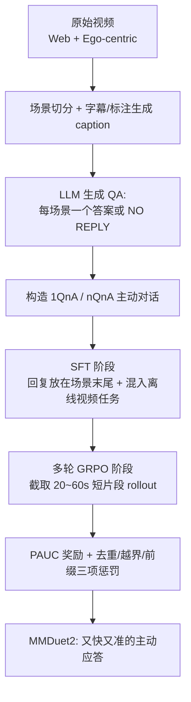

# MMDuet2: Enhancing Proactive Interaction of Video MLLMs with Multi-Turn Reinforcement Learning

**会议**: ICLR 2026  
**OpenReview**: [https://openreview.net/forum?id=rxQnMSNCUs](https://openreview.net/forum?id=rxQnMSNCUs)  
**代码**: 待确认  
**领域**: 多模态视频 MLLM / 流式主动交互  
**关键词**: Proactive Interaction, Video MLLM, Streaming Video, Multi-turn RL, GRPO, PAUC Reward  

## 一句话总结
MMDuet2 把流式视频的"何时该开口回复"这件事改写成纯文本的多轮对话——每个 user turn 喂 1~2 帧、assistant 自己决定输出回复还是 "NO REPLY"，再用一套以 PAUC 为核心、无需精确回复时间标注的多轮 GRPO 奖励训练模型，让 3B 视频 MLLM 在 ProactiveVideoQA 上又快又准地主动应答。

## 研究背景与动机
**领域现状**：视频多模态大模型（Video MLLM）已经能很好地理解视频并做多模态对话，但绝大多数系统是 turn-based 的——只能在用户说完话后才回复。而"主动交互"（proactive interaction）要求模型在视频边播放边自己判断**什么时候该开口、说什么**，适合直播分析、智能监控、第一视角助手等实时场景。

**现有痛点**：以 VideoLLM-Online、MMDuet、Dispider 为代表的主动交互方法，普遍靠预测一个"回复概率分数"（额外模块、特殊 token 概率或视觉 token 丢弃率），再和一个**人工设定的阈值**比较来决定是否回复，这带来两个老大难：
- **阈值难调**：阈值设不好，模型要么永远不回复，要么反复输出重复内容。
- **回复时间标注难**：用 SFT 训练需要每条回复的精确时间戳，但场景切分通常不够细粒度，没法把回复正好插在相关画面出现的那一帧，导致模型回复总是"慢半拍"。

**核心矛盾**：主动交互的理想体验是"既正确又尽早"地回复，但**精确的 ground-truth 回复时刻几乎无法自动标注**（场景级 caption 只能告诉你"这一段在做菜"，却说不清"哪一帧加了鱼露"）。

**本文目标**：在不需要标注精确回复时刻的前提下，训练一个回复又及时又准确、且不啰嗦重复的主动视频 MLLM。

**核心 idea**：**【纯文本化】** 把回复时机决策塞进标准 chat 模板——user turn 给少量帧，assistant turn 自主输出文本或 "NO REPLY"，从而兼容几乎所有现成训练/推理框架；**【RL 绕过时刻标注】** 用一套受 PAUC 指标启发、判断"两个回复哪个更好"的相对奖励做多轮 GRPO，让模型自己摸索出"在观察到事件后最早能回复的时刻"，把精确时间标注的需求彻底去掉。

## 方法详解

### 整体框架
MMDuet2 以 Qwen2.5-VL 3B 为底座，分两阶段训练：先用自建的 52k 视频主动对话数据做 **SFT** 打底，再用 **多轮 GRPO** 强化回复时机与质量。推理时，视频按固定间隔（2 秒）采帧，每个 user turn 喂入 1~2 帧，assistant 在每一轮都被迫做一次"回复 or NO REPLY"的二选一决策，整个交互被格式化成标准的多轮对话。

### 关键设计

**1. 纯文本 chat 模板把"回复时机"变成普通对话轮：** MMDuet2 不再像前作那样改架构去预测概率分数，而是设计了一套主动对话 chat 模板：系统消息先声明"基于持续流入的视频帧回答问题，若本段视频无法回答就输出 NO REPLY"，随后 user turn 输入 1~2 帧（可选附带文本），assistant turn 自主生成回复文本或 "NO REPLY"，循环直到所有帧输入完毕。每一轮的视频时刻可由"该轮之前的帧数 × 帧间隔"直接算出（如 1 fps 时第 4 帧对应第 4 秒）。这套设计的最大好处是把视频输入、用户输入、回复时机决策、回复内容生成全部统一成 user/assistant 消息，**天然兼容几乎所有主流后训练与推理框架**，无需对模型结构或代码做大改；专门的系统消息还能区分"主动任务"与"离线理解任务"的上下文，缓解主动训练对离线能力的灾难性遗忘。

**2. PAUC 启发的多轮 RL 奖励，绕过精确时刻标注：** 这是全文核心。作者注意到——精确回复时刻难标，但"两个回复哪个更好"却容易判断：同样时间下分数高的更好，同样分数增益下回复越早越好。于是奖励借鉴 PAUC（Proactive Area Under Curve）：在每个 ground-truth 回复时间段 $(t_{start}, t_{end})$ 内，模型可能在若干时刻 $\tau_p$ 给出回复，每条回复由 LLM 打一个正确性分数 $s_p \in [0, S]$，把分数随时间画成折线，PAUC 即折线下面积与最大可能面积之比：

$$\text{PAUC} = \frac{(\tau_1 - t_{start})\times 0.5 + \sum_{p=1}^{P-1}(\tau_{p+1}-\tau_p)\times s_p + (t_{end}-\tau_P)\times s_P}{(t_{end}-t_{start})\times S}$$

其中起点处加一个 0.5 的初始分（否则模型输出一个 $s=0$ 的烂回复会比什么都不说还差）。这个面积同时满足"分数越高、回复越早面积越大"两个偏好，让模型自己去找"观察到事件后最早能正确回复的时刻"。作者还做了两处微调以放大不同 rollout 的优势：用 $S=4$（而非原版的 2），且每次只用当前轮回复算相似度而非累积所有历史回复，得到 $r_{PAUC}$。

**3. 三项行为惩罚奖励抑制重复与越界：** 仅靠 $r_{PAUC}$ 会诱发 reward hacking——疯狂刷回复来堆面积。于是叠加三项惩罚（均取"违规回复数占总回复数比例"的反比）：**去重奖励 $r_{rep}$**（用 LLM 判断本条回复信息是否已被先前回复覆盖，鼓励关注新信息）、**越界奖励 $r_{in\_span}$**（惩罚落在任何 ground-truth 时间段之外的回复）、**前缀奖励 $r_{pfx}$**（惩罚那些先把前一条回复整段重复一遍再加新内容的啰嗦回复，用最长公共前缀超阈值来识别）。总奖励为加权和：

$$r = \omega_{PAUC}\, r_{PAUC} + \omega_{rep}\, r_{rep} + \omega_{in\_span}\, r_{in\_span} + \omega_{pfx}\, r_{pfx}$$

前一项倾向多回复、后三项倾向少回复，二者形成"信息量 vs 简洁"的权衡。实践发现让前者影响略强于后者最好，这样模型能从 SFT 后的"低频、高延迟"逐步转向"高频、及时"的回复，又不至于靠刷冗余回复作弊。超参搜索得到 $\omega_{PAUC}=3,\ \omega_{rep}=2,\ \omega_{in\_span}=0.5,\ \omega_{pfx}=2$。

**4. 短片段 rollout 缓解时序信用分配：** 一整段视频含多个 ground-truth 回复段，若整段 rollout 只给一个平均奖励会非常稀疏，且不同段奖励独立计算会带来时序信用分配难题。因此每步只从视频里截取 20~60 秒的短片段做训练，并把片段之前的对话轮直接喂入 ground-truth 回复作为上下文。用 GRPO（rollout 数为 4），基于 SGLang + verl 框架，在 8 张 H800 上训练约 20 小时。

## 实验关键数据

### 主实验（ProactiveVideoQA，指标 PAUC↑ / 回复重复比例↓）

| 模型 | [WEB] | [EGO] | [TV] | [VAD] |
|---|---|---|---|---|
| VideoLLM-Online† | 25.9 / - | 25.0 / - | 18.3 / 53.9 | 25.0 / - |
| MMDuet | 38.9 / 81.3 | 46.0 / 99.4 | 21.1 / 92.8 | 27.4 / 99.2 |
| MMDuet2 sft (Ours) | 37.6 / 1.7 | 26.4 / 4.4 | 27.6 / 2.2 | 26.3 / 0.0 |
| **MMDuet2 rl (Ours)** | **53.3 / 4.2** | **33.6 / 8.1** | **43.4 / 1.0** | **28.9 / 15.2** |

RL 版在 PAUC 上全面领先，且回复重复比例从 MMDuet 的 80~99% 骤降到个位数。MMDuet 在 [EGO] 上看似不低，但靠的是疯狂刷重复回复（重复比例 99.4%）。StreamingBench 主动输出任务（Acc）上 MMDuet2 rl 达 34.69，高于 MMDuet 的 29.44 与 Dispider 的 25.34。

### 消融实验（去掉单个奖励项，PAUC↑ / 重复比例↓ / 回复轮数）

| 配置 | [WEB] | [EGO] |
|---|---|---|
| MMDuet2 完整 | 53.3 / 4.2 / 3.3 | 33.6 / 8.1 / 3.5 |
| − $r_{rep}$ | 55.5 / **17.3** / 4.9 | 35.6 / **31.9** / 8.0 |
| − $r_{pfx}$ | 53.0 / 4.3 / 3.1 | 27.5 / 2.3 / 0.6 |
| − $r_{in\_span}$ | 62.7 / 9.6 / 8.4 | **FAIL** |

去掉 $r_{rep}$ 重复比例飙升；去掉 $r_{in\_span}$ 在 [EGO] 上直接崩溃（几乎每轮都回复，单条样本推理超 20 分钟），印证三项惩罚各司其职。

### 关键发现
- **离线能力几乎无损**：在 Video-MME / MVBench / LongVideoBench 上，MMDuet2 与原始 Qwen2.5-VL 3B 基本持平（如 MVBench 66.4 vs 65.6），说明系统消息隔离 + 混入离线数据有效缓解了遗忘。
- **推理速度可接受**：[WEB] 上 MMDuet2 回复轮数更少（3.3 vs 5.7），wall time 2m52s 与 MMDuet 的 2m27s 相当，即便每轮都要完整生成一次（哪怕只输出 "NO REPLY"）也没明显变慢。
- **VAD 仍是难点**：所有模型在监控视频（[VAD]）上都偏弱，说明流式监控理解仍待突破。

## 亮点与洞察
- **范式转换**：把"回复时机决策"从需要改架构的概率分数+阈值，彻底降维成纯文本对话轮的二选一，工程上几乎零成本接入现成框架，这种"用更笨但更通用的接口换可训练性/可部署性"的取舍很务实。
- **用相对偏好绕开绝对标注**：精确时刻难标，但"哪个回复更好"易判——PAUC 奖励把这个 insight 数学化，是 RL 解决"无 ground-truth 时刻"问题的漂亮范例。
- **惩罚项设计有的放矢**：去重/越界/前缀三项分别精准打击主动交互最常见的三种退化行为，消融显示每一项都不可或缺，体现作者对该任务失败模式的深刻理解。

## 局限与展望
- **底座偏小**：仅在 Qwen2.5-VL 3B 上验证，更大模型上 RL 增益是否同样显著、是否会触顶尚不清楚。
- **奖励依赖 LLM 打分**：正确性分数与去重判断都靠 LLM 评判，引入额外成本与潜在偏差，奖励质量受裁判模型上限制约。
- **每轮完整生成的开销**：纯文本模板虽通用，但每个决策点都要完整 generate 一次"NO REPLY"，作者也承认存在更高效的时机决策策略（留待附录/未来），长视频/高帧率下成本可能放大。
- **监控等难域仍弱**：[VAD] 上整体偏低，主动交互在异常检测类场景的实用性还需提升。

## 相关工作与启发
- **主动视频交互**：VideoLLM-Online 最早改造视频 MLLM 做主动问答，MMDuet 扩大任务范围但仍受回复时机不准、输出冗余困扰，Dispider 解耦感知/决策/反应，TimeChat-Online 主打 token 压缩；ProactiveVideoQA 提出 PAUC 指标——MMDuet2 正是把这个评测指标反向用作训练奖励。
- **视频 MLLM 上的 RL**：Video-R1（T-GRPO 利用帧序）、VideoChat-R1、LongVILA-R1、R1-Omni 等已把 GRPO/RLVR 引入视频理解，但都未触及实时/多轮主动交互——MMDuet2 填补了"RL × 流式主动对话"这一空白。
- **启发**：当某个目标（如"最早正确回复时刻"）难以直接监督时，不妨退一步寻找一个易判断的**相对偏好信号**，再用 RL 把它优化出来；同时主动配套若干"反退化"惩罚项防止 reward hacking，是这类生成式交互任务的通用配方。

## 评分
- **新颖性**: ⭐⭐⭐⭐ —— 纯文本化主动交互模板 + PAUC 反向用作多轮 RL 奖励，绕开精确时刻标注，组合新颖且切中痛点。
- **实验充分度**: ⭐⭐⭐ —— 两个主动 benchmark + 离线能力保持 + 速度 + 逐项奖励消融较完整，但仅 3B 单底座、对比基线偏少（受可复现代码限制）。
- **写作质量**: ⭐⭐⭐⭐ —— 动机—方法—奖励设计层层递进，chat 模板与 PAUC 图示清晰，失败模式分析到位。
- **价值**: ⭐⭐⭐⭐ —— 给实时主动视频助手提供了一条工程友好、可训练、可部署的路线，对流式 Video MLLM 落地有实际参考价值。

<!-- RELATED:START -->

## 相关论文

- [\[ICLR 2026\] Enhancing Geometric Perception in VLMs via Translator-Guided Reinforcement Learning](enhancing_geometric_perception_in_vlms_via_translator-guided_reinforcement_learn.md)
- [\[CVPR 2026\] TempR1: Improving Temporal Understanding of MLLMs via Temporal-Aware Multi-Task Reinforcement Learning](../../CVPR2026/multimodal_vlm/tempr1_improving_temporal_understanding_of_mllms_via_temporal-aware_multi-task_r.md)
- [\[ICLR 2026\] GuirlVG: Incentivize GUI Visual Grounding via Empirical Exploration on Reinforcement Learning](guirlvg_incentivize_gui_visual_grounding_via_empirical_exploration_on_reinforcem.md)
- [\[CVPR 2026\] MuCo: Multi-turn Contrastive Learning for Multimodal Embedding Model](../../CVPR2026/multimodal_vlm/muco_multi-turn_contrastive_learning_for_multimodal_embedding_model.md)
- [\[ICLR 2026\] Breaking the SFT Plateau: Multimodal Structured Reinforcement Learning for Chart-to-Code Generation](breaking_the_sft_plateau_multimodal_structured_reinforcement_learning_for_chart-.md)

<!-- RELATED:END -->
