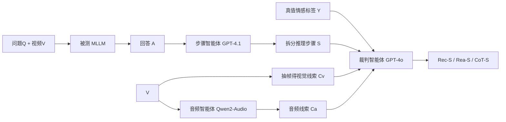

# MME-Emotion: A Holistic Evaluation Benchmark for Emotional Intelligence in Multimodal Large Language Models

**会议**: ICLR 2026  
**OpenReview**: [https://openreview.net/forum?id=oSX9aenbea](https://openreview.net/forum?id=oSX9aenbea)  
**代码**: [https://mme-emotion.github.io/](https://mme-emotion.github.io/)  
**领域**: 多模态大模型 / 情感计算 / 评测基准  
**关键词**: 情感智能, MLLM, 评测基准, 多智能体评测, MLLM-as-judge, 情感推理  

## 一句话总结
MME-Emotion 构建了迄今最大的多模态大模型情感智能基准——6500 段视频、8 类情感任务、27 种场景，并配套一个免人工标注的多智能体评测套件（识别分/推理分/CoT 分三统一指标），评测 20 个前沿 MLLM 后发现：当前模型情感智能远未达标，最强的 Gemini-2.5-Pro 也只有 39.3% 识别分。

## 研究背景与动机
**领域现状**：情感计算正从单纯的"情感识别"转向"理解情绪背后的触发因素"，MLLM 让这一转变成为可能——通用模型（Gemini、GPT 系列）凭借大规模预训练把情感智能当作副产品涌现出来，而小参数专家模型（R1-Omni、AffectGPT 等）则通过情感领域的后训练适配获得能力。

**现有痛点**：已有情感基准存在两大结构性缺陷——**(a) 场景覆盖不足**（多数只含 1-3 个任务、单一模态、采集于 LLM 时代之前）；**(b) 评测协议不统一**且**只评识别、不评推理**。这导致一个根本性问题：在开放、公平的设定下，当今 MLLM 究竟有多少情感智能，没人说得清。

**核心矛盾**：情感推理能力的评测天然困难——它需要逐步判断模型是否抓对了情绪线索，但人工标注每一步推理的对错代价极高，且现有基准根本没有推理质量这个维度。

**本文目标**：建一个同时覆盖识别准确度与推理质量、跨任务统一协议、可扩展的全面情感智能基准。

**核心 idea**：**[免标注多智能体评测]** 用 MLLM-as-judge + 分而治之的多智能体框架，把"视频→识别+逐步推理评分"自动化，无需人工标注 ground-truth 推理步骤，并用五位人类专家交叉验证证明其与人判一致。

## 方法详解

### 整体框架
MME-Emotion 由两部分组成：**基准数据**（从公开数据集聚合重采样出 6500 段视频片段 + QA 对，覆盖 8 任务 27 场景，全部取自测试集以防数据泄露）和**评测套件**（一套多智能体系统，对任意 MLLM 的回答自动打三个统一分数）。评测流程是：先让被测 MLLM 对问题生成回答，再用一个"步骤智能体"把回答切成离散推理步骤，最后用"裁判智能体"结合视觉线索、音频线索、真值标签给每步打分。

### 关键设计
**1. 八任务二十七场景的基准构建：把"开放情感任务"压成闭集 QA 防作弊**。作者从十余个公开情感数据集聚合重采样，把每段视频按时间戳和情绪一致区间切片，再用提示模板转成 QA 格式。关键考量有两点：其一，鉴于当前 MLLM 还处理不了开放式情感生成，作者把所有候选情感标签作为预定义标签集塞进提示，强制模型在闭集里预测，从而让识别分可量化；其二，所有样本只从各数据集的测试集抽取，避免模型训练时见过而造成泄露。最终覆盖 ER-Lab、ER-Wild、Noise-ER、FG-ER、ML-ER、SA、FG-SA、IR 八类任务，每任务至少 500 对 QA，视频平均时长 >3.3 秒，问题量与时长分布均衡。

**2. 分而治之的多智能体裁判：绕过"单模型吃不下全模态"的工程现实**。理想的裁判应同时拿到视觉、音频、文本三路线索才能少误判，但主流多模态模型（如 GPT-4o）当下没法一次吞全部模态。作者的解法是分而治之：视觉线索直接把视频抽帧 $C_v=\text{Convert}(V)$ 喂给裁判；音频线索则另起一个音频语言模型 $C_a=\text{Audio-LLM}(P_a,V)$ 专门抽取（用 Qwen2-Audio）。两路线索就位后，连同被测模型的回答步骤 $S$ 和真值标签 $Y$ 一起送进裁判 $\text{Rec-S},\text{Rea-S}=\text{Judge-MLLM}(P_j,C_v,C_a,Y,S)$（裁判用 GPT-4o）。这样既保住了多模态完整性，又规避了单模型能力瓶颈。

**3. 三统一指标：把"答得对"与"想得对"解耦再加权**。步骤抽取时约定把任务预测固定放在最后一步、其余步骤视为推理过程。**识别分**比对最后一步与真值——单标签任务用标准准确率，多标签任务用"答对数/真值总数"。**推理分**把每个推理步当二分类、由裁判判对错，再对所有步取平均（避免步数差异引入偏置）。**CoT 分**是二者加权：

$$\text{CoT-S}=\alpha\cdot\text{Rec-S}+(1-\alpha)\cdot\text{Rea-S},\quad \alpha=0.5$$

这样一个分数同时反映了识别准确度与推理质量。

**4. 五专家人类验证：用强一致性给自动评测背书**。作者担心 MLLM-as-judge 不可靠，于是请五位专家对 100 个随机抽样问题里的 373 条推理步骤逐步打分，再与 GPT 分数比对。结果三项统计指标都极强：Spearman 秩相关 0.9530、Cohen's Kappa 0.8626（"几乎完美一致"）、组内相关系数 ICC 0.9704，从而证明自动评测与人判高度对齐，可放心规模化使用。

## 实验关键数据

### 主实验表格（MME-Emotion 总体性能，%）

| 模型 | 类型 | 规模 | Rec-S | Rea-S | CoT-S |
|------|------|------|------|------|------|
| Gemini-2.5-Pro | 闭源 | — | **39.3** | 72.7 | **56.0** |
| Audio-Reasoner | 开源 | 7B | 38.1 | **71.6** | 54.8 |
| GPT-4o | 闭源 | — | 27.8 | **79.8** | 53.8 |
| Qwen2.5-VL-72B | 开源 | 72B | 31.3 | 75.7 | 53.5 |
| QVQ | 开源 | 72B | 31.4 | 70.1 | 50.8 |
| Gemini-2.0-Flash | 闭源 | — | 36.3 | 60.0 | 48.1 |
| R1-Omni | 开源 | 0.5B | 26.3 | 58.6 | 42.4 |
| Emotion-LLaMA | 开源 | 7B | 25.1 | 0.4 | 12.8 |
| **全模型平均** | — | — | 29.4 | 49.5 | 39.5 |

所有被测模型识别分都 <40%，多数闭源模型 CoT 分也 <40%，凸显基准难度。

### 消融实验表格（关键观察对照）

| 观察维度 | 现象 | 启示 |
|---------|------|------|
| 全模态 vs 双模态 | 仅用音频+文本的 Audio-Reasoner CoT 54.8%；全模态 omnimodal 模型反而掉点 | 多模态线索存在冗余/冲突，现有融合策略不鲁棒 |
| 推理步数 vs 性能 | 步数与 CoT 分整体正相关 | 鼓励更深推理能提升情感智能 |
| ER-Wild vs ER-Lab | 实验室受控场景普遍掉点 | 模型多在野外数据上训练，难泛化到受控环境 |
| FG-SA / IR | 最强模型识别分也仅约 30% | 细粒度情感与意图识别仍是硬骨头 |

### 关键发现
- **现状不容乐观**：即便最强模型识别分也不到 40%，SOTA MLLM 的情感智能尚处早期阶段。
- **两条可行路径**：通用模型靠泛化能力涌现情感智能，专家模型靠领域后训练适配——殊途同归，不存在唯一解。
- **视觉感知是瓶颈**：失败案例显示 Video-LLaMA2、Qwen2.5-Omni 常因抓不住细微表情变化而误判。

## 亮点与洞察
- **免标注评推理**：用多智能体 + 步骤拆分把"推理质量"这个一向需人工标注的维度自动化，且用五专家三指标背书一致性，是本文最具复用价值的方法论贡献。
- **分而治之破工程瓶颈**：把"单模型吃不下全模态"的现实约束，用音频智能体外挂的方式优雅绕开，是务实且可迁移的设计。
- **规模与难度兼具**：6500 视频 8 任务 27 场景，且全模型 <40% 识别分，说明基准既大又有区分度，不会很快饱和。
- **反直觉发现**：全模态模型反而不如双模态模型，揭示了当前多模态情感融合的真实短板。

## 局限与展望
- **闭集设定的妥协**：把候选标签塞进提示强制闭集预测，虽便于量化，但偏离了真实的开放式情感理解，未来开放生成评测仍待解决。
- **裁判依赖商业 API**：步骤智能体（GPT-4.1）、裁判（GPT-4o）、音频智能体（Qwen2-Audio）都是固定选型，评测成本高且可能引入裁判自身偏置，换裁判模型是否稳健未充分讨论。
- **只评不练**：本文是纯评测基准，没有给出如何针对性提升情感智能的训练方案，"鼓励深度推理"等启示仍停留在相关性观察层面。
- **CoT 权重固定**：$\alpha=0.5$ 是默认设定，识别与推理孰轻孰重在不同应用下未必合理。

## 相关工作与启发
- **情感基准谱系**：相比 EmotionBench、EmoBench（纯文本）、MOSABench（图像）、IEMOCAP / MC-EIU / EmoBench-M / MER-UniBench（视频但只评识别），MME-Emotion 是唯一同时具备识别准确度与推理质量评测的基准。
- **专家模型路线**：Emotion-LLaMA（情感专用编码器+指令微调）、R1-Omni（RLVR 强化情感推理）、AffectGPT（大规模情感数据+预融合投影器）代表了后训练适配的不同打法，本文证明它们能与通用大模型掰手腕。
- **启发**：MLLM-as-judge + 多智能体分而治之的评测范式，可迁移到任何"需要多模态完整上下文但单模型吃不下"的评测场景；闭集化 + 测试集隔离的防泄露做法值得其他基准借鉴。

## 评分
- **新颖性**: ⭐⭐⭐⭐ 首个同时覆盖识别+推理的视频情感智能基准，免标注多智能体评测套件是实打实的方法论创新，虽各组件均为已有模型组合。
- **实验充分度**: ⭐⭐⭐⭐⭐ 评测 20 个开源/闭源 MLLM、8 任务 27 场景、五专家三指标交叉验证，分析细致且结论有说服力。
- **写作质量**: ⭐⭐⭐⭐ 结构清晰、图表丰富、观察与启示分层呈现，公式与流程交代到位。
- **价值**: ⭐⭐⭐⭐⭐ 暴露了当前 MLLM 情感智能的真实差距（<40% 识别分），为情感计算社区提供了大而难、可复用的评测标尺，影响面广。

<!-- RELATED:START -->

## 相关论文

- [\[ICLR 2026\] Human-MME: A Holistic Evaluation Benchmark for Human-Centric Multimodal Large Language Models](human-mme_a_holistic_evaluation_benchmark_for_human-centric_multimodal_large_lan.md)
- [\[ICLR 2026\] MMSI-Bench: A Benchmark for Multi-Image Spatial Intelligence](mmsi-bench_a_benchmark_for_multi-image_spatial_intelligence.md)
- [\[ICLR 2026\] Customizing Visual Emotion Evaluation for MLLMs: An Open-vocabulary, Multifaceted, and Scalable Approach](customizing_visual_emotion_evaluation_for_mllms_an_open-vocabulary_multifaceted_.md)
- [\[ICLR 2026\] RAR: Reversing Visual Attention Re-Sinking for Unlocking Potential in Multimodal Large Language Models](rar_reversing_visual_attention_re-sinking_for_unlocking_potential_in_multimodal_.md)
- [\[ICLR 2026\] GranViT: A Fine-Grained Vision Model For Autoregressive Multimodal Large Language Models](granvit_a_fine-grained_vision_model_for_autoregressive_multimodal_large_language.md)

<!-- RELATED:END -->
