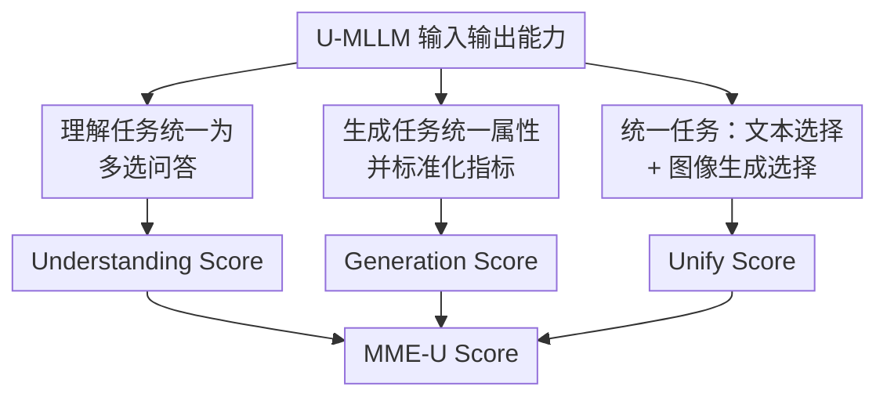

# MME-Unify: A Comprehensive Benchmark for Unified Multimodal Understanding and Generation Models

**会议**: ICLR 2026  
**OpenReview**: [https://openreview.net/forum?id=7x6TxVIarj](https://openreview.net/forum?id=7x6TxVIarj)  
**论文**: [MME-Unify Project](https://mme-unify.github.io/)  
**代码**: https://mme-unify.github.io/（Benchmark 项目页，数据与代码以项目页为准）  
**领域**: 多模态VLM / 统一多模态评测 / 多模态理解生成  
**关键词**: 统一多模态模型, 多模态评测, 图文交错生成, 视觉推理, benchmark  

## 一句话总结
MME-Unify 提出一个面向统一多模态大模型的综合评测基准，把理解、生成以及“先理解推理再生成”的混合模态任务放到同一套可复现评分框架下，发现当前最强 U-MLLM 的总分也只有约 50，尤其在复杂指令跟随和多步视觉状态维护上仍然薄弱。

## 研究背景与动机
**领域现状**：统一多模态大模型（Unified Multimodal Large Language Models, U-MLLMs）试图把传统 MLLM 的图像/视频理解能力和生成模型的图像/视频生成能力合到一个模型里。和只输出文本的 GPT-4V/Qwen2.5-VL 类模型不同，这类模型不仅能看图回答问题，也能生成图像、编辑图像，甚至输出图文交错的结果，例如先分析几何题，再在图上画辅助线。

**现有痛点**：这类模型发展很快，但评测方式仍然碎片化。理解能力通常拿 MMBench、MME、Video-MME 等问答基准测，生成能力又用 GenEval、VBench、图像编辑或视频生成指标测，不同论文选的任务、输入格式和指标都不一样。更麻烦的是，U-MLLM 最有特色的能力并不是“只理解”或“只生成”，而是理解和生成相互配合：模型要先读懂输入和指令，再用视觉输出表达推理结果。此前很多论文主要展示 case study，缺少标准化、可比较的统一任务评测。

**核心矛盾**：统一模型的卖点是跨模态协同，但现有 benchmark 大多把能力拆开测；如果只看理解分数，会漏掉模型是否真的能生成视觉结果；如果只看生成质量，又看不出模型是否理解了题目和约束。评测体系需要同时解决两个问题：一是把传统理解/生成任务统一到可比较的尺度上，二是设计能够真正逼迫模型“理解 + 推理 + 生成”的任务。

**本文目标**：作者希望构建一个开放、可复现的 benchmark，用统一格式覆盖三类能力：多模态理解、多模态生成、以及混合模态统一任务。它不仅要给出一个总榜单，还要能指出模型到底弱在理解、生成、指令遵循、多步状态维护，还是文本与图像输出的一致性。

**切入角度**：论文没有另起炉灶重造所有数据，而是从已有成熟数据集里抽取理解和生成样本，再对属性、题型和评分方式做统一；对于传统 benchmark 覆盖不到的统一能力，则人工设计 5 类新任务，让模型必须同时输出文本选择和视觉结果。这样既能继承已有 benchmark 的覆盖面，又能补上 U-MLLM 专属能力的空白。

**核心 idea**：MME-Unify 用“统一任务格式 + 标准化分数 + 文本/图像双选择评测”把 U-MLLM 的理解、生成和跨模态协同能力放到同一个坐标系里，从而把过去靠样例展示的能力变成可量化、可复现的排行榜。

## 方法详解

### 整体框架
MME-Unify 的整体流程可以看作三层评测：第一层评估模型看图、看多图、看视频并回答问题的理解能力；第二层评估模型生成图像/视频、编辑图像、重建图像的生成能力；第三层设计统一任务，让模型在同一个样本里既做文本推理又产出图像结果。最后，论文把三层分数归一到同一量纲，并取平均得到 MME-U 总分。

这个框架的关键不是某个新模型结构，而是评测协议本身。理解任务通过多选题统一输出和准确率；生成任务保留不同子领域常用指标，但把它们归一到 $[0,100]$；统一任务则把视觉生成结果转成类似多选题的判定：模型生成图像后，与多个候选图像计算相似度，最相似的候选被视为模型的隐式选择。

### 关键设计
**1. 三域任务覆盖：把 U-MLLM 的能力拆成理解、生成和统一协同**

MME-Unify 首先把能力空间分成三个域，而不是只做一个混合总榜。理解域包含单图感知与理解（SIPU）、多图与图文交错理解（MITIU）、视频感知与理解（VPU），覆盖 OCR、表格图表、空间关系、动作识别、长视频等场景。生成域包含细粒度图像重建（FIR）、文本引导图像编辑（TIE）、文本到图像（TIG）、条件图像到视频（CIVG）、文本到视频（TVG）和视频预测（VP）。统一域则专门测理解与生成能否互相支撑。

这种拆法解决了一个常见误读：一个模型总分高，不代表所有能力都好。论文的实验显示，一些模型理解强但不能生成图像，一些模型会生成但看不懂复杂输入，还有一些模型虽然能图文交错输出，却在基础理解或高质量生成上掉队。三域分数让这些差异显性化，而不是被一个平均分掩盖。

**2. 传统任务标准化：保留任务多样性，但把输出和分数变得可比较**

对于理解任务，论文从 MME、MMBench、MME-RealWorld、SEED-Bench-2、Video-MME 等数据源抽取 1,964 个 QA 样本，并把不同格式统一改写成多项选择题。每个问题只有一个正确选项，选项顺序会随机打乱，以降低位置偏置。对只支持单图的模型，论文用多图输入的第一张图或视频的第一帧；对不支持视频文件的模型，则均匀抽取六个关键帧作为输入。

对于生成任务，论文面对的是另一类不一致：不同数据集的字段名、输入输出形式和评价指标都不统一。MME-Unify 先做属性统一，把文本提示、源图、参考图、视频等字段整理成统一角色；再为不同子任务写任务专属 prompt，确保模型知道要做重建、编辑、生成还是预测。评分时，FVD/FID、CLIP-I/CLIP-T、LPIPS 等指标先各自按任务计算，再归一到 $[0,100]$，从而避免“不同指标不可直接平均”的问题。

**3. 统一任务构造：用文本选择和图像选择逼迫模型真的完成跨模态推理**

MME-Unify 最有价值的部分是 5 个统一任务。Common Sense QA 要求模型根据常识描述选择正确文本选项，并生成对应图像；Image Editing and Explaining 要求模型解释编辑对象和指令，同时生成编辑后的图像；SpotDiff 要求模型比较两张图、数出差异并把差异区域抽取到白底图上；Auxiliary Lines 要求模型理解几何题、画辅助线并选择答案；Visual CoT 要求模型在迷宫中逐步选择动作、坐标并生成下一步状态图。

这些任务的共同点是，图像输出不是装饰品。比如辅助线任务里，如果模型没有理解几何关系，就很难画出正确辅助线；Visual CoT 中，如果模型无法维护当前迷宫状态，后续动作、坐标和图像都会连锁出错。论文用每个样本的文本正确性和图像正确性同时评估，尤其用 $acc+$ 衡量“文本和图像都对”的比例，因此能区分“会猜文本但不会画图”和“图像看起来像但推理错了”的情况。

**4. 统一评分公式：用离散选择精度连接文本和图像评测**

理解分数是三个理解子任务准确率的平均：$US=\frac{1}{3}\sum_{t\in\{SIPU,MITIU,VPU\}}score_t$。生成分数是六个生成子任务归一化分数的平均：$GS=\frac{1}{6}\sum_{t\in\{CIVG,TVG,VP,FIR,TIE,TIG\}}score_t$。统一任务中，IEE、CSQ、AL、SD 都有文本和图像两个问题，单任务准确率定义为 $acc_t=(acc_t^{text}+acc_t^{img})/2$，而 $acc_t^+$ 要求同一样本的文本与图像同时正确。

Visual CoT 更复杂，因为每个样本有多步，每步都要预测 action、coordinate 和 image。论文分别计算三类 step-level accuracy，再取平均作为 VCoT 的 $acc$；只有整条轨迹每一步都完全正确，才算 $acc+$ 成功。最终统一分数为 5 个统一子任务 $acc$ 的平均，MME-U 总分为 $MME\text{-}U=\frac{1}{3}(US+GS+Unify\text{-}S)$。这个设计牺牲了一些连续评分的细粒度解释性，但换来了跨任务、跨模态、跨模型的统一排行榜。

## 实验关键数据

### 主实验
论文评测了 31 个模型，其中包括传统理解模型、专门生成模型和 17 个 U-MLLM。主表最重要的结论是：当前没有一个模型能在理解、生成、统一任务三方面同时接近饱和，榜首模型也只到 50 分左右。

| 模型 | Understanding | Generation | Unify | MME-U Score | 主要观察 |
|------|---------------|------------|-------|-------------|----------|
| Gemini2.5-flash-image | 69.93 | 34.09 | 47.02 | 50.04 | 总分最高，三域较均衡，但离满分仍远 |
| Gemini2.0-flash-exp | 65.24 | 29.79 | 40.74 | 45.57 | 统一任务强于多数开源模型 |
| RecA | 63.01 | 27.36 | 37.45 | 42.60 | 开源/可生成模型中较强，理解与统一任务较稳 |
| GPT-4o-Image | 53.35 | 28.72 | 41.10 | 41.06 | 统一任务图像准确率较强，但理解均分低于 Gemini/RecA |
| Bagel | 60.26 | 24.98 | 35.80 | 40.35 | 采用理解/生成分离视觉编码思路，整体较均衡 |
| MIO-Instruct | 41.50 | 53.45 | 16.56 | 37.17 | 基础生成覆盖面强，但统一任务协同弱 |
| SEED-LLaMA | 39.48 | 23.54 | 22.32 | 28.45 | 能做图文交错，但总体仍有限 |
| Anole | 13.56 | 19.91 | 22.30 | 18.59 | 统一任务有一定能力，基础理解很弱 |

生成任务的细分结果也很有意思。MIO-Instruct 是少数覆盖 CIVG、TIE、TIG、TVG、VP 等多种生成任务的模型，Generation Score 达到 53.45；但它在统一任务中经常文本能答、图像不能同步生成，因此 Unify Score 只有 16.56。这说明“覆盖很多生成任务”不等价于“能把理解和生成绑定起来”。

| 任务/模型 | Gemini2.5-flash-image | Gemini2.0-flash-exp | RecA | Bagel | MIO-Instruct | 备注 |
|-----------|------------------------|----------------------|------|-------|--------------|------|
| TIG 平均分 | 66.29 | 57.56 | 46.30 | 44.51 | 48.23 | 闭源模型在复杂文本到图像细节上明显领先 |
| TIE/FIR 覆盖 | FIR 85.32 | FIR 77.61 | FIR 60.97 | FIR 59.91 | FIR 59.29 / TIE 43.66 | 不同模型支持的生成任务不完全相同 |
| 视频相关任务 | - | - | - | VP 59.91 | CIVG 51.24 / TVG 51.88 / VP 66.37 | 开源 U-MLLM 对视频生成支持仍稀缺 |
| Generation Score | 34.00 | 29.79 | 27.36 | 24.98 | 53.45 | 分数受任务覆盖范围影响，需要结合能力边界解读 |

### 消融实验
这篇论文不是提出新模型，因此没有传统意义上的模块消融。更接近“设计有效性分析”的部分包括 split-half 稳定性、统一任务评测策略对比、CLIP-I 与人工/LLM judge 的一致性，以及随机/人类 baseline 校准。

| 分析项 | 设置 | 关键结果 | 说明 |
|--------|------|----------|------|
| Split-half 稳定性 | 将 benchmark 样本减半，对 MiniGPT5/Anole/SEED-LLaMA/MIO-Instruct 重评 | 总体排名与完整数据基本一致 | 样本规模和评分方式能给出稳定模型排序 |
| CLIP-Choice vs Select-Choice | 统一任务中比较“生成图像后用 CLIP-I 匹配候选”和“直接看候选图选择” | Select-Choice 准确率更高，但偏离生成评测目标 | 直接选择更像识别题，不能检验模型自身生成是否正确 |
| CLIP-I 与人工评分 | 200 个统一任务样本，3 位专家按文本跟随、图像质量、参考相似度打分 | 总体 Kendall’s $\tau_b=0.709$ | 在本文任务设计下，CLIP-I 排序与人工判断有较强相关 |
| CLIP-I 与 LLM-Judge | 5 个强 U-MLLM，用 GPT-4o judge 对图像生成评分 | 总体排名与 CLIP-I 基本一致 | CLIP-I 作为低成本离散评测有一定可靠性 |
| 随机/人类 baseline | 随机选择 vs 两位专家 | 人类在 IEE/CSQ/AL/VCoT 远高于模型；模型在 SD/VCoT 接近随机 | 统一任务确实有区分度，也暴露当前模型短板 |

### 关键发现
- 当前 U-MLLM 还处在早期阶段。即使榜首 Gemini2.5-flash-image 的 MME-U 总分也只有 50.04，说明统一理解与生成并没有因为模型规模或闭源能力自然解决。
- 理解和生成之间存在明显 trade-off。一些模型为了生成采用离散图像 tokenizer，理解语义特征较弱；一些模型使用分离视觉编码器后理解增强，但生成或统一任务支持不足。
- 统一任务比传统理解/生成任务更能暴露问题。CSQ 这类较简单任务上强模型可以拿到较高 $acc+$，但在 Auxiliary Lines、SpotDiff、Visual CoT 上，文本推理、视觉定位和生成一致性经常同时崩掉。
- Visual CoT 是最尖锐的诊断任务。模型在第 1-2 步尚可，但坐标和图像准确率从后续步骤开始断崖式下降，说明它们缺少可靠的多步视觉状态维护能力。
- 图像生成的指令跟随仍是瓶颈。很多模型能生成“像图”的结果，却忽略文字、数字、辅助线、指定区域和风格约束；在统一任务中，这种偏差会直接导致文本和图像答案不一致。

## 亮点与洞察
- 论文最大的亮点是把 U-MLLM 的“统一能力”从展示样例拉回到可复现评测。过去很多模型论文会展示几张图文交错案例，但 MME-Unify 用文本选择、图像选择和 $acc+$ 明确要求同一个样本里两种输出都正确。
- 任务设计很有诊断性。Auxiliary Lines 和 Visual CoT 不是普通图像生成题，而是先要求模型建立视觉/几何/状态理解，再把推理结果画出来；这比单纯 text-to-image prompt 更接近统一多模态模型声称要解决的问题。
- 评分体系在工程上务实。作者没有强行用一个指标评价所有视觉输出，而是传统生成任务保留领域指标、统一任务用候选图像把图像生成离散化。这种折中让 benchmark 可以规模化跑 31 个模型，也能和文本多选题放在同一排行榜里。
- MME-Unify 提供了一个很有启发的模型分析角度：不要只问模型是否“支持”图像生成，而要问它能否在理解之后生成正确图像。MIO-Instruct 的结果尤其说明，任务覆盖面和统一协同能力是两回事。
- 对未来模型训练也有提示。若统一任务的失败主要来自视觉状态维护、图像细节对齐和复杂指令跟随，那么仅靠更大规模图文对预训练可能不够，还需要面向多步视觉推理、生成后自检和跨模态一致性的训练目标。

## 局限与展望
- 统一任务中的图像评测被简化为 CLIP-I 候选匹配，这带来可扩展性，但也可能被“相似但不真正正确”的图像钻空子。论文自己也指出，未来需要引入更严格的 MLLM judge、CLIP 分数组合或人工校准来降低 score hacking。
- 生成任务的覆盖与模型能力边界耦合较强。有些模型无法完成某类视频生成或图文交错生成，表中以 “-” 处理；这能反映能力缺失，但也让总分解释需要谨慎，因为低分可能来自性能差，也可能来自接口/能力不支持。
- 统一任务样本数量仍然偏小。IEE 有 200 个样本，CSQ/SD/Visual CoT 大约百级，Auxiliary Lines 只有 52 个；虽然 split-half 分析显示整体排名稳定，但细分任务的置信区间和长尾场景仍值得扩展。
- 任务主要围绕图像/视频与文本，尚未覆盖音频、3D、机器人操作等更广义的统一多模态输出。随着 U-MLLM 往世界模型和具身智能扩展，benchmark 也需要继续扩展到更复杂的交互环境。
- 候选式评测降低了开放生成的难度。模型只需生成最接近正确候选的图像，而不是在完全开放空间中达到人类可接受质量；未来可以同时报告候选式 accuracy 和开放式质量评分，避免过度乐观。

## 相关工作与启发
- **vs MME / MME-RealWorld / MMBench**: 这些 benchmark 主要衡量多模态理解，输出通常是文本或选项。MME-Unify 继承了它们的多选题优点，但进一步加入生成和统一任务，因此更适合评价能输出图像/视频的 U-MLLM。
- **vs SEED-Bench-2 / MMIE**: 这类工作已经开始覆盖理解和生成，但统一任务范围有限，不能系统检验“理解之后生成”的协同能力。MME-Unify 的 IEE、AL、SD、VCoT 更直接地把文本推理和视觉生成绑定在一起。
- **vs GenEval / VBench / MagicBrush**: 这些 benchmark 在图像或视频生成子领域更专业，指标也更贴近单任务质量。MME-Unify 的目标不是替代它们，而是把多种生成任务标准化后放进统一模型评测框架。
- **vs Wise 等文本到图像语义评测**: Wise 更关注图像生成是否包含世界知识和语义一致性，而 MME-Unify 还要求模型处理输入图像、文本问题、候选答案和视觉输出之间的组合关系，任务形态更接近统一多模态交互。
- **启发**: 后续做 U-MLLM 训练时，可以把 MME-Unify 当作诊断面板：理解差就看 SIPU/MITIU/VPU，生成差就看 FIR/TIE/TIG/视频任务，协同差就重点看 $acc+$、Auxiliary Lines 和 Visual CoT。对 benchmark 设计者来说，它也展示了如何用候选图像把开放生成任务转成可复现的离散评测。

## 评分
- 新颖性: ⭐⭐⭐⭐ 论文不是提出新模型，而是把统一多模态模型缺失的 benchmark 系统补齐；统一任务设计有明显新意。
- 实验充分度: ⭐⭐⭐⭐⭐ 覆盖 31 个模型、三大能力域、多个稳定性与评测策略分析，作为 benchmark 论文实验很扎实。
- 写作质量: ⭐⭐⭐⭐ 主线清楚，图表和附录支撑充分；但表格很密，部分生成任务覆盖缺失需要读者自行小心解读。
- 价值: ⭐⭐⭐⭐⭐ 对 U-MLLM 领域很有参考价值，尤其适合作为后续统一理解生成模型的标准诊断集合。

<!-- RELATED:START -->

## 相关论文

- [\[ICLR 2026\] Thinking with Camera: A Unified Multimodal Model for Camera-Centric Understanding and Generation](thinking_with_camera_a_unified_multimodal_model_for_camera-centric_understanding.md)
- [\[ICLR 2026\] UniF2ace: A Unified Fine-grained Face Understanding and Generation Model](unif2ace_a_underlineunified_underlinefine-grained_underlineface_understanding_an.md)
- [\[ICLR 2026\] Lavida-O: Elastic Large Masked Diffusion Models for Unified Multimodal Understanding and Generation](lavida-o_elastic_large_masked_diffusion_models_for_unified_multimodal_understand.md)
- [\[ICLR 2026\] Human-MME: A Holistic Evaluation Benchmark for Human-Centric Multimodal Large Language Models](human-mme_a_holistic_evaluation_benchmark_for_human-centric_multimodal_large_lan.md)
- [\[ICLR 2026\] MME-Emotion: A Holistic Evaluation Benchmark for Emotional Intelligence in Multimodal Large Language Models](mme-emotion_a_holistic_evaluation_benchmark_for_emotional_intelligence_in_multim.md)

<!-- RELATED:END -->
