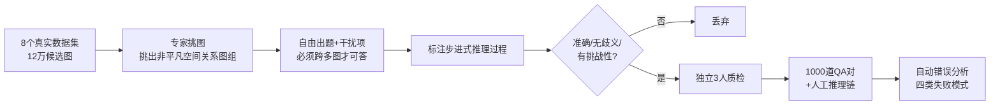

# MMSI-Bench: A Benchmark for Multi-Image Spatial Intelligence

**会议**: ICLR 2026  
**OpenReview**: [https://openreview.net/forum?id=gHRoX4vXm3](https://openreview.net/forum?id=gHRoX4vXm3)  
**代码**: 待确认  
**领域**: 多模态 VLM / 空间智能评测  
**关键词**: 多图空间推理, MLLM 评测, VQA Benchmark, 空间智能, 错误分析  

## 一句话总结
六位 3D 视觉研究者耗时 300+ 小时、从 12 万张真实图像中纯人工打磨出 1000 道**多图空间推理**选择题，构成 MMSI-Bench；37 个主流 MLLM 上最强开源仅 30%、GPT-5 也只有 41.9%，而人类 97%，并配套了一条借助人工推理标注的自动化错误诊断流水线。

## 研究背景与动机
**领域现状**：空间智能（理解物体在哪、怎么动）被视为 MLLM 走向具身智能的核心能力，社区已涌现大量空间推理 benchmark。但**现有痛点**在于：绝大多数基准只考察**单图**内的简单空间关系（如 SpatialVLM、CV-Bench），而真实世界部署要求模型跨多张图像追踪物体与自身运动、关联从未在同一帧共现的实体。

**核心矛盾**：少数多图基准要么只是通用 VQA 套件里的几个零散空间子集（BLINK、MuirBench），要么靠模板/规则从已有标注或仿真器自动生成题目（VSI-Bench、MMIU、SAT、MultiSPA），**多样性和难度都被模板框死**；唯一人工策展的 ERQA 仅 400 题、多图样本只有 113 条。换句话说，社区缺一个**既多样、又准确、又足够难**的多图空间推理标尺。

**本文目标**：构建一个专门面向多图空间智能的 VQA 基准，并量化当前 MLLM 与人类的真实差距。**核心 idea —— 纯人工策展 + 步进式推理标注**：放弃模板，让 3D 视觉专家自己挑图、出题、写推理过程，既保证每道题"必须跨多图才能答"，又用人工推理链支撑后续的自动化错误分析。

## 方法详解

### 整体框架
MMSI-Bench 围绕三类空间基本元素——**相机（观察者）、物体、区域**——的位置、属性、运动，定义出 10 种原子空间推理任务，再加一个把原子任务串成长程问题的**多步推理（MSR）**类别，共 11 类。整条数据生产管线分四步串行推进：构建题型与图像库 → 人工挑图 → 设计 QA 与推理标注 → 多人质检。最终产出 1000 道四选一选择题，每题平均 2.55 张图、配一段平均 252 字的参考推理过程。

### 关键设计

**1. 三元素 × 三维度的任务分类法：把"空间智能"拆成可枚举的题型。** 作者以相机、物体、区域为三个基本元素，沿位置、属性、运动三个维度展开：位置关系细分为 Camera–Camera / Camera–Object / Camera–Region / Object–Object / Object–Region / Region–Region 六种，属性分为几何测量（Measurement）与外观（Appearance），运动分为相机运动与物体运动，外加一个组合式的多步推理。由于相机参数对人不可答、区域天然静止，作者刻意剔除"相机属性"和"区域运动"两类，保证**每题都可被人类回答**。这套分类法让"多图空间推理"从一个模糊概念变成一张可覆盖、可统计的题型表。

**2. 纯人工、无模板的对抗式出题：用专家时间换取多样性与难度。** 每道题由六位标注者之一在图库中翻找，挑出一组**蕴含非平凡空间关系**的图像，再自由设计一道四选一问题——关键约束是"答案只能通过综合所有选中图像跨图推理得到，任何单图都答不出"。干扰项被精心设计为貌似合理的诱饵。这种以人为中心的设计直接对抗模板法的低多样性低难度问题；统计上 1000 题用了 1990 张唯一图像、平均题长 130 字、最长题含 10 张图，覆盖 ScanNet、Matterport3D、nuScenes、Waymo、Ego4D、AgiBot-World、DTU、DAVIS 2017 八个真实数据源，从室内扫描、户外驾驶到机器人操作和日常活动全都纳入。

**3. 步进式推理标注 + 双重质检：让基准既可信又可诊断。** 每道题除答案外都附一段**显式引向正确答案的逐步推理过程**，承担双重作用：质检阶段帮助筛除错误样本，评测阶段成为自动化错误分析的"参考答案"。质检由三位独立于出题者的审阅者系统排查，剔除有语言歧义、视觉信息不足、答案错误、或单图/常识即可答的样本，并按人类答题耗时标注难度。正是这段人工推理链，使得后续把"给模型正确答案让它自检错误类型"的准确率从 53% 提升到 78%——成为整条自动化诊断流水线能跑通的前提。

## 实验关键数据

### 主实验（37 个 MLLM，准确率 %）

| 模型 | 类型 | Avg. | 多步推理 MSR | 相机运动 |
|------|------|------|------|------|
| **Human Level** | 人类 | **97.2** | 97.0 | 98.6 |
| GPT-5 | 闭源推理 | **41.9** | 42.0 | 32.4 |
| o3 | 闭源 | 41.0 | 34.9 | 31.1 |
| GPT-4.5 | 闭源 | 40.3 | 36.4 | 41.9 |
| Gemini-2.5-Pro | 闭源 | 36.9 | 34.3 | 36.4 |
| **Qwen2.5-VL-72B** | 开源最佳 | **30.7** | 27.3 | 27.0 |
| NVILA-15B | 开源 | 30.5 | 27.8 | 18.9 |
| Blind GPT-4o | 盲测基线 | 22.7 | 20.2 | 20.2 |
| Random Guessing | 随机 | 25.0 | 25.0 | 25.0 |

- **最强开源仅 30.7%、最强闭源 41.9%，人类 97.2%**：作者称这是现有空间智能基准中 SOTA 模型与人类差距最大的一个。
- **Blind GPT-4o 仅 22.7%、接近随机**：证明题目确实需要真实视觉-空间推理，无法靠语言先验或常识蒙对。
- **多步推理与相机运动是重灾区**：MSR 普遍低于单步任务；开源模型在相机运动上尤其差，说明 MLLM 作为"具身智能体"难以理解自身运动（推测因缺乏第一人称运动训练数据）。

### 消融与诊断

| 实验 | 设置 | 关键结果 |
|------|------|----------|
| 模型规模 | Qwen2.5-VL 72B vs 32B | 仅 +3%；InternVL3-78B vs 1B 仅 +1.5%，规模收益极小 |
| 空间微调 | Spatial-MLLM / InternSpatial / RoboBrain2.0 | 较 base 仅边际提升甚至下降（27.7 vs 26.5 等） |
| 语言提示 | Zero-Shot CoT | 仅 GPT-4o 略升，其余模型反而掉点 |
| 视觉提示 | PATS 跨图对应连线 | 仅 2 个模型微升，另 2 个下降 |
| 自动错误分析 | 仅给答案 vs 给答案+人工推理链 | 错误类型标注准确率 53% → **78%** |

### 关键发现
- **瓶颈在数据而非规模**：同系列堆参数几乎不涨分，NVILA-15B 甚至超过多数 70B+ 模型，说明当前进步受限于数据质量与多样性。
- **答对≠推理对**：GPT-4.5/GPT-4o/Qwen2.5-VL-72B 的推理准确率（37.5%/29.9%/21.5%）均低于其选择题准确率，Qwen2.5-VL-72B 推理准确率比答题准确率还低约 10%。
- **四类失败模式中"重叠匹配与场景重建错误"占比最大**：跨图对应同一物体、隐式重建场景布局，是所有模型最薄弱环节，也指明了最值得攻关的方向。

## 亮点与洞察
- **"必须跨多图才可答"是这套基准的灵魂约束**：它把单图能力、语言先验、常识捷径全部排除，逼出模型真正的多视图空间重建能力，也解释了为何盲测基线只能拿随机分。
- **人工推理链是一石二鸟的设计**：既在质检期当过滤器，又在评测期当自动诊断的"金标准参考"，把昂贵的人工标注价值复用到了可扩展的错误分析上。
- **"答对但推理错"的现象极具警示性**：选择题准确率高估了模型的真实空间推理能力，提醒后续基准应同时评测推理过程而非只看最终选项。
- **规模/微调/提示三条捷径集体失效**，把矛头明确指向训练数据与架构范式，为社区省去了在错误方向上的试错。

## 局限与展望
- **规模相对有限**：1000 题虽精，但相比模板法动辄数万题，覆盖的长尾场景仍有限，统计显著性在细分类别上可能不足。
- **自动错误分析依赖 GPT-4o 自评，上限 78%**：诊断本身带噪，且高度依赖人工推理链的存在，难以无标注泛化到新基准。
- **只给出"是什么"未给"怎么解"**：基准定位为诊断工具，未提出提升多图空间智能的训练方法；如何注入第一人称运动数据、强化重叠匹配能力仍是开放问题。
- **未来方向**：作者指向架构与训练范式的革新（领域专用数据、跨图对应的显式建模），而非继续依赖提示工程或单纯堆参数。

## 相关工作与启发
- **对比模板法基准（VSI-Bench / MMIU / SAT / MultiSPA）**：本文用专家时间换多样性，验证了"纯人工对抗出题"在制造高难度评测上的不可替代性，对任何想造"难基准"的工作都是参照。
- **对比通用多图 VQA（BLINK / MuirBench / ReMI / MIBench）**：MMSI-Bench 把焦点收窄到空间智能并系统化分类，启发后续可对其他能力维度做同样的"专精化+任务分类法"拆解。
- **对具身/机器人方向的启发**：相机运动任务上的集体失败，直接量化了 MLLM 作为决策"大脑"的短板，提示 VLA、自动驾驶等下游应用需补足第一人称运动理解的训练信号。
- **对评测方法论的启发**：用人工推理链支撑自动化错误诊断、并揭示"答对≠推理对"，为构建"过程可评测"的下一代基准提供了可复制的范式。

## 评分
- **新颖性**: ⭐⭐⭐⭐ 首个专注多图空间智能、纯人工策展并配套推理链与自动错误诊断的 VQA 基准，任务分类法清晰，定位精准。
- **实验充分度**: ⭐⭐⭐⭐⭐ 评测 37 个开源/闭源模型 + 人类与盲测基线，覆盖规模、空间微调、语言/视觉提示四组消融，并做了细到错误类型分布的诊断分析，极为扎实。
- **写作质量**: ⭐⭐⭐⭐ 动机—分类法—构建管线—评测—错误分析逻辑顺畅，图表（题型示例、构建流程、错误类型）信息密度高，易读。
- **价值**: ⭐⭐⭐⭐⭐ 暴露当前 MLLM 在多图空间推理上巨大的"人机鸿沟"，把瓶颈明确指向数据与架构，是具身/空间智能方向极有价值的北极星基准与诊断工具。

<!-- RELATED:START -->

## 相关论文

- [\[ICLR 2026\] On the Generalization Capacities of MLLMs for Spatial Intelligence](on_the_generalization_capacities_of_mllms_for_spatial_intelligence.md)
- [\[CVPR 2026\] Is your VLM Sky-Ready? A Comprehensive Spatial Intelligence Benchmark for UAV Navigation](../../CVPR2026/multimodal_vlm/is_your_vlm_sky-ready_a_comprehensive_spatial_intelligence_benchmark_for_uav_nav.md)
- [\[CVPR 2026\] SpatialScore: Towards Comprehensive Evaluation for Spatial Intelligence](../../CVPR2026/multimodal_vlm/spatialscore_towards_comprehensive_evaluation_for_spatial_intelligence.md)
- [\[CVPR 2026\] Scaling Spatial Intelligence with Multimodal Foundation Models](../../CVPR2026/multimodal_vlm/scaling_spatial_intelligence_with_multimodal_foundation_models.md)
- [\[CVPR 2026\] SpatialTree: How Spatial Intelligence Branches Out in MLLMs](../../CVPR2026/multimodal_vlm/spatialtree_how_spatial_intelligence_branches_out_in_mllms.md)

<!-- RELATED:END -->
