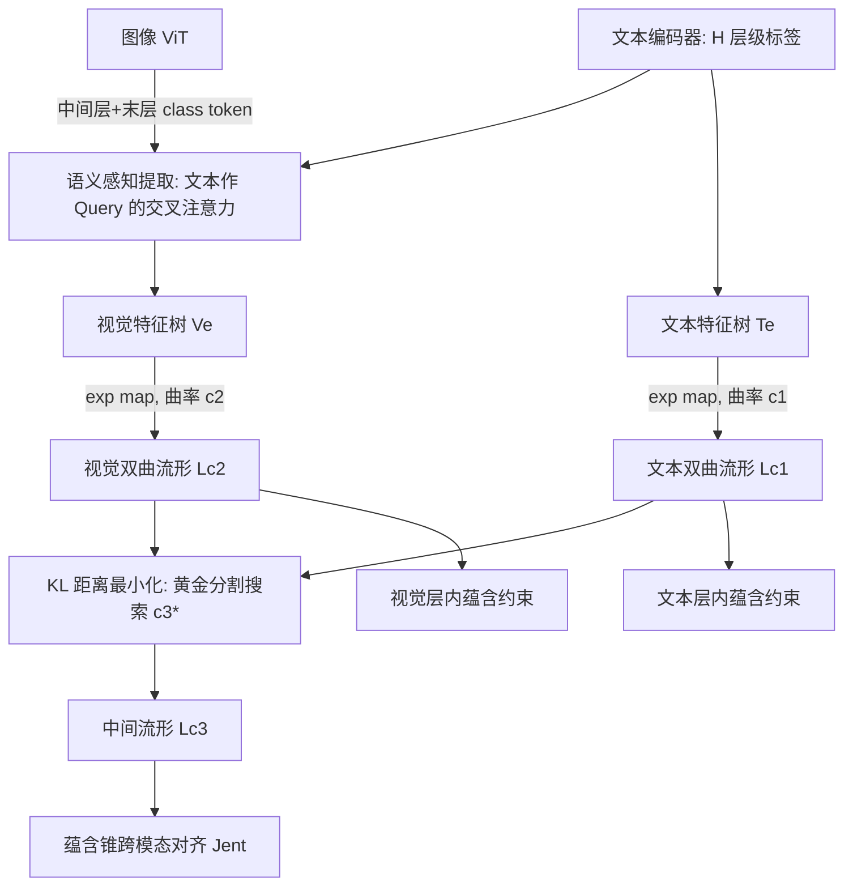

# Modality Alignment across Trees on Heterogeneous Hyperbolic Manifolds

**会议**: ICLR 2026  
**OpenReview**: [https://openreview.net/forum?id=F1uJKsaf0M](https://openreview.net/forum?id=F1uJKsaf0M)  
**代码**: [https://mcislab-manifold-learning.github.io/HypModalAlign/](https://mcislab-manifold-learning.github.io/HypModalAlign/)  
**领域**: 多模态 / 视觉-语言对齐  
**关键词**: 模态对齐, 层次特征树, 双曲流形, 不同曲率, 中间流形, 分类学开集识别  

## 一句话总结
针对"文本是层次特征、图像只有一个特征"造成的不对称对齐问题，本文同时为图文构建**层次特征树**，把两棵树嵌入**曲率不同的双曲流形**，再通过一个用 KL 散度求出的**中间流形**完成异质流形对齐，在分类学开集识别上显著超越强基线。

## 研究背景与动机
- **领域现状**：视觉-语言模型（VLM）的核心是模态对齐，把图像和文本桥接到可比较的空间。现实语义天然是层次的（如生物分类的界门纲目科属种），因此 ProTeCt、BioCLIP 等方法会从文本标签里抽出多层级的层次特征。
- **现有痛点**：这些方法只从**文本侧**抽层次特征，却用**单个**全局特征表示整张图像。一个标量化的视觉特征无法承载一整棵文本层次树的信息，导致图文两侧"粒度不对等"——即**不对称对齐（asymmetric alignment）**，预测必然次优。
- **核心矛盾**：要把图像也做成层次特征树并不容易，存在两个障碍。(1) 怎么从 ViT 里挖出"从粗到细"的层次视觉特征；(2) 文本特征相对纯净，而视觉特征夹带背景等复杂信息，两者的**几何结构本质不同**，落在**曲率不同的异质流形**上，跨异质流形怎么对齐几乎没人研究过。
- **本文目标**：构建图文对称的层次特征树，并在尊重各自几何结构的前提下完成跨模态对齐。
- **核心 idea**：**【对称化】** 用文本线索引导、从 ViT 中间层 class token 抽出粗到细的视觉特征，让图像也成树；**【异质流形对齐】** 给图文各配一个可学习曲率的双曲流形，再寻一个"离两者都最近"的中间流形作为公共对齐场，并证明该中间流形存在且唯一。

## 方法详解

### 整体框架
方法 **Alignment across Trees** 分两块串联：先用**语义感知视觉特征提取框架**把图像做成与文本对称的层次特征树，再用**异质流形对齐算法**把图文两棵树嵌入各自双曲流形、搜出中间流形并在其上做跨模态蕴含对齐，同时在各自流形上施加层内蕴含约束。骨干是 CLIP + prompt learning（MaPLe / PromptSRC），只训练可学习 prompt token 与两个曲率参数。

### 关键设计

**1. 语义感知视觉特征提取：让文本线索把图像"切"成层次树。** 现有方法只拿 ViT 末层 token 对齐文本，而中间层其实编码了更粗的语义、末层编码细粒度信息。本文取 $m$ 个中间层的 class token $\{h_{p_j}\}_{j=1}^m$ 与末层 $h_n$ 一起用。为保证中间层 token 有足够判别力，从第 $p_j$ 层往后**关掉跨 token 自注意力**（去掉 query/key 计算），只用线性投影、残差和 MLP 把它"原样直送"到末层表示空间得到 $h'_{p_j}$，避免信息被后续层污染。随后用一个交叉注意力把这些层的 token 组织成与 $H$ 级文本对齐的视觉特征：文本特征当 query、各层 token 当 key/value，
$$[v_1;\dots;v_H]=\mathrm{Softmax}\!\Big(\tfrac{QK^\top}{\sqrt d}\Big)V_{attn},\quad Q=[t_1;\dots;t_H]W_Q,\ K=V_{attn}=[h'_{p_1};\dots;h_n]W_{K/V}.$$
这样每个文本层级都"挑"到了对应粒度的视觉特征，图文形成语义对称的两棵树 $T_e=\{t_i\}$、$V_e=\{v_i\}$。

**2. 异质曲率建模 + 中间流形求解：在不同曲率间找一个公共对齐场。** 文本树与视觉树几何结构不同，本文不强行用同一曲率，而是给两者各配一个**可学习曲率** $c_1,c_2$，用指数映射嵌入各自 Lorentz 双曲流形 $t_i^{c_1}=\exp^{c_1}_0(t_i)$、$v_i^{c_2}=\exp^{c_2}_0(v_i)$。要在异质流形间对齐，关键是先定义"两个流形有多不像"。本文把每个流形上的数据建成**wrapped normal 分布**，用 KL 散度刻画流形距离。由于双曲 KL 没有解析式，作者给出近似（Theorem 1）：
$$D_L(L_{c_1},L_{c_3})=\frac{-\sqrt{c_1}+2\sqrt{c_3}\cosh[(\sqrt{c_3}-\sqrt{c_1})r]}{2\sqrt{c_1 c_3}}.$$
并证明它在 $c_3=c_1$ 时唯一取极小（Proposition 1，验证距离定义自洽）。最优中间流形曲率由
$$c_3^*=\arg\min_{c_3}\ D_L(L_{c_1},L_{c_3})+D_L(L_{c_2},L_{c_3})$$
给出，**Proposition 2 证明 $c_3^*$ 存在且唯一，且落在 $[\min(c_1,c_2),\max(c_1,c_2)]$ 内**——这是全文的理论核心。实际用一维黄金分割搜索求 $c_3^*$。

**3. 蕴含锥几何对齐：跨模态 + 模态内双重约束。** 求出 $c_3^*$ 后把图文都投到中间流形 $L_{c_3}$，借鉴 entailment learning：文本提供更宽的上下文，故强制视觉特征**被文本特征蕴含**——即 $v_i^{c_3}$ 落在文本蕴含锥 $\omega(t_i^{c_3})$ 内，用外角 $\phi$ 与半锥角 $\omega$ 构造铰链损失
$$J_{ent}(v_i^{c_3},t_i^{c_3})=\max\big(0,\ \phi(v_i^{c_3},t_i^{c_3})-\omega(t_i^{c_3})\big).$$
同时在各自原流形 $L_{c_1},L_{c_2}$ 上施加**模态内层次约束**：细粒度（第 $i{+}1$ 层）应被粗粒度（第 $i$ 层）蕴含，保证每棵树内部的层次几何不塌。

**4. 曲率的隐函数定理求导：让黄金分割搜索可反传。** 总损失 $J(\theta,c_1,c_2)=J_{pro}+\alpha(J_{Tent}+J_{Vent}+J_{ent})$ 要对 $c_1,c_2$ 求梯度，但 $c_3^*$ 是黄金分割搜索出来的、对 $c_1,c_2$ 不可微。作者用**隐函数定理**把 $\partial c_3^*/\partial c_1$ 等表达为二阶偏导之比 $-\big(\partial^2 J_c/\partial c_3^2\big)^{-1}\partial^2 J_c/\partial c_1\partial c_3$，从而把曲率梯度补全、端到端训练。

## 实验关键数据

任务为**分类学开集（TOS）识别**，标签组织成语义树，要求在多个层级同时预测；数据集 Cifar100 / SUN / ImageNet / Rare Species；指标 LA（叶子准确率）、HCA（层次一致准确率）、MTA（平均树切准确率）；骨干 MaPLe 与 PromptSRC，基线含 ProTeCt。

### 主实验（few-shot，部分摘录，MaPLe 骨干）

| Shot | 方法 | Cifar100 HCA | SUN HCA | ImageNet HCA | Rare Species HCA |
|------|------|------|------|------|------|
| 1 | +ProTeCt | 48.10 | 50.45 | 20.44 | 13.22 |
| 1 | **+Ours** | **53.19** | **57.92** | **25.56** | **20.94** |
| 16 | +ProTeCt | 61.15 | 59.71 | 31.24 | 24.82 |
| 16 | **+Ours** | **69.38** | **68.67** | **43.79** | **53.65** |

16-shot 下 HCA 最高提升 **28.83%**、LA 最高提升 **19.02%**、MTA 提升 **8.48%**；Rare Species 这种细粒度生物分类数据上提升尤为夸张（HCA 24.82→53.65）。base-to-novel 泛化上 Cifar100 新类 LA/HCA/MTA 分别 +1.38/+5.66/+4.90。

### 消融实验（MaPLe，部分摘录）

| Shot | 变体 | Cifar100 HCA | SUN HCA | Rare Species HCA |
|------|------|------|------|------|
| 16 | +ProTeCt | 61.15 | 59.71 | 24.82 |
| 16 | Ours-Euc（无双曲） | 68.01 | 66.81 | 51.81 |
| 16 | Ours-HypV1（共享曲率） | 69.05 | 68.26 | 52.85 |
| 16 | Ours-HypV2（各自曲率，无中间流形搜索） | 69.33 | 68.65 | 52.73 |
| 16 | **Ours（全套）** | **69.38** | **68.67** | **53.65** |

### 关键发现
- **对称化本身就很值钱**：Ours-Euc（仍是欧氏、仅补了层次视觉树）就已稳定超过 ProTeCt，说明把图像也做成层次树、消除不对称是主要收益来源。
- **双曲 + 异质曲率 + 中间流形逐级加分**：从 Euc→共享曲率→各自曲率→中间流形搜索逐步上涨，验证了异质建模与中间流形求解的必要性。
- **几乎零额外开销**：单曲率与本文多曲率的耗时 74s vs 74.5s/batch、显存均 10,400MB，多学几个曲率代价可忽略。
- t-SNE 可视化显示本文的视觉特征在各分类层级上类间边界更清晰、类内更紧致。

## 亮点与洞察
- **抓住了一个被忽视的不对称性**：层次文本 vs 单一图像的粒度不对等，是个直觉上明显但少有人系统解决的痛点，"图像也成树"的切入点干净。
- **把"中间流形"形式化并给了存在唯一性证明**：异质曲率对齐通常靠经验，本文用 wrapped normal + 双曲 KL 近似把"找公共对齐场"变成一维凸搜索，并证明解落在两曲率之间，理论扎实。
- **工程闭环完整**：黄金分割搜索不可微 → 隐函数定理补梯度，让整套几何模块能端到端训练，且实测几乎无额外开销。

## 局限与展望
- **任务面较窄**：实验只在 TOS 分类学开集识别上验证，对检索、VQA、开放词表检测等更广义的 VLM 对齐是否同样有效尚未验证。
- **依赖明确层次结构**：方法以"标签有 $H$ 级树状语义"为前提，对没有清晰分类树的一般图文对齐如何泛化不清楚。
- **距离非真度量**：$D_L$ 因继承 KL 的非对称性与三角不等式违反并不是正式度量，理论上是近似，极端曲率差下的鲁棒性值得进一步分析。
- 中间层数 $m$、层级深度 $H$ 等需按数据集设定，跨域迁移的超参敏感性未充分展开。

## 相关工作与启发
- **模态对齐**：从 CLIP/ALIGN 预训练到 CoOp/CoCoOp/VPT/MaPLe 等 prompt learning；本文属 prompt learning 路线但首次强调图文层次对称。
- **分类学/层次识别**：ProTeCt 首次用单视觉特征 + 多级文本对比并提出 HCA 等指标，BioCLIP 系列用粗到细标注做预训练——本文指出它们都停在"不对称欧氏对齐"。
- **双曲流形学习**：双曲空间体积随半径指数增长，天然贴合层次数据；已有工作多假设图文**同曲率**，本文的差异点正是**异质曲率 + 中间流形**。
- **启发**：当两个模态/视图的内在几何不同，与其强行塞进同一空间，不如各自建模再搜一个"几何折中点"对齐——这个中间流形思路或可迁移到图-文、视频-音频等其他异质对齐场景。

## 评分
- **新颖性**: ⭐⭐⭐⭐⭐ — "图像也成层次树 + 异质曲率中间流形对齐"组合切入点新，且配存在唯一性证明，几何上有原创性。
- **实验充分度**: ⭐⭐⭐⭐ — 4 数据集 × 2 骨干 × few-shot/base-to-novel 多设置，消融逐组件拆解清晰；但任务集中在 TOS 分类，广度略受限。
- **写作质量**: ⭐⭐⭐⭐ — 动机—挑战—方法逻辑顺畅，图 1/2/3/4 把不对称与流形对齐讲得直观；理论部分稍密。
- **价值**: ⭐⭐⭐⭐ — 对层次化多模态对齐与双曲表示学习社区有实用价值，开销近零且即插现有 prompt learning 框架。

<!-- RELATED:START -->

## 相关论文

- [\[CVPR 2026\] Hyperbolic Gramian Volumes for Multimodal Alignment](../../CVPR2026/multimodal_vlm/hyperbolic_gramian_volumes_for_multimodal_alignment.md)
- [\[CVPR 2026\] Towards Dynamic Modality Alignment in Multimodal Continual Learning](../../CVPR2026/multimodal_vlm/towards_dynamic_modality_alignment_in_multimodal_continual_learning.md)
- [\[CVPR 2026\] DeepAlign: Mitigating Modality Conflict through Modality-Specific Alignment](../../CVPR2026/multimodal_vlm/deepalign_mitigating_modality_conflict_through_modality-specific_alignment.md)
- [\[ICLR 2026\] PHyCLIP: $\ell_1$-Product of Hyperbolic Factors Unifies Hierarchy and Compositionality in Vision-Language Representation Learning](phyclip_ell_1-product_of_hyperbolic_factors_unifies_hierarchy_and_compositionali.md)
- [\[CVPR 2026\] TRANSPORTER: Transferring Visual Semantics from VLM Manifolds](../../CVPR2026/multimodal_vlm/transporter_transferring_visual_semantics_from_vlm_manifolds.md)

<!-- RELATED:END -->
