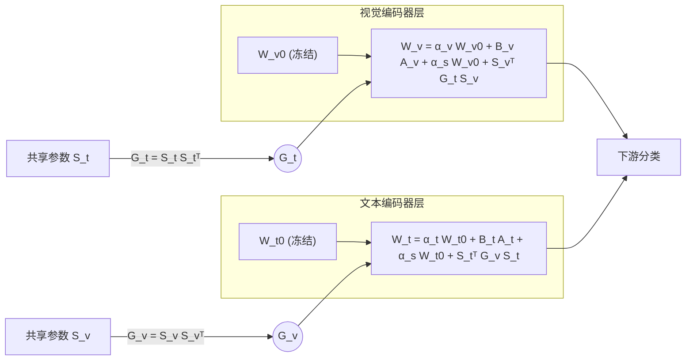

# MoRA: Missing Modality Low-Rank Adaptation for Visual Recognition

**会议**: ICLR 2026  
**OpenReview**: [https://openreview.net/forum?id=ZgQnIPG4uV](https://openreview.net/forum?id=ZgQnIPG4uV)  
**代码**: [https://github.com/Tree-Shu-Zhao/MoRA](https://github.com/Tree-Shu-Zhao/MoRA)  
**领域**: 多模态 / 视觉语言模型 / 参数高效微调 / 缺失模态  
**关键词**: Missing Modality, LoRA, PEFT, Cross-modal Interaction, Gram Matrix, CLIP  

## 一句话总结
MoRA 用一组"模态共享 + 模态专属"的低秩参数，让视觉和文本编码器在微调时既能保持跨模态对齐、又能各自适应下游任务，从而在缺失模态场景下显著超越基于 prompt 的方法，且推理零额外开销。

## 研究背景与动机
**领域现状**：CLIP、ViLT 这类视觉语言模型（VLM）在视觉识别上表现亮眼，但它们默认训练和推理时所有模态都齐备。现实里模态常常缺失——隐私限制、采集困难、资源受限都会导致某个模态拿不到，此时模型性能会大幅跳水。

**现有痛点**：应对缺失模态的主流路线有三类。对齐式（alignment-based）把不同模态映射到共享空间；重建式（reconstruction-based）用现有模态去合成缺失模态特征，但重建质量难保证；最近兴起的 prompt learning（MMP、DCP、SyP）把模态信息塞进各层可学习 token，缺失时复用。但 prompt 方法有两个硬伤：一是各层独立插 prompt、忽略了模态间的复杂关系，且 DCP 直接丢弃缺失模态特征、没能充分利用多模态信息；二是 prompt 会带来**不可避免的推理开销**。

**核心矛盾**：微调 VLM 时存在一对张力——视觉和文本编码器既要**朝同一方向更新**以维持嵌入空间里的模态对齐（保住泛化能力），又要**各自保留独立的更新方向**以适应下游任务（保住模态专属灵活性）。论文通过对齐/非对齐编码器的对照实验验证了这点：对齐模型缺失模态时只掉 −11.1，非对齐模型却暴跌 −54.5，说明对齐的其他模态能托底；同时图文都用比单用图（−14.1）或单用文（−11.9）更好，说明"模态间的 gap"本身也是有价值的互补信息。

**本文目标**：设计一个参数高效微调（PEFT）方法，显式建模跨模态交互、同时保留模态专属适应，并且推理时不引入任何额外延迟。

**核心 idea**：**[共享 + 专属双结构]** 在每个编码器的权重更新里同时注入一份所有模态共享的低秩参数（负责跨模态知识传递）和一份模态专属低秩参数（负责各自下游适应），并用 **Gram 矩阵** 在秩空间里完成跨模态交互、绕开视觉/文本维度不一致的难题，使全部增量都能在推理前被吸收进原权重。

## 方法详解

### 整体框架
MoRA 在视觉编码器和文本编码器的线性层上各挂一组低秩适配参数：一份**模态专属**（各编码器独立），一份**模态共享**（两编码器之间互通）。共享参数通过 Gram 矩阵在 $r\times r$ 的秩空间里交换结构信息，再投射回各自维度，从而既做了跨模态知识迁移、又不受视觉与文本维度不同的限制。训练只更新这些低秩参数（约占全模型 0.11%），推理时所有增量都能合并进 $W_0$，零额外开销。

### 关键设计

**1. 方向分解的权重更新：把"对齐"和"灵活"显式拆开** —— MoRA 借鉴 DoRA 的思路，把权重写成幅度（Frobenius 范数）和方向（归一化矩阵）的乘积 $W = \|W_0+\Delta W\|_F \cdot \overline{W_0+\Delta W}$。在此基础上，每个编码器的更新被拆成两条独立通路并相加：模态专属项 $\alpha_{v/t}\overline{W_0^{v/t}} + B_{v/t}A_{v/t}$ 负责让该模态朝自己的下游方向走，模态共享项 $\alpha_s\overline{W_0^{v/t}} + S_{v/t}S_{t/v}$ 负责让两个模态朝同一方向走维持对齐。专属参数 $A_{v/t}\in\mathbb{R}^{r\times d_{v/t}},B_{v/t}\in\mathbb{R}^{d_{v/t}\times r}$ 与共享参数各管一摊，正好对应动机里那对"既同向又独立"的诉求；$\alpha_{v/t}$ 和 $\alpha_s$ 都是可学习的幅度标量，让模型自己权衡两条通路的强度。

**2. Gram 矩阵跨模态交互：在秩空间里绕过维度不匹配** —— 直接让共享参数 $S_v$ 和 $S_t$ 相乘会遇到现实障碍：CLIP ViT-B/16 里视觉维度 $d_v=768$、文本维度 $d_t=512$，$S_v S_t$ 的维度对不上任何一个编码器。加投影层虽能对齐，却会膨胀参数量、且投影层无法被吸收进 $W_0$、推理还会变慢。MoRA 的解法是先在每个模态内部算 Gram 矩阵 $G_v = S_v S_v^\top\in\mathbb{R}^{r\times r}$、$G_t = S_t S_t^\top\in\mathbb{R}^{r\times r}$，把模态结构压进**维度无关**的 $r\times r$ 秩空间；再用对方模态的 Gram 矩阵去更新自己：$W_v = \alpha_v\overline{W_0^v}+B_vA_v + \alpha_s\overline{W_0^v}+S_v^\top G_t S_v$，文本侧对称。由于 $S_v^\top G_t S_v\in\mathbb{R}^{d_v\times d_v}$、$S_t^\top G_v S_t\in\mathbb{R}^{d_t\times d_t}$，它们维度天然匹配各自编码器、可在推理前合并进权重。论文还指出 Gram 矩阵捕捉的是低秩表示的二阶统计量，有助于提取跨域不变表示，相当于一个把模态专属参数注入共享知识的轻量适配器。

**3. 零推理开销 + 极致参数效率：把所有增量吸收回主干** —— MoRA 设计上的一条硬约束是"训练加结构、推理不加结构"。专属项 $B_{v/t}A_{v/t}$ 是标准 LoRA 形式可合并，共享项经 Gram 改写后也成了与 $W_0$ 同维的方阵，因此所有可学习参数最终都能被吸收进冻结的预训练权重 $W_0$，推理时模型结构与原始 CLIP 完全一致、不引入任何 prompt token 或额外层。这与基于 prompt 的方法形成鲜明对比——后者每次前向都得多算一批 token。整套方案只更新约 0.11% 的参数，却能稳定地处理各种缺失模态配置。

## 实验关键数据

### 主实验表格
在 MM-IMDb（F1-Macro）、Food101（Top-1 Acc）、Hateful Memes（AUROC）三个基准上，缺失训练和推理双阶段都缺失，MoRA 全面超越对手（括号内为相对次优 DCP 的提升）：

| 数据集 (η, 配置示例) | DePT | DCP | MoRA |
|---|---|---|---|
| MM-IMDb (50%, img100/txt50) 平均 | 51.43 | 52.92 | **56.04 (+3.12)** |
| MM-IMDb (90% 平均) | 48.33 | 49.84 | **51.96 (+2.12)** |
| Food101 (50% 平均) | 81.81 | 85.49 | **86.91 (+1.42)** |
| Food101 (90% 平均) | 78.60 | 80.30 | **82.09 (+1.79)** |
| Hateful Memes (50% 平均) | 63.87 | 64.27 | **70.61 (+6.34)** |
| Hateful Memes (90% 平均) | 62.98 | 64.24 | **68.56 (+4.32)** |

三个数据集相对 DCP 的平均提升分别为 5.30%、1.91%、8.51%；摘要汇报缺失模态场景整体平均提升 5.24%，且推理时间仅为 SOTA 的 25.90%、可训练参数仅为全量微调的 0.11%。Hateful Memes 上 MoRA 在 90% 缺失率下的表现可媲美 DCP 50% 缺失率，鲁棒性突出。

### 消融实验表格
PEFT 方法横评（70% 双缺失，单数字为该设置代表值）与组件消融：

| 方法 | MM-IMDb | Food101 | Hateful Memes |
|---|---|---|---|
| **MoRA** | **52.97** | **83.77** | **70.15** |
| LoRA | 51.35 | 82.14 | 67.97 |
| DoRA | 51.89 | 82.34 | 68.28 |
| DCP (prompt) | 51.42 | 81.87 | 66.08 |
| BitFit | 48.57 | 79.38 | 64.10 |
| FFT (全量微调) | 3.01 | 14.05 | 46.91 |
| w/o Specific（去模态专属） | 51.18 | 81.32 | 68.71 |
| w/o Gram（去 Gram 交互） | 50.41 | 80.31 | 68.19 |
| w/ Learnable Gram | 52.25 | 83.37 | 69.12 |

去掉模态专属项或 Gram 交互都会明显掉点，证明"专属 + 共享"缺一不可；Gram 比可学习版更好，说明用现成二阶统计量做跨模态桥更稳。值得注意的是全量微调 FFT 在缺失模态下灾难性崩溃（MM-IMDb 仅 3.01），印证了"不要破坏预训练对齐"的核心论点。

### 关键发现
- **文本模态普遍比图像更重要**：三个数据集都如此，部分因为 Food101 等文本里直接含标签信息；MoRA 在图像缺失时提升尤为明显，说明跨模态知识交互弥补了视觉理解不足。
- **嵌入空间分析（表 2/3）**：MoRA 把图文 L2 距离/夹角维持在最接近原始 CLIP 的水平（L2 9.99、角 77.07°，FFT 则飙到 22.61/91.64°），同时模态专属漂移最小，定量验证了"既保对齐、又允许适应"的动机。
- **跨场景泛化**：用一种缺失配置训练、在另一种配置测试，MoRA 在所有 train-test 组合上都稳超 DCP，适合缺失模式不可预测的真实部署。

## 亮点与洞察
- **用 Gram 矩阵解维度不匹配是巧思**：视觉/文本编码器维度不同是多模态 LoRA 的老大难，MoRA 把交互搬到维度无关的 $r\times r$ 秩空间，既省参数又能合并回主干，是本文最干净的工程贡献。
- **动机—方法—验证闭环扎实**：从"对齐 vs 非对齐"对照实验提炼出"同向 + 独立"两条性质，方法严格对应这两条，最后用嵌入距离/漂移分析定量回收动机，论证链条完整。
- **零推理开销**这一点对落地很有价值，直接把 prompt 方法的推理税抹掉了。

## 局限与展望
- 实验只覆盖三个分类基准（MM-IMDb、Food101、Hateful Memes）和图文两模态，未验证音频、视频等更多模态或检测/分割等更复杂任务。
- 方法绑定在 CLIP 这类双塔对齐 VLM 上，对非对齐编码器或解码器式多模态大模型（如 LLaVA）是否同样有效未知。
- 缺失模态用"全 1 矩阵 / 空字符串"做占位是简化处理，更贴近真实的部分缺失/噪声缺失场景未探讨。
- Gram 矩阵只取二阶统计量，是否丢失了高阶跨模态信息、rank $r$ 如何最优选取，论文给的分析偏经验。

## 相关工作与启发
- **缺失模态多模态学习**：对齐式、重建式、以及作为重建子集的 prompt learning（MMP/DCP/SyP）。MoRA 的差异是训练全程保留模态信息、推理零开销。
- **PEFT**：Adapter、Prompt、LoRA 三大类；DoRA 的幅度-方向分解直接被 MoRA 借来拆"对齐"和"灵活"两条通路。相比聚焦指令微调的多模态 LoRA（无法处理缺失模态、缺乏跨模态架构创新），MoRA 专攻视觉识别的双向知识迁移。
- **启发**：把"维度不匹配"这类跨模态结构难题转化到 Gram/核空间求解，是一个可推广到其他双塔/多塔架构参数共享的通用技巧。

## 评分
- **新颖性**: ⭐⭐⭐⭐ — Gram 矩阵在秩空间做跨模态共享、并保证可吸收回主干，是缺失模态 PEFT 里有辨识度的新解法，虽建立在 LoRA/DoRA 之上但组合方式新颖。
- **实验充分度**: ⭐⭐⭐⭐ — 三基准多缺失率主实验 + PEFT 横评 + 组件消融 + 跨场景泛化 + 嵌入空间定量分析，论证完整；缺更多模态/任务的覆盖。
- **写作质量**: ⭐⭐⭐⭐ — 动机—方法—验证闭环清晰，公式推导把"专属/共享"拆解写得明白，图表支撑到位。
- **价值**: ⭐⭐⭐⭐ — 零推理开销 + 0.11% 参数 + 缺失模态显著提升，对真实部署中模态不全的场景有直接实用价值。

<!-- RELATED:START -->

## 相关论文

- [\[ICCV 2025\] Synergistic Prompting for Robust Visual Recognition with Missing Modalities](../../ICCV2025/multimodal_vlm/synergistic_prompting_for_robust_visual_recognition_with_missing_modalities.md)
- [\[ICCV 2025\] Sparsity Outperforms Low-Rank Projections in Few-Shot Adaptation](../../ICCV2025/multimodal_vlm/sparsity_outperforms_low-rank_projections_in_few-shot_adaptation.md)
- [\[CVPR 2026\] Parameter-Efficient Adaptation for MLLMs via Implicit Modality Decomposition](../../CVPR2026/multimodal_vlm/parameter-efficient_adaptation_for_mllms_via_implicit_modality_decomposition.md)
- [\[AAAI 2026\] BOFA: Bridge-Layer Orthogonal Low-Rank Fusion for CLIP-Based Class-Incremental Learning](../../AAAI2026/multimodal_vlm/bofa_bridge-layer_orthogonal_low-rank_fusion_for_clip-based_.md)
- [\[ICLR 2026\] Exploring Cross-Modal Flows for Few-Shot Learning](exploring_cross-modal_flows_for_few-shot_learning.md)

<!-- RELATED:END -->
