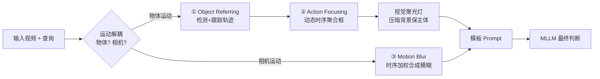

# MotionSight: Boosting Fine-Grained Motion Understanding in Multimodal LLMs

**会议**: ICLR 2026  
**OpenReview**: [https://openreview.net/forum?id=ISZPRsh5YV](https://openreview.net/forum?id=ISZPRsh5YV)  
**代码**: [https://nju-pcalab.github.io/projects/MotionSight](https://nju-pcalab.github.io/projects/MotionSight)  
**领域**: 多模态视频理解 / MLLM 视觉提示  
**关键词**: 细粒度运动理解, 视觉提示, 视觉聚光灯, 运动模糊, 物体/相机运动解耦, MotionVid-QA  

## 一句话总结
MotionSight 提出一种**无需训练的视频视觉提示方法**，用"视觉聚光灯"放大物体运动、用"合成运动模糊"放大相机运动，把这两类信号解耦后喂给现成 MLLM，从而显著提升细粒度运动理解；并据此蒸馏出首个大规模细粒度运动数据集 MotionVid-QA（40K 视频 / 87K QA）训练出 MotionChat。

## 研究背景与动机
- **领域现状**：MLLM 在事件级视频理解上已经很强，但视频区别于静态图像的本质是**时间维度上的逐帧变化**——也就是物体运动和相机运动。这类细粒度运动理解长期缺乏关注。
- **现有痛点**：MLLM 倾向于对空间区域"一视同仁"地处理，缺乏显式的**帧间差分机制**，会把细微的视觉线索平均掉或直接忽略，导致运动感知次优。
- **核心矛盾**：图像领域的视觉提示（visual prompting）已被证明有效，但直接迁移到视频上反而会"翻车"——论文实测发现图像里表现最好的"背景模糊"提示，在细粒度运动理解上**表现最差**，因为它破坏了上下文信息。如何为视频的时间复杂性量身设计视觉提示是空白。
- **本文目标**：在**零样本、不额外训练**的前提下，解锁 MLLM 已有的潜在运动感知能力，并把这种能力转化为可用于训练其他模型的结构化数据资产。
- **核心 idea**：**【运动解耦 + 专属视觉提示】**——把物体运动和相机运动拆开，分别用"视觉聚光灯（突出主体、压暗背景）"和"合成运动模糊（强化帧间线索）"两种针对性提示去激发模型，再用模板 prompt 让 MLLM 综合判断。

## 方法详解

### 整体框架
给定采样后的视频帧 $V_s$ 和用户查询 $Q$，MotionSight 先用 MLLM 做**查询驱动的运动解耦**判断这是物体运动还是相机运动问题，再据此走不同的视觉提示分支：物体运动走 `Object Referring → Action Focusing → 视觉聚光灯`，相机运动走 `Motion Blur` 合成。两路增强后的视频经统一的模板 prompt 送回 MLLM 做最终决策，整体表达为 $R_{obj} = \text{MLLM}(\Phi_{obj}(V_s))$ 与 $R_{cam} = \text{MLLM}(\Phi_{cam}(V_s, V))$。这套 pipeline 还反向用作数据标注引擎，蒸馏出 MotionVid-QA。

### 关键设计
**1. Object Referring（物体指代）：从查询定位"该看哪"。** MLLM 先读采样帧 $V_s$ 和查询 $Q$，推断出语义相关的物体类别集合 $C=\{c_1,...,c_n\}$，再交给检测器（GroundingDINO 类）在关键帧 $I_{st}$ 上出框、跟踪器（SAM2 类）把检测框沿后续帧传播得到轨迹 $O = M_{track}(M_{detect}(I_{st}, C), \{I_{sj}\})$。作者强调即便初始检测有错，鲁棒的物体识别也能被低置信度检测逐步refine，避免直接做动作推理时的幻觉。

**2. Action Focusing 与视觉聚光灯：把注意力"打光"在运动主体上。** 拿到逐帧框后，用一个**动态时序聚合器** $A$ 把抖动的框合并稳定成精炼区域 $B=\{b_t\}$，其聚合窗口随轨迹内位置方差 $V(X)$ 自适应——位置方差低（主体动得小）就用更长时间跨度做框的并集，方差高（动得剧烈）就收缩到更短窗口的局部区域，方差用框中心的曼哈顿距离 $\|center(b_{st_1,i})-center(b_{st_2,i})\|_1$ 度量。最后视觉提示函数 $\Phi_{obj}(V_s)=F_{VP}(V_s, B)$ 像聚光灯一样**压暗 $B$ 之外的背景、保留主体原位**，强化模型对运动元素的聚焦。其灵感来自预训练数据里大量舞台/电视场景天然就是"主体高亮、背景压暗"的构图。

**3. Motion Blur（运动模糊）：人工"造模糊"补齐相机运动感知。** 相机运动要求模型察觉细微的全局场景变化，恰是 MLLM 的短板。作者设计运动模糊变换 $T_{MB}$ 作为 $\Phi_{cam}$：对采样帧 $I_{st}$，用它在原始视频里前 $N$ 帧做**时序加权聚合**生成增强帧，$T_{MB}(\cdot)=\sum_{k=0}^{N-1} w_k(\gamma)\cdot I_{s_{t}-k}$，其中核 $w_k$ 满足 $\sum_k w_k=1$ 且呈时间递增趋势。这相当于在帧上人为"拖影"，把相机运动轨迹放大成可见的视觉信号——实验里这一步对相机运动判断带来了出乎意料的大幅增益。

**4. MotionVid-QA 数据蒸馏（SFT + DPO 两级标注）：把零样本能力固化成数据资产。** 用 MotionSight 当标注器给约 40K 视频片段打标，经技术质量预测器（清晰度）+ 光流强度估计器（运动强度是否合适）+ VQAScore 的严格过滤后分层：高质量的进偏好数据集，其余进指令数据集。SFT 子集（35K 视频 / 80K QA）用于让模型学会捕捉时空动态；DPO 子集（5K / 7K）以 Tarsier2 标注作 reject、人工偏好作 chosen，按 $\mathcal{L}_{DPO}=-\mathbb{E}[\log\sigma(\beta\log\frac{\pi_\theta(y_c|x)}{\pi_{ref}(y_c|x)}-\beta\log\frac{\pi_\theta(y_r|x)}{\pi_{ref}(y_r|x)})]$ 把细粒度运动理解对齐人类偏好。基于此在 Qwen2.5VL-7B 上训出 MotionChat。

## 实验关键数据

### 主实验（MotionBench / FAVOR-Bench，零样本增强）

| 模型 | MotionBench Overall | MotionBench CM | FAVOR Overall | FAVOR CM |
|---|---|---|---|---|
| Qwen2.5VL-7B | 53.0 | 34.0 | 42.3 | 30.9 |
| **+ MotionSight** | **55.6** | **48.3** | **45.1** | **38.1** |
| InternVL3-78B | 61.5 | 55.8 | 52.8 | 34.3 |
| **+ MotionSight** | **63.0** | **58.7** | **53.8** | **37.1** |
| GLM-4V-Plus（闭源 SOTA） | 62.8 | 67.4 | — | — |

- 在 Qwen2.5VL 上类别平均（AVG.）MotionBench +3.4%、FAVOR +3.0%，其中**相机运动（CM）在 MotionBench 上猛涨 14.3%**。
- InternVL3-78B + MotionSight 取得开源最优，并与闭源 GLM-4V-Plus 有竞争力。

### MotionChat 训练消融（FAVOR-Bench）

| SFT | DPO | Overall | AVG. | CM |
|---|---|---|---|---|
| ✘ | ✘（原始） | 42.3 | 41.6 | 30.9 |
| +ShareGPT4Video | — | 43.8 | 42.3 | 28.9 |
| ✔ | ✘ | 45.8 | 44.5 | 30.1 |
| ✔ | ✔ | **48.3** | **46.9** | **32.1** |

- 两级微调后 MotionChat-7B 拿到 **48.3%**，与 Qwen2.5VL-**72B**（48.1%）相当，验证数据集质量（同等条件下显著优于 ShareGPT4Video）。

### 视觉提示消融（MotionBench，OM AVG.）

| 提示方法 | OM AVG. |
|---|---|
| Qwen2.5VL-7B 基线 | 51.7 |
| **+ Visual Spotlight** | **53.0** |
| + Object Crop | 52.5 |
| + Background Blur（图像最优提示） | **49.3（最差）** |
| + Global Motion Blur（相机分支） | CM AVG. 34.0→48.3 |

### 关键发现
- **视觉聚光灯**是物体运动最优提示；图像领域最强的**背景模糊反而最差**（模糊了物体边界、误导模型），印证"图像提示不能直接搬到视频"。
- 运动模糊对**相机运动**带来质变（CM 大幅提升），且 MotionSight 在 VideoMME 等通用任务上也有提升（如 Temporal Perception 83.3%→88.9%），说明聚光灯帮助聚焦任务相关区域而不造成全局信息丢失。

## 亮点与洞察
- **零样本即插即用**：不动模型权重，靠纯视觉输入侧的提示就能撬动 MLLM 潜在能力，对任意现成 MLLM 都适用，工程价值高。
- **解耦视角抓住了本质**：把"物体动"和"相机动"拆成两类需要不同视觉强化的信号，而非用统一提示硬套，是方法奏效的关键。
- **"造模糊反而更清楚"的反直觉发现**：人为引入运动模糊把不可见的相机轨迹变成可见拖影，恰好补上了 MLLM 帧间差分的短板。
- **方法即标注器**：零样本能力被反向用作大规模数据蒸馏引擎，形成"提示增强→数据资产→训练小模型超大模型"的闭环。

## 局限与展望
- **依赖外部检测/跟踪器**：Object Referring 链路引入 GroundingDINO/SAM2 等模块，增加推理开销与级联误差风险，复杂场景下定位失败会拖累后续。
- **多步 pipeline 推理成本**：解耦判断 + 多分支提示意味着对单条查询要多次调用 MLLM，延迟与算力高于直接推理。
- **运动模糊为合成**：人为拖影是一种近似，窗口大小 $N$ 与核 $w_k$ 需调参，过强可能引入伪影、影响物体细节判断。
- **评测集中在运动 benchmark**：虽在 VideoMME 等有验证，但对长视频、密集多主体交互等更复杂场景的鲁棒性仍待进一步检验。

## 相关工作与启发
- **图像视觉提示**（红圈、background blur、API prompting 等）：本文证明其难以直接迁移到视频，需为时间维度重新设计——这是对"prompting 通用性"的一个重要边界提醒。
- **视频运动 benchmark**（MotionBench、FAVOR-Bench）：样本规模与场景多样性不足，催生了 MotionVid-QA 这一更大规模开源数据集。
- **MLLM 自标注 + 偏好对齐**（Tarsier2、DPO/RLHF）：延续"用强模型蒸馏数据 + 人类偏好对齐"的范式，启发是**好的推理时增强方法本身就是高质量数据来源**。

## 评分
- 新颖性: ⭐⭐⭐⭐ 运动解耦 + 针对性视觉提示（聚光灯/合成运动模糊）的组合在视频 MLLM 提示方向上是新颖且有反直觉洞察的切入点。
- 实验充分度: ⭐⭐⭐⭐ 覆盖两大运动 benchmark + VideoMME/MVBench 等通用集，提示方法消融与训练消融都做得扎实，结论闭环。
- 写作质量: ⭐⭐⭐⭐ 动机—方法—数据—实验逻辑清晰，图示充分，公式与 pipeline 表述到位。
- 价值: ⭐⭐⭐⭐ 零样本即插即用 + 首个大规模细粒度运动数据集，对社区的方法与数据双重贡献明确，落地价值高。

<!-- RELATED:START -->

## 相关论文

- [\[ICLR 2026\] UniF2ace: A Unified Fine-grained Face Understanding and Generation Model](unif2ace_a_underlineunified_underlinefine-grained_underlineface_understanding_an.md)
- [\[ICLR 2026\] GranViT: A Fine-Grained Vision Model For Autoregressive Multimodal Large Language Models](granvit_a_fine-grained_vision_model_for_autoregressive_multimodal_large_language.md)
- [\[CVPR 2026\] FAVE: A Structured Benchmark for Fine-Grained Audio-Visual Temporal Evaluation in Multimodal LLMs](../../CVPR2026/multimodal_vlm/fave_a_structured_benchmark_for_fine-grained_audio-visual_temporal_evaluation_in.md)
- [\[ICLR 2026\] WorldSense: Evaluating Real-World Omnimodal Understanding for Multimodal LLMs](worldsense_evaluating_real-world_omnimodal_understanding_for_multimodal_llms.md)
- [\[ICLR 2026\] Bongard-RWR+: Real-World Representations of Fine-Grained Concepts in Bongard Problems](bongard-rwr_real-world_representations_of_fine-grained_concepts_in_bongard_probl.md)

<!-- RELATED:END -->
