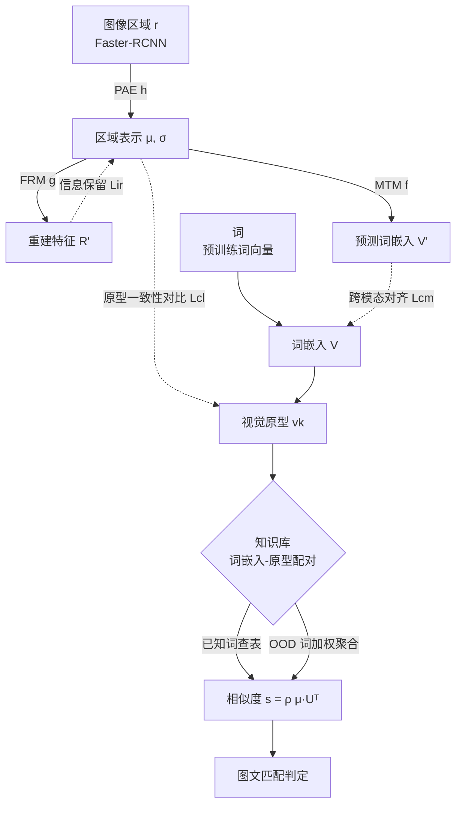

# Multimodal Aligned Semantic Knowledge for Unpaired Image-text Matching

**会议**: ICLR 2026  
**OpenReview**: [https://openreview.net/forum?id=d3CISVVO6v](https://openreview.net/forum?id=d3CISVVO6v)  
**代码**: 待确认  
**领域**: 多模态 / 图文匹配  
**关键词**: 无配对图文匹配, 跨模态对齐, 视觉原型, 词向量, 对比学习, OOD 泛化  

## 一句话总结
MASK 用预训练词向量作桥梁，把每个词对齐到一个"原型区域表示"，并借词向量的语义结构为分布外（OOD）词重建视觉原型，再用原型一致性对比损失压缩类内方差，从而在不依赖领域配对数据的"无配对图文匹配"上显著超越已有知识型方法。

## 研究背景与动机
- **领域现状**：图文匹配是 VQA、图像描述、跨模态检索等任务的底层技术。主流模型型方法（CHAN、3SHNet 等基于 Transformer）依赖海量配对图文数据做监督训练，效果强但采集标注成本高、难以落地。为摆脱对配对数据的依赖，"无配对图文匹配"（unpaired image-text matching）假设训练时拿不到领域内配对的图与文，转而模仿人脑那种"无需大规模配对就能关联任意图文"的多模态对齐知识。
- **现有痛点**：当前最具代表性的知识型方法是 MACK（Multimodal Aligned Conceptual Knowledge），它在原型区域表示与词之间建立对应。但它有三处硬伤：① **OOD 词没被认真处理**——无法利用词与词之间的语义结构，把已知词的视觉原型迁移到训练知识库里没见过的词；② **忽视分布方差**——同一个词对应的区域外观差异巨大，偏离均值的样本容易被误分到别的词；③ **原始区域表示抓不住语义关系**——它主要由区域间共现关系主导，而共现 ≠ 语义相关（"human"和"hat"常共现，但"human"和"gentleman"语义更近）。
- **核心矛盾**：知识库的词汇量天然受限于公开数据集的配对规模，而预训练词向量覆盖的词汇量远超知识库；如何让有限的视觉原型知识"外推"到海量 OOD 词，同时让视觉空间继承词向量空间的语义几何，是无配对匹配能否泛化的关键。
- **本文目标**：构建一种在视觉原型与词嵌入之间建立"语义对齐"（而非仅概念对应）的知识，使视觉原型既能为 OOD 词重建、又能反映词间语义距离，并抑制类内方差。
- **核心 idea**：**[语义对齐]** 不再把词对齐到原始区域表示，而是对齐到词嵌入空间，让视觉原型继承词向量的语义结构；**[OOD 重建]** 用 OOD 词与已知词的词向量相似度，对已知原型加权聚合出 OOD 词的视觉原型；**[方差抑制]** 用原型一致性对比损失把同词的区域表示聚到原型周围。

## 方法详解

### 整体框架
MASK 分两段：**构建知识** 与 **使用知识**。构建侧有三条支路——图像嵌入支路（PAE 编码器 $h$ 把原始区域表示 $r$ 压成高内聚低耦合的区域表示 $\mu$，并用特征还原模块 $g$ 重建原图特征）、文本嵌入支路（模态迁移模型 $f$ 把 $\mu$ 映到词嵌入空间，约束其保持词间语义关系）、以及对齐三损失（信息保留 $L_{ir}$、跨模态对齐 $L_{cm}$、原型一致性对比 $L_{cl}$）。训练后得到 $\{(w_k, v_k)\}$ 即"词嵌入—视觉原型"配对知识。使用侧把句子分词后查知识得到原型集合，与图像区域表示算 max-mean 相似度判断图文是否匹配；遇到知识库外的 OOD 词则现场重建原型。

### 关键设计

**1. 多模态语义对齐知识：一词一原型替代一词多区域。** MASK 强调知识的"跨模态一对一对齐"属性：同一个词在不同区域往往外观各异，若按一对多对齐到多个区域容易混淆，因此 MASK 把每个词只对齐到一个**原型区域表示**。具体地，PAE 编码器把原始区域 $r_j$ 编成高斯分布参数 $(\mu_j, \sigma_j)=h(r_j;\Theta_h)$，原型即同词所有区域表示的均值 $v_k=\frac{1}{J_k}\sum_{j=1}^{J_k}\mu_j$。这一步把"外观多样性"收敛成单点代表，从源头缓解外观漂移带来的误匹配。

**2. 信息保留损失 $L_{ir}$：让压缩后的均值仍能还原原图特征。** 为防止 PAE 把 $\mu$ 压得丢信息，特征还原模块 $g$ 用 $(\mu,\sigma)$ 加一个标准正态采样 $z$ 重建出 $R'=g(\mu,\sigma,z;\Theta_g)$，并约束 $L_{ir}=D_{KL}(\mathcal{N}(\mu,\sigma^2)\Vert\mathcal{N}(0,1))+\mathbb{E}[\Vert r_n-r'_n\Vert_2^2]$。KL 项把潜空间拉向标准正态、给后续 OOD 采样提供良态分布，重建项保证 $\mu$ 保留了原始区域的判别信息——这让"高内聚"的压缩不以牺牲可还原性为代价。

**3. 原型一致性对比损失 $L_{cl}$：以原型为类心做内聚外推。** 这是消融里贡献最大的一项。传统实例对实例的对比学习不带全局语义中心，而 $L_{cl}$ 直接拿原型 $v_k$ 当类心：$L_{cl}=-\frac{1}{B}\sum_{k=1}^{B}\log\frac{\exp(v_k\cdot\mu_+/\tau)}{\sum_{n=1}^{B}\exp(v_k\cdot\mu_n/\tau)}$，其中 $\mu_+$ 是与 $v_k$ 同词的正样本区域表示，$\tau$ 控制对负样本的区分力度。它把同词区域聚到原型周围、把异词推远，构造出更结构化、判别性更强的特征空间，从而把"分布方差导致误分"这个痛点直接压下去。

**4. 跨模态对齐损失 $L_{cm}$ 与 OOD 词原型重建：让视觉空间继承词向量几何。** MTM 模型 $f$ 把 $\mu$ 映到词嵌入空间得 $V'=f(\mu;\Theta_f)$，并要求它是**保关系等变映射**——对任意两个区域表示 $\mu_i,\mu_j$ 满足 $d_s(f(\mu_i),f(\mu_j))\propto d_s(\mu_i,\mu_j)$。损失 $L_{cm}=\mathbb{E}[1-\cos(w_i,w'_i)]+\mathbb{E}[(\cos(w'_i,w'_j)-\cos(\mu_i,\mu_j))^2]$ 既把预测词嵌入拉向真值、又让区域间相似度对齐词间相似度。有了这层几何继承，OOD 词 $w_{out}$ 就能靠词向量相似度从知识里取 top-$m$ 最近邻、加权聚合出视觉原型：$s_q=\text{softmax}(w_{out}\cdot w_q)$，$v_{out}=\sum_{q=1}^{m}s_q\cdot v_q$。这依赖词嵌入语义流形上的"局部线性"假设——语义近的词近似落在局部线性子空间，故 top-$m$ 邻居能最少偏差地重建原型。总损失 $L=L_{ir}+\lambda_1 L_{cm}+\lambda_2 L_{cl}$，知识来自 Visual Genome 收集的词—区域配对，且与数据集无关、可跨场景复用。

**5. 重排序扩展：作为即插即用模块增强现有大模型。** MASK 是知识型方法，与数据驱动的 CLIP/ALBEF 等天然互补。给定文本查询与 top-$k$ 候选图，用 MASK 在无配对设定下另算相似度 $s_k$，再 Z-Score 归一后融合：$\hat{s}_k=\text{ZS}(\tilde{s}_k)+\alpha\cdot\text{ZS}(s_k)$，即可对预训练模型的初排结果重排提分。

## 实验关键数据

### 主实验表格（无配对图文匹配，Rs = 全部 recall 之和）

| 类型 | 方法 | Flickr30K Rs | MSCOCO Rs |
|---|---|---|---|
| 模型型 | 3SHNet 2024 | 103.5 | 149.7 |
| 模型型 | BOOM 2024 | 106.4 | 145.7 |
| 知识型 | MACK 2022 | 95.3 | 201.7 |
| 知识型 | MACK$_{VG-M}$ 2024 | 104.8 | 205.2 |
| 知识型 | **MASK** | **122.8** | **209.5** |

模型型方法在 Flickr30K 上与知识型相当，但在结构更复杂、多目标的 MSCOCO 上大幅落后；MASK 在两个数据集 Rs 均最优。

### 消融实验表格

| 消融项 | Flickr30K Rs | MSCOCO Rs | 说明 |
|---|---|---|---|
| MASK 完整 | 122.8 | 209.5 | — |
| w/o OOD 词 | 116.2 | 193.1 | OOD 重建有效 |
| w/o $L_{cm}$ | 101.0 | 150.8 | 跨模态对齐重要 |
| w/o $L_{cl}$ | 92.4 | 123.5 | **贡献最大** |

零样本重排序：CLIP+MASK 在 Flickr30K Rs 从 525.5→534.3、MSCOCO 386.0→400.4，均超 MACK/LeaPRR/FR 等重排策略；ALBEF 上同样提升最多。

### 关键发现
- **$L_{cl}$ 是性能主引擎**：去掉它 MSCOCO Rs 暴跌至 123.5，印证"以原型为类心做内聚"对抑制方差最关键。
- **两损失互补、需均衡**：$\lambda_1=\lambda_2$ 时最佳；偏向某一项（$\lambda_1/\lambda_2=3.0$）会过拟合单一目标、损失泛化。
- **OOD 词确实带来增益**，且在两数据集一致验证，支撑"保关系等变映射让视觉继承语义结构"的论点。
- 在 "w/o region prototypes" 与 "w/o max-mean pooling" 的退化设定下 MASK 仍稳超 MACK，说明其区域表示类内内聚强、跨词耦合低。

## 亮点与洞察
- **把"概念对应"升级为"语义对齐"**：核心洞见是让视觉原型空间继承词向量空间的语义几何，于是 OOD 词不必见过即可由近邻加权重建，这是对 MACK 系列最实质的突破。
- **OOD 重建建立在可解释假设上**：局部线性 + 保关系等变映射两条假设把"为什么 top-$m$ 加权能复原原型"讲清楚了，而非纯经验技巧。
- **即插即用、与大模型互补**：作为重排序模块能稳定增益 CLIP/ALBEF，说明知识型与数据驱动方法可叠加，落地友好。

## 局限与展望
- 依赖 Faster-RCNN 区域检测与预训练词向量，原型质量受检测器与词向量覆盖度上限约束；检测漏检或词向量缺词会直接传导到匹配。
- "一词一原型"对多义词或外观分布高度多模态的词可能过度压缩，单点原型未必覆盖全部语义。
- OOD 重建依赖词向量局部线性假设，在语义流形高度弯曲的区域近邻加权可能引入偏差。
- 实验集中在 Flickr30K / MSCOCO 两个经典基准，未在更开放域或细粒度场景验证泛化。

## 相关工作与启发
- **模型型匹配**：VSE（Socher 2013）、SCAN（Lee 2018）及其记忆/上下文/图结构变体，到 Transformer 多模态大模型（CHAN、3SHNet 等），强但吃配对数据。
- **知识型匹配**：Feng 2019 视觉概念、Gu 2019 场景图对齐，到 MACK（Huang 2022）及其扩展 MACK$_{VG-M}$（Huang 2024），MASK 直接在 MACK 谱系上补齐 OOD 与方差短板。
- **启发**：用一种模态的良态结构（词向量语义几何）去监督/外推另一模态的表示，是处理跨模态数据不平衡、低资源对齐的通用思路，可迁移到音频—文本、视频—文本等无配对场景。

## 评分
- **新颖性**: ⭐⭐⭐⭐ — 在 MACK 谱系上提出"语义对齐 + 保关系等变映射 + 词向量近邻重建 OOD 原型"，有清晰的概念升级与可解释假设，非增量堆砌。
- **实验充分度**: ⭐⭐⭐⭐ — 两数据集、模型型/知识型双对照、退化设定、损失消融、超参分析、零样本重排序都覆盖；但仅限两个经典基准，开放域验证不足。
- **写作质量**: ⭐⭐⭐⭐ — 痛点—假设—方法—验证链条完整，图 2 pipeline 与可视化清晰。
- **价值**: ⭐⭐⭐⭐ — 无配对匹配低资源价值明确，且能作即插即用重排序模块增强 CLIP/ALBEF，落地与复用性好。

<!-- RELATED:START -->

## 相关论文

- [\[CVPR 2026\] Text-Printed Image：把文本「印」成图片来弥合图文模态鸿沟](../../CVPR2026/multimodal_vlm/text-printed_image_bridging_the_image-text_modality_gap_for_text-centric_trainin.md)
- [\[ICLR 2026\] A High Quality Dataset and Reliable Evaluation for Interleaved Image-Text Generation](a_high_quality_dataset_and_reliable_evaluation_for_interleaved_image-text_genera.md)
- [\[ICLR 2026\] Asynchronous Matching with Dynamic Sampling for Multimodal Dataset Distillation](asynchronous_matching_with_dynamic_sampling_for_multimodal_dataset_distillation.md)
- [\[CVPR 2026\] ReMatch: Boosting Representation through Matching for Multimodal Retrieval](../../CVPR2026/multimodal_vlm/rematch_boosting_representation_through_matching_for_multimodal_retrieval.md)
- [\[CVPR 2026\] Camouflage-aware Image-Text Retrieval via Expert Collaboration](../../CVPR2026/multimodal_vlm/camouflage-aware_image-text_retrieval_via_expert_collaboration.md)

<!-- RELATED:END -->
