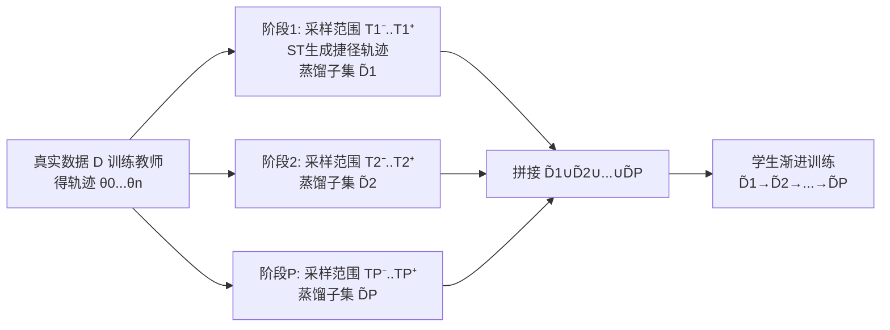

# Multimodal Dataset Distillation via Phased Teacher Models

**会议**: ICLR 2026  
**代码**: [https://github.com/Previsior/PTM-ST](https://github.com/Previsior/PTM-ST)  
**领域**: 多模态 / 数据集蒸馏  
**关键词**: 多模态数据集蒸馏, 轨迹匹配 (MTT), 阶段化教师, Shortcut Trajectory, 图文检索  

## 一句话总结
针对多模态数据集蒸馏中"教师只在前 20–30% 训练阶段有用、后期轨迹不稳定"的现象，本文提出 PTM-ST，用**分阶段教师 + 捷径插值轨迹**把蒸馏拆成多个子任务并稳定梯度方向，在 Flickr30k/COCO 图文检索上大幅超越 SOTA（Flickr30k 平均 +9.53%，最高 +13.5%）。

## 研究背景与动机
**领域现状**：数据集蒸馏 (Dataset Distillation, DD) 通过合成一小批"浓缩样本"来近似大规模数据的训练动态，在单模态图像上已较成熟；近期 MTT-VL、LoRS 等工作尝试把基于轨迹匹配 (Match-Training-Trajectory, MTT) 的蒸馏迁移到图文多模态场景，主要做法是套用单模态策略或加低秩相似度矩阵增强跨模态对齐。

**现有痛点**：这些方法停留在"改数据结构 / 改距离度量"的表层，没有追问多模态与单模态蒸馏在机理上的本质差别。作者做了一个关键对照实验（统一 MTT 框架下）发现：单模态任务里教师在整个训练过程都能提供有效指导，但**多模态蒸馏只受益于前 20–30% 的训练 epoch**——教师后期性能还在涨，直接拿来蒸馏反而让学生性能急剧下降。

**核心矛盾**：进一步分析教师传给合成数据的梯度发现，随训练进行梯度范数越来越大（信号越来越强），但**梯度方向高度不一致、抖动剧烈**。于是出现两难：后期教师"懂得多"却"教得乱"，单一合成子集长期承受高幅值、不稳定的更新，无法可靠吸收跨阶段知识。作者推断这源于多模态数据的稀疏性和缺乏显式语义约束，使教师在不同阶段编码了形态差异巨大的知识。

**本文目标**：设计一个能动态适配教师知识演化、稳定跨阶段知识迁移的蒸馏框架。

**核心 idea**：**[分而治之]** 把蒸馏沿时间轴拆成 P 个阶段、每阶段用各自的"阶段教师"蒸馏一个子集（PTM）；**[稳定轨迹]** 用保留首尾端点的捷径插值轨迹替代原始抖动轨迹，让每阶段的匹配目标平滑、梯度方向一致（ST）。

## 方法详解

### 整体框架
PTM-ST 建立在 LoRS/MTT 的双层循环（外层优化合成数据、内层训练学生匹配教师轨迹）之上，引入两个组件：**分阶段教师模型 (PTM)** 把单一蒸馏目标分解为 P 个时序子任务、每个子任务对应一个阶段教师并蒸出一个子集 $\tilde{D}_p$；**捷径轨迹 (ST)** 在每个阶段用平滑插值轨迹替代原始教师轨迹作为匹配目标。测试时把所有子集 $\tilde{D}_1\cup\cdots\cup\tilde{D}_P$ 拼起来，让学生**渐进式**地先学 $\tilde{D}_1$ 再学 $\tilde{D}_2$……逐步复现教师完整训练动态。

### 关键设计

**1. 分阶段教师模型 (PTM)：把"一个教师教到底"拆成"接力赛"。** 作者首先验证了"简单地按训练阶段切换教师"并不奏效，必须配套轨迹建模。PTM 把蒸馏过程切成 P 个阶段，阶段 $p$ 独立蒸出一个小子集 $\tilde{D}_p$，并动态调整轨迹匹配起点的采样范围 $\{T_p^-,\dots,T_p^+\}$——这个范围随训练推进而往后滑动，于是每个阶段实际是在让对应子集去拟合"那一段"教师的学习动态。阶段 $p$ 的优化目标为 $\tilde{D}^*_p = \arg\min_{\tilde{D}_p} \mathbb{E}_{T\sim(T_p^-,\dots,T_p^+)} L_{PTM}(\tilde{D}_p,\theta^p_T)$，其中匹配损失沿用 MTT 的归一化参数距离 $L_{PTM} = \|\tilde{\theta}^p_{T+t}-\theta^p_{T+\Delta T}\|_2^2 / \|\theta^p_T-\theta^p_{T+\Delta T}\|_2^2$。这样各子集分别聚焦不同阶段的知识，union 起来才覆盖完整训练轨迹，同时也把"单子集长期硬扛大梯度"的压力分摊给多个子集，更新更稳。

**2. 捷径轨迹 (Shortcut Trajectory, ST)：不硬拟合抖动的真实轨迹，而是走插值捷径。** PTM 解决了"分阶段"但没解决"每阶段内部教师轨迹仍然抖"的问题——作者画出不同对齐起点的梯度余弦相似度（图4a），发现原始轨迹上相似度普遍很低、方向乱。ST 的做法是：对阶段 $p$ 设一个端点 $t_p$，只保留首尾两个教师 $\theta_0$ 与 $\theta_{t_p}$ 的关键信息，用插值生成中间"结构更强、引导更清晰"的教师，定义 $\theta^p_t = (1-\beta_p(t))\theta_0 + \beta_p(t)\theta_{t_p}$。权重 $\beta_p(t)$ 不是均匀的，而是按原始轨迹累积位移比例计算 $\beta_p(t) = \sum_{l=0}^{t-1}\text{Norm}(\theta_{l+1}-\theta_l) / \sum_{l=0}^{t_p-1}\text{Norm}(\theta_{l+1}-\theta_l)$，并做逐层 $\ell_2$ 归一化以消除层间尺度差异。与 MCT 等"只用教师轨迹最后一点"的插值不同，ST 给每个阶段用各自的首尾端点，从而捕捉阶段内的逐 epoch 变化。理论上作者证明（命题1）插值轨迹上两个匹配范围的梯度差随起点间隔 $\Delta t$ **线性收敛**（$\|\nabla_{\tilde{D}}L_2 - \nabla_{\tilde{D}}L_1\| \le K\Delta t + O(\Delta t^2)$），而原始轨迹没有这个保证——这从数学上解释了为什么捷径轨迹的优化更稳。

**3. EMA 平滑：再给合成数据本身加一道滤波。** 在外层每次更新合成子集后，用指数滑动平均 $\hat{D}^i_p = \alpha\hat{D}^{i-1}_p + (1-\alpha)\tilde{D}^i_p$（decay $\alpha=0.99$）对蒸馏数据做平滑，进一步抑制迭代过程中的高频噪声。消融显示 EMA 单独提升有限，但与 PTM/ST 叠加后稳定收益。整套流程（采样阶段起点→训练学生→算 MTT 损失→梯度下降更新图像/文本/相似度矩阵→EMA）汇总在算法1中。

## 实验关键数据

### 主实验（Flickr30k，R@K，越高越好）
评测对图文检索：IR@K 为文搜图、TR@K 为图搜文；对比 core-set 选择 (Random/Herd/K-center/Forget) 与蒸馏方法 (MTT-VL/LoRS/EDGE)。

| Pairs | 指标 | LoRS (SOTA) | PTM-ST | △ |
|---|---|---|---|---|
| 100 (0.3%) | IR@10 | 35.5 | **41.5** | +6.0 |
| 100 | TR@10 | 44.9 | **52.7** | +7.8 |
| 200 (0.7%) | IR@10 | 40.0 | **48.5** | +8.5 |
| 200 | TR@5 | 36.1 | **45.9** | +9.8 |
| 500 (1.7%) | TR@5 | 37.6 | **51.1** | +14.0 |
| 500 | TR@10 | 51.1 | **64.6** | +13.5 |

COCO（更难、更稀疏）上同样全面领先：

| Pairs | 指标 | LoRS (SOTA) | PTM-ST | △ |
|---|---|---|---|---|
| 200 (1.7‰) | IR@10 | 14.7 | **22.2** | +7.5 |
| 200 | TR@10 | 20.8 | **27.8** | +7.0 |
| 500 (4.4‰) | IR@10 | 19.2 | **30.7** | +11.5 |
| 500 | IR@5 | 11.8 | **20.5** | +8.7 |

在更大的 LLaVA-cc3m（595k 图文对，按 3:1:1 划分）上也持续超越 LoRS（如 500 pairs IR@5 6.2→11.4），验证方法在数据规模与模型容量放大后依然有效。

### 消融实验（500 pairs，Flickr30k IR / TR @K）

| 配置 | IR@1 | IR@5 | IR@10 | TR@1 | TR@5 | TR@10 |
|---|---|---|---|---|---|---|
| BASE | 12.2 | 33.0 | 45.7 | 16.2 | 39.4 | 54.0 |
| +EMA | 12.9 | 33.7 | 46.3 | 16.2 | 40.6 | 54.3 |
| +PTM | 13.4 | 35.2 | 48.1 | 19.6 | 43.2 | 55.5 |
| +ST | 14.2 | 37.8 | 50.8 | 19.5 | 45.1 | 59.3 |
| PTM+ST | **15.4** | **38.8** | **52.2** | **22.3** | **50.5** | **64.6** |

### 关键发现
- **三组件均正贡献且互补**：PTM 与 ST 单独都有效，组合 (PTM+ST) 收益最大，TR@10 从 54.0 提到 64.6；EMA 起辅助稳定作用。
- **极致压缩比**：Flickr30k 上仅用 **1.7% 数据**即达到全量训练 **76%** 的性能。
- **样本越多优势越大**：合成对数从 100→500，PTM-ST 相对 SOTA 的增益持续扩大，说明分阶段确实让不同子集吃到不同阶段的教师动态。
- **core-set 选择全面失效**：Random/Herd/K-center 等选择法接近或差于随机，印证它们难以建模跨模态训练动态。
- 全程在**单张 3090** 上完成，存储与显存开销低。

## 亮点与洞察
- **机理诊断先于方法**：本文最有价值的不是 trick，而是先用对照实验+梯度可视化揭示"多模态蒸馏只吃前 20–30% 教师、后期轨迹方向乱"这一反直觉现象，把问题从"对齐/度量"重新定位到"教师训练动态的稳定性"。
- **理论与现象闭环**：命题1 用 Hessian Lipschitz 假设证明插值轨迹梯度差随 $\Delta t$ 线性收敛，给 ST 的"为什么更稳"提供了可证明的解释，而不只是经验观察。
- **分阶段 = 知识分工 + 负载分摊**：把单子集换成多子集，既让每个子集专注一段知识，又避免单一数据长期承受大幅不稳定梯度，一举两得。

## 局限与展望
- **任务范围窄**：实验全部集中在图文检索 (retrieval)，未验证在 VQA、caption 生成、多模态分类等下游任务上的蒸馏效果。
- **阶段数/采样范围为超参**：阶段划分 P、每阶段的 $T_p^-/T_p^+$、端点 $t_p$ 等需要预设，论文未充分讨论其自适应选择，迁移到新数据集可能需要调参。
- **依赖 MTT 范式**：方法建立在轨迹匹配上，需要先训练并存储教师轨迹，相比 distribution-matching 类方法在超大规模数据上的成本仍待评估。
- **编码器较传统**：主实验用 NFNet+冻结 BERT，虽附录试了 DiNo-v2/BGE，但与当前主流大型 VLM（CLIP-L、SigLIP 等）的兼容性与收益还需更系统验证。

## 相关工作与启发
- **轨迹匹配蒸馏 (MTT 系)**：MTT、TESLA、MTT-VL、LoRS 是直接前身，本文继承其双层循环但重构了教师轨迹的使用方式。
- **轨迹插值/凸化**：与 MCT (Matching Convexified Trajectory) 的对比是 ST 的关键区别点——MCT 只用末端点单条插值，本文分阶段用各自首尾端点。
- **启发**：① "教师在不同阶段编码不同形态知识"这一视角可推广到一般知识蒸馏/课程学习，提示"何时该信教师"本身值得建模；② 用累积位移比例做非均匀插值权重、并逐层归一化，是处理"参数空间各层尺度不一"的实用技巧，可借鉴到其他轨迹/权重平均方法。

## 评分
- **新颖性**: ⭐⭐⭐⭐ 通过对照实验发现多模态蒸馏特有的"阶段化知识鸿沟"，并用分阶段教师+捷径轨迹+理论证明系统应对，问题定位新颖、方案自洽。
- **实验充分度**: ⭐⭐⭐⭐ Flickr30k/COCO/LLaVA-cc3m 三数据集、三压缩比、完整消融与梯度可视化齐备；扣分在于仅限检索任务、缺更多下游与大型 VLM 验证。
- **写作质量**: ⭐⭐⭐⭐ "现象→假设→方法→理论→实验"逻辑清晰，图2/图4 可视化有力支撑论点。
- **价值**: ⭐⭐⭐⭐ 在 1.7% 数据达全量 76% 性能、单卡可跑，对多模态数据高效利用有实际意义，且揭示的机理对蒸馏社区有启发。

<!-- RELATED:START -->

## 相关论文

- [\[ICLR 2026\] Asynchronous Matching with Dynamic Sampling for Multimodal Dataset Distillation](asynchronous_matching_with_dynamic_sampling_for_multimodal_dataset_distillation.md)
- [\[ICLR 2026\] Multimodal Dataset Distillation Made Simple by Prototype-Guided Data Synthesis](multimodal_dataset_distillation_made_simple_by_prototype-guided_data_synthesis.md)
- [\[CVPR 2026\] Multimodal Distribution Matching for Vision-Language Dataset Distillation](../../CVPR2026/multimodal_vlm/multimodal_distribution_matching_for_vision-language_dataset_distillation.md)
- [\[ICLR 2026\] Thinking as Society: Multi-Social-Agent Self-Distillation for Multimodal Misinformation Detection](thinking_as_society_multi-social-agent_self-distillation_for_multimodal_misinfor.md)
- [\[NeurIPS 2025\] CovMatch: Cross-Covariance Guided Multimodal Dataset Distillation with Trainable Text Encoder](../../NeurIPS2025/multimodal_vlm/covmatch_crosscovariance_guided_multimodal_dataset_distillat.md)

<!-- RELATED:END -->
