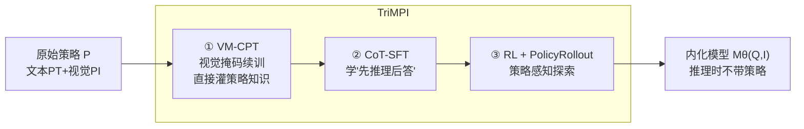

# Multimodal Policy Internalization for Conversational Agents

**会议**: ICLR 2026  
**OpenReview**: [https://openreview.net/forum?id=fSE0rUngCX](https://openreview.net/forum?id=fSE0rUngCX)  
**代码**: 待确认（论文承诺开源数据集、训练配方与评测）  
**领域**: 多模态大模型 / 策略内化 / 对话智能体  
**关键词**: Multimodal Policy Internalization, TriMPI, PolicyRollout, VM-CPT, GRPO/DAPO, Tool-Use Agent  

## 一句话总结
提出"多模态策略内化（MPI）"新任务——把冗长复杂的多模态策略（决策规则、工具调用规则、甚至演示图）从 in-context prompt 写进模型参数里，并用三阶段训练框架 **TriMPI**（视觉掩码续训 + CoT-SFT + 带 PolicyRollout 的 RL）让模型在推理时不带策略也能高度合规，相对 CoT-SFT 基线绝对提升最高达 70.7%。

## 研究背景与动机
- **领域现状**：ChatGPT、Alexa+ 这类 LLM 对话智能体靠"策略（policy）"约束行为——模型元信息、回复风格、工具调用规则等，通常作为 in-context 前缀注入。这些策略越来越长（估计 1K~50K tokens），而用户真实 query 只有 50~200 tokens，导致策略 prompt 带来 20×~250× 的固定输入 token 开销，且与 query 无关、每次都付。
- **现有痛点**：(1) prompt 压缩工作只压缩模板和示例（推理负担轻），管不了需要多跳推理的策略；(2) deliberative alignment 等策略对齐工作只内化纯文本安全规范，且只在文本模型上做过；(3) 多模态对话智能体的策略越来越绑定视觉任务、甚至包含演示图，但**没有任何工作研究如何在多模态模型里学习并内化复杂策略**。
- **核心矛盾**：策略既要"够长够复杂"才能管住多模态智能体的决策与工具调用，又会带来巨大固定算力开销且模型常常不能忠实遵守——能不能把策略知识写进参数、同时还**提升**遵守能力？
- **本文目标**：训练出"推理时不需要 in-context 策略也能产生合规响应"的多模态模型，覆盖 reasoning-intensive 的决策与工具调用任务，并兼顾效率、对策略更新的泛化、以及抗灾难性遗忘。
- **核心 idea**：**直接拿原始策略当训练监督**。作者发现"训练时塞策略、推理时撤掉"会让性能接近随机；于是提出 (1) 在 SFT 前用**续训直接把策略灌进参数**，(2) 提出 **PolicyRollout** 让 RL 探索阶段能看到带策略的响应、却不引入 train/inference gap。

## 方法详解

### 整体框架
任务形式化为：把响应从 $A = M_\theta(Q, I, P)$ 内化成 $A = M_\theta(Q, I)$，即在不提供策略上下文 $P=(P_T, P_I)$（文本+视觉两部分）的情况下生成合规响应。TriMPI 是三阶段流水线：**① VM-CPT**（视觉掩码续训，把策略知识直接注入参数）→ **② CoT-SFT**（链式思维监督微调，学会"先按规则推理再回答"）→ **③ RL with PolicyRollout**（强化学习，靠试错覆盖更广的策略相关行为）。作者还构建了两个新数据集 **ClevrPolicy**（可控复杂度的决策树策略，基于 CLEVR 合成图）和 **GTAPolicy**（真实世界图像的工具调用策略，低数据场景）来支撑训练与评测。

### 关键设计

**1. VM-CPT 视觉掩码续训：把整份策略"背"进参数。** 这一阶段在 SFT 之前，目标是把策略知识显式注入参数。作者构造续训序列 $x=(P_T, P_I, I, Q, C, A)$——拼接策略文本/视觉、视觉输入、query、CoT 推理 $C$ 与答案 $A$，然后对**除视觉 token 外的所有 token**计算 next-token 预测损失：

$$L(\theta) = -\mathbb{E}_{x\sim D}\left[\frac{1}{\sum_t m_t}\sum_{t=1}^{T} m_t \log p_\theta(x_t\mid x_{<t})\right],\quad m_t = \mathbb{1}[x_t\notin P_I\cup I]$$

视觉掩码 $m_t$ 是关键——多模态域里连续视觉 token 同时出现在输入 $I$ 和策略 $P_I$ 中，对它们做语言建模损失没有意义，掩掉后才能把文本域成熟的 CPT 技巧迁移过来。这一步等于让模型先"通读并记住"策略，为后续推理打底。

**2. RL 阶段：靠试错覆盖 SFT 覆盖不到的策略行为。** 策略越复杂、reasoning 越重，SFT 在低数据下越难穷尽所有策略相关行为。作者引入 RLVR（可验证奖励的强化学习），让模型输出 `<think></think>` 思考块 + `\boxed{}` 答案块，同时给 format reward 和 accuracy reward，底座用 GRPO 和 DAPO。RL 能从负样本和探索中学习，是内化"reasoning-intensive 策略"的核心——消融显示 RL 贡献了相对 SFT 的大部分增益。但作者发现纯 GRPO/DAPO 的探索**没有 grounding 在策略上**，复杂策略下探索很难碰到正奖励。

**3. PolicyRollout (PoRo)：让探索"看得见"策略，又不破坏 train/inference 对齐。** 这是本文最巧的设计。直接在训练时把策略塞 prompt 会造成推理时撤掉的 gap。PoRo 的做法是：rollout 阶段对每个采样实例**额外构造一份带策略 in-context 的变体**，用当前策略模型在 $(Q,I,P)$ 条件下再生成一组"策略感知响应"，把它们和原本不带策略的响应拼成同一个 rollout 空间，再做组内 advantage 估计。以 GRPO 为例：

$$J_{\text{PoRo-GRPO}}(\theta)=\mathbb{E}_{\{o_i\}_{i=1}^{G}\sim\pi_{\theta_{old}}(O|Q,I),\,\{o_j\}_{j=G}^{2G}\sim\pi_{\theta_{old}}(O|Q,I,P)}\Big[\tfrac{1}{2G}\sum_{i=1}^{2G}\big\{\min[r_i(\theta)\hat A_i,\,\mathrm{clip}(r_i(\theta),1-\epsilon_l,1+\epsilon_h)\hat A_i]-\beta D_{KL}[\pi_\theta\|\pi_{ref}]\big\}\Big]$$

其中 $r_i(\theta)=\pi_\theta(o_i|Q,I)/\pi_{\theta_{old}}(o_i|Q,I)$。**精髓在于：带策略路径只用来扩充 rollout、贡献高质量的探索样本（它们更容易拿到正奖励），但 policy gradient 只作用在不带策略的路径**（仅以 $Q,I$ 为条件），从而保证训练和推理始终对齐。这样既得到了策略 grounding 的探索红利，又不让模型在推理时依赖策略。

## 实验关键数据

### 主实验与消融（Qwen2.5-VL-7B，ClevrPolicy N=6）

| 方法 | 阶段 | ClevrPolicy-T | ClevrPolicy-M | GTAPolicy Overall |
|------|------|---------------|---------------|-------------------|
| In-Context（带策略，无内化） | — | 13.15 | 5.65 | 21.51 |
| Direct SFT | SFT | 15.15 | 14.55 | 40.75 |
| CoT SFT | SFT | 17.80 | 14.30 | 54.50 |
| VM-CPT + CoT SFT | CPT+SFT | 22.75 | 27.05 | 65.47 |
| CoT SFT + DAPO | SFT+RL | 67.60 | 74.40 | 72.43 |
| TriMPI w/ GRPO（无 PoRo） | 全 | 55.90 | 80.80 | 79.33 |
| **TriMPI w/ PoRo-GRPO** | 全 | 65.85 | **84.70** | **81.06** |
| **TriMPI w/ PoRo-DAPO** | 全 | **77.80** | 85.00 | 76.01 |

最优模型相对 CoT-SFT 基线绝对提升最高 **70.7%**、相对 in-context 设置最高 **79.4%**。

### 关键发现
- **逐阶段都有用**：VM-CPT、RL、PoRo 三者均带来增量；RL 贡献最大（reasoning-intensive 策略靠试错学习），VM-CPT 对 RL 阶段增益更明显（探索更 grounded），PoRo 在 GRPO/DAPO 之上再涨。
- **效率**：撤掉策略后 prompt token 减少最高 **93.9%**、prefill 推理时间减少 **85.7%**。
- **泛化（Policy Override）**：策略被更新/覆盖后再 in-context 给模型，TriMPI 一致优于所有基线（ClevrPolicy-M 从 CoT-SFT 的 25.20 → PoRo-GRPO 的 82.70）。
- **策略知识注入（Policy Referral）**：用 Claude-4 给"中间思考与原策略一致性"打 0–10 分，TriMPI 拿到 8.72/9.45 等高分，说明它不只学会端任务行为，还真的内化了策略本身。
- **抗遗忘**：在 MMMU-Pro / MMLU-Pro 上，基线在低数据的 GTAPolicy 上 MPI 后明显退化，TriMPI 全设置保持强通用推理。
- **复杂度越高收益越大**：N=4 简单策略上 TriMPI 与基线差距小，N=6 复杂策略上优势显著；3B 模型上同样成立。
- **DAPO vs GRPO**：DAPO 因去掉 reference KL 更新更激进，在数据更丰富的 ClevrPolicy 上学得更快，但在低数据 GTAPolicy 上易过拟合，所以 GRPO 反而更好。

## 亮点与洞察
- **问题定义有开创性**：第一个把"多模态策略内化"作为独立任务提出，区分于 prompt 压缩（只压模板）和文本安全对齐（只内化纯文本规范），并配齐了数据集 + 训练配方 + 评测协议。
- **PolicyRollout 是个可复用的小招**：用"带策略路径只扩 rollout、不回传梯度"这一招，干净地解决了"想用策略 grounding 探索却怕 train/inference gap"的两难，可直接套到任何 GRPO 系算法。
- **评测维度全面**：除了端任务准确率，还专门设计了 Policy Override（泛化）、Policy Referral（知识注入程度）、Policy In-Context（撤策略之外的纯增益）、抗遗忘四个角度，论证 TriMPI 不是单纯过拟合某份策略。
- **ClevrPolicy 用决策树深度 N 精确控制策略复杂度**，让"算法在不同复杂度下的表现"成为可量化研究对象，是很好的 benchmark 设计。

## 局限与展望
- **数据仍偏合成/受限**：ClevrPolicy 基于 CLEVR 合成图，GTAPolicy 工具调用规则也是人造的（13 工具、24 规则），离真实生产环境的开放策略还有距离。
- **遗留错误**：错误分析显示仍有感知错误（漏检遮挡物体、相似物体属性混淆）和推理错误（分支到不存在的 Condition、幻觉规则、误用交互历史）；branching error 表明 grounding 仍不完美。
- **策略更新成本**：策略一旦改动，理论上仍需重训内化（虽然 Policy Override 显示能部分靠 in-context 兜底），频繁更新场景的增量内化没深入探讨。
- **训练开销**：PoRo 的 rollout 翻倍带来额外计算；三阶段流水线相比单纯 SFT 更重。
- **展望**：把 MPI 推广到更大模型、真实业务策略、以及与安全规范的联合内化，是自然的下一步。

## 相关工作与启发
- **Prompt 压缩**（LLMLingua、Gist tokens、渐进式微调等）：只压缩模板和示例，本文指出它们不处理需要推理的策略。
- **Deliberative Alignment**（Guan et al. 2024）：内化复杂安全规范、强调超越 token 压缩的策略遵守，但限于文本模型与可信度问题——本文把这条线推进到多模态、决策/工具调用域。
- **RLVR / GRPO / DAPO**：本文在其上做 PolicyRollout 扩展；对"如何把外部知识/约束 grounding 进 RL 探索"有借鉴意义。
- **续训知识注入**（Ovadia et al.、Maini et al.）：VM-CPT 是其多模态变体，视觉掩码是让文本域 CPT 迁移到多模态的关键改动。
- **启发**：任何"长固定上下文（system prompt / 工具手册 / 业务规则）"的智能体系统，都可借这套"续训灌知识 + 策略感知 RL 探索"范式把上下文搬进参数，换取大幅 prefill 提速与更稳的合规性。

## 评分
- **新颖性**: ⭐⭐⭐⭐⭐ 首次提出多模态策略内化任务，PolicyRollout 思路巧妙且通用。
- **实验充分度**: ⭐⭐⭐⭐⭐ 两数据集 + 多复杂度 + 多模型尺寸 + 泛化/知识注入/抗遗忘/效率/错误分析全覆盖。
- **写作质量**: ⭐⭐⭐⭐ 动机清晰、图表充分；公式与三阶段叙述完整，少量符号略密集。
- **价值**: ⭐⭐⭐⭐⭐ 直击对话智能体长策略 prompt 的成本与遵守痛点，落地价值与研究基础意义都强。

<!-- RELATED:START -->

## 相关论文

- [\[CVPR 2026\] HiconAgent: History Context-aware Policy Optimization for GUI Agents](../../CVPR2026/multimodal_vlm/hiconagent_history_context-aware_policy_optimization_for_gui_agents.md)
- [\[CVPR 2026\] DialogueVPR: Towards Conversational Visual Place Recognition](../../CVPR2026/multimodal_vlm/dialoguevpr_towards_conversational_visual_place_recognition.md)
- [\[ICLR 2026\] PSP: Prompt-Guided Self-Training Sampling Policy for Active Prompt Learning](psp_prompt-guided_self-training_sampling_policy_for_active_prompt_learning.md)
- [\[CVPR 2026\] Tackling Alignment Ambiguity in Person Retrieval through Conversational Attribute Mining](../../CVPR2026/multimodal_vlm/tackling_alignment_ambiguity_in_person_retrieval_through_conversational_attribut.md)
- [\[CVPR 2026\] Towards Policy-Adaptive Image Guardrail: Benchmark and Method](../../CVPR2026/multimodal_vlm/towards_policy-adaptive_image_guardrail_benchmark_and_method.md)

<!-- RELATED:END -->
