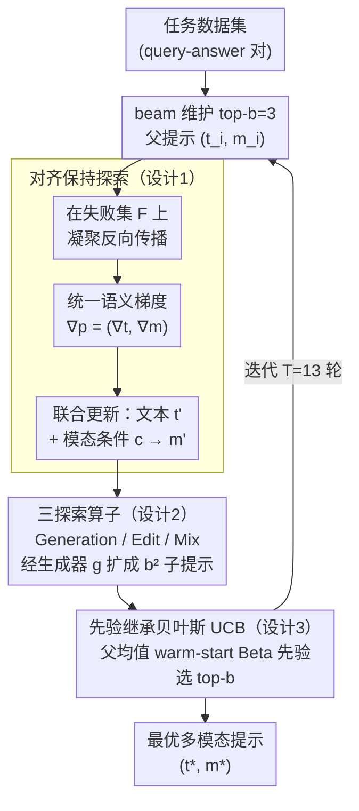

# Multimodal Prompt Optimization: Why Not Leverage Multiple Modalities for MLLMs

**会议**: ICLR 2026  
**arXiv**: [2510.09201](https://arxiv.org/abs/2510.09201)  
**代码**: [GitHub](https://github.com/Dozi01/MPO)  
**领域**: 多模态VLM/提示优化  
**关键词**: 多模态提示, 自动提示优化, 贝叶斯选择, MLLM, 跨模态对齐

## 一句话总结
首次将自动提示优化（APO）从纯文本空间扩展到多模态空间，提出 MPO 框架：通过对齐保持的联合探索（统一语义梯度同步驱动文本+非文本提示更新，配合 Generation/Edit/Mix 三种算子多样化搜索）和先验继承的贝叶斯 UCB 候选选择（利用父提示性能 warm-start 子提示的 Beta 先验），在图像/视频/分子共 10 个数据集上平均准确率达 65.1%，超越最强文本 APO 基线 ProTeGi 的 60.0%。

## 研究背景与动机

**领域现状**：多模态大模型（MLLM）如 Qwen2.5-VL、GPT-4o 等已具备同时处理文本、图像、视频、分子等多种模态输入的能力。与此同时，自动提示优化（APO）领域已发展出 APE、OPRO、PE2、ProTeGi、SEE 等方法，通过迭代生成→评估→改进来自动发现高质量提示，显著降低了手工 prompt engineering 的负担。

**现有痛点**：所有现有 APO 方法都仅优化文本提示，完全忽略了 MLLM 的多模态输入能力。然而文本在传达某些信息时天然低效——例如描述一种鸟的独特羽毛纹理需要冗长且可能有歧义的文字，而一张参考图像能更直观准确地传达同样的视觉特征。将优化限制在纯文本空间，相当于在一个本质上低维的子空间里搜索，无法充分利用 MLLM 的表达能力。

**核心矛盾**：将提示搜索空间从 $\mathcal{T}$ 扩展到 $\mathcal{T} \times \mathcal{M}$ 带来两大根本挑战：(1) **跨模态一致性**——独立更新文本和非文本提示容易产生语义冲突（如文本说"关注翅膀颜色"但图像展示了错误的纹理），组合爆炸加剧了这一风险；(2) **候选选择困难**——在扩大的空间中高质量提示变得极度稀疏，大量评估预算可能浪费在低潜力候选上，现有均匀分配或标准 UCB 策略面临严重的冷启动问题。

**本文目标** (1) 如何在联合文本+非文本提示空间中高效探索且保持跨模态对齐；(2) 如何从大量候选中快速识别高质量多模态提示而不浪费评估预算。

**切入角度**：作者观察到两个关键事实——其一，如果文本和非文本更新由同一个"语义梯度"（failure analysis 反馈）驱动，就能自然保持对齐；其二，父提示和子提示的性能存在强正相关（Pearson $r = 0.88$），这意味着父提示的评估结果可以作为子提示的有价值先验，从而将"冷启动"转化为"温启动"。

**核心 idea**：用统一反馈驱动的联合更新解决跨模态一致性，用父子性能相关性驱动的贝叶斯先验继承解决候选选择效率，从而将 APO 推广到多模态空间。

## 方法详解

### 整体框架

MPO 要解决的问题是：把自动提示优化从纯文本空间 $\mathcal{T}$ 扩展到「文本+非文本」联合空间 $\mathcal{T} \times \mathcal{M}$，又不让两个模态各更各的导致语义打架、也不在稀疏的高质量候选里浪费评估预算。整体采用 beam search 框架，每轮迭代维护 $b=3$ 个最优多模态提示 $\{(\mathbf{t}_i, \mathbf{m}_i)\}$。对每个父提示，先做**对齐保持探索**——从失败案例读出一份同时覆盖文本和非文本的统一反馈，再据此联合更新文本提示和非文本提示；接着用 **Generation / Edit / Mix 三种探索算子**把每个父提示扩成多个候选，一轮共生成 $b^2$ 个子提示；最后用**先验继承的贝叶斯 UCB**从这堆候选里选出新的 top-$b$ 作为下一轮父提示。整个过程迭代 $T=13$ 轮，输入是任务数据集（query-answer 对），输出是性能最优的多模态提示对 $(\mathbf{t}^*, \mathbf{m}^*)$。第一轮因为还没有非文本提示，只用 Generation 算子初始化。

### 关键设计

**1. 对齐保持探索：让文本和非文本提示被同一个反馈牵着走，避免各更各的**

把搜索空间从 $\mathcal{T}$ 扩到 $\mathcal{T} \times \mathcal{M}$ 后，最怕的就是文本说"关注翅膀颜色"、图像却改了别处纹理这种语义打架。MPO 的解法是把更新拆成两步、但只用一个反馈源。第一步**凝聚反向传播**：从当前提示 $(\mathbf{t}, \mathbf{m})$ 的失败集 $\mathcal{F}$ 出发，让 MLLM 一次性生成同时涵盖文本和非文本两个维度弱点的统一反馈 $\nabla_{\mathbf{p}} = (\nabla_{\mathbf{t}}, \nabla_{\mathbf{m}})$——注意这里不是分别给两个模态各算一份梯度，而是从同一批失败案例里读出"哪儿不对"。第二步**联合多模态更新**：基于这份统一反馈，MLLM 同时输出更新后的文本提示 $\mathbf{t}'$ 和一个模态特定的文本条件 $\mathbf{c}$（描述非文本提示该怎么改），$\mathbf{c}$ 再喂给模态生成器 $g$（text-to-image 用 GPT-Image、text-to-video 用 Wan2.1、分子则走 text-to-molecule 模块），产出新的非文本提示 $\mathbf{m}' = g(\mathbf{c})$。因为文本侧和非文本侧的修改都源自同一份 $\nabla_{\mathbf{p}}$，两者天然指向同一个语义目标。实验里这一联合更新的 DSG 对齐分数明显高于"先改文本再改图像"的 Sequential 策略，印证了共享反馈对一致性的作用。

**2. 三种探索算子：用 Generation / Edit / Mix 覆盖搜索空间的不同区域，别都挤在局部最优附近**

光有对齐还不够，候选要足够多样才不会困在一处。MPO 给非文本提示设计了三个互补的生成算子。**Generation** 从零生成全新非文本提示 $\mathbf{m}' = g(\mathbf{c}_{\text{gen}}, \varnothing)$，不参考任何已有候选，适合优化早期或候选池被带偏时跳出来。**Edit** 在已有提示上做细粒度微调 $\mathbf{m}' = g(\mathbf{c}_{\text{edit}}, \{\mathbf{m}\})$，保留好的整体结构、只动局部属性（纹理、颜色等），适合提示已经较强、只差临门一脚的阶段。**Mix** 则融合 $K$ 个父提示的互补优势 $\mathbf{m}' = g(\mathbf{c}_{\text{mix}}, \{\mathbf{m}_i\}_{i=1}^K)$，把多个候选各自擅长的特征拼成一个更均衡的方案，避免吊死在单一候选上。三者各有所长：消融里 Mix 把 Grape 这种难子任务从 48.0% 直接拉到 65.1%，而三算子组合用在 PlantVillage 上平均达 76.4%，超过任一单算子的最佳值 74.8%。

**3. 先验继承贝叶斯 UCB：用父提示的成绩给子提示"温启动"，少在差候选上浪费评估**

扩大空间后高质量提示变得极稀疏，$b^2$ 个候选若都从零评估，预算会大量喂给低潜力的臂。MPO 抓住一个经验规律——父提示和子提示性能强正相关（Pearson $r = 0.88$），于是把每个候选的期望得分建模成 Beta 分布 $\text{Beta}(\alpha_i, \beta_i)$，并直接用父提示的后验均值 $\hat{\mu}_{\text{par}}$ 来初始化子提示的先验：

$$\alpha_i = \hat{\mu}_{\text{par}} \cdot S + 1, \qquad \beta_i = (1 - \hat{\mu}_{\text{par}}) \cdot S + 1$$

其中 $S = 10$ 为先验强度。每轮挑 UCB 得分最高的候选去评估、更新其后验，预算用尽后选期望得分最高者。和把新候选当无先验独立臂的标准 UCB / 均匀分配相比，这种"温启动"把冷启动开销直接省掉：达到相同性能时比均匀分配省 70% 评估预算、比无先验 UCB 省 42%。理论上 Proposition 3.1 也证明了——只要先验比均匀先验更 informative，最佳臂识别的代价不会增加。

### 损失函数 / 训练策略

MPO 是无梯度优化框架，不涉及传统意义的损失函数。优化目标是最大化任务特定评估指标（如准确率）：$(\mathbf{t}^*, \mathbf{m}^*) = \argmax_{(\mathbf{t}, \mathbf{m}) \in \mathcal{T} \times \mathcal{M}} \mathbb{E}_{(\mathbf{q}, \mathbf{a}) \sim \mathcal{D}}[f(\text{MLLM}(\mathbf{t}, \mathbf{m}, \mathbf{q}), \mathbf{a})]$。评估时 GPT-4o mini 作为 prompt optimizer 负责 failure analysis 和提示更新，beam size $b=3$，13 轮迭代，每个候选提示分配 100 次评估预算，先验强度 $S = 10$（预算的 10%）。

## 实验关键数据

### 主实验（10 数据集 × 3 模态）

| 方法 | PlantVillage | CUB-200 | SLAKE | DrivingVQA | RSVQA | Drive&Act | VANE | Absorption | BBBP (F1) | CYP (F1) | 平均Acc |
|------|-------------|---------|-------|------------|-------|-----------|------|------------|----------|---------|--------|
| Human | 42.2 | 47.9 | 35.2 | 49.7 | 51.0 | 47.3 | 47.0 | 38.5 | 39.4 | 43.1 | 44.1 |
| CoT | 43.1 | 49.0 | 30.8 | 52.9 | 49.6 | 37.2 | 31.6 | 39.6 | 36.7 | 32.5 | 40.8 |
| 5-Shot | 46.5 | 58.1 | 28.0 | 45.9 | 49.2 | 54.3 | 61.4 | 48.1 | 45.5 | 49.3 | 49.3 |
| APE | 55.8 | 67.3 | 34.3 | 52.8 | 54.4 | 50.3 | 64.3 | 45.7 | 40.4 | 34.7 | 51.3 |
| PE2 | 67.9 | 71.6 | 35.8 | 53.7 | 55.2 | 50.8 | 63.0 | 64.5 | 56.8 | 58.2 | 58.2 |
| ProTeGi | 64.4 | 70.0 | 35.4 | 54.4 | 54.2 | 53.0 | 65.5 | 71.1 | 58.2 | 65.7 | 60.0 |
| SEE | 69.0 | 71.6 | 35.0 | 52.2 | 53.4 | 51.7 | 57.9 | 71.4 | 60.0 | 62.3 | 59.1 |
| **MPO** | **76.4** | **78.6** | **38.2** | **56.0** | **55.9** | **58.3** | **71.2** | **76.7** | **64.5** | **67.6** | **65.1** |

MPO 在所有 10 个数据集上均取得最佳，平均 Acc 65.1% 超越最强文本 APO 基线 ProTeGi（60.0%）5.1 个百分点。

### 消融实验与泛化性分析

| 消融配置 | PlantVillage Avg | CUB Avg | 说明 |
|---------|-----------------|---------|------|
| Human text + 无图像 | 42.2 | 47.9 | 基线 |
| Human text + MPO 图像 | 50.4 | 58.2 | 仅非文本提示优化即可 +8~10% |
| MPO text + 无图像 | 55.6 | 64.2 | 仅文本优化 |
| **MPO text + MPO 图像** | **76.4** | **78.6** | 两模态联合，远超单模态之和 |

| 探索算子 | Apple | Corn | Grape | Potato | PlantVillage 平均 |
|---------|-------|------|-------|--------|-----------------|
| SEE (text only) | 76.4 | 75.9 | 48.0 | 75.7 | 69.0 |
| 仅 Generation | 76.9 | 77.9 | 53.7 | 83.6 | 73.3 |
| 仅 Edit | 77.2 | 76.3 | 56.2 | 80.1 | 72.5 |
| 仅 Mix | 74.0 | 77.9 | 65.1 | 79.8 | 74.8 |
| **MPO (三算子组合)** | **77.7** | **78.2** | **65.9** | **84.0** | **76.4** |

| 骨干模型泛化 | Human | ProTeGi | SEE | **MPO** |
|-------------|-------|---------|-----|---------|
| Qwen2.5-VL (72B) | 55.7 | 74.1 | 73.6 | **80.4** |
| Gemma3 (12B) | 45.6 | 68.2 | 68.1 | **73.1** |
| InternVL-3.5 (14B) | 51.6 | 71.9 | 70.8 | **73.2** |
| GPT-4.1 nano | 46.8 | 61.0 | 61.6 | **65.9** |

### 关键发现
- **模态贡献是互增而非叠加的**：MPO text（55.6）+ MPO image（50.4 under human text）远小于联合提示（76.4），说明两个模态之间存在协同增效——图像提供了文本无法编码的细粒度视觉线索，而文本则引导模型"关注那张图的哪些特征"
- **Mix 算子对困难子任务贡献最大**：Grape 子任务从 SEE 的 48.0% 单用 Mix 就跳到 65.1%（+17.1%），因为 Mix 能将多个候选中各自擅长的视觉特征融合到一起
- **先验继承效率显著**：在 CUB 数据集上，MPO 在 30% 评估预算时就达到了 Uniform 策略 100% 预算的性能，资源节省 70%
- **训练曲线对比**：ProTeGi 在第 3 轮后基本停滞（仅 +1.1%），MPO 第 3 轮后继续稳定提升 6.4%，说明多模态空间确实提供了逃逸文本局部最优的路径
- **隐藏状态可视化**：文本 only 方法（包括 MPO 的文本分量）的中间层 embedding 聚类在一起，而 MPO 完整多模态提示将 hidden states 推入了一个不同区域，表明非文本分量引入了文本无法覆盖的信息维度
- **先验强度 $S$ 存在最优区间**：过小（$S < 5$）先验不够 informative，过大（$S > 20$）导致过度依赖父提示阻碍新信息吸收，$S = 10$ 附近最优

## 亮点与洞察
- **新问题定义本身即贡献**：将 APO 从 $\mathcal{T}$ 推广到 $\mathcal{T} \times \mathcal{M}$ 是一个看似显然但此前无人做的方向，且实验证明收益巨大。核心 insight 是"MLLM 能处理多模态输入"与"APO 只优化文本"之间存在 mismatch，填补这一 gap 本身就价值非凡
- **生成模型作为优化组件的范式**：将 GPT-Image、Wan2.1 等生成模型嵌入 APO 循环作为"模态翻译器"——接受文本条件 $\mathbf{c}$ 输出非文本提示 $\mathbf{m}'$，这一设计可迁移到任何新模态（音频、3D、代码等）
- **父子性能正相关的经验规律**：$r = 0.88$ 的强相关性使 Bayesian warm-start 有了坚实的经验基础，这一规律可能对所有基于 beam search 的 APO 方法都适用，不仅限于多模态场景
- **跨模态对齐与任务性能的强因果关系**：DSG 对齐分数与 accuracy gain 呈单调递增，MPO > Sequential > Random > In-Distribution > OOD，这意味着对齐质量是多模态提示优化成败的核心指标

## 局限与展望
- **非文本提示质量受制于生成器能力**：MPO 的上限取决于模态生成器（如 GPT-Image）的生成质量。在轻量生成器（如 SANA1.5 1.6B）下性能仍优于文本 only，但与强生成器有 4-5% 的差距，未来生成器进步将自动提升 MPO
- **先验强度 $S$ 需手工调参**：固定为评估预算的 10% 是一个启发式选择，自适应调整 $S$（如根据父子相关性动态缩放）可能进一步提升效率
- **评估成本仍然较高**：每个候选需要 100 次评估，13 轮迭代 × $b^2 = 9$ 个候选 × 100 次 = 上千次 MLLM 推理，对大规模部署仍有成本压力
- **仅验证了分类/VQA 等判别式任务**：在生成式任务（如 captioning、多模态对话）上的效果尚未验证
- **模态类型受限**：当前仅覆盖图像、视频、分子三种非文本模态，音频、3D 点云、代码等模态的适用性需进一步实验

## 相关工作与启发
- **vs ProTeGi / SEE（文本 APO）**：这些方法通过 failure analysis + beam search 在文本空间中搜索最优提示，MPO 继承了这一框架但将搜索空间扩展到 $\mathcal{T} \times \mathcal{M}$，平均 Acc 从 60.0% / 59.1% 提升至 65.1%，证明了多模态维度的额外信息增益
- **vs EvoPrompt（进化算法 APO）**：EvoPrompt 用 mutation/crossover 探索文本空间，类似于 MPO 的 Generation/Mix 算子，但限于文本只达 49.5%；MPO 的三种多模态算子是其自然推广
- **vs MaPLe（连续 prompt 学习）**：MaPLe 学习连续嵌入向量作为多模态 prompt，需要梯度和参数访问；MPO 完全无梯度、适用于闭源 API 模型，更具实用性

## 评分
- 新颖性: ⭐⭐⭐⭐⭐ 首次定义多模态 APO 问题本身就是重要贡献，先验继承 Bayesian UCB 有理论保证
- 实验充分度: ⭐⭐⭐⭐⭐ 3 模态 × 10 数据集 × 7+ baseline，消融、泛化、可视化分析非常全面
- 写作质量: ⭐⭐⭐⭐ 问题定义清晰，理论与实验结合好，图表丰富
- 价值: ⭐⭐⭐⭐⭐ 开辟了 APO 的新方向，框架通用性强，对后续工作有很强的指导意义

<!-- RELATED:START -->

## 相关论文

- [\[ICCV 2025\] MMOne: Representing Multiple Modalities in One Scene](../../ICCV2025/multimodal_vlm/mmone_representing_multiple_modalities_in_one_scene.md)
- [\[ICLR 2026\] Investigating Redundancy in Multimodal Large Language Models with Multiple Vision Encoders](investigating_redundancy_in_multimodal_large_language_models_with_multiple_visio.md)
- [\[ICLR 2026\] OptMerge: Unifying Multimodal LLM Capabilities and Modalities via Model Merging](optmerge_unifying_multimodal_llm_capabilities_and_modalities_via_model_merging.md)
- [\[ICLR 2026\] Importance Sampling for Multi-Negative Multimodal Direct Preference Optimization](importance_sampling_for_multi-negative_multimodal_direct_preference_optimization.md)
- [\[ICLR 2026\] Visual Jigsaw Post-Training Improves MLLMs](visual_jigsaw_post-training_improves_mllms.md)

<!-- RELATED:END -->
