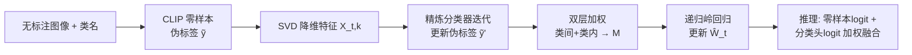

# Naming to Learn: Class Incremental Learning for Vision-Language Model with Unlabeled Data

**会议**: ICLR 2026  
**OpenReview**: [https://openreview.net/forum?id=Hc71kKCEFG](https://openreview.net/forum?id=Hc71kKCEFG)  
**代码**: [https://github.com/zhoujiahuan1991/ICLR2026-N2L](https://github.com/zhoujiahuan1991/ICLR2026-N2L)  
**领域**: 视觉-语言模型 / 类增量学习 / 无标注学习  
**关键词**: Class Incremental Learning, CLIP, 伪标签精炼, 解析式持续学习, 岭回归  

## 一句话总结
N2L 把"类增量学习"放到一个更现实的设定下——每个新任务只给类名和无标注图像，先用 CLIP 零样本打伪标签，再用降维精炼伪标签 + 双层样本加权 + 可递归求解的岭回归，让无标注增量训练逼近联合训练效果、同时抗噪抗遗忘。

## 研究背景与动机
**领域现状**：类增量学习（CIL）让模型在不回看旧数据的前提下持续学习新类别。近期基于预训练模型（ViT、CLIP）的方法只微调分类头和少量参数就能取得不错效果，CLIP 的图文对齐先验尤其适合做增量。

**现有痛点**：几乎所有这些方法都默认每个增量任务有**完整标注**，而真实场景里标注稀缺且昂贵。一个直觉的补救是用 CLIP 把类名转成文本嵌入、按图文相似度给每张无标注图打伪标签，再套现成 CIL 方法。

**核心矛盾**：CLIP 零样本伪标签**天然带噪**，而在增量场景里噪声会被放大——错误标签不仅拉低当前任务精度，还会通过参数更新**加剧灾难性遗忘**。常用的交叉熵损失对标签噪声又格外敏感。

**本文目标**：提出"只有类名 + 无标注数据"的现实 CIL 范式，并在该范式下做到精度逼近全标注训练、同时缓解遗忘。

**核心 idea**：**[噪声鲁棒回归]** 借鉴解析式 CIL（Analytic CIL）用 MSE 岭回归替代交叉熵——回归损失对噪声更鲁棒，且能写成**递归闭式解**，从数学上等价于联合训练因而天然不遗忘；**[伪标签精炼]** 在此基础上用特征降维迭代精炼伪标签；**[双层加权]** 用类间/类内加权同时纠正类别不平衡与样本置信度。

## 方法详解

### 整体框架
N2L 在每个任务 $t$ 上分四步走：(1) 用冻结 CLIP 的图文相似度给无标注图打零样本伪标签；(2) 对图像特征做 SVD 降维，在降维特征上训练一个精炼分类器迭代更新伪标签；(3) 用类间 + 类内双层加权给每个样本算权重；(4) 用全维特征、精炼后的标签和样本权重，以递归岭回归更新增量分类器 $\hat{W}_t$。整条管线全部是闭式可递归求解，无需反向传播。

### 关键设计
**1. 解析式 CIL 底座：用递归岭回归把"无标注增量"变成等价联合训练。** 在所有任务特征 $X_{1:T}$ 和独热标签 $Y_{1:T}$ 上，训练目标写成岭回归 $L(W_T)=\|X_{1:T}W_T-Y_{1:T}\|_F^2+\lambda\|W_T\|_F^2$，闭式解 $\hat{W}_T=(A_T+\lambda I)^{-1}C_T$。关键在于 $A_T,C_T$ 可逐任务**递归累加**：$A_t=A_{t-1}+X_t^\top X_t$，$C_t=C_{t-1}+X_t^\top Y_t$。这样只需存两个矩阵、每来一个任务增量更新，最终解与一次性联合训练**完全一致**，从根上消除了遗忘；同时 MSE 比交叉熵对伪标签噪声更鲁棒，正好契合无标注设定。

**2. 渐进式伪标签精炼：在降维子空间里"洗掉"噪声方向。** 对任务特征做 SVD $X_t=UDV^\top$，只保留奇异值高于阈值 $\theta$ 的前 $k$ 个奇异向量 $V_k$，投影得 $X_{t,k}=X_tV_k$，在降维特征上回归出精炼分类器 $\hat{W}'_t$，用 $\tilde{Y}'_t=\arg\max X_{t,k}\hat{W}'_t$ 更新伪标签并迭代多轮。论文用 Theorem 1 给出理论支撑：当某奇异方向上真实信号 $\alpha^*_j$ 小或奇异值 $d_j$ 小（即"该方向信息少、易过拟合噪声"），满足 $\sigma^2\ge(2\lambda+d_j^2)(\alpha^*_j)^2$ 时**丢掉该方向反而降低期望 MSE**。与 RAIL 等"升维"思路相反，N2L 靠**降维**剔除噪声主导的低信息方向，从而得到更干净的标签（实验用 $\theta=10$、迭代 3 次）。

**3. 双层权重调整：同时治"类别不平衡"和"样本不可信"。** 噪声伪标签带来两个问题——各类样本数 $N_{t,i}$ 不均、且 argmax 硬标签丢掉了置信度。**类间调整**用 $m_{\text{inter},i}=\frac{n_t}{N_{t,i}\cdot|C_t|}$ 把每个类的总权重归一化，补偿少数类；**类内调整**则按 logit 的熵排序——熵低=更可信，从高斯分布 $\mathcal{N}(1,\sigma^2)$ 采样一组权重升序排列后，按熵的排名映射回各样本（$m_{\text{intra},i}=m'_{\text{rank}(E_i)}$），既给高置信样本更大权重、又避开 $1/E$ 在熵趋零时的数值不稳定。两者相乘 $m_i=m_{\text{intra},i}\cdot m_{\text{inter},i}$ 构成对角权重矩阵 $M$。

**4. 加权递归求解：把权重无缝塞进闭式更新。** 带权目标变成 $(X_{1:T}W_T-Y_{1:T})^\top M(X_{1:T}W_T-Y_{1:T})+\lambda\|W_T\|_F^2$，闭式解仍是 $\hat{W}_T=(A_T+\lambda I)^{-1}C_T$，只是递归式改为 $A_t=A_{t-1}+X_t^\top M_t X_t$、$C_t=C_{t-1}+X_t^\top M_t Y_t$。这样双层加权不破坏"递归=联合训练"的等价性，加权学习同样不遗忘。推理时沿用 RAIL 策略，把零样本预测 logit 与学习到的分类头 logit 加权求和。

## 实验关键数据

### 主实验表格
LAION-400M 预训练 CLIP ViT-B/16，六个数据集，两种协议（B0：均分 10 任务；B-half：首任务含一半类作基类 + 5 增量任务）。报告平均精度 $\bar{A}$ 与末任务精度 $A_B$。

| 方法 | Aircraft B0 $\bar{A}$/$A_B$ | Cars B0 | CIFAR100 B0 | CUB B0 | ObjectNet B0 | UCF B0 |
|------|------|------|------|------|------|------|
| ZS-CLIP | 26.61/17.16 | 82.90/76.73 | 81.81/71.38 | 75.47/63.72 | 38.43/26.43 | 75.88/67.79 |
| RAIL（次优） | 36.23/33.59 | 88.64/84.68 | 87.34/80.37 | 81.64/73.93 | 39.80/35.13 | 90.18/89.90 |
| ENGINE | 34.77/25.41 | 86.90/78.76 | 85.15/77.11 | 77.06/65.07 | 44.57/31.24 | 87.85/84.46 |
| **N2L** | **43.73/40.21** | **92.38/87.50** | **87.80/81.13** | **83.41/76.48** | **49.31/41.59** | **95.00/93.29** |
| Label（上界） | 66.38/56.31 | 93.57/89.15 | 88.52/81.92 | 86.43/79.05 | 53.18/45.27 | 98.74/97.75 |

与 CLIP 预训练分布差异大的数据集（Aircraft、ObjectNet）上，N2L 超次优方法 2.75%–8.46%；其余数据集也至少 +0.46%–3.39%。在 Cars/ObjectNet/UCF 上把"无标注 vs 全标注"的差距缩小近 50%。

### 消融实验表格
**组件消融（Aircraft-B0Inc10，逐步叠加）**：RAIL baseline → +类间调整 → +类内调整 → +伪标签精炼，性能逐级提升，其中伪标签精炼带来最大跃升。

**类内加权方式（Aircraft-B0）**：

| 方式 | $\bar{A}$ | $A_B$ |
|------|------|------|
| 无类内调整 | 43.39 | 39.69 |
| $1/E$ | 43.25 | 38.45 |
| 均匀 $U(0.5,1.5)$ | 43.71 | 40.08 |
| 高斯 $\mathcal{N}(1,1/4)$ | 43.73 | 40.21 |

直接用 $1/E$ 反而掉点（数值不稳定），高斯采样+熵排序最稳。

**结合 CPL**：把伪标签换成无标注学习方法 CPL 产出的标签后，各方法都提升，但 N2L+CPL（Aircraft-B0 47.48/42.99）仍最强，说明 N2L 与更好的伪标签生成器正交互补。

### 关键发现
- 单模态 ViT 的 CIL 方法（CODA-Prompt）在 Cars/CIFAR100/CUB 上甚至不如 ZS-CLIP——因为它们没用到 CLIP 的图文对齐，噪声伪标签直接拖垮训练并加剧遗忘。
- 伪标签精炼是性能增益主力；阈值 $\theta$ 在约 10 附近 MSE 最低、精度最高，验证了"丢低信息奇异方向"的理论判断。

## 亮点与洞察
- **设定有价值**：把 CIL 从"全标注"推到"只有类名 + 无标注"，更贴近真实持续学习场景，且天然适配 CLIP 的零样本能力。
- **理论 + 工程闭环**：用 SVD 降维剔噪有 Theorem 1 撑腰，且整套（精炼 + 双层加权）都能塞进递归闭式解，保持"等价联合训练 = 不遗忘"的核心性质，全程无需反向传播、单张 4090 即可跑。
- **反直觉的降维**：与 RAIL 升维去噪相反，N2L 论证了在噪声占主导的低信息方向上降维反而更优。

## 局限与展望
- 与全标注上界（Label）差距仍明显，尤其 Aircraft（40.21 vs 56.31）这类细粒度/分布偏移大的数据集，伪标签质量是硬瓶颈。
- 伪标签质量高度依赖 CLIP 零样本能力，对 CLIP 预训练覆盖不到的领域（如医学、遥感）效果存疑。
- 双层加权与降维阈值 $\theta$、迭代次数等超参需调；理论分析基于线性回归假设，与深层特征的实际分布有差距。
- 仅在分类任务上验证，扩展到检测/分割等结构化输出尚未探索。

## 相关工作与启发
- **解析式 CIL**（ACIL/Zhuang 2022、RAIL/Xu 2024）：N2L 直接继承其"MSE 岭回归 + 递归闭式解"骨架，把它从全标注推广到无标注，并反转 RAIL 的升维思路。
- **预训练模型 CIL**：prompt/LoRA/Adapter 类（CODA-Prompt、MoE-Adapter）与 CLIP 类（RAPF、ENGINE）方法都假设有真标签，N2L 填补了无标注空白。
- **无标注学习**（UPL、LaFTer、CPL）：这些是静态一次性设定，N2L 把伪标签学习搬进增量场景，并展示与 CPL 正交互补。
- **启发**：当伪标签不可避免带噪时，"换更鲁棒的损失（MSE）+ 在特征子空间洗标签 + 显式给样本/类别加权"是一条比堆复杂网络更省、且能保持闭式可递归性质的路线。

## 评分
- **新颖性**: ⭐⭐⭐⭐ 提出现实的"无标注 + 类名"CIL 设定，降维精炼伪标签（含理论）与双层加权递归求解组合新颖，反转了主流升维思路。
- **实验充分度**: ⭐⭐⭐⭐ 六数据集两协议、与上界/次优对比、组件/加权方式/CPL 多角度消融、阈值分析齐全；扣分在仅分类任务、与全标注上界仍有不小差距。
- **写作质量**: ⭐⭐⭐⭐ 动机—方法—理论—实验链条清晰，公式与递归推导完整，框架图直观。
- **价值**: ⭐⭐⭐⭐ 无标注持续学习是实用刚需，方法轻量（无反传、单卡可跑）且与伪标签生成器正交，易被后续工作复用。

<!-- RELATED:START -->

## 相关论文

- [\[AAAI 2026\] BOFA: Bridge-Layer Orthogonal Low-Rank Fusion for CLIP-Based Class-Incremental Learning](../../AAAI2026/multimodal_vlm/bofa_bridge-layer_orthogonal_low-rank_fusion_for_clip-based_.md)
- [\[ICLR 2026\] Enhanced Continual Learning of Vision-Language Models with Model Fusion](enhanced_continual_learning_of_vision-language_models_with_model_fusion.md)
- [\[ICLR 2026\] CARPRT: Class-Aware Zero-Shot Prompt Reweighting for Vision-Language Model](carprt_class-aware_zero-shot_prompt_reweighting_for_vision-language_model.md)
- [\[ICLR 2026\] Preserve and Sculpt: Manifold-Aligned Fine-tuning of Vision-Language Models for Few-Shot Learning](preserve_and_sculpt_manifold-aligned_fine-tuning_of_vision-language_models_for_f.md)
- [\[ICLR 2026\] Fed-Duet: Dual Expert-Orchestrated Framework for Continual Federated Vision-Language Learning](fed-duet_dual_expert-orchestrated_framework_for_continual_federated_vision-langu.md)

<!-- RELATED:END -->
