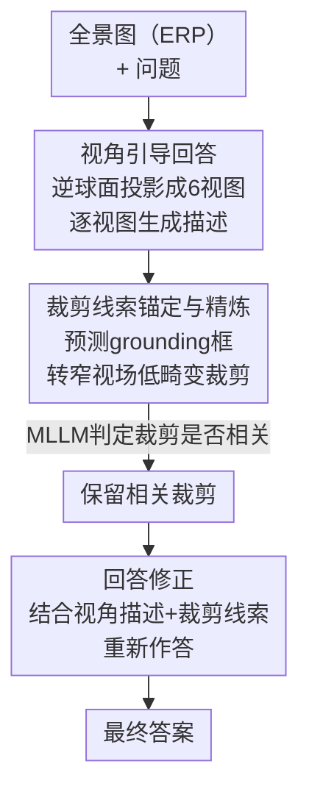

# ODI-Bench: Can MLLMs Understand Immersive Omnidirectional Environments?

**会议**: ICLR 2026  
**OpenReview**: [https://openreview.net/forum?id=fT8FrhGNo0](https://openreview.net/forum?id=fT8FrhGNo0)  
**代码**: https://github.com/ylylyl-sjtu/ODI-Bench (有)  
**领域**: 多模态VLM  
**关键词**: 全景图像理解, MLLM评测基准, 空间推理, 链式思考, 沉浸式环境

## 一句话总结
本文构建了首个系统评测 MLLM 全景图像（ODI）理解能力的基准 ODI-Bench（2,000 张真实全景图、4,254 个 QA、10 个细粒度任务、闭式+开放双格式），用 20 个主流模型证明现有 MLLM 在沉浸式空间理解上几乎只比盲猜略强，并提出免训练的链式思考框架 Omni-CoT，把 o3 等模型的总分平均提升 6~8 个百分点。

## 研究背景与动机
**领域现状**：360° 全景图像（Omnidirectional Image, ODI）提供完整的 $180°\times360°$ 视场，是 VR/AR、空间导航和具身智能的核心数据形态。与此同时 MLLM 在常规 2D 图像/视频理解上已经刷爆了一系列 benchmark，但它们到底能不能"看懂"全景图所承载的沉浸式环境，几乎没有被系统评测过。

**现有痛点**：已有的少数 ODI benchmark 普遍存在四类缺陷——（1）**分辨率太低**：VQA 360°、OSR-Bench 等都限制在 1K 左右，顶/底视图模糊，无法对应真实 VR 应用；（2）**场景单一**：多数依赖带 3D 标注的室内数据集，只覆盖房屋类室内场景，甚至是模糊的合成室内场景；（3）**问题域受限**：基本靠自动管线或现成 3D 数据生成，文本偏置严重、题型狭窄；（4）**视角受限**：空间理解题几乎只考虑第一人称（egocentric）视角，忽略了换位思考（allocentric）和用户交互模拟，无法评估具身智能真正需要的空间能力。

**核心矛盾**：全景图与 2D 图像有本质差异——它把沉浸式 3D 场景投影到一张等距柱状投影（Equirectangular Projection, ERP）平面上，既包含远超 2D 的海量视觉信息，又带来严重的投影畸变和前后左右上下全方位的空间关系。而当前 MLLM 几乎只在 2D 数据上训练，倾向于把 ERP 图当成一张"扭曲的 2D 图"来处理，而不是先做视角换位、再做相对空间推理。

**本文目标**：分解为两个子问题——（a）造一个高质量、场景多样、视角完整、题型细粒度的基准，把"MLLM 能不能看懂全景图"这件事量化清楚；（b）在不训练模型的前提下，找到一种能逼近人类"先换视角、再空间推理"方式的提升方法。

**切入角度**：作者观察到 MLLM 失败的根因是缺乏"视角认知"——它不会主动把 ERP 拆解成各个朝向去理解。那么与其堆训练或外挂 3D 模型，不如用紧凑的文本提示引导模型一步步建立全景场景认知。

**核心 idea**：先用细粒度双层任务体系 + 沉浸式第一人称提问把评测做扎实（ODI-Bench），再用免训练的三步链式思考（Omni-CoT：视角引导回答 → 裁剪线索锚定与精炼 → 回答修正）补上模型缺失的视角认知。

## 方法详解

### 整体框架
本文有两条主线：**评测**（ODI-Bench）和**增强**（Omni-CoT）。ODI-Bench 收集 2,000 张从 Flickr 爬取并人工精选的真实全景图（室内 47.4% / 室外 52.6%，分辨率最高 12K），标注出 4,254 个 QA，划分为 **5 个通用级任务**（物体属性 OA、人物属性 HA、存在性 Exist.、计数 Count.、全景 OCR）和 **5 个空间级任务**（第一人称视角朝向 EVO、换位视角朝向 AVO、场景模拟 SS、相对方向 RD、ODI 推理 OR），每个任务都同时在**闭式**（多选/是否）和**开放式**两种格式下评测。在此之上对 20 个主流 MLLM（GPT-4o、o3、Gemini、InternVL/Qwen-VL 系列等）做全面 benchmark，结论是它们普遍只比盲猜（Blind GPT-4o / Random）略强。

针对这个结论，作者提出 **Omni-CoT**——一个免训练、即插即用的链式思考框架，通过三步把模型从"看一张扭曲 2D 图"扭转为"建立全景视角认知再回答"。下图展示 Omni-CoT 的推理流水线：

### 关键设计

**1. 双层细粒度任务体系 + 沉浸式第一人称提问：把"看懂全景"拆成可量化的 10 个能力**

针对已有 benchmark"题型窄、视角偏"的痛点，作者把 ODI 理解显式拆成**通用级**和**空间级**两层共 10 个任务。通用级任务（OA/HA/Exist./Count./OCR）空间推理要求低，难点主要来自海量视觉信息和投影畸变——比如全景 OCR 要在畸变透视、高分辨率甚至跨视图的条件下读字。空间级任务则专门考验全景独有的全方位空间认知，并且**刻意覆盖两类视角**：EVO/RD 采用观察者自身视角，AVO/SS 则要求从另一个 agent 或虚拟视点做换位思考，OR 任务进一步考察对 ERP 投影本身造成的轨迹/方位畸变的理解。关键的措辞创新在于**沉浸式提问**：不写"图像右侧的 A 在做什么"，而写"在我右边的 A 在做什么"，这种第一人称表述既贴合全景的沉浸观看体验，又能真正考出模型在交互式环境中利用全景图的能力。这套设计让评测能区分"识别准不准"和"空间推理行不行"，而不是笼统给一个分数。

**2. 半自动 QA 标注管线：用可信的自动流程造实例题，用人工攻坚复杂空间题**

高质量 QA 的成本是 benchmark 的核心瓶颈。作者按任务难度分流：对实例级的物体/人物属性题用**自动管线**——先把 ERP 图做立方体贴图（cubemap）投影成 6 个低畸变视图，用 GroundedSAM 在每个视图分割实例并给出类别标签，**过滤掉跨多视图的实例**以保证分割精度；剩余实例按掩码裁剪后送入 Qwen2.5-VL-72B 生成细粒度描述，并且**只保留 GroundedSAM 类别与 Qwen-VL 描述一致**的实例以确保可靠；这些描述再交给 GPT-4o 生成 QA，最后人工校验"唯一指代"和"答案正确"。对计数、视角朝向、相对方向等自动生成不可信的复杂题，则改用**人工标注**：三位专家在 VR 环境中花一个月交叉校验完成。闭式题的 3 个干扰项由 GPT-4o 基于 QA 和全景图生成、人工审核可信度并随机打乱选项以消除位置偏置。这种"简单题自动、难题人工"的分流，兼顾了规模和空间题的标注精度。

**3. Omni-CoT 三步链式思考：用紧凑文本提示补上模型缺失的视角认知**

这是本文的方法核心，针对"MLLM 把 ERP 当扭曲 2D 图"这一根因。一个直觉做法是直接把 6 个多视图图像和全景图一起喂给模型，但全景图本身分辨率极高，叠加多视图会爆 token 上限、且产生大量冗余 token 干扰关注。Omni-CoT 改用**文本而非额外图像**来注入视角信息，分三步：**(i) 视角引导回答**——由逆球面投影得到 top/bottom/right/left/front/back 六个透视视图，让 MLLM 为每个视图生成描述，把朝向信息和描述拼进 prompt，使模型先建立对环境的粗粒度全局认知后再答题；**(ii) 裁剪线索锚定与精炼**——让模型预测与问题相关的 grounding 框，把归一化框 $(x_1,y_1,x_2,y_2)$ 换算成窄视场低畸变裁剪的球面参数，中心球面坐标与近似视场为

$$\theta = -180°+\frac{c_x}{W}\cdot360°,\quad \phi = 90°-\frac{c_y}{H}\cdot180°$$
$$fov_w=(x_2-x_1)\cdot360°,\quad fov_h=(y_2-y_1)\cdot180°$$
$$fov=\mathrm{clip}\big(\max(fov_w,fov_h)+margin,\ 30°,\ 120°\big)$$

其中 $(c_x,c_y)$ 是裁剪框中心，$W,H$ 是 ERP 图宽高，$margin$ 是避免裁太紧的角度余量；由于 grounding 不一定准，再加一道**精炼**：让模型对每个裁剪标注"与问题是否相关（yes/no）"，只把相关裁剪喂回去；**(iii) 回答修正**——把全景图、六视图描述、带朝向的裁剪线索连同模型先前的答案一起回灌，提示模型基于裁剪线索"重新思考"给出最终答案。整套流程不更新任何参数，却复刻了人类"先换视角看全景、再聚焦细节修正"的推理路径。

**4. 闭式+开放双格式评测：暴露判别式与生成式推理的差异**

以往 benchmark 每个任务只用闭式或只用开放式，本文坚持**每个任务两种格式都测**。闭式用多选/是否的准确率，开放式用 LLM 评估器打分。这一设计揭示了仅靠单一格式看不到的现象：对计数、OCR 这类有唯一答案的任务，闭式分数普遍高于开放式，说明选项给了模型暗示；但也存在"开放式答对、闭式选错"的反例，说明预设选项有时反而是干扰，反映出模型生成式推理与判别式推理之间的鸿沟。在开放式设定下空间任务的模型间差异被放大——比如 EVO 任务里模型在无约束时几乎不会主动输出绝对朝向词，即便明确要求也答得很差，进一步坐实了"MLLM 不会像人那样先换位再做相对空间分析"的判断。

## 实验关键数据

### 主实验
20 个 MLLM 在 ODI-Bench 闭式设定下的整体表现（Overall）及空间任务难点。最强的 o3 也只有 62.62，且仅比盲猜 Blind GPT-4o（36.39）高不到 30 个点，说明模型远未真正读懂全景图的丰富视觉信息。

| 模型 | Overall（闭式） | Overall（开放式） | 空间难点（AVO/SS 闭式） |
|--------|------|------|------|
| o3（最佳） | **62.62** | **49.53** | 39.62 / 46.60 |
| InternVL3-78B | 59.43 | 42.52 | 31.67 / 40.40 |
| Gemini-2.0-flash | 57.12 | 36.42 | 32.91 / 40.20 |
| Qwen2.5-VL-72B | 56.91 | 39.49 | 32.08 / 38.40 |
| GPT-4o | 55.79 | 42.91 | 32.49 / 39.60 |
| Blind GPT-4o（盲猜基线） | 36.39 | — | 29.14 / 31.60 |
| Random Choice | 26.93 | — | 25.00 / 25.00 |

可见空间任务（尤其换位类 AVO/SS）模型分数普遍只比 Blind 基线略高甚至更低，是全景理解的真正瓶颈。

Omni-CoT 在 5 个代表模型上的闭式提升（Table 4），其中视角引导（Viewpoint Guiding）单独就贡献了空间任务的大头，EVO 提升尤为夸张：

| 模型 | 基线 Overall | w/ 视角引导 | w/ 完整 Omni-CoT | EVO 增益 |
|--------|------|------|------|------|
| o3 | 62.62 | 68.78 | **70.03 (+7.41)** | +26.40 |
| GPT-4o | 55.79 | 61.67 | 62.08 (+6.29) | +28.29 |
| Gemini-2.0-flash | 57.12 | 62.95 | 63.89 (+6.77) | +26.26 |
| Qwen2.5-VL-72B | 56.91 | 64.51 | 65.41 (+8.50) | +33.37 |
| InternVL2.5-8B | 52.76 | 55.76 | 58.04 (+5.28) | +13.05 |

### 消融实验
以 Gemini-2.0-flash / InternVL2.5-8B 为例验证 Omni-CoT 三步的必要性（Table 5）：

| 配置 | Overall(Gemini) | Spatial(Gemini) | 说明 |
|------|------|------|------|
| 基线（直接回答） | 57.12 | 45.05 | 无 CoT |
| + 视角引导 | 63.07 | 54.94 | 空间分大幅跳升，是主力 |
| + 视角引导 + 裁剪锚定（无精炼） | 58.29 | 49.83 | 直接裁剪引入无关干扰，反而掉点 |
| + 视角引导 + 裁剪锚定 + 裁剪精炼 | **63.89** | **56.01** | 精炼过滤无关裁剪后达到最佳 |

InternVL2.5-8B 呈现同样规律：单加裁剪锚定（无精炼）会把 Overall 从 55.76 拉低到 50.52，加上精炼后回升到 58.04。

### 关键发现
- **视角引导是性能主力**：几乎所有模型的空间任务（尤其 EVO 第一人称朝向）在加入六视图文本描述后暴涨 +25 以上，证明模型缺的就是"主动建立朝向认知"这一步。
- **裁剪必须配精炼**：直接用 grounding 裁剪会引入无关 crop 而降点，只有加上"逐裁剪判定相关性"的精炼机制才稳定增益——印证了 grounding 不可靠时盲信反害的判断。
- **空间理解是全景的真瓶颈**：通用任务因模型 2D 底子尚可（OA/HA 普遍 70+），但换位类 AVO/SS 几乎贴着盲猜线，计数相比属性识别掉约 20 个点。
- **闭式≠开放式**：有唯一答案的任务闭式分更高（选项给暗示），但也存在选项反而干扰导致开放对、闭式错的反例，说明判别式与生成式推理存在差异。

## 亮点与洞察
- **"用文本而非图像注入视角"很巧**：全景图本就高分辨率，再叠多视图必爆 token；改用六视图文字描述既绕开输入上限，又避免冗余视觉 token 抢注意力——这个"图换文"的取舍可迁移到任何高分辨率/多视图输入受限的场景。
- **沉浸式第一人称提问是低成本高信息量的设计**：把"图像右侧"改成"在我右边"，一字之差就把评测从被动看图升级为交互式具身理解，思路可借鉴到任何需要 agent 视角的多模态评测。
- **"锚定 + 自我精炼"的双保险**：让模型先 grounding 再自评相关性，把不可靠的定位结果用一道廉价的 yes/no 过滤掉，是免训练框架里对抗噪声的实用 trick。
- 最"啊哈"的点是 Omni-CoT 全程不训练，仅靠 prompt 编排就让 o3 涨 7.41、EVO 涨 26.40，说明现有 MLLM 不是没有能力，而是缺少把全景拆成视角的"推理脚手架"。

## 局限与展望
- **Omni-CoT 推理成本高**：三步要多次调用 MLLM（六视图描述 + grounding + 精炼 + 修正），单题推理开销远高于直接回答，论文未量化时延/token 成本。
- **裁剪几何依赖 grounding 质量**：球面参数换算精确，但前提是模型预测的框大致正确；在 grounding 很差的场景，精炼步只能过滤而无法补救定位缺失。
- **部分通用任务出现负迁移**：表中可见 Omni-CoT 在 OA、SS、RD 等任务上偶有掉点（如 GPT-4o 的 SS、RD 为负增益），说明视角拆解对纯识别或某些空间题并非总是有益，何时该触发 CoT 仍需自适应判断。
- **评测仍依赖闭源模型造数据**：标注管线和干扰项生成重度依赖 GPT-4o / Qwen-VL，可能引入这些模型自身的偏置；未来可探索更中立的自动质检。

## 相关工作与启发
- **vs 通用/空间 2D benchmark（MMBench、MM-Vet、VSI-Bench、ViewSpatial-Bench）**：它们聚焦 2D 图像或 NFoV 视频，本文专攻全景 ERP 图像独有的全方位空间与畸变挑战，且首次同时覆盖通用级+空间级、第一人称+换位视角。
- **vs 已有 ODI benchmark（VQA 360°、OSR-Bench、Dense360-Bench）**：它们普遍低分辨率（≤1K）、仅室内/合成场景、题型窄、只考第一人称；ODI-Bench 用真实室内外高分辨率（最高 12K）图、10 个细粒度任务、人工精标补齐这些短板。
- **vs 训练增强 / 外挂 3D 模型的空间理解方法**：那些方案要么资源密集易过拟合，要么依赖外部 3D 特征不通用；Omni-CoT 走免训练、纯 prompt 编排路线，即插即用且对闭源/开源模型都有效。

## 评分
- 新颖性: ⭐⭐⭐⭐ 首个系统评测全景图理解的细粒度双层基准，沉浸式提问 + 免训练 Omni-CoT 都有新意，但 CoT 各步组件多为已知技术的组合。
- 实验充分度: ⭐⭐⭐⭐⭐ 20 个模型 × 10 任务 × 闭式/开放双格式，Omni-CoT 在 5 个代表模型上验证并做了步骤消融和超参分析，非常扎实。
- 写作质量: ⭐⭐⭐⭐ 动机清晰、痛点与设计对应明确，公式和流程图到位；个别表格信息密集略难读。
- 价值: ⭐⭐⭐⭐⭐ 全景/VR/具身智能的刚需评测基准，且开源数据+代码，Omni-CoT 提供了即用的提升方案，落地价值高。

<!-- RELATED:START -->

## 相关论文

- [\[ICLR 2026\] IWR-Bench: Can LVLMs Reconstruct Interactive Webpage from a User Interaction Video?](iwr-bench_can_lvlms_reconstruct_interactive_webpage_from_a_user_interaction_vide.md)
- [\[ACL 2025\] Can MLLMs Understand the Deep Implication Behind Chinese Images?](../../ACL2025/multimodal_vlm/can_mllms_understand_the_deep_implication_behind_chinese_images.md)
- [\[CVPR 2026\] VS-Bench: Evaluating VLMs for Strategic Abilities in Multi-Agent Environments](../../CVPR2026/multimodal_vlm/vs_bench_evaluating_vlms_for_strategic_abilities_in_multi_agent_environments.md)
- [\[ICLR 2026\] SpatialViz-Bench：一个认知科学驱动、用于诊断 MLLM 空间可视化能力的基准](spatialviz-bench_a_cognitively-grounded_benchmark_for_diagnosing_spatial_visuali.md)
- [\[ACL 2025\] Can Vision Language Models Understand Mimed Actions?](../../ACL2025/multimodal_vlm/can_vision_language_models_understand_mimed_actions.md)

<!-- RELATED:END -->
