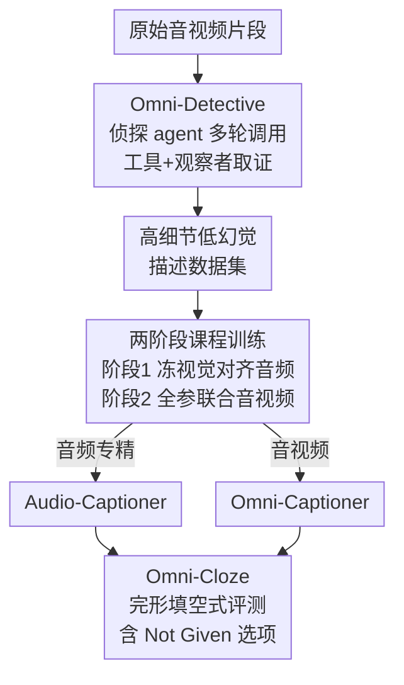

# Omni-Captioner: Data Pipeline, Models, and Benchmark for Omni Detailed Perception

**会议**: ICLR 2026  
**OpenReview**: [https://openreview.net/forum?id=Z091XLyVkJ](https://openreview.net/forum?id=Z091XLyVkJ)  
**代码**: https://github.com/ddlBoJack/Omni-Captioner  
**领域**: 多模态VLM  
**关键词**: 全模态感知, 详细描述, agentic 数据合成, 幻觉抑制, cloze 评测

## 一句话总结
针对全模态语言模型「描述越详细、幻觉越多」的共生难题，本文用一个会调用工具的「侦探式」agentic 数据管线（Omni-Detective）自动产出高细节、低幻觉的音视频描述数据，两阶段课程训练出 Audio-Captioner / Omni-Captioner，并设计 cloze 完形填空式评测基准 Omni-Cloze，在 VDC、MMAU、Omni-Cloze 等多个基准上刷到开源 SOTA、逼平 Gemini 2.5 Pro。

## 研究背景与动机

**领域现状**：全模态语言模型（Omni Language Models, OLMs）能并行处理音频和视频信号，输出对场景的丰富描述。一个朴素直觉是：在模型能力范围内，描述越长，捕捉的细粒度细节就越多，因此「详细描述（detailed captioning）」成为衡量多模态感知能力的重要任务。

**现有痛点**：作者在 Gemini 2.5 Pro 上做的实证研究揭示了一个「共生（co-growth）」现象——随着描述变长，正确细节的比例（detail ratio）确实在上升，但同时被编造的幻觉内容（hallucination ratio）也在同步上升。短描述安全但不完整，会漏掉细微事件、背景线索或跨模态交互；长描述信息丰富却容易注入未被输入支撑的内容，这对辅助 AI、科学报告、自动驾驶 agent 这类要求事实精确的应用是致命缺陷。

**核心矛盾**：细节增益（detail gain）与幻觉增长（hallucination growth）在现有 OLM 里是耦合的，无法只要细节不要幻觉。这个矛盾在全模态场景被进一步放大——模型要同时处理视觉与听觉两条信息密度极不对称的流。

**本文目标**：从数据管线、模型、基准三个层面系统性解决全模态详细感知问题，把「细节-幻觉前沿（detail–hallucination frontier）」整体向外推，即在不成比例增加幻觉的前提下产出更丰富的描述。

**切入角度**：与其让单个模型一次性「看一眼就写完」，不如模仿人类侦探——反复向独立的观察者提问、调用领域工具取证、交叉核验已有线索，逐轮增量地补充有据可查的细节。这样细节增益来自工具取证而非自由发挥，从源头上把幻觉和细节解耦。

**核心 idea**：用「agentic 多轮取证」生成低幻觉高细节数据，再用两阶段课程训练把这种能力蒸馏进 7B 模型，最后用「完形填空」式评测把开放生成的评分难题转化为可稳定打分的选择题。

## 方法详解

### 整体框架

本文是一套贯穿「数据—模型—评测」三段的完整方案。**数据侧**：Omni-Detective 是一个 agentic 数据合成管线，让一个 LLM 侦探 agent 反复调用 OCR/ASR/MLLM 等工具和模态专属观察者，多轮 Query-Observation 循环地为同一段音视频积累证据，最后整合成高细节、低幻觉的描述数据。**模型侧**：以 Qwen2.5-Omni-7B 为骨干，用两阶段课程在这批数据上训练——先冻结视觉编码器只对齐稀疏但关键的音频线索得到 Audio-Captioner，再全参数联合训练音视频得到 Omni-Captioner。**评测侧**：针对开放生成难评分的问题，设计 Omni-Cloze——把细粒度细节挖成完形填空选择题、加入「Not Given」选项，单次自动打分即可稳定区分「漏掉」与「编造」。

### 关键设计

**1. Omni-Detective：把单次观察换成侦探式多轮取证，从源头解耦细节与幻觉**

直接让一个 MLLM 一遍写完描述，是「共生」幻觉的根源——模型为了凑细节会编造未被输入支撑的内容。Omni-Detective 把这个一次性过程改造成迭代的 Query-Observation 循环，由三个组件协同：(1) **Detective Agent**——一个自主编排感知过程的 LLM agent，每一轮主动构造查询；(2) **Tool Box**——包含 MLLM、OCR、ASR 等专用工具，从多模态数据里抽取精确信息（如屏幕文字、语音转写）；(3) **独立 Observers**——直接与原始音视频流交互、针对特定方面探查。每一步里 agent 提出查询并调用相关工具，observer 分析检索到的内容、把富化后的观察反馈给 agent，如此循环直到收集到足够的细粒度证据，最后 agent 把所有观察整合成最终描述。关键在于：每一轮在增量补充有据可查的细节的同时**交叉核验已有声明（cross-check existing claims）**，让细节增益来自取证而非臆测，因此显式地把「细节增长」和「幻觉增长」拆开。论文 6.2 节的分析印证了这点：随着取证步数增加，detail rate 稳步上升，而 not-given rate 和 hallucination rate 双双下降（模型在更多取证机会下能自我纠正先前的错误推断）；但 hallucination rate 在第 5–6 步左右就收敛了，说明当前多模态工具在消除错误声明上存在固有天花板——有些细节被错误分类后，即便延长取证也难以修正。

**2. 两阶段课程训练：先用冻结视觉强行对齐稀疏音频，再联合训练融合双模态**

等时长的音视频片段里，视觉模态信息密度通常远高于音频，若一开始就联合训练，模型会忽略稀疏但语义关键的音频线索（音效、语音内容、音乐提示）。为缓解这种不对称，作者设计课程式两阶段训练。**阶段 1（音频感知对齐）**：冻结视觉编码器，只用纯音频详细描述数据优化音频编码器和 LLM，强制模型把感知锚定在音频流上，产出 Audio-Captioner。**阶段 2（音视频感知对齐）**：在音视频详细描述数据上联合训练，此时描述显著更长（短视频平均达 1125 词），解冻所有组件做全参数微调，让网络利用跨模态互补性产出丰富、连贯、模态完整的描述，得到 Omni-Captioner。一个值得注意的工程发现是：去掉输入里的文本提示词（text prompt）反而提升描述性能，因此两阶段训练都在无显式文本提示下进行。这种「先难后易」的安排——先逼模型啃下信息稀疏的音频，再放开融合——正是为了对冲视觉对音频的「注意力碾压」。

**3. Omni-Cloze：用完形填空把开放生成的评分难题转成单次可打分的选择题**

详细描述是开放式输出，传统 BLEU/METEOR/CIDEr 等指标无法忠实评估长且信息密集的描述；VDC 改用「每条描述派生 $k$ 个短问答对」的方式，但对 1 条含 $k$ 个 QA 的描述需要 $2k$ 次 LLM 调用，既低效又会累积评测误差。Omni-Cloze 改成 cloze 完形填空范式：把细粒度细节设计成多选填空，每个空给若干干扰项，并额外加入一个「**Not Given**」选项。评测时模型先生成详细描述，再让 LLM 仅根据这段描述从选项中填空——LLM 只做信息抽取、不做主观推理，因此每条描述只需 **1 次** LLM 调用（VDC 需 38 次）。「Not Given」是点睛之笔：它把模型错误显式拆解为 not-given rate（漏掉、该选却没覆盖）和 hallucination rate（选了错误项而非 Not Given），从而可解释地区分「遗漏」与「编造」。基准覆盖纯视觉、纯音频、音视频三种设定，跨 9 大领域 47 个子类、2k 视频片段、70k 个填空，并经人工校验。6.3 节的 arena-style Elo 人偏好对齐实验显示，Omni-Cloze 准确率与人类 Elo 评分的 Pearson 相关系数高达 $r=0.91$，超过 VDC（0.86）和 video-SALMONN 2（0.83）。

### 一个完整示例

以图 1 的篮球比赛视频为例走一遍：Omni-Detective 的侦探 agent 第 1 轮调 MLLM 拿到「这是一场篮球比赛」的粗描述；发现有多人说话后，第 2 轮调 ASR 转写出解说语音内容；又调 OCR 读出记分牌「PHI 83, JOR 86」「2:20 left」和场边广告牌「Smart / TOYOTA / YAMAHA」；observer 反复核验球员号码（#15 ABBAS）、慢动作回放、人群氛围等细节并反馈。多轮取证后，agent 整合出一段既包含「Brownlee 隔扣 Zaid Abbas、比分更新到 PHI 85–86」这类精确细节、又没有把比分写反（对照里 Qwen2.5-Omni 把 86–83 写成 JOR 领先即为幻觉）的高保真描述。这条数据再用于训练，模型就学会了「敢写细节但不编造」。

## 实验关键数据

### 主实验

详细描述基准（VDC 纯视觉 + video-SALMONN 2 测试集音视频）：

| 模型 | 模态 | VDC Acc%↑ | VDC Score↑ | SALMONN2 Miss%↓ | SALMONN2 Hall%↓ |
|------|------|-----------|------------|------------------|------------------|
| GPT-4o | V | 46.3 | 2.5 | 17.0 | 14.2 |
| Gemini 1.5 Pro | A+V | 43.1 | 2.2 | 21.8 | 16.5 |
| Qwen2.5-Omni-7B | A+V | 39.7 | 2.2 | 26.3 | 21.7 |
| video-SALMONN2-7B | A+V | 46.1 | 2.5 | 10.0 | 12.9 |
| **Omni-Captioner-7B** | A+V | **55.0** | **2.7** | 17.8 | 10.9 |

Omni-Captioner 在 VDC 上以 55.0% 准确率、2.7 分刷新 SOTA，超过所有专有和开源基线；在 SALMONN2 测试集上以「次低漏检率 17.8% + 次低幻觉率 10.9%」拿到最佳的细节-幻觉权衡（且是零样本，未适配该测试集的事件分布）。

caption-to-QA 级联评测（音频 / 全模态，均用 GPT-4o 作 QA 后端）：

| 模型 | MMAU | MMAR | Video-MME | Video-Holmes | WorldSense | Daily-Omni |
|------|------|------|-----------|--------------|------------|------------|
| Gemini 2.5 Flash | 65.6 | 58.2 | 69.1 | 52.8 | 44.6 | 59.5 |
| Gemini 2.5 Pro | 70.0 | 64.1 | 75.0 | 59.9 | 53.6 | 73.6 |
| Qwen2.5-Omni-7B | 65.2 | 51.8 | 52.7 | 35.7 | 30.6 | 47.9 |
| video-SALMONN 2-7B | – | – | 65.9 | 42.9 | 44.1 | 59.7 |
| **Audio/Omni-Captioner-7B** | **70.0** | **59.8** | **67.1** | **48.8** | **48.2** | **67.9** |

Audio-Captioner 在 MMAU 上达 70.0，追平最强专有模型 Gemini 2.5 Pro 并大幅领先所有开源基线；Omni-Captioner 在四个音视频基准上均为开源最高分。

### 消融实验

Omni-Cloze 主结果（全模态模型）+ Omni-Detective 直接套到 Gemini 2.5 Pro 上的级联消融：

| 配置 | 关键指标 | 说明 |
|------|---------|------|
| Audio-Captioner-7B | Omni-Cloze 53.2% | 音频开源最高，超 Gemini 2.5 Pro（48.0%）5.2 个点 |
| Omni-Captioner-7B | Omni-Cloze 56.4%（V 57.0 / A 54.5 / AV 62.1） | 全模态总分 SOTA，超 Gemini 2.5 Pro（43.6%） |
| Gemini 2.5 Pro（原始） | MMAR 64.1 / Video-MME 75.0 | 基线 |
| Gemini 2.5 Pro + Omni-Detective | MMAR 68.3 / Video-MME 76.1 | 数据管线直接套到强专有模型上也能涨 |

### 关键发现
- **Omni-Detective 的取证步数越多、细节越全幻觉越少，但幻觉有天花板**：detail rate 随步数稳步上升，not-given 与 hallucination 双降；但 hallucination 约在第 5–6 步收敛，说明现有多模态工具对错误声明的修正能力存在固有上限。
- **数据管线是「即插即用」的**：把 Omni-Detective 直接套在 Gemini 2.5 Pro 上做 caption-to-QA，MMAR +4.2、Video-MME +1.1，说明增益来自数据生成范式本身而非特定骨干。
- **Omni-Cloze 与人类偏好对齐最好**：cloze 准确率与人类 Elo 评分相关性 $r=0.91$，高于 VDC（0.86）和 SALMONN2（0.83），且每条描述只需 1 次 LLM 调用（VDC 需 38 次）。
- **去掉文本提示反而更好**：训练时移除输入文本 prompt 提升了描述性能，是一个反直觉但实用的工程发现。

## 亮点与洞察
- **把「数据生成」做成 agentic 取证循环**：用 LLM agent + 工具调用 + 独立观察者多轮交叉核验，让细节增益来自有据可查的取证而非自由发挥，这是从根上解耦「细节 vs 幻觉」的巧思，比单纯堆 prompt 或做 DPO 后处理更治本。
- **「Not Given」选项把误差拆成可解释两类**：单这一个设计就让评测能把「漏掉」和「编造」分开度量，而不是混成一个模糊的错误率，对诊断模型很有价值，可迁移到任何要区分 omission/hallucination 的评测。
- **完形填空把开放评分降维成单次选择题**：从 $2k$ 次 LLM 调用降到 1 次、还更对齐人类偏好，这个「用 cloze 代替多轮 QA」的思路可直接迁移到其他长文本/详细描述类任务的评测。
- **课程式冻结-解冻对抗模态不对称**：先冻视觉逼模型啃音频、再联合解冻，是处理「强模态碾压弱模态」的通用配方，可迁移到任何信息密度不对称的多模态训练。

## 局限与展望
- **幻觉天花板未突破**：作者自己承认 hallucination rate 在第 5–6 步就收敛，现有多模态工具对某些被错误分类的细节无能为力，延长取证也修不动——管线把前沿外推了但没消灭幻觉。
- **数据生成成本**：多轮 agentic 取证、反复调用 OCR/ASR/MLLM 的开销远高于单次 prompt，论文未详述大规模生成的算力/时间成本与扩展性边界。
- **级联推理的固有短板**：caption-to-QA 级联对某些题型（如精确计数）天然弱于端到端 QA 模型，详细描述质量再高也补不齐这类能力。
- **与专有模型仍有绝对差距**：Omni-Captioner 大幅缩小了与 Gemini 2.5 Pro 的差距，但在 Video-MME 等基准上绝对分仍落后，7B 规模的容量上限可能是瓶颈。

## 相关工作与启发
- **vs AuroraCap / VDC**：AuroraCap 最早探索视频详细描述、VDC 提出基于多短问答的评测，但二者都偏视觉中心、且 VDC 评测需 $2k$ 次 LLM 调用；本文把模态扩到音频+音视频，并用 cloze 把评测压到 1 次调用、相关性还更高。
- **vs video-SALMONN 2**：SALMONN 2 用多轮 DPO 偏好优化来增强音视频详细描述/问答，是「后训练对齐」路线；本文走的是「前置数据生成」路线——用 agentic 取证从源头产出低幻觉数据，在 SALMONN2 自家测试集上拿到更好的细节-幻觉权衡。
- **vs 依赖人工 prompt 的数据收集**：多数前作靠人工设计 prompt 采集训练数据，在描述精度与数据规模之间存在固有 trade-off；Omni-Detective 用自动化 agent 取证打破这个 trade-off，可在保持低幻觉的同时扩规模。

## 评分
- 新颖性: ⭐⭐⭐⭐⭐ 「侦探式 agentic 数据生成 + cloze 评测 + Not Given 拆解误差」三件套都很有原创性，且系统性覆盖数据/模型/基准。
- 实验充分度: ⭐⭐⭐⭐⭐ 跨 VDC/MMAU/MMAR/Video-MME/Omni-Cloze 等近十个基准、含步数趋势分析与人类 Elo 对齐，论证扎实。
- 写作质量: ⭐⭐⭐⭐ 「co-growth」与「侦探」类比讲得清晰生动，图表完整；部分附录细节（超参、数据统计）需翻 appendix。
- 价值: ⭐⭐⭐⭐⭐ 数据管线、模型、基准全开源，且管线可即插即用提升其他强模型，对全模态详细感知社区有直接推动价值。

<!-- RELATED:START -->

## 相关论文

- [\[ICLR 2026\] OmniVinci: Enhancing Architecture and Data for Omni-Modal Understanding LLM](omnivinci_enhancing_architecture_and_data_for_omni-modal_understanding_llm.md)
- [\[ICLR 2026\] XModBench: Benchmarking Cross-Modal Capabilities and Consistency in Omni-Language Models](xmodbench_benchmarking_cross-modal_capabilities_and_consistency_in_omni-language.md)
- [\[ICLR 2026\] OmniVideoBench: Towards Audio-Visual Understanding Evaluation for Omni MLLMs](omnivideobench_towards_audio-visual_understanding_evaluation_for_omni_mllms.md)
- [\[ICLR 2026\] NExT-OMNI: Towards Any-to-Any Omnimodal Foundation Models with Discrete Flow Matching](next-omni_towards_any-to-any_omnimodal_foundation_models_with_discrete_flow_matc.md)
- [\[ICLR 2026\] Omni-Weather: A Unified Multimodal Model for Weather Radar Understanding and Generation](omni-weather_a_unified_multimodal_model_for_weather_radar_understanding_and_gene.md)

<!-- RELATED:END -->
