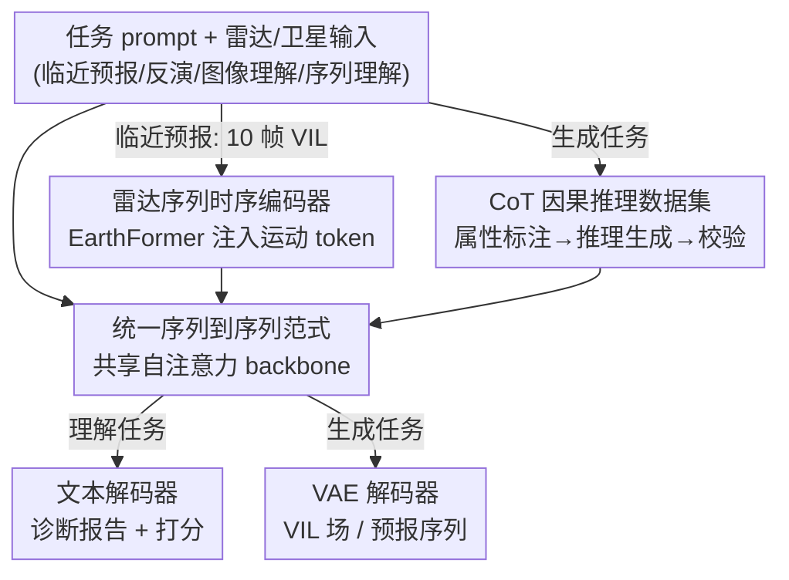

# Omni-Weather: A Unified Multimodal Model for Weather Radar Understanding and Generation

**会议**: ICLR 2026  
**OpenReview**: [https://openreview.net/forum?id=3WnXsp72v6](https://openreview.net/forum?id=3WnXsp72v6)  
**代码**: https://github.com/Zhouzone/OmniWeather  
**领域**: 多模态VLM  
**关键词**: 气象大模型, 统一生成与理解, 雷达临近预报, 思维链推理, SEVIR

## 一句话总结
Omni-Weather 是首个把"气象生成"（雷达临近预报、卫星反演雷达）和"气象理解"（雷达图像/序列的诊断报告）统一进同一个多模态 backbone 的基础模型，通过共享自注意力 + 模态特定编码器把多种任务表达成统一的序列到序列形式，并配套一套针对气象因果推理的思维链（CoT）数据集，让生成任务也能"边想边画"，在两类任务上都超过各自的专用 SOTA，并验证了生成与理解可以互相增益。

## 研究背景与动机

**领域现状**：气象 AI 这两年沿着两条互不相交的路各自演进。生成侧有 PreDiff、DiffCast、CasCast 这类临近预报模型，从历史雷达序列预测对流演化；还有 DiffSR 这类反演方法，从卫星红外通道重建雷达观测量。理解侧则有 RadarQA、WeatherQA，从大气场或雷达观测里生成诊断报告、判别强对流影响区域。与此同时，通用领域的 InternVL、UniGen、Bagel 等统一多模态大模型已经证明"感知 + 合成"可以放进一个架构里端到端训练。

**现有痛点**：气象领域偏偏还没有这种统一架构。生成模型（ClimaX、WeatherGFM）擅长预报和降尺度，但完全不会解释自己在看什么；理解模型（RadarQA、WeatherQA）能给出诊断推理，却合成不了任何物理场。结果就是临近预报模型"看不懂"雷达观测，而气象 MLLM "预测不了"雷达变量，两边的能力被人为割裂。

**核心矛盾**：大气系统本质是多尺度的——风暴的生成、增强、消散环环相扣，准确预测往往天然伴随对机理的解释需求。尤其是气旋快速增强这类极端事件，决策者既要知道"会发生什么危险结果"，又要知道"背后驱动是什么"才能行动。把"预测"和"理解"拆成两个模型，就丢掉了二者本可共享的风暴演化表征。

**本文目标**：用一个 backbone 同时吃下生成类任务（临近预报、反演）和理解类任务（诊断推理、问答），并让生成过程具备可解释的因果推理。

**切入角度**：作者观察到，只要把所有任务都改写成"给定 prompt + 雷达输入 → 目标输出"的统一 $T: X \to Y$ 映射，异构的气象任务就能塞进同一个共享 backbone；而生成与理解共享表征后还可能互补——理解任务提供的诊断监督信号，恰好能帮生成任务学到更可迁移的风暴演化表征。

**核心 idea**：以 Bagel-7B-MoT 为底座，用"模态特定编码器 + 共享自注意力 + 任务特定解码器"统一生成与理解，并额外构建一套气象因果 CoT 数据集，让生成任务以显式推理监督训练、以推理 prompt 推断。

## 方法详解

### 整体框架

Omni-Weather 要解决的是"一个模型同时干两类活"：生成类（雷达临近预报 = 给 10 帧 VIL 预测后 12 帧；雷达反演 = 给 IR069/IR107 两个卫星红外通道重建 VIL 场）和理解类（雷达单帧/序列理解 = 输出风暴形态、强度、演化、预报质量的自然语言报告与结构化打分）。所有任务统一写成 $y_t = F_\theta(p_t, x_t)$：任务 prompt $p_t$ 经文本编码器进入共享文本空间做条件，雷达/卫星视觉输入经各自的模态编码器编码，融合后过共享自注意力层，再由对应解码器解码——理解任务走文本解码器出文字，生成任务走 VAE 解码器出物理场。这样一个模型只靠切换 prompt 就能在多任务间自由跳转。

整条管线的关键在于"视觉模态分流"：理解任务用 understanding encoder 编码 VIL 帧并和文本 token 拼接；反演任务用 generation encoder 编码卫星通道；而临近预报因为要建模多帧时序演化，单靠 Gen Encoder 训练不稳，于是单独引入一个 EarthFormer 雷达序列编码器产生运动感知的时序 token，作为额外条件注入共享注意力层。在统一 SFT 之上，再叠一层 CoT 监督，让生成任务输出"中间推理 + 最终预测"，把黑箱式生成变成可解释的因果推断。

### 关键设计

**1. 统一序列到序列范式 + 共享自注意力 backbone：把割裂的生成与理解塞进一个模型**

针对"生成模型不会理解、理解模型不会生成"这个根本割裂，作者把四类气象任务全部归约成统一映射 $T: X \to Y$——临近预报里 $X$ 是 10 帧 VIL、$Y$ 是后 12 帧；反演里 $X$ 是两个红外通道、$Y$ 是 VIL 场；理解里 $X$ 是预测/观测 VIL 序列对、$Y$ 是质量评估文本。所有任务 prompt 都经文本编码器映射到同一个文本条件空间，视觉输入按任务走不同的模态编码器，融合后统一过共享自注意力 backbone $F_\theta$，模型只靠条件 $p_t$ 就能切换任务。这种设计的价值不只是"省得训多个模型"，而是让生成与理解共享同一套风暴演化表征——后面实验证明这种共享会带来双向增益，而不是简单的多任务平均。

**2. EarthFormer 雷达序列编码器：给临近预报注入可靠的时序结构**

临近预报和其它任务不同，它要建模十帧 VIL 的运动与演化。作者发现直接逼着 backbone 用通用的 Gen Encoder 去学多帧演化"很不稳定"，于是用 EarthFormer 实例化一个专门的雷达序列时序编码器，产出运动感知（motion-aware）的聚合 token $\kappa_t$，作为可选条件注入共享注意力层。形式上输入序列写成 $X_t = [\tau_{\text{text}}(p_t)\,;\,\tau_t(x_t)\,;\,\kappa_t]$，其中 $\kappa_t$ 就是这套时序 embedding。这样既保住了"所有任务共享一个 pipeline"的统一性，又把可靠的时序结构单独喂进去稳住长时程动态、改善时间连贯性——是一种"统一架构里给难任务开小灶"的折中。

**3. 气象因果思维链（CoT）数据集：把诊断推理变成可标注、可校验的因果链**

要让生成任务能解释自己，得先有推理监督，但气象推理没有现成的 CoT 数据。作者据此设计了一套面向气象的 CoT，把推理框定成"对风暴动力学的因果推断"，并按标注难度把要素拆成两层：相对好抽的"因果因子"（形态 morphology、强度、运动方向/速度、旋转中心等）和需要更高层推断的"结果指标"（风暴演化模式，如扩张/收缩、合并/分裂）。临近预报时先从输入 VIL 序列抽因果因子，再结合预报帧的投影因子去推更难的结果指标；卫星到雷达反演则只涉及因果因子，做从卫星通道到单帧 VIL 的直接投影。整套 CoT 用三阶段流水线构建：GPT-4o 做属性标注 → GPT-o3 做任务特定推理生成 → 自动化校验（结构一致性、因果对齐、术语规范化），最终产出可靠的 CoT 轨迹。taxonomy 改编自 RadarQA 但按标注难度重构，配上明确的方位映射（图像 `origin='upper'`，顶部为北）和阈值定义（对流单元 = 像素强度 ≥32/255 的连通区域）保证标注客观。

**4. CoT 的双路集成：训练当监督、推理当 prompt，让生成"边想边画"**

构建好的 CoT 从两个互补角度接入 Omni-Weather。训练阶段，CoT 作为辅助监督，要求模型同时生成中间推理文本和最终预测，引导 backbone 走向因果可解释性；推理阶段，CoT 又被当作 reasoning prompt，和任务指令、输入拼接，把模型导向更结构化、可解释的输出（即论文里的 "thinking inference"）。这套集成带来的不只是可解释性——实验显示显式推理还能提升感知保真度（LPIPS、Radar-Score 变好），代价是像素级 CSI 略降，构成一个"语义/结构保真 vs 像素对齐"的可控权衡。

### 损失函数 / 训练策略

模型从预训练的 Bagel-7B-MoT 初始化，在所有气象任务上做联合的领域 SFT。共享 backbone 产出的 token 按任务分流解码：生成任务 $t \in T_{\text{gen}}$ 走 VAE 解码器 $G_\phi$，理解任务 $t \in T_{\text{under}}$ 走文本解码器 $L_\psi$。总损失同时含生成的像素回归项和理解的自回归语言建模项：

$$L = \sum_{t \in T_{\text{gen}}} \lambda_t \frac{1}{|\Omega_t|}\lVert \hat{y}_t - y_t \rVert_2^2 + \sum_{t \in T_{\text{under}}} \lambda_t \left(-\sum_{k=1}^{n_t} \log p_\psi(y_{t,k}\mid y_{t,<k}, f_\theta(X_t))\right)$$

其中 $\Omega_t$ 索引目标像素/帧，$n_t$ 是目标文本长度，$\lambda_t$ 平衡各任务。训练用 8×H200 单节点跑 20k 步，AdamW（基础学习率 $2\times10^{-4}$、weight decay 0.05、2k 步 warm-up + cosine 衰减），图像统一 256×256（约 256 个视觉 token）。

## 实验关键数据

数据集为 SEVIR（时间对齐的雷达 + 卫星序列）。生成侧用像素级指标（CSI、CRPS）+ 感知指标（LPIPS、Radar-Score）；理解侧沿用 RadarQA 协议（属性准确率 + GPT4-Score）。

### 主实验

| 任务 | 指标 | Omni-Weather | 最强专用基线 | 结论 |
|------|------|------|----------|------|
| 临近预报 | CRPS ↓ | 0.026 | CasCast 0.031 | 降 >15% |
| 临近预报 | LPIPS ↓ | 0.179 | CasCast 0.207 | 改善 >25% |
| 临近预报 | CSI-Pool16 | 0.539 | CasCast 0.518 | 略升，CSI/SSIM 持平 |
| 雷达反演 | CSI@181 | 0.221 | WeatherGFM 0.157 | 高值阈值增益最高约 20% |
| 雷达反演 | CSI@16 | 0.622 | WeatherGFM 0.619 | 全阈值领先 |
| 序列理解 | Overall | 61.79 | RadarQA 66.17 / GPT-5 49.50 | 整体接近 RadarQA、远超闭源 LLM |
| 序列理解 | Dynamic Consistency | 64.05 | RadarQA 53.31 | 高 >10 分 |
| 图像理解 | Miss / FAR | 92.21 / 88.72 | RadarQA 67.67 / 65.35 | 高 20–25 分 |

闭源 LLM（Claude-sonnet-4、Gemini-2.5-pro、GPT-5）在这类气象理解任务上准确率普遍低于 30%，完全无法适配。加上 thinking inference 后，Omni-Weather-thinking 在临近预报上 LPIPS 进一步降到 0.166、Radar-Score 升到 2.86，但 CSI-Mean 从 0.384 略降到 0.353，体现感知-像素权衡。

### 消融实验

| 配置 | 理解 Acc (帧/序列) | 理解 GPT4 (帧/序列) | 生成 CSI-M (帧/序列) | 生成 RMSE↓ |
|------|------|---------|------|------|
| 仅理解 (U) | 81.95 / 54.34 | 5.78 / 6.03 | - | - |
| 仅生成 (G) | - | - | 0.303 / 0.323 | 0.590 / 19.01 |
| 联合 (U+G) | 86.65 / 59.58 | 7.48 / 6.03 | 0.338 / 0.347 | 0.514 / 17.11 |

| CoT 微调 | Thinking 推理 | CSI-M ↑ | CRPS ↓ | Radar-Score ↑ | LPIPS ↓ | GPT4-Score |
|------|------|------|------|------|------|------|
| ✗ | ✗ | 0.347 | 0.023 | 2.423 | 0.182 | - |
| ✓ | ✗ | 0.237 | 0.042 | 2.032 | 0.213 | 4.21 |
| ✓ | ✓ | 0.335 | 0.023 | 2.657 | 0.163 | 7.82 |

### 关键发现
- **生成与理解互增益**：联合训练（U+G）比单任务在两侧都更好——理解准确率从 81.95/54.34 升到 86.65/59.58，生成 CSI-M 从 0.303/0.323 升到 0.338/0.347，RMSE 同步下降。这是论文最核心的结论，验证了统一架构不是简单拼盘而有协同。
- **CoT 必须配合 thinking 推理才划算**：只做 CoT 微调、推理时不思考反而把 CSI-M 砸到 0.237、CRPS 升到 0.042（变差）；只有"CoT 微调 + thinking 推理"同时开启，才在 Radar-Score（2.657）、LPIPS（0.163）、GPT4-Score（7.82）上拿到最好，CSI-M 回到 0.335。说明推理监督和推理执行要成对使用。
- **混入通用数据有帮助**：SEVIR + 2 万条通用 metaquery 数据相比只用 SEVIR，CSI-Mean（0.3352→0.3471）、SSIM、CRPS 都改善——科学数据锚定领域保真，通用数据补充多样模式覆盖。
- **推理的代价是像素精度**：thinking 让风暴结构更锐利、时序更连贯（LPIPS、Radar-Score 更好），但 CSI 中度下降，优先保语义/结构保真而非逐像素对齐。

## 亮点与洞察
- **"统一即增益"在科学领域被实证**：以往统一多模态多在自然图文域讲故事，这里用消融实打实证明气象生成与理解能互相提分，把"统一"从架构便利上升为表征收益，这套逻辑可迁移到其它"预测 + 诊断"成对的科学场景（如医学影像生成 + 报告）。
- **难任务开小灶的折中很实用**：发现 backbone 直接学多帧演化不稳后，不是推翻统一架构，而是用 EarthFormer 单独产时序 token 注入共享注意力，保住统一 pipeline 又稳住时序——这种"统一为主、局部特化"的工程取舍值得借鉴。
- **按标注难度分层造 CoT**：把因果因子（好抽）和结果指标（难推）分两层、先抽易后推难，再用 GPT-4o/GPT-o3 分工 + 自动校验，是一种可复制的领域 CoT 数据合成范式。
- **感知-像素权衡被量化**：论文没有粉饰 thinking 会掉 CSI，而是把它讲成可控权衡并给出数字，这种诚实对实际部署很有参考价值。

## 局限与展望
- 作者承认：暂时无法适配通用领域 VAE；缺乏在中期预报、台风路径预测等更广任务上的验证；推理轨迹可能不忠实，需要更强的"文本理由 ↔ 生成/预测场"对齐保证。
- 自己发现：理解任务上整体仍未全面超过专用的 RadarQA（序列 Overall 61.79 < 66.17、High Value 67.29 < 80.52），统一带来的收益在理解侧并非全指标占优；评测都在 SEVIR 单数据集、且消融常用 200 条采样，泛化与稳健性结论需谨慎。
- thinking 掉 CSI 的权衡意味着对像素精度敏感的业务（如定量降水）不能无脑开推理，落地需按指标取舍。
- 改进思路：把忠实性约束直接写进训练目标（如让推理因子可被生成场回验），或对生成/理解任务做自适应损失加权以缓解互相拖累。

## 相关工作与启发
- **vs RadarQA**：RadarQA 是纯理解模型、给出诊断报告与质量评估，是本文理解侧的主要基线和 CoT taxonomy 来源；Omni-Weather 复用其评测协议但把理解和生成合进一个 backbone，序列动态一致性、图像 Miss/FAR 等子指标反超它，代价是部分整体指标尚未全面超越。
- **vs CasCast / DiffCast / EarthFormer**：这些是临近预报专用模型，只会预测不会解释；Omni-Weather 在 CRPS/LPIPS 上更好且能输出推理轨迹，EarthFormer 还被借用作为内部时序编码器。
- **vs WeatherGFM**：WeatherGFM 用 in-context learning 做通用临近预报/反演但不涉及理解；Omni-Weather 在反演高值阈值上领先约 20% 并补上了理解能力。
- **vs Bagel / Transfusion / MetaQuery**：通用统一多模态模型，Omni-Weather 直接以 Bagel-7B-MoT 为底座做气象领域 SFT，可看作把通用统一范式"领域化"到气象科学的一次落地。

## 评分
- 新颖性: ⭐⭐⭐⭐⭐ 首个统一气象生成与理解的基础模型，并实证两者互增益
- 实验充分度: ⭐⭐⭐⭐ 生成/理解多任务 + 联合训练/CoT/混合数据三组消融较完整，但局限于 SEVIR 单数据集
- 写作质量: ⭐⭐⭐⭐ 任务范式与架构讲得清晰，权衡诚实呈现
- 价值: ⭐⭐⭐⭐⭐ 为"预测 + 可解释诊断"成对的科学场景提供了可复制的统一范式

<!-- RELATED:START -->

## 相关论文

- [\[ICLR 2026\] Thinking with Camera: A Unified Multimodal Model for Camera-Centric Understanding and Generation](thinking_with_camera_a_unified_multimodal_model_for_camera-centric_understanding.md)
- [\[ICLR 2026\] UniF2ace: A Unified Fine-grained Face Understanding and Generation Model](unif2ace_a_underlineunified_underlinefine-grained_underlineface_understanding_an.md)
- [\[ICML 2026\] WeatherSyn: An Instruction Tuning MLLM For Weather Forecasting Report Generation](../../ICML2026/multimodal_vlm/weathersyn_an_instruction_tuning_mllm_for_weather_forecasting_report_generation.md)
- [\[CVPR 2026\] MeteorPred: A Meteorological Multimodal Large Model and Dataset for Severe Weather Event Prediction](../../CVPR2026/multimodal_vlm/meteorpred_a_meteorological_multimodal_large_model_and_dataset_for_severe_weathe.md)
- [\[ICLR 2026\] ORION: Decoupling and Alignment for Unified Autoregressive Understanding and Generation](orion_decoupling_and_alignment_for_unified_autoregressive_understanding_and_gene.md)

<!-- RELATED:END -->
