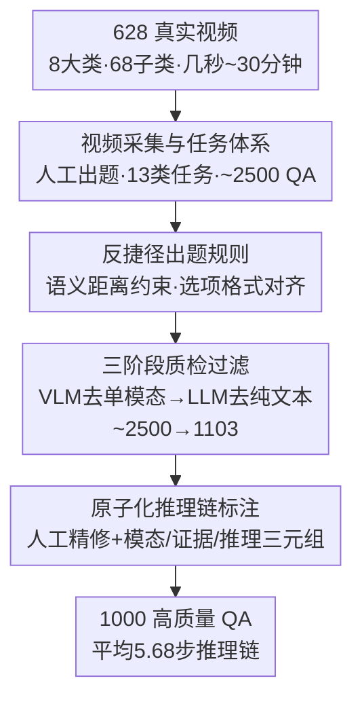

# OmniVideoBench: Towards Audio-Visual Understanding Evaluation for Omni MLLMs

**会议**: ICLR 2026  
**OpenReview**: [https://openreview.net/forum?id=ItRYEe8E61](https://openreview.net/forum?id=ItRYEe8E61)  
**代码**: https://github.com/NJU-LINK/OmniVideoBench  
**领域**: 多模态VLM  
**关键词**: 音视频理解, 评测基准, 全模态MLLM, 推理链标注, 长视频

## 一句话总结
OmniVideoBench 是一个专门评测「音频与视觉协同推理」的高质量基准：从 628 个最长 30 分钟的真实视频里，经人工出题 + 双重模型过滤 + 人工精修，构造出 1000 道带原子级推理链标注的多选题，结果显示连最强的 Gemini-3.0-Pro 也只有 61.8% 准确率、远低于人类的 82.69%，开源模型则接近随机。

## 研究背景与动机
**领域现状**：多模态大模型（MLLM）在视频理解上进步很快，越来越多的「全模态」（Omni）模型号称能同时处理视觉、语言和音频。要衡量这种能力，社区需要能真正考验「音视频协同推理」的评测基准。

**现有痛点**：现有的音视频基准存在两类系统性缺陷。其一是**视频太短**——AVQA、Music-AVQA、AVHBench 等大多用 10–60 秒的短片，无法考查长时间跨度的时序依赖；其二是**模态整合不真实**——很多基准名义上是「音频+视觉」，实际却把音频当成可有可无的辅助信号，或者音频和视觉在逻辑上根本没耦合（比如新闻、纪录片这类音频几乎覆盖全部视觉信息的视频，看画面就能答，听不听音频无所谓）。

**核心矛盾**：评测要测的是「音频和视觉必须协同才能答对」，但如果出题不严谨，模型完全可以靠**单模态捷径**（只看画面 / 只读字幕 / 只凭常识）或**文本线索**（题干、选项的措辞长度差异）蒙对，于是基准分数虚高，反映不出真正的跨模态推理能力。论文实测：把 Gemini-2.0-Flash 的音频关掉，它的准确率直接掉到接近随机，说明很多任务的视觉信息根本不够答。

**本文目标**：造一个「强制音视频协同、且杜绝各种捷径」的基准，同时还能**透视模型怎么推理**而不只是看最终答案对不对。

**切入角度**：作者坚持**全程人工出题**而非自动生成——自动标注的天花板被标注模型本身的能力卡死，而人工出题更贴近真实需求；再用模型做「过滤器」把能被单模态/纯文本解出的题剔除，最后给每道题补上**逐步推理链**。

**核心 idea**：用「人工出题 + 模型双重过滤 + 人工精修」三段式流水线，配合显式的原子推理链标注，造出一个既难又干净、能反向诊断模型推理过程的音视频基准。

## 方法详解

### 整体框架
OmniVideoBench 本质是一条**数据构造与质检流水线**，目标是把「海量真实视频」转化为「1000 道强制音视频协同、且无捷径可走」的高质量多选题。整条管线分三大阶段：先**采集 628 个**涵盖 8 大类、68 子类、时长从几秒到 30 分钟的真实视频，并由标注员人工出 ~2500 道多选题（覆盖 13 种任务类型）；接着进入**双重过滤**——用一个强 MLLM（Gemini-2.0-Flash）剔除「只靠单模态就能答对」的题，再用一个强 LLM（DeepSeek-V3.1）剔除「只靠文本/常识就能答对」的题，把题量从 ~2500 压到 1103；最后由另一组标注员**人工精修**，删掉答案错误/不唯一/不匹配的题，并给每道保留下来的题补上由「模态—证据—推理」三元组构成的**原子推理链**，最终沉淀出 1000 道题。

### 关键设计

**1. 视频采集与任务体系：从源头保证「非协同不可答」**

要测音视频协同，首先要保证视频本身音画互补、且任务足够多样。作者把视频分成 Vlog、News、Cartoon、Sports、Documentary、TV、Ego、Others 共 8 大类、近 68 个细粒度子类，并**人工控制类别分布**——新闻、纪录片这类「音频几乎覆盖全部视觉内容」的视频不适合协同推理，被刻意压低占比。时长上从几秒覆盖到 30 分钟（平均 384 秒），以考查不同时间尺度上的推理；为避免和已有训练集（如热门剧集）重叠，只选近期发布的视频。任务层面设计了 **13 种类型**：细粒度感知、空间推理、属性比较、背景与音乐理解、计数、时序理解、总结、情感分析、因果推理、关系推理、指代推理、第一人称推理、假设推理。每道题都被要求**必须依赖音视频协同**、答案唯一且不依赖分辨率/帧率，从出题阶段就把「单模态可解」的口子尽量堵死。

**2. 反捷径出题规则：用语义距离约束消除文本作弊线索**

即便视频本身需要协同，模型仍可能靠题面/选项的表层线索蒙对，因此作者给出题立了一套硬规则。核心是一个**语义距离**度量：把选项 $o_i$ 表示成语义单元集合 $S_i$，两选项的距离定义为对称差的基数

$$d(o_i, o_j) = |S_i \triangle S_j|$$

要求所有干扰项与正确项、以及干扰项彼此之间的语义距离**保持一致**，防止模型靠「某个选项明显更接近正确答案」这种不均衡线索投机。除此之外还有几条规则：题干尽量精简、删去性别/着装/原话等冗余细节（既减少可被利用的文本线索、又提高难度）；限制答案长度避免答案本身泄题；要求选项在长度、语气、风格上**格式一致**（否则「三长一短」式排版会暗示答案）；干扰项必须真实出现在视频里且与问题相关，让模型无法靠常识直接排除。这些规则共同把「靠读题/读选项作弊」的空间压到最小。

**3. 三阶段质检过滤：用强模型当过滤器筛掉可被捷径解出的题**

人工出的 ~2500 道题里仍混有大量「能走捷径」的题，作者用两道模型过滤 + 一道人工精修来净化。**第一道**用具备强音视频感知和长上下文能力的 Gemini-2.0-Flash，专门测试「只给单模态信息能否答对」——若模型仅凭单模态就选对且解释合理，该题被判定为不需要协同、直接剔除，过滤后剩 ~1500 题。**第二道**用推理能力强的 DeepSeek-V3.1 测试「只靠文本能否答对」：一类是涉及经典/公认常识、不看视频也能答的题，直接丢弃；另一类是题干/选项/答案的措辞无意间泄露线索的题，由标注员审阅模型的推理过程后改写表述以消除偏置，过滤后剩 1103 题。**第三道**由另一组标注员通读全部题目，删掉答案错误、不唯一或答非所问的题。这种「让强模型先替你找漏洞」的思路，把质检从主观判断变成了可操作的对抗式筛选。

**4. 原子化推理链标注：让基准既能评分也能透视推理过程**

仅有最终答案无法解释「模型是怎么错的」，所以作者给每道保留题补上**逐步推理链**。每一步由三个元素构成：**模态**（这一步依赖音频还是视觉）、**证据**（从视频里提取的具体信息，如一句台词、一个动作、一个人物出现）、**推理**（基于该证据得出的判断）。关键约束是每步必须**原子化**——只涉及一个模态、只捕获一个最小证据单元，这样推理链既细粒度又完整。最终 1000 道题平均 5.68 步推理链，其中 54% 的步骤基于视觉、46% 基于音频，定量印证了两种模态在多步推理里的互补性。这套标注让基准不仅能算准确率，还提供了「模型在哪一模态、哪一步掉链子」的诊断信号。

### 数据集统计
最终数据集：628 个真实带音轨视频，8 大类 68 子类，平均时长 384.24 秒，分辨率 480p–1080p，每视频约 2k 个 ASR 转写 token、约 3 个说话人。标注侧 1000 道音视频推理题，13 种任务类型，平均题长 14.68 词、答案长 4.92 词、推理链 5.68 步；按音频类型分为语音（Speech）762、声音（Sound）147、音乐（Music）91 三类。

## 实验关键数据

### 主实验
评测涵盖闭源（Gemini-3.0/2.5/2.0 系列）与开源（Qwen3-Omni、Qwen2.5-Omni、Baichuan-Omni-1.5、HumanOmni、MiniCPM-o、VideoLLaMA2、VITA-1.5、OmniVinci 等）全模态模型，以及纯视觉 VLM（Qwen2.5-VL 系列）和纯文本 LLM（DeepSeek-V3.1）。人类标注员（10 人，含 2 名音乐专家）准确率为 **82.69%**。

| 模型 | 类型 | 总准确率 | Music | Sound | Speech |
|------|------|---------|-------|-------|--------|
| 人类 | — | **82.69** | — | — | — |
| Gemini-3.0-Pro | 视觉+音频 | 61.80 | 52.81 | 55.17 | 64.13 |
| Gemini-2.5-Pro | 视觉+音频 | 58.90 | 38.46 | 57.72 | 61.66 |
| Gemini-2.0-Flash | 视觉+音频 | 41.50 | 29.67 | 40.27 | 43.21 |
| Qwen3-Omni-30B-A3B | 视觉+音频 | 38.40 | 37.36 | 34.67 | 39.26 |
| Qwen2.5-Omni-7B | 视觉+音频 | 29.30 | 23.07 | 25.33 | 30.70 |
| VideoLLaMA2-7B | 视觉+音频 | 29.20 | 26.37 | 30.67 | 29.25 |

最强模型仅 61.8%、绝大多数开源模型逼近随机（~25–30%），凸显基准难度与「真正音视频推理」的鸿沟。

### 模态消融与分析

| 配置 | 现象 | 说明 |
|------|------|------|
| 关闭音频（Visual Only） | Gemini-2.0-Flash 41.5 → 31.3 | 仅靠视觉不够，证明任务确需协同 |
| 视觉 + ASR 文本 | 普遍优于 Visual Only | 文本化语音能补一部分，但对 Music/Sound 几乎无用 |
| 视觉 + 真实音频 | 仍优于 视觉+ASR | 音频理解不可被 ASR 替代 |
| 开放式 QA vs 多选 | Gemini-2.0-Flash 41.50 → 27.06；Qwen2.5-Omni-7B 29.30 → 17.25 | 去掉选项后大幅掉点，说明多选格式确实虚高了分数 |

### 关键发现
- **音乐类音频是最难的短板**：Gemini-2.5-Pro 在音乐视频上仅 38.46%，远低于语音 61.66%——音乐编码的是抽象的情绪/氛围信息，模型难以把这种低语义声学线索转化为有效推理；「背景与音乐理解」任务连最强模型都不足 50%。
- **开源模型音频整合能力弱**：同参数下处理音视频的 Qwen2.5-Omni-7B 竟不如纯视觉的 Qwen2.5-VL-7B，暴露开源 Omni 模型跨模态推理能力的普遍不足。
- **帧数越多越好、长视频更明显**：帧数从 32 增到 256，准确率稳步上升，且在长视频上增益更显著，说明密集时序采样和长上下文处理对鲁棒的音视频推理很关键。
- **闭源全面领先、长视频仍是难点**：Gemini-2.5-Pro 在 13 类任务中 11 类最优，但多数模型在长视频上仍吃力。

## 亮点与洞察
- **「让强模型当过滤器」是可复用的质检范式**：与其靠人工主观判断哪些题能走捷径，不如直接让强 MLLM/LLM 去尝试用单模态/纯文本解题，凡是被解出的就剔除——把质检变成对抗式自动筛选，可迁移到任何「需要强制多模态协同」的基准构造。
- **语义距离 $d(o_i,o_j)=|S_i\triangle S_j|$ 把「选项作弊」量化了**：以往出题靠经验避免「三长一短」，这里用对称差给出可计算的均衡性约束，是消除文本捷径的一个干净抓手。
- **原子推理链让基准从「评分」升级到「诊断」**：模态/证据/推理三元组 + 原子化约束，使得错误可以定位到具体模态和步骤，为分析模型推理过程（而非只看答案）提供了结构化信号。
- **开放式 QA 对照实验戳破多选虚高**：去掉选项后所有模型大幅掉点，提醒社区多选格式会系统性高估真实理解能力。

## 局限与展望
- **规模偏小**：1000 道题、628 个视频，相对训练数据量级仍属小样本评测，统计置信区间在细分任务（如音乐仅 91 题）上会偏大。
- **重度依赖人工**：全程人工出题 + 多轮人工精修成本高、难以快速扩展，更新到新模型/新领域时维护代价不低。
- **多选为主**：尽管补做了开放式 QA 对照，主榜仍是多选格式，存在猜测下限；开放式评测的自动判分一致性也是潜在噪声源。
- **过滤器引入的偏置**：用 Gemini-2.0-Flash / DeepSeek-V3.1 当过滤器，可能系统性偏好或排除某类题，使保留题分布带上过滤模型的「指纹」。

## 相关工作与启发
- **vs WorldSense / Daily-Omni**: 同为音视频基准，但作者指出它们「未真正实现两种模态的自然融合」，且偏短视频；OmniVideoBench 用反捷径规则 + 关音频掉到随机的验证，强制协同且把时长拉到 30 分钟。
- **vs AVQA / Music-AVQA / AVHBench**: 这些多为 10–60 秒短片、聚焦特定能力或幻觉检测；OmniVideoBench 扩展到多类型、长时序、细粒度跨模态推理。
- **vs MMAU / OmniBench / AV-Odyssey**: 后者多在单图像或纯音频上评测；本文是真·视频 + 音频协同，覆盖更广的时间跨度与依赖关系。

## 评分
- 新颖性: ⭐⭐⭐⭐ 不是新模型/新机制，但「反捷径出题 + 模型过滤 + 原子推理链」组合在音视频协同评测上确有系统性创新
- 实验充分度: ⭐⭐⭐⭐⭐ 覆盖闭源/开源/纯视觉/纯文本大量模型，含模态消融、ASR 对照、帧数、开放式 QA 等多维分析
- 写作质量: ⭐⭐⭐⭐ 流水线和发现讲得清楚，量化指标到位
- 价值: ⭐⭐⭐⭐⭐ 揭示了当前 Omni MLLM 在真正音视频推理（尤其音乐/长视频）上的巨大差距，是有诊断价值的高质量基准

<!-- RELATED:START -->

## 相关论文

- [\[ICML 2026\] AVI-Bench: Toward Human-like Audio-Visual Intelligence of Omni-MLLMs](../../ICML2026/multimodal_vlm/avi-bench_toward_human-like_audio-visual_intelligence_of_omni-mllms.md)
- [\[CVPR 2026\] EgoAVU: Egocentric Audio-Visual Understanding](../../CVPR2026/multimodal_vlm/egoavu_egocentric_audio-visual_understanding.md)
- [\[ICLR 2026\] Customizing Visual Emotion Evaluation for MLLMs: An Open-vocabulary, Multifaceted, and Scalable Approach](customizing_visual_emotion_evaluation_for_mllms_an_open-vocabulary_multifaceted_.md)
- [\[ICLR 2026\] OmniVinci: Enhancing Architecture and Data for Omni-Modal Understanding LLM](omnivinci_enhancing_architecture_and_data_for_omni-modal_understanding_llm.md)
- [\[ICLR 2026\] XModBench: Benchmarking Cross-Modal Capabilities and Consistency in Omni-Language Models](xmodbench_benchmarking_cross-modal_capabilities_and_consistency_in_omni-language.md)

<!-- RELATED:END -->
