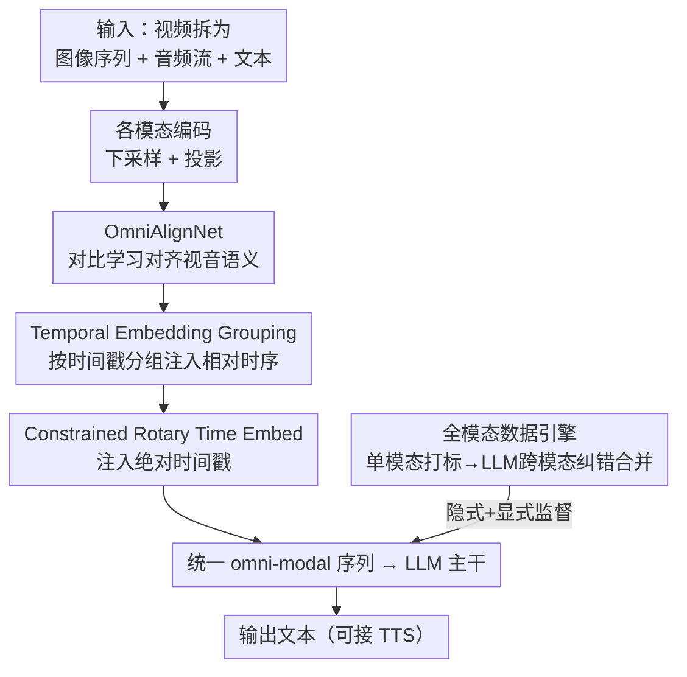

# OmniVinci: Enhancing Architecture and Data for Omni-Modal Understanding LLM

**会议**: ICLR 2026  
**OpenReview**: [https://openreview.net/forum?id=DZeic3NpHy](https://openreview.net/forum?id=DZeic3NpHy)  
**代码**: 有（NVIDIA 开源，含模型权重与项目主页）  
**领域**: 多模态VLM  
**关键词**: 全模态LLM, 视音对齐, 时序编码, 数据合成, 对比学习

## 一句话总结
OmniVinci 用三个针对"视觉-音频对齐"的架构改进（OmniAlignNet 语义对齐、时序分组、约束式旋转时间编码）外加一条能合成 2400 万条对话的数据流水线，仅用 0.2T token 就训练出一个能同时理解视频、声音、语音和文本的开源全模态 LLM，在多个跨模态/音频/视觉榜单上超过 Qwen2.5-Omni（训练 token 只用了它的 1/6）。

## 研究背景与动机
**领域现状**：多模态 LLM 已经能"看"（视觉）或"听"（音频）。近期工作开始尝试把视频里的画面和声音联合对齐，朝着同时感知视觉、自然声音、人类语音和语言的"全模态（omni-modal）"通用智能推进，代表作是 Qwen2.5-Omni、Gemini 等。

**现有痛点**：训练一个全模态系统在很多维度上都既贵又难。一方面，把异构的视觉/音频/文本嵌入塞进同一个潜空间，现有做法往往只是简单 token 拼接，缺乏对视觉与音频之间**语义关联**和**时间对齐**的显式建模——一段视频里画面和声音是同步发生的，这种天然对应关系被浪费了。另一方面，真正带有"视音联合标注"的训练数据极其稀缺，大多数视频 LLM 干脆把音轨丢掉。

**核心矛盾**：全模态理解需要模型同时利用各模态的互补信息，但（1）架构上缺乏让视觉与音频在共享空间里既语义对齐、又时间对齐的机制；（2）数据上既缺显式的全模态标注，而单模态自动打标又会因各自的"模态特异性幻觉"产生互相矛盾的错误描述。

**本文目标**：系统性地探索全模态 LLM 的架构、数据与训练配方，把这两件事各个击破——架构上设计视音统一嵌入机制，数据上造一条能规模化产出高质量全模态对话的流水线。

**切入角度**：作者观察到，同一段视频的视觉流和音频流之间存在内在语义关联，这为对齐二者提供了天然监督；同时大量"带音轨的视频 QA"数据其实**隐式**编码了全模态信号，只是过去没被利用。顺着这两点，架构和数据就都能找到杠杆。

**核心 idea**：在共享潜空间里用对比学习做视音语义对齐 + 用时序分组和约束旋转时间编码做时间对齐，再配一条"先单模态打标、再用 LLM 跨模态纠错合并"的数据引擎来制造显式全模态监督。

## 方法详解

### 整体框架
OmniVinci 是一个自回归全模态 LLM：输入可以是图像、视频、音频（自然声音或语音）、文本的任意子集组合，输出文本（可外接现成 TTS 变成语音）。视频被拆解为"时序相关的图像序列 + 音频流"，图像走视觉编码器、音频走一个统一音频编码器（同时处理声音和语音），各自经下采样和投影后，被送入本文提出的**全模态对齐机制**融合成一段统一的 omni-modal token 序列，再喂给 LLM 主干生成答案。

整个方法可以拆成"架构对齐"和"数据/训练"两条线。架构线的核心是把视觉嵌入和音频嵌入对齐进同一个潜空间，分三步：先用 OmniAlignNet 把二者的高层语义对齐，再用 Temporal Embedding Grouping 注入相对时序，最后用 Constrained Rotary Time Embedding 注入绝对时间戳。数据线则是用一条数据引擎把 2400 万条单模态/全模态对话造出来，并配合两阶段（单模态→全模态联合）训练。

### 关键设计

**1. OmniAlignNet：用对比学习把视觉与音频对齐进共享语义空间**

简单把视觉 token 和音频 token 拼起来送进 LLM，并没有让模型意识到二者描述的是同一件事。OmniAlignNet 针对这个痛点，借鉴 ImageBind/CLIP 的思路，专门学一个"视音共享潜空间"。对一段视频，视觉投影层输出嵌入序列 $E_v \in \mathbb{R}^{N_v \times C}$、音频投影层输出 $E_a \in \mathbb{R}^{N_a \times C}$；分别用一个可学习的视觉 query $Q_v$ 和音频 query $Q_a$（经交叉注意力）把变长序列压成固定大小的 $1\times C$ 嵌入，再过三层自注意力并做 L2 归一化，得到一个 batch（$K$ 个视频）的视觉-omni 嵌入 $V \in \mathbb{R}^{K\times C}$ 和音频-omni 嵌入 $A \in \mathbb{R}^{K\times C}$。

对齐用 CLIP 式对称对比损失：相似度 $s_{ij} = V_i^\top A_j$，让同一视频的视音嵌入靠近、不同视频的推远，双向损失取平均

$$\mathcal{L}_{\text{o-align}} = \tfrac{1}{2}(\mathcal{L}_{v\to a} + \mathcal{L}_{a\to v}),\quad \mathcal{L}_{v\to a} = -\tfrac{1}{N}\sum_{i=1}^{N}\log\frac{\exp(s_{ii})}{\sum_{j=1}^{N}\exp(s_{ij})}.$$

它把跨模态语义距离显式拉到一个共享空间里，比单纯拼接 token 更能逼模型学到视音互补信息——消融里它在 Omnibench 上单独带来 +6.1 的提升。

**2. Temporal Embedding Grouping (TEG)：用序列位置编码相对时序**

OmniAlignNet 对齐的是高层语义，但丢失了"画面和声音谁先谁后"的时间关系。TEG 解决的就是相对时序：把时间轴按一个组时长 $T_G$ 切成若干块，再按时间戳把视觉、音频嵌入重排进对应的块里。例如四帧视觉和四段音频按时间戳落入两个组 $G_v^1, G_v^2, G_a^1, G_a^2$，最终交错拼成

$$E_{\text{group}} = [G_v^1, G_a^1, G_v^2, G_a^2],$$

也就是让"同一时间窗内的视觉和音频 token 在序列里相邻"。这样 LLM 主干就能从 token 的**位置**里读出跨模态的相对时间顺序，$T_G$ 控制分组粒度。它不引入新参数，只靠重排序列就把时序信息喂进去。

**3. Constrained Rotary Time Embedding (CRTE)：注入绝对时间戳并约束敏感度**

TEG 给了相对顺序，却仍不知道每个 token 对应的**绝对时刻**。先前的 RoTE 用旋转注入绝对时间戳，但对微小时间抖动太敏感、又抓不住大跨度的时间偏移。CRTE 的关键是引入一个最大时间跨度 $T_{\max}$ 来约束敏感度，分三步：先构造基频 $\omega_i = \frac{2\pi}{T_{\max}^{\,\theta i / C}}$（$\theta\ge 1$ 控制频率缩放，$T_{\max}$ 越小越敏感于细粒度差异、越大越关注全局趋势）；再用实际时间戳调制 $\Omega_{i,j} = \omega_i \cdot t_j$；最后像 RoPE 一样做逐元素旋转

$$\text{CRTE}(x, \Omega_{:,j}) = x \odot \cos(\Omega_{:,j}) + \text{RotateHalf}(x)\odot \sin(\Omega_{:,j}).$$

RotateHalf 把 $C$ 维嵌入分成 $C/2$ 个 2D 平面、每对维度用不同频率旋转，从而得到多尺度的时间表示，又不破坏原始嵌入的语义。通过 $T_{\max}$ 显式平衡局部/全局时间编码，CRTE 在消融里把平均分从 50.25 进一步推高（替换 RoTE/Learned Time Embedding 都更好）。

**4. 全模态数据引擎：隐式 + 显式监督，靠 LLM 跨模态纠错消除"模态幻觉"**

架构再好也要有视音联合监督的数据，而这类数据极稀缺。本文从两侧供给。**隐式学习**：直接复用现有"带音轨的视频 QA"数据——视频天然是全模态的，过去大多被当纯视觉用，本文让模型在这些数据上隐式学到视音联合理解。**显式学习**：用一条数据引擎合成带明确全模态标注的对话。引擎先把视频切成约 20 秒/2 分钟的片段，用现成的视觉打标模型和音频打标模型分别生成视觉/音频描述；但单模态打标会因看不到另一模态而出错（如只看画面误判主题、只听声音误判内容），作者称之为"模态特异性幻觉"。于是再用一个 LLM **综合两侧信息做跨模态纠错与摘要**，产出每段准确的联合 caption，并用推理型 LLM 把这些 caption 进一步合成带推理链的 QA 对。最终汇成 2400 万条对话、来自 150+ 子数据集（图像 36%、声音 21%、语音 17%、全模态 15%、视频 11%）。这个"先各自打标、再让 LLM 互相纠错"的设计，是把不可靠的单模态标注变成可靠全模态监督的关键。

### 损失函数 / 训练策略
训练分两阶段：先做**单模态训练**，从预训练 LLM 出发分别培养视觉、音频能力；再做**全模态联合训练**，混合（i）从前一阶段随机采样的单模态数据和（ii）含视音的全模态数据（又分隐式/显式两类）来整合能力。总损失包含 LLM 的交叉熵语言建模损失，叠加 OmniAlignNet 的对比对齐损失 $\mathcal{L}_{\text{o-align}}$。文本提示还会用 Magpie TTS 转成语音，制造"语音提示 + 视觉输入"的全模态对，以支持语音指令能力。整套只用 0.2T 训练 token。

## 实验关键数据

### 主实验
全模态榜单上，OmniVinci 取得新的平均 SOTA，并在跨模态理解（Dailyomni）上大幅领先：

| 数据集 | 指标 | OmniVinci | Qwen2.5-Omni | 提升 |
|--------|------|-----------|--------------|------|
| Worldsense (视频-音频) | Acc | 48.23 | 45.40 | +2.83 |
| Dailyomni (视频-音频) | Acc | 66.50 | 47.45 | +19.05 |
| 全模态平均 | Avg | 53.73 | 49.66 | +4.07 |
| Video-MME (视觉) | Acc | 68.2 (w/o sub) | 64.3 | +3.9 |

视觉/音频单模态上同样有竞争力：Video-MME 70.6（带字幕）、MVBench 62.0、LongVideoBench 61.3，超过 NVILA 基线；同时仅用 0.2T token，是 Qwen2.5-Omni 1.2T 的约 1/6。

### 消融实验
架构三件套逐步叠加（基线为 token 拼接，10B token 子集训练），全模态三榜平均分稳步上升：

| 配置 | Worldsense | Dailyomni | Omnibench | 平均 |
|------|-----------|-----------|-----------|------|
| Token 拼接（基线） | 42.21 | 54.55 | 36.46 | 45.51 |
| + TEG | 44.51 | 60.99 | 37.65 | 47.72 (+2.21) |
| ++ CRTE | 45.46 | 65.66 | 39.64 | 50.25 (+4.74) |
| +++ OmniAlignNet | 46.21 | 65.83 | 45.74 | 52.59 (+7.08) |

数据侧消融（VideoMME，验证隐式/显式学习）：

| 配置 | w/ 字幕 | w/o 字幕 | 说明 |
|------|--------|---------|------|
| 仅视觉 | 66.37 | 61.67 | 丢掉音轨 |
| 视觉+音频（隐式 IL） | 66.96 | 63.76 | 用视频自带音轨 +2.09 |
| +数据引擎（显式 EL） | 68.63 | 67.37 | 再 +5.70，长视频段提升最明显 |

### 关键发现
- 三件套里 OmniAlignNet 对 Omnibench（图像-音频）增益最大（单步 +6.1），说明语义对齐对跨模态理解贡献最关键；CRTE 在 Dailyomni 上跳升明显，体现绝对时间编码对视音同步任务的价值。
- 即使已经提供字幕，加入音频隐式学习仍能涨点，说明音频里有字幕之外的信息（语气、声音事件），直接从音轨学习是有价值的。
- 显式数据引擎在长视频片段（Long: 51.11→57.78）上提升最大，印证"跨模态纠错的联合 caption"对复杂长内容尤其有用。
- 模态之间不仅在感知上互相增强，在推理上也有协同——这是作者强调的"modalities reinforce one another"。

## 亮点与洞察
- **"模态特异性幻觉"这个观察很实在**：单模态自动打标必然带偏（只看画面/只听声音都会误判主题），用一个 LLM 综合两侧纠错，把不可靠标注变成可靠监督——这是数据合成里可直接复用的 trick。
- **时间对齐拆成相对（TEG）+ 绝对（CRTE）两层**很清晰：相对时序靠序列重排零成本注入，绝对时间靠带 $T_{\max}$ 约束的旋转编码，二者正交叠加。CRTE 的 $T_{\max}$ 把"对细抖动太敏感"和"抓不住大跨度"这对矛盾用一个超参显式 trade-off，思路干净。
- **效率亮点**：0.2T token 打过 1.2T token 的对手，说明好的对齐架构 + 高质量合成数据可以大幅省训练预算，对资源有限的团队有借鉴意义。
- OmniAlignNet 用 query+交叉注意力把变长模态序列压成单个对齐嵌入再做 CLIP 对比，这种"先压缩再对齐"的模块可迁移到其他需要跨模态检索/对齐的任务。

## 局限与展望
- 显式数据引擎依赖现成的视觉/音频打标模型和纠错 LLM，合成数据质量受这些上游模型上限约束；"模态幻觉"被 LLM 纠正后是否引入新的 LLM 偏见，文中未深究。
- 语音输出靠外接现成 TTS 而非端到端生成，实时性和音色一致性受外部模块限制（作者在附录讨论 tradeoff）。
- 消融多在 10B token 子集上做，结论外推到全量训练时的相对贡献可能变化；不同榜单难度不同，跨榜单的提升幅度不宜直接横比。
- 全模态目前仍以"理解"为主，主动的跨模态生成（如同时生成画面与声音）尚未覆盖。

## 相关工作与启发
- **vs Qwen2.5-Omni**: 同为全模态 LLM，本文在视音对齐上引入专门的语义对齐（OmniAlignNet）+ 双层时间编码，且用 1/6 的训练 token 取得更高平均分，核心差异在"显式建模视音的语义与时间对应"而非单纯拼接 + 大数据堆量。
- **vs ImageBind / CLIP**: 借用其共享空间 + 对比对齐思想，但 OmniAlignNet 把它做成 LLM 内部的视音对齐模块、并叠加时序编码，服务于自回归全模态生成而非纯检索。
- **vs RoTE**: CRTE 直接针对 RoTE"对微小时间抖动敏感、抓不住大跨度偏移"的缺陷，加入 $T_{\max}$ 约束做多尺度旋转，消融中明显优于 RoTE 与 Learned Time Embedding。

## 评分
- 新颖性: ⭐⭐⭐⭐ 架构三件套和数据引擎都不算颠覆性单点，但"语义+相对时序+绝对时序"分层对齐 + 跨模态纠错合标的组合很扎实。
- 实验充分度: ⭐⭐⭐⭐⭐ 全模态/音频/视觉/图像多类榜单 + 逐步叠加的架构与数据消融，证据链完整。
- 写作质量: ⭐⭐⭐⭐ 架构与数据动机清楚，公式给全；部分训练细节压进附录。
- 价值: ⭐⭐⭐⭐⭐ 开源、省 6× token、覆盖机器人/医疗/工厂等下游，是全模态方向有分量的开源基座。

<!-- RELATED:START -->

## 相关论文

- [\[ICLR 2026\] Omni-Captioner: Data Pipeline, Models, and Benchmark for Omni Detailed Perception](omni-captioner_data_pipeline_models_and_benchmark_for_omni_detailed_perception.md)
- [\[ICLR 2026\] OmniVideoBench: Towards Audio-Visual Understanding Evaluation for Omni MLLMs](omnivideobench_towards_audio-visual_understanding_evaluation_for_omni_mllms.md)
- [\[ICLR 2026\] XModBench: Benchmarking Cross-Modal Capabilities and Consistency in Omni-Language Models](xmodbench_benchmarking_cross-modal_capabilities_and_consistency_in_omni-language.md)
- [\[ICLR 2026\] Omni-Weather: A Unified Multimodal Model for Weather Radar Understanding and Generation](omni-weather_a_unified_multimodal_model_for_weather_radar_understanding_and_gene.md)
- [\[ICLR 2026\] Multi-modal Data Spectrum: Multi-modal Datasets are Multi-dimensional](multi-modal_data_spectrum_multi-modal_datasets_are_multi-dimensional.md)

<!-- RELATED:END -->
