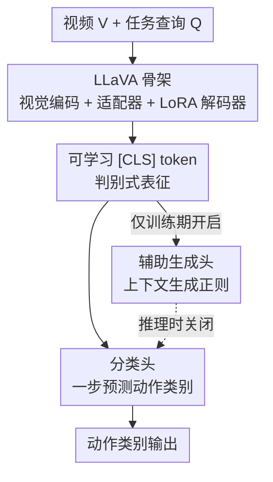

# On Discriminative vs. Generative Classifiers: Rethinking MLLMs for Action Understanding

**会议**: ICLR 2026  
**OpenReview**: [https://openreview.net/forum?id=ppceQOZrAX](https://openreview.net/forum?id=ppceQOZrAX)  
**代码**: https://github.com/pangzhan27/GAD  
**领域**: 多模态VLM / 视频理解  
**关键词**: MLLM、时序动作理解、判别式分类器、生成式分类器、语义重叠

## 一句话总结
作者重新审视了"把 MLLM 当生成式分类器、自回归吐出动作标签"的主流做法，指出动作标签子词共享造成的语义重叠是它精度低的根因，转而用一个可学习 [CLS] token 把 MLLM 改造成判别式分类器，再用生成式建模作为辅助正则，提出 GAD（Generation-Assisted Discriminative）框架，在 5 个数据集、4 类时序动作理解任务上同时拿到更高精度和最高 3× 的推理加速。

## 研究背景与动机
**领域现状**：MLLM 凭借自回归文本生成把视频理解从封闭集识别扩展到开放世界，于是很多工作（VideoLLM-online、VideoLLM-MoD 等）顺势把封闭集动作识别也写成生成问题——给模型喂"视频里的动作是什么？"，让它自回归地把动作标签（如"add onion"）当成自由文本逐 token 生成出来，再用编辑距离把生成文本映射回预定义类别。

**现有痛点**：这种生成式分类器有两个硬伤。其一是**慢**：一个标签要拆成若干子词逐 token 解码，需要多次前向；其二是**容易混淆语义相近的动作**：动作标签被刻意标注得简洁、高层（"add sugar"而非一长串描述），导致大量类别共享动词/宾语（"add""put"反复出现）。这些标签被分词器切成子词后，子词在类间共享，输出空间里就产生了严重的**语义重叠**——除了视频本身的视觉歧义，输出端又叠加了一层歧义。

**核心矛盾**：生成式目标本质上不是为分类设计的。判别式分类器（直接学任务专属表征、画清决策边界）天然更契合分类，却在 MLLM 时代被忽视了——因为大家默认 MLLM 的价值就在"用语言输出统一一切任务"。问题在于：分类任务真的需要标签语义吗？还是说语义重叠恰恰是包袱？

**本文目标**：(1) 系统比较 MLLM 上的生成式 vs 判别式分类器；(2) 搞清生成式为什么差、能否弥合差距；(3) 让生成式建模反过来去**增强**判别式，而不是彼此独立。

**切入角度**：作者在 CrossTask 上对共享动词"add"的动作做 t-SNE 可视化，发现判别式特征把各动作分得很开，生成式特征则纠缠在一起；并通过逐步打乱标签 tokenization 的对照实验，定位到"输出空间共享语义"才是性能差距的根源。

**核心 idea**：判别式分类器之所以强，是因为它**无视标签语义**、消除了输出端重叠；而判别式丢掉的语义/上下文信息，可以用一个**只在训练期开启、推理时关闭**的辅助生成头补回来——这就是 GAD。

## 方法详解

### 整体框架
GAD 建立在 LLaVA 式骨架上：视觉编码器 $E_v$ 把视频帧编码后，经视觉-语言适配器 $A_{vt}$ 映射成与文本对齐的视觉 token $F_v = A_{vt}(E_v(V))$；任务查询 $Q$ 被分词为文本 token $F_t$。微调时只训练适配器和经 LoRA 包装的语言解码器，其余冻结。

三种分类范式的差别全在解码器输出端怎么用：
- **生成式分类器**：把 $F_t \oplus F_v$ 送进因果解码器，用语言建模头自回归生成标签子词，推理需多次前向，且输出空间有语义重叠。
- **判别式分类器**：在输入序列末尾追加一个可学习 [CLS] token，它注意到前面所有 token，产出一个聚合了视频与查询的全局表征 $o$，喂给分类头一步出结果；语言建模头关闭。
- **GAD**：以判别式为主干，**额外挂一个辅助生成头**，条件于视频、查询和已学到的 [CLS] 表征去生成"上下文"（如前一个动作、整体任务目标），用来正则化表征学习。推理时只跑判别分支，效率与纯判别式一致。

### 关键设计

**1. 可学习 [CLS] token：把 MLLM 改造成判别式分类器**

针对生成式"慢 + 语义混淆"的痛点，作者不引入任何任务专属架构，而是复用现成 MLLM：在语言模型输入序列末尾追加一个可学习 [CLS] token，让它注意到前面所有视觉和文本 token，输出一个全局表征 $o = f_\phi(Q, V, [\text{CLS}]) = D_t(F_t \oplus F_v \oplus [\text{CLS}])$，再过分类头优化标准交叉熵 $L_{cls} = -\log \Pr(y \mid o, \phi')$，此时语言建模头被禁用。这样动作标签根本不会被切成子词，输出端语义重叠被彻底消除，一次前向就出结果。作者特意用可学习 token 而非直接拿最后一个视觉 token——后者容易过拟合训练数据，而可学习 token 泛化更好（消融里 w/o [CLS] 在 EK100 上 segment-F1 从 23.2 掉到 20.7）。

**2. 单步生成等价性：判别式其实是生成式的一个特例**

为了解释判别式为何有效、并把两种范式统一起来，作者证明：当把动作标签作为**新词条**加进分词器词表、并把分类头并入语言建模头时，判别式分类就等价于"一步生成整个动作标签"。因为这些新词条只作输出目标、不作输入，其 embedding 随机初始化也不影响性能。为验证"语义重叠才是差距根源"，作者设计了三档逐步破坏标签语义的对照（如 [Tab.3]）：**Randomized Consistent Mapping**（子词换成随机 token，但相同子词在所有标签里映射一致——保留类间重叠）几乎不改变结果；**Desynchronized Independent Mapping**（同一子词在不同标签里映射成不同随机 token——消除重叠）让生成式性能大幅逼近判别式；**Extended Vocabulary**（每个标签当成单一新 token）同样追平判别式，且能一步预测。这条链清晰地把性能差距归因于"输出空间的共享语义"，而非子词本身的语言含义。

**3. 生成辅助：把判别式丢掉的语义/上下文补回来**

判别式虽强，却丢掉了文本生成承载的语义丰富度。GAD 在判别式之上加回语言建模头作**辅助任务**而非独立任务（已有工作表明单纯把两个目标拼一起收益有限）。总损失为 $L_{GAD} = L_{cls} + \lambda L'_{gen}$，其中辅助生成损失条件于 [CLS] 表征：$L'_{gen} = -\sum_i \log \Pr(u_i \mid u_{<i}, Q, V, [\text{CLS}], \theta)$，$\lambda$ 默认取 1。作者比较了三种统一策略（判别先行→再生成、生成先行→再判别、并行），发现**判别先行、生成后置**最有效。关键在于生成什么内容：在 OAD 任务里生成**前一个动作**作为上下文比生成未来动作更有效（前一动作有输入视频里的过往观测支撑，而在线设定下看不到未来）；在 COIN 里生成**任务级目标**信息收益最大。消融还表明，把"前一动作预测"改成一个判别式辅助分类头（GAD prev disc/disc+）反而会损害当前动作精度——证明增益真正来自**生成式的语义编码**，而非辅助分类任务本身。

### 损失函数 / 训练策略
训练时视觉编码器冻结，适配器微调，LLM 用 LoRA（$r=128$、$\alpha=256$）更新；判别与生成目标在所有样本上联合优化，生成作为辅助监督。推理时关闭生成分支，只用判别头出预测，因而保持判别式的低延迟。生成输出后处理沿用 Levenshtein 编辑距离映射回封闭集标签。

## 实验关键数据

### 主实验
在 5 个数据集、4 类任务（步骤识别、步骤预测、任务识别、在线动作检测 OAD）上评测。OAD 用 segment-F1（S-F1，IoU 0.1）和 point-F1（P-F1，1s 阈值），识别/预测任务用 Top-1 准确率。

判别式 vs 生成式（Llama3.2-1B，OAD 任务 S-F1 / P-F1 与推理 FPS）：

| 数据集 | 生成式 S-F1/P-F1 | 生成式 FPS | 判别式 S-F1/P-F1 | 判别式 FPS |
|--------|------------------|-----------|------------------|-----------|
| THUMOS'14 | 56.9 / 38.8 | 38.3 | 57.8 / 40.1 | 58.0 |
| CrossTask | 46.8 / 31.7 | 44.0 | 48.8 / 34.0 | 59.4 |
| EPIC-Kitchens-100 | 16.7 / 13.9 | 28.8 | 23.2 / 19.3 | 51.1 |
| Ego4D GoalStep | 8.9 / 3.4 | 17.8 | 10.6 / 4.1 | 53.6 |

判别式在细粒度动作多（EK100 约 3600 类）的数据集上提升最大（S-F1 +6.5），且加速与标签 token 数成正比：Ego4D GoalStep 标签平均 5.5 token，判别式快近 4×。值得注意的是，1B 判别式甚至超过 8B 生成式。

与 SOTA 对比（COIN Top-1 acc，Step/Next/Task）：

| 方法 | Step | Next | Task |
|------|------|------|------|
| Videollm-online-8B | 63.1 | 49.1 | 92.7 |
| StreamMind-8B | 63.7 | 49.9 | 93.2 |
| Disc (Llama3.2-1B) | 64.1 | 50.1 | 92.8 |
| GAD (Llama3.2-1B) | 65.3 | 51.4 | 93.5 |
| GAD (Llama3-8B) | 67.3 | 51.6 | 94.5 |

在 OAD 上 GAD 是首个 LLM-based 方法，THUMOS'14 达 58.1/40.2，大幅超过 CMeRT（48.9/34.6）。论文称 COIN 上平均 2.5% 准确率提升 + 3× 加速，EK100 平均 6.8% F1 提升 + 1.8× 加速。

### 消融实验

| 配置 | CrossTask S-F1/P-F1 | EK100 S-F1/P-F1 | 说明 |
|------|----------------------|------------------|------|
| Disc | 48.8 / 34.0 | 23.2 / 19.3 | 纯判别式基线 |
| GAD | 50.3 / 34.5 | 24.1 / 20.1 | 完整（上下文生成） |
| w/o [CLS] | 49.2 / 33.8 | 20.7 / 17.7 | 用最后一个视觉 token 替代，EK100 大掉 |
| GAD prev disc | 48.2 / 31.6 | 23.6 / 19.3 | 前一动作改判别式辅助，反而掉点 |
| GAD (label 2stage) | 41.8 / 26.7 | 9.3 / 6.7 | 先训生成再冻结，崩盘 |

弥合差距对照（Llama3.2-1B）：Gen 16.7/13.9（EK100）→ Gen rand 16.8/14.0（几乎不变）→ Gen desync 23.0/19.0、Gen extend 23.3/19.2（追平 Disc 23.2/19.3）。

### 关键发现
- **语义重叠是性能差距的根因**：只打乱子词、保留类间共享映射几乎无影响；只有打散类间重叠（desync/extend）才追平判别式，直接坐实了假设。
- **错误多样性指标佐证**：生成式在 CrossTask/EK100/Ego4D 上的熵式误分多样性得分为 0.76/1.3/1.8，判别式为 0.66/0.79/1.5——生成式因引入语义产生更发散的错误（如把"add sugar"错成"add meat""add spices"）。
- **生成内容要互补**：辅助生成要生成判别式拿不到的信息（前一动作、任务目标）才有效；和判别式做一样的事（label joint）只有微弱提升。
- **两阶段训练崩盘**：先只训生成头再冻结，说明生成式分类器单独并不能提供强表征。

## 亮点与洞察
- 把"判别式是生成式的单步特例"用扩展词表 + 合并头的视角讲清楚，既统一了两种范式，又顺手解释了判别式为何快、为何准——这是全文最优雅的一笔。
- 三档 tokenization 对照实验（consistent / desync / extend）是非常干净的归因设计，把"是子词语义还是类间重叠在作怪"一刀切开，值得借鉴到任何"标签空间语义是否有害"的分析里。
- GAD 只在微调期开生成分支、推理期关掉，做到"训练拿语义、推理保效率"，且不动预训练、删掉 LoRA 就能恢复开放世界能力——工程上很友好。
- "生成式辅助优于判别式辅助"这一消融揭示：增益来自**生成式的语义编码方式**，而非多一个监督任务，这个结论可迁移到其他多任务正则设计。

## 局限与展望
- 判别式本质仍困在封闭集，无法直接处理新类/未见动作——作者承认这是核心局限，并提议未来用生成组件改善对新类的泛化。
- 任务专属微调会带来"任务诱导遗忘"，损害通用 QA 等能力；论文只在附录给了权衡分析，正文未深入。
- 增益依赖"动作标签简洁、语义重叠严重"这一前提；对标签本身就很描述化、重叠少的场景（如 Ego4D GoalStep 提升相对小），判别式优势会收窄。
- 辅助生成"生成什么内容"高度依赖任务先验（OAD 选前一动作、COIN 选任务目标），缺少一个自动选择上下文的通用机制。

## 相关工作与启发
- **vs 生成式 MLLM 分类器（VideoLLM-online / VideoLLM-MoD / StreamMind）**：它们把分类写成自回归文本生成，受困于子词共享造成的语义重叠和多步解码；本文改用判别式 [CLS]，一步出结果且无视标签语义，1B 即超它们的 8B。
- **vs 定制化 tokenization（Lin & Shou 2025 的层级词表、检索里的语言判别码）**：那些方法想压短 token、保留语义以加速；本文反向论证在细粒度动作里"保留完整语义反而有害"，等价于把每个动作编码成唯一、无结构的原子码。
- **vs 统一检索+生成的多任务框架（CoCa、Ma et al. 2024）**：它们把判别与生成当作不同任务分别处理且单纯合并目标收益有限；本文在**同一任务**内让生成式作辅助去增强判别式，而非并列。

## 评分
- 新颖性: ⭐⭐⭐⭐⭐ 重新定义了 MLLM 做封闭集动作分类的范式，并给出"判别=单步生成"的统一视角
- 实验充分度: ⭐⭐⭐⭐⭐ 5 数据集 4 任务，含归因对照、错误多样性、SOTA 与多组消融
- 写作质量: ⭐⭐⭐⭐ 分析链条清晰，但部分关键证据（trade-off、生成内容选择）压在附录
- 价值: ⭐⭐⭐⭐⭐ 同时提精度与效率、不动预训练、易落地，对"MLLM 做分类"有方法论意义

<!-- RELATED:START -->

## 相关论文

- [\[ICLR 2026\] Understanding vs. Generation: Navigating Optimization Dilemma in Multimodal Models](understanding_vs_generation_navigating_optimization_dilemma_in_multimodal_models.md)
- [\[ICLR 2026\] AttTok: Marrying Attribute Tokens with Generative Pre-trained Vision-Language Models towards Medical Image Understanding](atttok_marrying_attribute_tokens_with_generative_pre-trained_vision-language_mod.md)
- [\[ICLR 2026\] GeoBench: Rethinking Multimodal Geometric Problem-Solving via Hierarchical Evaluation](geobench_rethinking_multimodal_geometric_problem-solving_via_hierarchical_evalua.md)
- [\[ICLR 2026\] OmniVideoBench: Towards Audio-Visual Understanding Evaluation for Omni MLLMs](omnivideobench_towards_audio-visual_understanding_evaluation_for_omni_mllms.md)
- [\[ICLR 2026\] Efficient Discriminative Joint Encoders for Large Scale Vision-Language Re-ranking](efficient_discriminative_joint_encoders_for_large_scale_vision-language_rerankin.md)

<!-- RELATED:END -->
