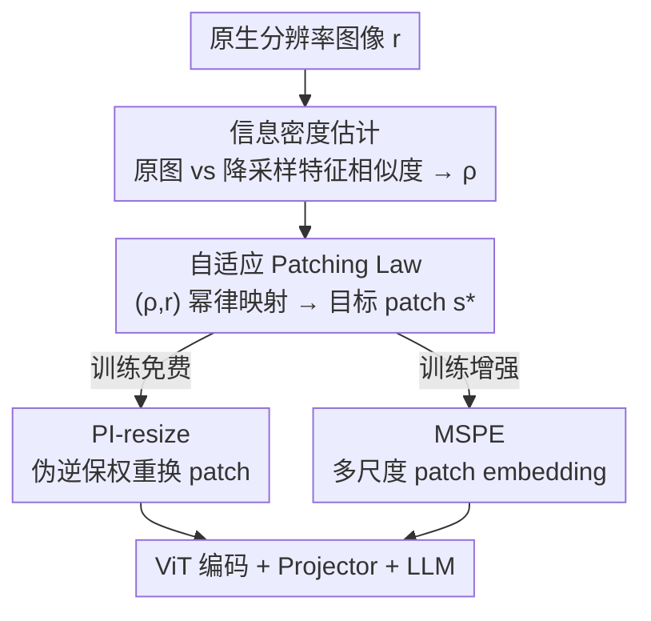

# One Patch Doesn't Fit All: Adaptive Patching for Native-Resolution Multimodal Large Language Models

**会议**: ICLR 2026  
**OpenReview**: [https://openreview.net/forum?id=six75YUGgS](https://openreview.net/forum?id=six75YUGgS)  
**代码**: 待确认  
**领域**: 多模态VLM  
**关键词**: 原生分辨率, 自适应 patch, 信息密度, 序列打包, 免训练

## 一句话总结
作者发现号称"任意分辨率"的 MLLM 其实对分辨率非常敏感，根因是 ViT 用了**固定 patch 大小**；于是提出 AdaPatch，根据图像分辨率和信息密度逐图选择 patch 尺寸，并用伪逆 resize 把预训练的固定 patch 模型**免训练**改造成任意 patch 模型，在多个基准上同时提升精度、稳定性，还能在高分辨率下减少 token 数加速推理。

## 研究背景与动机
**领域现状**：当下主流 MLLM 把预训练 ViT 接一个轻量 projector 再连 LLM。为了处理真实世界里千变万化的分辨率/长宽比，近期工作（Qwen2.5-VL、Ovis2.5、Kimi-VL 等）跟随 NaViT 的做法：保留图像原生分辨率，切成固定大小、不重叠的 patch，得到长度随图像尺寸变化的 token 序列，再把多张图拼成一条 packed sequence（sequence packing）联合编码，宣称支持任意输入分辨率。

**现有痛点**：作者第一次从"像素预算（pixel range）"的视角系统评测这些 SOTA 模型，发现它们的表现根本不是"任意分辨率鲁棒"——把同一个 benchmark 在不同像素范围下预处理，性能会剧烈波动：低分辨率下信息密集的图（图表、文档）因为重采样丢掉了细粒度信号而崩盘；高分辨率下（哪怕模型号称支持 ~3K 输入）也普遍明显掉点。

**核心矛盾**：根本原因在于**固定的 patch 尺寸**。低分辨率或信息密集的图，大 patch 太粗，恢复不出细粒度线索；超高分辨率或信息稀疏的图，小 patch 又太局部，捕捉不到全局上下文。一个固定的感受野粒度无法同时适配两端，这是大部分性能损失的来源。

**切入角度**：作者通过把 Qwen2.5-VL 转成多种 patch 尺寸 $s\in\{7,14,21,28,35,42\}$ 在 MME 上扫描，发现一个清晰规律：低分辨率偏好小 patch、高分辨率偏好大 patch；而且最优 patch 不只取决于分辨率，还取决于信息密度——同一分辨率下，文档 > 图表 > 普通图的信息密度越高，最优 patch 越小。经验上近似满足 $s^{\star}\propto r/\rho$（$r$ 是分辨率标量、$\rho$ 是信息密度）。

**核心 idea**：既然最优 patch 由"分辨率 + 信息密度"共同决定，那就别再死守单一 patch——估计每张图的信息密度 $\rho$，把 $(\rho, r)\mapsto s$ 映射成合适的 patch 尺寸，再用一个保权重的转换让固定 patch 模型能跑任意 patch，从而把"任意分辨率"做到名副其实。

## 方法详解

### 整体框架
AdaPatch 是一个**即插即用**的前端模块，插在 MLLM 的视觉编码之前，整体分两步：先对输入图估计该用多大的 patch（自适应 patch 估计，Sec 3.1），再把预训练里固定 patch 的 embedding 层转换成能处理这个目标 patch 的形态（固定 patch → 任意 patch 转换，Sec 3.2），随后照常做 patch & position embedding、过视觉编码器、projector、喂给 LLM。

第一步内部又是三小环节串联：用"原图特征 vs 降采样特征"的相似度算出信息密度 $\rho$ → 把 $(\rho, r)$ 代入 Patching Law 这条幂律公式 → 量化裁剪得到目标 patch 尺寸 $s^{\star}$。第二步给出两条转换路线：训练免费的 PI-resize（伪逆 resize，推理时直接换 patch）和基于训练的 MSPE（多尺度 patch embedding，训练时为每个 patch 尺寸各配一套参数）。两条路线都不动 backbone，且都兼容现有的 sequence packing。

### 关键设计

**1. 信息密度估计：用降采样损失量化一张图有多"密"**

要按信息密度调 patch，先得有个能逐图、轻量算出的信息密度指标。作者的直觉是：把高密度图降采样会损失更多信息，把稀疏图降采样几乎不痛不痒——于是用"降采样前后特征的相似度差"来度量密度。具体地，对图像 $x$，取视觉编码器第 $k$ 层第 $i$ 个 token 特征 $E^{[k,i]}_\phi$，比较原图在 patch 尺寸 $s$ 下的特征与"先半分辨率降采样、再用 $s/2$ patch"得到的特征之间的余弦相似度，取 token 平均后用 1 减去它：

$$\rho_{\text{info}}(x) = 1 - \frac{1}{n}\sum_{i=1}^{n}\frac{\langle E^{[k,i]}_\phi(\text{conv}_\theta(\tilde{x}; s)),\ E^{[k,i]}_\phi(\text{conv}_{\theta^*}(B^{r/2}_{r}\text{vec}(\tilde{x}); s/2))\rangle}{\lVert E^{[k,i]}_\phi(\text{conv}_\theta(\tilde{x}; s))\rVert \cdot \lVert E^{[k,i]}_\phi(\text{conv}_{\theta^*}(\cdots; s/2))\rVert}$$

$\rho(x)\in[0,1]$，值越大说明降采样损失越大、信息越密。这一步只在视觉编码器很浅的层（默认第 0 层）算一次，开销很小，却给后面的 patch 选择提供了关键的"密度"输入——这正是固定 patch 方法缺失的那个维度。

**2. 自适应 Patching Law：把分辨率和密度融进一条幂律选 patch**

有了密度，还要把 Sec 2.3 观察到的 $s^{\star}\propto r/\rho$ 变成可执行的公式。作者用幂律建模这个依赖，并引入两个超参 $\alpha,\beta$ 分别控制对分辨率和信息密度的敏感度：

$$s^{*}(x) = \text{Quantize}\left(\text{clip}\left(\tilde{s}\left(\frac{\kappa(r_x)}{r_0}\right)^{\alpha}\left(\frac{\tilde{\rho}}{\rho(x)+\varepsilon}\right)^{\beta}, s_{\min}, s_{\max}\right)\right)$$

其中 $\kappa(\cdot)$ 是分辨率标量（如 $\min\{h,w\}$），$r_0,\tilde{\rho},\tilde{s}$ 是预训练模型的基准分辨率/密度/patch（默认 896、0.2、14），$\text{clip}$ 把结果约束到 $[s_{\min},s_{\max}]$，$\text{Quantize}$ 再吸附到预定义的整数离散集合。公式体现两条直觉：分辨率越高越偏大 patch（省 token、保全局），信息密度越高越偏小 patch（保细节）。这条规则让每张图都能独立选 patch，同时不破坏 sequence packing 的兼容性。默认 $(\alpha,\beta)=(0.5,0.3)$。

**3. PI-resize：免训练把固定 patch 模型变成任意 patch 模型**

选好了目标 patch $s_i$，难点是预训练的 patch embedding 是为固定 $s$ 学的，直接换 patch 会失配。作者要求"换 patch 后 token embedding 与原 patch 下尽量一致"，把它写成一个最小二乘目标：让 $\text{conv}_{\theta_i}(B^{r_i}_r\text{vec}(x), s_i)$ 逼近原始 $\text{conv}_\theta(x, s)$。这个目标有**闭式解**——用 Moore–Penrose 伪逆 $\omega_{\theta_i}=(B_i^\top)^{+}\omega_\theta$（$B_i$ 是 patch 尺度间的插值矩阵），即

$$\text{PI-resize}^{s_i}_{s}(w) = (B_i^\top)^{+}\text{vec}(w)$$

对于上采样（$s_i>s$）内积被精确保持 $\langle B_i x,(B_i^\top)^{+}\omega_\theta\rangle=\langle x,\omega_\theta\rangle$，下采样（$s_i<s$）时给出最优近似。整个过程**不需要任何训练**，就把固定 patch 的预训练 MLLM 在推理时改造成任意 patch 模型。消融显示 PI-resize 明显优于 bilinear / area 插值。

**4. MSPE：训练增强版的多尺度 patch embedding**

PI-resize 是即插即用，但若有训练预算可以更进一步。MSPE 为每个候选 patch 尺寸 $s_i$ 分配独立参数 $\{\theta_i\}^{M}_{i=1}$，并和整个 MLLM 端到端联合训练，训练中按图自适应采样 patch 尺寸 $s_i$、最小化任务损失（公式 7），每个 $\theta_i$ 用 PI-resize 初始化。默认候选集 $\{s_i\}=\{8,12,14,16,24,28\}$。一句话区分两条路线：PI-resize 在推理期把固定 patch 转成任意 patch，MSPE 在训练期把多套 patch embedding 权重学出来，二者都不改 backbone，且都服务于前面的自适应 patch 选择。

### 损失函数 / 训练策略
免训练路线（PI-resize）无需任何梯度更新。训练增强路线（MSPE）用 AdamW（学习率 $1\times10^{-5}$、weight decay 0.01）在 LLaVA1.5-665K 和 LLaVA1.6-779K 上增量微调，最大生成长度 512、温度 0；候选 patch 尺寸取 $[6,56]$ 内整数；信息密度从视觉编码器第 0 层估计。实验在 8×A100(80G) 上完成。

## 实验关键数据

### 主实验
在 Qwen2.5-VL-3B、SAIL-VL-2B、Ovis2.5-2B、Kimi-VL-A3B 四个原生分辨率模型上，AdaPatch 相对固定 patch（$s=14$）baseline 普遍提升，分辨率/信息密度异质大的基准提升尤其明显：

| 模型 | 基准 | vanilla | AdaPatch | 提升 |
|------|------|---------|----------|------|
| Qwen2.5-VL-3B | OCRBench | 821 | 845 | +24 |
| Qwen2.5-VL-3B | MMBench-EN | 75.15 | 78.49 | +3.34 |
| Qwen2.5-VL-3B | MME | 2135.90 | 2210.41 | +74.5 |
| SAIL-VL-2B | OCRBench | 783 | 855 | +72 |
| Ovis2.5-2B | OCRBench | 706 | 814 | +108 |
| Kimi-VL-A3B | DocVQA | 96.45 | 98.33 | +1.88 |

跨像素范围（112×112 → 3584×3584）评测中，原始 MLLM 在低/高两端都明显下滑，而 AdaPatch 全谱段稳定得多——印证了"分辨率敏感主要来自固定 patch"这一论断。

### 消融实验

| 配置 | 关键发现 | 说明 |
|------|---------|------|
| PI-resize vs Bilinear/Area | PI-resize 最优 | 换 patch 时其他插值明显掉点 |
| $\alpha$（分辨率敏感度） | $\alpha$ 影响更大，过大显著掉点 | 默认 $\alpha=0.5$ |
| $\beta$（密度敏感度） | 影响较弱 | 默认 $\beta=0.3$ |
| AdaPatch vs 图像 resize | AdaPatch 更优 | resize 在 OCRBench 有增益但严重损 DocVQA/MME |
| 模型规模 3B/7B/32B、2B/9B | 各尺度一致增益 | 收益来自缓解 patch 刚性而非模型容量 |

### 关键发现
- **OCRBench、MME 提升最大**：这两类涵盖分辨率跨度大、信息布局复杂的图，正是固定 patch 最吃亏、自适应最受益的场景。
- **直接 resize 图像不是好替代**：把图统一缩到固定像素范围虽在个别基准涨点，却在 DocVQA、MME 上大幅掉点；保留原生分辨率、只调 patch 才能无失真处理异质区域。
- **推理时间双刃剑**：低分辨率下因信息密度估计 + token 序列变长引入额外开销，但高分辨率下因 token 数减少实现明显加速。

## 亮点与洞察
- **把"任意分辨率"证伪再修补**：先用像素范围扫描揭示 SOTA 模型的分辨率脆弱性，再精准归因到固定 patch，叙事完整且有说服力——是先做诊断再开药方的范例。
- **信息密度的巧定义**：不引入额外网络，仅用"降采样前后浅层特征相似度"就量化出每张图的信息密度，开销极低却补上了固定 patch 缺失的维度，这个思路可迁移到任何需要"图像难度/密度"先验的视觉系统。
- **闭式 PI-resize 换 patch**：把"换 patch embedding"写成最小二乘并求伪逆闭式解，做到上采样内积精确保持、下采样最优近似，实现真正零训练改造预训练大模型，非常工程友好。

## 局限与展望
- 作者承认只从"LLM 之前的视觉处理"角度解决原生分辨率问题，未触及 LLM 内部；未来想引入更多高质量多分辨率数据、结合持续学习与知识增强、以及高效视觉 token 处理（如可恢复压缩）。
- 自己观察：信息密度估计 + 变长序列在**低分辨率**下反而增加推理开销，对延迟敏感场景需权衡；Patching Law 是经验幂律，$\alpha,\beta$ 需按模型/任务调，普适性有待更多验证。
- $\text{Quantize}$ 把 patch 吸附到离散集合，候选集大小与取值可能影响细粒度自适应能力，论文未深入分析其敏感性。

## 相关工作与启发
- **vs NaViT / Pix2struct**：它们保留原生分辨率但用**固定 patch** + sequence packing，正是本文指出的分辨率两端掉点根因；AdaPatch 在其之上让 patch 逐图可变。
- **vs FlexiViT**：FlexiViT 通过 resize patch embedding 权重权衡精度与算力，主要面向单模型多 patch 的分类；本文把"按图选 patch"扩展到 MLLM，并给出免训练的伪逆转换 + 信息密度驱动的选择规则。
- **vs CNN 时代的 Resolution Adaptive / Dynamic Resolution Network**：那些方法把输入路由到不同子网/分辨率，但强绑 CNN 架构难迁移到视觉-语言系统；AdaPatch 直接面向 ViT-based MLLM 的 patch 粒度。

## 评分
- 新颖性: ⭐⭐⭐⭐⭐ 把固定 patch 锁定为"任意分辨率"失败根因，并用信息密度 + 伪逆转换给出免训练解，角度新颖
- 实验充分度: ⭐⭐⭐⭐⭐ 四模型、多尺度、跨像素范围、训练/免训练双路线、多组消融，覆盖全面
- 写作质量: ⭐⭐⭐⭐ 诊断—归因—方法逻辑清晰，公式较密但可读
- 价值: ⭐⭐⭐⭐⭐ 即插即用、不动 backbone、还能高分辨率加速，落地价值高

<!-- RELATED:START -->

## 相关论文

- [\[CVPR 2026\] One Patch to Caption Them All: A Unified Zero-Shot Captioning Framework](../../CVPR2026/multimodal_vlm/one_patch_to_caption_them_all_a_unified_zero-shot_captioning_framework.md)
- [\[ICLR 2026\] Self-Aug: Query and Entropy Adaptive Decoding for Large Vision-Language Models](self-aug_query_and_entropy_adaptive_decoding_for_large_vision-language_models.md)
- [\[ICLR 2026\] ERGO: Efficient High-Resolution Visual Understanding for Vision-Language Models](ergo_efficient_high-resolution_visual_understanding_for_vision-language_models.md)
- [\[ICLR 2026\] From Pixels to Words -- Towards Native Vision-Language Primitives at Scale](from_pixels_to_words_--_towards_native_vision-language_primitives_at_scale.md)
- [\[AAAI 2026\] ClearAIR: A Human-Visual-Perception-Inspired All-in-One Image Restoration](../../AAAI2026/multimodal_vlm/clearair_a_human-visual-perception-inspired_all-in-one_image_restoration.md)

<!-- RELATED:END -->
