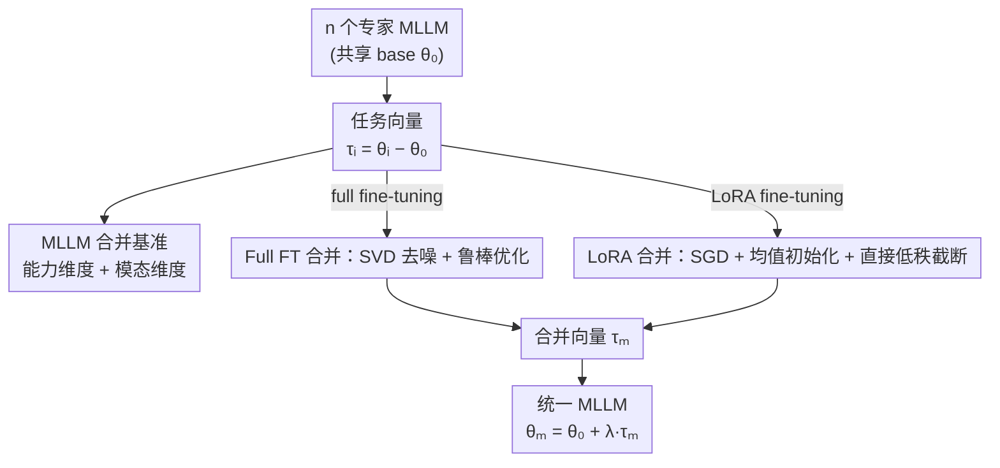

# OptMerge: Unifying Multimodal LLM Capabilities and Modalities via Model Merging

**会议**: ICLR 2026  
**OpenReview**: [https://openreview.net/forum?id=Me0n0iESJY](https://openreview.net/forum?id=Me0n0iESJY)  
**代码**: 有（论文声明 code 与 checkpoints 全部公开）  
**领域**: 多模态VLM / 模型合并  
**关键词**: 模型合并, 多模态大模型, 任务向量, 低秩去噪, Omni 模型

## 一句话总结
这篇论文为多模态大模型（MLLM）建立了第一个能力维度 + 模态维度都划分清楚的模型合并基准，并提出 OptMerge——通过 SVD 低秩去噪 + 鲁棒的任务向量优化，把多个专家 MLLM 无数据地合并成统一模型，平均涨点 2.48%，甚至能超过混合数据训练。

## 研究背景与动机
**领域现状**：基础模型训练昂贵、更新缓慢，而社区里的领域微调模型迭代飞快（Hugging Face 上每天有人放出 VQA、几何、图表、OCR 等各种专精的 checkpoint）。模型合并（model merging）想做的，就是把这些共享同一个 base 的专家模型直接在参数空间里"加"成一个多能力模型，省下重训和存储成本，还能支持去中心化的协作开发。

**现有痛点**：以往的合并研究几乎只盯着两类对象——视觉分类模型，或者代码/数学任务的纯文本 LLM。MLLM 这个最有现实需求的对象反而没有一个干净的基准：训练任务和评测任务没有清晰划分。已有的两个 MLLM 合并方法也各有硬伤——AdaMMS 一次只能合并两个模型，且要在合并时反复生成回答来挑超参（假设测试集可见、很慢）；UQ-Merge 把 LLaVA-v1.5 的每个微调数据集当成一个"任务"，没有按 MLLM 的能力维度做分类，还要靠无标签测试集算不确定性来定合并顺序。

**核心矛盾**：模型合并对"任务向量"（微调模型与 base 的参数差 $\tau_i = \theta_i - \theta_0$）极其敏感，而任务向量里同时混着冗余（不同任务重学的共享基础能力）和噪声（无关紧要的参数更新）。直接相加会放大这些干扰；而想用优化的方式去拟合一个干净的合并向量，数据无关的优化又容易不稳定、不收敛——尤其在 LoRA 这种本身就低秩的场景，合并向量会"走捷径"靠暴涨自己的范数来满足正交，最后把语言能力搞崩。

**本文目标**：(1) 给 MLLM 合并造一个能力划分清晰、还覆盖跨模态合并的基准；(2) 提出一个无数据、无需超参搜索、对 full fine-tuning 和 LoRA 都稳健的合并方法。

**切入角度**：作者先从理论上证明"微调时参数漂移的程度"才是决定合并好坏的关键——漂移小的模型虽然单任务精度略低，反而更好合并。这把"合并失败"从"算法不行"重新归因到"被合并的模型本身被过度训练"。

**核心 idea**：用 SVD 低秩近似从任务向量里剥离噪声，再在去噪后的子空间上鲁棒地优化合并向量（full FT 与 LoRA 用不同的稳定化技巧），让数据无关优化既准又稳。

## 方法详解

### 整体框架
OptMerge 接受 $n$ 个从同一 base $\theta_0$ 微调出来的专家 MLLM，先把它们各自转成任务向量 $\tau_i = \theta_i - \theta_0$，然后根据微调方式分两条支路稳健地求出一个合并向量 $\tau_m$，最后 $\theta_m = \theta_0 + \lambda \tau_m$ 得到统一模型。整套流程不需要任何训练/测试数据，只在每个线性层上逐层做轻量优化（其余层直接参数平均）。

方法建立在 WUDI Merging 的优化框架之上：把合并看成最小化合并向量与各任务向量之间"层级干扰"的数据无关优化问题
$$\min_{\tau_{m,l}} \mathcal{L}_l = \sum_{i=1}^{n} \frac{1}{\|\tau_{i,l}\|_F^2} \left\| (\tau_{m,l} - \tau_{i,l})(\tau_{i,l})^\top \right\|_F^2.$$
OptMerge 的贡献在于：先用 SVD 把任务向量去噪、再针对 full FT 和 LoRA 两种参数性质各自做稳定化，从而修掉原始优化的两个毛病——噪声放大和范数失控。

### 关键设计

**1. MLLM 合并基准：把能力和模态都切干净**

针对"没有清晰划分训练/评测任务"的痛点，作者造了第一个对 MLLM 能力做细粒度分类的合并基准。能力维度切成 VQA、Geometry、Chart、OCR、Grounding 五类，每类收集至少 100K 公开样本做监督微调（共 588K/190K/218K/238K/135K），并配上对应的专项评测集（VizWiz/GQA、MathVista/MATH-Vision、ChartQA、TextVQA/OCRVQA、RefCOCO 系列）。为覆盖"微调 base 模型"和"微调 instruct 模型"两种现实场景，分别选了 InternVL2.5-1B-Instruct（full fine-tuning）和 Qwen2-VL-7B-Base（LoRA），同时提供两种 checkpoint。模态维度则用共享 LLM（Vicuna-7B）分别接 CLIP 视觉、BEATs 音频、LanguageBind 视频编码器，研究把视觉-语言、音频-语言、视频-语言模型合并成 Omni 模型的可行性——这是一条无数据地复用各模态编码器的新路。

**2. 参数漂移理论：合并好坏取决于微调强度，而非单任务精度**

这是全文的关键洞察，也是后续方法设计的依据。作者发现一个反直觉现象：合并性能随微调步数先升后降，精度更高的专家模型并不一定合得更好。论文给出第一个解释微调如何影响合并的理论上界（Theorem 3.1）：对训练 $T$ 步、固定步长 $\eta$ 的任务 $i$，合并后的损失满足
$$\mathcal{L}_i(\Theta + \tau_m) \le C_i + O(\gamma^T) + O(\delta\,\eta T) + O(\eta^2 T^2),$$
其中 $O(\gamma^T)$ 是收敛不充分的残差，$O(\delta\,\eta T)$ 是跨任务干扰，$O(\eta^2 T^2)$ 是 L-光滑带来的曲率误差。含义是：训练早期目标任务收益占主导，但接近收敛时干扰和曲率误差（随 $\eta T$、$\eta^2 T^2$ 增长）会反噬合并质量。所以构建基准时作者刻意调小学习率、限制参数漂移（图 2 显示任务向量幅度普遍很小，微调模型与 base 处于损失景观的相邻区域、具有线性连通性）。这也解释了为什么合并 Qwen2.5-Math 和 Qwen2.5-Coder 效果差——过度后训练导致参数漂移太大。结论：选 Hugging Face 模型时应优先挑"漂移小、更适合合并"的 checkpoint。

**3. Full fine-tuning 合并：SVD 低秩近似去噪 + 去中心化优化**

直接相加任务向量会放大冗余和噪声。作者先用平均任务向量 $\bar{\tau}_l = \frac{1}{n}\sum_i \tau_{i,l}$ 把各任务向量做中心化，再对 $\tau_{i,l} - \bar{\tau}_l$ 做 SVD，用前 $k$ 个奇异分量 $U_{1:k}\Sigma_{1:k}V_{1:k}^\top$ 剥离掉藏在头尾奇异向量里的噪声。更巧的一步是：把 $\Sigma_{1:k}V_{1:k}^\top$ 代替 $\tau_{i,l}$ 当作输入子空间 $x_{i,l}$，丢掉次要的行空间信息、只聚焦列特征空间，于是优化目标变成
$$\min_{\tau_{m,l}} \mathcal{L}_l = \sum_{i=1}^{n} \frac{1}{\|\tau_{i,l}\|_F^2} \left\| (\tau_{m,l} - U_{1:k}\Sigma_{1:k}V_{1:k}^\top - \bar{\tau}_l)(\Sigma_{1:k}V_{1:k}^\top)^\top \right\|_F^2.$$
这相当于 PCA 里保留主成分：截断奇异值保住关键特征 $V_{1:k}^\top$，对 $x_{i,l}$ 给出比原始 $(\tau_{i,l})^\top$ 更准的估计，从而比 Eq.(1) 更稳健地去噪。实现里 $k$ 简单取"每个任务向量的秩 ÷ 任务数（5）"，用 Adam、学习率 1e-5 优化 300 步。

**4. LoRA 合并：用 SGD + 均值初始化 + 直接低秩截断压住范数暴涨**

LoRA 微调天然低秩，给优化带来独特麻烦：梯度只在 $\tau_{i,l}$ 非零奇异值方向有效、其余方向（零空间）几乎为零，合并向量被困住没法充分探索参数空间，于是它会"走捷径"——靠不断增大自身范数来同时对多个不同方向的任务向量满足正交（图 3）。大范数任务向量加回 base 会偏离原始分布，导致语言能力崩塌。作者用三个实用技巧压住它：(1) 用 SGD 替换 Adam，SGD 在稀疏梯度下更稳、还自带隐式正则，能约束优化、穿过零空间诱发的平坦区；(2) 对 $\tau_{i,l}$ 直接做截断 SVD（不中心化），因为 $\|\tau_{i,l}\|_F^2 = \sum_j \sigma_j^2$，截掉尾部能量 $\sum_{j>k}\sigma_j^2$ 自然降低范数；(3) 用任务向量的均值初始化合并向量，从源头缓解范数过大。图 4 显示这套组合让合并向量的范数在整个优化过程中保持平稳，同时损失照样收敛。LoRA 场景用 SGD、学习率 1e-4 优化 300 步。

### 损失函数 / 训练策略
全程数据无关，只在模型的线性层上逐层最小化上面的干扰损失，其余层直接参数平均。合并系数 $\lambda$ 在 $\{0.1, 0.3, 0.5, 0.7, 1.0, 1.5\}$ 中搜索；优化 300 步。InternVL 用 Adam(1e-5)，QwenVL 用 SGD(1e-4)。整体在 8×V100 上完成。

## 实验关键数据

### 主实验
能力合并（InternVL2.5 full FT 与 Qwen2-VL LoRA），平均分对比：

| 方法 | InternVL2.5 Avg. | Qwen2-VL Avg. |
|------|------|------|
| Weight Average | 49.12 | 60.55 |
| Task Arithmetic | 56.18 | 60.29 |
| TIES Merging | 56.70 | 61.24 |
| TSV Merging | 54.37 | 60.63 |
| Iso-C | 54.78 | 26.69（LoRA 上崩） |
| WUDI Merging | 57.00 | 58.65 |
| **OptMerge (Ours)** | **57.44** | **63.30** |
| Mixture Training / Instruct（上界参考） | 57.66 | 62.23 |

关键看点：在 Qwen2-VL（LoRA）上 OptMerge 达 63.30，不仅碾压所有合并基线，还超过了 Qwen2-VL-Instruct（62.23），即合并居然胜过混合数据训练；在多个任务上合并模型甚至超过各自的专家模型（如 Geometry 40.79 vs 专家 28.95）。

模态合并（视觉/音频/视频 → Omni，Vicuna-7B）：

| 方法 | MUSIC-AVQA | AVQA | Avg. |
|------|------|------|------|
| 单模态最优 | 50.77 | 79.20 | 64.11 |
| Task Arithmetic | 52.14 | 78.62 | 65.38 |
| **OptMerge (Ours)** | 52.77 | 80.82 | **67.00** |
| NaiveMC（在线组合）| 53.50 | 80.26 | 66.88 |
| DAMC（在线组合）| 52.80 | 80.78 | 66.79 |

合并三模态显著优于单模态（多模态互补），且最优合并方法甚至超过需要 3× 存储的在线组合方法 NaiveMC/DAMC。

### 消融实验
在 Qwen2-VL（LoRA）和 Vicuna-7B（模态）上，从 WUDI Merging 起逐项叠加：

| 配置 | Qwen2-VL | Vicuna-7B |
|------|---------|-----------|
| WUDI Merging | 58.65 | 64.65 |
| + SGD | 48.88 (−9.77%) | 66.91 (+2.26%) |
| + 均值初始化 | 63.08 (+4.43%) | 67.07 (+2.42%) |
| + 低秩近似 | 63.30 (+4.65%) | 67.00 (+2.35%) |

### 关键发现
- **SGD 单独用反而掉点**（Qwen2-VL −9.77%），但配合均值初始化后猛涨 +4.43%——说明压住范数暴涨的关键是"初始化 + 稳定优化器"协同，单独换优化器不够。
- **不同合并方法行为差异大**：线性插值鲁棒但平庸；TIES 难控稀疏度常不如 Task Arithmetic；Iso-C 在 LoRA（本就低秩）上会进一步压低 Frobenius 范数造成不稳定而崩盘；TSV 在模态合并里靠正交化化解模态冲突表现好、但多任务里普通。OptMerge 在各场景都稳定最优。
- **效率碾压混合训练**：InternVL2.5-1B 合并仅 0.22h / 2.62GB，混合训练要 25.38h / 240GB；Qwen2-VL-7B 合并 3.78h / 21.97GB vs 24.56h / 256GB。
- **真实社区 checkpoint 也成立**：直接合并 Hugging Face 上的 GRPO/Pokemon/olmOCR/EraX-VL 四个真实微调模型，OptMerge 平均 66.70，明显超过各单模型和 Qwen2-VL-Instruct（62.23）。

## 亮点与洞察
- **把"合并失败"重新归因**：Theorem 3.1 第一次从理论上说明合并好坏由微调时的参数漂移（学习率×步数）决定，而非算法本身——这给"该选什么模型来合并"提供了可操作的判据（挑漂移小的），是很有迁移价值的认知。
- **诊断出 LoRA 合并的"范数走捷径"病灶并对症下药**：图 3 把问题可视化成"靠增大范数满足正交→偏离分布→语言崩塌"，再用 SGD 隐式正则 + 截断 SVD 降范数 + 均值初始化三连击压住，逻辑闭环很漂亮。
- **用 $\Sigma_{1:k}V_{1:k}^\top$ 当输入子空间**：丢掉行空间只保列特征，相当于 PCA 主成分去噪，比直接用 $\tau_i^\top$ 给出更准的数据子空间估计——一个很巧的代换。
- **无数据合并 > 混合训练**这一发现本身很反直觉，且对 Omni 模型构建（无数据复用各模态编码器）指了一条可扩展的路。

## 局限与展望
- 方法建立在"微调模型参数漂移小、与 base 线性连通"的假设上；对过度后训练、漂移大的模型（如 Math+Coder）合并效果差，适用范围受限。
- 只优化线性层、其余层简单平均，对非线性层的潜在冲突没有处理。
- $\lambda$ 仍需在固定网格里搜索，虽然不需数据但并非完全免调参；秩比 $k$ 取"秩÷任务数"较为启发式。
- 模态合并实验仅覆盖视觉/音频/视频三模态、共享 Vicuna-7B，更大规模 Omni 与更多模态的可扩展性待验证。

## 相关工作与启发
- **vs AdaMMS**: 它一次只能合两个模型、且要在合并时反复生成回答挑超参（假设测试集可见、慢）；本文无数据、无需超参搜索，可一次合并多个 MLLM。
- **vs UQ-Merge**: 它把每个微调数据集当独立任务、不按能力分类，还需无标签测试集算不确定性定合并顺序；本文给出清晰的能力/模态划分基准，且方法完全数据无关。
- **vs WUDI Merging**: 本文直接站在它的数据无关优化框架（Eq.1）上，增加 SVD 去噪（Eq.3）和 LoRA 专属稳定化技巧，修掉了它的噪声放大和范数失控问题，full FT 上平均 +0.44%~1.9%、LoRA 上从 58.65 提到 63.30。
- **vs DAMC/NaiveMC（在线组合）**: 它们推理时动态合并各模态激活、需 3× 存储；本文静态合并成单模型、存储更省，且效果还更好。

## 评分
- 新颖性: ⭐⭐⭐⭐ 首个能力+模态双维度的 MLLM 合并基准 + 参数漂移理论 + 对 LoRA 范数问题的针对性解法，组合扎实。
- 实验充分度: ⭐⭐⭐⭐⭐ 覆盖 full FT/LoRA、能力/模态、真实社区 checkpoint、效率对比，10 个基线全面对照。
- 写作质量: ⭐⭐⭐⭐ 理论与方法动机讲得清楚，图 3/4 可视化到位；符号略密集。
- 价值: ⭐⭐⭐⭐⭐ 无数据合并超过混合训练这一结论 + 基准开放，对社区构建 MLLM/Omni 模型很有实操价值。

<!-- RELATED:START -->

## 相关论文

- [\[ICLR 2026\] VisCodex: Unified Multimodal Code Generation via Merging Vision and Coding Models](viscodex_unified_multimodal_code_generation_via_merging_vision_and_coding_models.md)
- [\[NeurIPS 2025\] RobustMerge: Parameter-Efficient Model Merging for MLLMs with Direction Robustness](../../NeurIPS2025/multimodal_vlm/robustmerge_parameter-efficient_model_merging_for_mllms_with_direction_robustnes.md)
- [\[ICLR 2026\] DualToken: Towards Unifying Visual Understanding and Generation with Dual Visual Vocabularies](dualtoken_towards_unifying_visual_understanding_and_generation_with_dual_visual_.md)
- [\[ACL 2025\] Transferring Textual Preferences to Vision-Language Understanding through Model Merging](../../ACL2025/multimodal_vlm/transferring_textual_preferences_to_vision-language_understanding_through_model_.md)
- [\[ICLR 2026\] WAVE: Learning Unified & Versatile Audio-Visual Embeddings with Multimodal LLM](wave_learning_unified_versatile_audio-visual_embeddings_with_multimodal_llm.md)

<!-- RELATED:END -->
