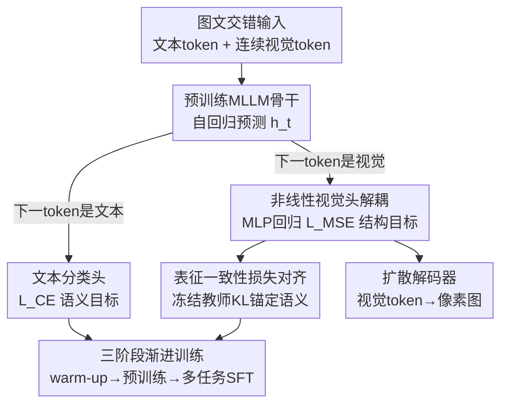

# ORION: Decoupling and Alignment for Unified Autoregressive Understanding and Generation

**会议**: ICLR 2026  
**OpenReview**: [https://openreview.net/forum?id=PP7j0xvvUB](https://openreview.net/forum?id=PP7j0xvvUB)  
**代码**: 待确认（作者声明将开源全部代码/数据/模型）  
**领域**: 多模态VLM / 统一理解与生成  
**关键词**: 统一多模态大模型, 自回归, 语义-结构冲突, 表征对齐, 知识蒸馏

## 一句话总结
ORION 指出"单体自回归"统一多模态大模型在同时学理解与生成时存在**语义-结构表征冲突**（理解要语义可分、生成要低层可重建，二者在共享表征里互相拉扯），用一个**非线性视觉头解耦** + 一个**表征一致性蒸馏损失对齐**，再配三阶段渐进训练，让纯单体自回归骨干在不加任何任务专用参数的情况下，理解与生成都打平甚至超过更复杂的统一模型。

## 研究背景与动机
**领域现状**：把"理解"和"生成"统一进一个多模态大模型是当前热点，主流有三条架构路线：级联式（MLLM 当文本编码器去喂扩散模型）、并行式（理解/生成各用一套独立参数、只共享注意力）、以及**单体自回归式**（把图像当成另一种"语言"，用同一套参数、同一个自回归目标交错预测图文 token）。单体路线最优雅，天然支持图文交错的多轮对话，但 Emu、Chameleon 等早期工作性能一直不够好。

**现有痛点**：当把一个预训练好的强 MLLM 拿来做生成微调（给视觉 token 加一个回归损失）时，模型原本的理解能力会发生**灾难性遗忘**。作者用实验证据点明：朴素全参微调后，模型对视觉 token 的分类预测从"有意义的文本语义"（如 fur/ear/dog）塌缩成乱码分布，发生严重语义漂移。

**核心矛盾**：根因是共享表征空间里的一场"拔河"。理解任务由交叉熵驱动，追求**语义保真**，要求隐表征在语义空间高度可分以便分类；生成任务由 MSE 驱动，追求**结构可重建**，要求隐表征包含足够低层信息以在连续嵌入空间精确还原坐标。这两个目标方向冲突——同一份 $h_t$ 被两股力量同时拉扯。

**本文目标**：在不引入任务专用独立参数的前提下，让单体自回归模型既保住理解又学会生成。

**切入角度**：与其在共享表征上硬调和，不如**把结构压力从共享表征上引开（解耦）**，同时**显式把生成时的语义拉回到预训练轨迹上（对齐）**。

**核心 idea**：用"解耦 + 对齐"（Decoupling and Alignment）化解冲突——非线性视觉头吸收 MSE 的"语义盲"梯度，表征一致性损失用冻结教师锚定语义。

## 方法详解

### 整体框架
ORION 建立在预训练自回归 MLLM（Qwen2.5-VL 7B）之上，输入是任意交错的图文序列：文本经 tokenizer 变成文本 token，图像经视觉编码器变成连续视觉 token，Transformer 解码器自回归地基于前文预测下一个 token。关键在于它挂了**两个头**：当下一个 token 是文本时走**文本分类头**、用交叉熵 $L_{CE}$ 监督（语义目标）；当下一个 token 是视觉 token 时走**视觉回归头**、用 MSE $L_{MSE}$ 直接回归其嵌入向量（结构目标）。生成的视觉 token 序列再喂给一个单独预训练的扩散解码器渲染成像素图。

为化解两个头在共享表征上的冲突，ORION 在**架构层**和**损失层**各加一处干预：把视觉头从线性换成非线性 MLP（解耦），并加一个表征一致性蒸馏损失 $L_{KL}$（对齐），最后用三阶段渐进训练把这套组合稳稳灌进预训练骨干。

### 关键设计

**1. 非线性视觉头：把"语义盲"的 MSE 压力从共享表征上引开**

针对的痛点是：Emu、Nexus-Gen 等用**线性**视觉头，相当于在隐表征 $h_t$ 和视觉 token 之间放了一个表征瓶颈，MSE 梯度会把"只关心低层重建、不关心语义"的压力**直接**灌回共享的 LLM 表征，把语义空间搅乱。ORION 的做法是把线性层换成**单隐层 MLP** 作为非线性结构解码器。作者的灵感来自文本预测路径本身——从隐状态到最终 token 的 `hidden → logits(升维) → softmax → embedding lookup(降维)` 其实就是一个隐式 MLP 回归，所以视觉侧也该用 MLP 而非线性层。这个 MLP 像一个 key-value memory，专门负责把高层语义 $h_j$ 翻译成低层视觉向量 $f(h_j)$，回归损失为 $L_{MSE} = \frac{1}{N_{vision}} \sum \lVert f(h_j) - v_{j+1} \rVert_2^2$。它的效果是**放松了对 $h_t$ 的约束**：MLLM 不再被迫维持一个"线性可解码"的语义空间，只需输出足够信息让 MLP 去生成下一个视觉 token 即可，结构压力被 MLP 吸收，理解能力的下滑因此大幅缓解。

**2. 表征一致性损失：在没有语义监督的视觉位置，用冻结教师把语义拉回来**

光解耦还不够——在预测视觉 token 的那些位置上，模型**完全没有**来自交叉熵的语义监督，很容易一路漂走。这个设计的核心思想是：模型回归一个视觉 token 时，必须**同时还能理解**该视觉 token 对应的文本语义。实现上用知识蒸馏，把**冻结的原始基座模型当教师**：在每个视觉 token 位置 $j$，强制学生模型文本分类头给出的分布 $p_{student}(w|h_j)$ 与教师分布 $p_{teacher}(w|h_j)$ 保持一致，用 KL 散度度量，$L_{KL} = \frac{1}{N_{vision}} \sum_{j} D_{KL}(p_{teacher}(w|h_j) \,\Vert\, p_{student}(w|h_j))$。这一项相当于一个强力的"语义锚"，保证模型在追求结构可重建的同时，表征不偏离有意义的语义轨迹，从而把两个冲突目标对齐。总损失为 $L_{total} = L_{CE} + \lambda_{MSE} L_{MSE} + \lambda_{KL} L_{KL}$，实测加上 $L_{KL}$（消融 F→G）理解和生成**同时**涨点，是冲突被真正调和的直接证据。

**3. 三阶段渐进训练：把生成能力平滑注入、最大限度保住预训练语义**

直接全参微调（消融第一行）会让理解和生成都很差，所以 ORION 用精心设计的三阶段配方把生成"温柔地"灌进去。**Stage 1 视觉头预热**：冻结整个 MLLM 骨干，只训新加的 MLP 视觉头，目标只有 $L_{MSE}$，用 2000 万张较低质量但多样的文生图数据把 MLP 充分预热出基本的结构预测能力——作者发现这步对后续性能至关重要。**Stage 2 全参预训练**：解冻全部参数，用偏重理解任务的数据混合（350 万理解 + 500 万文生图）适配新组件、同时强力锚定原有语义。**Stage 3 多任务 SFT**：在 Stage 2 基础上引入 120 万图像编辑数据，混合理解/生成/编辑全部数据类型，统一地平衡并增强所有能力。损失权重 CE:MSE:KL 从 Stage 1 的 `0:1:0` 切到后两阶段的 `1:1:0.01`，体现了"先把头练熟、再开全局对齐"的节奏。

### 损失函数 / 训练策略
- 三个损失加权求和：$L_{total} = L_{CE} + \lambda_{MSE} L_{MSE} + \lambda_{KL} L_{KL}$，Stage 2/3 取 CE:MSE:KL = 1:1:0.01。
- 骨干 Qwen2.5-VL 7B + Nexus-Gen 扩散解码器；生成时图像表示为 81 个视觉 token，理解保留原生多分辨率输入。
- DeepSpeed ZeRO-3 训练；跳过异常梯度步、用 sequence packing 提升 GPU 吞吐。优化器 AdamW（$\beta_1=0.9, \beta_2=0.95$）。

## 实验关键数据

### 主实验
文生图在 GenEval 上（带 LLM rewriter），理解在 5 个综合 benchmark 上：

| 任务 | 数据集/指标 | ORION | 同类单体最强 | 参照 |
|------|------|------|----------|------|
| 生成 | GenEval Overall | 0.82 | Janus-Pro 0.80 / Show-o2 0.76 / Emu3 0.66 | FLUX.1-dev 0.82、BAGEL 0.88 |
| 理解 | MMBench | 83.7 | Show-o2 79.3 / Janus-Pro 79.2 / Emu3 58.5 | 基座 Qwen2.5-VL 79.1 |
| 理解 | MMStar | 64.2 | — | Qwen2.5-VL 63.9 |
| 理解 | MMVet | 64.5 | Janus-Pro 50.0 | Qwen2.5-VL 67.1 |
| 理解 | SEED | 78.1 | Janus-Pro 72.1 | Qwen2.5-VL 79.5 |
| 理解 | RealWorldQA | 67.4 | Emu3 57.4 | Qwen2.5-VL 68.5 |

ORION 在单体路线里全面领先（GenEval 0.82 刷新单体最好成绩，MMBench 83.7 甚至略高于基座的 79.1），生成对标 FLUX.1-dev、理解几乎守住基座水平，对比 BAGEL 等并行/级联复杂架构也很有竞争力，且不用任何可分离参数。

### 消融实验

| 配置 | 视觉头 | $L_{KL}$ | Stage1 数据 | MMB | MMStar | GenEval |
|------|--------|--------|------|------|--------|---------|
| A | Linear | ✗ | 5M | 71.6 | 54.3 | 0.62 |
| C | Q-Former | ✗ | 5M | 77.3 | 60.7 | 0.75 |
| E | MLP | ✗ | None | 74.1 | 57.5 | 0.73 |
| E' | MLP | ✗ | 5M | 76.4 | 59.3 | 0.76 |
| F | MLP | ✗ | 20M | 79.8 | 61.0 | 0.79 |
| G (Full) | MLP | ✓ | 20M | 83.7 | 63.2 | 0.82 |

### 关键发现
- **视觉头架构 + 预热规模**：5M 数据时 Q-Former（C: MMB 77.3）略胜 MLP（E': 76.4），但 Stage 1 扩到 20M 后 MLP（F: 79.8）反超 Q-Former（D: 78.6）且全指标领先——MLP 样本效率初期稍弱但**scaling 与泛化更好**。预热数据从 None→5M→20M（E→E'→F）单调涨点，印证"充分预热视觉头是解锁单体框架的关键"。
- **$L_{KL}$ 贡献最大**：F→G 仅加表征一致性损失，MMBench +3.9、MMStar +2.2、GenEval +3.0，理解与生成**同时**提升，直接证明它真的把两个冲突目标对齐了，而不是牺牲一方换另一方。
- **涌现能力**：统一表征带来零样本图文交错对话（生成一张图后立刻回答关于它的问题）、跨语言生成（只训英文却能用中文/日文 prompt 生成）、上下文多图编辑等训练数据里没出现过的能力。

## 亮点与洞察
- **把"灾难性遗忘"重新诊断为表征层面的"语义-结构拔河"**，并给出可视化证据（视觉 token 的分类预测塌缩成乱码），这个问题定义本身比解法更有启发性。
- **MLP 视觉头的洞察很巧**：把"文本预测路径其实是隐式 MLP 回归"这一观察迁移到视觉侧，论证为何视觉头也该非线性——用 key-value memory 当结构解码器，把语义盲的 MSE 压力从共享表征上"卸载"。
- **用冻结的自己当教师做蒸馏**，几乎零额外标注成本就构造出强语义锚，这个"自蒸馏防漂移"的思路可迁移到任何"在预训练模型上加新目标、怕遗忘"的场景（如给 LLM 加新模态/新损失）。
- 全程不加任务专用参数，证明单体自回归是"简单、有效、有竞争力"的统一路线，对抗了"必须并行解耦参数"的主流叙事。

## 局限与展望
- 作者承认仍处于"对标"而非"全面超越"——GenEval 0.82 仍落后 BAGEL 0.88、Mogao 0.89 等并行/复杂架构，单体路线的上限还未触顶。
- 理解指标虽守住基座，但 MMVet（64.5 vs 67.1）、SEED（78.1 vs 79.5）等仍略有掉点，说明遗忘只是"缓解"而非"消除"。
- 生成分辨率受限（视觉 token 仅 81 个、生成长边 252），高分辨率/精细细节生成是明显短板；扩散解码器是外挂的预训练模块，并非真正端到端。
- $\lambda_{KL}=0.01$ 这类权重的敏感性、教师模型选择对对齐效果的影响，文中未做系统扫描，值得进一步探究。

## 相关工作与启发
- **vs 级联架构（OmniGen2 / UniWorld）**: 它们把 MLLM 当文本编码器去喂扩散模型，无法理解自己的视觉输出、不支持图文交错多轮对话；ORION 用单体自回归天然支持，且零样本涌现交错对话能力。
- **vs 并行架构（BAGEL / Mogao）**: 它们给理解/生成用部分独立参数、只共享注意力，训练成本高、扩展难；ORION 全程共享一套参数，更省、更优雅，代价是生成上限暂时略低。
- **vs 离散 token 单体（Chameleon / Emu3 / X-Omni）**: VQ-VAE 离散 token 偏重低层纹理、损害理解；ORION 用**连续**视觉 token 最大化保留多模态理解，这是它理解远超 Chameleon（MMB 83.7 vs 35.7）的根因。
- **vs 并行 query 回归（MetaQuery / Seed-X）**: 用固定 query token 并行回归图像会造成"生成用代理 token、理解用真实 token"的表征不匹配，无法理解自己的输出；ORION 坚持逐 token 串行自回归，保证表征一致性。

## 评分
- 新颖性: ⭐⭐⭐⭐⭐ 首次把统一自回归的遗忘问题定义为"语义-结构表征冲突"，解耦+对齐的组合拳清晰有力。
- 实验充分度: ⭐⭐⭐⭐ 主实验覆盖生成+5 个理解 benchmark、消融把视觉头与 $L_{KL}$ 拆得很干净，但缺高分辨率/超参敏感性分析。
- 写作质量: ⭐⭐⭐⭐ 问题诊断与方法动机叙述清楚、图示到位，个别表格存在排版/笔误。
- 价值: ⭐⭐⭐⭐⭐ 为单体自回归统一模型正名，自蒸馏防遗忘的思路可广泛迁移，且承诺全开源。

<!-- RELATED:START -->

## 相关论文

- [\[ICLR 2026\] UniF2ace: A Unified Fine-grained Face Understanding and Generation Model](unif2ace_a_underlineunified_underlinefine-grained_underlineface_understanding_an.md)
- [\[ICLR 2026\] Thinking with Camera: A Unified Multimodal Model for Camera-Centric Understanding and Generation](thinking_with_camera_a_unified_multimodal_model_for_camera-centric_understanding.md)
- [\[ICLR 2026\] Omni-Weather: A Unified Multimodal Model for Weather Radar Understanding and Generation](omni-weather_a_unified_multimodal_model_for_weather_radar_understanding_and_gene.md)
- [\[ICLR 2026\] Lavida-O: Elastic Large Masked Diffusion Models for Unified Multimodal Understanding and Generation](lavida-o_elastic_large_masked_diffusion_models_for_unified_multimodal_understand.md)
- [\[CVPR 2026\] UVU: Improving Multimodal Understanding via Vision-Language Unified Autoregressive Paradigm](../../CVPR2026/multimodal_vlm/uvu_improving_multimodal_understanding_via_vision-language_unified_autoregressiv.md)

<!-- RELATED:END -->
