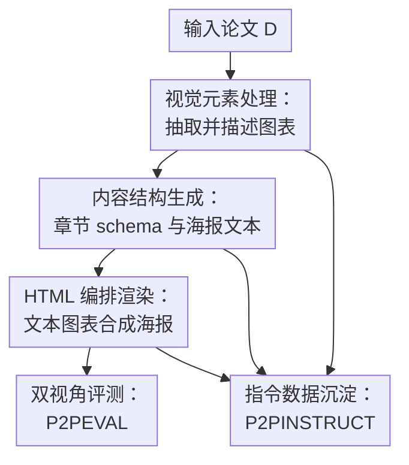

# P2P: Automated Paper-to-Poster Generation and Fine-Grained Benchmark

**会议**: ICLR 2026  
**OpenReview**: [https://openreview.net/forum?id=JojyT9niJL](https://openreview.net/forum?id=JojyT9niJL)  
**代码**: https://github.com/multimodal-art-projection/P2P  
**领域**: 多模态VLM  
**关键词**: 学术海报生成, 多智能体, 文档理解, 细粒度评测, 指令数据集

## 一句话总结
P2P 把论文到学术海报的生成拆成图表理解、内容组织和 HTML 版式编排三个带自检回路的智能体，并配套提出 P2PINSTRUCT 指令数据集与 P2PEVAL 双视角基准，用客观内容保真和主观整体质量同时评估生成海报。

## 研究背景与动机
**领域现状**：学术海报是会议交流里很重要的压缩媒介，需要把一篇长论文浓缩成若干视觉上可扫描的区域，同时保留标题、动机、方法、结果、图表和核心结论。过去自动生成海报的工作多偏模板、规则或子任务建模，例如先抽内容、再预测 panel 属性、再做布局；近期 LLM/MLLM 虽然能读长文档、写 HTML、理解图文关系，但直接让一个模型从论文生成海报仍然很不稳定。

**现有痛点**：海报生成不是普通摘要任务。它一方面要忠实保留论文里的可验证事实，不能把指标、图表含义和核心 claim 讲错；另一方面又要做二维空间设计，决定哪些内容突出、哪些图放大、文字和留白如何平衡。现有方法经常在两头失守：要么语义信息被模板压扁，要么视觉布局看似漂亮但丢掉科学细节。

**核心矛盾**：根本矛盾在于“科学保真”和“视觉表达”没有同一种评测语言。ROUGE/BERTScore 只能粗看文本重合，通用 VLM judge 又容易把审美偏好和事实正确混在一起；如果没有细粒度 checklist，就很难知道一个海报到底漏了哪张关键图、哪条实验结论或哪个方法步骤。

**本文目标**：作者希望同时解决三个子问题：第一，给出一个可替换底座模型的 paper-to-poster 生成 pipeline；第二，构建能训练这种任务的 instruction 数据；第三，建立能区分客观保真与主观质量的评测基准，让不同模型和系统可以被系统比较。

**切入角度**：论文的观察是，人类做海报通常不是一次性生成，而是先读论文、挑图表、重组章节、摆版，然后不断检查和修改。因此作者把任务拆成多个专业智能体，并在每个阶段加 checker-reflection，让模型先产出中间结果，再由对应检查器发现重复图表、内容遗漏、引用错误或布局问题。

**核心 idea**：用“多智能体生成 + 阶段性检查反思 + 双视角基准”替代单次端到端生成，把论文海报生成从一个黑盒创作任务变成可分解、可训练、可评测的多模态文档转换任务。

## 方法详解
### 整体框架
P2P 的输入是一篇研究论文 $D$，输出是一个由 HTML/CSS 渲染的学术海报 $P$。整体流程先由 Figure Agent 从论文里抽取并描述图表，得到视觉元素集合 $F$；再由 Section Agent 根据论文和图表描述生成海报文本与结构；最后 Orchestrate Agent 把文字和真实图表组装成网页原生海报，并通过 checker-reflection 对每个阶段做迭代修正。

论文把整个过程形式化为 $P = A_{Orch}(A_{Sec}(D, F), F)$，其中 $F = A_{Fig}(D)$。这个公式的重点不是复杂数学，而是说明最终海报并非直接从论文一次生成，而是显式依赖“图表理解”和“内容结构化”两个中间产物；这也解释了为什么 P2P 可以进一步收集中间输入输出，构造 P2PINSTRUCT 指令数据集。

### 关键设计
**1. 视觉元素处理：先把图表变成可被语言模型可靠使用的语义单元**

学术海报的视觉质量很大程度取决于图表选择和图文对齐，但论文 PDF 里的图、表、caption 并不是天然结构化的。P2P 的 Figure Agent 用 DocLayout-YOLO 抽取图表区域，再通过空间关系分析找到对应 caption，并让 MLLM 为每个视觉元素生成描述，形成 $F_d = \{(v_i, c_i, desc_i)\}_{i=1}^n$。这里 $v_i$ 是裁剪后的图表及其元数据，$c_i$ 是原 caption，$desc_i$ 是模型生成的图表语义说明。

这个设计解决的是“模型看见图但不知道该怎么用”的问题。直接把原图丢给后续 LLM/MLLM，很容易出现图表重复、caption 错配或图像含义解释不充分；把图表先转成带 caption 和描述的语义单元后，Section Agent 在写海报内容时可以引用明确的图表索引，并把文字论述放在合适的视觉元素旁边。Figure Checker 会检查是否重复抽取、是否漏掉重要视觉元素，以及图表和 caption 是否配对正确；如果数量或匹配关系不对，还会降低检测阈值继续尝试，从而把早期 PDF 解析错误挡在后面之前。

**2. 内容结构生成：动态推断海报 schema，而不是把所有论文塞进固定模板**

不同论文的海报重点不同：方法论文可能需要突出 pipeline，benchmark 论文需要突出数据构成和指标，应用论文则可能更看重任务设置和案例。P2P 的 Section Agent 先读论文 $D$，动态生成一个 JSON 风格的结构 schema $S$，描述目标海报有哪些 section、每个 section 应覆盖什么内容，再由 Content Generator 根据 $D$、$S$ 和图表描述 $F_d$ 生成海报文本 $P_{poster\_text} = M_{text}(D, S, F_d)$。

这个环节的关键不是简单摘要，而是把线性论文重组为二维海报的信息架构。模型需要决定哪些贡献应该成为单独 panel，哪些实验数据应该和图表放在一起，哪些细节可以被压缩。Section Checker 则从四个角度检查生成结果：逻辑连贯性、核心贡献覆盖度、对原论文发现的忠实性，以及视觉元素引用是否正确相关。如果检查失败，系统会让 Section Agent 修改章节结构或内容，避免最终海报只是“看起来像摘要”，却没有正确表达论文的研究重点。

**3. HTML 编排渲染：用网页原生格式把内容语义和视觉布局分开处理**

Orchestrate Agent 接收海报文本和真实图表后，生成 HTML/CSS 形式的最终海报。作者选择 HTML 不是偶然的：HTML 允许用模块化 CSS 解耦内容语义和表现层，可以通过 flexbox 做自适应列布局，也更适合 LLM 生成和浏览器渲染。论文还强调三条编排原则：语义与展示解耦、颜色方案与机构或会议身份对齐、响应式且均衡的布局生成。

Poster Checker 负责检查渲染后的海报是否存在留白不均、元素错位、结构破碎等问题，并触发反思修改。一个细节是，P2P 在最终嵌入视觉元素时会省略原 caption，以提升海报视觉清爽度；caption 的信息已经在前面的图表描述和文字生成中被消化，最终布局更像人类设计海报时的“重表达”，而不是简单把论文图表原样搬运。

**4. 双视角评测：把可验证事实和整体审美拆开打分**

P2PEVAL 的核心判断是：海报好不好不能只问一个总分。作者把评测拆成 Fine-Grained Evaluation 和 Universal Evaluation。前者关注客观保真，用人工编写的 paper-specific checklist 逐项验证生成海报是否保留了官方海报里的关键视觉元素、方法细节、实验结论和研究重点；后者关注主观整体质量，用 10 个通用准则衡量标题作者准确性、图像质量、留白、语境相关性、图文比例、尺寸、视觉一致性、内容保真、信息流和自洽解释。

Fine-Grained 分数定义为 $S_{fine} = \frac{\sum_{i=1}^{n}s_i}{\sum_{i=1}^{n}M_i} \times 100$，其中 $M_i$ 是第 $i$ 个 checklist item 的最高分，$s_i$ 是模型海报在该项上得到的分数。这个公式让“漏掉一个核心结论”和“漏掉一个次要装饰元素”的损失不同。Universal Evaluation 则先让 LLM 为 10 个通用维度打 0 到 5 分，再用基于 1701 个人类评分训练的 XGBoost 拟合最终整体分数，报告的 $R^2$ 达到 0.92。这样做比让 LLM 直接给总分更可解释，也更接近人类在多个审美与内容标准之间做非线性权衡的过程。

**5. 指令数据沉淀：把多阶段中间产物转成可训练资源**

P2PINSTRUCT 来自 P2P 生成流程的中间结果，共包含 30,460 个高质量 instruction-response pairs。视觉元素处理部分产生 16,848 个图表描述样例，平均每个视觉元素约 192 tokens；文本内容生成部分来自 Section Generator、Content Generator 和 HTML Generator，共 13,612 个样例，响应平均超过 3,300 tokens。

这套数据的意义在于，它不是只教模型“写一段海报文案”，而是覆盖了从图表描述、结构生成、内容组织到 HTML 组装的完整 workflow。实验中微调后的 Qwen3-P2P、Qwen2.5-VL-P2P、InternVL3-P2P 均有明显提升，说明 P2P 不只是一个在线推理框架，也能反过来为端到端或半端到端模型提供训练信号。

### 一个完整示例
假设输入是一篇方法论文，PDF 里有 8 张图和 3 张表。Figure Agent 先用布局检测从页面中裁剪出候选图表，再根据 caption 位置把“Figure 1: Framework of ...”和对应图像配成一组；如果检测到 8 个 caption 但只抽到 6 个图，它会降低阈值重新检测，直到重要视觉元素基本对齐。随后 MLLM 为每个图表写出描述，例如“图 1 展示三阶段 pipeline，左侧为输入，中央为模型结构，右侧为指标对比”。

Section Agent 拿到这些图表描述后，不会机械照搬论文目录，而是生成海报 schema：左上角放问题背景，中间大 panel 放方法框架，右侧放主结果和消融，底部放结论与资源。Content Generator 写每个区域的短文本，并在方法段落里插入对图 1 的引用，在结果段落里引用最能说明提升的表格。Section Checker 如果发现主贡献没有覆盖或引用了无关图表，就要求重新组织文本。

最后 Orchestrate Agent 把文本、图表和颜色/布局规则合成 HTML/CSS。Poster Checker 会查看是否存在某列过长、大片空白、图片比例失真或元素错位；如果右侧实验列比其他列高很多，就通过反思修改列宽、压缩文字或重新分配 panel。最终输出的不是一张静态截图，而是可由浏览器渲染的 HTML 海报，便于进一步转成 PDF 或展示页面。

### 损失函数 / 训练策略
P2P 主框架本身是模型无关的编排 pipeline，不依赖一个端到端训练损失；它可以调用 Claude、GPT、Qwen、InternVL、DeepSeek 等不同底座模型。训练相关的部分主要来自 P2PINSTRUCT：作者用 P2P 中间产物构造指令数据，并在 Qwen3-8B、Qwen2.5-VL-8B、InternVL3-8B 等模型上做微调，得到 Qwen3-P2P、Qwen2.5-VL-P2P 和 InternVL3-P2P。

评测侧的“训练策略”体现在 Universal Evaluation 的 XGBoost 拟合：先让 LLM 对 10 个维度各打 0 到 5 分，再用 1701 条人类整体评分作为监督信号训练 200 棵树，并做 10 折交叉验证。这个模型学习的是人类如何把多个局部维度合成一个整体审美分数，而不是学习生成海报本身。

## 实验关键数据
### 主实验
论文在 P2PEVAL 上比较了 35 个模型/系统，包括闭源模型、开源模型、推理模式模型、视觉语言模型和用 P2PINSTRUCT 微调后的模型。P2P 用 Claude-3.7-Sonnet 作为主配置时，在 FineGrain 和 Universal 上表现最强之一，同时 human preference 也显示它相对 YuanBao 和原作者海报具有竞争力。

| 模型/系统 | ROUGE-1 | Judge 偏好率 | FineGrain | Universal | 说明 |
|--------|------|------|------|------|------|
| Claude-3.7-Sonnet / P2P | 0.2745 | 0.5537 | 65.3962 | 37.2474 | 主配置，整体最强之一 |
| Claude-3.7-SonnetR / P2P | 0.2734 | 0.6281 | 65.8848 | 35.5062 | 推理/反思模式，FineGrain 更高 |
| GPT-4.1-2025-04-14 | 0.2459 | 0.4793 | 60.2879 | 34.4700 | 闭源强基线 |
| Deepseek-R1RT | 0.1927 | 0.5333 | 62.5013 | 33.9701 | 开源/推理模式有竞争力，图表描述由 Claude 提供 |
| Qwen3-P2P-8B | 0.2882 | 0.4587 | 57.6622 | 32.4996 | P2PINSTRUCT 微调后 ROUGE 最高 |

| 比较 | Preferred or Tied | Strictly Preferred | 结论 |
|------|------|------|------|
| P2P / YuanBao | 83.05% | 54.35% | 人类更常认为 P2P 至少不差，且过半严格胜出 |
| P2P / Original | 57.63% | 35.59% | P2P 对原作者海报已有竞争力 |
| YuanBao / Original | 20.34% | 12.40% | 通用应用生成海报离人工海报仍有明显差距 |

### 消融实验
| 配置 | FineGrain | Universal | 说明 |
|------|---------|------|------|
| Multi Agent + Figure Describer + Reflection | 65.3962 | 37.2474 | 完整系统 |
| Multi Agent + Figure Describer，去掉 Reflection | 64.4556 | 34.2229 | 保真小降，整体审美掉得更明显 |
| Multi Agent + Reflection，去掉 Figure Describer | 63.7388 | 35.1107 | 图表语义描述缺失会影响内容组织 |
| 只保留 Multi Agent | 63.5806 | 33.1458 | 模块化仍有帮助，但缺少图表语义和反思 |
| 单次直接生成 | 60.7233 | 34.2554 | FineGrain 掉点最大，说明中间处理能保护事实细节 |

| 输出格式 | FineGrain | Universal | 说明 |
|------|------|------|------|
| HTML | 65.3962 | 37.2474 | 最优，LLM 更擅长生成且浏览器渲染稳定 |
| SVG | 52.7408 | 30.6648 | 结构表达和渲染稳定性较弱 |
| LaTeX | 56.8756 | 25.2585 | 适合学术排版但对当前 LLM 生成不友好 |

### 关键发现
- 闭源模型整体仍强，Claude-3.7-Sonnet 在 FineGrain 和 Universal 上都领先；但 DeepSeek-R1、Qwen3 等带推理能力的开放模型也显示出可竞争的细粒度保真能力。
- P2PINSTRUCT 对训练有实际价值：Qwen3-P2P-8B 的 ROUGE-1 达到 0.2882，高于原始 Qwen3 系列，并在 FineGrain/Universal 上相对 base model 有一致提升，说明中间任务数据能迁移到最终海报质量。
- 反思机制更明显改善 Universal 分数，Figure Describer 更直接影响图文对齐和内容组织；两者叠加时才得到完整系统的最高综合表现。
- HTML 明显优于 SVG 和 LaTeX，说明对当前 LLM 来说，选择生成格式本身就是系统设计的一部分，而不是无关实现细节。

## 亮点与洞察
- 论文最清楚的贡献是把“生成一个漂亮海报”拆成可检查的中间任务。这样做让失败更容易定位：是图表抽错、内容漏掉，还是布局阶段崩了，而不是只得到一个不可解释的总失败。
- P2PEVAL 的双视角设计很有启发。很多生成式任务也同时包含“事实是否正确”和“人是否喜欢”，把二者混成一个 reward 或 judge 分数会掩盖问题；本文用 checklist 保真 + universal 审美拟合，提供了更清晰的评测范式。
- 用官方海报反推 checklist 是一个聪明的数据设计。官方海报本身体现了作者认为值得展示的重点，annotator 再把这些重点拆成带权重的条目，比直接拿论文全文当 reference 更贴近海报任务。
- P2PINSTRUCT 展示了多智能体 pipeline 的另一个价值：它不仅能推理时提高质量，还能自然产生中间监督数据。这个思路可以迁移到 slides generation、paper-to-blog、paper-to-video script 等复杂科研传播任务。

## 局限与展望
- 当前系统主要优化 HTML 输出。虽然 HTML/CSS 灵活且适合 LLM 生成，但很多学术用户仍需要 PowerPoint、PDF 或 LaTeX Beamer；论文也显示 LaTeX 和 SVG 格式性能明显下降，后续需要更稳的格式转换或原生生成能力。
- 多智能体加反思会带来更高推理成本和延迟。对于会议现场快速生成、在线编辑或大规模批处理，reflection 轮数需要作为质量和成本之间的可调参数，而不能默认无限迭代。
- Checker-reflection 主要擅长修正结构、语法和明显布局问题，对深层语义错误仍受底座模型限制。例如高度专业的多面板图或复杂实验关系，如果模型本身缺乏领域理解，检查器也很难真正发现并修好。
- P2PEVAL 的测试集来自 ACL 系列和 SciPostLayout 等公开资源，虽然覆盖多个学科，但规模为 121 对 paper-poster，未来仍可扩展到更多会议、更多 poster 风格和更多非英文论文场景。
- Universal Evaluation 依赖 LLM 打 10 个维度再由 XGBoost 拟合人类偏好，解释性比直接总分好，但仍会继承 LLM 评分偏差；后续可以加入更多人类评审或专门的视觉布局度量。

## 相关工作与启发
- **vs template/rule-based poster generation**: 早期方法通常依赖固定模板或概率图模型，把内容抽取、panel 属性预测和 layout 生成分开做。P2P 的区别在于用 LLM/MLLM 处理语义重组，并在每个阶段加入 checker-reflection，因此对不同论文类型更灵活，但成本也更高。
- **vs PostDoc / poster summarization benchmark**: 这类工作更偏长多模态文档到海报摘要或评测资源。P2P 不只给 benchmark，还提出可执行的生成框架、指令数据集和双评测体系，覆盖从生成到训练再到评估的完整生态。
- **vs Design2Code / Screenshot-to-HTML / WebCode2M**: 前端代码生成任务关注从视觉设计或截图生成网页代码，重点是像素/结构还原。P2P 则要从学术论文中先理解内容，再生成可读海报；两者都受益于 HTML 作为中间格式，但 P2P 的难点多了科学事实保真。
- **vs LLM-as-a-Judge / reward model evaluation**: 通用 judge 能给整体偏好，但难解释具体错在哪里。P2PEVAL 用人工 checklist 固定住可验证内容，再用 XGBoost 学人类整体偏好，给复杂生成物评测提供了比单一 judge 更稳的拆解方式。

## 评分
- 新颖性: ⭐⭐⭐⭐☆ 第一个系统化 paper-to-poster 多智能体框架加 benchmark/data 的组合很完整，核心技术组件本身多来自已有 LLM/MLLM 能力。
- 实验充分度: ⭐⭐⭐⭐☆ 覆盖 35 个模型、主结果、消融、人类偏好和输出格式分析，证据较丰富；但 P2PEVAL 规模和来源还可继续扩大。
- 写作质量: ⭐⭐⭐⭐☆ 论文结构清楚，方法、数据和评测三条线互相支撑；部分 appendix 依赖较重，主文对训练细节交代略压缩。
- 价值: ⭐⭐⭐⭐⭐ 对科研传播自动化、复杂多模态生成评测和 LLM agent workflow 都有参考价值，尤其适合作为后续 paper-to-slides/poster 工具的基线。

<!-- RELATED:START -->

## 相关论文

- [\[ICLR 2026\] UniF2ace: A Unified Fine-grained Face Understanding and Generation Model](unif2ace_a_underlineunified_underlinefine-grained_underlineface_understanding_an.md)
- [\[CVPR 2026\] PosterIQ: A Design Perspective Benchmark for Poster Understanding and Generation](../../CVPR2026/multimodal_vlm/posteriq_a_design_perspective_benchmark_for_poster_understanding_and_generation.md)
- [\[ICLR 2026\] MotionSight: Boosting Fine-Grained Motion Understanding in Multimodal LLMs](motionsight_boosting_fine-grained_motion_understanding_in_multimodal_llms.md)
- [\[ICLR 2026\] Bongard-RWR+: Real-World Representations of Fine-Grained Concepts in Bongard Problems](bongard-rwr_real-world_representations_of_fine-grained_concepts_in_bongard_probl.md)
- [\[ICLR 2026\] Catching the Details: Self-Distilled RoI Predictors for Fine-Grained MLLM Perception](catching_the_details_self-distilled_roi_predictors_for_fine-grained_mllm_percept.md)

<!-- RELATED:END -->
