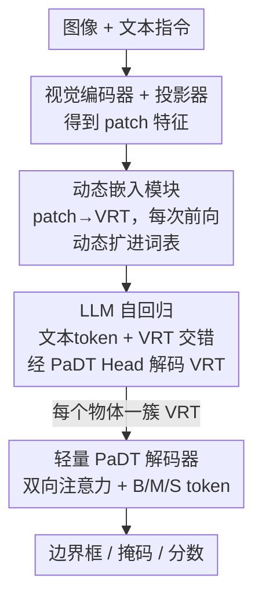

# Patch-as-Decodable-Token: Towards Unified Multi-Modal Vision Tasks in MLLMs

**会议**: ICLR 2026  
**OpenReview**: [https://openreview.net/forum?id=xF0Dcmvsl0](https://openreview.net/forum?id=xF0Dcmvsl0)  
**代码**: https://github.com/Gorilla-Lab-SCUT/PaDT  
**领域**: 多模态VLM  
**关键词**: MLLM, 视觉参考token, 统一视觉任务, 目标检测, 指代分割

## 一句话总结
PaDT 把查询图像自身的 patch 特征直接当成"可解码 token"（Visual Reference Token, VRT）插进 MLLM 的自回归输出里，让一个 MLLM 不再用文本坐标、而是用图像 patch 本身来表示被检测的物体，再用一个轻量解码器把这些 VRT 转成框/掩码/分数，从而在检测、指代理解、指代分割、指代图像描述四类任务上统一取得 SOTA——3B 模型在 RefCOCO REC 上超过 78B 的 InternVL3。

## 研究背景与动机
**领域现状**：把视觉感知任务接进 MLLM 时，主流做法是让 LLM 把检测/定位结果"序列化成文本坐标"输出，比如直接生成 `[x1, y1, x2, y2]` 这样的字符串。这条路最省事，因为它完全复用了 LLM 原生的文本输出空间，不用动模型结构。

**现有痛点**：这种"坐标即文本"的范式有三个具体毛病。第一，**输出格式不稳定**——同一个 prompt 下，模型时而输出归一化浮点 `[0.16, 0.54, ...]`、时而输出整数像素 `[248, 0, 346, 97]`、时而 JSON、时而自由文本，解析端很难稳定接住。第二，**数字被切碎**——LLM 的 tokenizer 会把 `489` 拆成 `4`、`8`、`9` 几个互不相关的离散 token，破坏了数值的连续性，定位精度因此受损。第三，也是最根本的，**坐标只有空间信息、没有语义对齐**——纯数字 token 和图像里真正的视觉目标之间缺乏语义关联，token activation 分析显示文本坐标几乎"激活不到"对应的图像区域，于是在密集预测里容易出现重复和幻觉。

**核心矛盾**：根因在于 LLM 的输出空间是纯文本的，而视觉目标本质是空间+语义的二维实体。强行把视觉目标压成离散文本数字，就丢掉了它和图像 patch 之间的天然对应关系。已有工作 ClawMachine 尝试让 LLM 输出"图像 patch token"，但它依赖一个**全局离散码本**：码本固定在数据集级别、体量巨大，且解码出来的视觉 token 在当前查询图里**没有唯一对应**——相似 patch 可能映射到同一个 token，导致相似物体之间混淆，甚至预测出根本不在查询图里的 token。

**本文目标**：设计一个统一范式，让一个 MLLM 既能输出文本、又能直接输出多样的视觉目标（框、掩码、grounding），且不引入全局码本带来的歧义。

**切入角度**：作者的关键观察是——查询图像经过 vision encoder 后得到的 patch 特征，**本身就已经携带了丰富语义、且每个 patch 天然唯一对应图像里一块区域**。那为什么还要另起炉灶造一套全局码本？直接把"这张图自己的 patch"当作可解码的词表，岂不是既有语义、又有唯一位置对应？

**核心 idea**：用"图像自己的 patch 作为可解码 token"（Patch-as-Decodable-Token）代替"文本坐标 / 全局码本"，每次前向只把当前查询图的 patch 动态扩进词表，让物体由若干个落在它身上的 VRT 来表示，再轻量解码成结构化输出。

## 方法详解

### 整体框架
PaDT 在标准 MLLM（图像编码器 + 投影器 + LLM）之上加了一个"Patch-as-Decodable-Token Head"。给定一张查询图和文本指令，图像先被 ViT 切成 patch 并编码、投影成 patch 特征 $F_{patch}\in\mathbb{R}^{N'\times d}$。关键的转折发生在这里：**动态嵌入模块**把这些 patch 特征投影成一组"视觉参考原型" $P_{ref}$，临时拼接到 LLM 原有的约 15 万词文本嵌入表后面，组成一个"文本+视觉"的多模态词表；同时输出端的分类器权重也被同样扩展，于是这批 VRT 既能作为输入嵌入、又能作为输出被预测。LLM 照常自回归地生成序列，只不过现在序列里**文本 token 和 VRT 交错出现**——例如输出 "There are 2 'bear' (`<vrt_a><vrt_b>`, `<vrt_c><vrt_d>`)"，括号里的就是落在两只熊身上的 VRT。最后，**轻量 PaDT 解码器**把每个物体对应的那一簇 VRT 隐特征收集起来，配上可学习的框/掩码/分数 token，解码成最终的边界框、分割掩码和置信度。

整条链路是清晰的串行 pipeline：

### 关键设计

**1. 视觉参考 token + 动态嵌入模块：用图像自己的 patch 当可解码词表**

这一设计直击"全局码本带来歧义"的痛点。PaDT 不维护任何固定码本，而是在**每次前向时**复用当前查询图的 patch 特征。具体地，动态嵌入模块 $f_{vp}$（一个 LayerNorm + 一个低秩线性投影）把 patch 特征投影成视觉参考原型，再与文本嵌入表拼接成动态词表：

$$E_{dyn} = [E_{text};\, P_{ref}],\qquad P_{ref} = f_{vp}(F_{patch})\in\mathbb{R}^{N'\times d}.$$

这样做有两层好处。其一，**语义天然对齐**：VRT 是从原始图像 token 改造来的，和 LLM 的高层特征空间同源，模型不用像 ClawMachine 那样被迫把高层语义硬映射到表示低层像素的 token，训练更易收敛。其二，**唯一对应、无跨图歧义**：因为词表里装的是"这张图自己的 patch"，每个 VRT 都唯一指向图中一块具体区域，不可能预测出图里不存在的 token，相似物体之间也因为位置信息不同而能被区分开。论文也用 token activation map 与热力图佐证：VRT 在对应物体上的激活既连续又一致。

**2. PaDT Head：让扩展后的视觉索引在输出端也可被预测**

只把 VRT 塞进输入还不够——要让 LLM 真的"说出"这些 VRT，输出端的分类器也得认得它们。标准 MLLM 的下一个 token 分布是 $p(y_t)=\mathrm{softmax}(W_{text}\cdot h_t)$，词表只覆盖文本。PaDT Head 把视觉参考原型同样拼到分类器权重上：

$$W_{tv} = [W_{text};\, P_{ref}]\in\mathbb{R}^{(V_{text}+N')\times d}.$$

于是 $Y = h\cdot W_{tv}^{\top}$ 的输出空间同时覆盖文本 token 和当前图的 VRT，LLM 可以在自回归序列里**把 patch 级引用直接当成普通 token 生成出来**。输入端可嵌入、输出端可解码，VRT 才真正成为一等公民的"可解码 token"。配合"每个物体只用落在它身上的若干个（而非全部）VRT 来表示"这一策略，输出形式既统一又自然。

**3. 轻量 PaDT 解码器：把一簇 VRT 翻译成框/掩码/分数**

LLM 只吐出"哪些 VRT 属于哪个物体"，还需要一个解码器把它们转成结构化输出。PaDT 解码器是三层**双向注意力块**（two-way attention）的轻量栈。它从 LLM 最后一层取出被预测 VRT 的隐特征，按"被中间文本 token 隔开的 VRT 序列"分组，每组对应一个物体的 query；再往每组里注入三个可学习 token——**框 token (B)、掩码 token (M)、分数 token (S)**。经过三层双向注意力（query 与 patch 特征互相 attend、掩码分支还做 ×2 上采样）后，三个 task token 分别投影到各自输出空间，产出 $[cx, cy, w, h]$ 边界框、掩码 logit 和置信度分数。这样一个解码器就统一覆盖了检测、分割、grounding 多种结构化输出，无需为每个任务单独建头。

**4. 鲁棒的逐 token 交叉熵 + 随机 VRT 采样：稳训练、防过拟合**

如果像已有工作那样把目标的**全部**前景 VRT 都拿来监督，训练会偏向高密度区域、反而损害性能（消融里 All VRTs 让 REC 从 93.2 暴跌到 49.1）。PaDT 改为**每次前向从每个目标的前景里随机采 $N_{vrt}=5$ 个 VRT** 作监督，增加监督的多样性，逼模型探索多个合法的视觉引用而不是死记一组固定 token。实现上引入前景掩码 $M\in\{0,1\}^{T\times N'}$，把**未被选中**的 token 的 logit 直接置为 $-\infty$：

$$l'_t = W_{tv}\cdot h_t,\qquad l'_{t,\,n+V_{text}} = -\infty \;\text{ if } M_{t,n}=1,$$

再对处理后的 logit 取 GT 类的负对数似然 $L^{robust}_{CE} = -\log\mathrm{softmax}_{GT}(l'_t)$。被屏蔽的 token 由于被排除出 softmax 归一化，既不会被奖励也不会被惩罚，等于"软化"了监督集合。最终训练目标在此基础上叠加结构化输出的任务损失：$L = L^{robust}_{CE} + L_{bbox} + L_{mask} + L_{score}$。

### 损失函数 / 训练策略
基座为 Qwen2.5-VL，做 3B / 7B 两档。每步从每个目标前景掩码里随机采 5 个 VRT 构造 GT 序列（若无掩码标注则在框内采样）。单节点 8×96GB GPU、每卡 batch 16、学习率 $2\times10^{-5}$，用 gradient checkpointing + bfloat16 + FlashAttention-2 省显存。把所有任务（RefCOCO/+/g、COCO、RIC）联合训练得到增强版 **PaDT Pro**，可只靠改 prompt 在任务间切换。

## 实验关键数据

### 主实验
覆盖四类任务，3B 模型即可越级击败远大的对手。

| 任务 / 数据集 | 指标 | PaDT Pro (3B) | 之前最佳 | 对比 |
|--------------|------|------|----------|------|
| REC RefCOCO/+/g Overall | Acc | 93.6 | 91.4（InternVL3-78B） | 3B 反超 78B |
| RES RefCOCO/+/g Overall (7B) | cIoU | 84.1 | 74.7（Text4Seg+SAM-7B） | +9.4 |
| COCO2017 开放词表检测 (3B) | mAP@[50:95] | 38.2 | 19.2（VLM-R1-3B） | ≈翻倍 |
| RIC 指代图像描述 (3B) | CIDEr-D | 1.45 | 0.386（Qwen2.5-VL-3B） | 大幅领先 |

REC 上 PaDT (3B) 和 PaDT Pro (3B) 双双超过 78B InternVL3（91.4）；检测任务上多数 MLLM（Qwen2.5-VL-3B 仅 13.7 mAP）几乎做不动，PaDT Pro 把 COCO mAP 推到 38.2，近乎翻倍。

### 消融实验
3B 模型上逐组件拆解（REC / RES 取 RefCOCO val）。

| 配置 | REC | RES | 说明 |
|------|-----|-----|------|
| 不用 VRT（直接预测文本坐标） | 88.7 | – | 退化为 Qwen2.5-VL SFT，无法做分割 |
| VRT + 解码器，去掉 $f_{vp}$ | 91.1 | 72.1 | 缺投影模块掉点 |
| VRT + 解码器，去掉鲁棒 CE | 92.0 | 75.2 | 缺鲁棒损失掉点 |
| VRT，用全部前景 VRT 监督 | 76.5 | 69.5 | 全量监督显著掉点 |
| VRT + 全部 VRT + $f_{vp}$ | 49.1 | 19.8 | 偏向高密度区，崩溃 |
| **完整 PaDT** | **93.2** | **76.1** | 投影 + 鲁棒 CE + 随机采样齐备 |

### 关键发现
- **随机采样 VRT 是性能命门**：把"随机采 5 个"换成"用全部前景 VRT"，REC 从 93.2 崩到 49.1——全量监督让模型偏向高密度区域，反而毁掉定位。这印证了"少而精的 VRT 引用 + 多样性采样"才是有效配方。
- **投影模块 $f_{vp}$ 与鲁棒 CE 缺一不可**：去掉任一项 REC 都从 93.2 回落到 91~92，说明语义对齐（投影）和监督稳定性（鲁棒 CE）是互补的两块拼图。
- **可叠 SAM2 进一步精修**：把 PaDT 输出的框/掩码当 SAM2-L 的 prompt，RefCOCOg cIoU 从 70.5 提到 76.3；但单用稀疏的 point prompt 反而无益（69.9），说明 PaDT 的框/掩码先验比点先验信息量大。
- **预训练泛化性**：在 Objects365 预训练后，PaDT 零样本检测（16.9 mAP）已超 Qwen2.5-VL 基座（13.7），再在 COCO 微调（36.5）优于直接任务训练（34.0）。

## 亮点与洞察
- **"图像自己的 patch 即词表"是真正巧妙的一招**：它一举消除了全局码本的两大顽疾（预测出图中不存在的 token、相似物体跨图歧义），因为词表是 per-image 动态构建的，每个 token 天然唯一对应一块区域。这种"用输入本身充当输出词表"的思路可迁移到任何需要"指向输入某部分"的生成任务（如指代、抽取、引用）。
- **统一性来自于表示而非堆头**：检测/分割/grounding/captioning 四类任务共享同一套 VRT 表示和同一个轻量解码器，只靠注入 B/M/S 三个 task token 区分输出——这比为每个任务接专用 head 优雅得多。
- **小模型越级打大模型**：3B 反超 78B InternVL3，强烈说明在感知任务上，"表示方式对不对"比"参数量大不大"更关键，文本坐标这条路本身就有上限。
- **负面消融比正面结果更有说服力**：作者敢于展示"全量 VRT 监督直接崩到 49.1"，把随机采样的必要性钉死，这种诚实的消融让方法可信度大增。

## 局限与展望
- **依赖 patch 网格粒度**：VRT 的空间分辨率受限于 ViT 的 patch 网格，对极小目标或需要亚 patch 精度的边界，VRT 的定位上限可能不足（这也是叠加 SAM2 还能再涨点的原因）。
- **RIC 基准是自建的**：指代图像描述任务用的是作者重标注 COCO 得到的新 benchmark，缺乏第三方对照，CIDEr 1.45 这类绝对值的横向可比性有限。
- **训练成本不低**：8×96GB GPU 的配置门槛偏高；随机采样数 $N_{vrt}=5$ 等超参对性能敏感（全量即崩），实际部署时这类超参的鲁棒区间值得进一步刻画。
- **改进思路**：可探索多尺度 / 可变分辨率 patch 让 VRT 适配不同大小目标；或把"动态词表"思路推广到视频（时空 patch 作 VRT）与开放世界增量场景。

## 相关工作与启发
- **vs 文本坐标 MLLM（Qwen2.5-VL / InternVL3）**：它们把视觉目标序列化成文本数字，格式不稳、数字被切碎、缺语义对齐；PaDT 用 VRT 直接表示目标，格式统一、语义对齐，且能做分割这类密集预测——这是它在 REC/检测上越级取胜的根因。
- **vs ClawMachine（全局码本 patch token）**：两者都想让 LLM 输出"图像 patch token"，但 ClawMachine 用固定的数据集级全局码本，体量大、易产生跨图歧义、强迫高层语义映射到低层像素 token；PaDT 改为每次前向动态扩展当前图的 patch，唯一对应、同源语义、训练更易，效率与精度都更优。
- **vs SAM / Text4Seg+SAM 等分割专家路线**：它们靠强大的分割基础模型做掩码；PaDT 仅用轻量解码器就在 RES 上超过它们，且能选择性地把 SAM2 当后处理精修器进一步涨点，灵活性更高。

## 评分
- 新颖性: ⭐⭐⭐⭐⭐ "图像自身 patch 作动态可解码词表"是对 MLLM 视觉输出范式的根本性重构
- 实验充分度: ⭐⭐⭐⭐⭐ 四任务 + 多尺度 + 充分消融 + SAM 兼容性 + 泛化分析，覆盖全面
- 写作质量: ⭐⭐⭐⭐ 动机与图示清晰，部分实现细节（任务损失）下放附录
- 价值: ⭐⭐⭐⭐⭐ 3B 越级超 78B，给"统一多模态视觉任务"提供了可扩展的新范式

<!-- RELATED:START -->

## 相关论文

- [\[ICLR 2026\] Multi-modal Data Spectrum: Multi-modal Datasets are Multi-dimensional](multi-modal_data_spectrum_multi-modal_datasets_are_multi-dimensional.md)
- [\[ICLR 2026\] Sparsity Forcing: Reinforcing Token Sparsity of MLLMs](sparsity_forcing_reinforcing_token_sparsity_of_mllms.md)
- [\[ICLR 2026\] InternSVG: Towards Unified SVG Tasks with Multimodal Large Language Models](internsvg_towards_unified_svg_tasks_with_multimodal_large_language_models.md)
- [\[ICLR 2026\] Enhancing Multi-Image Understanding through Delimiter Token Scaling](enhancing_multi-image_understanding_through_delimiter_token_scaling.md)
- [\[CVPR 2026\] Token Warping Helps MLLMs Look from Nearby Viewpoints](../../CVPR2026/multimodal_vlm/token_warping_helps_mllms_look_from_nearby_viewpoints.md)

<!-- RELATED:END -->
