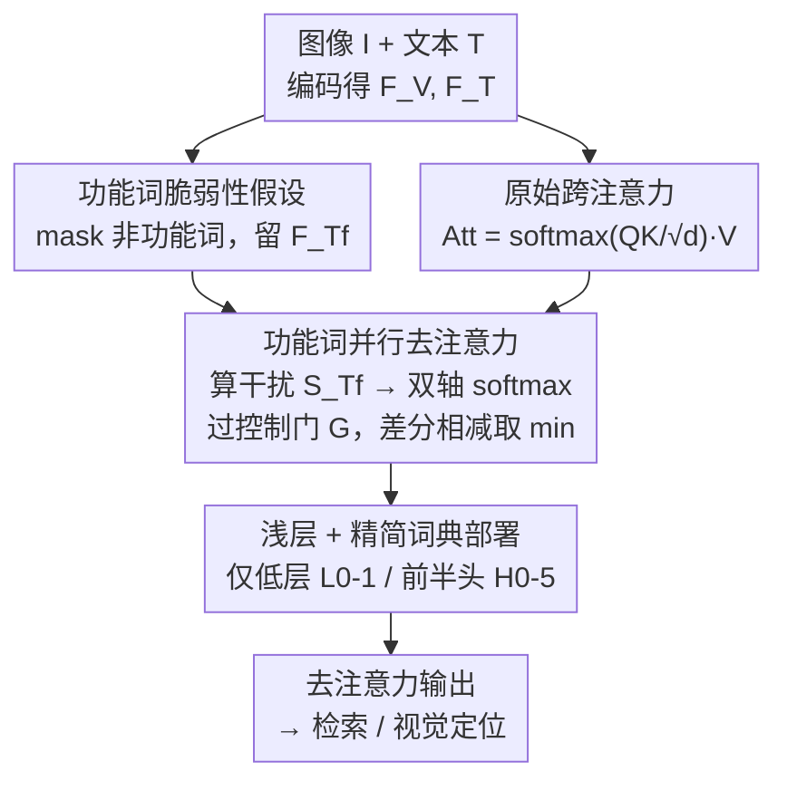

# Pay Less Attention to Function Words for Free Robustness of Vision-Language Models

**会议**: ICLR 2026  
**OpenReview**: [https://openreview.net/forum?id=4K2NNr9W5C](https://openreview.net/forum?id=4K2NNr9W5C)  
**代码**: https://github.com/michaeltian108/FDA  
**领域**: 多模态VLM / 对抗鲁棒性  
**关键词**: 视觉-语言模型, 对抗鲁棒性, 跨模态对齐, 功能词, 差分注意力

## 一句话总结
作者发现"功能词"（the/a/of 这类几乎不携带语义的高频词）是视觉-语言模型在跨模态对抗攻击下的脆弱点，于是提出 **Function-word De-Attention (FDA)**：在融合编码器的注意力里并行算一份"功能词→图像"的跨注意力当作干扰，再从原始注意力中差分地减掉它，从而在几乎不掉干净性能（<1%）的前提下，把检索任务的攻击成功率平均降 18/13/53%、视觉定位降约 90%。

## 研究背景与动机

**领域现状**：让视觉-语言模型（VLM）抵御对抗攻击是一个高关注度方向。主流防御手段是对抗训练（Adversarial Training, AT），它把对抗样本加进训练里强行提升鲁棒性，代表方法有 TeCoA、FARE，在 CLIP 类模型上确实能大幅提鲁棒性。

**现有痛点**：对抗训练有两个"老毛病"——一是干净性能掉得厉害（把对抗噪声塞进训练会扰乱表示，论文实测 TeCoA/FARE 在 ALBEF/TCL/BLIP 上干净 R@1 平均掉 4/3/9%）；二是训练成本高。即使 FARE 想用原始模型的视觉嵌入做监督来缓解 trade-off，性能下降依然明显。换句话说，鲁棒性和性能之间存在一个很难绕过的 trade-off。

**核心矛盾**：为什么对抗扰动这么容易得手？作者的关键观察是：干净图像和"目标文本"之间天然存在语义鸿沟（semantic gap），跨模态扰动会被"引导"去攻击那些语义鸿沟最小、最容易够得着的 token。而**功能词**（介词、冠词、连词这类虚词）语义信息极少、词频却极高，恰好成了"最好下手"的目标——它们悄悄吸收了对抗语义，把模型的注意力从正确区域带偏。

**作者的验证**：他们做了一个直觉性实验——分别删掉动词、形容词、功能词后看相对干净 R@1 和攻击成功率（ASR）的变化。结果只有删功能词能同时**降低 ASR** 且**几乎不损失干净性能**，删动词/名词则会大幅掉干净性能（因为这些词携带任务必需的语义）。注意力图也显示：被攻击时模型会被功能词 her 带向错误人物，只有移除功能词才能让模型"回头看"正确目标。

**核心 idea**：既然功能词承载了多余的对抗语义，那就"少关注功能词"——受差分 Transformer / 差分放大器启发，**把功能词那一份跨注意力当噪声差分减掉**，让跨模态对齐更紧致。由于这只是在微调时加一条并行计算、不引入额外参数也不改训练流程，所以叫"免费的鲁棒性（free robustness）"。

## 方法详解

### 整体框架

FDA 不改动原有的下游微调流程，而是在融合编码器（fusion encoder）的注意力计算上**挂一条并行支路**。原始支路照常用全部文本特征 $F_T$ 和图像特征 $F_V$ 算跨注意力 $\text{Att}$；并行支路把输入文本里**除功能词外的所有 token 全部 mask 掉**（保留 [CLS]），只留功能词特征 $F_{T_f}$，再算一份"功能词→图像"的跨注意力分数 $S_{T_f}$ ——这份注意力刻画的就是"功能词把模型带偏到了哪些视觉 token"，即干扰（distraction）。接着对 $S_{T_f}$ 分别沿视觉维和文本维做 softmax，把"被功能词错误激活的视觉 token / 最具误导性的文本 token"凸显出来，乘以一个控制门 $G$ 控制相减强度，最后从原始注意力里**差分地减掉**这份干扰，取两路相减结果的逐元素最小值作为去注意力后的输出，再拼接所有注意力头。整个 $D(\cdot)$ 算完后接回正常的下游头（检索 / 视觉定位）。

### 关键设计

**1. 功能词脆弱性假设：把对抗脆弱性精确定位到"虚词"上**

这是全文的立论根基，针对的是"对抗扰动为何屡屡得手"这个根本问题。作者假设：因为干净图像和目标文本之间有天然语义鸿沟，跨模态扰动倾向于攻击语义鸿沟更小、更"够得着"的 token；功能词语义稀薄但词频极高，于是成了最易被利用的载体，悄悄携带了"对抗语义"。验证方式很干净——逐类删词（动词 / 形容词 / 功能词）后对比 ASR 与干净 R@1：只有删功能词能在降 ASR 的同时几乎不掉干净性能，而删名词/内容词虽然某些指标看似变化，却把干净性能砸到 21.50/11.10（R@1，对比原始 95.90/85.60），完全不可用。这条假设的价值在于：它把"防御"从"对抗训练硬怼"转向"识别并移除模型内部的脆弱注意力来源"，为后面的差分相减提供了语义解释。

**2. 功能词并行去注意力：用差分相减抵消干扰，而非简单删词**

针对痛点"对抗训练既掉性能又费算力"。最朴素的做法是直接把功能词从输入里删掉（Masking），但论文证明这样会掉约 1% 干净性能且几乎不带来鲁棒性。FDA 的做法更精细：先并行提取功能词特征 $F_{T_f}=\mathcal{T}(T, M_{T_f})$（$M_{T_f}$ 是功能词 mask，$\mathcal{D}$ 是从停用词表里精选的功能词词典），算功能词跨注意力分数

$$S_{T_f}^{L,H} = \frac{Q(F_{T_f})K(F_V)^{\top}}{\sqrt{d_k}}$$

然后**沿视觉维和文本维分别 softmax**，得到两份去注意力 $\tilde{\text{Att}}_t^{L,H}$、$\tilde{\text{Att}}_v^{L,H}$，分别凸显"被功能词错误激活的视觉 token"和"最具误导性的文本 token"。最后从原始注意力差分相减并取最小值：

$$\hat{\text{Att}}^{L,H} = \min\!\big(\text{Att}^{L,H} - G(\tilde{\text{Att}}_t^{L,H}),\; \text{Att}^{L,H} - G(\tilde{\text{Att}}_v^{L,H})\big)$$

其中 $G$ 是控制相减强度的门。取 min 而非相加/平均，是为了在两个维度上都尽可能压住干扰、得到最保守（最干净）的注意力。这一步的妙处在于：它把"功能词的多余注意力"当作可减去的噪声项，类比差分放大器抵消共模信号，从而把跨模态嵌入收紧（论文用 t-SNE 和 top-200 文本-图像相似度证明 FDA 的对齐最紧、相似度方差最小），又因为只是并行算一份注意力再相减，**不增加任何参数、不改微调流程**，故称"免费"。

**3. 浅层 + 精简词典的部署策略：在哪减、减哪些词决定成败**

FDA 可以挂在任意层 / 任意注意力头上，但减在哪、用多大的词典对结果影响很大，这是工程上的关键。作者通过消融给出明确建议：① **在融合编码器（fusion encoder, H）上减最好**——只在文本编码器（T）上减属于"过早相减"、不足以去除干扰；T&H 两边都减又"减过头"破坏上下文语义、掉约 2% 性能；只在融合编码器减能在保留上下文的同时让模型聚焦。② **用浅层、前半注意力头**：检索任务用 $L_{0\text{-}1}, H_{0\text{-}5}$ 最稳，因为早层减干扰可避免后层把功能词信息"吸收"进去，但也不能过于靠前以免破坏文本上下文完整性。③ **用精简词典**：相比 208 词的完整停用词表，精选 91 个最常用功能词的 Shortlisted Dict 略优——词典太长会"误删"过多词、扭曲上下文。整体上 FDA 对层/头超参不敏感，给了 $L_{all}, H_{0\text{-}5}$ 作为通用安全选择。

### 损失函数 / 训练策略
FDA 不引入新损失，也不增加可训练参数：带 FDA 微调与普通下游微调完全一致。所有模型按 ALBEF 设定微调 10 epoch、取最后一个 epoch 的模型，融合层用 $L_{0\text{-}1}$、注意力头用 $H_{0\text{-}5}$。

## 实验关键数据

实验覆盖 2 个 SOTA baseline（TeCoA、FARE）、3 个模型（ALBEF/TCL/BLIP，分别用 14M/14M/124M 预训练图像）、2 个任务（检索 T2IR/I2TR、视觉定位 VG）、3 个数据集（Flickr30k、MSCOCO、RefCOCO+）、6 种攻击（PGD/APGD/MAPGD 等，$l_\infty=2/255,\,4/255$）。指标用攻击成功率 ASR，以及相对变化 $\Delta\text{ASR}=\frac{\text{ASR}_B-\text{ASR}_M}{\text{ASR}_B}\times100\%$（越大越鲁棒）。为公平比较，baseline 调低扰动强度使干净性能与 FDA 相当。

### 主实验（检索 + 视觉定位，节选 Flickr30k / RefCOCO+）

| 任务 | 模型 | 防御 | 干净性能 | 平均 $\Delta$ASR↑ |
|------|------|------|---------|-------------------|
| 检索 (Flickr, ε=2) | ALBEF | FDA | 95.60 (R@1，仅掉 0.3%) | ↑22.26% |
| 检索 (Flickr, ε=2) | TCL | FDA | 94.40 | ↑14.29% |
| 检索 (Flickr, ε=2) | BLIP | FDA | 96.50 | ↑51.60% |
| 检索 (Flickr, ε=2) | ALBEF | TeCoA / FARE | 91.2 / 91.1 (掉约 4%) | ↓3.02 / ↑5.36% |
| 视觉定位 (RefCOCO+, ε=2) | ALBEF | FDA | 66.80 (Test A，略升) | ↑93.16% |
| 视觉定位 (RefCOCO+, ε=2) | ALBEF | TeCoA / FARE | 64.7 / 64.2 (掉约 1%) | ↑21.21 / ↑12.08% |

总览：检索上 FDA 在 ALBEF/TCL/BLIP 取得平均 18/13/53% 的 ASR 下降，干净 R@1 仅掉 0.2/0.3/0.6%；视觉定位上接近完全防御（ASR 降约 90%）且干净精度还略升 0.3%。一个有趣的规模效应：模型越大（BLIP 用 124M 图像）FDA 收益越大，$\Delta$ASR 提升约 54%，作者归因于更强的 backbone 能更好捕捉视觉线索。

### 消融实验

| 配置 | 平均 $\Delta$ASR↑ | 说明 |
|------|-------------------|------|
| 仅文本编码器 T | ↓2.54% | 过早相减，不足以去干扰 |
| 文本+融合 T&H | ↑15.61% | 减过头，掉约 2% 干净性能 |
| 仅融合编码器 H | ↑18.48% | **最佳**：去干扰又保上下文 |
| Full Dict (208 词) | ↑4.22% | 词典太长，误删扭曲上下文 |
| Shortlisted Dict (91 词) | ↑6.45% | 略优 |
| 直接 mask 功能词 (FUNC) | ↑1.56% | 干净掉约 1%，几乎无鲁棒性 |
| FDA | ↑23.07% | 显著领先各种 mask / 变体 |

### 关键发现
- **减在哪比减什么更重要**：在融合编码器的浅层、前半注意力头（$L_{0\text{-}1}, H_{0\text{-}5}$）效果最稳；减在文本编码器或全部头反而更差。
- **差分相减 >> 直接删词**：直接 mask 功能词（FUNC）只带来 ↑1.56% 鲁棒性且掉干净性能，而 FDA 达 ↑23.07%；说明价值在于"软性差分扣除干扰"而非"硬删词"。删名词/内容词则把干净性能砸到 R@1 21.50，完全不可用。
- **即插即用 + 提零样本**：FDA 与 TeCoA/FARE 叠加能进一步提鲁棒性（无目标攻击下 BLIP 上叠加 FDA 再提约 3-4%），且在零样本检索/定位上 $L_{all}$ 设置普遍带来小幅性能增益。

## 亮点与洞察
- **把"对抗脆弱性"归因到具体语言学单位**：不像多数防御只在像素/嵌入层做文章，本文指出功能词这一可解释的脆弱点，并用删词实验+注意力图把假设讲得很扎实——这种"先定位脆弱来源再针对性移除"的思路可迁移到其他多模态对齐任务。
- **"免费"是真免费**：不加参数、不改训练流程、不需对抗样本，仅靠并行算一份注意力再差分相减，就同时拿到鲁棒性和干净性能，绕开了对抗训练的 trade-off。
- **差分思想的跨界复用**：借差分 Transformer / 差分放大器"抵消共模噪声"的直觉，把功能词注意力当作可消去的干扰项，是一个很优雅的类比。
- **取 min 而非加权**：在视觉/文本两个维度的去注意力里取逐元素最小值，保证两个方向的干扰都被压住，是个值得借鉴的保守融合小技巧。

## 局限与展望
- 作者承认：直接相减虽高效，但可能不如模块化/算法化的更精细移除；受硬件限制未在更大 VLM 或 PEFT（如 LoRA）上验证。
- **只适用带融合编码器的架构**：FDA 设计在 ALBEF/TCL/BLIP 这类有 fusion encoder 的 backbone 上，尚未适配 LLaVA / Qwen-VL 这类 projector-based 模型（作者称可无缝迁移但未实证），也因缺融合编码器排除了 CLIP。
- **词典是手工精选的**：最优功能词词典可能词数更多/更少，需要大量人工验证；功能词的界定本身依赖停用词表，跨语言/跨领域泛化存疑。
- 自己发现的局限：baseline 为对齐干净性能而调低了扰动强度，横向比较 ASR 时需注意各方法并非在完全相同攻击强度下评测；规模效应的结论主要基于 BLIP 单点，样本偏少。

## 相关工作与启发
- **vs 对抗训练 (TeCoA / FARE)**：它们把对抗样本塞进训练硬提鲁棒性，代价是干净性能掉 3-9% + 高算力；FDA 不用对抗样本、不加参数，靠移除功能词干扰拿"免费鲁棒性"，且能与它们叠加进一步增益。
- **vs 直接删词 / Masking**：直接 mask 功能词几乎无鲁棒性且掉干净性能；FDA 的差分软相减在两个维度凸显并扣除干扰，效果差一个数量级（↑23.07% vs ↑1.56%）。
- **vs 差分 Transformer**：借用其"算两份注意力相减以抵消噪声"的机制，但把它从语言建模迁移到跨模态对齐、并具体落到"功能词作为对抗干扰源"这一新视角。

## 评分
- 新颖性: ⭐⭐⭐⭐⭐ 把对抗脆弱性归因到功能词并用差分去注意力移除，是一个少见且可解释的新视角
- 实验充分度: ⭐⭐⭐⭐ 覆盖 3 模型/2 任务/3 数据集/6 攻击 + 充分消融，但未触及 projector-based 大 VLM
- 写作质量: ⭐⭐⭐⭐ 假设—验证—方法—消融逻辑清晰，公式与图示到位
- 价值: ⭐⭐⭐⭐⭐ 零额外成本同时提鲁棒性与干净性能，实用性强且思路可迁移

<!-- RELATED:START -->

## 相关论文

- [\[ICLR 2026\] From Pixels to Words -- Towards Native Vision-Language Primitives at Scale](from_pixels_to_words_--_towards_native_vision-language_primitives_at_scale.md)
- [\[ICCV 2025\] Is Less More? Exploring Token Condensation as Training-free Test-time Adaptation](../../ICCV2025/multimodal_vlm/is_less_more_exploring_token_condensation_as_training-free_test-time_adaptation.md)
- [\[ICLR 2026\] Memory-Free Continual Learning with Null Space Adaptation for Zero-Shot Vision-Language Models](memory-free_continual_learning_with_null_space_adaptation_for_zero-shot_vision-l.md)
- [\[ICLR 2026\] Error Notebook-Guided, Training-Free Part Retrieval in 3D CAD Assemblies via Vision-Language Models](error_notebook-guided_training-free_part_retrieval_in_3d_cad_assemblies_via_visi.md)
- [\[ICML 2026\] Large Vision-Language Models Get Lost in Attention](../../ICML2026/multimodal_vlm/large_vision-language_models_get_lost_in_attention.md)

<!-- RELATED:END -->
