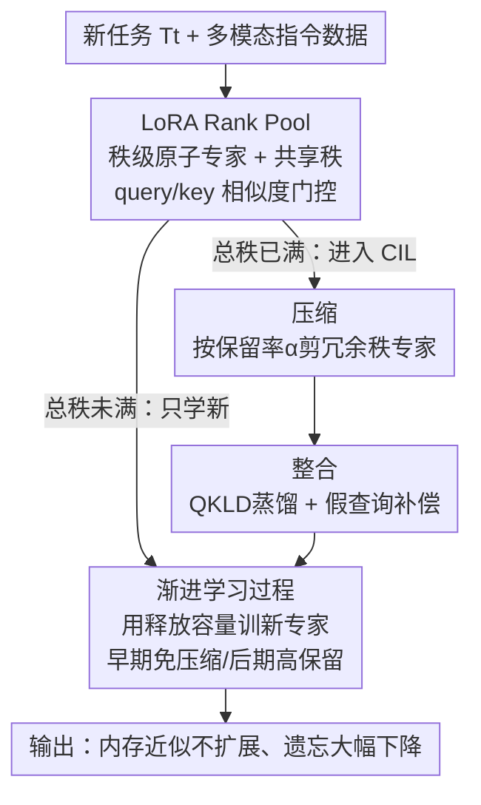

# PCLR: Progressively Compressed LoRA for Multimodal Continual Instruction Tuning

**会议**: ICLR 2026  
**OpenReview**: [https://openreview.net/forum?id=WdP1NVSzsz](https://openreview.net/forum?id=WdP1NVSzsz)  
**代码**: https://github.com/SII-HITclearlove777/PCLR  
**领域**: 多模态VLM / 持续学习 / LoRA  
**关键词**: 多模态持续指令微调, LoRA, 秩级专家, 压缩-整合-学习, 灾难性遗忘

## 一句话总结
把一个 LoRA 适配器拆成"秩级原子专家"组成一个极细粒度 MoE（LRP），再借鉴人类睡眠期记忆巩固，设计"压缩—整合—学习"（CIL）流水线：压缩剪掉冗余秩专家腾出容量、整合用蒸馏把被剪知识吸收回来、学习用腾出的容量装新任务，配合渐进式压缩调度，让模型既能持续学新任务又把内存增长压到接近"不扩展"方法的水平，在 CoIN 上把遗忘从 LoRA 的 37.29 降到 3.39。

## 研究背景与动机

**领域现状**：大型多模态模型（LMM）靠预训练 + 指令微调成为标配，但任务和数据持续演进，每来一个新任务就全量重训既贵又不现实。持续指令微调（Continual Instruction Tuning, CIT）应运而生，目标是让 LMM 顺序学一串新任务、又不丢老本事。现有 CIT 路线分两类：静态结构（不扩展）方法靠约束参数更新来缓解遗忘；模型扩展（extension）方法给每个新任务挂一组新模块来隔离干扰。

**现有痛点**：静态方法卡在"稳定性—可塑性"的 trade-off 上——管住老知识就学不动新任务，放开学新就忘老。扩展方法虽然隔离了干扰，但模块随任务数无界增长，内存爆炸。近期的"条件扩展"方法想折中：训练前测新任务与旧任务的特征分布相似度，相似就并到最近的参数组里、用正则约束更新，不相似才新开一组；但它们只是把结构扩展"推迟"了，长任务序列下内存仍然无界增长。

**核心矛盾**：作者发现扩展带来的内存开销其实是"不必要"的。把不同任务训出来的 LoRA 拆到秩向量级别看，会发现大量秩向量是线性相关、可压缩的（图 2：VizWiz 的 LoRA 有 38.2% 的秩相对 GQA 是冗余的）。现有扩展方法只在"专家/任务"这个粗粒度上做路由，完全忽略了细粒度的秩级冗余——而这恰恰是内存爆炸的真正驱动因素。

**本文目标**：在一个统一框架里同时解决三件事——遗忘（稳定性）、学新（可塑性）、内存（效率），并且让内存不随任务数无界增长。

**切入角度**：既然冗余发生在秩级别，那就把粒度降到秩级别去管理知识：把 LoRA 拆成可单独增删的秩专家，从而可以"训练时少扩、训练后剪枝"。同时借鉴神经科学——海马体在睡眠期被重激活以巩固记忆——把"学新"包装成一个有压缩、有巩固的记忆循环。

**核心 idea**：用秩级原子 MoE（LoRA Rank Pool）替代粗粒度任务专家，再用"压缩腾容量 → 蒸馏整合补损失 → 在腾出的容量里学新任务"的 CIL 循环替代"要么挤旧空间要么无界扩展"的二选一，让"压缩省出的容量 = 学习新增的容量"，从根上消除无界扩展。

## 方法详解

### 整体框架
PCLR 由两个耦合部件组成：一个架构 **LoRA Rank Pool（LRP）** 和一套学习范式 **Compression–Integration–Learning（CIL）流水线**。LRP 把每个 LoRA 适配器拆成一组"秩向量 + 可学习 key"的原子专家，插在 LLM 主干和跨模态桥接的线性层里；推理时用输入构造 query，与 key 池算余弦相似度并 top-r 门控，激活最相关的若干秩专家。CIL 则规定每个新任务怎么学：当总秩数达到预设上限后，先**压缩**（按保留率剪掉冗余秩专家腾出容量）、再**整合**（用改进蒸馏把被剪知识吸收回来、补偿压缩损失）、最后**学习**（在腾出的容量里训新专家）。再叠加一个**渐进学习过程**调度压缩与学习的力度，整体形成一个"内存恒定、持续演化"的系统。

### 关键设计

**1. LoRA Rank Pool（LRP）：把 LoRA 拆到秩级别的原子 MoE**

针对"粗粒度专家忽略秩级冗余"这个痛点，LRP 把一个 LoRA 适配器 $\Delta W = \beta AB^T$ 中的 $A$ 按列拆成向量集 $\{a_1,\dots,a_n\}$、$B^T$ 按行拆成 $\{b_1^T,\dots,b_n^T\}$，每个秩向量配一个可学习 key，组成一个"原子专家"。再引入全局共享分量 $A_s, B_s$ 累积跨任务公共知识，前向写作

$$y = xW + \beta_s xA_sB_s^T + \beta_m \sum_{i=1}^{n} \text{gate}(s(x), r)_i\, x a_i b_i^T,$$

其中 $n$ 是总秩专家数、$r$ 是激活数。打分函数 $s(x)=Kq$：query $q$ 由文本嵌入的均值池化拼接视觉输出（[CLS] token 或均值池化）构造，$K$ 是所有 key 组成的 key 池，用余弦相似度 + 门控选 top-r 专家。由于逐项执行这个 $n$ 项矩阵多项式开销大，作者把离散秩聚合成 $A_m, B_m$ 并把打分向量广播对齐，得到可并行的等价式 $y = xW + \beta_s xA_sB_s^T + \beta_m F(xA_m, \text{gate}(Kq,r)^T)B_m^T$。把粒度降到秩级别，知识的"调用与编辑"就有了最大自由度——训练时只需少量新增、训练后能精确剪冗余，这正是后面压缩的前提。

**2. 压缩 Compression：剪掉冗余秩专家、腾出容量**

针对"扩展导致内存无界增长"，压缩在 CIL 的第一阶段引入保留率 $\alpha \in (0,1]$，丢弃一部分冗余秩专家及其对应 key，使剪枝后的 LRP 的秩数和 key 数变为原来的 $\alpha$ 倍。它是一个**训练无关（training-free）**的过程，只做"瘦身"。压缩本身会带来性能损失，但它是缓解学习系统内存压力的关键——更重要的是，作者把"压缩省出的容量"设定为恰好等于"学习新增的容量"，于是系统总内存恒定，从根上消除无界扩展。注意 CIL 只在总秩数达到预设上限后才启动，前期不压。

**3. 整合 Integration：用 QKLD 蒸馏 + 假查询把被剪知识吸收回来**

针对"压缩会丢掉旧任务知识"，整合阶段用蒸馏把损失补回来：冻结教师（压缩前的 LRP）、更新学生（压缩后的 LRP），让被剪专家的知识被现存秩专家吸收、跨任务公共表示流入共享知识空间。难点是整合时拿不到旧任务数据。作者注意到训练时优化了 query–key 余弦相似度，其最优解是"每个 key 等于该任务所有 query 的均值"，于是把学到的 key 当作旧任务 query 的替身，称为**假查询（fake query）**。用 KLD 衡量假查询下的性能损失

$$D_{KL}(q) = \frac{1}{T}\sum_{t=1}^{T} P_{\theta_{ori}}(x_t \mid x_{<t}, q)\log\frac{P_{\theta_{ori}}(x_t \mid x_{<t}, q)}{P_{\theta_{zip}}(x_t \mid x_{<t}, q)},$$

并按 $P(q) = \sqrt{D_{KL}(q)}/\sum_{q\in K_{ori}}\sqrt{D_{KL}(q)}$ 采样、对损失更大的任务重点优化，最终得到 **Query-based KL 散度损失（QKLD Loss）** $L(\theta_{zip}) = \mathbb{E}_{q\sim P}[D_{KL}(q)]$。这一步把 LLaVA-7B 上的遗忘从压缩后的 11.29 拉回到 5.09。

**4. 渐进学习过程：Learning 阶段 + 随任务进度调节压缩力度**

学习阶段冻结共享秩和旧秩、只在压缩腾出的容量里训新的 key–value 对（新秩专家），并用"相似最近初始化"增强前向迁移——先算一批训练样本的 query 取均值作为标识符，去 LRP 里匹配 top-r 余弦相似的 key，用对应秩值初始化新秩。在此之上，作者再叠一层**渐进调度**：早期 CIT 时秩空间还没填满，压缩纯属浪费，于是直接禁用压缩、降低训练成本且不引入无谓性能损失；随任务增多，模型知识越积越密、新任务与旧知识的重叠（可复用知识）变大、内部表示越来越抗压缩，于是后期只分配更少的新秩、用更轻的高保留率压缩方案，让模型多依赖冻结知识。这种"按知识密度规划学习轨迹"的做法把遗忘从 5.09 进一步降到 3.39。

### 损失函数 / 训练策略
学习阶段联合交叉熵与 query–key 余弦相似度损失：$L(\theta) = -\frac{1}{T}\sum_{t=1}^{T}\log P_\theta(y_t\mid x, y_{<t}, q) + \frac{\lambda}{l}\sum_{i=1}^{l}\|\mathbf{1}_r - \text{top}_r(K_i)q\|_1$，其中 $\lambda$ 为平衡系数、$l$ 为 key 池数（等于 LMM 层数）；为保旧知识，冻结所有旧 key 与旧秩、只优化新增部分。整合阶段用 QKLD Loss（式 7）。每个任务训 1 个 epoch。此外可与正则方法融合（如 PCLR-LwF）：把长任务序列切成相邻任务组，组内用统一秩空间 + 正则做持续学习、组间保留 CIL 流程，进一步降低长序列训练开销。

## 实验关键数据

### 主实验
基座为 LLaVA-1.5（7B/13B）与 Qwen-VL，benchmark 用 CoIN（8 任务）和长序列 Continual-NExT（15 任务）。指标：平均准确率 Avg.ACC↑、遗忘 Forgetting↓、新任务准确率 New.ACC↑。

| Benchmark / 基座 | 方法 | Avg.ACC↑ | Forgetting↓ | New.ACC↑ |
|------|------|------|------|------|
| CoIN / LLaVA-7B | LoRA (基线) | 28.74 | 37.29 | 61.36 |
| CoIN / LLaVA-7B | SEFE (前最佳正则) | 58.57 | 11.94 | 69.02 |
| CoIN / LLaVA-7B | EProj (前最佳扩展) | 60.79 | 5.42 | 65.54 |
| CoIN / LLaVA-7B | **PCLR** | **62.19** | **3.39** | 65.16 |
| Continual-NExT / LLaVA-hf | MoELoRA (其他最佳) | 46.99 | 8.06 | 54.51 |
| Continual-NExT / LLaVA-hf | **PCLR** | **47.94** | **7.71** | 55.14 |
| Continual-NExT / LLaVA-hf | **PCLR-LwF** | **52.67** | **4.58** | 56.89 |

CoIN 上 PCLR 相对前最佳正则方法 SEFE，Avg.ACC +3.62、Forgetting −8.55，且同时拿到所有方法里最高的 New.ACC 和最低的 Forgetting；内存预算接近"不扩展"方法却超过扩展方法的性能。Continual-NExT 上 PCLR 超过其他最佳（MoELoRA）Avg.ACC +0.95、Forgetting −0.35；融合 LwF 后再涨 Avg.ACC +4.73、Forgetting −3.13。

### 消融实验
从 LoRA 基线逐组件叠加（LLaVA-7B / CoIN）：

| 配置 | Avg.ACC↑ | Forgetting↓ | New.ACC↑ | 说明 |
|------|---------|---------|---------|------|
| LoRA (基线) | 28.74 | 37.29 | 61.36 | 起点 |
| w/o Integration (仅压缩+学习) | 54.66 | 11.29 | 64.54 | 引入 LRP：Avg.ACC +25.92、Forgetting −26 |
| w/o Progressive (CIL 全开) | 60.78 | 5.09 | 65.23 | 加整合：Avg.ACC +6.12、Forgetting −6.2 |
| PCLR (完整) | 62.19 | 3.39 | 65.16 | 加渐进：Avg.ACC +1.41、Forgetting −1.7 |

### 关键发现
- **LRP 架构贡献最大**：仅"压缩+学习"就把 Avg.ACC 拉高 25.92、遗忘降 26，说明把 LoRA 拆到秩级别的细粒度管理是核心增益来源。
- **整合是补偿压缩损失的关键**：CIL 相对仅 CL（压缩+学习）把遗忘从 11.29 降到 5.09，验证 QKLD 蒸馏 + 假查询能在拿不到旧数据时把被剪知识找回来。
- **压缩策略的形状很重要**：在内存相同的前提下对比五种压缩调度（Table 6），激进压缩偏可塑性但遗忘 +1.7、保守压缩偏稳定但 New.ACC −1.73、反向渐进与集中压缩都更差；唯有"渐进压缩（早松后紧、动态调保留率）"同时拿到最低遗忘 3.39 与最高 New.ACC 65.16。
- **强鲁棒性**：换三种指令模板（Table 3）、换三种任务顺序（含 Reverse/Alphabet，Table 4），Avg.ACC 波动都很小，说明 CIL 把任务专属专家平滑过渡为多任务混合专家、能抗任务间干扰。

## 亮点与洞察
- **把"睡眠记忆巩固"落成可计算流程**：压缩对应突触修剪、整合对应海马重激活蒸馏、学习对应新经验写入——神经科学隐喻不是花架子，而是每一步都有明确的损失/操作支撑，可读性和工程落地兼顾。
- **"压缩省出 = 学习新增"的内存守恒设计很巧**：把内存做成恒定量而非随任务增长，直接绕开了扩展类方法的根本病灶，同时还保住了扩展方法的性能优势。
- **假查询（fake query）是无回放整合的关键 trick**：利用"key 收敛到任务 query 均值"这一性质，把学到的 key 当旧任务 query 的替身，从而在不存旧数据的前提下做蒸馏——这个观察可迁移到其他需要"无数据知识保持"的持续学习场景。
- **秩级初始化迁移**：新秩用相似旧秩初始化来增强前向迁移，是把"知识复用"显式做进参数初始化的轻量做法。

## 局限与展望
- 整合阶段依赖"key ≈ 任务 query 均值"这一最优性假设，当 query–key 损失未充分收敛、或任务内 query 分布多峰时，假查询作为旧数据替身的保真度可能下降，作者未量化这一偏差。
- 压缩保留率 $\alpha$、共享/MoE 缩放因子 $\beta_s,\beta_m$、激活数 $r$ 等超参较多，渐进调度的"早松后紧"曲线如何自动确定仍偏经验设定，论文未给自适应方案。
- Continual-NExT 上原始 PCLR 相对 MoELoRA 的优势较小（Avg.ACC +0.95），主要靠融合 LwF 才显著拉开，说明在极长序列上单凭 CIL 仍有提升空间。
- 评测集中在 VQA/分类/grounding 类任务，对生成式、长上下文等任务上的秩级冗余规律是否成立有待验证。

## 相关工作与启发
- **vs 扩展方法（EProj / CIA / ProgLoRA）**：它们在"任务/专家"粗粒度上隔离干扰、内存随任务无界增长；PCLR 把粒度降到秩级、用压缩做到内存恒定，在 CoIN 上以更低内存超过 EProj 的性能（62.19 vs 60.79 Avg.ACC，3.39 vs 5.42 Forgetting）。
- **vs 静态/正则方法（LwF / EWC / SEFE / MT）**：它们靠约束更新缓解遗忘，卡在稳定—可塑 trade-off 上（LwF/EWC 过度抑制遗忘导致可塑性差）；PCLR 同时拿到最高 New.ACC 和最低 Forgetting，并能与这类方法融合（PCLR-LwF）进一步提升长序列表现。
- **vs AdaLoRA / L2P 系列**：LRP 受 AdaLoRA 的自适应秩与 L2P 的提示/key 池启发，但把它们组合成"秩级原子 MoE + 可压缩可编辑"的持续学习架构，强调训练时少扩、训练后剪枝。

## 评分
- 新颖性: ⭐⭐⭐⭐⭐ 秩级原子 MoE + 睡眠隐喻的压缩-整合-学习流水线，把"内存恒定"做成系统级设计，角度新。
- 实验充分度: ⭐⭐⭐⭐⭐ 双 benchmark（含 15 任务长序列）、多基座（7B/13B/Qwen-VL）、逐组件消融 + 压缩策略对比 + 指令模板/顺序鲁棒性，覆盖全面。
- 写作质量: ⭐⭐⭐⭐ 神经科学隐喻清晰、公式完整，但大量细节（算法伪码、可视化）压在附录，正文略密。
- 价值: ⭐⭐⭐⭐⭐ 给多模态持续指令微调提供了"内存近似不扩展却性能超扩展"的实用方案，秩级管理与无数据整合 trick 可迁移性强。

<!-- RELATED:START -->

## 相关论文

- [\[CVPR 2026\] Multimodal Continual Instruction Tuning with Dynamic Gradient Guidance](../../CVPR2026/multimodal_vlm/multimodal_continual_instruction_tuning_with_dynamic_gradient_guidance.md)
- [\[ICML 2025\] Dynamic Mixture of Curriculum LoRA Experts for Continual Multimodal Instruction Tuning](../../ICML2025/multimodal_vlm/dynamic_mixture_of_curriculum_lora_experts_for_continual_multimodal_instruction_.md)
- [\[ACL 2025\] Enhancing Multimodal Continual Instruction Tuning with BranchLoRA](../../ACL2025/multimodal_vlm/branchlora_continual_instruction.md)
- [\[CVPR 2026\] Harmonious Parameter Adaptation in Continual Visual Instruction Tuning for Safety-Aligned MLLMs](../../CVPR2026/multimodal_vlm/harmonious_parameter_adaptation_in_continual_visual_instruction_tuning_for_safet.md)
- [\[ICLR 2026\] KeepLoRA: Continual Learning with Residual Gradient Adaptation](keeplora_continual_learning_with_residual_gradient_adaptation.md)

<!-- RELATED:END -->
