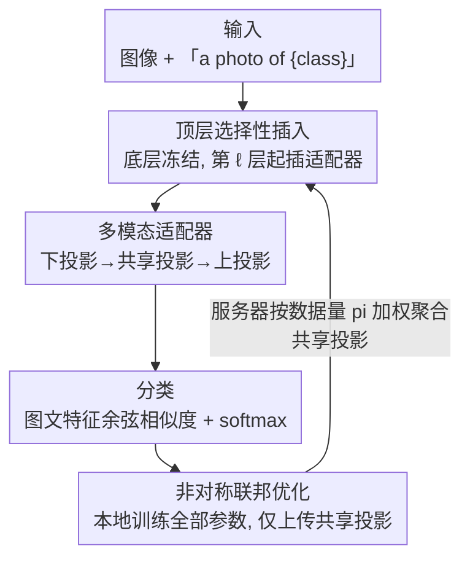

# pFedMMA: Personalized Federated Fine-Tuning with Multi-Modal Adapter for Vision-Language Models

**会议**: ICLR 2026  
**OpenReview**: [https://openreview.net/forum?id=aX3E6LirK5](https://openreview.net/forum?id=aX3E6LirK5)  
**代码**: https://github.com/sajjad-ucsb/pFedMMA  
**领域**: 多模态VLM / 个性化联邦学习 / 参数高效微调  
**关键词**: 联邦学习, CLIP, 多模态适配器, 个性化, 泛化-个性化权衡

## 一句话总结
pFedMMA 给 CLIP 的图像/文本编码器顶层插入一种「下投影—共享投影—上投影」的多模态适配器，在联邦学习里让每个客户端本地训练全部参数、但只把跨模态对齐用的共享投影上传聚合，从而在 11 个数据集上同时拿到强个性化和强泛化（对未见类/未见域）的最佳权衡。

## 研究背景与动机
**领域现状**：CLIP 这类视觉-语言模型（VLM）零样本/少样本能力很强，但要把它高效适配到分散、隐私敏感、且分布异质的场景（医疗、法律、工业），需要在联邦学习（FL）框架下做参数高效微调（PEFT）。近两年这个方向的主流做法是「联邦 + 提示微调（prompt tuning）」：pFedPrompt、FedOTP、FedPGP、pFedMoAP 等都是给每个客户端学一套提示，再用不同机制（最优传输、对比学习、专家混合）在客户端之间协同。

**现有痛点**：这些提示微调方法为了个性化牺牲了泛化。论文用雷达图（Fig.1）展示：FedOTP 在本地类（local）上精度极高（>97%），但在基类（base）、新类（novel）上崩盘（base 只有 18% 量级），调和平均（HM）惨不忍睹。也就是说它们把模型「过拟合」到了每个客户端见过的那点类别上，一旦面对未见类或未见域就失效，限制了在分布外（OOD）场景的可用性。

**核心矛盾**：个性化（贴合本地分布）和泛化（迁移到未见类/域）之间存在 trade-off。提示注入在 token/输入层面，表达能力受架构约束，难以同时兼顾两端；而且 CLIP 这种 VLM 的关键是跨模态对齐，单模态的提示或适配器（AdaptFormer、LoRA）忽略了图文之间的依赖。

**本文目标**：在联邦异质数据下，找到一种既能让每个客户端贴合本地分布、又能保持跨域跨类泛化、还要通信省的适配机制。

**切入角度**：作者放弃提示、改用「多模态适配器」——它独立于骨干架构、可插入任意 backbone，并且通过一个跨模态共享投影层来对齐图文特征。关键观察是：适配器的三段结构（下投影/共享/上投影）天然可以拆分——上下投影负责模态特有处理，共享投影负责跨模态对齐，二者在联邦里可以「分开对待」。

**核心 idea**：把适配器拆成「本地私有的上下投影」+「全局共享的对齐投影」，本地全量训练、只聚合共享投影——用这种非对称联邦优化把个性化和泛化拆到两类参数上分别负责。

## 方法详解

### 整体框架
pFedMMA 的输入是图像 $x$ 和形如「a photo of a {class}」的类别文本，输出是图文余弦相似度做的分类 logits。整条管线在一个冻结的 CLIP 上展开：底层 transformer 块保持冻结，从第 $\ell$ 层起在图像编码器和文本编码器的上层块里并行插入多模态适配器（MMA）；每个适配器内部是「下投影 → 共享投影 → 上投影」三段，其中共享投影在图文两条路之间复用以促进对齐。联邦侧，每个客户端本地用交叉熵训练适配器的全部参数若干个 epoch，但通信轮只上传共享投影矩阵，服务器按客户端数据量加权聚合后下发，上下投影则永远留在本地。

### 关键设计

**1. 顶层选择性插入：只在上层做适配，保住底层通用知识**

提示/适配器若铺满全部层（如 AdaptFormer、LoRA）或塞进底层，会破坏 CLIP 预训练学到的通用表征，也徒增可训练参数。作者基于两个经验观察来定位插入点：其一，图文编码器的高层包含更具判别性、更贴数据集的特征，低层则保存通用可迁移知识；其二，低层处的图文模态间隙（modality gap）更大，早期做跨模态对齐反而更难。据此，适配器只从第 $\ell$ 层起插入两个编码器的上层块 $j\in\{\ell,\cdots,L\}$，下层全部冻结。这样既保留了底层的通用表征（利于泛化到未见类/域），又把任务特定的适配集中在判别力强的顶层，同时显著压低可训练参数量。

**2. 多模态适配器：用共享投影把图文桥接到同一对齐空间**

单模态适配器忽略了 VLM 的跨模态依赖，对齐做不好。pFedMMA 的适配器采用并行（parallel）结构：输入 $x$ 同时过冻结主干 $f(x)$ 和适配器分支，相加输出 $\text{Output}(x)=f(x)+\alpha A(x)$，$\alpha$ 是缩放因子，控制通用特征与任务特征的平衡。适配器分支本身是三段瓶颈，对第 $j$ 层、模态 $o\in\{I,T\}$（图像/文本）：

$$A^{(o)}_j(z^{(o)}_j)=W^{(o)}_{ju}\cdot \delta\!\left(W_{js}\cdot \delta\!\left(W^{(o)}_{jd}\cdot z^{(o)}_j\right)\right)$$

关键在于：下投影 $W^{(I)}_{jd},W^{(T)}_{jd}$ 和上投影 $W^{(I)}_{ju},W^{(T)}_{ju}$ 是模态特有的（图文各一套），而中间的共享投影 $W_{js}$ 被图文两条路复用、$\delta$ 是 GELU 之类的非线性。先用下投影把特征压到低维（$r\ll d$），再过共享投影做跨模态信息交换，最后上投影还原维度。这样既保留了每个模态自己的处理通道，又强制图文在共享投影处发生交互、对齐到同一空间——这正是后面联邦拆分能成立的结构前提。

**3. 非对称联邦优化：本地私有上下投影管个性化，全局共享投影管泛化**

有了「上下投影模态特有、共享投影跨模态对齐」的结构，作者把它直接映射到联邦的参数划分上。每个客户端 $i$ 在第 $t$ 轮把全部适配器参数

$$W\in\{W^{(I)}_{jd,i},W^{(I)}_{ju,i},W^{(T)}_{jd,i},W^{(T)}_{ju,i},W_{js,i}\}$$

用交叉熵本地训练 $E$ 个 epoch（$W^{t,e}_i=W^{t,e-1}_i-\eta\nabla\mathcal{L}_{ce}$）；但通信轮只上传共享投影 $W^{t,E}_{js,i}$，服务器按数据量加权聚合 $W^{t+1}_{js}=\sum_{i=1}^N p_i W^{t,E}_{js,i}$（$p_i=n_i/n$），上下投影则不上传、永远留在本地。这套非对称设计同时拿到三个好处：(i) **本地个性化**——客户端私有的上下投影能把表征空间塑形成自己本地分布的样子，对标签/特征异质尤其有效；(ii) **全局泛化**——共享投影由所有客户端协同训练，负责把图文对齐到一个一致的全局空间，使模型能跨域跨类迁移；(iii) **通信高效**——共享投影维度远低于整个适配器栈，每轮只传它，通信成本大幅下降。个性化交给私有参数、泛化交给共享参数，二者各司其职，这就是它能打破「个性化 vs 泛化」trade-off 的根本原因。

### 损失函数 / 训练策略
训练目标就是标准交叉熵 $\mathcal{L}_{CE}=-\frac{1}{M}\sum_i\sum_k y_{ik}\ln p_{i,k}$，其中 $p_{i,k}=\exp(\cos(z^{(I)}_i,z^{(T)}_k)/\gamma)/\sum_j\exp(\cos(z^{(I)}_i,z^{(T)}_j)/\gamma)$，$\gamma$ 是温度。骨干 CLIP 全程冻结，只训练顶层适配器。CLIP 系列数据集默认 ViT-B/16、10 个客户端非重叠类划分、100% 参与率、本地 2 epoch、50 通信轮；共享层维度默认 32（消融显示 128 略好但参数更多，故取 32）。

## 实验关键数据

### 主实验
7 个 CLIP 数据集、16-shot、ViT-B/16，按本地（Local）/ 基类（Base）/ 新类（Novel）/ 调和平均（HM）评估（7 数据集平均）：

| 方法 | Local | Base | Novel | HM |
|------|-------|------|-------|------|
| CLIP（零样本） | 76.36 | 76.81 | 81.21 | 78.03 |
| PromptFL | 88.93 | 88.95 | 75.36 | 83.09 |
| FedPGP | 95.38 | 76.49 | 71.68 | 79.09 |
| FedOTP | **97.34** | 18.00 | 36.69 | 31.08 |
| pFedMoAP | 97.89 | 61.82 | 66.60 | 71.05 |
| **pFedMMA（本文）** | 97.17 | **77.40** | **81.49** | **84.15** |

亮点是 Novel 类比 pFedMoAP 高出 +13.69%、HM 高出 +6.4%，而 Local 只比最强基线低 0.74%——印证了它「几乎不牺牲个性化、却大幅拉回泛化」。FedOTP 这种 Local 97%、Novel 36% 的极端偏科被彻底治好。

DomainNet / Office-Caltech10 的特征+标签双重 shift（β=0.5）：

| 方法 | DomainNet Avg. | Office-Caltech10 Avg. |
|------|----------------|------------------------|
| FedPGP | 24.90 | 20.71 |
| pFedMoAP | 24.65 | 19.55 |
| **pFedMMA** | **47.17** | **21.33** |

在 DomainNet 上几乎翻倍（24.9 → 47.2），说明跨域泛化优势在真实异质场景里更明显。

### 消融实验

| 配置 | 关键指标 | 说明 |
|------|---------|------|
| 共享层维度 32 vs 128 | 128 略高 | 128 维稍好，但为省参数全程用 32 维 |
| 缩放因子 $\alpha$ | 平衡通用/任务特征 | 控制 $f(x)+\alpha A(x)$ 中适配器贡献 |
| 骨干 ViT-B/32 | HM 全设定最优 | 换 backbone 后 Local 略低于 FedOTP/pFedMoAP，但 shot 增多差距收窄，HM 仍稳居第一 |
| CIFAR-10/100 个性化（Dirichlet） | 全 β 最优 | 100 客户端、10% 参与，各 β 下精度均第一 |

### 关键发现
- 拉开差距的是 Base/Novel 而非 Local：本文相对基线的提升几乎全集中在未见类/未见域，Local 基本持平——直接验证了「共享投影负责泛化」这一设计意图。
- 异质越强、优势越大：DomainNet 这种特征+标签双 shift 场景，pFedMMA 几乎翻倍领先，说明非对称拆分对真实联邦异质特别有效。
- backbone 越小、shot 越少时个性化略逊，但 HM（综合权衡）始终最优，方法对 backbone 选择不敏感。

## 亮点与洞察
- **把模型结构的天然拆分映射到联邦的参数划分**：适配器「上下投影模态特有 + 共享投影跨模态对齐」本就是结构性事实，作者顺势让前者私有、后者全局聚合，几乎零额外机制就同时拿到个性化与泛化——这种「结构即策略」的思路很优雅，可迁移到任何带共享子模块的 PEFT。
- **通信高效是设计的副产品而非额外约束**：因为只有低维共享投影需要交换，省通信不是靠压缩或稀疏化硬凑，而是天然落到划分边界上。
- **诊断式动机**：用 Fig.1 雷达图直观点出 FedOTP「Local 极高、Novel 崩盘」的偏科，把抽象的 trade-off 变成一眼能看懂的画面，对理解整个问题很有帮助。

## 局限与展望
- 共享投影是唯一的跨客户端协同通道，当客户端间模态对齐需求差异极大时，单一全局共享投影可能成为瓶颈（论文未深入探讨这种极端异质）。
- 个性化在小 backbone（ViT-B/32）、极少 shot 时略逊于 FedOTP/pFedMoAP，说明私有上下投影在数据极稀时容量受限。
- 方法依赖「高层判别、低层通用」「低层模态间隙大」这两个经验观察来定插入层 $\ell$，$\ell$ 的选取本身可能需按数据集调，论文未给系统的层选择策略。
- 仅在 CLIP（ViT-B 系列）上验证，更大模型（ViT-L/14）或非 CLIP 架构下的表现待考。

## 相关工作与启发
- **vs FedOTP / FedPGP / pFedPrompt（联邦提示微调）**：它们在 token/输入层面注入提示并用 OT/对比学习协同，个性化强但泛化崩；本文改用顶层多模态适配器、并把对齐参数全局共享，区别在于「拆参数管两端」而非「单套提示硬权衡」，因此泛化大幅改善。
- **vs pFedMoAP（专家混合）**：pFedMoAP 让各客户端的提示互为非本地专家、用注意力门控选择，Local 很高但 Base/Novel 仍落后；本文不靠跨客户端专家共享，而靠一个共享对齐空间，在未见类上反超 +13.69%。
- **vs 单模态适配器 / LoRA（AdaptFormer、CLIP-Adapter、CLIP-LoRA）**：它们忽略跨模态依赖；本文用共享投影显式桥接图文，并把它作为联邦聚合的唯一对象，是「多模态适配器 × 个性化联邦」这条此前少有人探索路线的首个系统方案。

## 评分
- 新颖性: ⭐⭐⭐⭐ 把适配器结构拆分直接当作联邦参数划分策略，角度巧且此前未被探索
- 实验充分度: ⭐⭐⭐⭐⭐ 11 数据集，覆盖标签 shift、特征 shift、不同 backbone、不同 shot 与 β，附录还有大量补充
- 写作质量: ⭐⭐⭐⭐ 动机用雷达图讲得直观，方法清晰；层选择 $\ell$ 等细节稍依赖经验
- 价值: ⭐⭐⭐⭐ 给隐私敏感、异质分布的 VLM 落地提供了兼顾个性化/泛化/通信的实用方案

<!-- RELATED:START -->

## 相关论文

- [\[CVPR 2026\] FedMPT: Federated Multi-Label Prompt Tuning of Vision-Language Models](../../CVPR2026/multimodal_vlm/fedmpt_federated_multi-label_prompt_tuning_of_vision-language_models.md)
- [\[AAAI 2026\] RMAdapter: Reconstruction-based Multi-Modal Adapter for Vision-Language Models (Oral)](../../AAAI2026/multimodal_vlm/rmadapter_reconstructionbased_multimodal_adapter_for_visionlanguage.md)
- [\[ICLR 2026\] Preserve and Sculpt: Manifold-Aligned Fine-tuning of Vision-Language Models for Few-Shot Learning](preserve_and_sculpt_manifold-aligned_fine-tuning_of_vision-language_models_for_f.md)
- [\[ICLR 2026\] Fed-Duet: Dual Expert-Orchestrated Framework for Continual Federated Vision-Language Learning](fed-duet_dual_expert-orchestrated_framework_for_continual_federated_vision-langu.md)
- [\[ICLR 2026\] A-TPT: Angular Diversity Calibration Properties for Test-Time Prompt Tuning of Vision-Language Models](a-tpt_angular_diversity_calibration_properties_for_test-time_prompt_tuning_of_vi.md)

<!-- RELATED:END -->
