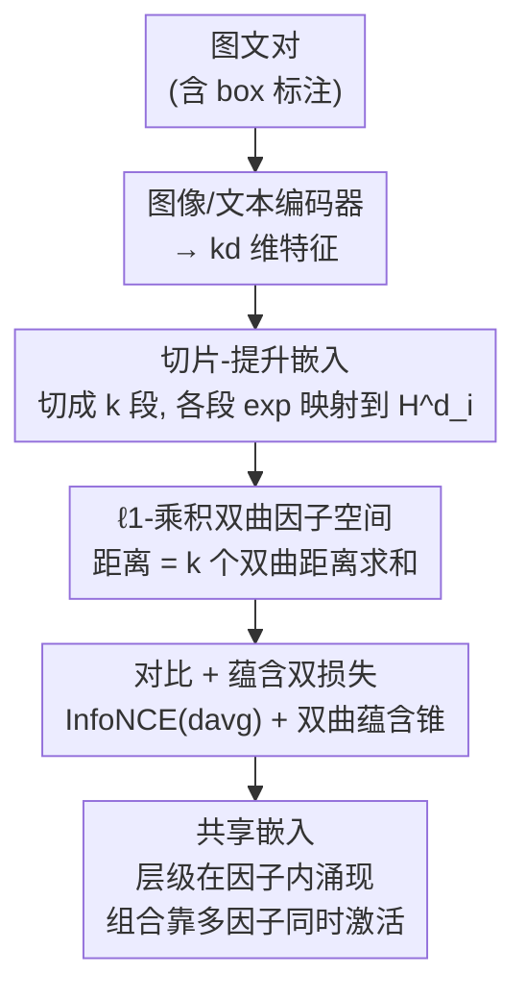

# PHyCLIP: $\ell_1$-Product of Hyperbolic Factors Unifies Hierarchy and Compositionality in Vision-Language Representation Learning

**会议**: ICLR 2026  
**OpenReview**: [https://openreview.net/forum?id=I3Ct1eDmVI](https://openreview.net/forum?id=I3Ct1eDmVI)  
**代码**: https://github.com/tksmatsubara/PHyCLIP  
**领域**: 多模态VLM / 表示学习  
**关键词**: 视觉语言模型, 双曲几何, 乘积度量空间, 组合性, 层级结构

## 一句话总结
PHyCLIP 把图文嵌入空间从"单个双曲空间"换成"$k$ 个双曲因子的 $\ell_1$-乘积度量空间"，让概念家族内部的 is-a 层级在各个双曲因子里自发涌现，而跨家族的组合（"狗 + 车"）则由 $\ell_1$ 求和的可加几何捕捉，类似布尔代数，从而在零样本分类、检索、层级分类和组合理解四类任务上同时超过 CLIP / MERU / HyCoCLIP。

## 研究背景与动机
**领域现状**：以 CLIP 为代表的视觉语言模型通过对比预训练，把图像和文本压成一个共享空间里的单点向量，靠余弦相似度做零样本迁移。为了表达概念之间的 is-a 层级（树状分类体系，节点随深度指数增长），MERU、HyCoCLIP 等工作把嵌入抬升到**双曲空间**——双曲几何的体积随半径指数膨胀，天然适配树的指数增长，并用双曲蕴含锥（entailment cone）编码偏序关系。

**现有痛点**：语义其实有两种结构需要同时表达。一是**层级**（hierarchy）：`dog ⪯ mammal ⪯ animal`，同一概念家族内部的 is-a 关系。二是**组合性**（compositionality）：`"a dog in a car"` 同时蕴含 `dog` 和 `car`，是跨越"动物"和"交通工具"两个家族的合取。把整张图压成一个点，很难同时忠实编码这两种结构。

**核心矛盾**：双曲几何擅长层级，却**没有一个标准的组合算子**——双曲空间里的 Möbius 加法既不对齐普通向量加法也不对齐布尔结构，蕴含锥的区域交集虽能近似合取，但对任意共现没有表达效率保证。反过来，经典的布尔代数 / 词袋 / word2vec 向量加法擅长组合，却编码不好层级。论文用一条命题点破了这个矛盾的根源：$n$ 个原子概念的布尔格 $(\{0,1\}^n, d_{\mathrm{Ham}})$ 在合适的逐因子缩放后可以**等距嵌入 $\ell_1$-乘积度量空间**，但**对任意 $d\ge 2,\,n\ge 2$ 都无法等距嵌入单个双曲空间 $\mathbb{H}^d$**（命题 1）。也就是说，单一双曲空间从几何上就装不下布尔式的组合。

**本文目标**：找一个几何空间，让层级在"局部"涌现、组合在"全局"可加，且两者互不干扰。

**切入角度**：作者借两条经典对应——(i) 度量树能以低失真嵌入双曲空间（Sarkar 定理）；(ii) 带 Hamming 距离的有限布尔代数能等距嵌入 $\ell_1$ 空间。把布尔代数里代表原子概念的每个比特 $\{0,1\}$，**替换成一个代表概念家族的双曲因子**（动物、交通、食物各一个因子），多个因子被同时激活就表达了组合。

**核心 idea**：用"$k$ 个双曲因子的 $\ell_1$-乘积度量空间 $(\mathbb{H}^d)^k$"代替"单个双曲空间"——家族内层级落在单个因子里，跨家族组合由 $\ell_1$ 求和承担。

## 方法详解

### 整体框架
PHyCLIP 的输入是图文对，输出是 $\ell_1$-乘积度量空间里的一组嵌入；整体只改了 CLIP 的"嵌入空间几何"和"距离/损失"，编码器骨架照旧。具体地，图像编码器和文本编码器各产出一个 $kd$ 维特征向量，被**切成 $k$ 段**、每段 $d$ 维；第 $i$ 段经指数映射抬升到第 $i$ 个双曲因子 $\mathbb{H}^d_i$，得到 $x^{(i)}$，于是一个实例被表示成元组 $X=(x^{(1)},\dots,x^{(k)})\in(\mathbb{H}^d)^k$。两点之间的距离不是某个单一空间的测地距，而是 $k$ 个双曲因子距离的 $\ell_1$ 求和。训练沿用 HyCoCLIP 的 box 监督（图像 box = 物体级裁剪，文本 box = 名词短语），用对比损失把配对拉近、用蕴含损失把"更具体"的实例约束进"更一般"实例的双曲蕴含锥里。

### 关键设计

**1. $\ell_1$-乘积双曲因子空间：让层级与组合各管一摊**

这是全文的几何核心，直接对准"单空间装不下两种结构"的矛盾。空间被定义为 $k$ 份 $d$ 维双曲空间的笛卡尔积 $(\mathbb{H}^d)^k$，配以 $\ell_1$-乘积度量

$$d_1(X,Y)=\sum_{i=1}^{k} d_{\mathbb{H}^d_i}\!\big(x^{(i)},y^{(i)}\big),\qquad d_{\mathrm{avg}}(X,Y)=\tfrac{1}{k}\,d_1(X,Y).$$

每个双曲因子 $\mathbb{H}^d_i$ 负责一个概念家族的 is-a 分类树（如"动物"或"交通工具"），因子**内部**用标准双曲嵌入 + 双曲蕴含锥编码层级；因子**之间**靠 $\ell_1$ 把各家族的距离直接相加，这种可加几何正好对应布尔代数里"多个概念取并"的合取语义。论文用定理 2 证明：$k$ 棵度量树的 $\ell_1$-乘积可以 $(1+\varepsilon)$ 拟等距地嵌入 $k$ 个二维双曲因子的 $\ell_1$-乘积，从而把"树状层级 + 布尔式组合"的双结构同时塞进同一个空间。和此前的混合曲率（mixed-curvature）模型不同，PHyCLIP **所有因子都是负曲率双曲、乘积度量是 $\ell_1$ 而非黎曼 $\ell_2$**——这两个选择都有理论支撑，也在消融里被验证（见下）。$\ell_1$ 的另一个直接好处体现在检索：当文本里指定的物体在候选图里缺席、或图里多出未提及的物体时，对应因子会产生很大的距离惩罚，使难负样本更可分；而单一双曲空间会把"有无某物体"隐式编码成层级关系，反而削弱了这类惩罚。

**2. 切片-提升嵌入与可学习曲率：把编码器输出接进乘积空间**

为了不动编码器骨架就接入新几何，做法是把 $kd$ 维特征切成 $k$ 段、每段 $d$ 维 $v^{(i)}$，再各自经指数映射（exponential map）抬升到对应双曲因子作为 $x^{(i)}$。每个因子采用 Lorentz 模型，曲率为**可学习**的 $-\alpha_i$。曲率为什么要学？因为当因子的负曲率 $\alpha_i$ 被乘以 $1/c^2$ 时，黎曼度量被缩放 $c^2$、任意两点距离变成原来的 $c$ 倍——这等价于给加权 $\ell_1$-乘积度量学习了第 $i$ 个因子的组合权重。论文设 $k=64$、$d=8$（总维 512），全部曲率只引入 $k=64$ 个额外参数，相对 86M 的 ViT 可忽略；$\cosh/\sinh/\mathrm{arcosh}$ 这些算子在因子间完全并行、每次嵌入只算一次，墙钟时间仍由 ViT 和文本编码器主导。值得注意的是，小曲率并不等于该因子被强调：如果某实例在某因子里的嵌入都贴着原点，那个因子就被有效地"降权关闭"——这正是后面可视化里"无关家族因子不被使用"的机制来源。

**3. 对比 + 蕴含双损失与 box 监督：在乘积空间上对齐图文并约束偏序**

训练目标是对比损失与蕴含损失的加权和 $\mathcal{L}_{\text{overall}}=\mathcal{L}_{\text{cont}}+\gamma\,\mathcal{L}_{\text{ent}}$。对比损失用标准 InfoNCE，但把空间距离换成上面的平均距离 $d_{\mathrm{avg}}$：

$$\mathcal{L}_{\text{cont}}(\{X_b\},\{Y_b\})=-\sum_{b\in B}\log\frac{\exp(-d_{\mathrm{avg}}(X_b,Y_b)/\tau)}{\sum_{a\in B}\exp(-d_{\mathrm{avg}}(X_b,Y_a)/\tau)},$$

并在图-文、文-图、图box-文box、文box-图box 四个方向上取平均。蕴含损失沿用双曲蕴含锥：对每个因子里的点 $y^{(i)}$ 定义顶点在 $y^{(i)}$、半张角为 $\omega(y^{(i)})$ 的测地锥 $C(y^{(i)})$，锥内的点都被视为比 $y^{(i)}$ 更具体（$x^{(i)}\preceq y^{(i)}$）；当外角 $\phi(x^{(i)},y^{(i)})$ 超出边界时罚之，逐因子的损失为

$$\mathcal{L}_{\text{ent},i}(X,Y)=\max\!\big(0,\ \phi(x^{(i)},y^{(i)})-\eta\,\omega(y^{(i)})\big),$$

再对 $k$ 个因子取平均、并在图-文、图box-文box、图-图box、文-文box 四类偏序对上求和。box 监督来自 HyCoCLIP 的设定：图像比配对文本更具体（$I\preceq T$，因为文本会忽略细节），而 box（物体裁剪 / 名词短语）比整图整文更一般（$I\preceq I^{\text{box}}$，$T\preceq T^{\text{box}}$），这些偏序通过蕴含损失被注入嵌入，配合 $\ell_1$ 乘积几何让层级和组合都有监督信号去塑形。

### 损失函数 / 训练策略
所有模型都从零在 GRIT 数据集（实际拿到 1400 万图文对、2660 万 box 标注）上训练，图像编码器为 base ViT，超参沿用 HyCoCLIP 官方实现，结果取三次随机种子平均。$\tau$（温度）和各因子曲率 $\alpha_i$ 均可学习，$\gamma,\eta$ 为蕴含损失的权重/边界超参。整套额外几何运算几乎不增加训练开销。

## 实验关键数据

### 主实验
四类任务全面对比 CLIP / MERU / HyCoCLIP（均带 box 监督），PHyCLIP 整体最强。

| 任务 / 数据集 | 指标 | PHyCLIP | HyCoCLIP | 说明 |
|--------|------|------|----------|------|
| 零样本分类 / ImageNet | top-1 | **44.31** | 43.80 | General 数据集增益明显 |
| 零样本分类 / Food-101 | top-1 | **57.26** | 52.64 | 细粒度家族内层级学得更干净 |
| 零样本分类 / CIFAR-100 | top-1 | **59.05** | 58.59 | |
| 检索 COCO Text→Image | R@5 | **58.03** | 57.11 | $\ell_1$ 对难负样本惩罚更强 |
| 检索 COCO Image→Text | R@5 | **70.94** | 69.51 | |
| 层级分类 / WordNet | TIE(↓) | **3.294** | 3.319 | 误分类更靠近真值类 |
| 层级分类 / WordNet | $J$(↑) | **0.8059** | 0.8043 | |
| 组合理解 / SugarCrepe | Overall | **78.32** | 77.99 | 属性-物体绑定更稳 |

VL-CheckList–Object 上 PHyCLIP 对物体位置（中心/中段/边缘）和尺寸（大/中/小）都更鲁棒，例如边缘位置 70.37 vs HyCoCLIP 67.80。

### 消融实验
固定总维 $kd$，调因子数 $k$、乘积度量类型和曲率：

| 配置 | ImageNet | Food-101 | COCO R@5(I) | TIE(↓) | 说明 |
|------|---------|---------|------|------|------|
| $k{=}1$（≈HyCoCLIP） | 52.64 | 57.11 | 69.51 | 3.319 | 不分解，多数指标最差 |
| $k{=}64,d{=}8,\ell_1$ | **57.26** | 58.03 | **70.94** | 3.294 | 主配置，多数指标峰值 |
| $k{=}128,d{=}4,\ell_1$ | 53.96 | 57.79 | 71.18 | 3.284 | 过细分解反伤家族内层级（Food-101 掉） |
| $k{=}64,d{=}8,\ell_2$ | 53.39 | 57.09 | 70.53 | 3.367 | 黎曼乘积一致变差 |
| $k{=}64,d{=}8,\ell_\infty$ | 10.33 | 8.77 | 14.51 | 9.697 | $\ell_\infty$ 直接崩溃 |
| mixed-curvature($\ell_2$) | 49.05 | 56.72 | 70.81 | 3.712 | 混合曲率整体劣于本方法 |

### 关键发现
- **分解本身有效**：$k=1$（等价 HyCoCLIP）在大多数指标上最差，增大 $k$ 普遍变好，多数指标在 $k=64$ 或 $128$ 达峰；但 $k=128$ 时 Food-101 显著掉点，说明过度精细的分解会损害家族内分类体系的表达。
- **度量类型是命门**：把 $\ell_1$ 换成黎曼 $\ell_2$ 一致变差，换成 $\ell_\infty$ 训练直接崩（ImageNet 仅 10.33），实证支持"$\ell_1$ 才是聚合跨家族组合的正确方式"。
- **因子特化自发涌现**：可视化显示因子 $i{=}39$ 编码哺乳动物的 is-a 树（"dog"在此处范数最大、在 $i{=}9$ 贴原点），因子 $i{=}9$ 编码车辆/随身物（"car"反之）；而"a dog and a car"会**同时**激活两因子，对两个单概念提示取逐因子 max 检索到的图像与组合提示几乎一致——这正是布尔代数"取并"的行为，且全程没有对因子分配或词间层级做任何显式监督。

## 亮点与洞察
- **用一条不可嵌入性命题定了几何选择**：命题 1 直接证明布尔格能等距进 $\ell_1$-乘积、却进不了单个双曲空间，把"为什么必须换空间"从经验观察上升为几何必然，是全文最有说服力的地方。
- **"每个比特换成一个双曲因子"的类比很漂亮**：把布尔代数的离散比特连续松弛成双曲因子，既保住组合（多因子激活=取并），又给每个因子留出表达家族内层级的空间，一个设计同时解决两件事。
- **可迁移的 trick**：把"单一度量空间"拆成"乘积度量空间 + 逐因子可学习曲率/权重"，这种几何分解几乎零成本（仅 64 个曲率参数），可迁移到任何需要同时表达层级与组合的表示学习场景（如知识图谱嵌入、推荐里的多属性合取）。
- **解释性是几何带出来的副产品**：因子特化、组合即多因子同时激活，都不是额外约束逼出来的，而是 $\ell_1$-乘积几何训练后自然涌现，可视化能直接读出"哪个因子管哪个家族"。

## 局限与展望
- **对物间关系（relation）和物体交换较弱**：在 SugarCrepe 的 relation 替换、object swap 子集上有小幅下降，作者归因于布尔式几何天生不强调对象间的关系结构——它擅长"有没有某物体"，不擅长"谁对谁做了什么"。
- **专门数据上偏弱**：纹理（DTD）、卫星（EuroSAT）等 specialized 数据相对 GRIT 是分布外，PHyCLIP 并非每个数据集都最优，且 FGVC-Aircraft 等细粒度集差距虽小但未夺冠。
- **因子数需要调**：$k$ 太小（不分解）和太大（过细分解伤家族内层级）都不好，$k=64$ 是经验最优，换数据集/骨架可能要重调；因子与概念家族的对应是涌现的、不可控指定。
- **改进方向**：为关系类组合补一种"非布尔"的几何分量，或把因子分配从纯涌现改为弱监督引导，可能同时改善 relation/swap 短板与可控性。

## 相关工作与启发
- **vs HyCoCLIP**：HyCoCLIP 在单个双曲空间里用 box 监督捕捉模态内层级；PHyCLIP 复用其 box 监督和训练协议，但把空间换成 $k$ 个双曲因子的 $\ell_1$-乘积。消融里 $k=1$ 即退化为 HyCoCLIP，说明增益主要来自"分解 + $\ell_1$"这层几何改造，而非新数据或新损失。
- **vs MERU**：MERU 首次把 CLIP 抬升到单个双曲空间并用蕴含锥表示层级；PHyCLIP 指出单空间装不下布尔式组合（命题 1），用乘积度量补上组合维度。
- **vs 混合曲率模型（Gu et al. 2019 等）**：它们也用乘积空间，但混了欧氏/球面/双曲且用黎曼 $\ell_2$ 度量；PHyCLIP 坚持"全因子负曲率 + $\ell_1$ 度量"并给出理论依据，消融中混合曲率整体更差。
- **vs 序嵌入 / box 嵌入（Vendrov et al. 2016；Vilnis et al. 2018）**：这类区域嵌入靠区域包含/相交表达层级与合取；论文在理论上把序嵌入视为布尔格的连续松弛，并证明序嵌入与 PHyCLIP 都能支持布尔代数级别的组合，而单个双曲空间不能。

## 评分
- 新颖性: ⭐⭐⭐⭐⭐ 用"$\ell_1$-乘积双曲因子"统一层级与组合，并给出可嵌入/不可嵌入的几何理论，角度新且扎实。
- 实验充分度: ⭐⭐⭐⭐ 四类任务 + 三种度量/因子数消融 + 因子特化可视化，较完整；专门域和 relation 类仍有短板。
- 写作质量: ⭐⭐⭐⭐⭐ 理论背景到方法到可视化层层递进，命题与定理把动机讲得很清楚。
- 价值: ⭐⭐⭐⭐ 几乎零成本改造、即插到 CLIP 类模型，且带来可解释的因子结构，对表示学习有方法论启发。

<!-- RELATED:START -->

## 相关论文

- [\[ICLR 2026\] U-MARVEL: Unveiling Key Factors for Universal Multimodal Retrieval via Embedding Learning](u-marvel_unveiling_key_factors_for_universal_multimodal_retrieval_via_embedding_.md)
- [\[CVPR 2026\] MOON2.0: Dynamic Modality-balanced Multimodal Representation Learning for E-commerce Product Understanding](../../CVPR2026/multimodal_vlm/moon20_dynamic_modality-balanced_multimodal_representation_learning_for_e-commer.md)
- [\[ICLR 2026\] Reversible Primitive–Composition Alignment for Continual Vision–Language Learning](reversible_primitivecomposition_alignment_for_continual_visionlanguage_learning.md)
- [\[ICLR 2026\] Modality Alignment across Trees on Heterogeneous Hyperbolic Manifolds](modality_alignment_across_trees_on_heterogeneous_hyperbolic_manifolds.md)
- [\[ICLR 2026\] Fed-Duet: Dual Expert-Orchestrated Framework for Continual Federated Vision-Language Learning](fed-duet_dual_expert-orchestrated_framework_for_continual_federated_vision-langu.md)

<!-- RELATED:END -->
