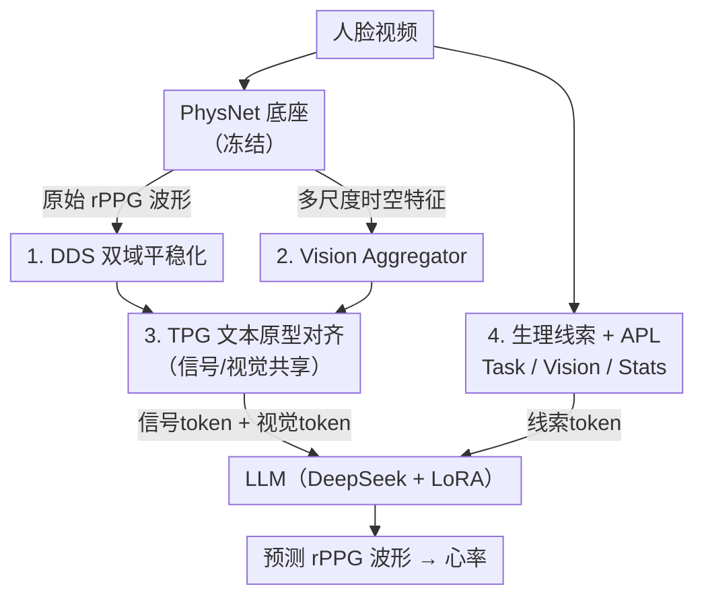

# PhysLLM: Harnessing Large Language Models for Cross-Modal Remote Physiological Sensing

**会议**: ICLR 2026  
**OpenReview**: [https://openreview.net/forum?id=aR43t8OEeW](https://openreview.net/forum?id=aR43t8OEeW)  
**代码**: 待确认  
**领域**: 多模态VLM  
**关键词**: rPPG, 远程生理测量, 大语言模型, 跨模态对齐, 心率估计

## 一句话总结
PhysLLM 把一个冻结的 CNN（PhysNet）当 rPPG 底座，用「双域平稳化 + 多尺度视觉聚合 + 文本原型对齐」把信号和视觉特征翻译成 LLM 能读懂的 token，再配上由 LLaVA/统计量生成的生理线索 prompt，让大语言模型从人脸视频里估计心率，在四个数据集和跨域测试上都拿到 SOTA。

## 研究背景与动机
**领域现状**：远程光电容积脉搏波（rPPG）通过分析皮肤因血流引起的细微颜色变化，从普通摄像头视频里无接触地估计心率、血压等生理指标，比 ECG/PPG 这类贴片式接触测量更适合日常持续监护。当前主流是 CNN / Transformer 端到端模型，编码器抽特征后直接送进 estimator 回归波形。

**现有痛点**：这类纯视觉模型对运动模糊、遮挡、低分辨率、光照变化等视觉噪声非常敏感，且通常只吃单一视频流，长时序建模能力弱，真实场景里鲁棒性差。LLM 擅长长程依赖建模，看似是补长时序短板的好工具，但它本质是面向离散文本 token 设计的，直接拿来处理 rPPG 这种连续、对噪声敏感的信号，会出现「离散操作 vs 连续信号」的根本错配，表示质量差、噪声放大。

**核心矛盾**：LLM 的长程时序推理能力 与 rPPG 信号的连续/含噪本质之间存在表征鸿沟——既要借 LLM 的语义先验和长时序能力，又不能把信号硬塞进文本空间导致失真。

**本文目标**：在不对 LLM 做重度微调的前提下，(1) 先把底座信号变「干净平稳」；(2) 把信号/视觉特征「翻译」进 LLM 语义空间；(3) 给 LLM 注入 rPPG 专属的上下文先验，让它能根据光照/运动等场景自适应。

**切入角度**：作者借鉴时序领域的 reprogramming 思路（如 Time-LLM 用可学习 prompt 把时序对齐到 token 空间），但发现 rPPG 还需要补上视觉上下文和生理统计先验，于是设计一个 CNN 与 LLM 协同优化的框架，而不是二选一。

**核心 idea**：用「文本原型」当语义锚点，把信号 token、视觉 token、文本线索 token 统一对齐到 LLM 可解释的空间，让冻结底座负责局部时空特征、LLM 负责长程时序推理，二者协同出鲁棒的心率估计。

## 方法详解

### 整体框架
PhysLLM 的输入是人脸视频，输出是预测的 rPPG 波形（再换算成心率）。整条管线分两大支：右侧的 **Text-Vision-Sequence Embedding 生成**负责把底座产出的信号和视觉特征翻译成 LLM token；左侧的 **生理线索感知 Prompt 学习**负责生成场景自适应的 prompt token。具体地，一个冻结的 PhysNet 底座先吐出原始 rPPG 波形和多尺度时空特征；波形经 **DDS 双域平稳化**去噪稳态化，多尺度特征经 **Vision Aggregator** 融合；两路再共享同一个 **TPG 文本原型对齐**模块映射到 LLM 语义空间，得到信号 token 与视觉 token。与此并行，**生理线索 + APL** 把任务描述、LLaVA 视觉描述、信号统计三类线索压缩融合成 cue token。最后信号/视觉/线索三类 token 一起喂给带 LoRA 的 LLM（默认 DeepSeek-1.5B），回归出最终波形，用 MSE 监督。

### 关键设计

**1. DDS 双域平稳化算法：把含噪信号先变「稳」再喂下游**

底座吐出的原始波形 $x\in\mathbb{R}^{B\times L}$ 噪声大、非平稳，直接当 token 会把噪声带进 LLM。DDS 在时域和频域两路同时做平稳化。时域先做标准化 $x'=\frac{x-\mu}{\sigma+\epsilon}$（$\epsilon=10^{-5}$），再用指数滑动平均做平滑 $z^{time}_i=\alpha\cdot x'_i+(1-\alpha)\cdot z_{i-1}$，作者在附录里证明了它的平稳性。频域用离散小波变换（DWT，$J=3$ 层）把信号拆成近似系数和细节系数，对每个系数分别标准化+平滑后再用逆变换 IDWT 重建出频域平稳表示 $z^{fre}$。最后用一个**可学习**系数 $\beta\in[0,1]$ 自适应加权两路：$z=(1-\beta)\cdot z^{time}+\beta\cdot z^{fre}$。这样既保留了时域的周期一致性，又借频域分解抑制了宽频噪声，比单纯时域滤波更能在保形的同时降噪。

**2. Vision Aggregator 多尺度视觉聚合：用深层语义去补浅层细节**

底座的多尺度特征 $F=[f_1,\dots,f_M]$ 里，深层特征语义强、与文本空间对齐好，浅层特征细粒度信息丰富但语义弱。VA 先把各层投影到统一长度，然后**以深层特征 $F_M$ 作 query**、把浅层拼接 $X=\text{Concat}(F_1,\dots,F_{M-1})$ 作 key/value 做交叉注意力 $F_{cross}=\text{CrossAttention}(F_M,X,X)$，动态从浅层抽回丢失的细节；再用自注意力 $F_{self}=\text{SelfAttention}(F_{cross})$ 捕捉内部依赖；最终用可学习标量 $\gamma_1,\gamma_2$ 残差融合 $F_{visual}=F_M+\gamma_2\cdot(F_{cross}+\gamma_1\cdot F_{self})$。相比简单拼接或固定加权，这种「深层查询浅层」的层级注意力让融合表示既保持高层语义对齐、又补齐了细粒度血流线索。

**3. Text Prototype Guidance（TPG）跨模态对齐：用少量文本原型当语义锚点**

rPPG 信号和视觉特征既不可直接编辑，也很难用自然语言无损描述，连续高维的特性让它们难以转成 LLM 能读的符号表示。最朴素的做法是拿整个词嵌入表 $E\in\mathbb{R}^{V\times D}$ 去 reprogram，但词表巨大、重编程空间稠密低效。TPG 改为通过线性探测维护一小撮**文本原型** $E'\in\mathbb{R}^{V'\times D}$（$V'\ll V$）当锚点。给定输入特征 $X$，先自注意力 $X_{self}=\text{SelfAttention}(X)$，与原型相加 $E'_{fusion}=E'+X_{self}$，再让原型对 $X$ 做交叉注意力把特征「翻译」过去，经残差和 FFN 得到对齐后的 token $T_{out}=TPG(X)$。关键是**信号和视觉共享同一个 TPG 模块**（$X$ 同时承载信号特征和视觉特征两种含义），让两种模态在同一组文本原型上学习潜在关联，显著缩小了序列、视觉、文本三种模态之间的鸿沟。

**4. 生理线索感知 Prompt 学习 + APL：给 LLM 注入 rPPG 专属上下文先验**

光靠对齐还不够，LLM 缺少 rPPG 任务的领域常识。作者构造三类线索 token：**Task Cue** 把 rPPG 文献里关于域差异（肤色、种族、性别、年龄、光照）的共识描述用 LLM 原生 tokenizer 编码 $C_{task}=\text{Tokenizer}(\mathcal{P})$；**Vision Cue** 取视频中心帧用 LLaVA 按「面部解剖、瞬时表情、环境光照」三个方向生成描述再 tokenize；**Stats Cue** 从底座信号 $x_{enc}$ 计算 min/max/median、趋势（一阶差分 $\Gamma(x)=\sum_{i=2}^{T}(x_i-x_{i-1})$）、符号、TopK 等统计量构成符号化先验 $C_{stats}=\text{Tokenizer}(\mathcal{S})$——这一步专门补上静态视觉描述抓不到的时序血流变化。三类线索不是固定加权拼接，而是经 **Adaptive Prompt Learning（APL）**：每类先过带温度的注意力压缩器 $E_k=\text{AttentiveCompressor}_k(C_k)$，再与可学习参数矩阵 $W=[W_{task},W_{vision},W_{stats}]$ 逐元素相乘求和 $T_{cue}=\sum_{k}W(k)\odot E_k$，让模型根据不同样本自适应地决定哪类线索更关键，而不是用一刀切的固定比例。

### 损失函数 / 训练策略
底座 PhysNet 冻结，只训练 DDS、VA、TPG、APL 以及 LLM 的 LoRA 适配器。把 $T_{cue}$、$T_{vision}=TPG(F_{visual})$、$T_{signal}=TPG(z)$ 一起送入 LLM 预测波形 $\hat{y}$，用纯 MSE 监督 $\mathcal{L}_{MSE}=\frac{1}{n}\sum_{i=1}^{n}(y_i-\hat{y}_i)^2$，$y$ 为真值 PPG 波形。默认 LLM 为 DeepSeek-1.5B。

## 实验关键数据

### 主实验
四个基准数据集（UBFC-rPPG / PURE / BUAA / MMPD）的同库测试，指标为 MAE↓、RMSE↓（bpm）、Pearson R↑：

| 数据集 | 指标 | PhysLLM | 次优 SOTA | 说明 |
|--------|------|---------|-----------|------|
| UBFC-rPPG | MAE/RMSE/R | 0.21 / 0.57 / 0.99 | RhythmFormer 0.50 / 0.78 | 平稳拟合，长时心率跟踪稳 |
| PURE | MAE/RMSE/R | 0.17 / 0.35 / 0.99 | RhythmFormer 0.27 / 0.47 | 对头动干扰鲁棒 |
| BUAA | MAE/RMSE/R | 6.48 / 8.48 / 0.63 | Green 6.89 / 10.39 | 强光照变化下明显领先 |
| MMPD | MAE/RMSE/R | 4.36 / 10.76 / 0.65 | RhythmFormer 4.69 / 11.31 | 真实复杂场景最优 |

跨域泛化（双源训练→单目标测试，目标为最难的 MMPD）：在 $P+U\to M$ 上 PhysLLM 把 MAE/RMSE 降到 9.95/14.96，相对次优再降 1.05/2.34 bpm；三源训练→单目标测试同样全面领先，说明它学到的是域不变的 rPPG 知识而非混淆域特定特征。

### 消融实验
主模块消融（UBFC-rPPG，MAE/RMSE）：

| 配置 | MAE | RMSE | 说明 |
|------|-----|------|------|
| Full（DDS+VA+TPG） | 0.21 | 0.57 | 完整模型 |
| w/o DDS | 0.25 | 0.76 | 去平稳化，误差上升 |
| w/o TPG | 0.27 | 0.92 | 去跨模态对齐，掉点最明显 |
| w/o VA | 0.34 | 1.05 | 去多尺度融合 |
| 仅 TPG | 0.32 | 1.00 | 三模块单留其一时 TPG 最强 |

Prompt 组件消融（UBFC-rPPG）显示：去掉 APL 自适应学习时 MAE 从 0.21 暴涨到 1.31（约 76% 退化），是最关键的组件；Vision+Task 优于 Stats+Task，说明视觉 prompt 与 rPPG 线索更契合。

### 关键发现
- **TPG 与 APL 是两大支柱**：去掉 TPG 在主模块里掉点最显著，去掉 APL 自适应学习则带来全局最大退化（76%），印证「先把模态对齐 + 再自适应选线索」缺一不可。
- **LLM 的预训练知识是必需的**：把 LLM 换成无预训练的时序 Transformer（Sundial）后 MAE 从 0.21/0.17 暴涨到 3.35/4.05，说明起作用的是 LLM 的预训练语义先验而非单纯 Transformer 架构；DeepSeek、BERT、GPT2 均能 work，DeepSeek 最佳。
- **难数据集收益更大**：在光照/运动复杂的 BUAA、MMPD 上提升幅度比简单库更明显，呼应「补长时序 + 注入场景先验」对真实场景的价值。

## 亮点与洞察
- **「翻译」而非「微调」**：用一小撮文本原型当语义锚点，把连续信号 reprogram 进 LLM 空间，避开了对大模型的重度微调，是把 LLM 嫁接到非文本模态的轻量范式，可迁移到 ECG/EEG 等其他生理信号。
- **冻结底座 + 可学协同**：保留 PhysNet 已验证的鲁棒生理先验不动，只训练增强模块和 LoRA，既稳又省，体现了「让专家模型做专家的事、LLM 做长程推理」的分工思路。
- **信号统计当 prompt**：把 min/max/median/趋势/TopK 这类廉价统计量符号化成 token 补进 prompt，专门弥补静态视觉描述抓不到的时序血流变化，是个很实用、可复用的「数值→语言先验」trick。

## 局限与展望
- 作者承认 rPPG 在真实场景仍受光照、运动、肤色多样性强烈干扰；虽有改善但 BUAA/MMPD 上 MAE 仍有 4–6 bpm，离临床级还有距离。
- 依赖外部大模型（LLaVA 生成视觉线索、DeepSeek 当主干）带来不小的推理开销和部署成本，论文未充分讨论实时性，对端侧持续监护是潜在瓶颈。
- 线索质量受 LLaVA 描述准确度影响，遮挡/极端光照下 LLaVA 描述可能失真，缺少对线索错误的鲁棒性分析。
- 仅用 MSE 监督波形，未引入频域/峰值约束，对心率以外的指标（如 HRV、血压）泛化性还需验证。

## 相关工作与启发
- **vs 纯 CNN/Transformer rPPG（PhysNet、PhysFormer、RhythmFormer）**：它们直接从视频回归波形，对视觉噪声敏感、长时序弱；PhysLLM 在其上叠加 LLM 长程推理与多模态线索，难数据集上提升更大。
- **vs Time-LLM 等时序 reprogramming**：Time-LLM 用可学习 prompt 把通用时序对齐到 token 空间；PhysLLM 借鉴其 reprogramming 思路，但额外补上视觉上下文（LLaVA）和 rPPG 统计先验，是面向生理信号的领域化扩展。
- **vs 视觉-语言多模态 rPPG**：本文是首个把 LLM 引入 rPPG 测量、显式建立生理动态与上下文语义之间可解释连接的工作。

## 评分
- 新颖性: ⭐⭐⭐⭐⭐ 首个把 LLM 引入 rPPG，TPG 共享原型 + 生理线索 prompt 的组合很有想法
- 实验充分度: ⭐⭐⭐⭐ 四库 + 跨域 + 多 LLM + 细致消融，但缺实时性/开销分析
- 写作质量: ⭐⭐⭐⭐ 框架清晰、公式完整，部分线索细节略散
- 价值: ⭐⭐⭐⭐ 为「LLM 嫁接非文本生理信号」提供了可复用范式

<!-- RELATED:START -->

## 相关论文

- [\[NeurIPS 2025\] CHOICE: Benchmarking the Remote Sensing Capabilities of Large Vision-Language Models](../../NeurIPS2025/multimodal_vlm/choice_benchmarking_the_remote_sensing_capabilities_of_large_vision-language_mod.md)
- [\[ICLR 2026\] XModBench: Benchmarking Cross-Modal Capabilities and Consistency in Omni-Language Models](xmodbench_benchmarking_cross-modal_capabilities_and_consistency_in_omni-language.md)
- [\[CVPR 2026\] CF-IPT: Cross-Modal Fusion Interactive Prompt Tuning of Vision-Language Pre-Trained Model for Multisource Remote Sensing Data Classification](../../CVPR2026/multimodal_vlm/cf-ipt_cross-modal_fusion_interactive_prompt_tuning_of_vision-language_pre-train.md)
- [\[ICLR 2026\] CityLens: Evaluating Large Vision-Language Models for Urban Socioeconomic Sensing](citylens_evaluating_large_vision-language_models_for_urban_socioeconomic_sensing.md)
- [\[ICLR 2026\] FLARE: Fully Integration of Vision-Language Representations for Deep Cross-Modal Understanding](flare_fully_integration_of_vision-language_representations_for_deep_cross-modal_.md)

<!-- RELATED:END -->
