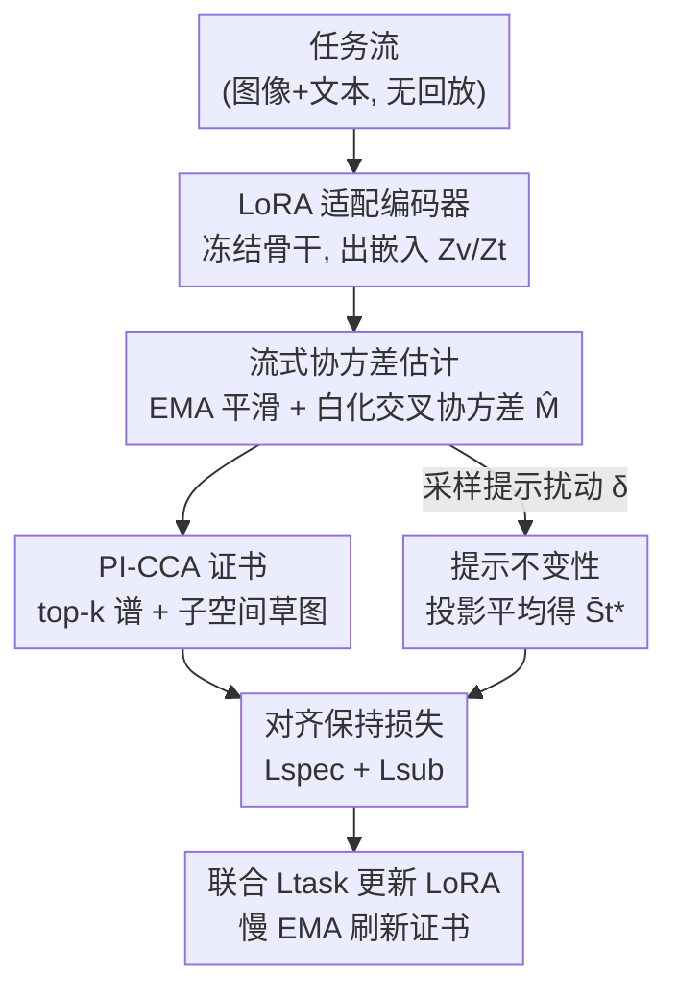

# PI-CCA: Prompt-Invariant CCA Certificates for Replay-Free Continual Multimodal Learning

**会议**: ICLR 2026  
**OpenReview**: [https://openreview.net/forum?id=pn2H6YeOv2](https://openreview.net/forum?id=pn2H6YeOv2)  
**代码**: 待确认  
**领域**: 多模态VLM / 持续学习  
**关键词**: 视觉-语言持续学习, 无回放, 典型相关分析(CCA), 提示鲁棒性, 零样本保持

## 一句话总结
PI-CCA 把视觉-语言模型(VLM)的「遗忘」重新定义为图文对齐几何的漂移，用一张紧凑的「CCA 证书」（top-k 典型相关谱 + 子空间草图）作为不变量，在无回放、常数显存下约束 LoRA 微调，并通过对提示扰动取平均获得提示不变性，在 MTIL / X-TAIL / VLCL / ConStruct-VL 四个基准上取得无回放方法的 SOTA。

## 研究背景与动机
**领域现状**：CLIP 这类基础 VLM 靠图文对齐获得强零样本识别与检索能力。部署到非平稳数据流时，需要持续适配新领域，但出于隐私/版权/成本通常不能存旧数据（replay-free）。视觉-语言持续学习(VL-CL)的目标，是在学新域的同时保住跨模态对齐（即零样本能力）和对提示/分布变化的鲁棒性。

**现有痛点**：主流 VL-CL 方法走的是「代理约束」路线——蒸馏 logit/相似度分布、对齐相似度矩阵的非对角元、用 router/adapter 隔离新旧知识、或合成伪回放。它们约束的是结果量（similarity、logit、weight、route），而不是支撑跨模态泛化的对齐对象本身。

**核心矛盾**：约束代理量 ≠ 约束对齐几何。后果有三：(i) 真正决定零样本性能的对齐几何仍会缓慢漂移；(ii) 很多方法依赖参考语料、生成器或任务元数据，而这些未必拿得到；(iii) 即便平均指标变好，对提示/风格变化依然脆弱。

**本文目标**：找一个无回放的「原则」，把图文对齐当作一等不变量直接保住，而不是当成代理目标的副产品；同时显式地获得提示不变性。

**切入角度**：作者观察到 CLIP 的检索/开放词表识别本质依赖「白化后的图文交叉协方差」的几何结构——它的典型相关谱（多大程度对齐）和典型子空间（往哪些方向对齐）。如果能把这套几何骨架压成一张小证书并在训练中强制对齐，就能直接守住零样本能力。

**核心 idea**：用「典型相关分析(CCA)证书」记录对齐几何的谱 + 子空间不变量，训练新任务时只用 mini-batch 统计量去匹配这张证书（无需旧数据），并对提示扰动取投影平均来获得提示不变性。

## 方法详解

### 整体框架
PI-CCA 解决的是「学新任务时不让图文对齐几何漂移」。整体是一条无回放的串行流水线：任务流逐个进来，冻结的图像/文本编码器 $f_v, f_t$ 只通过 LoRA 适配，输出嵌入 $Z_v, Z_t$；由 mini-batch 算出协方差并做 EMA 平滑，进而构造白化交叉协方差 $\widehat{M}$；对 $\widehat{M}$ 做 top-k SVD 得到当前的典型相关谱与子空间，用固定随机草图矩阵 $R_v, R_t$ 压成低维 sketch；同时对一组提示扰动取平均得到提示不变的文本基；最后用「谱保持 + 子空间保持 + 提示不变 + 任务损失」四项联合，只更新 LoRA 参数 $\phi_v, \phi_t$，并用慢 EMA 缓慢刷新证书本身。

### 关键设计

**1. PI-CCA 证书：把对齐几何压成常数显存的「骨架快照」**

针对「代理量约束不住对齐几何」这个根本痛点，作者不存数据也不蒸馏旧 logit，而是直接抓对齐的「骨架」。给定 mini-batch 的中心化嵌入，构造带 ridge 收缩的协方差 $\widehat{\Sigma}_{vv}, \widehat{\Sigma}_{tt}, \widehat{\Sigma}_{vt}$，再算白化交叉协方差 $\widehat{M}=\widehat{\Sigma}_{vv}^{-1/2}\widehat{\Sigma}_{vt}\widehat{\Sigma}_{tt}^{-1/2}$，其 top-k SVD 给出典型相关 $\rho_{1:k}^\star$（谱不变量，表征对齐强度）和典型方向 $U_k^\star, V_k^\star$（方向不变量，表征对齐子空间）。直接存 $U_k^\star, V_k^\star$ 的开销随特征维 $d_v, d_t$ 增长，作者用随机正交草图 $R_v\in\mathbb{R}^{d_v\times h}, R_t\in\mathbb{R}^{d_t\times h}$（$h\ll d_v,d_t$，高斯正交或子采样 Hadamard 变换）把它们投到 $h$ 维，证书写成

$$\text{Cert} := \big(\rho_{1:k}^\star,\ S_v^\star,\ \bar S_t^\star\big),\quad S_v^\star = R_v^\top U_k^\star \in \mathbb{R}^{h\times k}.$$

这样存储与原始维度无关，做到常数显存。和 Mod-X 这类「几何启发但只对齐对比矩阵非对角元」的方法不同，证书锁的是白化交叉协方差的典型谱和子空间本身，是真正决定零样本能力的量。

**2. 提示不变证书：用投影平均消掉子空间内的符号/旋转歧义**

针对「即便平均指标变好仍对提示/风格脆弱」的痛点，文本侧的证书不是用单一提示算出来的，而是对一组提示扰动 $\delta\sim P$（同义词/模板变化）做投影平均。对 $M$ 个扰动各自算原空间投影 $P_t^\star(\delta_m)=V_k^\star(\delta_m)V_k^\star(\delta_m)^\top$ 及其草图 $Q_t^\star(\delta_m)=R_t^\top P_t^\star(\delta_m) R_t$，取平均投影 $\bar Q_t^\star=\frac{1}{M}\sum_m Q_t^\star(\delta_m)$，再取其 top-k 特征向量得到提示不变文本基 $\bar S_t^\star$。关键好处是：直接平均投影矩阵（而非平均基向量）天然消除了典型子空间内部的符号/旋转歧义，无需做 Procrustes 对齐。默认维护一张全局证书（每个模型一张），从一组多样的锚点提示构造。

**3. 谱 + 子空间双保持损失：分别守住「对齐多强」和「往哪对齐」**

证书有了，训练时要用 mini-batch 统计量把当前几何拉回证书。总损失 $L=L_{task}+\lambda_1 L_{spec}+\lambda_2 L_{sub}+\lambda_3 L_{pi}$。谱保持项 $L_{spec}$ 处理近简并奇异值下「按下标硬配对」不稳的问题，改用排序后的配对加 Ky-Fan-k 求和对齐：

$$L_{spec}=\big\|\text{sort}_\downarrow(\widehat\rho_{1:k})-\rho_{1:k}^\star\big\|_2^2 + \xi\Big(\sum_i \widehat\rho_i-\sum_i \rho_i^\star\Big)^2,$$

其中 $\xi\in[0,1]$ 平衡逐元素与总量匹配；想要严格置换不变可换成匈牙利配对（$O(k^3)$），默认用更快的排序代理。子空间项 $L_{sub}$ 用草图 Gram 投影 $\widehat Q_v, \widehat Q_t$ 与证书投影的 Frobenius 距离做主角度的代理（在近等距草图下能保持角度/序），并对特征值裁剪到 $[0,1]$ 再对称化以稳定。消融显示去掉 $\lambda_1$ 或 $\lambda_2$ 掉点最多——谱和方向缺一不可。

**4. 流式无回放估计：EMA 协方差 + 慢 EMA 证书刷新，可微 SVD**

针对「无旧数据、单 batch 估计噪声大」的问题，作者对协方差因子维护 EMA：$\Sigma_{vv}^{(t)}\leftarrow(1-\beta)\Sigma_{vv}^{(t-1)}+\beta\widehat\Sigma_{vv}$（$tt, vt$ 同理），再由平滑后的因子组装 $M^{(t)}$ 并取 top-k SVD。证书本身用慢 EMA 刷新（$\rho^\star\leftarrow(1-\alpha)\rho^\star+\alpha\widehat\rho$，子空间基刷新后过 QR 正交化），在守住对齐骨架的同时留出可控塑性。提示不变项 $L_{pi}$ 进一步对齐扰动投影的均值并收缩其离散度：

$$L_{pi}=\tfrac12\big\|\tfrac1M\textstyle\sum_m \widehat Q_t^{(m)}-\bar Q_t^\star\big\|_F^2 + \tfrac{\eta}{2M}\textstyle\sum_m\big\|\widehat Q_t^{(m)}-\tfrac1M\textstyle\sum_\ell \widehat Q_t^{(\ell)}\big\|_F^2.$$

工程上 $\Sigma^{-1/2}$ 用特征分解（带特征值下限 $\epsilon$）或 Newton-Schulz 迭代实现，可微 SVD 用块幂迭代 + 每步 QR 重正交化，梯度只回传到 $\widehat M$ 不穿过证书。任务损失 $L_{task}$ 与方法无关（InfoNCE / 交叉熵 / 检测损失皆可），梯度联合回传更新 LoRA。

### 损失函数 / 训练策略
总目标即上面的 $L=L_{task}+\lambda_1 L_{spec}+\lambda_2 L_{sub}+\lambda_3 L_{pi}$，可选地加低阶谱矩项 $L_{mom}$（$J\le 2$）。只优化 LoRA 参数 $\phi_v, \phi_t$，骨干冻结。关键超参：证书容量 $k$、草图维 $h$、两套 EMA 系数 $\alpha$（证书）/ $\beta$（协方差）、提示扰动数 $M$ 与强度、ridge 系数 $\gamma$（可用 Ledoit-Wolf 自适应）。默认拐点配置 $(k,h)=(64,256)$。

## 实验关键数据

### 主实验
四个 VL-CL 基准：MTIL（11 域任务增量分类）、X-TAIL（跨域任务无关分类）、VLCL（持续图文检索，8 任务）、ConStruct-VL（结构化概念匹配，7 任务，无回放）。

| 基准 | 指标 | PI-CCA | 次优 | 提升 |
|------|------|--------|------|------|
| MTIL | Avg / Last / Transfer | 76.8 / 75.5 / 73.2 | C-CLIP 75.2 / 73.8 / 70.9 | +1.6 / +1.7 / +2.3 |
| X-TAIL | Avg / Last / Transfer | 68.1 / 66.9 / 64.7 | RAIL 67.4 / 66.2 / 64.2 | +0.7 / +0.7 / +0.5 |
| VLCL | I2T R@1 / T2I R@1 | 48.6 / 37.4 | GIFT† 47.3 / 36.5 | +1.3 / +0.9 |
| ConStruct-VL | FA↑ / AF↓ | 75.2 / 2.7 | GIFT† 73.9 / 3.3 | +1.3 / -0.6 |

PI-CCA 在所有 track 都拿到无回放方法的最优，且在 VLCL 上超过了需要扩散合成回放的 GIFT（标 † 为合成回放），但自己既不存数据也不生成数据。

### 消融实验

| 配置 | MTIL Avg | MTIL Last | VLCL I2T R@1 | ConStruct-VL AF↓ |
|------|----------|-----------|--------------|------------------|
| PI-CCA (full) | 76.8 | 75.5 | 48.6 | 2.7 |
| w/o 谱项 ($\lambda_1=0$) | 74.3 (-2.5) | 73.1 (-2.4) | 46.3 (-2.3) | 3.8 (+1.1) |
| w/o 子空间项 ($\lambda_2=0$) | 74.6 (-2.2) | 73.4 (-2.1) | 45.9 (-2.7) | 3.9 (+1.2) |
| w/o 提示不变 ($\lambda_3=0, M=0$) | 75.3 (-1.5) | 74.0 (-1.5) | 47.1 (-1.5) | 3.3 (+0.6) |
| w/o 证书 EMA ($\alpha=0$) | 75.6 (-1.2) | 74.1 (-1.4) | 47.7 (-0.9) | 3.1 (+0.4) |
| w/o 协方差 EMA ($\beta=0$) | 74.1 (-2.7) | 72.7 (-2.8) | 46.1 (-2.5) | 3.7 (+1.0) |
| 匈牙利配对(精确) | 76.7 (-0.1) | 75.4 (-0.1) | 48.5 (-0.1) | 2.8 |
| SRHT 草图(vs 高斯) | 76.6 (-0.2) | 75.2 (-0.3) | 48.4 (-0.2) | 2.9 |

### 关键发现
- **谱和子空间缺一不可**：去掉 $\lambda_1$ 或 $\lambda_2$ 掉点最多（MTIL Avg 各掉约 2.2-2.5），说明「对齐多强」和「往哪对齐」两个维度都得守。
- **协方差 EMA 比证书 EMA 更关键**：去掉 $\beta$（$\beta=0$）掉 2.7，比去掉 $\alpha$（掉 1.2）严重得多——流式估计的稳定性主要靠协方差平滑。
- **提示不变主要保零样本/抗提示漂移**：去掉 $\lambda_3$ 对检索影响小（-1.5），但在提示扰动应力测试里能显著压低退化斜率，OOD 模板下尤其明显，实用工作区在扰动强度 $s\le 0.6$。
- **排序代理 ≈ 精确匈牙利配对**：两者精度几乎一样（差 0.1），所以默认用更快的排序代理。
- **几何漂移可预测性能下降**：子空间角漂移 $D_{ang}=\sum_i \sin^2\theta_i$ 和谱漂移 $D_\rho=\|\widehat\rho_{1:k}-\rho_{1:k}^\star\|_2$ 越大，MTIL Avg 和 VLCL R@1 掉得越多，其中 $D_{ang}$ 通常是更强的预测因子——为「把遗忘看成对齐几何漂移」提供了相关性证据。

## 亮点与洞察
- **把「遗忘」重新定义为对齐几何漂移**：这是全文最「啊哈」的地方——不去追代理量，而是直接锁白化交叉协方差的典型谱+子空间，几何漂移与性能下降的相关性实验给了这个视角实证支撑。
- **投影平均消歧很巧**：对投影矩阵（而非基向量）取平均天然消掉子空间内符号/旋转歧义，省掉了 Procrustes 对齐这一步麻烦，同时一举把提示鲁棒性塞进同一框架。
- **常数显存 + 生成器无关**：随机草图把证书压到与特征维无关，整套不存数据不建生成器，可与 LoRA 等参数高效适配自由组合，工程上很轻。
- **可迁移思路**：用「紧凑不变量证书 + mini-batch 统计匹配」替代「存数据/蒸馏」的范式，可推广到其他需要保结构的持续学习场景（如保某种表示子空间、保图结构）。

## 局限与展望
- 证书是「全局一张」的默认设定，对任务间对齐几何差异极大的长流是否够用、要不要多证书，论文主要靠 Pareto 扫描说明「小而够」，但极端长程未充分压力测试。
- 提示不变靠对扰动取平均，扰动分布 $P$（同义词/模板/回译）的设计与覆盖范围会直接影响 OOD 提示下的效果；强扰动 $s>0.6$ 时仍会退化。
- 可微 SVD / 白化逆平方根带来额外计算（块幂迭代、Newton-Schulz），单步时延 270-320ms（A100, B=1024），相对纯 adapter 方法更重。
- 大量稳定性技巧（特征值裁剪、stop-gradient、QR 重正交化）说明该几何约束对数值实现较敏感，复现需谨慎。

## 相关工作与启发
- **vs Mod-X / ZSCL（正则/蒸馏）**：它们对齐相似度分布或非对角元、蒸馏 logit，约束的是代理量；PI-CCA 直接约束白化交叉协方差的典型谱与子空间这个对齐对象本身，无需参考语料或教师集成。
- **vs C-CLIP / RAIL / DIKI（架构/参数高效）**：靠对比知识、解析 adapter 或 router 隔离新旧知识；PI-CCA 与这些正交，是一个可叠加在 LoRA 上的几何保持约束，且在 MTIL/X-TAIL 上整体更优。
- **vs GIFT / Smith 等（合成/伪回放）**：用扩散合成对或对抗伪回放补旧数据；PI-CCA 完全无回放、无生成器，却在 VLCL 上超过了合成回放的 GIFT。
- **vs CCA/CKA 表示相似度分析**：(SV)CCA、CKA 在持续学习里多用作「诊断」漂移；PI-CCA 把它从诊断工具升级为可优化的训练约束（证书 + 损失）。

## 评分
- 新颖性: ⭐⭐⭐⭐⭐ 把遗忘重定义为对齐几何漂移并用可微 CCA 证书直接约束，是有原则的新视角。
- 实验充分度: ⭐⭐⭐⭐ 覆盖 4 个 VL-CL 基准 + 多维消融 + 几何-性能相关性 + 提示应力测试，较扎实；超长流/多证书未充分探讨。
- 写作质量: ⭐⭐⭐⭐ 数学记号严谨、动机清晰，但公式密集、工程细节多，门槛偏高。
- 价值: ⭐⭐⭐⭐ 无回放 + 常数显存 + 生成器无关，对隐私受限的 VLM 持续部署有实用价值。

<!-- RELATED:START -->

## 相关论文

- [\[ICLR 2026\] Memory-Free Continual Learning with Null Space Adaptation for Zero-Shot Vision-Language Models](memory-free_continual_learning_with_null_space_adaptation_for_zero-shot_vision-l.md)
- [\[CVPR 2026\] Octopus: History-Free Gradient Orthogonalization for Continual Learning in Multimodal Large Language Models](../../CVPR2026/multimodal_vlm/octopus_history-free_gradient_orthogonalization_for_continual_learning_in_multim.md)
- [\[ICLR 2026\] KeepLoRA: Continual Learning with Residual Gradient Adaptation](keeplora_continual_learning_with_residual_gradient_adaptation.md)
- [\[ICLR 2026\] PSP: Prompt-Guided Self-Training Sampling Policy for Active Prompt Learning](psp_prompt-guided_self-training_sampling_policy_for_active_prompt_learning.md)
- [\[ICLR 2026\] Enhanced Continual Learning of Vision-Language Models with Model Fusion](enhanced_continual_learning_of_vision-language_models_with_model_fusion.md)

<!-- RELATED:END -->
