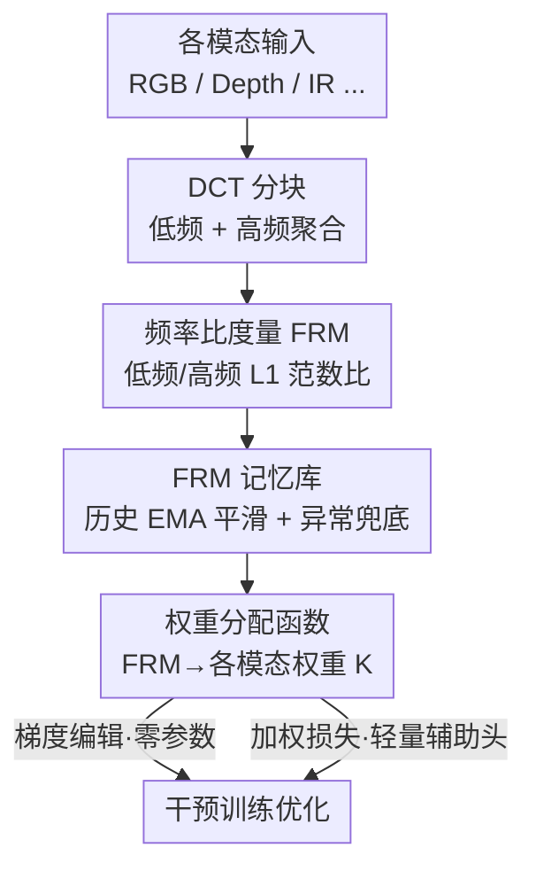

# Plug, Play, and Fortify: A Low-Cost Module for Robust Multimodal Image Understanding

**会议**: ICLR 2026  
**OpenReview**: [https://openreview.net/forum?id=7KluEfmiXG](https://openreview.net/forum?id=7KluEfmiXG)  
**代码**: https://github.com/a6103121/MWAM  
**领域**: 多模态VLM  
**关键词**: 缺失模态, 模态偏好, 频域分析, 即插即用, 鲁棒多模态理解

## 一句话总结
针对多模态模型在推理时缺失某个模态就性能崩溃的问题，作者发现"哪个模态被偏爱"可以在频域里被量化，于是提出频率比度量（FRM）和一个即插即用、几乎零参数的权重分配模块（MWAM），在训练时给被冷落的模态加权、把优化拉平，让多种 CNN/ViT 骨干在各种模态缺失组合下都更鲁棒。

## 研究背景与动机

**领域现状**：多模态视觉理解（分割、检测、分类）习惯同时吃可见光、红外、深度等互补模态来提升精度，但绝大多数方法默认"推理时所有模态都在"。现实里传感器故障、恶劣环境、隐私限制会让某些模态缺席，于是出现了两类应对：一类是**补全式**（imputation），从现有模态重建缺失模态的特征；一类是**免补全式**（imputation-free），把所有模态投到一个模态无关的统一空间里直接推理。

**现有痛点**：补全式需要额外的重建模块，计算开销大、难以部署到资源受限设备；免补全式虽然轻，但补不回丢失的信息，缺模态时仍会掉点。更要命的是作者实测发现：统一空间模型对"缺哪个模态"极其敏感——在 CASIA-SURF 上缺 Depth 时精度从 98.12% 掉到 95.21 甚至更低，而缺 RGB 几乎不影响。也就是说，模型并不平等地依赖每个模态。

**核心矛盾**：这种脆弱性的根源是**训练阶段的失衡学习**。多模态模型在优化时会隐式偏爱某些"主导模态"，让它们独占梯度更新、把特征学得很好，而其它模态的编码器被忽视、欠优化。一旦推理时丢掉了被偏爱的那个模态，模型就没了主心骨。

**本文目标**：拆成两个子问题——（1）如何识别并量化模型对各模态的偏好？（2）如何据此在训练中把优化重新拉平、让弱模态也被学好？

**切入角度**：现有平衡方法都在**空间域**衡量模态贡献，且实验表明远未触及性能上界。作者注意到一个被忽视的信息源——**频域**。他们做了一组用低通/高通滤波训练的实验，发现模型主要依赖**低频信息**做决策（低频缺失训练损失更高、优化更持续），同时高频也提供不可忽略的细节贡献；并用 NTK 理论证明：大特征值方向收敛更快、而这些方向恰对应低频函数，所以富含低频的模态天然在优化里占上风。

**核心 idea**：用"低频/高频的比值"在频域里定义一个模态偏好度量 FRM，再用一个即插即用模块按 FRM 反比给各模态分配权重，把训练优化从偏向主导模态扭回到均衡，从而提升缺模态时的鲁棒性。

## 方法详解

### 整体框架
MWAM（Multimodal Weight Allocation Module）是一个挂在宿主多模态模型旁边的旁路模块：训练时它不改宿主结构，只观察每个模态分支的输入、在频域算出一个"这个模态有多被偏爱"的分数 FRM，再把分数转成权重去干预训练；推理时直接拿掉，零额外成本。整条链路是：每个模态输入 → 切成 $p\times p$ 不重叠 patch 并做 DCT → 取每个 patch 左上 $q\times q$ 块作低频、右下 $q\times q$ 块作高频，按 patch 位置重组成低/高频特征图 → 计算 FRM → 送进 FRM 记忆库做平滑（处理异常/缺失输入）→ 通过权重分配函数把 FRM 映射成各模态权重 $K_{mi}$ → 以"梯度编辑"或"加权损失"两种方式干预训练。论文设 $p=8$、$q=2$。

整套设计建立在一个核心原理上：**模态偏好可以在频域被观测和量化**——这是后面三个贡献组件（FRM 度量、FRM 记忆库、权重干预）共同的地基。

### 关键设计

**1. 频域揭示模态偏好：把"谁被偏爱"从空间域搬到频谱上看**

这一设计针对的痛点是：现有平衡方法都在空间域、特征层面衡量模态贡献，缺一个全局且独立的视角，平衡也没到位。作者的观察是，模型决策主要由低频成分主导——低通滤波保留低频时训练损失更低、优化更持久，而只喂高频的模型约 30 epoch 就损失饱和。理论上，宽神经网络沿 NTK 各特征向量方向的收敛率正比于 $(1-\eta\lambda_i)$，大特征值方向收敛更快，而这些方向对应输入里的低频函数；结合"主导模态会通过共享的全局误差信号压制弱模态梯度"这一结论，得到核心论断：**模型在优化中偏向富含低频信息的模态**。这把抽象的"模态偏好"落到了可测量的频谱特征上，是整个方法的立论基础——FRM 高的模态，实测正是训练里占主导的那个。

**2. FRM：用低频与高频的比值量化模态偏好**

直觉上可以直接用低频成分的总幅值（L1 范数）当偏好度量，$\mathrm{MP}(x_{mi})=\sum_{a}\sum_{b}|I^{low}_{mi}(a,b)|$。但作者发现高频仍提供有判别力的线索，完全丢掉并不最优。于是把度量定义成**低频与高频成分的比值**的 L1 范数：

$$\mathrm{FRM}(x_{mi})=\sum_{a=0}^{w-1}\sum_{b=0}^{h-1}\Big|\frac{I^{low}_{mi}(a,b)}{I^{high}_{mi}(w-1-a,\,h-1-b)+\sigma}\Big|$$

其中 $\sigma$ 是缩放因子。这个设计有两点巧妙：当某位置高频为 0 时，$\sigma$ 会放大对应低频的作用、避免除零；当不同模态低频能量相近、难以区分时，比值结构会**放大模态间的 FRM 差异**，从而拉开权重差距、增强方法效果。比起单看低频幅值，比值同时利用了"低频主导 + 高频细节"两类信息（⚠️ 高频项坐标 $(w-1-a,h-1-b)$ 的翻转对齐以原文 Fig.2 为准）。

**3. FRM 记忆库：滑动平滑 + 异常输入兜底**

逐个 mini-batch 算出的 FRM 会抖动，且训练中可能遇到某模态缺失/异常的批次，直接用会让权重忽大忽小。FRM 记忆库用一个历史指数滑动平均来稳住度量：

$$\hat{F}^{j}_{mi}=\begin{cases}F^{j}_{mi}, & j=0\\ \omega\hat{F}^{j-1}_{mi}+(1-\omega)F^{j}_{mi}, & j=1,\dots,nt-n\end{cases}$$

$F^{j}_{mi}$ 是第 $j$ 个 mini-batch 的 FRM，$\hat F^{j}_{mi}$ 是融合了历史与当前状态后的输出，$\omega$ 是历史 FRM 的权重（默认 0.5）。它把当前批次度量和历史状态加权融合，既滤掉单批噪声，又能在异常批次时退回历史值兜底，保证导出的权重平稳。

**4. 权重分配 + 训练干预：把 FRM 反比成权重，两种方式拉平优化**

有了稳定的 FRM，还需要一个映射把它变成"该给这个模态加多少权"。作者定义动态权重分配函数

$$K^{j}_{mi}(x^{j}_{mi})=\alpha-\frac{\beta}{1+e^{-\lambda(T-\gamma)}}$$

其中 $\alpha,\beta,\lambda,\gamma$ 是可调缩放因子，$T$ 是该模态 FRM 占当前 mini-batch 内所有模态平均 FRM 的比例：$T=\mathrm{FRM}(x^{j}_{mi})\big/\big(\frac{1}{M}\sum_{c=1}^{M}\mathrm{FRM}(x^{j}_{mc})+\sigma\big)$。这个 sigmoid 形式让 FRM 越高（越被偏爱）的模态拿到越小的权重、FRM 低的弱模态拿到更大权重，从而**反比地**把优化重心拉回均衡；且天然支持任意模态数，不局限于双模态。拿到权重后有两条干预路径：（a）**梯度编辑**，直接用权重缩放各分支梯度，**完全无参数**；（b）**加权损失**，给带辅助头的宿主模型按权重加权各模态损失，总损失为 $L_{total}=\sum_{i=1}^{M}K_{mi}L(y,y_{mi})+L(y,y_{o})$，只需引入参数量可忽略的轻量辅助头。两者都可选，基础配置下 MWAM 是纯参数无关、只增加可忽略 FLOPs 的旁路。

### 损失函数 / 训练策略
基础形态的 MWAM 不引入新损失项，只用 FRM 导出的权重缩放各模态分支的梯度（无参数）。当宿主模型本身按模态算辅助损失时，用式 (7) 的加权损失把各模态损失按 $K_{mi}$ 加权再与主输出损失相加。分割实验里把式 (5) 的缩放因子设为 $\alpha,\beta,\lambda,\gamma=1.5,1,6,0.7$；因基线结构已有相应分支，未额外引入辅助头。

## 实验关键数据

评测核心指标除常规精度外，还引入 **PCR（Performance Collapse Rate，性能崩溃率，越低越好）** 来刻画缺模态时的崩溃程度。

### 主实验

脑肿瘤分割 BRATS2020（† 表示嵌入 MWAM，Average 行）：

| 宿主方法 | Dice↑ | +MWAM Dice↑ | PCR↓ | +MWAM PCR↓ |
|----------|-------|-------------|------|------------|
| RFNet | 85.41 | 86.41 | 5.62 | 5.13 |
| mmFormer (ViT) | 85.64 | 86.30 | 5.21 | 4.71 |
| GSS | 86.41 | 87.56 | 5.30 | 4.44 |

语义分割 NYU-Depth V2（Average 行）：

| 宿主方法 | MIoU↑ | +MWAM MIoU↑ | PCR↓ | +MWAM PCR↓ |
|----------|-------|-------------|------|------------|
| ESANet-MD | 42.53 | 44.47 | 15.71 | 13.31 |
| MMANet | 43.47 | 45.81 | 14.87 | 12.66 |

MWAM 对所有宿主方法都同时提升 Dice/MIoU 并降低 PCR；嵌入后 RFNet、mmFormer 这类较早方法的平均 Dice 已可比肩 SOTA 的 LS3M、且 PCR 更优，GSS+MWAM 在 Dice 和 PCR 上都超过 LS3M。覆盖 CNN（RFNet/GSS/ESANet）与 ViT（mmFormer）骨干、以及不同融合策略（ESANet 在提取阶段融合）都生效。

### 消融实验

| 配置 | 关键现象 | 说明 |
|------|---------|------|
| L1 低频幅值度量（式3） | 次优 | 完全丢弃高频，缺判别细节 |
| FRM 低/高频比值（式4） | 最优 | 同时用低频主导 + 高频细节，放大模态差异 |
| 梯度编辑（无参数） | 有效 | 零参数即可拉平优化 |
| 加权损失（轻量辅助头） | 有效 | 配合算辅助损失的宿主模型 |

### 关键发现
- 缺模态敏感性极不对称：CASIA-SURF 上缺 Depth 掉点最严重（甚至低于只用其余单模态训练的模型），缺 RGB 影响最小；而 FRM 越高的模态正是训练里越主导、缺失后崩得越狠的那个，验证了"FRM ↔ 模态主导"的强相关。
- 度量设计上，低/高频比值优于纯低频幅值——高频细节不可丢弃，比值还能在低频能量相近时放大模态间差距。
- MWAM 不只是优化基础模型，还能进一步抬高 RFNet/mmFormer/GSS 等专门处理缺模态的 SOTA 方法的性能上界。

## 亮点与洞察
- **把"模态偏好"这件玄学量化成一个频域比值**：从"模型偏爱低频丰富的模态"这一可观测+可证明（NTK）的现象出发，FRM 给出了实时、可计算的偏好诊断，比空间域的特征级平衡多了一个全局视角。
- **真·即插即用且近零成本**：基础形态完全无参数、只加可忽略 FLOPs，推理时直接拿掉，能挂到 CNN/ViT、不同融合策略的多种宿主上，工程友好。
- **反比加权的思路可迁移**：用"被偏爱程度"反比分配训练权重来对抗失衡学习，这套框架不止能用于缺模态，对任何存在模态/分支主导失衡的多模态训练都值得借鉴。

## 局限与展望
- 方法核心假设"低频主导 + 富低频模态被偏爱"主要在视觉理解任务（分割/分类、可见光/红外/深度/MRI 模态）上验证，对音频、文本等频域语义不同的模态是否成立未充分检验。
- 权重函数式 (5) 引入 $\alpha,\beta,\lambda,\gamma$ 四个缩放因子，虽有敏感性消融（附录 A.9），但实际换数据集/任务时仍需调参，缺自适应机制。
- FRM 公式里高频项的翻转对齐、$\sigma$ 取值等细节依赖原文 Fig.2 与附录，工程复现时需对照官方代码确认（⚠️ 以原文为准）。

## 相关工作与启发
- **vs 补全式方法（feature imputation, Tran 2017 / Lin 2023）**: 它们重建缺失模态特征、需额外恢复模块、开销大；本文不补全、只在训练时调权重，推理零成本。
- **vs 空间域模态平衡（Peng 2022b / Wei 2023）**: 它们在空间域特征层面平衡模态贡献，作者指出其未达性能上界；本文转到频域用 FRM 度量，且对多模态天然可扩展、反传路径简单。
- **vs 免补全统一空间法（Reza 2024 / Lee 2023）**: 它们把模态投到模态无关空间，但对"缺哪个模态"高度敏感；本文直击失衡学习根因，缺模态时崩溃率（PCR）显著更低。

## 评分
- 新颖性: ⭐⭐⭐⭐⭐ 把模态偏好搬到频域并用低/高频比值量化，是一个新颖且有理论支撑的视角
- 实验充分度: ⭐⭐⭐⭐ 覆盖分割/分类、CNN/ViT、多种缺模态组合并能抬高 SOTA，但任务仍集中在视觉
- 写作质量: ⭐⭐⭐⭐ 动机—理论—方法链条清晰，但图 2 频域记号繁杂、部分公式细节需对照附录
- 价值: ⭐⭐⭐⭐⭐ 即插即用、近零参数、能直接抬高现有鲁棒方法上界，实用价值高

<!-- RELATED:START -->

## 相关论文

- [\[AAAI 2026\] Plug-and-Play Clarifier: A Zero-Shot Multimodal Framework for Egocentric Intent Disambiguation](../../AAAI2026/multimodal_vlm/plug-and-play_clarifier_a_zero-shot_multimodal_framework_for_egocentric_intent_d.md)
- [\[AAAI 2026\] LLMC+: Benchmarking Vision-Language Model Compression with a Plug-and-play Toolkit](../../AAAI2026/multimodal_vlm/llmc_benchmarking_vision-language_model_compression_with_a_plug-and-play_toolkit.md)
- [\[CVPR 2026\] MERLIN: Building Low-SNR Robust Multimodal LLMs for Electromagnetic Signals](../../CVPR2026/multimodal_vlm/merlin_building_low-snr_robust_multimodal_llms_for_electromagnetic_signals.md)
- [\[ICLR 2026\] Enhancing Multi-Image Understanding through Delimiter Token Scaling](enhancing_multi-image_understanding_through_delimiter_token_scaling.md)
- [\[ICLR 2026\] Vision-Zero: Scalable VLM Self-Evolution via Multi-Agent Self-Play](vision-zero_scalable_vlm_self-evolution_via_multi-agent_self-play.md)

<!-- RELATED:END -->
