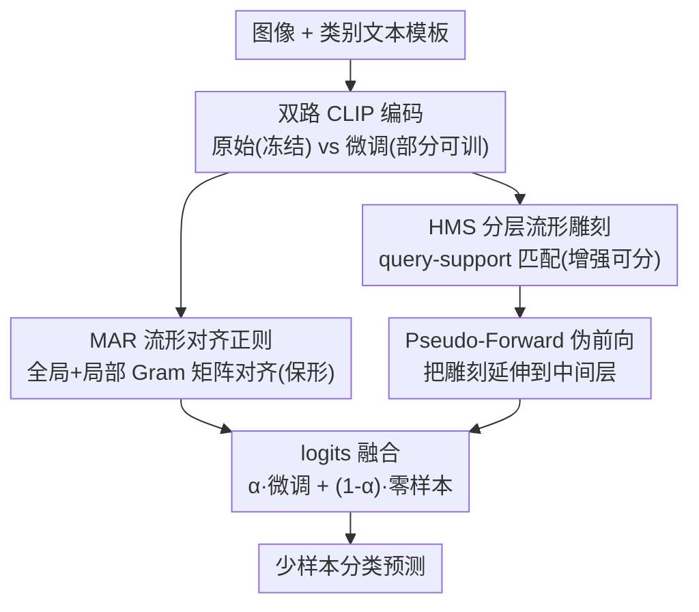

# Preserve and Sculpt: Manifold-Aligned Fine-tuning of Vision-Language Models for Few-Shot Learning

**会议**: ICLR 2026  
**OpenReview**: [https://openreview.net/forum?id=ZGJJF1e2u0](https://openreview.net/forum?id=ZGJJF1e2u0)  
**代码**: https://github.com/kaderxon/MPS-Tuning  
**领域**: 多模态VLM  
**关键词**: CLIP、少样本微调、语义流形、Gromov-Wasserstein、对比学习

## 一句话总结
本文把 CLIP 特征空间看成一张「语义流形」，少样本微调时一边用 Gram 矩阵对齐约束流形的内在几何不被破坏（保形），一边用多模态 query-support 匹配把同类样本拉近、异类推远来增强可分性（雕刻），在 11 个数据集上把少样本分类的 SOTA 又往上抬了约 1-2.5 个点。

## 研究背景与动机

**领域现状**：CLIP 这类视觉-语言模型（VLM）在大规模图文对上用对比学习预训练，构造出一个图像与文本语义对齐的联合嵌入空间——"猫"的图像表征会落在"feline"文本表征附近、远离"卡车"。要把这种强大的零样本能力迁移到下游少样本分类，主流有两条路：一是参数高效微调（PEFT），如基于 prompt 的 CoOp、基于 adapter 的 CLIP-Adapter，靠限制可训练参数量来抑制过拟合；二是一致性约束，如 PromptSRC，强制每个样本微调前后的特征/logits 保持一致。

**现有痛点**：这两条路都把图像数据当成**孤立的点**来正则化。PEFT 通过冻结大部分参数间接限制改动，灵活性受限、学习能力被压住；一致性约束则只盯着单个样本自身的表征别乱跑。它们都忽略了数据分布的**整体几何结构**——也就是样本之间的相对关系。

**核心矛盾**：少样本场景下，标准微调极易发生"语义结构坍塌"——有限样本导致对预训练表征的灾难性遗忘，泛化能力急剧退化。问题根源在于：现有正则化要么约束太死（学不动新知识），要么只管单点（管不住整体流形几何），无法同时兼顾"保住预训练的几何先验"和"为下游任务增强判别力"这两个目标。

**切入角度**：作者不再把特征看成离散点，而是把整个特征分布视作一张连续的**语义流形**。预训练 CLIP 学到的流形几何编码了丰富先验知识——只要这张流形的内在几何不被微调破坏，先验知识就能保留。衡量两个度量空间几何结构差异的天然工具是 Gromov-Wasserstein（GW）距离，它比较的是内部成对距离关系而非具体坐标，因此对等距变换（旋转/平移/重标号）天然不变。

**核心 idea**：用"保形 + 雕刻"两手抓——保形（Preserve）：约束微调前后流形的 GW 距离，但 GW 是 NP-hard，作者证明 Gram 矩阵差的 $L_p$ 范数是 GW 距离的一个可解上界，从而把它变成一个高效正则项；雕刻（Sculpt）：用多模态 query-support 匹配主动增强流形的类间可分性，并延伸到中间层进一步精修。

## 方法详解

### 整体框架

MPS-Tuning（Manifold-Preserving and Sculpting Tuning）在微调 CLIP 时同时跑两个目标。输入是图像和类别文本模板（"a photo of a [CLASS]"），分别过视觉编码器 $E_V$（部分参数可训练）和冻结的文本编码器 $E_T$。微调过程中，一份"原始 CLIP"被冻结作为参照，一份"微调 CLIP"在更新。两条主线协同：**Manifold Alignment Regularization (MAR)** 对齐两个模型在 batch 级和 token 级的 Gram 矩阵，把流形几何"钉"住不让它剧烈变形（保形）；**Hierarchical Manifold Sculpting (HMS)** 把图像 query 与图文 support 集做对比匹配，主动把同类拉近、异类推远（雕刻），并通过 **Pseudo-Forward** 把雕刻从输出层延伸到中间层。最终预测把微调输出和零样本输出做加权融合。

### 关键设计

**1. 流形对齐正则 MAR：用 Gram 矩阵差近似 GW 距离上界，把保形变成可优化的正则项**

痛点是：直接约束微调前后流形的 GW 距离在理论上最对口（它衡量内在几何差异），但求 GW 需要解一个非凸二次规划、可归约到 NP-hard 的二次分配问题，根本没法当 loss 用。作者的关键一步是**固定耦合**：既然同一个样本在原始模型和微调模型里天然一一对应，就把 GW 里那个待优化的耦合矩阵 $\pi$ 固定成这个自然对应，于是 NP-hard 的优化塌缩成一个闭式上界。论文据此给出定理：$L_p$ 范数下的 Gram 矩阵对齐是 $p$ 阶 GW 距离的近似上界。基于这个理论，MAR 在两个尺度上做对齐。**全局拓扑对齐**保住样本之间的相对关系：取一个 batch 的 $N$ 个归一化 [CLS] 特征，分别算原始与微调的 Gram 矩阵 $S_{ij}=\langle z_i,z_j\rangle$、$S'_{ij}=\langle z'_i,z'_j\rangle$，损失为

$$\mathcal{L}^{global}_{MAR}=\frac{1}{N^2}\sum_{i=1}^{N}\sum_{j=1}^{N}|S_{ij}-S'_{ij}|_1$$

**局部几何对齐**保住单个样本内部的结构：对第 $i$ 个样本，收集它的 [CLS] token 和 $M$ 个 patch token，算 $(M+1)\times(M+1)$ 的样本内 Gram 矩阵并对齐，损失为

$$\mathcal{L}^{local}_{MAR}=\frac{1}{N}\sum_{i=1}^{N}\left(\frac{1}{(M+1)^2}\sum_{k=0}^{M}\sum_{l=0}^{M}|S^{intra}_{i,kl}-S'^{intra}_{i,kl}|_1\right)$$

最终 $\mathcal{L}_{MAR}=\mathcal{L}^{global}_{MAR}+\mathcal{L}^{local}_{MAR}$。和 PromptSRC 那种"逼单个样本的特征别动"相比，MAR 约束的是样本**之间**和 token **之间**的关系矩阵——它允许每个点平移、旋转，只要相对几何不变，因此既保住了先验又给微调留足了灵活度。这也是本文首次把 GW 距离理论引入 VLM 微调。

**2. 分层流形雕刻 HMS：用多模态 query-support 匹配主动增强类间可分性**

光保形会让流形"冻住"、学不到下游判别知识，所以需要主动"雕刻"。HMS 把它建模成一个 query-support 匹配任务：令归一化图像特征集 $Q=\{q_1,\dots,q_N\}$ 作为 query，冻结的文本嵌入 $T=\{t_1,\dots,t_K\}$ 与图像一起组成 support 集 $S=Q\cup T$。正样本按类别身份定义——同类的图文对、图图对都算正配对。由于少样本下 batch 内视觉正样本稀缺，作者对每张图做两次数据增强生成两个视图，丰富图像正样本池。雕刻损失对每个 query 和它的正样本做对比学习：

$$\mathcal{L}^{query}_{sculpt}(q,S)=-\frac{1}{|P_q|}\sum_{s\in P_q}\log\frac{\exp(\langle q,s\rangle)/\tau'}{\sum_{s'\in S\setminus q}\exp(\langle q,s'\rangle)/\tau'}$$

其中 $P_q$ 是 query $q$ 的正样本集合，$\tau'$ 是温度。整个 batch 的损失对所有 query 取平均 $\mathcal{L}_{sculpt}(Q,S)=\mathbb{E}_{q\in Q}[\mathcal{L}^{query}_{sculpt}(q,S)]$。它和普通对比微调的关键区别在于：它是在 MAR"保形"约束之下做雕刻，既把同类聚得更紧、异类分得更开（让流形更可分），又不会把预训练流形的整体几何拆散。

**3. 伪前向投影 Pseudo-Forward：把雕刻从输出层延伸到中间层**

只在最终输出层雕刻不够充分，作者希望中间层特征也被精修。但难点是中间层特征 $z'^{(l)}$ 和文本嵌入的语义空间不兼容，没法直接和文本做匹配。Pseudo-Forward 的做法是：从第 $l$ 层开始，**跳过后续所有注意力（attention）模块**，只保留前向里必要的逐层变换（FFN 和 value 投影），把中间特征"快进"映射到输出特征空间：

$$\hat{z}'^{(l)}=\text{FFN}^{(L)}\circ V^{(L)}_{Proj}\circ\cdots\circ\text{FFN}^{(l+1)}\circ V^{(l+1)}_{Proj}(z'^{(l)})$$

这些投影层与主干共享参数，所以几乎不增加额外开销。映射后的中间层特征就能和文本嵌入对齐、参与雕刻。HMS 的总损失因此聚合了输出层和若干中间层的雕刻：

$$\mathcal{L}_{HMS}=\mathcal{L}_{sculpt}(\hat{Q},\hat{S})+\sum_{l\in L_{blocks}}\mathcal{L}_{sculpt}(Q^{(l)},S^{(l)})$$

实验里把 HMS 用在最后两层（输出层 + 倒数第二层）效果最好。

**4. 零样本-微调 logits 融合：保留原始 CLIP 的稳健预测**

为了进一步对冲少样本过拟合，训练和推理时最终 logits 都取微调输出和原始零样本输出的加权和：

$$logits=\alpha\cdot logits_{ft}+(1-\alpha)\cdot logits_{zs}$$

$\alpha$ 控制两者比重（实验取 0.3，即更偏向保守的零样本输出）。这一项让模型在"激进学新任务"和"保守用预训练知识"之间有一个可调旋钮，是 MAR/HMS 之外的一道额外保险。

### 损失函数 / 训练策略

总损失把交叉熵和两个正则项相加：$\mathcal{L}=\mathcal{L}_{CE}+\lambda_1\mathcal{L}_{MAR}+\lambda_2\mathcal{L}_{HMS}$。骨干用 CLIP ViT-B/16，按 $K$-shot（$K=1,2,4,8,16$）训练、全测试集评估。优化器 SGD + 余弦学习率衰减，训练 50 epoch，首个 epoch 用 warm-up 把学习率从 1e-5 线性升到 0.002。超参 $\lambda_1=0.5$、$\lambda_2=0.1$、$\alpha=0.3$，HMS 作用于最后两层，结果在 3 个随机种子上取平均。由于 MPS-Tuning 的强知识保留能力，作者得以**直接微调部分模型权重**（而非只调 adapter/prompt）也不过拟合，从而大幅提升学习容量。

## 实验关键数据

### 主实验

11 个数据集少样本分类的平均提升（相对最强 baseline）：

| 设置 | 相对最强 baseline 的提升 | 备注 |
|------|------|------|
| 1-shot | +0.88% | 样本极少时优势已显现 |
| 4-shot | +1.27% | 差距随样本增多而扩大 |
| 16-shot | +2.51% | 学习容量优势最明显 |

ImageNet 域泛化（在 ImageNet 训练，迁移到变体）：

| 方法 | Source (ImageNet) | -Sketch | -V2 | Avg |
|------|------|------|------|------|
| CLIP（零样本） | 66.73 | 46.15 | 60.83 | 57.90 |
| PromptSRC | 73.17 | 49.10 | 65.70 | 62.66 |
| AMU-Tuning | 74.93 | 50.37 | 65.42 | 63.57 |
| TAC | 73.67 | 48.93 | 66.23 | 62.94 |
| **MPS-Tuning** | **75.60** | 50.10 | **67.53** | **64.41** |

在源域和 ImageNet-V2 上均为最优，Avg 比次优 AMU-Tuning 高 0.84。

### 消融实验

各组件贡献（16-shot，Avg11 为 11 个数据集均值）：

| 配置 | ImageNet | Cars | SUN397 | Avg11 |
|------|------|------|------|------|
| 仅 $\mathcal{L}_{CE}$ | 72.93 | 90.00 | 76.30 | 85.41 |
| + $\mathcal{L}_{MAR}$ | 75.30 | 90.80 | 78.07 | 86.44 |
| + $\mathcal{L}_{HMS}$ | 74.77 | 90.77 | 77.80 | 86.20 |
| Full（CE+MAR+HMS） | **75.60** | **91.13** | **78.47** | **86.85** |

MAR 内部消融（16-shot Avg11）：None 86.20 → only Global 86.57 → only Local 86.67 → Global+Local 86.85，全局/局部缺一不可。

### 关键发现

- **MAR 单独贡献更大**：仅加 MAR 就把 Avg11 从 85.41 抬到 86.44（+1.03），单加 HMS 为 86.20（+0.79），说明"保住流形几何"是主要增益来源；两者合用再涨到 86.85，存在协同效应。
- **MAR 优于点式一致性约束**：在不同一致性约束的对比中，MAR（Global+Local）在 1/4/16-shot 的 Avg11（73.55/80.47/86.85）全面超过基于特征的 cos/$\ell_1$/$\ell_2$ 和基于 logits 的 KL，验证"约束关系矩阵"比"约束单点"更有效。
- **优势随样本增多放大**：从 1-shot 的 +0.88% 到 16-shot 的 +2.51%，说明 MPS 的强知识保留让模型敢直接微调部分权重、吃得下更多数据而不过拟合。
- **效率可比**：SUN397 上训练 95.65 FPS、推理 535 FPS，与 TCP、TextRefiner 等同量级，没有明显额外开销。

## 亮点与洞察

- **把 NP-hard 的 GW 距离化简成一个能直接当 loss 的 Gram 矩阵差**：通过"固定自然耦合"把待优化的耦合矩阵冻住，得到 GW 上界，既保留了"比较内在几何"的理论味道，又完全可解——这是全文最巧的一步，也是首次把 GW 引入 VLM 微调。
- **"保形 + 雕刻"是一对天然互补的力**：保形（MAR）防遗忘、雕刻（HMS）促判别，一个往回拉、一个往前推，在少样本这个最容易坍塌的场景里把 trade-off 调成了协同。
- **Pseudo-Forward 让中间层也能和文本对齐**：跳过 attention、只走 FFN/value 投影把中间特征快进到输出空间，用极小代价把对比监督铺到深层，这个"参数共享的伪前向"trick 可迁移到其他需要多层多模态对齐的任务。
- **Gram 矩阵作为"关系指纹"的视角**：约束样本间/ token 间的内积矩阵而非单点，天然对等距变换不变，给"如何在微调中保住预训练几何"提供了一个干净、可复用的正则范式。

## 局限与展望

- 论文用固定耦合得到的是 GW 距离的**上界近似**，上界与真实 GW 的松紧程度、在什么情形下会过紧/过松，文中以理论附录给出，但缺少经验上对近似质量的量化分析。
- 超参（$\lambda_1,\lambda_2,\alpha$、HMS 层数）是在给定数据集上调好的固定值，跨域时是否需要重新搜索、敏感度如何，正文给的分析有限。
- 雕刻依赖数据增强补充视觉正样本，在 1-shot 这种极端少样本下正样本仍稀缺，HMS 的收益相对 MAR 偏小（消融里单加 HMS 不如单加 MAR），如何在极少样本下更好地雕刻仍有空间。
- 方法以 CLIP ViT-B/16 为骨干验证，是否能平移到更大模型或非对比预训练的 VLM（如生成式 VLM），文中未涉及。

## 相关工作与启发

- **vs PEFT（CoOp / CLIP-Adapter / Tip-Adapter）**：它们靠冻结大部分参数、只调少量 prompt/adapter 间接抑制过拟合，代价是学习容量被压住。本文用显式的流形几何正则替代"参数量限制"，从而敢直接微调部分主干权重，灵活性和上限都更高。
- **vs 一致性约束（PromptSRC）**：PromptSRC 用特征级 $\ell_1$ + logits 级 KL 逼每个样本微调前后别变，本质是**点式**约束；本文约束的是样本间/ token 间的 Gram 关系矩阵，是**几何/关系式**约束，消融显示后者在各 shot 下全面更优。
- **vs GW 距离的经典用法**：GW 此前多用于图匹配、域适配等需要比较两个度量空间结构的场景，因 NP-hard 难直接优化。本文把"固定耦合得上界"的思路用到 VLM 微调，给"如何在迁移中守住预训练几何"提供了一个有理论支撑、又工程可落地的新模板。

## 评分
- 新颖性: ⭐⭐⭐⭐⭐ 首次把 GW 距离引入 VLM 微调，并用固定耦合化简成可解的 Gram 对齐正则，理论与方法都新
- 实验充分度: ⭐⭐⭐⭐ 11 数据集 + 域泛化 + 多组消融，但极少样本下 HMS 增益和近似松紧度分析略欠
- 写作质量: ⭐⭐⭐⭐ "保形+雕刻"的叙事清晰，理论部分给了定理和证明梗概
- 价值: ⭐⭐⭐⭐⭐ 给少样本 VLM 迁移提供了一个可复用的"约束关系矩阵保几何"范式，且效率可比

<!-- RELATED:START -->

## 相关论文

- [\[ICLR 2026\] Exploring Cross-Modal Flows for Few-Shot Learning](exploring_cross-modal_flows_for_few-shot_learning.md)
- [\[ICLR 2026\] pFedMMA: Personalized Federated Fine-Tuning with Multi-Modal Adapter for Vision-Language Models](pfedmma_personalized_federated_fine-tuning_with_multi-modal_adapter_for_vision-l.md)
- [\[ICLR 2026\] Memory-Free Continual Learning with Null Space Adaptation for Zero-Shot Vision-Language Models](memory-free_continual_learning_with_null_space_adaptation_for_zero-shot_vision-l.md)
- [\[ICCV 2025\] Interpretable Zero-Shot Learning with Locally-Aligned Vision-Language Model](../../ICCV2025/multimodal_vlm/interpretable_zero-shot_learning_with_locally-aligned_vision-language_model.md)
- [\[ICLR 2026\] Enhanced Continual Learning of Vision-Language Models with Model Fusion](enhanced_continual_learning_of_vision-language_models_with_model_fusion.md)

<!-- RELATED:END -->
