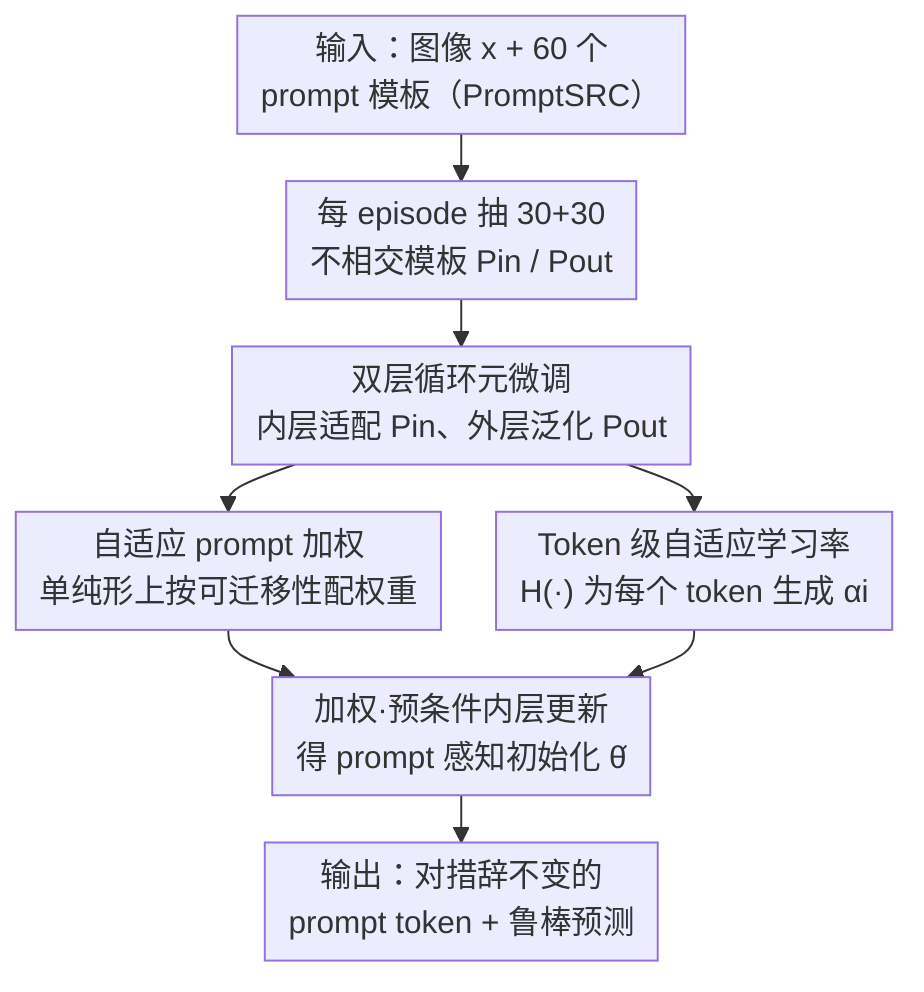

# Prompt-Robust Vision-Language Models via Meta-Finetuning

**会议**: ICLR 2026  
**OpenReview**: [https://openreview.net/forum?id=3wZ6IIwPJq](https://openreview.net/forum?id=3wZ6IIwPJq)  
**代码**: 待确认（作者称代码将开源）  
**领域**: 多模态VLM  
**关键词**: 提示鲁棒性, 元学习, 双层循环, 提示加权, Token 级学习率

## 一句话总结
针对 CLIP 类视觉语言模型"换个说法 prompt 性能就大幅波动"的脆弱性，本文提出 Promise——把同一任务下语义等价的不同 prompt 模板当作元学习里的"任务"，用内外双层循环 + 自适应 prompt 加权 + Token 级学习率，学到一组对措辞不敏感的 prompt token，15 个 benchmark 上既降低了 prompt 敏感度又提升了泛化（11 数据集 base-to-new 调和均值 +1.13）。

## 研究背景与动机
**领域现状**：CLIP / ALIGN 这类视觉语言模型靠大规模图文对齐获得了强零样本能力，常见用法是把类别填进手写模板（如 "a photo of a [CLASS]"），用文本特征和图像特征算相似度做分类。后续 prompt learning（CoOp、CoCoOp、MaPLe、PromptSRC、MMRL 等）把手写模板换成可学习 token，进一步提升下游适配。

**现有痛点**：这些模型对 prompt 措辞高度敏感——同一张图，只是把模板换个等价说法（"a photo of"→"itap of the"→"a bad photo of a"），预测置信度和准确率就会大幅抖动。论文 Figure 1 显示 CLIP、MaPLe 在五种 prompt 下波动很大且整体置信度偏低。这种不稳定让 VLM 在真实部署时很不可靠。

**核心矛盾**：现有 prompt learning 方法（无论学整句模板还是学 token）在训练和推理时都**绑定一组固定的 prompt 模板**，相当于只为某一种措辞优化，自然对换措辞缺乏鲁棒性。而已有的元学习类 prompt tuning（GRAM、MetaPrompt、ProMetaR）虽然引入了元学习，但目标是**跨任务/跨域**泛化，仍假设 prompt 模板固定，没有专门处理"同一任务内部不同措辞之间的鲁棒性"。

**本文目标**：构建 prompt-robust 的 VLM——预测在同一任务的多样 prompt 措辞下保持稳定，即把研究轴从"任务级/域级泛化"切换到"任务内 prompt 鲁棒性"（intra-task robustness）。

**切入角度**：作者的关键观察是，可以把"同一数据集下语义等价的不同 prompt 模板"直接当作元学习意义上的不同"任务"，在训练时**主动模拟 prompt 分布漂移**——内层在一批模板上适配 token，外层在另一批**不相交**的模板上检验泛化，从而逼模型学出对措辞不变的 token 表示。

**核心 idea**：用"把 prompt 模板当任务"的双层循环元微调，外加自适应 prompt 加权和 Token 级学习率，把一个全局共享的 SGD 初始化变成"prompt 感知"的初始化，使内层一步更新既降外层风险又压缩跨 prompt 敏感度。

## 方法详解

### 整体框架
Promise 是一套加在已有 prompt learner（MaPLe / IVLP / MMRL 等）之上的元微调训练策略：保持它们的骨架不变，只把原来的优化过程替换成双层循环。给定一个数据集，作者用 PromptSRC 提供的 60 个手写模板，每个 episode 随机抽 30 个模板做内层适配、另 30 个不相交模板做外层泛化检验。内层针对每个模板把可学习 token 向该模板的损失方向走一步，得到适配后参数 $\hat\theta$；外层用这些 $\hat\theta$ 在不相交模板上算损失，反过来更新共享元参数 $\theta$。在这个 MAML/Reptile 式骨架上，作者再插入两个模块：自适应 prompt 加权（让更可迁移的模板在内层占更大权重）和 Token 级学习率（用一个小网络为每个 token 生成专属学习率）。三者协同，最终学到对 prompt 措辞不变、且泛化更好的 token 表示。理论部分进一步证明这套"加权 + 预条件"的内层更新能一步降外层经验风险、收缩跨 prompt 敏感度，并收紧数据相关的泛化界。

### 关键设计

**1. 双层循环元微调：把不同 prompt 模板当作元学习的"任务"**

这一设计直接针对"训练绑定固定模板→换措辞就崩"的根因。作者把内外层模板集 $P_{in}$、$P_{out}$ 设成不相交（$P_{in}\cap P_{out}=\varnothing$），让元学习里的"任务"对应同一数据集、同一标签空间下的不同自然语言措辞，而非不同数据集。内层对每个 $T_i\in P_{in}$ 适配 token 嵌入 $e_i$：$\hat\theta=\theta-\alpha\sum_{T_i\in P_{in}}\nabla_\theta L_{in}(f(e_i,x),y)$；外层用适配后的 $\hat\theta$ 在不相交的 $P_{out}$ 上更新元参数：$\theta=\theta-\beta\sum_{T_j\in P_{out}}\nabla_{\hat\theta}L_{out}(f(e_j,x),y)$。这样"在一批措辞上适配、再到另一批没见过的措辞上检验稳定性"被显式编进训练目标，正好对准任务内 prompt 鲁棒性。它受 MAML 启发，但 MAML 对所有输入一视同仁、无法区分模板质量——这正是下面两个模块要补的短板。实现上用 Reptile 的一阶近似、内层迭代 3 次以省去二阶梯度。

**2. 自适应 prompt 加权：让更可迁移的模板在内层占更大话语权**

不同 prompt 模板的可迁移性天然不同，平均对待会让"噪声模板"拖累适配。作者给每个内层模板 $T_i$ 配一个可学习权重 $w_i$ 来缩放其损失，内层更新变为 $\hat\theta=\theta-\alpha\sum_{T_i\in P_{in}}w_i\nabla_\theta L_{in}(f(e_i,x),y)$，权重本身在外层被优化（类似 mixture-of-experts 的思路）。为控制方差，外层把权重约束在概率单纯形 $\Delta^{N-1}=\{w\ge0,\sum_i w_i=1\}$ 上——通过带温度 $\tau$ 的熵镜像映射（先对未归一化分数 $\{s_i\}$ 做梯度更新，再用 mirror descent 归一化到单纯形）。温度 $\tau$ 调节探索与集中：$\tau$ 大则把质量摊开、稳定梯度，$\tau$ 小则把质量集中到高效用模板、降低估计方差；可选的熵正则 $\lambda H(\tilde w)$（或 entmax 稀疏替代）防止退化坍缩，保留少数高效用模板、剪掉噪声模板。直观上，这让学习信号聚焦在"最能迁移到未见措辞"的 prompt 上，而无需手调每个模板的系数。

**3. Token 级自适应学习率：按每个 token 的语境重要性细粒度调节步长**

即便选对了模板，对一条 prompt 里所有 token 用统一学习率仍然太粗。作者借鉴 MetaSGD（为每个参数学一个学习率），但把它扩展成**数据驱动、token 级**的版本：用一个 3 层 MLP 网络 $H(\cdot)$，输入是文本编码器抽出的每个模板特征，输出每个可学习 token $e_i$ 的专属学习率 $\alpha_i=H(e_i)$。内层更新进一步细化为 $\hat\theta=\theta-\alpha_i\sum_{T_i\in P_{in}}w_i\nabla_\theta L_{in}(f(e_i,x),y)$。由于 $\alpha_i$ 由 token 自身的语义/语境特征生成，模型可以对不同 token 因"重要性"差异采用不同步长，而非全局一刀切；$H(\cdot)$ 的参数同样在外层随 $\theta$ 一起被优化（$H=H-\beta\nabla_H L_{out}$）。在理论视角下，自适应权重 $w$ 提供"方差缩减"、token 级对角学习率构成"预条件子" $P=\mathrm{diag}(\alpha_1,\dots,\alpha_d)$，二者结合把内层一步更新沿"能泛化到 $P_{out}$ 的方向"放大、抑制不稳定方向。

### 损失函数 / 训练策略
内外层都用分类损失（在 CLIP-ViT-B/16 上对 prompt token 适配）。训练配置：prompt 深度 9、语言与视觉 prompt 长度各 2，10 个 epoch、batch size 8、学习率 0.0035、SGD、单张 A6000；ImageNet 全 1000 类做源模型时 prompt 深度设 3、5 个 epoch。外层用 Reptile 一阶近似、内层迭代 3 次，结果对 3 个随机种子取平均。理论上（Theorem 4.1 / 4.2）证明这套加权·预条件内层更新可一步降低外层经验风险 $\hat R_{P_{out}}$、收缩跨 prompt 敏感度 $S(\theta)=\mathrm{Var}_{T}[f_\theta(x;T)]$，并收紧在 post-inner 初始化处评估的数据相关泛化界（界中含 $\sqrt{\mathrm{Tr}(P\Sigma_w P)}$ 项，减小它即收紧界）。

## 实验关键数据

### 主实验
覆盖 15 个数据集，含 base-to-new 泛化、跨数据集迁移、域泛化。下表为 11 个数据集 base-to-new 的平均（H 为 base/novel 调和均值）：

| 方法 | Base | Novel | H |
|------|------|-------|---|
| CLIP | 69.34 | 74.22 | 71.70 |
| CoCoOp | 80.47 | 71.69 | 75.83 |
| PromptSRC | 84.26 | 76.10 | 79.97 |
| DePT | 85.19 | 76.17 | 80.43 |
| ProMetaR | 84.39 | 76.93 | 80.49 |
| HPT++ | 84.13 | 77.99 | 80.95 |
| MMRL（前 SOTA） | 85.68 | 77.16 | 81.20 |
| **Promise（本文）** | **86.14 (+0.46)** | **78.84 (+0.85)** | **82.33 (+1.13)** |

Promise 作为"训练策略"可叠加到不同 backbone 上并稳定涨点（Table 1）：

| 基础模型 | Base | Novel | H |
|----------|------|-------|---|
| IVLP | 82.51 | 73.35 | 77.66 |
| + Promise | 83.26 | 75.44 (**+2.09**) | 79.16 |
| MaPLe | 82.28 | 75.14 | 78.55 |
| + Promise | 83.57 | 77.26 (**+2.12**) | 80.29 |
| MMRL | 85.68 | 77.16 | 81.20 |
| + Promise | 86.14 | 78.84 (**+1.68**) | 82.33 |

提升主要来自 novel 类（+1.68~+2.12），base 类持平或略升，说明 Promise 增强的是泛化而非过拟合 base。单数据集上 StanfordCars（H +3.45）、Flowers102（novel +5.76）、ImageNet（novel +2.15）增益尤其大；OxfordPets 的 novel 反而 -2.86，是少数掉点场景。

### 消融实验

| 配置 | 基础模型 | Base | Novel | H | 说明 |
|------|---------|------|-------|---|------|
| w/o 自适应加权 | MaPLe | 82.93 | 75.87 | 79.24 | 去掉加权 |
| w/ 自适应加权 | MaPLe | 83.57 | 77.26 | 80.29 | novel +1.39 |
| w/o 自适应加权 | MMRL | 85.97 | 77.53 | 81.53 | 去掉加权 |
| w/ 自适应加权 | MMRL | 86.14 | 78.84 | 82.33 | novel +1.31 |

Token 级学习率（Table 3）对比三种变体：固定学习率 < MetaSGD 式任务级学习率 < 本文 token 级学习率，token 级在 MaPLe / MMRL 的 base 与 novel 上都最优。

### 关键发现
- **理论与实证吻合**：在代表性数据集子集上，统计"一步内层更新真的降低了外层 $P_{out}$ 损失"的比例，从无加权·无预条件的约 **61%** 提升到加上 $w$ 和 $P$ 的完整 Promise 的约 **78%**，印证了 Theorem 4.1 的"风险收缩"效应（作者也坦言光滑性/对齐假设对大 CLIP 网络只是近似）。
- **两个模块都贡献 novel 泛化**：自适应加权与 token 级学习率单独都涨点，主要体现在 novel 类与调和均值上，说明二者是互补的。
- **鲁棒性**：在 UCF101、Caltech101 上换不同模板时，其它方法波动明显，Promise 始终维持高且稳定的准确率（Figure 3），验证了对 prompt 措辞的不敏感。

## 亮点与洞察
- **把"措辞"本身建模成任务分布**：最巧妙之处是不再把 prompt 当固定输入，而是把"同一任务的不同等价措辞"当成元学习的任务集，并用不相交的 $P_{in}/P_{out}$ 在训练里硬性制造"换措辞"的考验——这是把 intra-task prompt robustness 显式写进目标的关键。
- **即插即用的训练策略**：Promise 不改 backbone 架构，只换优化过程，能叠加到 IVLP/MaPLe/MMRL 上稳定涨点，工程上很容易迁移到新的 prompt learner。
- **理论给出可操作的抓手**：泛化界明确指向"同时减小 $\hat R_{P_{out}}(\hat\theta)$ 和 $\mathrm{Tr}(P\Sigma_w P)$"，把"加权降方差 + 预条件改条件数"翻译成具体优化目标，而非事后解释。
- **可迁移思路**：对"对输入表述敏感"的其它问题（如 LLM 指令鲁棒性、检索 query 改写鲁棒性），这套"把等价表述当任务 + 双层循环 + 自适应加权"的范式都值得借鉴。

## 局限性 / 可改进方向
- **依赖现成模板库**：方法建立在 PromptSRC 的 60 个手写模板上，模板的多样性与质量直接决定了"措辞分布"的覆盖面；若模板本身有偏，学到的不变性也受限。
- **个别数据集掉点**：OxfordPets 的 novel 类掉了 2.86，说明在某些细粒度/类内方差大的数据集上，强制 prompt 不变可能与类别区分性产生张力，方法并非处处稳赢。
- **理论假设近似**：L-光滑、梯度对齐等假设对 CLIP 规模网络只是近似成立，"61%→78%"虽支持趋势但并非严格保证。
- **额外训练开销**：双层循环 + 每 episode 抽 30+30 模板 + 一个生成学习率的 MLP，训练成本高于单纯 prompt tuning（作者把训练时间分析放到附录）。

## 相关工作与启发
- **vs CoOp / CoCoOp**：它们学连续 prompt 模板/条件 token，目标是 few-shot 适配，但绑定固定模板、对 novel 类易过拟合；本文不优化某一固定模板，而是 meta-learn 对措辞不变的 token。
- **vs MaPLe / PromptSRC / MMRL**：这些是更强的多模态 prompt learner，但仍在固定模板下训练；Promise 把它们当 backbone、叠加双层循环训练策略后进一步涨点，是"正交增强"而非替代。
- **vs GRAM / MetaPrompt / ProMetaR（元学习 prompt tuning）**：同样用元学习，但它们针对跨任务/跨域泛化、假设模板固定；本文把元学习的"任务"重定义为"同任务内的不同措辞"，专攻 intra-task prompt 鲁棒性。
- **vs MAML / MetaSGD**：双层循环骨架受 MAML 启发、token 级学习率受 MetaSGD 启发，但 MAML 对所有输入一视同仁、MetaSGD 只学每参数标量学习率；本文用自适应 prompt 加权区分模板质量、用数据驱动 MLP 生成 token 级学习率，是面向 VLM prompt 鲁棒性的定制化改造。

## 评分
- 新颖性: ⭐⭐⭐⭐ 把"prompt 措辞"重新定义为元学习任务分布、专攻 intra-task 鲁棒性，角度新且少有人做。
- 实验充分度: ⭐⭐⭐⭐ 15 数据集 + 三类设置 + 逐模块消融 + 理论验证，较扎实；个别数据集掉点也如实呈现。
- 写作质量: ⭐⭐⭐⭐ 方法与理论衔接清楚，三个模块的动机层层递进；部分符号（如 $w_i$ 与 $\tilde w$、$\alpha$ 与 $\alpha_i$）略显密集。
- 价值: ⭐⭐⭐⭐ 即插即用、可叠加到现有 prompt learner，对 VLM 可靠部署有实际意义。

<!-- RELATED:START -->

## 相关论文

- [\[ICLR 2026\] Meta-Adaptive Prompt Distillation for Few-Shot Visual Question Answering](meta-adaptive_prompt_distillation_for_few-shot_visual_question_answering.md)
- [\[ICLR 2026\] A-TPT: Angular Diversity Calibration Properties for Test-Time Prompt Tuning of Vision-Language Models](a-tpt_angular_diversity_calibration_properties_for_test-time_prompt_tuning_of_vi.md)
- [\[CVPR 2026\] Towards Calibrating Prompt Tuning of Vision-Language Models](../../CVPR2026/multimodal_vlm/towards_calibrating_prompt_tuning_of_vision-language_models.md)
- [\[ICLR 2026\] Revisit Visual Prompt Tuning: The Expressiveness of Prompt Experts](revisit_visual_prompt_tuning_the_expressiveness_of_prompt_experts.md)
- [\[AAAI 2026\] Difference Vector Equalization for Robust Fine-tuning of Vision-Language Models](../../AAAI2026/multimodal_vlm/difference_vector_equalization_for_robust_fine-tuning_of_vis.md)

<!-- RELATED:END -->
