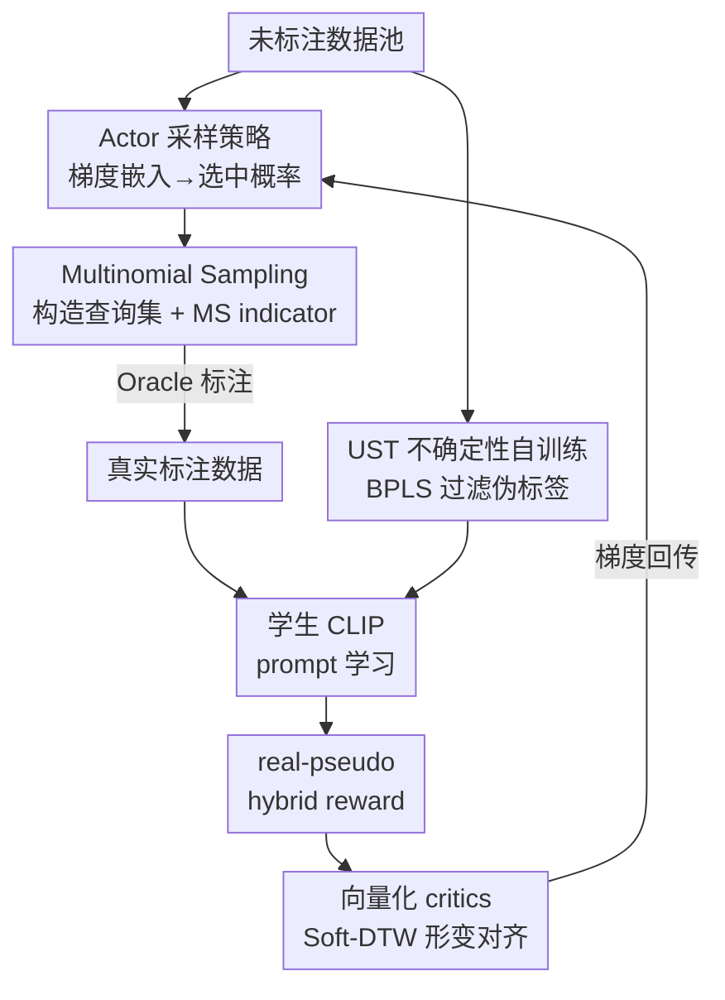

# PSP: Prompt-Guided Self-Training Sampling Policy for Active Prompt Learning

**会议**: ICLR 2026  
**OpenReview**: [https://openreview.net/forum?id=7D7VLU9227](https://openreview.net/forum?id=7D7VLU9227)  
**代码**: 待确认  
**领域**: 多模态VLM  
**关键词**: 主动提示学习、CLIP、Soft Actor-Critic、自训练、伪标签

## 一句话总结
PSP 把"选哪些样本去标注"建模成一个强化学习问题：用 Soft Actor-Critic 配上一个由 prompt 学习反馈算出来的"真实-伪标签混合奖励"来端到端优化采样策略，同时用教师 CLIP 给未选中的样本打可靠伪标签，让被选样本真正服务于 prompt 模板的优化，在七个下游数据集上把平均准确率从 74.36% 提到 76.87%。

## 研究背景与动机
**领域现状**：用 CLIP 这类视觉-语言模型做下游适配，主流是 prompt learning（如 CoOp），冻结图文编码器、只学一小段可训练的上下文向量当模板。但要训得好仍然需要带标注的数据，标注成本高。于是有人把主动学习（active learning）引进来，在有限标注预算下挑"最有信息量"的样本去标，催生了 Active Prompt Learning（APL），代表工作是 Bang 等人的 PCB 框架。

**现有痛点**：PCB 的做法是把 Entropy / Coreset / BADGE 这些传统采样算法机械地搬过来选候选，再用一个 Balance Sampler 偏向选那些伪标签属于"标注数据里最欠表达类别"的样本。这里有两个硬伤：一是**采样和 prompt 学习被切成两个互不相干的阶段**，选样准则跟"这个样本到底能不能帮 prompt 模板学得更好"没有任何显式联系，概念上就别扭；二是**完全浪费了没被选中的那批未标注样本**里蕴含的互补信息。

**核心矛盾**：选样的"信息量"准则（熵高、覆盖广）是数据本身的静态属性，跟"prompt 模板当前学到了什么、还缺什么"这个动态训练信号是脱节的——传统采样准则没法把 prompt 这个具体的优化目标喂回到选样里去。

**本文目标**：(1) 让 prompt 学习的反馈显式地指导采样，使被选样本真正利于 prompt 模板优化；(2) 把未选中样本的互补信息也利用起来。

**切入角度**：作者注意到 RL-based 采样天然能把"选样"建模成策略优化、用累积奖励迭代细化策略，正好可以把"prompt 学得好不好"设计成奖励信号灌进去。但已有 RL 采样（AOL、PAL 做二分类决策，DRAL/MedSelect 依赖成对数据）都不适配 APL，于是引入对超参鲁棒、擅长连续动作空间的 Soft Actor-Critic（SAC）。

**核心 idea**：用一个"由 prompt 学习结果算出来的奖励"驱动 SAC 采样策略端到端选样（VSSP），同时用教师 CLIP 给未选样本生成可靠伪标签做自训练（UST），把"选样—prompt 学习"这两个原本割裂的阶段闭环起来。

## 方法详解

### 整体框架
PSP 是一个教师-学生自训练框架，每一轮 $t$ 走一遍完整的"选样—标注/伪标注—prompt 学习—算奖励—更新策略"闭环，由两个核心组件构成：**VSSP（Vectorized Soft Actor-Critic Sampling Policy）** 负责怎么选样、怎么用 prompt 反馈更新策略；**UST（Uncertainty Augmented Self-Training）** 负责把未选样本变成可靠伪标签喂回训练。

一轮的数据流是这样的：Actor 把 $n_t^u$ 个未标注样本的梯度嵌入映射成动作 $a_t$（每个元素是该样本被选中的概率），经 Multinomial Sampling 得到查询集交给 Oracle 标注，拿到真实标注数据；与此同时 UST 用上一轮的教师 CLIP 给剩余未标注样本打伪标签并过滤。真实标注与伪标签一起喂给学生 CLIP 做 prompt 学习（交叉熵损失）。学完之后，用学到的 prompt 和图像特征算出 real-pseudo hybrid reward $r_t$，连同新状态 $s_{t+1}$ 一起存进经验回放池，再由向量化 critics 估计每个样本的 Q 值、反传梯度去更新 Actor。如此循环，采样策略被 prompt 的优化目标一步步"调教"得越来越准。

### 关键设计

**1. Multinomial Sampling 采样与 MS indicator：把"选样方案的质量"写成可优化的标量**

Actor 输出的是每个未标注样本的选中概率 $a_t \in \mathbb{R}^{n_t^u}$，但要真正构造查询集还得从这个概率分布里"抽"出具体样本。PSP 不用简单的 TopK，而是用 Multinomial Sampling（多项式采样）：采样结果 $G=\{g_1,\dots,g_{n_t^u}\}$ 服从多项分布，$g_i$ 是样本 $x_i^u$ 被选中的次数，满足 $n_s=\sum_i g_i$。这样做引入了随机性，能让被选样本在分布上更均匀、不至于扎堆在概率最高的少数样本上。

关键是作者把这次采样方案的"靠不靠谱"量化成一个 MS indicator：$\log(p_m(g)) = \log\frac{n_s!}{g_1!\cdots g_{n_t^u}!} + \sum_{i=1}^{n_t^u} g_i \log a_i$。$\log(p_m(g))$ 越大说明当前抽样方案越贴合 Actor 给出的概率分布 $a_t$。这个标量随后直接进奖励公式（设计 3），把"采样方案质量"变成一个能反传、能指导 Actor 和 critic 更新的信号——这是 MS 相比 TopK 的本质优势（消融里 MS 始终优于 TopK）。Indexer 拿采样结果去检索样本时，重复样本会用概率更高的那个替换。

**2. UST 不确定性自训练与 BPLS：把被丢掉的未选样本变成可靠伪标签**

针对"未选样本被浪费"的痛点，UST 用上一轮冻结 prompt 后的教师 CLIP $F_t$ 给剩余未标注样本打伪标签。为了让预测稳，它对每个未标注样本做 $L=5$ 次数据增强，把 $L$ 个增强版送进教师算 logits，再取平均 $z_i^{avg}$ 得到平均预测 $\hat y_i^u$ 当伪标签。

光打标还不够，伪标签噪声会干扰优化，于是设计了 BPLS（Balanced Pseudo-Label Selective）模块做"双门槛过滤"：用平均 logits 的置信度 $g_i^c=\mathrm{confidence}(z_i^{avg})$ 衡量可信度，用各增强版置信度的标准差 $g_i^u=\mathrm{std}\{\mathrm{confidence}(z_i^l)\}$ 衡量不确定性；只有同时满足"置信度高于阈值 $\tau_c$ 且不确定性低于阈值 $\tau_u$"的样本才保留（$\tau_c,\tau_u$ 取当前 batch 的均值，自适应）。最后还会查漏补缺：找出过滤后缺失的类别，补进高置信度样本直到各类数量平齐到最小类别数，保证伪标签集是类别均衡的。这批可靠伪标签与真实标注一起做 prompt 学习，让模型看到真实标注里没体现的数据结构。消融显示去掉 UST 平均掉 2.10%，是两个组件里贡献更大的一个。

**3. Prompt-guided 状态与 real-pseudo hybrid reward：把 prompt 学习反馈灌回采样的桥梁**

这是全文的核心——怎么让"采样"和"prompt 学习"显式挂钩。首先是**状态设计**：状态 $s_t \in \mathbb{R}^{n_t^u \times M_g}$ 是 $n_t^u$ 个未标注样本的梯度嵌入矩阵，而梯度嵌入里融进了 prompt 信息。其第 $i$ 个值按预测类别是否命中分两种情况：$s_t^i = f_V^{t,i}\cdot[1-\cos(F_T^t(p_c), f_V^{t,i})]$（当 $c=\hat y_i$），否则 $s_t^i = -f_V^{t,i}\cdot\cos(F_T^t(p_c), f_V^{t,i})$。这里 $\cos(F_T^t(p_c), f_V^{t,i})$ 是图像特征属于类别 $c$ 的得分，所以状态本身就携带了"当前 prompt 把这个样本分得怎么样"的信息，比单纯用图像特征信息更丰富。

更关键的是**奖励**：prompt 学完之后，用学到的 prompt 和图像特征算 real-pseudo hybrid reward $r(s_t,a_t)=\log(p_m(g))\cdot(\bar r_s + \beta \bar r_p)$。单样本奖励 $r_k^i = \max_c \cos(F_T^s(p_c), F_V^s(x_i^k)) - \cos(F_T^s(p_{y_i^k}), F_V^s(x_i^k))$，衡量的是"最高类得分与真值类得分之差"——差越小说明分得越对。$k\in\{s,p\}$ 分别对应真实标注样本和伪标签样本，$\beta$ 控制伪标签奖励的权重。一个巧妙之处是符号设计：MS indicator $\log(p_m(g))$ 恒为负、而 $\bar r_s,\bar r_p$ 为正，于是**最大化总奖励就等价于压低 $\bar r_s+\beta\bar r_p$**，也就是逼模型把样本分得更准。正因为奖励直接来自 prompt 学习后的预测质量，采样策略才被显式地导向"那些能让 prompt 模板学得更好的样本"，彻底告别了 PCB 那种与 prompt 无关的静态准则（消融里把这个混合奖励的 MS indicator 去掉会掉 1.83%；正系数比负系数好 1.06%）。

**4. 向量化 critics 与 Soft-DTW 形变状态对齐：让每个样本各算各的 Q 值、还要跨维度对齐**

在 APL 里每个样本的选取是独立决策的，但标准 SAC 用的是标量 state value 和 Q 值——这等于给所有样本分配一个"全局共享"的价值，区分不出单个样本对采样策略的不同贡献。PSP 改用**向量化的 V-Critic 和 Q-Critic**，分别为每个样本估计 $V_\psi(s_t)\in\mathbb{R}^{n_t^u}$ 和 $Q_\theta(s_t,a_t)\in\mathbb{R}^{n_t^u}$，实现对"每个样本在优化采样策略中扮演什么角色"的细粒度控制（消融里去掉向量化 critics，性能大幅下滑）。

但这又带来一个新麻烦：每轮选走 $n_s$ 个样本后，未标注池缩小，$n_{t+1}^u = n_t^u - n_s$，导致**状态是形变的（shape-variable）**，$Q_\theta(s_t,a_t)$ 和目标 $\hat Q$ 维度不一致，没法像 SAC 那样直接相减算 soft Bellman 残差。PSP 用 **Soft-DTW（Soft Dynamic Time Warping）** 来对齐：$Q_\theta', \hat Q' = W(Q_\theta,\hat Q)$，它优化一个平滑可微的最优匹配代价。选 Soft-DTW 的理由很具体——它能保住元素间的相对顺序和结构关系（目标 Q 值与 Q 值强相关，顺序很重要），而且可微，梯度能穿过对齐过程、不干扰 Actor 和 Critic 的更新，也避免了裁剪/填充带来的信息损失（消融里 Soft-DTW 比 PAD、VAE 分别高 1.83%、0.83%）。Actor 这边用重参数化技巧 $a_t' = f_\phi^\mu(s_t) + \epsilon_t \odot f_\phi^\sigma(s_t)$ 保证探索与稳定收敛。

### 损失函数 / 训练策略
学生 CLIP 的 prompt 学习用交叉熵损失 $\mathcal{L}_{ce}$；text prompt 构造为 $p_c=[c]_1[c]_2\dots[c]_M[\mathrm{cls}_c]$，并沿用 PCB 用 GPT-3 生成的类别描述做增强。VSSP 三个网络分别优化：V-Critic 最小化平方残差 $J_V(\psi)$，Q-Critic 最小化（Soft-DTW 对齐后的）soft Bellman 残差 $J_Q(\theta)$，Actor 最大化熵正则的策略目标 $J_\pi(\phi)$；目标 V-Critic 用 $\bar\psi \leftarrow \tau\psi + (1-\tau)\bar\psi$ 软更新。共 $R=8$ 轮，每轮查询集大小等于数据集类别数；经验存满阈值 $\tau_b$ 后每个梯度步采一条经验训练。$\beta=0.7$、$\tau=0.1$、$\gamma=0.9$。

## 实验关键数据

### 主实验
七个下游数据集、ViT-B/32 图像编码器，"Average Acc"为各数据集最后一轮准确率的平均：

| 方法 | DTD | Oxford Pets | EuroSAT | Stanford Cars | Aircraft | Average Acc |
|------|-----|------|------|------|------|------|
| CLIP (Zero-Shot) | 44.5 | 87.0 | 49.4 | 59.4 | 21.2 | 59.44 |
| Random | 58.77 | 78.30 | 77.62 | 65.96 | 30.69 | 70.54 |
| ALFA-Mix | 61.28 | 83.13 | 82.39 | 71.04 | 27.83 | 74.01 |
| BADGE + PCB (AS) | 62.33 | 83.16 | 81.50 | 70.70 | 32.27 | 74.36 |
| **PSP** | **65.66** | **86.57** | **85.43** | **73.84** | **36.42** | **76.87** |
| Fully Labeled Data | 74.7 | 89.3 | 94.5 | 80.8 | 43.4 | 82.14 |

PSP 在 Average Acc 上比最强基线 PCB (AS) 高 2.51%；小数据集上 DTD/Pets/Aircraft 分别 +3.33%/+3.41%/+4.15%，大数据集 Stanford Cars/EuroSAT 分别 +3.14%/+3.93%。Aircraft 这种细粒度难任务上提升尤其明显（32.27→36.42）。

### 消融实验
DTD/Oxford Pets/EuroSAT/Aircraft 四数据集，逐组件拆解：

| 配置 | DTD | Oxford Pets | EuroSAT | Aircraft | Average |
|------|-----|------|------|------|------|
| Full PSP | 65.66 | 86.57 | 85.43 | 36.42 | 68.52 |
| w/o VSSP（= PCB + UST） | 64.36 | 85.91 | 84.63 | 34.14 | 67.26 |
| w/o UST（= PCB + VSSP） | 63.77 | 85.55 | 83.97 | 32.40 | 66.42 |
| Full Labeled Data | 74.7 | 89.3 | 94.5 | 43.4 | 75.5 |

去掉 VSSP 平均掉 1.26%，去掉 UST 平均掉 2.10%——两者都不可或缺，UST 贡献更大。VSSP 内部：去掉向量化 critics（退化成 SAC）大幅掉点；MS 始终优于 TopK；Soft-DTW 比 PAD/VAE 高 1.83%/0.83%；去掉混合奖励的 MS indicator 掉 1.83%。$\beta$ 在 0.0→0.9 间最高 0.7（65.66），表现稳健。

### 关键发现
- UST 是更大的性能来源（贡献 2.10% > VSSP 的 1.26%），说明"挖掘未选样本"在低预算 APL 里价值很高。
- MS indicator 的负号设计不是无关紧要的工程细节：正系数比负系数高 1.06%，验证了"最大化奖励 ⇔ 压低预测差 ⇔ 分得更准"这条因果链。
- 向量化 critics 是 VSSP 的命门——把全局标量价值换成逐样本价值，才能区分各样本对采样的不同贡献。
- $\beta$、$\tau$、$\gamma$ 都不敏感，得益于 SAC 对超参的鲁棒性。

## 亮点与洞察
- **用奖励把两个割裂阶段闭环**：最巧妙的是把"prompt 学得好不好"算成奖励反喂给采样策略，让选样准则从静态（熵/多样性）变成动态（服务于当前 prompt 优化目标）——这是把 RL 用对地方的典型案例。
- **形变状态用 Soft-DTW 对齐**：主动学习每轮池子缩小导致 Q 值维度不齐，作者没有粗暴裁剪/填充，而是用可微、保序的 Soft-DTW，这个工程选择干净且有理有据，可迁移到任何"状态维度随时间变化"的 RL 设置。
- **MS indicator 的符号技巧**：让恒负的采样质量项乘上恒正的预测差项，使"最大化奖励"自动等价于"提升分类"，省掉了显式的多目标权衡。
- **教师-学生自训练 + 双门槛 BPLS**：用置信度（高）和增强间不确定性（低）双重过滤伪标签、再做类别均衡补齐，是一套可直接复用的可靠伪标注流程。

## 局限与展望
- 作者承认部分细节（如 $\tau_b$、prompt 大小分析、对齐算法细节）放在附录，正文对训练稳定性、收敛速度的讨论不充分。
- 自己发现：实验只在 ViT-B/32、七个分类数据集上验证，没有更大 backbone 或检测/分割等密集任务的结果；每轮查询集大小固定为类别数 $K$，对不同预算规模的鲁棒性未充分检验。
- VSSP 引入 SAC + 向量化双 critic + Soft-DTW，训练复杂度和每轮开销相比 PCB 那种即插即用采样器明显更高，论文没报计算/时间成本对比。
- 伪标签质量依赖教师 CLIP，在 zero-shot CLIP 本身就很差的任务（如 Aircraft 起点 21.2）上，早期轮次伪标签噪声可能放大，这一风险未单独分析。

## 相关工作与启发
- **vs PCB (Bang et al., 2024)**：PCB 用 Entropy/Coreset/BADGE 选候选 + Balance Sampler 平衡类别，但采样与 prompt 学习两阶段割裂、丢弃未选样本；PSP 用 prompt 反馈的奖励端到端驱动采样（VSSP）并用未选样本做自训练（UST），把两阶段闭环，Average Acc +2.51%。
- **vs 传统 RL 采样（AOL / PAL / DRAL / MedSelect）**：它们要么把"是否标注"建成二分类、要么依赖成对数据，不适配 APL；PSP 用 SAC 在连续动作空间上为整池样本一次性输出选中概率，天然契合批量主动学习。
- **vs 经典采样准则（Entropy / Coreset / BADGE）**：这些是数据静态属性驱动的固定规则（Entropy 怕噪声、Coreset 偏多样性会混进无信息样本、BADGE 规则固定难自适应）；PSP 的准则是可学习、随 prompt 优化目标动态调整的。
- **vs 半/无监督 prompt 学习**：UST 与这类方法在"利用未标注数据"上目标相近，但 PSP 把它嵌进主动学习的教师-学生闭环并用 BPLS 做可靠性+均衡过滤（附录 Table 4 有对比）。

## 评分
- 新颖性: ⭐⭐⭐⭐ 把 prompt 学习反馈算成 SAC 奖励来闭环采样、用 Soft-DTW 解形变状态，组合新颖且动机具体。
- 实验充分度: ⭐⭐⭐⭐ 七数据集主表 + 多维消融（组件/采样/对齐/奖励/超参）扎实，但缺更大 backbone、密集任务和计算成本对比。
- 写作质量: ⭐⭐⭐ 思路清晰、公式完整，但符号密集、关键细节散在附录，初读门槛偏高。
- 价值: ⭐⭐⭐⭐ 为低预算 VLM 适配提供了"选样—prompt 学习"闭环的可行范式，BPLS 与 Soft-DTW 对齐都可复用。

<!-- RELATED:START -->

## 相关论文

- [\[ICLR 2026\] Revisit Visual Prompt Tuning: The Expressiveness of Prompt Experts](revisit_visual_prompt_tuning_the_expressiveness_of_prompt_experts.md)
- [\[AAAI 2026\] Multi-Agent VLMs Guided Self-Training with PNU Loss for Low-Resource Offensive Content Detection](../../AAAI2026/multimodal_vlm/multi-agent_vlms_guided_self-training_with_pnu_loss_for_low-resource_offensive_c.md)
- [\[CVPR 2026\] Controllable Federated Prompt Learning at Test Time](../../CVPR2026/multimodal_vlm/controllable_federated_prompt_learning_at_test_time.md)
- [\[AAAI 2026\] SAGE: Spuriousness-Aware Guided Prompt Exploration for Mitigating Multimodal Bias](../../AAAI2026/multimodal_vlm/sage_spuriousness-aware_guided_prompt_exploration_for_mitigating_multimodal_bias.md)
- [\[ICLR 2026\] PI-CCA: Prompt-Invariant CCA Certificates for Replay-Free Continual Multimodal Learning](pi-cca_prompt-invariant_cca_certificates_for_replay-free_continual_multimodal_le.md)

<!-- RELATED:END -->
