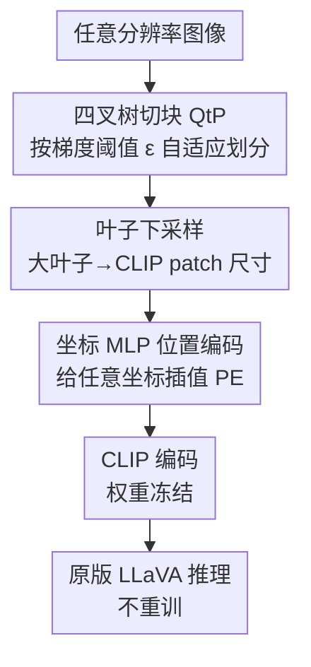

# QLIP: A Dynamic Quadtree Vision Prior Enhances MLLM Performance Without Retraining

**会议**: ICLR 2026  
**OpenReview**: [https://openreview.net/forum?id=DSq3r8PjpQ](https://openreview.net/forum?id=DSq3r8PjpQ)  
**代码**: https://github.com/KyroChi/qlip  
**领域**: 多模态VLM  
**关键词**: CLIP视觉编码器, 四叉树切块, 内容感知patch, 位置编码插值, 免训练

## 一句话总结
本文指出 CLIP 视觉编码器存在「介观偏置（mesoscopic bias）」和「插值偏置（interpolation bias）」两大缺陷，提出 QLIP——用内容自适应的四叉树切块替换均匀网格切块、再用一个小 MLP 重新插值位置编码，作为可一键替换的「drop-in」改造，**不重训练视觉编码器和 LLM** 就让 LLaVA-1.5 在细粒度 VQA 基准 V* 上提升最高 13.6%。

## 研究背景与动机
**领域现状**：以 LLaVA 为代表的多模态大模型（MLLM）普遍用 CLIP 视觉编码器把图像切成固定数量的视觉 token，再投影到与文本共享的语义空间送给下游 LLM。CLIP 的视觉塔几乎成了 MLLM 的事实标准基础组件。

**现有痛点**：CLIP 编码器有两个被广泛诟病的硬伤——只能吃固定分辨率的输入；对相似但不相同的图像无法产生足够分离的嵌入。结果就是 MLLM 在「细粒度视觉问答」上表现很差，问一个画面里某个小物体的细节经常答不上来。已有改进大多假设「错在 CLIP 本身」，于是去换编码器，但换编码器往往要把整条 MLLM 流水线重训一遍，代价高到很多场景根本不可行。

**核心矛盾**：作者提出一个不同的判断——失败**不是**因为 CLIP 表征能力不够，而是因为「喂给 LLM 的 token 质量不好」。已有工作显示，只要把「正确的」token 喂给原版 LLaVA，它的 VQA 能力其实远超现状。换句话说，模型有能力，缺的是高质量输入信号。

**本文目标**：在**不重训练**视觉编码器和 LLM 权重的前提下，同时改善粗粒度和细粒度的视觉理解。作者把问题拆成两个具体偏置去攻：

**切入角度**：作者把 CLIP 的失败归因到训练时隐含的两个归纳先验。**介观偏置**来自均匀网格切块（UGP）：CLIP 在固定尺度图像上训练，于是下游模型把「某个特定图像尺度下的网格单元」当成语义的基本单位——同一只大象放大或缩小到非介观尺度，CLIP 就认不出了。**插值偏置**来自固定分辨率上学到的绝对位置编码：分辨率只要变几个像素，CLIP 对语义的识别能力就会大幅下降，且无法原生处理高分辨率图。

**核心 idea**：用「内容感知的四叉树切块」替代均匀网格来消除介观偏置——让语义相似的区域（而非固定网格）成为语义基本单位；再训练一个小 MLP 把固定位置编码插值到任意坐标，消除插值偏置。两者都是免训练 LLM、可即插即用的轻量改造。

## 方法详解

### 整体框架
QLIP（"quadtree" + "CLIP" 的合成词）是对 CLIP 编码器输入端的一次改造，整条改造发生在**编码之前**，因此对下游 LLaVA 完全透明。流程是：输入任意分辨率图像 → 用四叉树切块（QtP）按内容自适应地把图像划分成数量可变的叶子 patch（信息稀疏区合并、信息密集区保留细粒度）→ 大于 CLIP patch 尺寸的叶子下采样回标准 patch 尺寸 → 把这些 patch 连同它们的真实归一化坐标送进 CLIP，patch 嵌入照常算，但**位置编码改由训练好的坐标 MLP 给出**（而非查 24×24 固定表）→ 得到的 token 序列直接喂给原版 LLaVA，无需任何重训练。两个模块各自针对一个偏置：QtP 治介观偏置，坐标 MLP 治插值偏置。

### 关键设计

**1. 四叉树内容感知切块（QtP）：让语义而非固定网格当切块单位**

针对介观偏置：自然图像的信息分布并不均匀，很多像素对语义没有贡献（这也是 JPEG 之类压缩能 work 的原因）。作者用四叉树这种二维层次结构来自适应选 token——根节点是整张图，每层把图像四等分，直到叶节点是单个 patch；然后按某个准则剪枝，剩下的叶子就是满足「极大条件」的子图。对大于 CLIP patch 尺寸的叶子做下采样回介观尺度，对占视野很小但重要的细节则相当于被「上采样」到 CLIP 期待的尺度。这样语义不相关的大片区域被压成少量 token，关键细节反而获得足够分辨率。

剪枝准则是「patch 上平均梯度的最大值」：一张子图 $I$ 若不能再细分，或满足 $D(I) := \max_{x,y}(|\partial_x I| + |\partial_y I|) < \varepsilon$，则成为叶节点，其中 $\varepsilon$ 是预先选定的选择常数。$\varepsilon$ 越大剪得越狠、token 越少。直觉上梯度大的区域（边缘、纹理、小物体）信息密度高需要保留，平坦区域可以合并。作者还用「随机剪枝」作为消融对照，验证收益确实来自梯度信号而非单纯减 token。

**2. 坐标 MLP 位置编码插值：让 CLIP 原生吃任意分辨率**

针对插值偏置：CLIP 在 336×336 上训练，按 14×14 的 patch 切成 24×24=576 个 patch，每个 patch 有一个固定位置嵌入 $E_{ij}\in\mathbb{R}^{1024}$。原始映射只在 $M(-1+\frac{2i}{23}, -1+\frac{2j}{23})=E_{ij}$ 这些离散网格点有定义。QtP 产生的 patch 坐标是连续、不规则的，没法查这张固定表。作者把映射 $M$ 用一个小 MLP 扩展到整个 $[-1,1]^2$ 方形域上，对任意坐标都能给出位置编码，从而原生支持任意分辨率。MLP 输入先过一层 48 维 Fourier features 提升对坐标的表达力。

训练这个 MLP 的关键是「保持 [CLS] token 不变」假设：同一张图的原生分辨率版本和 336×336 版本，CLIP 的 [CLS] 嵌入应当近似不变，于是 $L_{[CLS]} := \|E_{[cls]}(G) - E_{[cls]}(P)\|_{L2}$ 应当很小（$G$ 是标准 UGP，$P$ 是新切块）。但仅凭这一项不够——transformer 池化生成 [CLS] 时，只要位置编码之和守恒，[CLS] 就不变，约束太松。因为下游 MLLM 还会用到逐 patch 的位置信息，作者补了一项残差 L1 误差，强制 MLP 在标准 24×24 网格上对齐原 CLIP 位置编码：$R(M,E)=\frac{1}{576}\sum_{i=1}^{24}\sum_{j=1}^{24}\big|M(-1+\frac{2i}{23},-1+\frac{2j}{23})-E_{ij}\big|$。最终损失为 $\text{Loss}=L_{[CLS]}+\vartheta R$，其中 $\vartheta$ 平衡两项（实验取 1）。用 L1 而非 L2 是因为目标残差要压到 $5\times10^{-7}$ 以下，L1 更合适。

**3. 一个可调旋钮 ε 适配粗/细粒度任务：免训练就能换档**

QtP 的剪枝强度 $\varepsilon$ 是唯一需要按任务调的旋钮，MLP 训练一次后即可复用。性能对 $\varepsilon$ 和图像尺寸呈**非单调**关系：作者建议细粒度任务用 $\varepsilon>0$（剪得多、信号更聚焦），一般 VQA 用 $\varepsilon\approx0$（接近基线行为）。这让同一套权重无需重训就能在不同任务间换档——把 $\varepsilon=0$ 配 336×336 图像就几乎复现 CLIP 基线，任何超出此的损失都可归因于 MLP 插值的近似误差。这也解释了为什么 QLIP 能在细粒度任务上大涨、同时在一般基准上「几乎不掉点」。

### 损失函数 / 训练策略
只训练坐标 MLP，成本远低于重训 MLLM：4 张 NVIDIA L40S 上 11 小时，Imagenette（ImageNet 的 10 类小子集，约 1 万张图）上跑 100 epoch，Adam 优化，batch size 14。作者论证数据集选择无关紧要，因为映射 $M$ 与图像内容无关。MLP 用 4 个隐藏层 + 48 维 Fourier features，$\vartheta=1$。图像保持原生分辨率或最短边 560（取小者）。

## 实验关键数据

### 主实验
在 LLaVA-1.5 的 7B / 13B 上集成 QLIP，对比原版 LLaVA（每个基准报告超参 sweep 的最优分数）：

| 模型 | V* | MM-Bench | POPE F1 | CV-Bench | Sci-QA | MME | RW-QA |
|------|----|----------|---------|----------|--------|-----|-------|
| LLaVA-1.5-7B | 42.4 | 62.5 | 74.4 | 39.9 | 64.0 | 1207 | 49.0 |
| + QLIP | **53.4** (+11.0) | 59.7 (−2.8) | **79.6** (+5.2) | 40.2 | 63.5 | 1241 (+34) | 47.3 |
| LLaVA-1.5-13B | 45.0 | 67.4 | 82.4 | 61.6 | 67.8 | 1390 | 48.0 |
| + QLIP | **58.6** (+13.6) | 67.9 | **83.6** (+1.2) | 60.7 | 67.9 | 1388 | 49.4 |

V* 是聚焦细粒度、需要全分辨率图才能答的视觉中心基准，QLIP 在此提升最显著（13B 上 +13.6%），并比之前基于 CLIP 的 LLaVA SOTA（Shi et al. 2024 的 S2）再高 +3.1%。POPE F1（衡量幻觉）也涨 5.2，说明减少 token 数能降低幻觉。MM-Bench、CV-Bench、Sci-QA、MME、RealWorld-QA 基本持平。

与其他细粒度 grounding 方法对比（V* 子项）：

| 模型 | V*-Att | V*-Rel | V* Overall | POPE F1 |
|------|--------|--------|-----------|---------|
| QLIP-7B | 50.4 | 60.5 | 53.4 | 79.6 |
| S2-7B (需预训练+指令微调) | 51.3 | 61.8 | 55.5 | - |
| QLIP-13B | 53.9 | 65.8 | 58.6 | 83.6 |
| S2-13B | 50.4 | 63.2 | 55.5 | - |
| SEAL-7B (需换编码器+重训) | 74.8 | 76.3 | 75.4 | 82.4 |

值得注意：QLIP 在 POPE 上甚至超过专为细粒度 VQA 重度优化的 SEAL；而 S2 需要预训练+指令微调、SEAL 需要完全替换编码器再预训练，QLIP 全程不动 LLM 权重。

### 消融实验

| 配置 | 关键发现 | 说明 |
|------|---------|------|
| MLP 插值 vs 双三次/双线性 | 双三次、双线性在 V* 上甚至跌破基线 | MLP 插值对推广到任意分辨率是必需的 |
| 梯度选择 vs 随机剪枝 | 同 token 预算下梯度选择平均大幅领先 | 收益来自语义信号而非单纯减 token |
| 仅 MLP（无 QtP） | 已能让模型用上原图全部 token、显著缩小差距 | 证明「缺的是高质量输入」而非模型能力 |

### 关键发现
- **「能力够、缺好输入」得到实证**：仅靠 MLP 插值（不剪枝）就已让 V* 大幅回升，说明 CLIP+LLaVA 本身有足够容量，瓶颈在输入信号质量。
- **减 token 反而更好**：在 Figure 6 的绿色区域，QLIP 用**比基线更少**的视觉 token 拿到**更高**的准确率——作者称这是首次在实践中实现「更少 token、更高性能」。
- **13B 对长宽比/[CLS] 敏感**：13B 在 3 个基准上最优配置是裁成 336×336 方形、$\varepsilon<0.1$；性能跌落与 [CLS] 余弦相似度变化相关。7B 对未见图像尺寸更鲁棒。
- **POPE 峰值在小图+大 ε**：最短边 224、$\varepsilon=0.7$（约不到 50% 基线 token）时幻觉最低。
- **专精细粒度的代价**：为 V* 调到细粒度时，7B 在 MM-Bench、RealWorld-QA 上会回退——方法是有意为细粒度特化，揭示模型潜能而非取代重训。

## 亮点与洞察
- **重新定义失败归因**：把「细粒度 VQA 失败」从「CLIP 表征不行」重构为「token 质量不行」，这个判断直接决定了「不换编码器、只改输入」的轻量路线，是全文最关键的「啊哈」。
- **两个偏置都给了可量化指标**：介观偏置用去掉位置编码后的 [CLS] 余弦相似度 $C^z_{N\to336}$ 衡量，插值偏置定义为 $B_{Interp}(I):=\|\nabla_{PCS}(E_1,E_2)\|_2$（⚠️ 公式 OCR 可能有损，以原文为准），让「玄学缺陷」变成可测量、可对比的量。
- **drop-in 哲学**：几行代码即可接入、只训一个与图像内容无关的小 MLP，这种「最小侵入式」改造思路可迁移到任何仍在用绝对位置编码、固定分辨率的视觉编码器。
- **四叉树+梯度准则**这种经典图像处理结构被重新用在 MLLM 切块上，把「JPEG 为什么 work」的直觉迁移成 token 分配策略，巧妙且可解释。

## 局限与展望
- 作者承认方法**有意为细粒度任务特化**，调到细粒度档时会牺牲依赖全局/[CLS] 的粗粒度任务（如 7B 的 MM-Bench、RealWorld-QA 回退）。
- 与 InternVL、Qwen-VL 等新编码器（自带 token 缩减、多分辨率训练、相对/旋转位置编码）**不易直接集成**，作者把适配这类编码器留作未来工作。
- 13B 对图像长宽比和 [CLS] 偏移敏感，最优配置需逐基准 sweep $\varepsilon$ 和图像尺寸，调参成本不算零。
- 与 SEAL 这类重度优化方案相比，V* Overall 仍有明显差距（58.6 vs 75.4），方法定位是「免训练揭示潜能」而非「冲 SOTA」。

## 相关工作与启发
- **vs S2 (Shi et al. 2024)**：最接近的工作，同样冻结 CLIP，但靠多尺度 token 喂 LLM 且需要预训练+指令微调；QLIP 不动 LLM 权重，V* 上还反超 S2 +3.1%。
- **vs SEAL (Wu & Xie 2024)**：完全替换视觉编码器并重新预训练+指令微调，V* 绝对性能更高但代价极大；QLIP 在 POPE 上反超它，且零重训。
- **vs token 剪枝/合并方法（Cao/Chen/Hu/Sun 等）**：那些方法在**编码之后**剪枝、通常拿精度换效率，且都需重训对齐；QLIP 在**编码之前**的切块阶段提升信号质量，与它们正交甚至可作为它们的 CLIP 替换件。

## 评分
- 新颖性: ⭐⭐⭐⭐⭐ 把失败归因从「CLIP 不行」重构为「token 质量不行」，并用四叉树切块+坐标 MLP 两个轻量模块免训练落地，视角和方案都新。
- 实验充分度: ⭐⭐⭐⭐ 覆盖 7 个基准、两个尺寸、ε 与图像尺寸 sweep，消融分离了「梯度选择」与「减 token」两因素；但缺与新编码器的对比、绝对 SOTA 仍有差距。
- 写作质量: ⭐⭐⭐⭐ 偏置定义清晰、动机层层推进；部分公式符号偏理论、个别量化指标需对照原文。
- 价值: ⭐⭐⭐⭐⭐ 「几行代码、不重训」就提升细粒度 VQA 并降幻觉，对大量仍用 CLIP 的 MLLM 有直接实用价值。

<!-- RELATED:START -->

## 相关论文

- [\[ICLR 2026\] Why Reinforcement Fine-Tuning Preserves Prior Knowledge Better: A Data Perspective](why_reinforcement_fine-tuning_enables_mllms_preserve_prior_knowledge_better_a_da.md)
- [\[CVPR 2025\] MLLM-as-a-Judge for Image Safety without Human Labeling](../../CVPR2025/multimodal_vlm/mllm-as-a-judge_for_image_safety_without_human_labeling.md)
- [\[ICLR 2026\] SpatialViz-Bench：一个认知科学驱动、用于诊断 MLLM 空间可视化能力的基准](spatialviz-bench_a_cognitively-grounded_benchmark_for_diagnosing_spatial_visuali.md)
- [\[ICLR 2026\] Uni-DPO: A Unified Paradigm for Dynamic Preference Optimization of LLMs](uni-dpo_a_unified_paradigm_for_dynamic_preference_optimization_of_llms.md)
- [\[ICLR 2026\] TableDART: Dynamic Adaptive Multi-Modal Routing for Table Understanding](tabledart_dynamic_adaptive_multi-modal_routing_for_table_understanding.md)

<!-- RELATED:END -->
