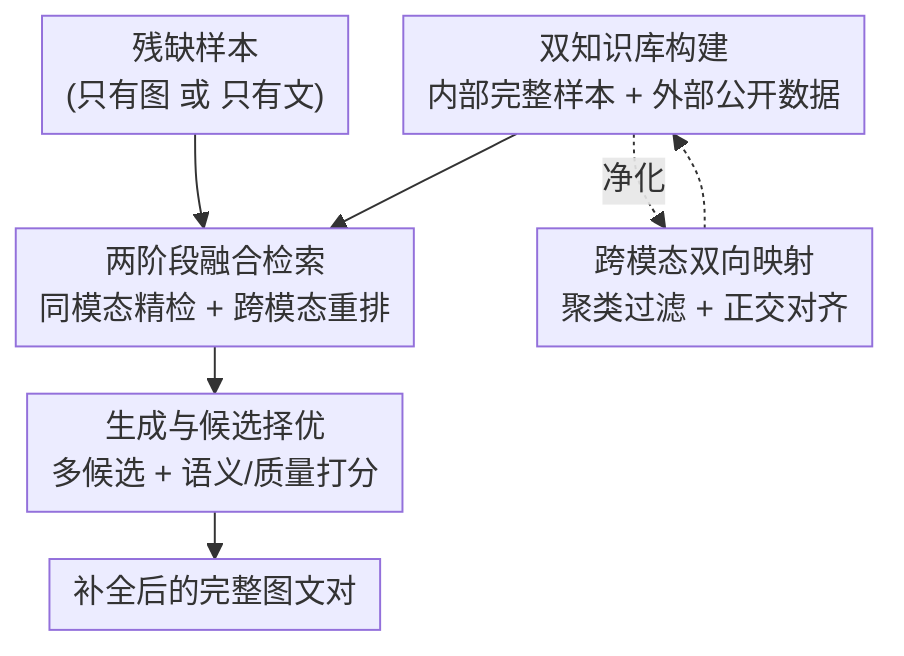

# RAG4DMC: Retrieval-Augmented Generation for Data-Level Modality Completion

**会议**: ICLR 2026  
**OpenReview**: [https://openreview.net/forum?id=6LA7KDjNsy](https://openreview.net/forum?id=6LA7KDjNsy)  
**代码**: 待确认  
**领域**: 多模态VLM / 检索增强生成  
**关键词**: 缺失模态补全, 检索增强生成, 双知识库, 跨模态对齐, 图文检索

## 一句话总结
RAG4DMC 把检索增强生成（RAG）第一次搬到「数据级缺失模态补全」上：用「数据集内部完整样本 + 外部公开数据集」组成双知识库，经过跨模态映射、聚类过滤和正交对齐净化后，靠两阶段多模态融合检索取回最相关的示例，再引导生成模型产出多个候选并择优填补缺失的图像或文本，让下游图文检索 / 图像描述任务训练在补全后的数据上涨点最高 +5.0。

## 研究背景与动机
**领域现状**：多模态数据集在实际采集中经常「缺模态」——传感器失灵、标注成本高、数据损坏都会导致某些样本只有图像或只有文本。为了把这些残缺样本利用起来，**缺失模态补全（Missing Modality Completion, MMC）** 应运而生：从已有模态推断 / 重建缺失模态。一个自然的做法是直接拿预训练生成模型（如扩散模型、图文模型）条件生成缺失部分。

**现有痛点**：直接套用预训练生成模型在「领域特定」数据上往往效果差，因为它们没适配具体领域；而微调又面临三重困难——(i) 完整样本本来就少，微调容易过拟合、丢掉泛化性；(ii) 很多强生成模型只开放推理 API、根本没法微调；(iii) 微调大模型成本高、吃资源。已有的数据级补全方法（Knowledge Bridger、GTI-MM、DiCMoR）还普遍存在幻觉、对稀有样本泛化差、资源消耗大的毛病。

**核心矛盾**：要补出「领域忠实」的缺失模态，既需要领域内知识（但内部完整样本太稀疏，覆盖不了多样的缺失情况），又想借外部海量公开数据补充（但外部数据存在噪声、与目标领域有 domain shift，直接混进来反而帮倒忙）。

**本文目标**：把 RAG 范式引入 MMC，需要回答两个子问题——(i) 如何从可用多模态数据构建一个有效的知识库；(ii) 如何设计检索策略，让取回的上下文最能增强缺失模态的生成。

**切入角度**：作者观察到 RAG 在 NLP 里靠「检索真实示例做接地（grounding）」缓解了幻觉，那把真实的图文配对当作生成时的「参考答案」喂给生成模型，应该也能让补全更忠实。但难点在于：跨模态检索受「模态鸿沟」拖累（即便 CLIP 这种联合编码器，配对图文的 embedding 仍占据不同子空间），内部数据又太少、外部数据又脏。

**核心 idea**：构建「内部 + 外部」双知识库并做三重净化（跨模态映射 + 聚类过滤 + 正交对齐），再用「先同模态精检、后跨模态重排」的两阶段融合检索取回示例，最后生成多候选并按语义一致性择优——用检索到的真实示例为生成「接地」，在原始数据层面而非隐特征层面补出缺失模态。

## 方法详解

### 整体框架
RAG4DMC 处理的是图文双模态数据集 $D=\{(x^I_t, x^T_t)\}_{t=1}^N$，其中很多样本只观测到图像 $x^I$ 或文本 $x^T$ 之一。目标是让一个预训练生成模型 $G$ 借助双知识库把缺失模态补出来：$\hat{x}=G(x, R(x; K_{int}\cup K_{ext}))$，其中 $R(\cdot)$ 是从双库里检索。整条流水线分三大块：**先建一个净化过的双知识库** → **对残缺样本做两阶段融合检索取回示例** → **生成多候选并择优补全**。

下面按「双知识库构建 → 多模态融合检索 → 生成与候选择优」三个贡献模块展开。

### 关键设计

**1. 净化版双知识库：内部供领域知识、外部补覆盖广度，三招消除错位与噪声**

针对「内部样本太少、外部样本太脏」的核心矛盾，RAG4DMC 把目标数据集里的完整图文对组成内部库 $K_{int}=\{(x^I_i,x^T_i)\}_{i=1}^{N_c}$，再从 CC3M / LAION 这类公开数据集取图文对组成外部库 $K_{ext}=\{(x^I_m,x^T_m)\}_{m=1}^M$。内部库提供领域特定信息，外部库补充覆盖度，但直接拼会带来三个问题：同数据集内模态间的 embedding 错位、外部数据的噪声与不相关、内外源之间的 domain shift。论文对应给出三招净化。

其一是**跨模态双向映射**：用固定的预训练编码器 $E_I, E_T$ 抽 embedding，再训一个共享参数的轻量 MLP 学双向映射 $f_{I\to T}, f_{T\to I}$，目标是让一个模态映射过去能逼近另一模态：
$$L_{map}=\frac{1}{|P_{int}|}\sum_{(x^I_i,x^T_i)\in P_{int}}\big(\|f_{I\to T}(z^I_i)-z^T_i\|_2^2+\|f_{T\to I}(z^T_i)-z^I_i\|_2^2\big)$$
这样残缺样本就能用已有模态「造出」缺失模态的伪 embedding 供检索用，而且只在内部配对上训练即可（因为外部库随后会被对齐进内部空间）。其二是**聚类过滤**：对内外部 embedding 各做 K-means 得到簇心 $\mu$，把每个外部簇心匹配到最近的内部簇心，用「簇心级相似度 $s_{cent}$」和「实例级相似度 $s_{inst}$」两道阈值 $\tau_{cent},\tau_{inst}$ 先剪掉整簇不相关的、再在保留簇内剪掉离群实例，既提效率又去噪声。其三是**跨域对齐**：借鉴 MUSE，用 CSLS 找内外部的互最近邻（MNN）配对，再解正交 Procrustes 问题 $W^*=\arg\min_{W\in O(d)}\|Z_{int}-Z_{ext}W\|_F^2$（SVD 有闭式解），迭代刷新 MNN 直到 $\|W^{(r)}-W^{(r-1)}\|_F<\epsilon$ 收敛，把外部 embedding 旋转进内部语义空间。三招合起来产出一个语义一致的多模态知识库，每条目同时存「原始数据 + 对齐后的图文 embedding」。

**2. 两阶段多模态融合检索：先同模态精检保精度，再跨模态重排补对齐**

针对「跨模态检索被模态鸿沟拖累」的痛点，作者不直接做跨模态检索（如拿文本去检图），而是设计两阶段融合。以「图像缺文本」为例：先对查询图 $x^I_j$ 取 embedding $z^I_j$，并用学好的映射造伪文本 embedding $\hat{z}^T_j=f_{I\to T}(z^I_j)$。**第一阶段同模态 top-k 精检**——只比图像与图像的相似度 $s_{img}(r)=\cos(z^I_j, z^I_r)$，取相似度最高的 $k$ 个候选集 $A$，因为同模态相似度判别力强、不受模态鸿沟干扰。**第二阶段跨模态重排**——对 $A$ 里的候选用融合分数重新排序：
$$sim_{fuse}(r)=\alpha\cos(z^I_j, z^I_r)+(1-\alpha)\cos(\hat{z}^T_j, z^T_r)$$
即一边保留图像本身的相似度、一边引入「伪文本对真实文本」的跨模态线索，取融合分第一的样本，把它的文本 $x^T_{r^\star}$ 作为示例。这样既保住了同模态检索的精度，又借跨模态信息纠正了语义对齐，比直接跨模态检索取回的候选更语义一致。最终把示例拼成提示词 $P$（"Please write two captions of the image. Caption 1: …"）连同原图喂给生成器 $\tilde{x}^T=G_{I2T}(x^I_j, P)$。文本缺图像的情况对称处理。

**3. 多候选生成 + 语义/质量双指标择优：把生成多样性转化为真实增益**

针对「单次生成易退化、不够忠实」的问题，RAG4DMC 让模态专用生成器（$G_{I2T}$ 做图生文、$G_{T2I}$ 做文生图）一次产出 $n$ 个候选，增加多样性、降低退化风险，再用候选选择机制挑出最忠实、最连贯的那个。对图生文，每个候选文本同时考量「语义对齐」和「语言质量」：
$$s_T(\tilde{x}^T)=\lambda_1\cdot\cos(E_T(\tilde{x}^T), \hat{z}^T)+\lambda_2\cdot\text{BLEU}(\tilde{x}^T)$$
其中 $\hat{z}^T$ 是输入图像导出的伪文本 embedding，BLEU 衡量与检索示例 $x^T_{r^\star}$ 的 n-gram 重合。对文生图则用语义相似度减去无参考画质指标 NIQE（越低越好）：$s_I(\tilde{x}^I)=\lambda_1\cos(E_I(\tilde{x}^I),\hat{z}^I)-\lambda_2\text{NIQE}(\tilde{x}^I)$。取分数最高者作为最终补全。实验证明 $n$ 越大效果越好（$n$ 从 1 到 10，Avg R@1 从 47.1 升到 48.1），说明择优机制确实能把多样性过滤成真实增益、滤掉噪声输出。

### 损失函数 / 训练策略
真正需要训练的只有跨模态映射 MLP（损失 $L_{map}$，仅在内部完整配对上训），编码器 $E_I, E_T$ 固定不动、生成器（BLIP2 做文本、Stable Diffusion XL 1.0 做图像）直接调用预训练权重不微调——这正好规避了「完整样本少、API 受限、微调贵」三大难题。聚类过滤的阈值 $\tau_{cent},\tau_{inst}$、检索数 $k$、候选数 $n$、融合权重 $\alpha$ 都是超参；主实验取 $k=10$。下游评测时，在补全后的数据上训练 CLIP（AdamW, lr 1e-4, 20 epochs）测图文检索，微调 LLaVA（LoRA, lr 2e-5, 2 epochs）测图像描述。

## 实验关键数据

### 主实验
在通用域（MSCOCO、Flickr30K）和领域特定（遥感 RSICD）数据集上，用补全后数据训练下游模型并测图文检索（R@1/R@5）与图像描述（CIDEr/BERTScore）。MSCOCO 默认 70% 缺失率下的主结果：

| 方法 | I2T R@1 | T2I R@1 | CIDEr | BERTScore |
|------|---------|---------|-------|-----------|
| Complete（上界） | 48.9 | 49.6 | 127.9 | 92.6 |
| Drop-Incomplete（丢残缺） | 35.4 | 35.1 | 109.2 | 92.1 |
| Direct Generation | 41.4 | 43.9 | 112.2 | 92.2 |
| Knowledge Bridger | 42.5 | 44.5 | 112.2 | 92.2 |
| Vanilla-RAG | 44.9 | 44.6 | 113.4 | 92.3 |
| KFA-RAG | 45.9 | 46.4 | 115.8 | 92.3 |
| **RAG4DMC** | **46.6** | **47.5** | **117.2** | **92.5** |

Flickr30K 上 RAG4DMC（I2T R@1 = 52.9，CIDEr = 70.4）几乎逼近 Complete 上界（53.2 / 71.2）。论文称下游图文检索最高 +5.0 Avg R@1、图像描述最高 +5.0 CIDEr（相对直接生成补全）。

### 消融实验
作者用一组层层递进的 RAG 变体当消融，正好拆解每个模块的贡献（MSCOCO，70% 缺失率）：

| 配置 | Avg R@1 | 说明 |
|------|---------|------|
| Vanilla-RAG（仅内部库 + 朴素跨模态检索） | ~44.8 | 检索接地带来 +2.2 Avg R@1（vs Drop-Incomplete） |
| Combined-RAG（内外部直接混合，无过滤对齐） | ~44.7 | 比 Vanilla 不升反平，噪声与 domain shift 抵消了外部数据 |
| KFA-RAG（过滤+对齐知识库，仍朴素检索） | ~46.2 | 过滤对齐带来 +1.5 Avg R@1、CIDEr 113.0→115.8 |
| **RAG4DMC（+ 多模态融合检索）** | **47.1** | 融合检索再涨，逼近 oracle 上界 |

### 关键发现
- **外部数据必须先净化再用**：Combined-RAG 直接混外部数据相比只用内部的 Vanilla-RAG 几乎没涨、图像描述任务上 RSICD 的 CIDEr 还掉了 1.3%，因为噪声破坏了语言一致性；加了过滤对齐（KFA-RAG）才把 CIDEr 救回来——印证了知识库净化是外部数据生效的前提。
- **融合检索在领域特定数据上最关键**：RSICD（遥感）上，CLIP 没在遥感数据上训过、模态鸿沟更大，标准 RAG 变体（Vanilla/Combined/KFA）的 R@1 反而崩到 4.8~5.3，远低于不检索的方法；唯有 RAG4DMC 的多模态融合检索把性能拉回 8.7，说明同模态精检对抗模态鸿沟的作用。
- **缺失率越高、增益越明显**：70% 缺失率下 RAG4DMC 比 Vanilla-RAG 多 +2.3 Avg R@1，越缺数据、检索接地越救命。
- **候选数 $n$ 与检索数 $k$ 都有甜点**：$n$ 越大越好（择优有效）；$k$ 从 3 增到 10 稳步上升，但 $k=15$ 略降（引入不相关示例误导生成），故取 $k=10$。过滤阈值 $\tau$ 在 0.6–0.8 区间内结果高度稳定，鲁棒性好。

## 亮点与洞察
- **把 RAG 从「特征级近似」推到「数据级重建」**：相关工作 MissRAG 只在推理时检索原型表示去近似缺失「特征」，RAG4DMC 是首个在原始数据层面真正生成缺失模态的 RAG 方法，产出的是可被任意下游任务复用的真实图文对，而非一次性的隐特征。
- **「先同模态精检、后跨模态重排」是绕开模态鸿沟的巧招**：与其强行跨模态检索吃模态鸿沟的亏，不如用判别力强的同模态相似度先框定候选池，再用伪 embedding 引入跨模态线索做精排——这个两阶段思路可迁移到任何受模态鸿沟困扰的跨模态检索任务。
- **用「下游任务效用」而非重建保真度评估补全质量**：在补全数据上训 CLIP / LLaVA 看涨点，比直接比像素 / token 相似度更贴近补全的真实用途，规避了生成质量指标的主观性。
- **全程不微调大生成模型**：只训一个轻量映射 MLP，编码器和生成器都冻结、纯靠检索接地+择优，天然适配「只有 API、不能微调」的现实约束。

## 局限与展望
- **只验证了图文两模态**：方法框架以图像-文本对为例，缺失模态补全在音频、视频、传感器等更多模态、或三模态以上场景下是否同样有效未验证。
- **依赖外部公开数据集的可得性与相关度**：净化机制虽能去噪，但若外部库与目标领域差异极大（如 RSICD 遥感），可用的外部知识本就稀薄，增益上限受外部覆盖度制约。
- **多候选生成成本**：候选数 $n$ 越大效果越好，但每个残缺样本要生成多个候选再打分，推理开销随 $n$ 线性增长，论文未充分讨论补全大规模数据集的总成本。
- **候选打分指标偏启发式**：BLEU、NIQE、余弦相似度的加权选择依赖 $\lambda_1,\lambda_2$ 调参，对不同领域是否需要重新调权、能否换更强的语义一致性判别器，值得进一步探索。

## 相关工作与启发
- **vs 非补全方法（fusion / missing-indicator）**：它们直接从已观测模态做预测、不显式补全，胜在简单，但生成不出可复用的多模态样本，跨任务复用受限；RAG4DMC 真正补出缺失模态，产物能跨任务复用。
- **vs 特征级补全（MMIN / SMIL / MissRAG）**：这些方法在共享隐空间里「想象」缺失特征，RAG4DMC 在数据空间重建真实模态，保真度和可复用性更高。
- **vs 数据级补全（Knowledge Bridger / GTI-MM / DiCMoR）**：同样在数据层补全，但它们靠结构化先验 / 提示词 / 归一化流，仍受幻觉、稀有样本泛化差困扰；RAG4DMC 用真实示例检索接地，缓解了幻觉、对稀有样本更稳，且无需微调生成模型。
- **vs 多模态 RAG（captioning / VQA 的检索增强）**：已有多模态 RAG 把检索用于辅助生成下游答案，RAG4DMC 把 RAG 的目标换成「补全训练数据本身」，并针对 MMC 专门设计了双库净化与融合检索。

## 评分
- 新颖性: ⭐⭐⭐⭐⭐ 首个数据级 RAG 缺失模态补全，双库净化 + 两阶段融合检索的组合点子扎实。
- 实验充分度: ⭐⭐⭐⭐ 覆盖通用/领域特定数据集、多缺失率、多超参敏感性，消融用层层递进的变体拆解贡献，较完整；但模态仅限图文。
- 写作质量: ⭐⭐⭐⭐ 动机—挑战—方法对应清晰，公式完整；部分净化细节放进附录略影响自洽阅读。
- 价值: ⭐⭐⭐⭐ 直击多模态数据集缺模态的现实痛点，补全产物可复用、不需微调大模型，落地友好。

<!-- RELATED:START -->

## 相关论文

- [\[ICLR 2026\] RAVENEA: A Benchmark for Multimodal Retrieval-Augmented Visual Culture Understanding](ravenea_a_benchmark_for_multimodal_retrieval-augmented_visual_culture_understand.md)
- [\[NeurIPS 2025\] Windsock is Dancing: Adaptive Multimodal Retrieval-Augmented Generation](../../NeurIPS2025/multimodal_vlm/windsock_is_dancing_adaptive_multimodal_retrieval-augmented_generation.md)
- [\[CVPR 2026\] RobustVisRAG: Causality-Aware Vision-Based Retrieval-Augmented Generation under Visual Degradations](../../CVPR2026/multimodal_vlm/robustvisrag_causality-aware_vision-based_retrieval-augmented_generation_under_v.md)
- [\[ACL 2026\] Utility-Oriented Visual Evidence Selection for Multimodal Retrieval-Augmented Generation](../../ACL2026/multimodal_vlm/utility-oriented_visual_evidence_selection_for_multimodal_retrieval-augmented_ge.md)
- [\[AAAI 2026\] Knowledge Completes the Vision: A Multimodal Entity-aware Retrieval-Augmented Generation Framework for News Image Captioning](../../AAAI2026/multimodal_vlm/knowledge_completes_the_vision_a_multimodal_entity-aware_retrieval-augmented_gen.md)

<!-- RELATED:END -->
