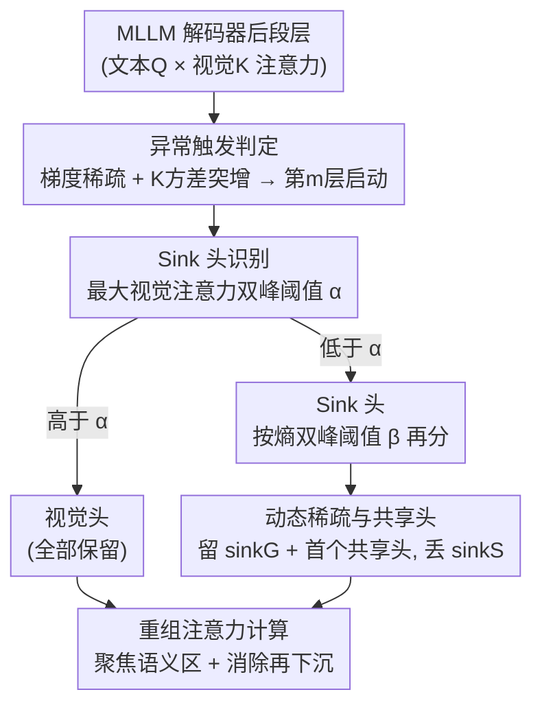

# RAR: Reversing Visual Attention Re-Sinking for Unlocking Potential in Multimodal Large Language Models

**会议**: ICLR 2026  
**OpenReview**: [https://openreview.net/forum?id=xTbFeDhdRG](https://openreview.net/forum?id=xTbFeDhdRG)  
**代码**: 待确认  
**领域**: 多模态VLM  
**关键词**: MLLM, 视觉注意力, attention sink, 次优输出层, 无参数稀疏化

## 一句话总结
本文发现 MLLM 的最终层往往不如中间层（"次优输出层"），把根因追溯到「视觉注意力再下沉（visual attention re-sinking）」——纯文本监督导致视觉 token 的注意力梯度逐渐稀疏，后段层的注意力又退回到低语义背景；并提出无参数的 SADS 框架，在推理时保留全部视觉头、只留极少数 sink 头（含一个共享头），在 20 个 benchmark 上超过标准 SFT 且推理提速 10.3%。

## 研究背景与动机
**领域现状**：MLLM 一般用「视觉编码器 + 连接器 + LLM 解码器」的结构，把图像特征对齐进文本嵌入后由解码器自回归生成回答。近期研究反复发现一个反直觉现象：无论视觉编码器还是 MLLM 解码器，**中间层的表征/精度常常超过最后的输出层**，说明模型的参数容量没有被充分激活。

**现有痛点**：以往工作大多停留在"现象层面"——要么用中间层特征做融合来缓解幻觉，要么做事后（post-hoc）修补，**很少深究"为什么输出层是次优的"**，更没有从训练机制上根治。

**核心矛盾**：MLLM 与纯 LLM 的关键差异在于它必须融合视觉与语言，而**现有训练范式的监督信号完全是文本的，没有对视觉信号的直接监督**。于是视觉 token 的梯度只能靠文本损失经注意力机制反向传播得到，学习能力受限，整体梯度分布越训越稀疏。

**切入角度**：作者从注意力的两个维度拆解视觉注意力的作用——① 分给图像的总注意力，② 视觉注意力在各 vision token 上的分布。实验发现总量在各层是稳定的，问题出在**分布**上：早期层注意力集中在低信息背景，中间层转向语义显著区，后段层又退回背景。这种后段层的回退被命名为「视觉注意力再下沉」。一个训练无关的干预（把最后 5 层 sink token 的注意力权重重新分配给语义相关的 vision token）在 VQAvg 上带来 0.74% 的精度提升，验证了它就是次优输出层的主因。

**核心 idea**：既然问题是后段层"该看图却退回看背景"，就**在后段层动态地保留所有真正看语义区的"视觉头"、稀疏掉那些把注意力下沉到孤立无意义 token 的"sink 头"**，并保留少量承载全局/上下文信息的 sink 头，从而消除再下沉、激活输出层潜力。

## 方法详解

### 整体框架
RAR 的方法主体是 **SADS（Sink Attention Dynamic Sparsification）框架**，一个无参数、与架构无关、可直接挂到不同 MLLM 上的注意力稀疏化模块。它只在解码器**后段层**生效：当检测到某层出现注意力梯度稀疏 + key 矩阵方差异常突增时（这正是再下沉的信号），从该层开始启动 SADS。启动后，对该层的多头注意力做三件事：先用「最大视觉注意力」的双峰分布把所有头切成**视觉头**与 **sink 头**；再在 sink 头内部用「非视觉 token 交叉注意力熵」的双峰分布，把 sink 头分成承载全局上下文的 **sinkG 头**与把注意力下沉到孤立低语义 token 的 **sinkS 头**；最后只用「全部视觉头 + 保留的 sinkG 头 + 指定的首个共享头」重组注意力计算，丢弃 sinkS 头。这样既让模型重新聚焦语义显著区、消除再下沉，又通过共享头守住全局与上下文信息，同时省掉 sink 头的冗余计算换来推理加速。

### 关键设计

**1. 异常触发判定：只在"再下沉"真正发生的后段层动手**

如果对所有层一刀切地稀疏注意力，会破坏早期层已经建立好的模态对齐。作者从分析中发现再下沉有明确的"指纹"：随训练迭代，后段层的注意力梯度从约 2000 步开始变稀疏，到约 3000 步 sink 头数量开始增长；与此同步，sink 头的 key 矩阵方差呈「早期下降 → 中间平台 → 后段陡增」的轨迹，且正是高方差的 key 让 sink token 获得了偏高的注意力权重（注意力打分里 $\frac{Q_t K_v^\top}{\sqrt{d_k}}$ 的 key 方差越大、越容易吃到大权重）。因此 SADS 把"出现 K 方差波动 + 梯度稀疏"的那一层作为起始层 $m$（论文中 Qwen2.5-VL-3B 从第 20 层、InternVL2-2B 从第 15 层、LLaVA-1.5-7B 从第 20 层开始），只对 $m$ 及之后的层启动，从而保住前段的模态对齐、只在后段提效。

**2. Sink 头识别：用双峰高斯分布的"谷底"做无参数阈值**

要把头分对，关键是找到一个不靠人工调参、不引入额外参数的判别准则。作者统计后段层 1600 个头的最大视觉注意力，发现它呈清晰的**双峰分布**：视觉头聚在高值、sink 头聚在低值。于是用高斯混合（GMM、EM 拟合）建模 $p(x)=\sum_{k=1}^{2}\pi_k \mathcal{N}(x\mid \mu_k,\sigma_k^2)$，取两峰之间的谷底 $\alpha=\arg\min_x p(x)$ 作为阈值，最大视觉注意力高于 $\alpha$ 的是视觉头、低于的是 sink 头。在 sink 头内部再用同样的思路细分：对每个头取非视觉 token 的注意力子矩阵 $A_{sub}=A[:,I]$，按行归一化后求平均分布 $p_j=\frac{1}{L_q}\sum_{i=1}^{L_q}A_{sub}[i,j]$，算熵 $H=-\sum_{j\in I}p_j\log p_j$；熵同样服从双峰高斯，取谷底 $\beta$ 把 sink 头分成高熵的 **sinkG**（注意力均匀铺开、保住全局上下文）与低熵的 **sinkS**（把注意力完全砸到个别低语义 token）。两个谷底阈值都随每层分布自适应，因此整个识别过程无参数、对噪声鲁棒。

**3. 动态稀疏化与共享头：保全视觉、只留必要 sink，兼顾稳定与提速**

识别完成后，SADS 的执行很直接也很关键：**保留全部视觉头**（密集语义信息不能丢），保留高熵 sinkG 头（全局/上下文知识有用），**丢弃 sinkS 头**（它们把注意力下沉到孤立无意义 token，正是破坏模态融合、把输出推向文本先验的元凶），并**指定第一个头作为共享 sink 头**以保证模型稳定、兜住必要的全局信息。表 1 的消融正好印证这套取舍：去掉 sinkS 头反而涨点（39.5→43.8），额外加一个 sinkS 头则掉到 43.0，去掉一个 sinkG 头掉到 43.2，去掉一个视觉头掉到 42.6——说明 sinkS 是负担、而视觉头与 sinkG/共享头都不可或缺。在微调阶段，这种稀疏化会**逼迫模型优先利用视觉特征、避开文本捷径**，从而更深地做视觉-文本融合，表现为下游幻觉减少、视觉定位变强；推理阶段则因为省掉了 sink 头的冗余注意力计算而提速。

### 损失函数 / 训练策略
SADS 本身无新增参数、不改训练目标，超参数与 SFT 及各 base 模型保持一致。训练数据聚合自 RefCOCO、Dcube、VG、GQA、OCR-VQA、Text-VQA、CLEVER 共约 670k 样本，覆盖五大任务类别；关键的"训练策略"是把 SADS 作为微调时的注意力约束，使模型在后段层被迫聚焦视觉，从而把"次优输出层"扳正为"逐层递增"。

## 实验关键数据

### 主实验
在 Qwen2.5-VL-3B / 7B / 32B、InternVL2-2B、LLaVA-1.5-7B 五个 base 模型、20 个 benchmark 上，RAR（即挂载 SADS 微调）一致优于 base 与标准 SFT。下表摘取 Qwen2.5-VL-3B 的代表性结果：

| 任务/数据集 | 指标 | Base | +SFT | +Ours(RAR) |
|--------|------|------|------|------|
| 通用 VQA / VQAv2 | Acc | 76.7 | 77.9 | **79.7** |
| 通用 VQA / GQA | Acc | 60.4 | 62.0 | **64.2** |
| 通用 VQA / MMStar | Acc | 53.0 | 53.7 | **55.4** |
| OCR / TextVQA | Acc | 78.7 | 79.0 | **80.4** |
| 定位 / OVDEval | Acc | 39.5 | 39.9 | **43.8** |
| 定位 / RefCOCO/+/g | Acc | 84.2 | 84.6 | **86.8** |
| 视觉中心 / MMVP | Acc | 50.4 | 52.1 | **54.9** |
| 幻觉 / CHAIR↓ | ↓ | 35.6 | 35.4 | **32.6** |
| 幻觉 / POPE↑ | ↑ | 86.1 | 86.4 | **87.4** |

值得注意的是：在 LISA、OVDEval、DocVQA、CVBench、CLEVER 等**分布外**基准上 SFT 提升很小，RAR 却有明显增益；在幻觉任务上 SFT 偶尔甚至低于 base（多任务迭代训练加剧了语言先验偏置），RAR 则稳定缓解。

### 消融实验
表 1（OVDEval，Qwen2.5-VL-3B）验证各类头的作用：

| 配置 | Accuracy(%) | 说明 |
|------|---------|------|
| Qwen2.5-VL-3B | 39.5 | base |
| w/o sinkS head | **43.8** | 去掉 sinkS 头，涨点最多 |
| w/ 1 sinkS head | 43.0 | 多加一个 sinkS 头，反而掉 |
| w/o 1 sinkG head | 43.2 | 去掉一个 sinkG 头，掉点 |
| w/o 1 vision head | 42.6 | 去掉一个视觉头，掉点最明显 |

推理效率（表 4，Qwen2.5-VL-3B）：latency 1.332（base）/1.332（SFT）/**1.195**（Ours），整体推理提速 **10.3%**，同时精度从 39.5 提到 43.8。

### 关键发现
- **sinkS 头是纯负担**：去掉它涨点、加上它掉点；而视觉头、sinkG 头、共享头都掉不得——三者共同支撑了"既看清语义区又守住全局"。
- **次优输出层被扳正**：base 与 SFT 在后段层精度持续下滑，RAR 在后段层逐层递增，注意力热图也从"退回背景"变成"聚焦语义区"。
- **SFT 反而加剧梯度稀疏**：训练迭代越多、后段层注意力梯度越稀疏，RAR 显著缓解；这也解释了为何 SFT 随数据增大收益快速饱和、而 SADS 的数据扩展曲线更陡。

## 亮点与洞察
- **从"现象"挖到"机制"**：把"输出层次优"这一被反复观察到的现象，第一次系统归因到「文本独占监督 → 视觉梯度稀疏 → 视觉注意力再下沉」这条因果链，并用训练曲线（2000 步梯度变稀、3000 步 sink 头增多）坐实，比以往的事后修补更深一层。
- **无参数 + 架构无关 + 顺带提速**：不引入任何可学习参数、不改训练目标，只靠双峰分布谷底自适应分头，就能即插即用到 Qwen2.5-VL / InternVL2 / LLaVA-1.5，还因为砍掉 sink 头计算而提速 10.3%——"提点"和"提速"同时拿到很少见。
- **可迁移的判别思路**：用"某统计量呈双峰高斯、取谷底当动态阈值"来无参数地切分注意力头，这套做法可迁移到其他需要区分"有用头/冗余头"的剪枝、KV-cache 压缩、注意力可解释性场景。

## 局限与展望
- 起始层 $m$ 依赖"K 方差波动 + 梯度稀疏"来人工/经验确定（不同模型取值不同），还不是完全自动；对再下沉信号不明显的模型，触发层可能不好定。
- 方法建立在"最大视觉注意力 / 熵 恰好是双峰高斯"的经验观察上；若某些模型或任务下分布不是清晰双峰，GMM 谷底阈值的稳健性存疑（⚠️ 以原文统计为准）。
- 评测集中在感知/定位/幻觉类任务，对需要复杂多步推理、长文本生成的场景，"稀疏 sink 头是否会损失长程上下文"还缺乏专门验证。
- 共享头固定取"第一个头"，更多是稳定性经验选择，是否最优、能否学习地选共享头，值得进一步探究。

## 相关工作与启发
- **vs LLM 中的 attention sink / VAR**：LLM 的 attention sink 源于特定隐状态维度的大激活、出现在早期层并在后段消失；本文发现的视觉再下沉**没有大激活**、且是"早期出现→中期消失→后段重现"，机制不同。VAR 把视觉 attention sink 形式化并重分配注意力，本文则首次提出"再下沉"并从训练梯度稀疏给出成因。
- **vs 中间层融合 / 事后幻觉缓解**：以往方法（如利用或融合中间层视觉事实）是 post-hoc 修补，不触及根因；RAR 在微调阶段直接逼模型聚焦视觉、改掉再下沉，属于"治本"。
- **vs 标准 SFT**：相同数据与超参下，SFT 随数据增大收益饱和、甚至在幻觉任务上劣于 base；RAR 数据扩展性更好且全面超过 SFT，说明再下沉是阻碍 MLLM 数据 scaling 的隐性瓶颈。

## 评分
- 新颖性: ⭐⭐⭐⭐⭐ 首次提出并系统归因"视觉注意力再下沉"，把次优输出层从现象推到机制
- 实验充分度: ⭐⭐⭐⭐⭐ 5 个 base 模型 × 20 benchmark × 5 类任务，含层级、梯度、数据扩展等机制分析
- 写作质量: ⭐⭐⭐⭐ 因果链清晰、图表丰富，但部分自定义统计量（双峰假设）依赖图示、文字稍密
- 价值: ⭐⭐⭐⭐⭐ 无参数即插即用、提点又提速，对所有 MLLM 训练范式都有借鉴意义

<!-- RELATED:START -->

## 相关论文

- [\[ICML 2026\] Seeing is Understanding: Unlocking Causal Attention into Modality-Mutual Attention for Multimodal LLMs](../../ICML2026/multimodal_vlm/seeing_is_understanding_unlocking_causal_attention_into_modality-mutual_attentio.md)
- [\[ICLR 2026\] Constructive Distortion: Improving MLLMs with Attention-Guided Image Warping](constructive_distortion_improving_mllms_with_attention-guided_image_warping.md)
- [\[ICLR 2026\] Efficient Discriminative Joint Encoders for Large Scale Vision-Language Re-ranking](efficient_discriminative_joint_encoders_for_large_scale_vision-language_rerankin.md)
- [\[ICML 2026\] Large Vision-Language Models Get Lost in Attention](../../ICML2026/multimodal_vlm/large_vision-language_models_get_lost_in_attention.md)
- [\[ICLR 2026\] GranViT: A Fine-Grained Vision Model For Autoregressive Multimodal Large Language Models](granvit_a_fine-grained_vision_model_for_autoregressive_multimodal_large_language.md)

<!-- RELATED:END -->
