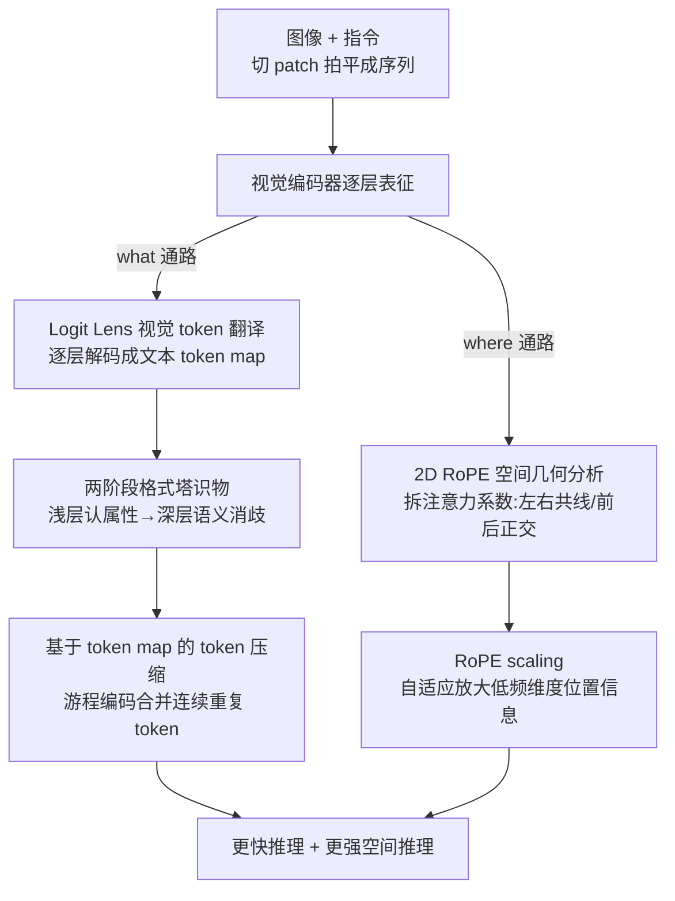

# Reading Images Like Texts: Sequential Image Understanding in Vision-Language Models

**会议**: ICLR 2026  
**OpenReview**: [https://openreview.net/forum?id=qYcZVezPW7](https://openreview.net/forum?id=qYcZVezPW7)  
**代码**: https://github.com/Siriuslala/vlm_interp  
**领域**: 多模态VLM / 可解释性  
**关键词**: VLM 可解释性, logit lens, 2D RoPE, 空间感知, token 压缩

## 一句话总结
本文借鉴人脑视觉的"双流假说"，把 VLM 的视觉处理拆成"识物（what）"和"定位（where）"两条线分别解剖：用 logit lens 把图像 patch 翻译成文本 token，发现视觉编码器是"先认属性、再消歧成物体"的两阶段格式塔式过程；又从理论上推导出 2D RoPE 编码空间关系的几何结构；并据此提出一个指令无关的 token 压缩算法（提速）和一个 RoPE scaling 技巧（增强空间推理）。

## 研究背景与动机
**领域现状**：当前主流 VLM 都是 Transformer 架构——视觉编码器（ViT）把图片切成 patch、按光栅扫描（raster scan）拍平成一维序列，连接器投影到文本语义空间，再和指令拼起来喂给 LLM 生成文本。这套流程在大量真实任务上效果很强。

**现有痛点**：第一，VLM 幻觉严重，经常认错物体、判错空间关系（"A 在 B 左边还是右边"都会搞混）；第二，模型内部机制是黑箱，既妨碍理解也妨碍架构创新；第三，已有的多模态可解释性研究很零散，多停留在"找某个神经元/注意力头对应某概念"，缺乏对视觉信息**逐层动态演化**的系统刻画。

**核心矛盾**：ViT 用的是为"天然有序的文本"设计的 Transformer，把二维图像硬拍成一维序列后，**同一物体的相邻 patch 会被打散到序列里不连续的位置**。而人脑视觉是格式塔式的——主动把离散信号组织成整体。这就引出根本疑问：VLM 究竟怎么用一维序列理解二维概念？这种"机器 vs 人"的认知鸿沟会不会损害性能？

**本文目标**：顺着双流假说拆成两个子问题——(1) VLM 如何把序列里位置不连续、却属于同一物体的 token 关联起来、预测出物体类别？(2) VLM 如何从一维序列里推断物体间的二维空间关系？

**切入角度**：作者不去训新模型，而是把"读图"当成"读文本"来解剖——既然视觉 token 最终要映射到文本空间，那就直接用语言模型的 unembedding 矩阵把每个图像 patch "翻译"成文本 token（logit lens），从而把抽象的视觉表征变成可读、可逐层观察的自然语言。

**核心 idea**：把图像表征"翻译成文本 token 地图"来看 what 通路的两阶段格式塔演化；从数学上拆解 2D RoPE 系数来看 where 通路的空间几何；再把这两个发现各自落成一个实用算法（token 压缩 + RoPE scaling），用工程效果反过来验证分析的正确性。

## 方法详解

### 整体框架
本文是一篇"分析 + 应用"双线论文，整体按"双流假说"分成两条独立又对称的研究线，每条都是"先观察机制、再据此造一个算法验证"。

第一条是 **what 通路（识物）**：对视觉编码器逐层施加 logit lens，把每层每个 patch 解码成文本 token，画出 token map / segmentation map，定量统计"属性词"和"代表词（物体标签）"随层数的此消彼长，得出"浅层认属性、深层做语义消歧"的两阶段结论；据此造出**基于 token map 的指令无关 token 压缩**算法（用游程编码合并连续重复 token）。

第二条是 **where 通路（定位）**：先分析可学习 1D 绝对位置编码的几何（t-SNE 可见明显行列结构），再聚焦更通用的 2D RoPE，从注意力内积里把空间关系系数拆出来做理论推导（"左右"共线、"左右 vs 前后"正交），用 PCA 与干预实验验证；并发现"携带相对距离的关键项幅值偏小、易被淹没"，据此造出 **RoPE scaling** 来放大低频维度的位置信息、增强空间推理。

### 关键设计

**1. Logit Lens 视觉 token 翻译：把"读图"变成"读文本"来逐层观察**

最大的痛点是视觉表征不可读、且深层 token 语义高度纠缠（自注意力让单个 token 混入大量其他 token 信息），靠余弦相似度等线性度量根本看不出语义。作者借用 logit lens：对第 $l'$ 层 LLM 输出的视觉部分 $H^{l'}=(v^{l'}_1,...,v^{l'}_{N_V})$ 直接乘语言模型的 unembedding 矩阵 $W_U$，取 argmax 得到每个 patch 对应的文本 token：$W^V=\arg\max_{w\in V}\mathrm{Softmax}(W_U[(v^{l'}_1,...,v^{l'}_{N_V})])$。为逐层观察 ViT，作者构造一族函数 $F=\{f_l\}_{l=1}^{L_V}$：删掉第 $l$ 层之后的 ViT 层、再对 LLM 第 $l'$ 层输出施加 logit lens（LLaVA-1.5-7B 取 $l'=25$、Qwen2.5-VL-7B 取 $l'=32$，因为有意义 token 在这些层涌现最明显）。在此之上提出两个可视化概念：**token map**（每个网格填入对应文本 token）和 **segmentation map**（为每个主物体建关键词集，命中就涂上该物体的颜色）。这样视觉信息处理就变成一连串可读的"文本地图"，第一次让人能像看文本一样追踪 VLM 逐层"读图"的全过程。一个细节顾虑：连接器是对齐到 ViT 最后一层训练的，理论上严谨应给每层单独训连接器，但残差流让最后一层本质是当前层与所有前层输出的线性叠加，因此连接器已具备处理早期层的能力，方法的合理性得以保证。

**2. 两阶段格式塔识物：浅层认属性、深层语义消歧**

针对"VLM 如何把打散的同物体 patch 关联成类别"这一问题，作者在 GQA 样本上观察 token map 的演化：浅层多是标点、空格等无语义 token；浅到中层开始冒出"fur""yellow"这类**属性词**（局部低级特征，可被不同物体共享）；中到深层属性词逐渐消失、"bear""rock"这类**代表词（物体标签）**开始涌现。为量化，作者定义属性词占比 $r_A=\frac{1}{N_V}\sum_{m=1}^{M}\sum_{w\in W_{A,o_m}}\mathrm{count}(w)$、代表词占比 $r_R$ 同理。统计显示 $r_A$ 从第 5 层上升、约第 15 层达峰后骤降，同时 $r_R$ 接棒上升。于是识物被划成两阶段：**属性识别**（浅到中层，检测颜色/纹理等可共享的低级特征）与**语义消歧**（中到深层，把共有低级特征整合成具体高级概念）。POPE 幻觉实验进一步佐证：逐层检查 token map 是否命中问题里的 [object]，准确率到第 12 层前都在 50%（随机）附近徘徊，之后才上升——说明模型直到中层才"确信看到了什么"。这整个"先感知离散低级特征、再填补不连续 token 间的空隙视为整体"的行为，正对应格式塔的相似律/邻近律（靠点积自注意力关联相似特征）和闭合律（靠先验补全空隙）。

**3. 2D RoPE 空间几何分析：左右共线、前后正交，但关键项太弱**

针对"VLM 如何从一维序列推断二维空间关系"，作者聚焦支持动态分辨率的 2D RoPE。因为 RoPE 下序列变长、无法给每个位置固定表征，位置信息只能建立在物体表征之上、通过物体交互体现，故从理论入手。简化设定：只考虑物体 A、B 和四种关系 $R=\{\text{左},\text{右},\text{前},\text{后}\}$，每个物体简化成一个 patch，ViT 维度降到 4（2D RoPE 最低要求），以 B 为参考原点建坐标系，则 A 的四种位置为 $(-m,0),(m,0),(0,n),(0,-n)$。推导 A 的注意力输出（如 $h_A^{\text{left}}$，见式 5）发现它是 $v_A,v_B$ 的加权和，而 RoPE 只作用在权重系数上。对比四种关系下 A 的表征：$v_A$ 的系数完全相同，唯一差别在 $v_B$ 系数的 X 轴分量；对比"左"与"右"，该分量 $\mathrm{Re}[q_A^X k_B^{X*}e^{\pm im\theta}]$ 是一对共轭对称项，写成实值即一对共线反向向量 $\pm[(q_A^{(0)}k_B^{(1)}-q_A^{(1)}k_B^{(0)})\sin(m\theta)]v_B$——这解释了为何"左/右"在模型几何里恰好相反；对比"左"与"后"，二者位置信息分别落在 X、Y 轴的正交子空间，故"左右"与"前后"近似正交。作者进一步提出**方向向量** $v_r=h_{o_S}^r-h_{o_N}^r$（卫星减核，既保持线性又放大差异），由此证明"左/右"共线、"左/前后"可分。但关键结论是：携带相对距离的判别项（如 $c_3,c_4$）幅值远小于物体表征间的共有项（因三角函数值恒小于 1），这构成空间推理的潜在瓶颈，为第 4 个设计埋下伏笔。在 What's Up B + Qwen2.5-VL 上的"物体擦除"实验（把 B 的 embedding 换成 A，正确答案概率仅 0.909→0.858）证明单个物体表征已含足够空间信息，PCA 可视化与干预实验则证实了上述共线/正交几何。

**4. RoPE scaling：自适应放大低频维度，把被淹没的空间信号捞回来**

承接第 3 点的瓶颈——判别项太弱，加上 RoPE 频率 $\theta_i=b^{-2i/d}$ 随维度组下标 $i$ 增大快速衰减，大 $i$ 维度对位置变化极不敏感（如 $i=d/2$、$b=10000$ 时，相对距离 $\pm50$ 的正弦差仅约 0.01），导致关键位置信息被无关信息"淹没"（实验显示"左右"任务中 Y 轴注意力约为含关键信息的 X 轴的 1.5 倍）。作者提出 RoPE scaling，自适应放大相对距离：$(\theta_i)'=\theta_i\cdot g(i)$，其中 $g(i)=1+\alpha(2i/d)^p$。这里 $\alpha$ 控制缩放幅度、$p$ 控制缩放曲线形状，使得**小 $i$ 几乎不缩放、大 $i$ 显著放大**，正好补偿频率衰减造成的位置信息损失。它有 training-free 与 fine-tune（GQA 6 万样本）两种用法，且在 MMBench 上通用能力不降反升，说明这是个低成本、即插即用的空间推理增强 trick，而非伤害通用性的硬改。作者也坦言这只是对 RoPE 缺陷的"局部修补"，期待未来有更本质的位置编码。

### 损失函数 / 训练策略
token 压缩需先蒸馏一个"视觉解码器" $\varphi$（插在连接器和 LLM 之间，输入视觉 embedding、输出可映射到文本 token 的 logits，用 LLM 的 unembedding 矩阵 $W_U$ 初始化）。它用知识蒸馏训练，损失为软硬两项加权：$L=\alpha L_{\text{soft}}+(1-\alpha)L_{\text{hard}}=\alpha\tau^2 D_{KL}(P_T\|Q_T)+(1-\alpha)H(Y,Q)$，其中 $\tau$ 是温度，$P_T,Q_T$ 分别是教师（LLM 最终 logits）与学生（$\varphi$ 输出）的平滑分布，$Y$ 是从教师 logits 取的硬标签。训练极轻量：LLaVA-1.5-7B 的视觉解码器在 A40 上约 5 小时、6k 步、batch 16、不到 10 万无标注数据即可。推理时把视觉 token map 拍平成一维文本 token 序列，对连续重复 token 用游程编码（RLE）把对应的多个 embedding 压成一个，从而缩短序列。

## 实验关键数据

### 主实验：token 压缩（Table 1，VQA/通用能力，多数据集准确率 + 平均缩减率）

| 模型 / 方法 | GQA | TextVQA | MMBench-EN | POPE | 缩减率 |
|------|------|------|------|------|------|
| LLaVA-1.5-7B 原始 | 60.50 | 45.01 | 53.73 | 85.96 | / |
| LLaVA + RLE 压缩(method1) | 61.32 | 43.16 | 51.40 | 86.00 | 27.83% |
| LLaVA + 去标点 Top1(method2) | 60.14 | 35.04 | 47.33 | 85.66 | 58.35% |
| LLaVA + 去标点 Top2(method3) | 61.06 | 38.53 | 50.45 | 85.90 | 48.55% |
| Qwen2.5-VL-7B 原始 | 61.20 | 78.21 | 84.68 | 89.23 | / |
| Qwen2.5-VL + RLE(method1) | 60.80 | 76.33 | 84.27 | 87.46 | 16.19% |
| Qwen2.5-VL + 去标点 Top2(method3) | 60.03 | 74.78 | 83.58 | 86.83 | 32.09% |

method1 是纯游程压缩；method2 删掉所有"最高概率解码为标点"的视觉 embedding（缩减率最高但 TextVQA 这类细粒度任务掉点明显）；method3 只删 top-2 都是标点的、更稳。整体能在性能损失可控范围内显著缩短序列。

### 主实验：RoPE scaling（Table 2，空间推理 benchmark 准确率，节选）

| 方法 | What's Up A | What's Up B | COCO-spatial 1 | GQA-spatial 1 |
|------|------|------|------|------|
| Qwen2-VL-2B | 74.61 | 53.16 | 49.84 | 76.61 |
| + RoPE scaling | 77.27 | 58.25 | 50.24 | 78.22 |
| + SFT | 78.54 | 61.52 | 58.08 | 81.29 |
| + SFT + RoPE scaling | 79.42 | 63.48 | 59.03 | 82.24 |
| Qwen2-VL-7B | 98.06 | 87.84 | 88.79 | 92.84 |
| + RoPE scaling | 98.86 | 88.97 | 89.27 | 94.31 |
| + SFT + RoPE scaling | 99.03 | 90.44 | 89.67 | 96.98 |

training-free 的 RoPE scaling 在 What's Up B 上给 2B 模型带来约 +5 点提升；叠加 SFT 后仍有稳定增益，且和 SFT 互补。

### 关键发现
- **识物是格式塔式两阶段**：属性词占比第 5 层起升、约第 15 层达峰后骤降，代表词随之接棒；POPE 准确率到第 12 层才脱离随机——模型直到中层才"确信看清"。
- **去标点压缩是双刃剑**：method2 缩减率最高（LLaVA 达 58.35%），但 TextVQA（需读细粒度文字）从 45.01 掉到 35.04，说明标点附近的视觉 token 对文字密集任务并非冗余。
- **空间判别项被频率衰减淹没**："左右"任务里 Y 轴注意力约为 X 轴 1.5 倍，而 X 轴才含关键判别信息；RoPE scaling 正是放大被衰减的低频维度来纠偏，且在 MMBench 上通用能力还略升。

## 亮点与洞察
- **"把图当文本读"这一视角本身最巧**：用 logit lens 把视觉 token 翻译成 token map，既让黑箱可视化，又顺手发现"连续重复 token"这一可压缩的冗余结构——同一个观察工具同时服务了"解释"和"提速"两个目的。
- **理论与工程闭环**：where 通路不是停在"画图说左右共线"，而是把注意力系数一路拆到 $\sin(m\theta)$ 项、定位到"判别项幅值太小 + 频率衰减"两个病因，再用 $g(i)=1+\alpha(2i/d)^p$ 精准放大低频维度——分析直接指明了药方。
- **可迁移的 trick**：RoPE scaling 是 training-free、即插即用、且不伤通用能力的，任何基于 2D RoPE 的 VLM 都能拿来增强空间推理；token map 这套逐层翻译工具也可迁移去诊断其他模态对齐问题。

## 局限与展望
- 作者承认 RoPE scaling 只是对 RoPE 缺陷的**局部修补**，期待未来有更本质能捕获相对空间关系的位置编码。
- 逐层 logit lens 依赖"连接器只对齐 ViT 最后一层却能处理早期层"这一残差流论证，是合理性近似而非严格证明（严格做法需为每层单训连接器，成本太高）。
- token 压缩对 TextVQA 这类文字密集任务的稳健性不足；去标点策略在缩减率与细粒度性能间存在明显 trade-off，缺乏自适应选择机制。
- 理论分析为简化把物体压成单 patch、ViT 降到 4 维，真实多 patch、高维场景下结论的定量程度仍需更多验证。

## 相关工作与启发
- **vs Neo et al. / Sonia Joseph（logit lens 解释）**: 他们把视觉 token 映射到标签/文本来读语义，本文在此基础上**逐层、动态**地系统刻画 ViT 的视觉信息处理，提出 token map/segmentation map 并给出两阶段格式塔结论，分析更细。
- **vs ToME（基于相似度的 token 合并）**: ToME 用 ViT 注意力的 key 度量 token 相似度，压缩率更高；本文把图转成自然语言、直接按文本串合并相同 token，压缩率较低但下游性能更好、且指令无关、兼容 FlashAttention。
- **vs 基于指令相关性的压缩（如基于注意力分数的方法）**: 那类方法压缩率/性能看似更优，但需对每次推理重算与用户 prompt 的相关性、且无法用 FlashAttention，实际不可用；本文只看图像本身，更贴近落地。

## 评分
- 新颖性: ⭐⭐⭐⭐⭐ 双流假说视角 + logit lens token map + 2D RoPE 空间几何理论拆解，分析视角新颖且自成体系
- 实验充分度: ⭐⭐⭐⭐ 覆盖多模型多 benchmark，分析详实，但 token 压缩稳健性与理论的高维验证略欠
- 写作质量: ⭐⭐⭐⭐⭐ "分析→落地算法→反验"的双线结构清晰，理论推导与可视化配合到位
- 价值: ⭐⭐⭐⭐ 既加深对 VLM 内部机制的理解，又给出两个即插即用的实用算法，对解释性与架构设计都有启发

<!-- RELATED:START -->

## 相关论文

- [\[ICLR 2026\] AttTok: Marrying Attribute Tokens with Generative Pre-trained Vision-Language Models towards Medical Image Understanding](atttok_marrying_attribute_tokens_with_generative_pre-trained_vision-language_mod.md)
- [\[CVPR 2026\] A More Word-like Image Tokenization for MLLMs](../../CVPR2026/multimodal_vlm/a_more_word-like_image_tokenization_for_mllms.md)
- [\[ICLR 2026\] ERGO: Efficient High-Resolution Visual Understanding for Vision-Language Models](ergo_efficient_high-resolution_visual_understanding_for_vision-language_models.md)
- [\[ICLR 2026\] Self-Evolving Vision-Language Models for Image Quality Assessment via Voting and Ranking](self-evolving_vision-language_models_for_image_quality_assessment_via_voting_and.md)
- [\[CVPR 2026\] Beyond Single Images: A Comprehensive Benchmark for Album-Level Vision-Language Understanding](../../CVPR2026/multimodal_vlm/beyond_single_images_a_comprehensive_benchmark_for_album-level_vision-language_u.md)

<!-- RELATED:END -->
