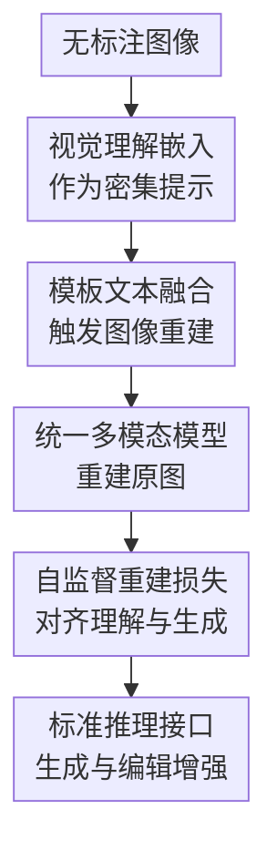

# Reconstruction Alignment Improves Unified Multimodal Models

**会议**: ICLR 2026  
**OpenReview**: [https://openreview.net/forum?id=ppQWp8yrm7](https://openreview.net/forum?id=ppQWp8yrm7)  
**论文**: [Project Page](https://reconstruction-alignment.github.io/)  
**代码**: 待发布  
**领域**: 多模态VLM  
**关键词**: 统一多模态模型, 重建对齐, 视觉理解编码器, 图像生成, 图像编辑

## 一句话总结
RECA 把统一多模态模型自己的视觉理解嵌入当作密集“视觉提示”，通过无标注图像重建后训练重新对齐理解侧和生成侧，使 1.5B UMM 在 GenEval、DPGBench 和图像编辑基准上显著提升，并且不需要额外 caption、GPT-4o 蒸馏或强化学习。

## 研究背景与动机
**领域现状**：统一多模态模型（Unified Multimodal Models, UMMs）希望在同一个模型里同时做视觉理解、文本理解、图像生成和图像编辑。和传统只负责生成的扩散模型不同，UMM 通常带有视觉理解编码器、语言模型骨干和某种图像生成头，因此理论上可以把“看懂图像”的能力迁移给“生成图像”的能力：模型既能回答“这是什么”，也应当能根据指令画出对应内容。

**现有痛点**：现实情况并不这么顺。常规训练主要依赖图文对或多模态序列，caption 是图像的稀疏描述：哪怕写到几百词，也很容易漏掉纹理、几何、遮挡关系、对象间位置、非典型属性和画面风格。模型因此会学到很多训练语料里的默认相关性，例如 broccoli 通常是绿色，于是面对 “yellow broccoli” 这类少见组合时，理解分支可能知道黄色西兰花是什么，但生成分支仍倾向画成绿色。

**核心矛盾**：UMM 的理解侧已经能把图像压成语义丰富的视觉嵌入，但生成侧训练时主要从 sparse text prompt 学监督。也就是说，模型内部存在一个“理解很密、生成监督很稀”的落差：视觉理解编码器捕捉到的细节没有被充分用于训练生成能力，导致理解和生成不对齐。

**本文目标**：作者要解决的不是重新设计一个新生成器，而是给已有 UMM 一个资源开销很低的 post-training 方法。具体目标包括：不用人工 caption 或额外标注，只用无标注图像；适配离散 token、masked autoregressive、连续扩散等不同 UMM 架构；训练后推理接口保持不变，文本生成图像和图像编辑时不需要额外输入。

**切入角度**：论文的关键观察是，视觉理解编码器（如 CLIP、SigLIP、InternVL3、MAE 变体）输出的 embedding 已经位于语言对齐的语义空间，在 UMM 内部可以像密集文本提示一样被语言模型骨干消费。既然 caption 不够密，那就直接把图像经理解编码器得到的视觉嵌入送回模型，让生成侧学习从这些语义嵌入重建原图。

**核心 idea**：用“视觉理解嵌入 → 原图重建”的自监督目标替代传统“caption → 图像”的稀疏监督，把图像本身当作最密集的提示来校准 UMM 的理解-生成通路。

## 方法详解

### 整体框架
RECA（Reconstruction Alignment）的整体流程很直接：给定一张无标注图像，先用 UMM 的视觉理解编码器提取语义嵌入，再把这些嵌入与一个类似“请详细描述图像”的模板文本拼成多模态输入，最后让同一个 UMM 生成或重建原图，并用重建损失更新生成相关参数。训练完成后，模型在推理时仍然像普通 UMM 一样工作：文本到图像只输入文本，图像编辑输入原图和编辑指令，不需要额外提供训练时的视觉嵌入。

和把更长 caption 喂给模型不同，RECA 的监督对象不是文本，而是图像本身。它不要求模型先把图像翻译成一句或一段文字，而是让模型学习：当理解侧 embedding 已经包含颜色、空间布局、对象属性和语义关系时，生成侧应该怎样利用这些 embedding 还原视觉内容。

### 关键设计
**1. 视觉理解嵌入作为密集提示：绕开 caption 的信息瓶颈**

传统 T2I 训练可以写成 $L_{t2i}=L(f_\theta(t_{prompt}), I_{gt})$，其中 $t_{prompt}$ 是 caption 或生成提示，$I_{gt}$ 是目标图像。问题在于 $t_{prompt}$ 无论多长，仍是人类语言对画面的压缩描述，天然会丢掉很多细节。RECA 把条件从稀疏文本换成视觉理解嵌入 $h_v$，训练目标变为 $L_{RECA}=L(f_\theta(\mathrm{concat}(t_{template}, h_v)), I_{gt})$。

这里的 $h_v$ 不是 VAE 或 VQ-GAN 这类偏像素重建的生成编码，而是来自理解分支的语义 embedding。作者的直觉是：UMM 的理解编码器已经被训练成能和语言空间对齐，深层特征中视觉概念和文本概念共享语义流形，因此它可以充当一种比 caption 更密的“文本提示”。这能直接针对 UMM 的 generation-understanding gap：模型不是只学“红狗蓝猫”这几个词，而是从原图的视觉语义中看到对象、颜色、姿态、布局和风格。

**2. 重建对齐作为后训练目标：用无标注图像校准生成分支**

RECA 不改变 UMM 的主架构，而是在 post-training 阶段引入一个自监督重建任务。输入是图像经过理解编码器得到的 embedding，加上 prompt template；输出目标是同一张图像或其 latent/token 表示。对于离散 autoregressive 或 MaskGIT 式模型，损失可以是 cross-entropy；对于连续扩散或 flow-matching 模型，损失可以是 diffusion/flow reconstruction loss。论文把不同生成范式统一记为 $L(\cdot, \cdot)$，从而使 RECA 可以跨架构使用。

总训练目标写作 $L_{total}=\lambda_{RECA}L_{RECA}+\lambda_{i2t}L_{i2t}+\lambda_{t2i}L_{t2i}$。实验里 $\lambda_{RECA}=1$、$\lambda_{t2i}=0$；如果模型的理解和生成共享参数（如 Show-o、Harmon），则保留 $\lambda_{i2t}=1$ 以避免视觉理解退化；如果理解模块与生成模块解耦（如 OpenUni、BAGEL），则冻结理解侧并设 $\lambda_{i2t}=0$。这个设计让 RECA 更像“最后一公里校准”：不从头训练 UMM，也不需要昂贵的人类偏好或 GPT-4o 图像数据。

**3. 语义层重建而非像素拷贝：选择理解编码器和低输入分辨率**

论文特别区分了视觉理解编码器和视觉生成编码器。用 BAGEL 做消融时，若用 VAE 这类 generation encoder 的 embedding，GenEval 只有 78.5，DPG 83.92，甚至接近或低于 baseline；而用 ViT/SigLIP 这类 understanding encoder，在 224×224 下能到 GenEval 82.4、DPG 85.29、ImgEdit 3.75、GEdit 7.27。这说明 RECA 的关键不是“给生成器更多像素线索”，而是给它语义层线索。

作者还发现理解输入分辨率不宜盲目提高。BAGEL 中 224×224 的理解 embedding 优于 512×512，因为高分辨率 embedding 会保留更多低层像素细节，反而促使模型依赖局部纹理而不是学习语义级对齐。Show-o 的 VQGAN 变体也暴露了类似风险：512×512 重建时 cross-entropy 很快接近 0，模型像是在复制 token，性能反而下降。把输入降到 256×256 或做 blur 可以缓解 token-copying collapse。

**4. 保持推理接口不变：训练时多一条自监督通路，部署时零额外成本**

RECA 容易落地的原因在于它只改训练阶段。训练时，图像先作为 dense image prompt 被送入模型，让模型重建同一图像；推理时，这条重建输入并不存在，模型仍按照原来的 UMM 接口生成图像或编辑图像。文本到图像只输入文本 prompt，图像编辑仍输入原图和编辑指令。

这种“训练时对齐、推理时不加组件”的性质，使 RECA 和很多更重的后训练方法区分开来。它不需要额外 decoder，不需要外部 verifier，不需要 RL reward，也不需要合成大规模图文对；同时它和 classifier-free guidance 也正交，CFG 是采样时用 conditional/unconditional prediction 做引导，RECA 是训练时用语义视觉嵌入重建来改变模型参数。

### 一个完整示例
以论文中的“黄色西兰花”问题为例，普通 UMM 可能在视觉问答里能识别输入图像里的黄色 broccoli，但当用户让它生成 “a yellow broccoli” 时，生成分支仍受训练数据偏置影响，把 broccoli 画成绿色。RECA 的训练样本不需要人写“这是一颗黄色西兰花”的 caption，而是直接把一张黄色西兰花图像送入理解编码器，得到包含对象类别和非典型颜色属性的 $h_v$，再要求模型从 $h_v$ 重建原图。

如果模型重建时仍把颜色拉回绿色，重建损失会直接惩罚这种理解-生成错位。经过大量无标注图像的这类训练后，生成分支会更愿意相信理解侧传来的语义属性，而不是只依赖 caption 统计规律。类似机制也解释了颜色绑定、对象位置和图像编辑中的身份保持提升：模型学到的不只是“生成好看图像”，而是“把内部视觉语义忠实转成图像”。

### 损失函数 / 训练策略
RECA 的核心损失是：

$$
L_{RECA}=L(f_\theta(\mathrm{concat}(t_{template},h_v)), I_{gt})
$$

其中 $t_{template}$ 是触发详细描述/重建的模板，$h_v$ 是视觉理解编码器输出，$I_{gt}$ 是原图或对应 latent/token 目标。总目标为：

$$
L_{total}=\lambda_{RECA}L_{RECA}+\lambda_{i2t}L_{i2t}+\lambda_{t2i}L_{t2i}
$$

实验设置中，$\lambda_{RECA}=1$，$\lambda_{t2i}=0$。共享理解-生成参数的模型保留 $\lambda_{i2t}=1$，解耦模型冻结理解组件并设 $\lambda_{i2t}=0$。作者使用 360 个由 GPT-o3 从 “Describe the image in detail.” 扩展出的模板，避免模型过拟合单一 prompt 形式。训练数据主要包括 MidjourneyV6、LLaVA Mix-665K，以及给 BAGEL 使用的 10,000 张 FLUX 生成图像；主实验刻意排除 GPT-4o-Image 蒸馏数据，以避免 GenEval template leakage。

## 实验关键数据

### 主实验
RECA 的主结果最有说服力的是 Harmon-1.5B：在没有 GPT-4o-Image 蒸馏和 RL 的情况下，它把 GenEval overall 从 0.73 提到 0.86，把 DPGBench 从 80.93 提到 87.21，并超过多种更大的开源模型。若再结合 GPT-4o-Image 数据，RECA 可以进一步到 GenEval 0.90、DPGBench 88.15。

| 模型 | 参数量 | GenEval Overall ↑ | DPGBench ↑ | 备注 |
|------|--------|-------------------|------------|------|
| Harmon baseline | 1.5B | 0.73 | 80.93 | 作者复现，12 seeds |
| Janus-Pro | 7B | 0.80 | 84.33 | 更大 UMM |
| BAGEL baseline | 14B | 0.79 | 84.03 | 更大 UMM |
| GPT-4o-Image | - | 0.84 | 86.23 | 私有模型 |
| RECA | 1.5B | 0.86 | 87.21 | 无 GPT-4o 蒸馏/RL |
| RECA + GPT-4o data | 1.5B | 0.90 | 88.15 | 额外使用蒸馏数据 |

跨架构结果显示，RECA 不只是对某个 backbone 的特例有效。Show-o、OpenUni、Harmon、BAGEL 均有提升，其中 Harmon 和 OpenUni 的 positional/color attribute 改善尤其大；BAGEL 的文本生成提升较小，但图像编辑提升明显。

| 架构 | 生成范式 | Baseline GenEval | RECA GenEval | Baseline DPG | RECA DPG |
|------|----------|------------------|--------------|--------------|----------|
| Show-o-512 | 离散/MaskGIT | 66.2 | 72.3 (+6.1) | 82.21 | 84.94 (+2.73) |
| OpenUni-3.6B | 连续扩散 | 61.9 | 74.1 (+12.2) | 79.02 | 82.75 (+3.73) |
| Harmon-1.5B | MAR | 72.9 | 85.7 (+12.8) | 80.93 | 87.21 (+6.28) |
| BAGEL | 连续扩散 | 78.8 | 82.4 (+3.6) | 84.03 | 85.29 (+1.26) |

### 消融实验
论文的消融把 RECA 和 SFT、不同编码器、不同训练顺序分开看。最关键结论是：在相同数据上，RECA 比普通 SFT 更能改善生成对齐；在 SFT 与 RECA 都用时，先 SFT 后 RECA 明显优于反过来。

| 配置 | GenEval ↑ | DPG ↑ | 说明 |
|------|-----------|-------|------|
| MidjourneyV6 + SFT | 74.76 | 80.89 | 普通图文监督 |
| MidjourneyV6 dense caption + SFT | 74.05 | 80.67 | 更长/更密 caption 不解决核心问题 |
| MidjourneyV6 + RECA | 85.69 | 87.21 | 同数据下自监督重建显著更强 |
| BLIP3o-60k w/o GenEval + SFT | 80.88 | 85.24 | 去掉泄漏模板后 SFT 掉点明显 |
| BLIP3o-60k w/o GenEval + RECA | 84.76 | 86.37 | 对模板泄漏不敏感 |

| 训练顺序 | GenEval ↑ | DPG ↑ | 解释 |
|----------|-----------|-------|------|
| BLIP3o-60k: RECA → SFT | 85.91 | 85.67 | 后续 SFT 会冲淡重建对齐 |
| BLIP3o-60k: SFT → RECA | 89.00 | 87.50 | 先粗对齐，再用 RECA 精修 |
| MidjourneyV6: SFT → RECA | 90.15 | 88.15 | 最佳 recipe |

| 视觉条件 | 分辨率 | GenEval ↑ | DPG ↑ | ImgEdit ↑ | GEdit ↑ |
|----------|--------|-----------|-------|-----------|---------|
| Baseline | - | 78.8 | 84.03 | 3.38 | 6.94 |
| VAE generation encoder | 256×256 | 78.5 | 83.92 | 3.63 | 7.08 |
| ViT understanding encoder | 224×224 | 82.4 | 85.29 | 3.75 | 7.27 |
| ViT understanding encoder | 512×512 | 79.2 | 84.61 | 3.68 | 7.18 |

### 关键发现
- RECA 的提升集中在语义对齐相关子任务，尤其是颜色、颜色属性、位置关系和复杂对象组合。Harmon-1.5B 的 position 从 44.9 到 75.7，color attribute 从 51.1 到 76.6，是主结果中最显眼的增益。
- 对 counting 的提升有限。作者解释为计数属于更难从语言化语义中抽取的中层视觉特征，当前 MLLM/UMM 的理解嵌入不一定擅长表达精确数量。
- 图像编辑上，BAGEL-RECA 在 ImgEdit overall 从 3.38 提到 3.75，在 GEdit overall 从 6.94 提到 7.27，尤其在替换、添加、构图和身份保持上更稳定。
- 视觉理解能力没有明显牺牲。Harmon 的 MME 从 1195 到 1223，POPE/GQA/MMMU/SEED 基本持平或小幅波动，说明保留 I2T loss 和适当冻结策略能避免“生成变强但理解退化”。
- T2I-CompBench 进一步表明，RECA 的收益不止 GenEval 模板里的颜色/位置：OpenUni-3.6B overall 从 78.84 到 86.49，Harmon-1.5B 从 81.36 到 88.03，3D spatial、shape、texture 和 numeracy 都有提升。

## 亮点与洞察
- **把“图像本身是最密 caption”这件事落成了可训练目标**：很多工作意识到 caption 稀疏，但通常选择生成更长 caption 或蒸馏更强模型。RECA 更干脆地把理解 embedding 当 dense prompt，让图像监督图像，绕过语言描述瓶颈。
- **方法简单但架构覆盖面广**：同一个训练范式能套在离散 token、MAR、连续扩散 UMM 上，说明它抓住的是 UMM 共享的理解-生成错位，而不是某个 decoder 的技巧。
- **“低分辨率理解嵌入更好”这个发现很有启发**：直觉上高分辨率保留更多信息应当更好，但 RECA 需要的是语义重建，不是像素拷贝。分辨率消融说明对齐目标要小心控制信息通道，否则模型会走捷径。
- **对后训练 pipeline 的定位清晰**：SFT 适合做粗粒度图文对齐，RECA 适合放在最后做细粒度语义忠实度修补。这对后续训练 unified multimodal model 很实用，可以作为低成本 final alignment stage。
- **对 benchmark leakage 的讨论比较诚实**：作者指出 BLIP3o-60k 中存在大量接近 GenEval 模板的样本，并比较移除模板后的表现，避免把数据泄漏当作真实模型能力提升。

## 局限与展望
- RECA 主要改善语义可语言化的视觉属性，对 counting 这类中层视觉能力帮助有限。未来可能需要引入高质量计数数据、目标级监督或 RL-style feedback。
- 它依赖 UMM 已有的视觉理解编码器质量。Show-o 使用的 CLIP 语义能力较弱时，收益相对受限；BLIP-3o 这类预训练中已包含强重建目标的模型，额外 RECA 甚至可能不再有效。
- RECA 的训练信号来自“从理解嵌入重建原图”，但如果理解嵌入本身把异常概念投射到错误语义邻域，例如把粉色香蕉投成粉色鞋，重建会强化模型内部已有的语义投影，而不是自动纠正概念理解。
- 论文主实验数据规模不算巨大，虽然展示了 10k 到 240k 的 scale trend，但还没有说明更大规模、多领域真实图像、视频或 3D 输入下是否仍然稳定。
- 图像编辑提升明显，但 RECA 本身没有专门建模编辑指令的因果约束；它更像提升重建忠实度和语义 grounding，复杂多步编辑仍可能需要额外编辑数据或规划机制。

## 相关工作与启发
- **vs 普通 SFT / dense caption SFT**: SFT 用文本描述监督图像生成，即使 caption 变长也仍然是语言瓶颈；RECA 直接用视觉理解 embedding 监督原图重建，因此更适合恢复空间、颜色、形状和属性绑定。
- **vs GPT-4o-Image 蒸馏数据**: 蒸馏能带来强 benchmark 表现，但成本高且可能包含测试模板泄漏；RECA 可以只用无标注图像，训练成本低得多，并且在移除 GenEval-like 数据后更稳。
- **vs REPA / VA-VAE 等表示对齐方法**: 这些方法通常把 DiT/VAE 隐状态对齐到外部视觉 encoder 表示，重点是改生成模型内部表示；RECA 面向 UMM，把视觉理解 embedding 当作输入条件，目标是对齐理解分支与生成分支。
- **vs ROSS / reconstructive visual instruction tuning**: ROSS 类方法常通过额外 decoder 从中间特征重建图像来增强视觉理解；RECA 不加辅助 decoder，而是让 UMM 自己根据理解 embedding 生成图像，目标更偏生成能力提升。
- **vs CFG**: CFG 是推理时的条件/无条件引导，不改变模型理解-生成映射；RECA 是训练时的参数更新。二者概念正交，可以叠加。

## 评分
- 新颖性: ⭐⭐⭐⭐☆ 把视觉理解嵌入作为 dense prompt 做 UMM 后训练非常简洁，核心想法不复杂但切中统一模型的结构性错位。
- 实验充分度: ⭐⭐⭐⭐⭐ 覆盖 Show-o、Harmon、OpenUni、BAGEL，多种生成范式、生成/编辑/理解/消融和 template leakage 分析，证据链比较完整。
- 写作质量: ⭐⭐⭐⭐☆ 主文逻辑清楚，图 2/4/5 很好地解释动机和机制；部分附录结果很多，读者需要自己整理哪些结论最关键。
- 价值: ⭐⭐⭐⭐⭐ 对训练 UMM 很实用：低成本、无标注、推理零额外开销，适合作为 SFT 后的 final refinement stage。

<!-- RELATED:START -->

## 相关论文

- [\[ICLR 2026\] MME-Unify: A Comprehensive Benchmark for Unified Multimodal Understanding and Generation Models](mme-unify_a_comprehensive_benchmark_for_unified_multimodal_understanding_and_gen.md)
- [\[ICLR 2026\] Modal Aphasia: Can Unified Multimodal Models Describe Images From Memory?](modal_aphasia_can_unified_multimodal_models_describe_images_from_memory.md)
- [\[ICLR 2026\] Unified Vision-Language Modeling via Concept Space Alignment](unified_vision-language_modeling_via_concept_space_alignment.md)
- [\[ICLR 2026\] ORION: Decoupling and Alignment for Unified Autoregressive Understanding and Generation](orion_decoupling_and_alignment_for_unified_autoregressive_understanding_and_gene.md)
- [\[ICLR 2026\] Visual Jigsaw Post-Training Improves MLLMs](visual_jigsaw_post-training_improves_mllms.md)

<!-- RELATED:END -->
