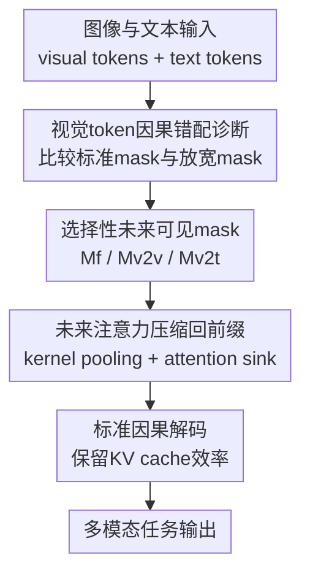

# Rethinking Causal Mask Attention for Vision-Language Inference

**会议**: ICLR2026  
**OpenReview**: [https://openreview.net/forum?id=DuDFytFC5Z](https://openreview.net/forum?id=DuDFytFC5Z)  
**代码**: 待确认  
**领域**: 多模态VLM  
**关键词**: 因果注意力, VLM推理, 视觉token, future-aware mask, 推理加速  

## 一句话总结
这篇论文重新审视 decoder-only VLM 直接继承 LLM causal mask 的合理性，发现视觉 token 在 prefill 阶段适度“看见”未来视觉/文本上下文能提升多图、视觉关系和文字密集问答，并提出把未来注意力压缩回前缀位置的轻量 future-aware attention，在保持因果解码和低延迟的同时保留大部分收益。

## 研究背景与动机
**领域现状**：当前主流 VLM 通常把图像经过视觉编码器转成一串 visual tokens，再把这些 token 和文本 token 拼接后送入 decoder-only LLM。为了兼容自回归生成，整条多模态序列往往沿用 LLM 的左到右 causal mask：第 $i$ 个 token 只能 attend 到 $j \le i$ 的位置，未来位置被 $-\infty$ 屏蔽。

**现有痛点**：这种规则对文本生成很自然，因为预测一个词时偷看未来词会破坏语言因果性；但视觉信息并不是天然的一维序列。图像 patch、连续帧、多图输入里的语义往往需要整体比较，后面的视觉 token 可能包含当前 patch 理解所需的物体、状态变化或空间关系。把视觉 token 当成文本 token 一样严格屏蔽未来上下文，会让模型在 prefill 阶段丢掉本可利用的视觉线索。

**核心矛盾**：VLM 的视觉编码器已经在图像层面抽取了全局或局部语义，但进入 LLM 后，这些视觉 token 又被文本式 causal mask 强行排成单向序列。也就是说，视觉理解需要更完整的上下文，而自回归框架要求不能泄漏未来生成内容；二者在视觉 token 上并不完全一致。

**本文目标**：作者想回答三个具体问题：第一，LLM 继承来的 causal attention 是否真的适合 VLM 的视觉 token；第二，如果要放宽约束，视觉 query 应该看未来视觉 token、未来文本 token，还是二者都看；第三，能否在不破坏标准因果解码和 KV cache 效率的前提下，把未来语义注入到推理过程中。

**切入角度**：论文没有重新训练一个 VLM，也没有改模型结构，而是从 inference-time attention mask 入手做机制分析。这个角度很直接：同一个 LLaVA checkpoint、同一批任务，只改 prefill/attention mask，就能观察视觉 token 的未来可见性到底带来什么变化。

**核心 idea**：对文本 token 保持严格自回归，对视觉 query 选择性开放未来视觉或未来文本注意力；再用 pooling 把这些未来注意力压缩进前缀/attention sink 区域，让模型间接获得未来视觉语义，同时仍按标准 causal mask 解码。

## 方法详解
### 整体框架
论文的方法可以分成两层：先定义三类 future-aware causal mask，用来实证分析视觉 token 到底该看哪类未来上下文；再提出 light future-aware attention，把未来区域的注意力分数压缩到过去前缀位置，使最终注意力模式仍是标准下三角。输入仍是常见的 $X=x_v \oplus x_t$，其中视觉 token 在前、文本 token 在后；输出仍由原始 VLM 自回归生成，模型参数不需要训练。

标准 causal mask 可以写成 $M^c_{i,j}=0$ if $j\le i$，否则 $M^c_{i,j}=-\infty$。论文的关键不是让所有 token 都双向可见，而是只改视觉 query 的上三角区域：当 $i\in V$ 时，让它有条件地访问未来位置；当 $i\in T$ 时，仍然回到原始 causal mask。这样文本生成不会偷看未来文本答案，而视觉 token 能在 prefill 阶段吸收更完整的图像或图文上下文。

### 关键设计
**1. 视觉token因果错配诊断：先证明“文本式左到右”不是视觉推理的自然约束**

论文首先把 VLM 的输入拆成视觉 token 集合 $V=[1,m]$ 和文本 token 集合 $T=[m+1,m+n]$，再把注意力得分写成 $B(x_v,x_t)=(Q_v\oplus Q_t)(K_v\oplus K_t)^\top/\sqrt d$。在这个形式下，普通 VLM 实际上是把视觉 patch 和文本词元放进同一个 causal mask 里计算 $h_\theta(x_v,x_t;M^c)=\mathrm{Softmax}(B+M^c)$。

问题在于，文本 token 的顺序代表生成因果，视觉 token 的顺序更多只是 flatten 后的位置索引。一个图像右下角的 patch 并不比左上角 patch “未来”，多图任务里的后续帧也可能提供理解当前动作或状态变化的必要证据。因此，若视觉 query 只能看到过去位置，模型在 prefill 阶段会人为失去跨 patch、跨帧和跨图的语义比较能力。作者通过 ALFRED 等任务的初步结果展示：打破文本 token 间 causal mask 会明显扰乱预测，但放宽视觉 token 的未来注意力反而常常提升表现，这正是后续 mask 设计的依据。

**2. 选择性未来可见mask：把“看未来”拆成全未来、视觉到视觉、视觉到文本三种可控情形**

为了避免笼统地说“视觉 token 可以看未来”，论文定义了三种 mask。第一种是 Future-Aware Full Mask $M^f$：对任意视觉 query $i\in V$，所有未来位置都可见，即 $j\le i$ 或者 $j>i,i\in V$ 时 mask 为 0；文本 query 仍按标准 causal mask。这相当于让视觉 token 同时预览未来视觉和未来文本，适合需要全局时间线或多图语义整合的任务。

第二种是 Future-Aware Visual-to-Visual Mask $M^{v2v}$：视觉 query 可以看未来视觉 token，但未来文本 token 仍被屏蔽。公式上，当 $j\le i$ 或 $j>i,i\in V,j\in V$ 时可见。这个设计特别针对视觉关系推理：例如两张相似图像之间的差异、物体关系、状态变化，核心信息主要在视觉 token 之间，而不一定需要提前看文本。

第三种是 Future-Aware Visual-to-Textual Mask $M^{v2t}$：视觉 query 可以看未来文本 token，但未来视觉 token 仍被屏蔽。它对应文字密集图像问答，例如 OCR-VQA、TextVQA、文档问答等，视觉区域要和后续文本提示、问题或图中文字线索对齐。三种 mask 的共同点是：只有视觉 query 的未来可见性被改写，文本 query 始终保持自回归，这使分析能聚焦在“视觉 token 的因果约束是否过强”这个问题上。

**3. 未来注意力压缩回前缀：用 pooling 保留语义收益而不牺牲因果解码效率**

直接开放未来注意力会带来一个实际问题：如果解码阶段也要计算非标准上三角注意力，就会破坏常规 KV cache 的拼接式高效计算，延迟显著升高。论文的 light future-aware attention family 把开销尽量挪到 prefill 阶段：先根据选定的 $\mu\in\{M^f,M^{v2v},M^{v2t}\}$ 找到原本位于未来区域、但在 future-aware mask 下有效的 attention scores，再用一维 kernel pooling 聚合这些分数。

聚合后的未来语义不是继续留在上三角，而是被合并到过去区域，尤其是最前面的 prefix token / attention sink 区域。论文用 $C(B,\mu)$ 表示压缩后的未来注意力补偿项，再把最终注意力写成 $h'_\theta(x_v,x_t;\mu)=B(x_v,x_t)+C(B,\mu)+M^c$。直观地说，模型在 prefill 时先“偷看”视觉相关未来信号，把它们总结成一个过去可见的语义锚点；正式解码时仍只看下三角，因此既保持自回归结构，又让后续生成间接受益于未来视觉上下文。

**4. 任务依赖的mask选择：不同多模态任务需要不同类型的未来上下文**

这篇论文很重要的一点是，它没有声称某个 mask 在所有任务上都最好。Temporal multi-image 任务需要理解动作序列、导航目标和状态变化，$M^f$ 或 $M^{v2v}$ 往往更合适，因为后续帧的视觉证据能帮助当前视觉 token 建模长程依赖。Visual relation 任务更依赖图像内部或图像之间的视觉对齐，因此 $M^{v2v}$ 的收益更稳定。

文字密集图像问答则不同。OCR-VQA 和 TextVQA 的关键在于把视觉区域与文本内容、问题语义或文档布局对上，$M^{v2t}$ 让视觉 query 提前接触未来文本线索，所以提升更明显。相反，对 text-dominant 或检索类任务，放宽 mask 可能会扰乱原本的文本匹配过程。这个结论让 future-aware attention 更像一个 modality-aware inference knob：它不是无脑打破因果性，而是根据视觉/文本依赖结构选择上三角中哪些部分值得开放。

### 一个完整示例
假设输入是一个多图导航任务，序列由若干视觉帧 token 加一句指令组成：前几帧显示走廊，中间帧出现门，最后一帧显示目标物体。标准 causal mask 下，第一个视觉帧里的 patch 只能看自己之前的视觉 token，无法利用后面“门已经打开”或“目标物体出现”的证据；模型生成动作时可能只根据局部场景猜测。

使用 $M^f$ 时，早期视觉 query 在 prefill 阶段可以看到后续视觉帧和文本 token 的注意力得分，于是“走廊→门→目标物体”的时间线能更早融合。若使用 light future-aware merge，模型不会在解码时反复计算这些未来连接，而是把后续帧中高响应的注意力分数 pooling 后压到第一个 prefix token。后续生成动作 token 时，它仍按标准 causal mask 访问过去前缀，却已经能从这个前缀位置读到被压缩的未来场景语义。这样就解释了为什么 $M^f+merge$ 在一些 temporal multi-image 任务上接近甚至超过直接 future-aware mask，同时延迟明显更低。

### 损失函数 / 训练策略
本文主体是 inference-only 方法，不引入新的训练损失，也不更新 LLaVA 参数。所有 mask 变体都在推理时替换或补充 attention mask：prefill 阶段根据 $M^f$、$M^{v2v}$、$M^{v2t}$ 计算未来可见注意力；merge 版本进一步用 pooling 把未来分数写回过去前缀；decoding 阶段继续使用标准 causal mask。

附录里作者额外做了两个训练相关探索：其一是在 OpenVLA-OFT 上用 future-aware mask 微调 LIBERO-Spatial，成功率从 84.7% 提到 85.1%；其二是用轻量 MLP adapter 学习选择 mask，在 CLEVR、Nav、Object、SpotDiff 上均有提升。这说明 future-aware masking 不只适合作为推理探针，也可能扩展为训练期可学习路由，但主论文的核心贡献仍是无需训练的推理机制分析。

## 实验关键数据
### 主实验
论文主要在 LLaVA-7B 和 LLaVA-13B 上评估，任务来自 MILEBench，覆盖 temporal multi-image、semantic multi-image、文字密集问答、视觉关系、needle-in-a-haystack、图像检索等多类场景。下面选取 Table 4 中能体现不同 mask 行为的代表性指标。

| 模型 | 方法 | CLEVR | Nav | Moving | Object | SpotDiff | TQA |
|------|------|-------|-----|--------|--------|----------|-----|
| LLaVA-7B | $M^c$ | 0.166 | 0.310 | 0.490 | 0.485 | 0.162 | 0.320 |
| LLaVA-7B | $M^{v2v}$ | 0.177 | 0.325 | 0.515 | 0.500 | 0.167 | 0.385 |
| LLaVA-7B | $M^{v2t}$ | 0.181 | 0.320 | 0.490 | 0.495 | 0.165 | 0.385 |
| LLaVA-7B | $M^f$ | 0.187 | 0.320 | 0.505 | 0.505 | 0.171 | 0.400 |
| LLaVA-7B | $M^f$+merge | 0.188 | 0.320 | 0.505 | 0.490 | 0.173 | 0.375 |
| LLaVA-13B | $M^c$ | 0.157 | 0.260 | 0.500 | 0.470 | 0.158 | 0.495 |
| LLaVA-13B | $M^f$ | 0.156 | 0.260 | 0.510 | 0.475 | 0.155 | 0.510 |
| LLaVA-13B | $M^f$+merge | 0.158 | 0.260 | 0.505 | 0.480 | 0.115 | 0.525 |

这组结果说明，future-aware mask 的收益不是“整体无条件变好”，而是任务相关。LLaVA-7B 上，$M^f$ 在 CLEVR、Object、SpotDiff、TQA 等任务上相对标准 mask 有明显改善；$M^{v2v}$ 对 Moving、Nav、TQA 等视觉关系/时间类任务也有收益。merge 版本在一些任务上保留了收益，例如 7B 的 CLEVR 从 0.166 提到 0.188，SpotDiff 从 0.162 提到 0.173，但在部分设置上会牺牲一点准确率，说明压缩未来信息不是完全无损。

### 消融实验
论文的消融重点包括三类 future-aware mask 的任务适配、merge 对速度的影响，以及 pooling/prefix 的鲁棒性。

| 配置 | 关键指标 | 说明 |
|------|----------|------|
| $M^c$ | Temporal multi-image 中 T-1 到 T-4 多项为基线 | 标准 causal mask，对文本生成安全，但限制视觉 token 的未来上下文 |
| $M^f$ | AP 39.8→39.9，VN 31→32，SC 30→31.5 | 全未来可见，对多图时间推理、导航和状态变化有稳定正收益 |
| $M^{v2v}$ | VCC 16.2→16.7，VRE 16.6→18.1 | 只开放未来视觉 token，更适合视觉关系和图像差异理解 |
| $M^{v2t}$ | OCR-VQA 22.5→23.0，TextVQA 32.0→38.5 | 只开放未来文本 token，对文字密集图像问答收益最大 |
| $M^f$+merge | decoding latency 83.1783→26.5362 ms/token | 压缩未来注意力后恢复标准 causal 解码，速度约 3 倍提升 |
| $M^{v2v}$+merge | decoding latency 64.1266→26.4037 ms/token | 保留部分视觉关系收益，同时减少非标准注意力开销 |
| $M^{v2t}$+merge | decoding latency 43.0362→26.1051 ms/token | 对文本富集任务更省时，但压缩可能带来小幅任务波动 |

补充实验还显示，kernel pooling 对超参数并不敏感：pool size 为 1、3、7 时 OCR 和 VRE 结果基本一致，pool size 25 也只有很小波动；max pooling 与 mean pooling 差异通常不超过 0.2。这支持了作者的说法：关键并不是某个精细调好的 pooling trick，而是“未来语义可被压缩到过去 sink 区域”这个机制本身。

### 关键发现
- 视觉 token 的未来可见性确实有用，但收益高度依赖任务类型；多图时间推理、视觉关系和 OCR/文档问答最容易受益。
- 文本 token 仍需要严格 causal mask；论文观察到打破文本间因果约束会扰乱预测，所以方法只针对视觉 query 开放上三角。
- $M^{v2v}$ 和 $M^{v2t}$ 的差异很有解释性：前者服务视觉-视觉关系，后者服务视觉-文本对齐，不同任务应选择不同未来区域。
- light future-aware merge 把 future-aware 的主要成本转移到 prefill，并让 decoding 继续走标准 causal/KV cache 路径，因此延迟从 43-83 ms/token 降到约 26 ms/token。
- 把未来注意力合并到第一个 prefix token 已经很有效，说明 attention sink 现象在多模态推理里也可以作为语义汇聚点。

## 亮点与洞察
- 这篇论文最有价值的地方，是把 VLM 里一个默认得几乎没人质疑的设计拆开检验：视觉 token 是否真的应该遵守文本 token 的左到右因果性。它没有靠大模型训练或复杂架构取胜，而是用 mask 干预把问题变成一个可观察的推理机制实验。
- 三类 mask 的设计很干净：$M^f$、$M^{v2v}$、$M^{v2t}$ 分别对应“全未来”“未来视觉”“未来文本”，刚好把多模态未来上下文拆成可分析的因子。这让实验结果不仅是性能表，也能解释任务到底依赖哪种上下文。
- light future-aware merge 的思路很实用。直接开放未来注意力会和 KV cache、高效解码冲突，而把未来分数在 prefill 阶段压进 prefix/attention sink，相当于用一个低成本通道保存未来语义，工程上更容易落到现有 decoder-only VLM。
- 这篇工作对长上下文多模态尤其有启发。很多多图、视频、文档和具身任务里，视觉证据本来就不是线性局部可见的；相比一味扩大上下文长度，更细粒度地设计 modality-aware mask 可能是更便宜的推理增强方向。
- 一个可以迁移的思路是：在其他模态里也区分“生成因果”和“感知结构”。例如音频、视频、3D 点云、机器人状态序列中，有些 token 的未来可见性未必等价于答案泄漏，可能也适合用类似的 selective future access 做推理期分析。

## 局限与展望
- 方法目前主要围绕 image→text 的常见 decoder-only VLM 输入顺序展开。附录讨论了 interleaved image-text 情况，并在 ALFRED 上做了验证，但对 text→image 或更复杂交错 tokenization 的系统评估仍不足。
- 三类 mask 在主实验中多是手动选择和固定使用。不同任务最适合的 mask 不同，实际部署时需要知道任务类型或额外路由；附录里的 adapter 结果说明可学习选择有潜力，但还不是主线贡献。
- 性能提升并不均匀，甚至某些 text-dominant 或检索类任务会下降。这提醒读者不要把 future-aware mask 当作通用加速/增强插件，而应先判断任务是否真的需要视觉未来语义。
- merge 虽然显著降延迟，但会把丰富的未来上三角信息压进很少的 prefix 位置，可能损失细粒度 token-to-token 关系。未来可以探索多 sink token、任务自适应 prefix ratio 或层级式 pooling。
- 实验主要基于 LLaVA 系列和 MILEBench 任务。更强的现代 VLM、不同视觉编码器、更长视频或机器人 VLA 模型上，视觉 causal mismatch 的程度可能不同，需要进一步复现。

## 相关工作与启发
- **vs 标准 decoder-only VLM**: LLaVA、InternVL、Qwen-VL 等通常把视觉 token 展平后接入 LLM，并沿用文本 causal mask。本文不改 backbone，而是指出这个继承设计对视觉 token 可能过强，并通过推理时 mask 改写释放视觉上下文。
- **vs StableMask / LLM causal mask 改进**: StableMask 这类工作讨论 decoder-only LLM 中未来 token 或 causal mask 的调整，重点仍在文本序列。本文把问题转到多模态场景，强调视觉 token 和文本 token 的因果语义不同。
- **vs D-Attn、BLIP-2 等结构性多模态交互方法**: 这些方法常通过额外模块、跨模态连接或编码器设计改善视觉语言交互。本文更轻量，保持模型参数和架构不变，只在 inference attention mask 上做选择性开放。
- **vs KV cache / token pruning 推理优化**: 常见推理优化关注减少 token 或 cache 开销，目标是效率优先。本文虽然也讨论延迟，但核心是先发现未来视觉语义对推理质量有用，再用 merge 把质量收益和解码效率兼容起来。
- **启发**: 多模态自回归模型里的“因果”不应只按序列位置理解，而应按模态和任务语义重新定义。对生成 token 保持因果，对感知 token 允许更丰富的上下文，可能是未来 VLM/VLA 设计的重要方向。

## 评分
- 新颖性: ⭐⭐⭐⭐☆ 重新审视 VLM causal mask 的视角很有启发，future-aware mask 拆解清晰；核心操作本身较轻量，主要新意在机制分析和推理设计。
- 实验充分度: ⭐⭐⭐⭐☆ 覆盖 MILEBench 多类任务、LLaVA-7B/13B、延迟和 pooling 消融，但更强新一代 VLM 与更复杂 token 排布还需要补充。
- 写作质量: ⭐⭐⭐⭐☆ 主线问题明确，定义和实验对应较清楚；部分公式和表述略粗糙，个别实验设置需要读附录才能完全理解。
- 价值: ⭐⭐⭐⭐☆ 对 VLM 推理机制和高效 attention 设计都有参考价值，尤其适合长上下文、多图、视频和具身推理场景。

<!-- RELATED:START -->

## 相关论文

- [\[ICML 2026\] Seeing is Understanding: Unlocking Causal Attention into Modality-Mutual Attention for Multimodal LLMs](../../ICML2026/multimodal_vlm/seeing_is_understanding_unlocking_causal_attention_into_modality-mutual_attentio.md)
- [\[ICLR 2026\] Capacity-Aware Inference: Mitigating the Straggler Effect in Mixture of Experts](capacity-aware_inference_mitigating_the_straggler_effect_in_mixture_of_experts.md)
- [\[ICLR 2026\] Pay Less Attention to Function Words for Free Robustness of Vision-Language Models](pay_less_attention_to_function_words_for_free_robustness_of_vision-language_mode.md)
- [\[CVPR 2026\] BiomedCCPL: Causal Conditional Prompt Learning for Biomedical Vision-Language Models](../../CVPR2026/multimodal_vlm/biomedccpl_causal_conditional_prompt_learning_for_biomedical_vision-language_mod.md)
- [\[ACL 2026\] From Heads to Neurons: Causal Attribution and Steering in Multi-Task Vision-Language Models](../../ACL2026/multimodal_vlm/from_heads_to_neurons_causal_attribution_and_steering_in_multi-task_vision-langu.md)

<!-- RELATED:END -->
