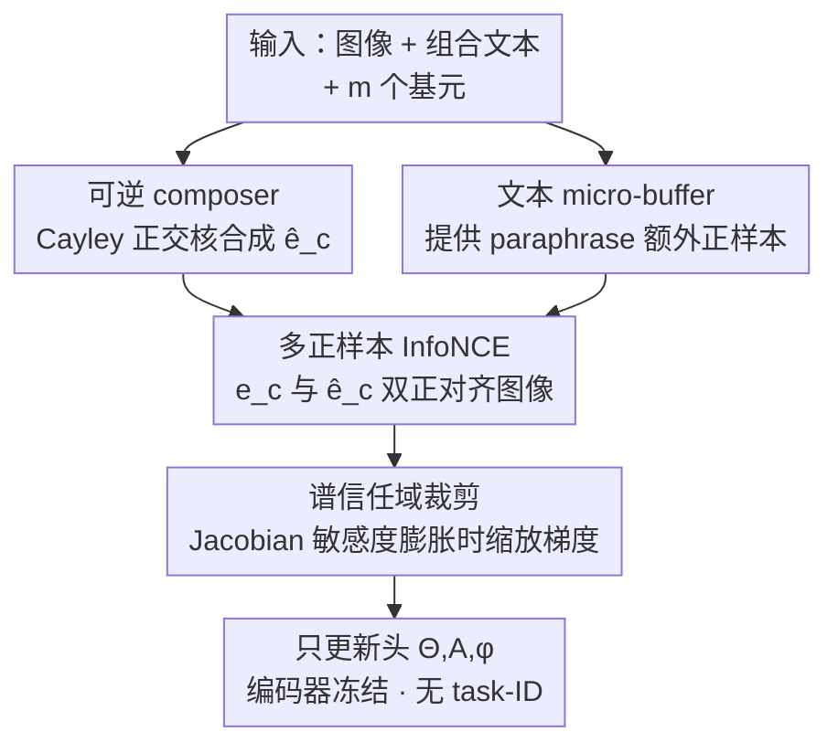

# Reversible Primitive–Composition Alignment for Continual Vision–Language Learning

**会议**: ICLR 2026  
**OpenReview**: [https://openreview.net/forum?id=eiTy6AYeQi](https://openreview.net/forum?id=eiTy6AYeQi)  
**领域**: 多模态VLM / 持续学习  
**关键词**: 持续学习, 视觉语言模型, 组合泛化, 可逆映射, 谱稳定性  

## 一句话总结
针对 VLM 在序列适配中"基元识别还在、组合能力却退化"这一被忽视的现象，本文提出 COMPO-REALIGN——一个轻量对齐头，用一个 Cayley 正交可逆 composer 把基元嵌入合成组合嵌入、用一个多正样本 InfoNCE 把文本组合与合成组合当作图像的双正样本对齐、再用一个谱信任域在对齐敏感度膨胀时裁剪梯度，在组合式 DIL 与多域 MTIL 检索上把最强基线再提 +2.4 R@1、遗忘降低约 40%。

## 研究背景与动机
**领域现状**：CLIP 类视觉语言模型越来越多地部署在非平稳环境里——新域、新任务、漂移的数据流不断到来。持续学习这条线已经有不少进展：几何/拓扑保持与蒸馏（Mod-X、ZSCL、CTP、ZAF）、可扩展的流式协议（TiC-CLIP）、误差感知巩固（DKR），以及在有限内存下用 replay 或参数高效 prompt/adapter 抑制遗忘。

**现有痛点**：这些方法几乎都盯着"任务/域平均精度"或"零样本分数"是否守住，却漏掉了一个更隐蔽的退化：在序列适配下，模型可以维持整体的任务/域能力，却在**细粒度的组合泛化**上崩坏——尤其是 rehearsal 预算紧、测试时又没有 task-ID 的现实场景。作者的探索实验（Fig. 1–3）证实了这点：基元（颜色/形状/材质、属性/物体）识别一直很稳，但随任务推进，组合准确率明显下滑、组合保持比 CRR 跌破 1，零样本组合受损最严重。

**核心矛盾**：组合退化并不是孤立现象，而是和对齐的**几何性质**深度耦合。探索实验发现两个伴随信号：(i) 组合误差随对齐 Jacobian 谱半径 $\hat\sigma_{\max}$ 和**循环一致性误差**（cycle-consistency error, CCE，即 primitive↔composition 映射往返不闭合的程度）一起增大；(ii) 子空间漂移集中在文本塔深层与后期任务。换句话说，组合能力的丢失被两件事预示——可逆性下降、对齐几何不稳。

**本文目标**：在严格内存、无 task-ID 的约束下，让持续 VLM 维持**结构上可依赖**的行为，同时守住零样本迁移。这拆成三个子问题：怎么让"组合的含义"跨任务被锚定、怎么让基元↔组合的映射保持可恢复、怎么压住对齐几何的失稳。

**切入角度**：作者提出"结构优先于记忆"（structure-before-memory）原则——与其堆更多 replay 样本，不如直接在表示里强制可逆与几何稳定。探索实验里一个有意思的证据是：同样预算下，**文本中心的微缓冲**（text-centric micro-buffer）比图像中心的缓冲更有效，暗示符号化的结构锚比原始记忆更省内存。

**核心 idea**：一个 composer + 一个目标 + 一个稳定器——用设计上即正交可逆的 composer 把"基元→组合"做成天生可逆的映射，用多正样本 InfoNCE 把文本组合与合成组合绑成同一概念的两个视图，用谱信任域在敏感度过大时裁剪更新，全程只训一个轻量头、冻结骨干。

## 方法详解

### 整体框架
COMPO-REALIGN 是挂在冻结 CLIP 骨干上的一个极简对齐头，要解决的是"序列适配下组合能力退化"。输入是三元组 $(x, y_c, \{p_i\}_{i=1}^m)$——图像、组合文本、以及它的 $m$ 个基元（如 "red" + "cube"）；先用冻结编码器 $f_v, f_t$ 把它们编码并 L2 归一化得到 $z_v, e_c, e_{p,i}$。核心流程是：把基元经轻量 adapter 与 MLP 整形后求平均，再过一个**正交可逆映射**合成组合嵌入 $\hat e_c$；然后把文本组合 $e_c$ 与合成组合 $\hat e_c$ 当作图像 $z_v$ 的**两个正样本**做对称 InfoNCE；每步还估计一次对齐 Jacobian 的最大奇异值，敏感度超阈就缩放头部梯度；可选地从一个微小文本缓冲里取 paraphrase 当额外正样本。整套只更新头部参数 $(\Theta, A, \phi)$，编码器始终冻结、无 task-ID。

### 关键设计

**1. 可逆 composer：用 Cayley 正交核把"基元→组合"做成天生可逆**

针对"组合退化伴随可逆性丢失"这个痛点，作者的想法是：如果模型能直接从基元合成出一个行为像文本组合的嵌入，而且这个合成是可逆的，那么"绑定结构"（哪个属性绑哪个物体）就能被恢复、不会被序列适配冲掉。做法是先把每个基元经 adapter $A$ 和小 MLP $\phi$ 整形、再求平均 $\bar u = \frac1m\sum_i \phi(A e_{p,i})$，然后过一个正交映射并归一化：$\hat e_c = R(\Theta)\bar u / \|R(\Theta)\bar u\|_2$。关键在于 $R(\Theta)$ 用 Cayley 变换构造成严格正交：

$$R(\Theta) = (I - S)(I + S)^{-1}, \quad S = \tfrac12(\Theta - \Theta^\top)$$

由于 $S$ 反对称，$R(\Theta)^\top R(\Theta) = I$ 且 $R(\Theta)^{-1} = R(\Theta)^\top$，于是从 $\hat e_c$ 反推回基元集合是良定义的——可逆性变成了**设计属性**而不是靠额外 loss 去惩罚。消融里把正交核换成普通线性混合（去 Cayley），CRR 掉 0.03、检索与 VQA 普遍掉 1–1.6 点，印证了"reversibility by design"是一个稳健的归纳偏置。

**2. 多正样本 InfoNCE：把文本组合与合成组合当作图像的双正样本**

文本组合 $e_c$ 和合成组合 $\hat e_c$ 本质是同一概念的两个视图。把它们一起当作图像的正样本，等于告诉模型"把图像同时匹配到你编码组合的两种方式"，这就**隐式地把 $e_c$ 与 $\hat e_c$ 拉到一起**，无需再单列循环损失或集合损失。具体是一个对称的两正样本 InfoNCE：图像到组合方向 $\mathcal L_{v\to c}$ 的分子是 $\exp(s(z_v,e_c)/\tau) + \exp(s(z_v,\hat e_c)/\tau)$，分母在 batch 内对所有样本的两个视图求和，文本到图像方向 $\mathcal L_{c\to v}$ 对称，总目标 $\mathcal L_{\text{Tri}} = \frac12(\mathcal L_{v\to c} + \mathcal L_{c\to v})$。这是全方法**唯一的损失**——可逆性、几何稳定都不靠加新 loss 实现。消融显示去掉合成正样本（退化成纯文本 InfoNCE）是最大单点损失之一：检索 R@1 双向各掉 1.9、CRR 掉 0.04、AF 涨 0.8，说明双视图对齐对绑定保持至关重要。

**3. 文本 micro-buffer：用符号锚替代图像记忆，几乎零成本**

在严格 rehearsal 预算下，作者不存图像而存极少量文本片段（每任务约 64 条）。缓冲里取出的 paraphrase 模板 $y_c'$ 被编码成 $e_c'$，直接作为样本的**额外正样本**接进同一个 InfoNCE 的分子/分母里，把两正样本自然推广成多正样本，仍然不引入新损失。这条设计呼应了探索实验的"结构优先于记忆"：文本是符号化的结构锚，比存原始图像高效得多。消融里这是杠杆最大的一项——把缓冲清空（$M=0$）在检索上双向各掉 2.5、CRR 掉 0.05、AF 涨 1.5，VQA 三项各掉 2.3–2.5，掉点甚至超过去掉合成正样本，验证了"符号锚比原始记忆更省内存又更有效"。

**4. 谱信任域：在对齐敏感度膨胀时裁剪梯度而非加正则**

探索实验发现组合失败与 Jacobian 谱半径过大强相关，作者据此把"几何稳定"实现成一个**信任域裁剪**而非额外损失项。定义对齐相似度对堆叠后基元的 Jacobian $J_p = \partial s(z_v,\hat e_c)/\partial\,\mathrm{vec}(U_p) \in \mathbb R^{1\times md}$，用 1–2 步幂迭代（在 JVP 上）估出最大奇异值 $\hat\sigma_{\max} \approx \|J_p v\|_2$，再给头部梯度乘上缩放系数：

$$g_\theta \leftarrow \alpha\, g_\theta, \quad \alpha = \min\Big(1, \frac{\gamma}{\hat\sigma_{\max}}\Big)$$

只要局部敏感度超过目标 $\gamma$ 就按比例压步，超得越多压得越狠，否则不动。它像一个几何安全阀：消融里关掉裁剪几乎不影响 top-1 检索，但遗忘明显变大（AF +1.1）、ZSTD 变差，说明它稳的是几何与遗忘、不是单纯刷精度。

### 损失函数 / 训练策略
全程只优化头部 $(\Theta, A, \phi)$，编码器冻结、无 task-ID。每个 minibatch 五步：(i) 编码并归一化 $(x, y_c, \{p_i\})$；(ii) 经 Cayley 正交核合成 $\hat e_c$；(iii) 在当前样本上算多正样本对称 InfoNCE $\mathcal L_{\text{Tri}}$（可选加入缓冲 paraphrase 作额外正样本）；(iv) 幂迭代估 $\hat\sigma_{\max}$ 并按 $\alpha=\min(1,\gamma/\hat\sigma_{\max})$ 裁剪头部梯度；(v) 优化器更新。温度 $\tau$ 默认 0.07，幂迭代步数 $T_{\text{pow}}\in\{1,2\}$，基元用均值池化（注意力池化精度几乎相同但更慢）。

## 实验关键数据

### 主实验
**检索 / ITM（Track A 组合式 DIL + Track B 多域 MTIL）**：COMPO-REALIGN 在两条流上都刷新 SOTA。

| 方法 | Avg R@1 (I→T) ↑ | Avg R@1 (T→I) ↑ | CRR ↑ | AF ↓ | ZSTD ↓ |
|------|------|------|------|------|------|
| Replay-Text | 51.8 | 38.7 | 0.84 | 7.5 | −4.1 |
| ZSCL | 54.2 | 40.8 | 0.86 | 6.1 | −2.9 |
| C-CLIP | 56.4 | 43.0 | 0.88 | 5.1 | −2.1 |
| DIKI | 56.0 | 43.2 | 0.89 | 5.0 | −1.9 |
| **COMPO-REALIGN** | **58.8** | **45.1** | **0.91** | **3.2** | **−1.3** |

对最强基线（C-CLIP / DIKI）Avg R@1 (I→T) 提升 +2.4 绝对值；AF 从 5.0–5.1 降到 3.2（相对约降 36–37%，论文摘要口径约 40%）；CRR 升到 0.91 说明属性–物体绑定保持显著更好；ZSTD 幅度最小，零样本迁移损伤最少。

**持续 VQA（Track C）**：在 CLOVE-scene / CLOVE-function / VQACL 上均超过近期 prompt/MoE 方法，且 AF 最低。

| 方法 | CLOVE-scene ↑ | CLOVE-func ↑ | VQACL ↑ | AF ↓ |
|------|------|------|------|------|
| CL-MoE | 63.5 | 59.2 | 55.4 | 4.7 |
| **COMPO-REALIGN** | **65.1** | **60.4** | **56.8** | **3.6** |

### 消融实验
单因素消融（每行只关掉一个组件，检索/VQA 平均）：

| 配置 | R@1 I→T | CRR | AF | VQACL | 说明 |
|------|------|------|------|------|------|
| Full (ours) | 58.8 | 0.91 | 3.2 | 56.8 | 完整模型 |
| w/o 合成正样本（纯文本 InfoNCE） | 56.9 (−1.9) | 0.87 | 4.0 | 55.0 | 双视图对齐是主驱动 |
| w/o 谱信任域（不裁剪） | 57.9 (−0.9) | 0.89 | 4.3 | 56.0 | top-1 几乎不变但遗忘明显涨 |
| 正交核 → 线性混合（去 Cayley） | 57.2 (−1.6) | 0.88 | 3.8 | 55.6 | reversibility 是稳健归纳偏置 |
| buffer M=0（无文本缓冲） | 56.3 (−2.5) | 0.86 | 4.7 | 54.3 | 杠杆最大，符号锚最省内存 |
| 均值 → 注意力池化 | 58.5 (−0.3) | 0.91 | 3.3 | 56.7 | 精度几乎相同但更慢 |
| w/o primitive shaper（去 ϕ/A） | 57.6 (−1.2) | 0.88 | 3.9 | 55.7 | 平滑基元几何，温和有益 |

### 关键发现
- **去掉文本缓冲掉点最多**（检索双向各 −2.5、VQA 各 −2.3~−2.5），其次是去掉合成正样本（−1.9）——验证了"结构锚 + 双视图对齐"是两大支柱。
- **谱信任域稳的是几何不是精度**：关掉它 top-1 几乎不动，但 AF 涨 1.1、ZSTD 变差，是个"安全阀"角色。
- **机制验证**：跨任务 $\hat\sigma_{\max}$ 与 R@1、CRR 强负相关（Pearson −0.82 / −0.81），CCE 与 |ZSTD| 正相关（+0.82），且深层（L10–L12）相关性更强——后期层的对齐几何对组合保持最关键。
- **可逆读出**：从 $\hat e_c$ 反推基元集合的 PR-AUC 0.612 / ROC-AUC 0.846 明显优于消融（去正交核 0.812、纯文本 0.774），且反事实属性/物体交换下 full model 的 margin 显著更大（Wilcoxon $p<0.01$）——可逆性带来的是真正的绑定可辨别性，而非表面对齐。

## 亮点与洞察
- **"结构优先于记忆"是个可操作的诊断 → 方法闭环**：先用 CRR、CCE、Jacobian 谱三个轻量诊断把"组合退化"量化出来，再针对性地一项一项治（可逆、双视图、谱裁剪），方法每个组件都对应一个被诊断出的病灶，不是拍脑袋堆 trick。
- **可逆性做成设计属性而非惩罚项**：用 Cayley 变换天然得到正交矩阵，省去了"加循环一致损失再调权重"的麻烦，反推基元集合良定义——这个思路可迁移到任何需要"嵌入可逆/可读出"的表示学习任务。
- **几何稳定用信任域而非正则**：把"压住 Jacobian 谱"实现成梯度裁剪（min(1, γ/σ)），只在敏感度膨胀时介入、不改目标函数，比加正则更不打扰主目标，是一个干净的"安全阀"范式。
- **文本微缓冲当符号锚**：每任务仅 64 条文本就胜过同预算图像缓冲，对内存敏感的端侧持续学习很有启发——存语义比存像素更值。

## 局限与展望
- 方法绑定在"同一基元清单、只轮换组合/域"的持续流设定上；若新任务引入全新基元（基元清单本身在扩张），可逆 composer 的归纳偏置是否仍成立未充分验证。
- 谱信任域用 1–2 步幂迭代估 $\hat\sigma_{\max}$，是粗估；阈值 $\gamma$ 的选取与对不同骨干/任务的敏感性正文未展开。
- 评测以检索/ITM/VQA 为主，骨干是冻结 CLIP 类双塔；对生成式 VLM、或编码器也参与更新的场景能否同样保结构，留待验证。
- CRR、CCE 等诊断指标的具体定义在附录，正文只给口径——复现时需以附录公式为准（⚠️ 细节以原文为准）。

## 相关工作与启发
- **vs ZSCL / Mod-X / ZAF（几何/零样本稳定线）**：它们保的是全局相似度结构或零样本输出的稳定，强在"平均稳"；本文更进一步问"内部绑定结构是否还在"——能否从组合嵌入可逆读出基元集合、能否抵抗反事实交换，是 structure-first 而非 stability-first。
- **vs IncCLIP / ConStruct-VL / GIFT（replay 线）**：它们靠存图像或合成负文本对抗遗忘；本文只存极少文本片段当符号锚，消融证明同预算下文本锚比图像记忆更高效。
- **vs DIKI / CL-MoE（adapter/prompt/MoE 线）**：它们用参数高效模块降低干扰、部分还需 task-ID；本文是单个无 task-ID 的轻量可逆头，在检索（+2.4 R@1）与 VQA 上都更优，且把遗忘降低约 40%。

## 评分
- 新颖性: ⭐⭐⭐⭐⭐ 从"组合退化伴随可逆性丢失+几何失稳"的新诊断出发，把可逆性做成正交核设计属性、几何稳定做成信任域裁剪，视角清新。
- 实验充分度: ⭐⭐⭐⭐ 覆盖 DIL/MTIL/VQA 三条流、含机制验证（谱-结构耦合、可逆读出、缓冲分析），但部分诊断定义压在附录。
- 写作质量: ⭐⭐⭐⭐ "一个 composer + 一个目标 + 一个稳定器"的极简叙事清晰，探索实验铺垫充分。
- 价值: ⭐⭐⭐⭐ 轻量、无 task-ID、内存友好，对端侧持续 VLM 与组合鲁棒性有实用价值。

<!-- RELATED:START -->

## 相关论文

- [\[ICLR 2026\] Enhanced Continual Learning of Vision-Language Models with Model Fusion](enhanced_continual_learning_of_vision-language_models_with_model_fusion.md)
- [\[ICLR 2026\] Decoupling Primitive with Experts: Dynamic Feature Alignment for Compositional Zero-Shot Learning](decoupling_primitive_with_experts_dynamic_feature_alignment_for_compositional_ze.md)
- [\[ICLR 2026\] Fed-Duet: Dual Expert-Orchestrated Framework for Continual Federated Vision-Language Learning](fed-duet_dual_expert-orchestrated_framework_for_continual_federated_vision-langu.md)
- [\[ICLR 2026\] KeepLoRA: Continual Learning with Residual Gradient Adaptation](keeplora_continual_learning_with_residual_gradient_adaptation.md)
- [\[ICLR 2026\] Memory-Free Continual Learning with Null Space Adaptation for Zero-Shot Vision-Language Models](memory-free_continual_learning_with_null_space_adaptation_for_zero-shot_vision-l.md)

<!-- RELATED:END -->
