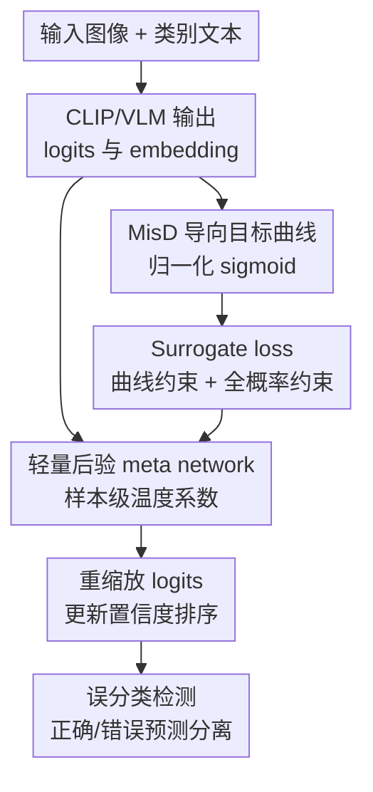

# Revisiting Confidence Calibration for Misclassification Detection in VLMs

**会议**: ICLR 2026  
**OpenReview**: [https://openreview.net/forum?id=d8WMoi571f](https://openreview.net/forum?id=d8WMoi571f)  
**代码**: Code Link（论文补充材料匿名链接）  
**领域**: 多模态VLM / 置信度校准 / 误分类检测  
**关键词**: VLM置信度校准、误分类检测、CLIP、后验校准、温度缩放  

## 一句话总结
本文指出标准置信度校准即便达到完美校准也会限制 VLM 的误分类检测能力，并用 MisD 导向的可靠性曲线、可微 surrogate loss 和轻量后验 meta network 学习样本级温度系数，从而更好地区分正确预测与错误预测。

## 研究背景与动机
**领域现状**：CLIP 这类视觉语言模型已经成为零样本分类、细粒度识别、遥感场景识别等任务里的常用基座。部署这些模型时，用户不仅关心预测类别是否正确，也关心模型给出的置信度是否可信。因此，temperature scaling、instance-wise calibration、面向 VLM 的文本距离校准等方法，都试图让“模型说自己有 0.8 置信度”对应到“大约 80% 的样本确实正确”。

**现有痛点**：高风险应用里，一个更直接的问题往往不是置信度数值是否等于经验准确率，而是模型能不能把错误预测排到更低置信度，把正确预测排到更高置信度。这个任务就是误分类检测（misclassification detection, MisD）：给定一个阈值，高置信样本被当作可靠预测，低置信样本被当作可能错误。传统校准优化的是可靠性曲线贴近对角线，却不保证正确样本和错误样本在置信度轴上分离得足够开。

**核心矛盾**：标准校准的目标和 MisD 的目标并不等价。完美校准要求 $P(\hat{y}=y\mid s=p)=p$，也就是置信度为 $p$ 的样本中正确比例等于 $p$。但 MisD 想要的是排序分离：正确样本尽量出现在高置信区，错误样本尽量出现在低置信区。若置信度分布广泛落在 $[0,1]$ 中间，即使可靠性曲线已经是对角线，高置信区里仍会混入错误样本，低置信区里也会混入正确样本。

**本文目标**：论文把问题拆成三个层次：先从理论上解释为什么“完美校准”对 MisD 有上界；再设计一个更符合 MisD 的目标可靠性曲线；最后给出能在 CLIP/VLM 上实际训练的后验方法，在不改变原模型预测类别和表征能力的前提下重新调整置信度排序。

**切入角度**：作者从 reliability diagram 出发，观察到可靠性曲线下方/上方的面积可以解释为某个置信区间内正确/错误预测的 precision。这个视角把传统校准图从“看曲线离对角线多远”变成“看哪些区域有利于检测正确样本或错误样本”，于是可以直接为 MisD 设计目标曲线。

**核心 idea**：用一条 MisD 导向的归一化 sigmoid 可靠性曲线替代标准对角线校准目标，并训练一个轻量后验网络为每个样本预测温度系数，让正确预测更尖锐、错误预测更平坦，从置信度排序上拉开二者。

## 方法详解

### 整体框架
这篇论文的方法不是重新训练 VLM 主干，而是在已有 CLIP 或 prompt-tuned CLIP 的输出之后加一个后验重校准模块。整体流程是：先用理论分析确定 MisD 需要怎样的可靠性曲线，再把这条曲线转成可微 surrogate loss，最后让 Lightweight Meta Network（LMN）根据 logits、图像 embedding 和预测文本 embedding 生成每个样本自己的温度系数 $\tau_v$，只调整置信度分布，不改原始 VLM 参数。

这里的关键区别在于，论文不再把 diagonal reliability curve 当作唯一理想目标。对传统校准来说，对角线代表 $f(s)=s$；对 MisD 来说，更理想的是低置信区尽量对应错误样本，高置信区尽量对应正确样本。因此作者构造的目标曲线在 $s<0.5$ 时压低正确率期望，在 $s>0.5$ 时抬高正确率期望，中间用参数 $\lambda$ 控制平滑过渡，避免变成过度激进的硬阶跃。

### 关键设计
**1. 可靠性曲线重解释：把校准图变成 MisD precision 的分析工具**

传统 reliability diagram 的纵轴是 accuracy，横轴是 confidence，因此曲线值 $f(s)$ 可以理解为 $P(\text{correct}\mid \text{confidence}=s)$。作者指出，在置信区间 $[a,b]$ 内，如果样本密度为 $w(s)$，那么正确预测检测的 precision 可以由曲线下方面积归一化得到：$Prec^+=\frac{\int_a^b w(s)f(s)ds}{\int_a^b w(s)ds}$；错误预测检测则对应曲线上方面积：$Prec^-=\frac{\int_a^b w(s)(1-f(s))ds}{\int_a^b w(s)ds}$。

这个重解释很关键，因为它说明 MisD 不是单纯要求曲线贴近对角线。若阈值为 $r$，把 $s\ge r$ 的样本判为正确预测时，真正有用的是高置信区曲线下方面积要尽量大；把 $s<r$ 的样本判为错误预测时，真正有用的是低置信区曲线上方面积要尽量大。于是，标准校准在 MisD 上的局限就能被写成明确的 precision 上界，而不是停留在“经验上提升有限”。

**2. MisD 导向目标曲线：用归一化 sigmoid 在校准和分离之间调节**

在完美校准下，可靠性曲线是 $f(s)=s$。论文证明，此时高置信区正确检测 precision 等于 $E_{s\sim w(s\mid s\in[r,1])}[s]$，低置信区错误检测 precision 等于 $E_{s\sim w(s\mid s\in[0,r])}[1-s]$。只要样本置信度不是全部集中在 1 或 0，这两个期望就不可能达到 1，这解释了为什么完美校准仍可能无法把错误预测筛出来。

为了解决这个目标错位，作者提出归一化 sigmoid 曲线：$\Psi(s)=\frac{\sigma((s-0.5)/\lambda)-\sigma(-0.5/\lambda)}{\sigma(0.5/\lambda)-\sigma(-0.5/\lambda)}$。当 $\lambda\to\infty$ 时，$\Psi(s)$ 退化为对角线，等价于传统完美校准；当 $\lambda\to0$ 时，它接近阶跃函数，把正确样本推到高置信、错误样本推到低置信。更重要的是，论文证明在 $r>0.5$ 的高置信区，$\Psi(s)$ 相比对角线有更高的正确检测 precision；在 $r<0.5$ 的低置信区，$1-\Psi(s)$ 也带来更高的错误检测 precision。同时，$\Psi(s)$ 对每个置信水平的正确/错误混合熵更低，意味着它更不容忍两类样本混在同一个置信度附近。

**3. Surrogate loss：把不可微的目标曲线转成可训练的样本级约束**

可靠性曲线本身是统计量，直接用 binning 估计再优化会遇到两个问题：一是不可微，二是校准集通常很小，bin 内估计方差会很大。作者因此没有直接优化 ECE 式分箱目标，而是设计了一个 surrogate loss，让每个样本都根据自身是否预测正确产生约束。对正确样本，如果置信度太低，就用 $1-\Psi(s)$ 和标准交叉熵鼓励它的概率分布更尖锐；对错误样本，如果置信度太高，就用 $\Psi(s)$ 和均匀分布约束鼓励它的概率分布更平坦。

完整目标可概括为两组约束的加权融合：正确样本项占权重 $\beta$，错误样本项占权重 $1-\beta$；融合函数 $\phi\{\cdot,\cdot\}$ 可以取求和或乘积。第一部分让 confidence 贴近 MisD 导向曲线，第二部分约束完整概率分布，避免只盯最大概率而让其余类别概率出现不稳定形状。这个设计的直觉很清楚：如果模型预测对了，就应该把概率质量更多集中到真类/预测类附近；如果模型预测错了，就不该继续自信地压低其它类别，而应让分布更接近高熵状态。

**4. 轻量后验 meta network：只学样本级温度，不破坏 VLM 原能力**

为了保留 CLIP 的零样本能力和 prompt tuning 后的类别预测，LMN 不更新图像编码器、文本编码器或 prompt 参数，而是只学习几层全连接层来预测样本级温度 $\tau_v$。对输入图像 $v$，原 logits 为 $z_v$，LMN 用三类信号生成温度：logits $z_v$ 描述分类 margin 和置信度几何；图像 embedding $\xi(x_v)$ 描述样本视觉难度；预测类别的文本 embedding $\psi(t_p)$ 描述类别语义和系统性混淆模式。三路特征分别投影到同一隐空间后拼接，再经过 FC 和 softplus 输出正的 $\tau_v$。

得到 $\tau_v$ 后，方法用 $z'_v=[\tau_v z_{v,1},\tau_v z_{v,2},\ldots,\tau_v z_{v,c}]$ 重缩放 logits。因为 $\tau_v$ 是乘在所有类别 logits 上，排序最高的类别通常不会被改变，但 softmax 后的置信度会变：较大的 $\tau_v$ 让分布更尖锐，较小的 $\tau_v$ 让分布更平坦。附录里的温度分析显示，LMN 学到的正确预测平均 $\tau$ 通常高于错误预测，MNIST 上二者差距尤其明显，这与 MisD 的目标一致。

### 损失函数 / 训练策略
训练时使用少量校准集。主实验采用 CLIP ViT-B/32，16-shot calibration set；若基座是 textual prompt 或 visual prompt CLIP，则把原 16-shot calibration set 分成两部分，一部分学习 prompt，另一部分训练后验 LMN。优化器为 SGD，epoch 从 $\{100,150,200\}$ 中选择，学习率从 $\{0.001,0.002,0.005\}$ 中选择。

超参数上，$\beta$ 控制正确样本项和错误样本项的平衡，$\lambda$ 控制目标曲线从平滑到接近阶跃的程度。论文的参数分析显示，$\beta$ 太大或太小都会破坏两类样本的平衡，峰值大致在 $\beta=0.6$ 附近；$\lambda$ 太小会让概率更新过激并导致不稳定，太大则接近标准校准、分离能力不足。多数数据集上 $\lambda=0.05$ 接近最优，作者也把它作为推荐默认值。

## 实验关键数据

### 主实验
论文在 DTD、Flowers102、EuroSAT、RESICS45、MNIST、CUB 六个数据集上评估 MisD。指标包括 AUROC、AUPR-Success、AUPR-Error、FPR90-Success 和 FPR90-Error；其中 Success 把正确预测当正类，Error 把错误预测当正类。下面选取 AUROC 和 FPR90-Error 展示主结果，数值越高/越低分别越好。

| 数据集 | 指标 | Zero-shot CLIP | ViLU | LMN (Ours) | 主要变化 |
|--------|------|----------------|------|------------|----------|
| DTD | AUROC↑ / FPR90-E↓ | 0.762 / 0.572 | 0.769 / 0.521 | 0.802 / 0.457 | 同时提升排序并减少错误漏检 |
| Flowers102 | AUROC↑ / FPR90-E↓ | 0.864 / 0.354 | 0.875 / 0.329 | 0.886 / 0.305 | 在强基线下仍有稳定收益 |
| EuroSAT | AUROC↑ / FPR90-E↓ | 0.650 / 0.742 | 0.723 / 0.538 | 0.788 / 0.468 | 遥感场景上提升最明显之一 |
| RESICS45 | AUROC↑ / FPR90-E↓ | 0.779 / 0.508 | 0.787 / 0.493 | 0.808 / 0.445 | 细粒度遥感类别混淆被缓解 |
| MNIST | AUROC↑ / FPR90-E↓ | 0.813 / 0.482 | 0.877 / 0.263 | 0.915 / 0.205 | 错误检测 FPR 大幅降低 |
| CUB | AUROC↑ / FPR90-E↓ | 0.807 / 0.554 | 0.801 / 0.563 | 0.812 / 0.532 | 细粒度鸟类上收益较小但为正 |

作者汇总指出，相比 zero-shot CLIP，LMN 平均提升 AUROC 6.1%、AUPR-Success 10.5%、AUPR-Error 4.7%，并分别降低 FPR90-Success 13.4%、FPR90-Error 22.9%。相比最强 MisD baseline ViLU，LMN 仍在五类指标上分别取得 2.8%、5.1%、2.1%、5.4%、18.7% 的平均收益。

### 消融实验
Surrogate loss 的消融主要比较原始 CLIP、只加 full-probability constraint（FPC）和完整方法（+ALL）。论文没有单独报告“只有 confidence regularization”的结果，因为作者认为它需要和 FPC 配套使用，单独优化最大概率会不稳定。

| 数据集 | CLIP AUROC / FPR90-E | +FPC AUROC / FPR90-E | +ALL AUROC / FPR90-E | 说明 |
|--------|----------------------|----------------------|----------------------|------|
| DTD | 0.762 / 0.572 | 0.795 / 0.471 | 0.802 / 0.457 | FPC 已明显缓解过度自信，完整曲线约束继续提升 |
| EuroSAT | 0.650 / 0.742 | 0.778 / 0.471 | 0.788 / 0.468 | 主要收益来自分布约束，目标曲线进一步稳定 |
| RESICS45 | 0.779 / 0.508 | 0.794 / 0.482 | 0.808 / 0.445 | 完整目标在错误检测上更强 |
| MNIST | 0.813 / 0.482 | 0.908 / 0.235 | 0.915 / 0.205 | 两个组件叠加后 FPR90-E 最低 |
| CUB | 0.807 / 0.758 | 0.808 / 0.440 | 0.812 / 0.438 | AUROC 增幅小，但错误检测明显改善 |

开放词表实验也验证了后验设计的意义。LMN 在校准时只见部分类别，在 unseen classes 上测试，仍能在多数数据集和指标上超过 zero-shot CLIP 与 DOR。例如 DTD 上 FPR90-S 从 CLIP 的 0.642 降到 0.596，MNIST 上 FPR90-E 从 0.322 降到 0.301。这说明它没有像一些 fine-tuning 方法那样明显牺牲 CLIP 的开放词表泛化。

### 关键发现
- 标准校准方法对 MisD 的帮助有限。FeatureClipping 相比 CLIP 的平均 AUROC 只提升约 0.7%，且不同指标不稳定，这与论文的理论结论一致：贴近对角线并不等价于正确/错误预测分离。
- 完整 surrogate loss 比只用 FPC 更好。FPC 能通过提高错误样本熵、降低过度自信带来大部分收益，但目标 sigmoid 曲线进一步把 reliability curve 往 MisD 需要的形状推。
- LMN 对不同基座可迁移。对 textual prompt 和 visual prompt CLIP，LMN 平均分别提升 AUROC 1.2%/1.1%，降低 FPR90-Error 6.2%/4.4%；在 CLIP-L/14 和 SigLIP-B/16 上也持续优于 SCT。
- 校准样本越多整体越稳，但低 shot 下也有效。4-shot、8-shot、16-shot、32-shot、64-shot 实验显示 AUROC 与 FPR90-E 大体随校准样本增加而改善，说明方法不是只依赖某个固定 16-shot 设置。
- 计算开销很小。LMN 只有约 17K-20K 参数，少于 CLIP ViT-B/32 的 0.02%；训练在各数据集上均不超过一分钟，多数只需几秒到几十秒。

## 亮点与洞察
- 这篇论文最有价值的地方是把 reliability diagram 重新解释为 MisD precision 的几何工具。这个视角把“校准为什么不够”讲成了可证明的面积关系，而不是只给经验观察。
- 归一化 sigmoid 目标曲线很巧妙：$\lambda\to\infty$ 时回到标准校准，$\lambda\to0$ 时接近理想分离，中间值提供可控折中。它让校准和排序分离不再是两个割裂目标，而是同一曲线族上的不同工作点。
- 后验温度网络的工程选择很稳。只缩放 logits 不改变预测类别，既能用于 zero-shot CLIP，也能接在 prompt-tuned CLIP 后面，适合高风险场景里“先不动原模型，只改善置信排序”的部署需求。
- 用错误样本对齐均匀分布这一点很实用。MisD 里错误预测最危险的不是“错”，而是“错得很自信”；把错误样本概率分布推向高熵，等价于主动降低这种危险自信。
- 这个思路可以迁移到其它多模态任务，例如 VQA、开放词表检测或医学 VLM。只要任务能得到预测正确/错误标签和 confidence，就可以考虑把 calibration objective 从“贴对角线”改为“服务下游拒识/报警排序”。

## 局限与展望
- 论文主要围绕分类式 VLM，尤其是 CLIP family 和 prompt-tuned CLIP。对于生成式 VLM、开放式问答、多标签输出或检测分割任务，confidence 的定义更复杂，不能直接套用最大 softmax probability。
- LMN 需要带标签校准集来判断哪些样本预测正确，虽然 4-shot/8-shot 已有效，但在真正无标签或强分布漂移场景下，还需要额外机制估计 correctness 信号。
- 目标曲线默认以 0.5 为中心阈值，作者解释这是自然的中性分界，但不同应用的风险偏好可能并不对称。例如医疗误诊检测可能更重视低漏报，此时曲线中点和形状或许应由成本函数驱动。
- 实验强调 MisD 排序指标，但与传统校准指标之间的 trade-off 还可以展开更多。方法有时会刻意偏离对角线来换取分离能力，因此如果用户真正需要概率语义上的 calibrated probability，就要谨慎解释输出置信度。
- 论文的代码链接在正文中仍是匿名 Code Link，复现细节虽写在附录，但实际可用性还取决于最终公开代码质量。

## 相关工作与启发
- **vs Temperature Scaling**: TS 用单个全局温度统一调整所有样本，目标通常是降低 NLL/ECE；本文使用样本级温度，并把目标从标准校准改成 MisD 导向的正确/错误分离。
- **vs FeatureClipping / DOR**: 这些方法关注 VLM 校准或 open-vocabulary calibration，通常希望 confidence 更贴近真实 accuracy；本文指出这种目标对 MisD 有理论上界，并用新的可靠性曲线替代对角线目标。
- **vs ViLU**: ViLU 把 VLM uncertainty/failure prediction 作为二分类式问题来建模，更多依赖任务设计和经验指标；本文从 confidence calibration 的几何关系出发，给出 precision dominance 和 mixing entropy 的理论解释。
- **vs FSMisD**: FSMisD 采用 prompt-based 策略进行 few-shot misclassification detection，但不充分利用已有 confidence 信息；本文直接重塑 confidence 排序，因此更容易和已有 VLM、prompt tuning 模型串接。
- **启发**: 对可靠 AI 来说，“概率准不准”和“错误能不能被排出来”是两个不同问题。面向拒识、报警、人工复核的系统，优化目标应直接服务排序/检测，而不是默认把 ECE 当作唯一可靠性指标。

## 评分
- 新颖性: ⭐⭐⭐⭐☆ 从 reliability diagram 推导 MisD 上界并设计目标曲线，视角清晰且有理论支撑，但核心实现仍是后验温度缩放。
- 实验充分度: ⭐⭐⭐⭐☆ 覆盖六个数据集、多种指标、prompt CLIP、open-vocabulary、SigLIP/CLIP-L、shot sensitivity 和效率分析，生成式 VLM 场景仍欠缺。
- 写作质量: ⭐⭐⭐⭐☆ 理论链条和实验组织比较完整，部分符号如 $\Phi/\Psi$ 在正文与附录表述略不统一，代码链接也仍是匿名占位。
- 价值: ⭐⭐⭐⭐☆ 对 VLM 风险控制和 failure prediction 很实用，尤其适合后验部署；若扩展到生成式多模态模型，影响会更大。

<!-- RELATED:START -->

## 相关论文

- [\[ICLR 2026\] Revisiting Multimodal Positional Encoding in Vision-Language Models](revisiting_multimodal_positional_encoding_in_visionlanguage_models.md)
- [\[ICLR 2026\] A-TPT: Angular Diversity Calibration Properties for Test-Time Prompt Tuning of Vision-Language Models](a-tpt_angular_diversity_calibration_properties_for_test-time_prompt_tuning_of_vi.md)
- [\[CVPR 2026\] Mind the Way You Select Negative Texts: Pursuing the Distance Consistency in OOD Detection with VLMs](../../CVPR2026/multimodal_vlm/mind_the_way_you_select_negative_texts_pursuing_the_distance_consistency_in_ood_.md)
- [\[CVPR 2025\] Rethinking VLMs for Image Forgery Detection and Localization](../../CVPR2025/multimodal_vlm/rethinking_vlms_for_image_forgery_detection_and_localization.md)
- [\[CVPR 2026\] CICA: Coupling Confidence-Aware Pretraining with Confidence-Informed Attention for Robust Multimodal Sentiment Analysis](../../CVPR2026/multimodal_vlm/cica_coupling_confidence-aware_pretraining_with_confidence-informed_attention_fo.md)

<!-- RELATED:END -->
