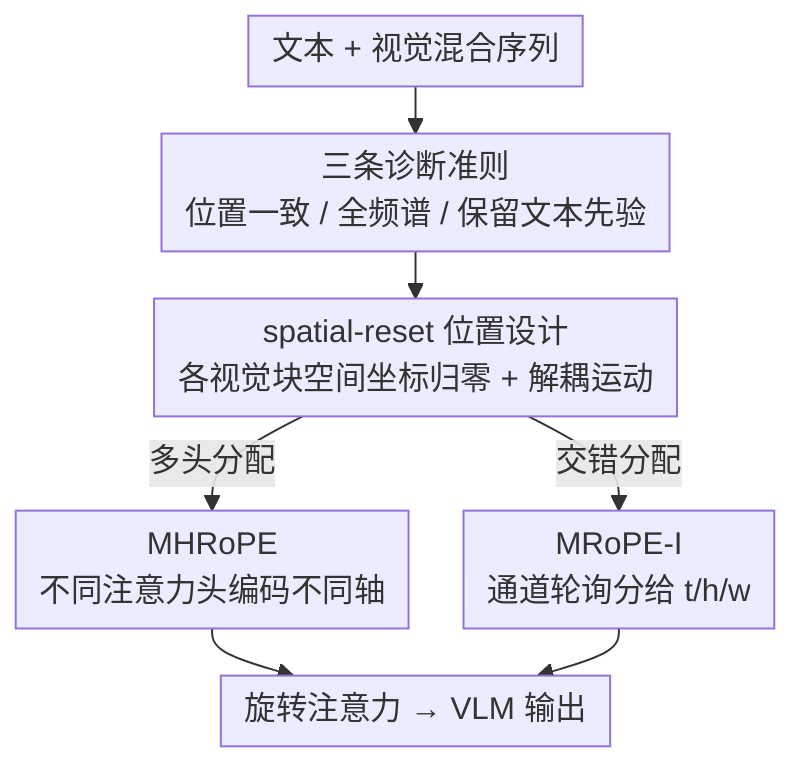

# Revisiting Multimodal Positional Encoding in Vision-Language Models

**会议**: ICLR 2026  
**OpenReview**: [https://openreview.net/forum?id=sCCF4ygDAw](https://openreview.net/forum?id=sCCF4ygDAw)  
**代码**: https://github.com/JJJYmmm/Multimodal-RoPEs (有)  
**领域**: 多模态VLM  
**关键词**: 多模态位置编码, RoPE, MRoPE, 频率分配, 视觉-语言模型

## 一句话总结
本文系统拆解多模态 RoPE 的「位置设计」与「频率分配」两大支柱，提炼出位置一致性、全频谱利用、保留文本先验三条准则，并据此提出无需改架构的 spatial-reset 位置设计与 MHRoPE / MRoPE-I 两种频率分配变体，在图像、视频、视觉定位 20+ 个 benchmark 上一致超过现有 RoPE 方案。

## 研究背景与动机

**领域现状**：自注意力天然是置换不变的，必须靠位置编码告诉 LLM 序列顺序与相对距离。旋转位置编码（RoPE）已成为 Llama、Qwen 等现代 LLM 的事实标准。当 LLM 被改造成视觉-语言模型（VLM）后，位置编码需要同时处理 1D 文本和 2D/3D 视觉输入，于是衍生出两条路线：把所有 token 拍平成一维序列的 1D 方案（vanilla RoPE、V2PE），以及把位置标识扩展到时间/高/宽多轴的多维方案（Qwen2-VL 的 MRoPE）。

**现有痛点**：1D 方案丢掉了视觉内容固有的 3D 几何结构，在需要空间推理和视觉定位的任务上掉点明显；而多维的 MRoPE 把通道切成连续的 t-h-w 三块，强行让时间轴只占据最高频通道，导致注意力沿时间方向快速衰减、长视频建模受损。后续工作（VideoRoPE、HoPE、CircleRoPE、IL-RoPE 等）各自针对图像、视频或图像生成打补丁，形成了一地碎片化的专用方案，且每个补丁都引入新毛病——对角布局会让视觉 token 的位置 id 越界覆盖到生成文本，造成「生成时模态混淆」（表现为无尽重复文本）；环形布局拉大模态间隔、又把视频帧压成一个环丢掉时间轴。

**核心矛盾**：这些方法都在「位置设计」和「频率分配」两个维度上顾此失彼——保住了时间轴的低频建模，就把空间轴挤进狭窄的高频带，损害细粒度空间推理；保住了 3D 结构，又破坏了与基座 LLM 文本 RoPE 的兼容性，知识迁移受阻。缺少一个把三件事（位置无歧义、各轴全频谱、文本编码不变）同时满足的统一方案。

**本文目标**：不增加任何架构改动，找到一套既能支撑图像/视频理解、又能做细粒度视觉定位的「全能」多模态位置编码。

**切入角度**：作者把多模态 RoPE 拆成三个正交的设计轴——位置设计、频率分配、与纯文本 RoPE 的兼容性——逐一做对照实验诊断现有方法的失败模式，再反推什么样的设计才健壮。

**核心 idea**：用三条经验准则（位置一致性、全频谱利用、保留文本先验）约束设计空间，落地为 spatial-reset 位置设计 + MHRoPE / MRoPE-I 两种「让每个位置轴都拿到完整频谱」的分配方式。

## 方法详解

### 整体框架

本文不是提出一个全新的位置编码，而是先做诊断、再给药方。诊断部分沿三个轴评估现有方法，提炼出三条准则：**位置一致性**（坐标无歧义、模态间隔合适、不破坏 3D 结构、增长缓慢）、**全频谱利用**（每个位置轴都要能用到从高频到低频的完整频谱）、**保留文本先验**（文本 token 的 RoPE 必须与基座 LLM 完全一致以保证知识迁移）。药方部分在 MRoPE 的基础上做两处改造：位置设计上加 **spatial-reset**（满足位置一致性），频率分配上提供 **MHRoPE** 和 **MRoPE-I** 两个变体（满足全频谱利用），二者都严格保持文本 RoPE 不变。整套方法即插即用，输入是文本+视觉混合序列，输出是各 token 的多轴位置标识，喂给原本的旋转注意力。

### 关键设计

**1. 三条诊断准则：把碎片化方案统一到可比较的设计空间**

本文最大的贡献其实是「先看清问题」。作者把所有多模态 RoPE 摆到三个设计轴上对照（论文 Table 1），发现现有方法的掉点都能归因到对某条准则的违反：对角布局违反位置一致性（视觉与文本位置 id 重叠 → 生成时模态混淆，出现「1111…」式重复）；MRoPE 把时间轴锁死在高频、空间轴各占非重叠频带，违反全频谱利用，导致长视频和细粒度定位顾此失彼；IL-RoPE / Omni-RoPE 把文本 token 的空间维也清零，违反保留文本先验，迁移性能反而低于 vanilla RoPE。这三条准则不是拍脑袋，而是从失败模式倒推出来的：分别保证布局无歧义（unambiguous layout）、表征丰富（rich representation）、从预训练 LLM 忠实迁移（faithful transfer）。后续两个方法都是为同时满足三条准则而设计。

**2. spatial-reset：让视觉注意力沉到小位置 id，并解耦视频运动**

MRoPE 用「跳过当前块最大坐标」的规则保证模态间无重叠（$m^t_{\text{next}} = \max(m^t_{\text{prev}}, m^h_{\text{prev}}, m^w_{\text{prev}}) + 1$），位置一致性大体达标，但作者发现一个被忽视的现象：MRoPE 存在「视觉注意力沉没」——注意力总往每张图/每帧的左上角集中，类似 LLM 在起始 token 上的 attention sink。spatial-reset 的做法是给每个视觉块的空间维度（h、w）单独归零重置，让这个视觉 sink 对齐 LLM 偏好小位置 id 的归纳偏置，从而加速视觉适应。它还顺带解耦了视频里的运动表示：在标准 MRoPE 下时间与空间维度是耦合的，同一物体在两帧的绝对位置写作 $m_1=(t_1, t_1+h_1, t_1+w_1)$、$m_2=(t_2, t_2+h_2, t_2+w_2)$，相对位置被时间项污染成 $m_{\text{rel}}=(t_2-t_1,\,(t_2-t_1)+(h_2-h_1),\,(t_2-t_1)+(w_2-w_1))$；加了 spatial-reset 后位置变为 $m_1=(t_1,h_1,w_1)$、$m_2=(t_2,h_2,w_2)$，相对向量干净地变成 $m'_{\text{rel}}=(t_2-t_1,\,h_2-h_1,\,w_2-w_1)$，给模型一个更直观的时空归纳偏置。消融里「+spatial-reset」在图像、视频、定位三类全面涨点。

**3. MHRoPE：用注意力头而非通道来分配位置轴，保住每轴全频谱**

MRoPE 之所以损害多尺度建模，根子在于「切通道」——把固定的 $d$ 维通道劈成 t/h/w 三段，每段拿到的频率分辨率天然被砍粗，且各轴只覆盖部分频段。MHRoPE 受「RoPE 存在通道级冗余」（partial RoPE）启发，假设这种冗余在注意力头层面同样存在，于是改成按**注意力头**分配位置编码任务：不同的头专门负责不同的位置轴（GQA 下在 KV 头上切分、再 repeat 到对应 query 头）。这样每个轴都用其所属头内的**完整频率谱**编码，避免了切通道带来的频率分辨率损失。它还更可扩展——当位置轴数继续增长时，在固定 128 通道里再切会越来越难，而给新维度分配新的头要灵活得多。

**4. MRoPE-I：通道轮询交错，让 t/h/w 各拿全频谱且兼容外推**

MRoPE-I 走另一条路：不按连续块切，而是把特征通道以细粒度 round-robin（轮询交错）的方式依次分给时间、垂直、水平三个轴。因为频率随通道索引单调衰减，交错分配让每个轴都均匀地拿到从高频到低频的完整频谱，从而对每个位置轴都能做稳健的多尺度建模。这种均匀分布还有个额外好处：它与 NTK-aware、YaRN 这类通过整体重缩放频谱来外推的算法天然兼容（连续切块会破坏这种缩放假设）。论文 Figure 4 显示 MHRoPE 和 MRoPE-I 都把 MRoPE 那种「时间快衰减、空间不对称衰减」的曲线，拉成了各轴统一的衰减剖面。MHRoPE 与 MRoPE-I 的取舍：前者更可扩展，后者兼容外推算法，二者位置设计相同（都用 spatial-reset + 保留文本 RoPE），只在频率分配上分叉。

### 损失函数 / 训练策略
方法本身不改 loss、不改架构，纯位置编码替换。训练用 Qwen2.5-VL 的 ViT 与 connector、Qwen2.5-7B 作为 LLM 骨干；冻结 ViT，解冻 connector 和 LLM。约 2M 高质量 SFT 样本（覆盖 caption、OCR、视觉推理、定位、文档理解、长视频、多轮对话），batch size 128，AdamW（$\alpha=0.9$、$\beta=0.98$、weight decay 0.05），学习率 cosine 从 $1\times10^{-5}$ 衰减到 $3\times10^{-6}$，训练上下文 32K，rotary base 取 $10^6$。所有对照实验唯一差异就是多模态 RoPE 的选择。

## 实验关键数据

### 主实验
20+ benchmark 上 MHRoPE / MRoPE-I 在图像、视频、定位三类的整体得分均领先。Overall 行（论文 Table 2）：

| 类别 | Vanilla RoPE | MRoPE | VideoRoPE | CircleRoPE | MHRoPE | MRoPE-I |
|------|------|------|------|------|------|------|
| Image | 62.17 | 61.90 | 57.03 | 60.16 | 62.92 | **63.79** |
| Video | 51.64 | 51.51 | 52.18 | 51.09 | **52.58** | 52.36 |
| Grounding | 73.48 | 73.69 | 72.59 | 74.96 | 74.92 | **75.85** |

代表性单项上，MRoPE-I 相对 vanilla RoPE：MMMU +2.67%、ChartQA +5.28%、RefCOCO$_{\text{val}}$ +3.27%。VideoRoPE / HoPE 虽在部分视频任务更强，却在 DocVQA / InfoVQA / ChartQA 上异常崩塌（如 DocVQA 从 82.94 掉到 60 附近），正是对角布局导致的模态混淆。

### 消融实验

位置设计消融（频率分配固定为交错，论文 Table 4），看 Image / Grounding / Video 三项：

| 位置设计 | Image | Grounding | Video | 说明 |
|------|------|------|------|------|
| vanilla RoPE | 65.69 | 73.48 | 51.64 | 1D 拍平基线 |
| + 3D structure | 65.87 | 74.40 | 51.29 | 加 3D 主要利好定位 |
| + 3D + spatial-reset | **66.65** | **75.85** | **52.36** | 三类全面涨点 |
| + diagonal layout | 61.20 | 72.33 | 52.51 | 文档类崩塌（DocVQA 60.13），重复生成 |
| + modality interval | 62.80 | 73.19 | 50.88 | 间隔过大→忽略视觉、生成无关文本 |
| + text spatial-reset | 58.27 | 68.2 | 50.71 | 破坏文本兼容，全面掉点 |
| + scaling rotary base | 60.15 | 74.13 | 52.11 | 偏离基座 RoPE→图像掉点 |

频率分配消融（位置设计固定为 MRoPE+spatial-reset，论文 Table 5）：交错（Interleave，Overall 64.95）≈ 多头（Multi-Head 64.63）> VideoRoPE-like（63.31）> IL-RoPE-like（63.07），证明「每个轴拿到完整频谱」比「切成部分频段」一致更优。

### 关键发现
- **spatial-reset 是位置设计里收益最稳的单点改造**：在 3D 结构基础上加它，图像/定位/视频三类同时涨，且解释清晰（对齐 LLM 小位置 id 偏置 + 解耦视频运动）。
- **偏离基座文本 RoPE 几乎总是有害**：无论是给文本也做 spatial-reset（58.27，最差），还是缩放空间轴 rotary base，都明显掉点，强力支撑「保留文本先验」这条准则。
- **跨架构泛化成立**：换到 Qwen3-VL-4B / 8B（去掉窗口注意力、引入 DeepStack、加 QK-Norm）后，MHRoPE / MRoPE-I 依旧最优，对角布局掉点现象也复现。

## 亮点与洞察
- **「先诊断后开方」的研究范式**：把碎片化的多模态 RoPE 方案统一到三个正交设计轴上对照，让每个方法的掉点都能归因到具体违反的准则，比单纯刷点更有指导价值。
- **attention sink 视角迁移到视觉**：把 LLM 起始 token 的注意力沉没现象，类比到视觉块左上角的沉没，并用 spatial-reset 对齐 LLM 的小位置 id 偏置，这个跨模态类比很巧。
- **「全频谱」可以靠分头而不只靠分通道实现**：MHRoPE 提示，当位置轴数增多、通道不够切时，换一个维度（注意力头）去分配是更可扩展的思路，可迁移到未来更多轴（如多视角、3D 场景）的位置编码。
- **即插即用、零架构改动**：两个方法都只改位置 id 的构造，不动模型结构和 loss，工程落地成本极低。

## 局限与展望
- 评测主要在 Qwen 系（2.5-VL、3-VL）上，虽验证了跨架构泛化，但未覆盖 InternVL、LLaVA 等其他 VLM 家族，普适性还需更广验证。
- spatial-reset 缓解的视觉 attention sink 现象基于注意力可视化的定性观察，缺少更严格的定量刻画（如 sink 强度指标）。
- MHRoPE 与 MRoPE-I 在不同任务上各有胜负（前者偏视频、后者偏图像/定位），论文未给出「何时该选哪个」的自动化判据，实践中仍需试错。
- 方法聚焦理解类任务，图像生成场景（IL-RoPE / Omni-RoPE 的主战场）未做评测，统一到生成任务上是否仍最优尚不明确。

## 相关工作与启发
- **vs MRoPE（Qwen2-VL）**：MRoPE 切连续通道导致时间锁高频、空间不对称，且存在视觉 attention sink；本文在其上加 spatial-reset 消除 sink、用多头/交错分配恢复各轴全频谱，三类任务整体超越。
- **vs VideoRoPE / HoPE**：它们把时间移到低频改善长视频，却把空间挤进高频、并因对角布局导致位置 id 重叠引发生成模态混淆（文档类崩塌）；本文用 spatial-reset 避免重叠，用全频谱分配兼顾空间与时间。
- **vs CircleRoPE**：环形布局让视觉 token 与文本等距，但模态间隔过大阻碍跨模态交互、且压塌视频时间轴；本文保持合适模态间隔并保留时间轴。
- **vs IL-RoPE / Omni-RoPE**：它们给文本也重置空间维以利图像编辑，破坏了与基座 LLM 文本 RoPE 的兼容；本文严格保留文本先验，迁移性能更好。

## 评分
- 新颖性: ⭐⭐⭐⭐ 不是全新机制，但「三轴诊断 + 三准则 + 两个即插即用变体」的系统化梳理与 spatial-reset 的视角很有价值
- 实验充分度: ⭐⭐⭐⭐⭐ 20+ benchmark、严格控制变量、跨架构泛化、位置设计与频率分配双消融，论证扎实
- 写作质量: ⭐⭐⭐⭐⭐ 从失败模式倒推准则、再落地方法，逻辑链清晰，配图把各方案差异讲得很直观
- 价值: ⭐⭐⭐⭐⭐ 零架构改动、即插即用、跨架构有效，是多模态位置编码很实用的设计指南

<!-- RELATED:START -->

## 相关论文

- [\[CVPR 2026\] MODIX: A Training-Free Multimodal Information-Driven Positional Index Scaling for Vision-Language Models](../../CVPR2026/multimodal_vlm/modix_a_training-free_multimodal_information-driven_positional_index_scaling_for.md)
- [\[ICML 2026\] Circle-RoPE: Cone-like Decoupled Rotary Positional Embedding for Vision-Language Models](../../ICML2026/multimodal_vlm/circle-rope_cone-like_decoupled_rotary_positional_embedding_for_large_vision-lan.md)
- [\[CVPR 2025\] FastVLM: Efficient Vision Encoding for Vision Language Models](../../CVPR2025/multimodal_vlm/fastvlm_efficient_vision_encoding_for_vision_language_models.md)
- [\[ECCV 2024\] BRAVE: Broadening the Visual Encoding of Vision-Language Models](../../ECCV2024/multimodal_vlm/brave_broadening_the_visual_encoding_of_vision-language_models.md)
- [\[ICLR 2026\] Pay Less Attention to Function Words for Free Robustness of Vision-Language Models](pay_less_attention_to_function_words_for_free_robustness_of_vision-language_mode.md)

<!-- RELATED:END -->
