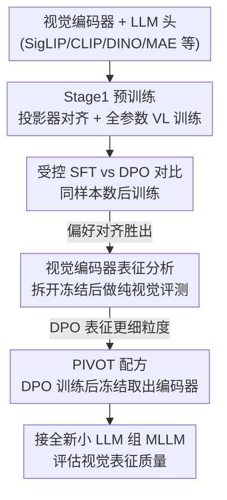

# RL Makes MLLMs See Better Than SFT

**会议**: ICLR 2026  
**OpenReview**: [https://openreview.net/forum?id=3gM6HwHvnc](https://openreview.net/forum?id=3gM6HwHvnc)  
**代码**: https://github.com/junha1125/PIVOT  
**领域**: 多模态VLM  
**关键词**: MLLM、DPO、SFT、视觉编码器、偏好对齐

## 一句话总结
这篇论文系统对比了 SFT 与 RL（以 DPO 为代表）对多模态大模型（MLLM）及其视觉编码器的不同影响，发现 DPO 不仅在视觉密集的 VQA 任务上更强，还能把视觉编码器重塑得更细粒度、更具定位能力，并据此提出一个极低成本的视觉编码器进化配方 PIVOT。

## 研究背景与动机

**领域现状**：MLLM 的主流认知是「能力主要来自 LLM 主干」——既然语言模型参数巨大、能力惊人，视觉编码器就被当成一个固定的「眼睛」，研究者很少深究它。与此同时，MLLM 的训练范式正从 SFT（监督微调，学指令跟随）转向 RL（强化学习/偏好对齐，主要是 DPO），这进一步加剧了对视觉侧的忽视。

**现有痛点**：领域里几乎没有对「SFT vs RL 在 MLLM 上到底差在哪」的受控对比，更没人系统分析过这两种后训练策略如何改写视觉编码器的表征。已有结论停留在「微调视觉编码器比冻结好」这种很初步的层面，对「DPO 是不是真的比 SFT 强、随模型规模放大这个趋势是否成立、它怎么影响视觉编码器」一概空白。

**核心矛盾**：根源在于一种隐性的「LLM 中心论」假设——把 MLLM 的所有能力都归功于语言模型，于是视觉编码器在后训练阶段被当成几乎不变的黑盒。但作者怀疑：偏好对齐的梯度其实会一路反传到视觉编码器，悄悄改写「模型如何看图」，而这一点从未被验证。

**本文目标**：拆成三个递进的子问题——(1) SFT 和 DPO 在多样 VQA 任务上、随视觉/语言两侧规模放大，到底谁更强？(2) 后训练是否真的重塑了视觉表征，DPO 重塑得是否更好？(3) 如果是，能否把这个过程反过来当成一个进化视觉编码器的配方，去超越 SOTA 视觉模型？

**切入角度**：把视觉编码器从 MLLM 里「拆下来」单独评测——在经典视觉任务（ImageNet 线性探测、ADE20K 分割探测）、Grad-CAM 梯度可视化、视觉-语言表征对齐等多个维度上独立衡量它的表征质量，从而把视觉侧的变化和语言侧解耦开。

**核心 idea**：用 DPO 偏好对齐的对比式梯度去训练「视觉编码器 + LLM 头」，再把训练好的视觉编码器冻结取出，就能用不到标准视觉预训练 1% 的算力，造出比更大、训练更久的编码器还强的 MLLM 视觉骨干（即 PIVOT）。

## 方法详解

### 整体框架

本文不是提出一个新模块，而是先用一套**受控实验**回答「SFT vs DPO 谁更强、为什么强」，再把这个发现固化成一个**可复用的视觉编码器进化配方 PIVOT**。整条研究链路分三步走：① 在统一架构（LLaVA-OneVision 实现，Qwen2.5 当 LLM、SigLIP2 当视觉编码器、2 层 MLP 当投影器）下，用**完全相同**的「图像-问题-回答」样本数分别做 SFT 和 DPO 后训练，跨视觉侧（86M→1B）和语言侧（0.5B→7B）两个维度做规模化对比；② 把后训练好的视觉编码器从 LLM 上**拆下来冻结**，在 ImageNet 分类、语义分割、梯度可视化、表征对齐等纯视觉指标上评测，看后训练究竟把视觉表征改成了什么样；③ 把「拿 LLM 头用 DPO 训练视觉编码器」这件事重新定义为 **PIVOT（Preference-Instructed Vision OpTimization）**——训练完后冻结编码器、丢掉原 LLM 头，换一个全新的小 LLM 组成 MLLM 再评测，以此证明 PIVOT 进化出的编码器能超越原版甚至更大的编码器。

### 关键设计

**1. 受控 SFT vs DPO 对比：同样本数下隔离训练策略的影响**

以往工作（如 MPO）常拿「Stage1 预训练模型」对比「再加 DPO 的模型」，这其实把「多训了一轮」和「用了 DPO」两个因素混在一起，没法公平回答「DPO 是否比 SFT 强」。本文的做法是在 Stage 2 后训练里给两种算法**喂完全相同数量的「图像-问题-回答」三元组**（从 MPO 数据随机采 20K），唯一变量就是损失函数。后训练数据集记为 $X_{PT}=\{x_i\}$，每个样本 $x_i=\{I_i, q_i, y_i^c, y_i^r\}$ 含图像、问题、被选回答 $y^c$ 和被拒回答 $y^r$；两种目标为

$$\mathcal{L}_{SFT} = -\mathbb{E}_{i}\log \pi_\theta(y_i^c \mid I_i, q_i), \quad \mathcal{L}_{DPO} = -\mathbb{E}_{i}\log \sigma\!\left(\beta\Big[\log\tfrac{\pi_\theta(y_i^c|I_i,q_i)}{\pi_{ref}(y_i^c|I_i,q_i)} - \log\tfrac{\pi_\theta(y_i^r|I_i,q_i)}{\pi_{ref}(y_i^r|I_i,q_i)}\Big]\right)$$

其中 $\pi_\theta$ 是 MLLM、$\pi_{ref}$ 是参考模型、$\beta$ 控制偏好对齐强度。在这个公平设置下，跨视觉编码器（B/16→g/16）和语言模型（0.5B→7B）两个维度放大都得到一致结论：DPO 在**强视觉相关**任务（OCR&Chart、Vision-Centric）上稳定大幅领先 SFT（如 g/16 上 OCR&Chart +3.1%p、Vision-Centric +4.2%p），而在主要靠 LLM 知识的 Knowledge VQA 上几乎打平（约 +0.3%p）。更关键的是 DPO 数据效率极高——3K 样本的 DPO（60.4%p）就能超过 40K 样本的 SFT（59.5%p）。这说明偏好对齐带来的增益主要落在「看图」而非「用知识」上，直接指向视觉编码器本身被改变了。

**2. 视觉编码器拆解分析：把「眼睛」单独拎出来证明它被重塑**

光看 VQA 分数无法确定到底是 LLM 变强还是视觉编码器变强。本文的关键操作是把视觉编码器（及投影器）从后训练好的 MLLM 上**物理拆下、冻结权重**，然后在与 LLM 完全无关的纯视觉任务上评测，从而把视觉侧的变化彻底隔离出来。具体用了四类互补证据：（i）**ImageNet 线性探测**——对拆下的视觉特征做线性分类，DPO 比 SFT 在 Top-1 上高出约 +1.83%p（SigLIP2-So/16+Qwen-3B）到 +1.96%p（L/16+Qwen-1.5B），并且越大的 LLM 头训出的视觉编码器越强（7B 头比 0.5B 头 +4.4%p），证明后训练确实改写了视觉表征、且 LLM 越大反传给视觉的信号越有信息量；（ii）**Grad-CAM 梯度可视化**——按式 (1) 对单样本反传，观察落到视觉特征 $A=\Phi_{ViT}(I)$ 上的梯度，发现 DPO 的梯度精准聚焦在「问题相关区域」，而 SFT 的梯度更弥散，作者据此推断是 DPO 区分「被选 vs 被拒」回答的对比式目标提供了更细粒度的视觉梯度；（iii）**ADE20K 分割探测**——冻结编码器接 2 层 MLP 做 patch 级分类，6 种编码器上 DPO 一致优于 SFT（如 CLIP-L/14 336px 上 patch 召回 +1.08%p），说明 DPO 增强了定位能力；（iv）**视觉-语言表征对齐**——DPO 训练的编码器与参考 LLM 的对齐分更高，且配更大 LLM 对齐越强。五个发现拼在一起，得出核心结论：**RL/DPO 让视觉表征更强、更局部化**。

**3. PIVOT 配方：把偏好对齐反过来当作视觉编码器的进化引擎**

既然 DPO 能把视觉编码器训得更好，本文把这个过程重新包装成一个独立配方 **PIVOT**——核心一句话：拿一个 LLM 当「头」，用 DPO 去训练你想进化的视觉编码器。流程是：取一个常用视觉编码器（CLIP/SigLIP1/DINOv2/MAE 等）接上 LLM 头，先在 3M 指令数据上做 Stage1 预训练、再在 20K 偏好对上做 DPO（即 Stage2），然后把视觉编码器**拆下来冻结**得到「PIVOT-enhanced 编码器」；评测时把它接一个**全新的 Qwen2.5-1.5B** 重新组装成 MLLM（投影器预训练 + 在 Cambrian 737K 上指令微调），以此隔离出编码器自身的能力提升。PIVOT 的卖点是「省」和「越级」：只需 8 张 H100 训 18 小时（不到标准视觉预训练算力的 1%），却能让 SigLIP1-So/14+PIVOT（53.2%p）超过原版 SigLIP2-So/16（52.4%p）这一代际更新的编码器，让 SigLIP2-So/16+PIVOT（55.6%p）超过参数多 2.5 倍的 SigLIP2-g/16（53.9%p）。强调它「不是新方法、而是一个被忽视的训练范式」——所有改动只是把后训练阶段的视觉编码器当成一等公民来优化。

### 一个例子：PIVOT 如何让小编码器越级打大编码器

以 SigLIP2 系列为例走一遍：原版 SigLIP2-So/16（400M 参数）组成的 MLLM 平均 VQA 得分 52.4%p；同样的 So/16 走一遍 PIVOT（多看 0.003B 偏好样本）后冻结取出，重新组 MLLM 得到 55.6%p，反超了原本明显更强、参数翻 2.5 倍的 SigLIP2-g/16（1000M 参数，53.9%p）。换句话说，一个「上一档位 + PIVOT」的编码器，用极小的额外训练就跨过了「换更大模型」乃至「换下一代模型」才能拿到的提升——OCR&Chart 一项从 46.6 提到 53.9，Vision-Centric 从 50.6 提到 52.4。同样的越级在跨代际上也成立：SigLIP1-So/14+PIVOT（53.2%p）> 原版 SigLIP2-So/16（52.4%p）。

### 损失函数 / 训练策略

后训练严格控制变量：SFT 用式 (1) 的 $\mathcal{L}_{SFT}$（仅最大化被选回答似然），DPO 用 $\mathcal{L}_{DPO}$（在被选/被拒回答间做偏好对比，$\beta$ 控强度），两者吃**同样数量**的三元组。PIVOT 默认采用 DPO——消融显示 DPO 版（56.7%p）比 SFT 版（55.4%p）在 SigLIP2-g/16 上高 1.3%p。整体两阶段范式（Stage1 大规模指令预训练 + Stage2 小规模偏好对齐）刻意模仿 InstructGPT 的 RLHF 流程。

## 实验关键数据

### 主实验

PIVOT 应用到多种视觉编码器后，MLLM（统一接 Qwen2.5-1.5B）平均 VQA 全面提升：

| 视觉编码器 | 配置 | Average | OCR&Chart | Vision-Cent. |
|------------|------|---------|-----------|--------------|
| SigLIP1-So400m | 原版 | 50.9 | 42.3 | 49.8 |
| SigLIP1-So400m | +PIVOT | 53.2 | 46.8 | 51.7 |
| SigLIP2-So400m | 原版 | 52.4 | 46.6 | 50.6 |
| SigLIP2-So400m | +PIVOT | 55.6 | 53.9 | 52.4 |
| SigLIP2-giant(1B) | 原版 | 53.9 | 50.8 | 51.9 |
| SigLIP2-giant(1B) | +PIVOT | 56.7 | 54.7 | 54.2 |
| CLIP-large | +PIVOT | 49.5 (+3.2) | 37.8 | 48.6 |
| DINOv2-giant | +PIVOT | 43.6 (+2.7) | 18.7 | 49.2 |
| MAE-huge | +PIVOT | 39.7 (+2.9) | 18.2 | 43.3 |

亮点：SigLIP2-So/16+PIVOT（55.6）越级超过参数多 2.5 倍的 SigLIP2-g/16（53.9）；连纯自监督的 MAE、MoCo 和纯分类监督的 ImageNet-Sup 编码器也都被 PIVOT 提升，说明这是普适增益。

### 消融实验

| 配置 | 关键指标 | 说明 |
|------|---------|------|
| PIVOT (DPO) | 56.7%p avg | 默认配方，SigLIP2-g/16 |
| +SFT (替 DPO) | 55.4%p avg | 换成 SFT 掉 1.3%p，确认 DPO 优势在 PIVOT 中延续 |
| DPO ImageNet 探测 | +1.83~1.96%p | 拆下的编码器线性探测，DPO > SFT |
| DPO 分割探测 | +1.08%p recall | CLIP-L/14 336px，patch 级定位更准 |
| DPO 数据效率 | 3K > SFT 40K | DPO 3K 样本(60.4)超 SFT 40K 样本(59.5) |

### 关键发现

- **DPO 的增益集中在视觉侧**：在强视觉任务（OCR&Chart、Vision-Centric）上 DPO 大幅领先 SFT，在靠 LLM 知识的 Knowledge VQA 上几乎打平，证明偏好对齐主要改善「看图」而非「调知识」。
- **后训练真的会重塑视觉编码器**：拆下来单独做 ImageNet/分割探测，DPO 训出的编码器纯视觉性能也更高——这是第一份「DPO 不只对齐语言、还能学视觉表征」的证据。
- **LLM 越大、反传给视觉的信号越有信息量**：7B LLM 头训出的视觉编码器比 0.5B 头高 +4.4%p ImageNet 精度，对齐分也更高。
- **梯度更聚焦**：Grad-CAM 显示 DPO 的视觉梯度精准落在问题相关区域，SFT 则弥散，解释了定位能力提升的来源。

## 亮点与洞察
- **把「视觉编码器」从黑盒变成研究对象**：通过物理拆解 + 纯视觉探测，第一次把后训练对视觉侧的影响和语言侧干净地解耦，方法论上很有借鉴价值——任何想验证「某训练改变了哪个模块」的工作都可照搬「拆下来单独探测」这招。
- **PIVOT 的「四两拨千斤」**：不到 1% 算力、18 小时 8×H100，就让小编码器越级超过更大/更新的编码器，把「进化视觉骨干」从昂贵的从头预训练变成廉价的后训练微调。
- **对比式目标 → 细粒度梯度**的机制解释很巧妙：DPO 区分被选/被拒回答的对比信号，天然提供了比 SFT 更聚焦的视觉梯度，把「为什么 RL 看得更准」讲到了梯度层面。
- 普适性强：从语言监督（CLIP/SigLIP）到纯自监督（MAE/MoCo/DINOv2）再到分类监督（ImageNet-Sup），PIVOT 一律有效，说明这是训练范式层面的红利而非某个编码器的偶然。

## 局限与展望
- **RL 局限在 DPO**：主文几乎只用 DPO 当 RL 代表，虽然附录补了 PPO/GRPO/MPO，但「RL 比 SFT 强」这一普适结论的强度仍取决于 DPO 这一特例，不同 RL 算法的差异未在主文充分展开。
- **评测协议偏轻量**：PIVOT 编码器接的是 Qwen2.5-1.5B 小 LLM、Cambrian 737K 数据的高效评测协议，是否在大规模 SOTA MLLM（如 7B+ 配数千万指令）上同样越级，仍待验证。
- **绝对分数不高**：实验里的 MLLM 平均 VQA 多在 50%+ 区间，属于受控研究设置而非冲榜，PIVOT 的相对增益是否在更强基座上仍显著存疑。
- 改进方向：把 PIVOT 扩展到更强的 RL（如 GRPO）、更大的偏好数据，以及探索 PIVOT-enhanced 编码器与多编码器集成（论文已初步显示 SigLIP1+PIVOT+ConvNeXt 还能再涨到 53.6%p）的组合上限。

## 相关工作与启发
- **vs 多视觉编码器集成（Cambrian/Tong et al.）**：他们靠堆多个视觉编码器（如 SigLIP1+ConvNeXt-XXL，1.25B 参数）拿到 51.4%p；本文单个 SigLIP1+PIVOT 不加参数就达 53.2%p，且二者可叠加（53.6%p），说明「进化单编码器」比「堆编码器」更划算。
- **vs MPO 等 DPO 增强工作**：MPO 对比的是「预训练模型 vs 再加 DPO」，混淆了训练量与算法；本文用同样本数做受控对比，第一次干净地隔离出「DPO 算法本身」相对 SFT 的优势。
- **vs LLM 中心论的 MLLM 研究**：主流把 MLLM 能力归于 LLM 主干、视觉编码器当冻结眼睛；本文反其道，证明后训练会实质重塑视觉表征，并把视觉编码器的进化空间重新摆上台面。

## 评分
- 新颖性: ⭐⭐⭐⭐⭐ 首次系统证明 DPO 重塑视觉编码器，并把偏好对齐反用为视觉骨干进化配方，视角新颖。
- 实验充分度: ⭐⭐⭐⭐ 跨视觉/语言两维规模化 + ImageNet/分割/梯度/对齐四类探测 + 多编码器验证，但基座偏小、绝对分数不高。
- 写作质量: ⭐⭐⭐⭐⭐ 三步递进（对比→分析→配方）逻辑清晰，六个 Finding 层层推进，论证链完整。
- 价值: ⭐⭐⭐⭐⭐ 低成本进化视觉骨干的实用配方 + 「RL 让 MLLM 看得更准」的机制洞察，对 MLLM 视觉侧研究有方向性意义。

<!-- RELATED:START -->

## 相关论文

- [\[CVPR 2026\] Why Does RL Generalize Better Than SFT? A Data-Centric Perspective on VLM Post-Training](../../CVPR2026/multimodal_vlm/why_does_rl_generalize_better_than_sft_a_data-centric_perspective_on_vlm_post-tr.md)
- [\[ICLR 2026\] Visual Jigsaw Post-Training Improves MLLMs](visual_jigsaw_post-training_improves_mllms.md)
- [\[ICLR 2026\] Constructive Distortion: Improving MLLMs with Attention-Guided Image Warping](constructive_distortion_improving_mllms_with_attention-guided_image_warping.md)
- [\[ICLR 2026\] On Discriminative vs. Generative Classifiers: Rethinking MLLMs for Action Understanding](on_discriminative_vs_generative_classifiers_rethinking_mllms_for_action_understa.md)
- [\[ICLR 2026\] Patch-as-Decodable-Token: Towards Unified Multi-Modal Vision Tasks in MLLMs](patch-as-decodable-token_towards_unified_multi-modal_vision_tasks_in_mllms.md)

<!-- RELATED:END -->
