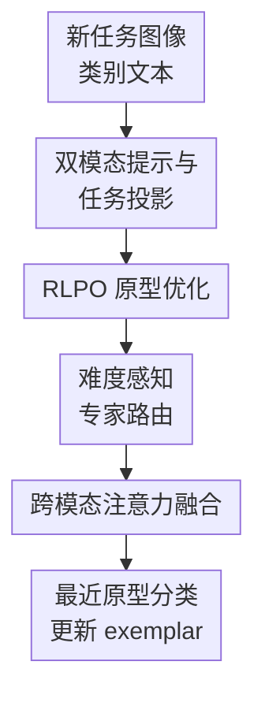

# RLAP-CLIP: Continual Multimodal Learning with Prototype Adaptation and Difficulty-Aware Routing

**会议**: ICLR2026  
**OpenReview**: [https://openreview.net/forum?id=rMHZfCznhZ](https://openreview.net/forum?id=rMHZfCznhZ)  
**代码**: 待确认  
**领域**: 多模态VLM / 持续学习 / CLIP  
**关键词**: CLIP持续学习, 原型优化, 双模态提示, 难度感知路由, 混合专家  

## 一句话总结
RLAP-CLIP 面向 CLIP 的类增量多模态持续学习，把类别原型从简单均值改成强化学习加权优化，同时用视觉-文本双模态 prompt 和难度感知 MoE 路由处理不同复杂度样本，在 8 个分类数据集上稳定超过 PROOF、C-CLIP 等持续视觉语言学习方法。

## 研究背景与动机
**领域现状**：CLIP 这类视觉语言模型通过大规模图文对比预训练，把图像和类别文本放进同一个语义空间，因此在零样本分类上很强。持续学习场景则更苛刻：类别按任务顺序不断到来，模型既要学会新类别，又不能忘掉旧类别。当前做法通常冻结 CLIP 主干，只学习少量 prompt、adapter 或原型分类器，并用每类少量 exemplar 来维护历史知识。

**现有痛点**：论文指出两个瓶颈。第一，很多方法用历史 exemplar 的特征均值作为类别原型，这在样本少、类别边界细、特征空间随任务演化时很脆弱；离群 exemplar 或多峰分布会把原型拉到不利位置，后续分类边界也跟着变差。第二，已有持续学习方法大多偏向文本 prompt，把视觉编码器当成固定特征提取器；但在 CUB-200、Aircraft、Cars 这类细粒度识别里，真正区分类别的往往是局部视觉细节，单靠类别名和文本上下文不够。

**核心矛盾**：持续学习里的稳定性需要可靠的历史类别表示，塑性又需要模型能适应新任务的细粒度视觉模式。被动均值原型偏稳定但不够判别，文本中心 prompt 能保持 CLIP 结构但浪费视觉适配能力；如果一味增加适配容量，又可能破坏旧类别边界。

**本文目标**：作者把问题拆成三个子目标：让原型构造主动服务于类间可分性；让视觉和文本两端都能轻量适配；让模型根据样本难度分配计算资源，避免简单样本被过度处理、困难边界样本处理不足。

**切入角度**：论文的观察很直接：原型不是只能平均出来，它也可以看成一个样本加权决策；不同 exemplar 对类别边界的贡献不同，应该学会给代表性强、能拉开类间距离的样本更高权重。同时，样本离优化后原型越远，越可能位于类别边界附近，越需要更强的专家路径处理。

**核心 idea**：RLAP-CLIP 用“强化学习优化原型 + 双模态 prompt 适配 + 难度感知 MoE 融合”替代 CLIP 持续学习中常见的“文本 prompt + 均值原型”，同时照顾历史类别保持和新类别适应。

## 方法详解
### 整体框架
RLAP-CLIP 仍以冻结的 CLIP ViT-B/16 为主干，训练时只更新少量任务相关模块：视觉 prompt、文本 prompt、任务投影层、RLPO 原型策略网络、easy/hard 两个专家以及跨模态注意力融合层。每个任务到来时，图像和类别文本先经过双模态 prompt 适配，再映射到任务特定空间；历史 exemplar 被 RLPO 加权成更可靠的类别原型；样本根据与原型的距离得到难度分数，并通过 MoE 专家和跨模态注意力完成最终分类。

从信息流看，双模态 prompt 负责把 CLIP 的视觉和文本特征轻量调到当前任务；RLPO 负责把少量 exemplar 压缩成更判别的类别原型；难度路由和跨模态注意力负责在分类前进一步处理样本特征、视觉原型和文本原型。推理时不需要重新训练策略，只按同样的特征处理流程提取表示，再做最近原型匹配。

### 关键设计
**1. RLPO 原型优化：把“类别均值”改成“对类间边界有用的样本加权”**

传统原型写成 $p_c=\frac{1}{|E_c|}\sum_{x_i\in E_c} f(x_i)$，默认每个 exemplar 都同样可靠。RLAP-CLIP 改为 $p_c=\sum_{i:y_i=c}w_i f_i$，其中权重 $w_i=\pi_\theta(f_i,P)$ 由策略网络预测并用 softmax 归一化。这个策略网络不仅看单个样本特征，也看当前所有类别原型集合 $P$，因此它学的不是“哪个样本像均值”，而是“哪个样本能帮助当前类别和其他类别分开”。

奖励函数把这个目标写得很清楚：$R_i=sim(f_i,p_{y_i})-\max_{j\ne y_i}sim(f_i,p_j)-\lambda\frac{\sum_{j\ne y_i}sim(p_{y_i},p_j)}{C-1}$。第一项鼓励样本靠近本类原型，第二项鼓励它远离最近的错误类别，第三项惩罚不同类别原型过近。为了让不同任务的奖励尺度稳定，作者在 batch 内把奖励标准化为 advantage $A_i=(R_i-\mu_R)/(\sigma_R+\epsilon)$，再用类似 policy gradient 的目标 $L_{RLPO}$ 更新策略，并用 KL 正则约束它不要偏离参考策略 $\pi_{ref}$ 太远。参考策略由均匀分布初始化，并在任务后用 EMA 更新，避免某个新任务把原型权重策略突然拉偏。

**2. 双模态提示与任务投影：补上 CLIP 持续学习里的视觉适配短板**

论文不是只在文本端学 prompt，而是为每个任务维护视觉 prompt $V_t$ 和文本 prompt $T_t$。视觉 prompt 拼接到图像 patch embedding 后送入冻结视觉编码器，文本 prompt 则拼到 “A photo of a [CLASS]” 这类类别模板前。随后，视觉特征和文本特征分别经过任务特定线性投影 $P_v^t$、$P_t^t$，得到当前任务空间中的 $f_i^{v,(t)}$ 和 $f_c^{t,(t)}$。

这样做的好处在于，它把“学习新任务”限制在 prompt 和投影层里，CLIP 主干保持冻结，旧知识不容易被覆盖；同时视觉端也能学习任务相关的细粒度线索。论文的动机实验显示，在 CUB-200 上双模态 prompt 的平均准确率达到 84.2%，高于 text-only 的 81.7% 和 visual-only 的 82.9%；在 Aircraft 上双模态也达到 66.9%，明显高于 text-only 的 63.6%。t-SNE 和聚类指标进一步说明，双模态 prompt 让类内距离从无 prompt 的 2.08 降到 1.41，类间距离从 3.95 升到 4.38，分离比从 1.90 提升到 3.11。

**3. 难度感知 MoE 路由：让边界样本走更强路径，简单样本走轻路径**

持续学习中每个样本的难度并不一样。RLAP-CLIP 用优化后的视觉/文本原型来定义难度：$d_i=1-\frac{sim(f_i^v,p_{y_i}^v)+sim(f_i^t,p_{y_i}^t)}{2}$。如果样本离本类原型远，它大概率更接近类别边界或更容易被混淆，难度分数就高；反之则低。这个定义比只看预测熵更贴近持续学习，因为它直接利用了当前类别几何结构。

MoE 里有两个专家：easy expert 是单层线性层，处理清晰样本；hard expert 是三层前馈网络，给复杂样本更多非线性变换。路由概率写成 $P(E_{easy}|x_i)=\sigma(-\alpha(d_i-\tau))$，其中 $\tau$ 是学习到的难度阈值，$\alpha$ 控制路由决策锐度；hard expert 的概率就是 $1-P(E_{easy}|x_i)$。最终视觉特征是两个专家输出的加权和 $f_i^{v,expert}=P(E_{easy}|x_i)E_{easy}(f_i^v)+P(E_{hard}|x_i)E_{hard}(f_i^v)$。这样一来，模型不会把同样的处理强度浪费在所有样本上，而是把容量更多留给靠近边界的样本。

**4. 跨模态注意力融合：动态决定当前分类更信视觉、原型还是文本**

经过专家处理后，RLAP-CLIP 并没有简单把视觉和文本相似度平均，而是把专家视觉特征、视觉原型和文本原型拼接为 $h_i=[f_i^{v,expert};f_{visual\ proto};f_{textual\ proto}]$，再通过一个前馈注意力网络输出三路权重 $[W_a,W_b,W_c]=SoftMax(Attention(h_i))$。最终用于分类的是加权后的视觉样本特征、视觉原型和文本原型。

这个设计很适合 CLIP 的持续学习：有些类别靠文本名字就区分得开，有些类别必须看细粒度视觉差异，还有些旧类别主要依赖稳定原型。注意力融合让模型按样本特性调权，而不是固定相信某一个模态。论文在 Aircraft 的错误分析也提醒了这个机制的边界：当类别名包含强符号差异，如 Boeing 737-300 和 737-400，文本 token 很有判别力；双模态融合若把权重过多分给视觉，可能因为 224×224 图像里机身长度差异太微弱而混淆。这说明融合不是无条件越视觉越好，而是需要难度和模态权重共同校准。

### 一个完整示例
假设当前任务新增若干鸟类类别，每类只保留 20 张 exemplar。普通均值原型会把所有 exemplar 平均起来：姿态偏、背景杂、光照异常的样本也贡献同样权重，导致 “Robin” 和 “Cardinal” 这类视觉相近类别的边界被拉糊。

RLAP-CLIP 会先用视觉 prompt 捕捉羽毛纹理、鸟喙形状等视觉线索，用文本 prompt 调整类别名称描述，再经任务投影进入当前任务空间。RLPO 检查每个 Robin exemplar 对类别内聚和类间分离的贡献：如果某张图既靠近 Robin 原型，又不会靠近 Cardinal 或 Blue Jay 原型，它会得到更高权重；如果某张图背景复杂或姿态导致特征接近其他鸟类，它会被降权。

分类一个新样本时，模型先计算它离本类视觉/文本原型的距离。如果它很接近某个类别原型，就主要走 easy expert；如果它位于多个鸟类边界附近，就更多走 hard expert。最后跨模态注意力决定这次分类更依赖专家视觉特征、视觉原型还是文本原型，再用最近原型完成预测。这个流程让“少量 exemplar 的原型质量”和“新任务细粒度适配”在同一条链路里互相配合。

### 损失函数 / 训练策略
RLAP-CLIP 的总目标由四部分组成：$L_{total}=L_{cls}+\lambda_{clip}L_{clip}+\lambda_{RLPO}L_{RLPO}+\lambda_{MoE}L_{MoE}$。分类损失会按难度加权，形式为 $L_{cls}=-\frac{1}{B}\sum_i(1+\gamma d_i)\log p(y_i|x_i)$，困难样本在监督中权重更高。$L_{clip}$ 是双向图文对比损失，用来维持 CLIP 预训练得到的视觉-语言对齐，避免 prompt 和投影把两端表示拉散。

$L_{RLPO}$ 训练原型权重策略，让正 advantage 样本获得更高采样权重，同时用 KL 项约束策略漂移。$L_{MoE}$ 则鼓励 easy/hard 两个专家都被使用，避免所有样本塌缩到同一路径。训练配置上，论文使用 CLIP ViT-B/16，OpenAI 和 LAION-400M 预训练权重；每个任务训练 20 个 epoch，优化器为 AdamW；每类保留 20 个 exemplar，与 iCaRL、PODNet、PROOF 等持续学习设定保持一致。

## 实验关键数据

### 主实验
论文在 8 个数据集上评估，覆盖通用分类 CIFAR-100、ImageNet-R，细粒度识别 CUB-200、Aircraft、Cars，以及 Food-101、UCF-101、ObjectNet 等专门域。指标包括 average accuracy 和 final accuracy，前者看整个持续学习过程的平均表现，后者看最后一个任务学完后所有类别的保留情况。

| 数据集 | 指标 | RLAP-CLIP | 最强对比方法 | 提升 |
|--------|------|-----------|--------------|------|
| CIFAR-100 | Avg / Final | 86.64 / 79.41 | PROOF 82.92 / C-CLIP 78.92 | Avg +3.72 / Final +0.49 |
| CUB-200 | Avg / Final | 85.78 / 83.67 | C-CLIP 82.14 / 79.83 | Avg +3.64 / Final +3.84 |
| Cars | Avg / Final | 94.82 / 93.15 | C-CLIP 92.18 / 90.45 | Avg +2.64 / Final +2.70 |
| Aircraft | Avg / Final | 70.25 / 68.41 | C-CLIP 65.73 / 62.15 | Avg +4.52 / Final +6.26 |
| Food-101 | Avg / Final | 88.24 / 86.88 | PROOF 87.52 / 84.74 | Avg +0.72 / Final +2.14 |
| UCF-101 | Avg / Final | 97.68 / 95.80 | PROOF 93.56 / 91.32 | Avg +4.12 / Final +4.48 |
| ImageNet-R | Avg / Final | 85.63 / 82.22 | C-CLIP 83.15 / 81.06 | Avg +2.48 / Final +1.16 |
| ObjectNet | Avg / Final | 53.89 / 48.91 | C-CLIP 51.37 / 47.82 | Avg +2.52 / Final +1.09 |

最明显的收益出现在 Aircraft、UCF-101、CUB-200 这类需要细粒度视觉区分或动作/域特征适配的数据集。传统 finetune 几乎完全灾难性遗忘，例如 CUB-200 final accuracy 只有 0.47%；prompt-based 方法如 CODA-Prompt 能缓解遗忘，但在 Aircraft 这类细粒度场景 final accuracy 只有 54.70%。RLAP-CLIP 的提升说明它不只是“多加模块”，而是在原型质量、视觉适配和困难样本处理三个位置同时补了持续 CLIP 的短板。

### 消融实验
| 配置 | 平均准确率 | 说明 |
|------|------------|------|
| Base | 78.97 | 以 PROOF 风格的冻结 CLIP、text-only prompt 和简单均值原型为起点 |
| +VP | 79.64 | 加视觉 prompt，平均 +0.67，Aircraft +1.24，说明视觉适配对细粒度更重要 |
| +VP+MoE | 80.79 | 加难度感知专家路由，平均再 +1.15，ObjectNet +1.58 |
| +VP+MoE+RLPO | 81.98 | 加原型强化优化，平均再 +1.19，Aircraft +2.28，UCF-101 +1.46 |
| RLAP-CLIP | 82.87 | 加跨模态注意力融合，平均再 +0.89，Aircraft +1.52，CIFAR-100 +1.17 |

| 分析项 | 关键结果 | 说明 |
|--------|----------|------|
| 原型构造 | RLPO 在 CUB-200 / Cars / Aircraft 上为 83.42 / 92.18 / 67.85 | 高于 simple averaging 和 quality-weighted averaging，说明学习型权重优于被动均值 |
| 难度路由 | Distance-based routing 在 ObjectNet 达 57.79，Aircraft 达 70.25 | 优于 random routing 和 entropy-based routing，因为它直接利用样本到原型的几何距离 |
| 样本预算 | 20 exemplar 平均 84.37，30 exemplar 平均 84.95，10 exemplar 平均 77.64 | 20 exemplar 接近收益饱和；降到 10 会明显掉点，说明 RLPO 仍依赖足够 exemplar |
| 复杂度 | 约 6M 可训练参数，训练每任务为 SimpleCIL 的 6×，推理延迟 1.09× | 比 DKR 训练快 2×，FLOPs 增量 7%，性能/效率权衡较好 |

### 关键发现
- RLPO 是细粒度场景里最关键的组件之一。Aircraft 从 +VP+MoE 到 +VP+MoE+RLPO 增加 2.28 点，说明当类别边界非常细时，原型位置比单纯 prompt 容量更影响遗忘和混淆。
- 视觉 prompt 的收益具有任务依赖性。它在 Aircraft、ObjectNet、Cars 这类视觉差异细或分布偏移大的场景更有效，在 Food-101 上增益较小，说明不是所有数据集都需要同等视觉适配强度。
- 难度路由比熵路由更稳。熵可能反映模型训练不足或置信度校准问题，而距离原型的难度更直接对应类别边界，因此在 ObjectNet、Aircraft 等困难数据集上提升更明显。
- exemplar 数量仍是瓶颈。20 到 30 exemplar 只带来 0.58 平均点提升，但 20 到 10 exemplar 掉 6.73 点；如果部署端记忆预算极低，RLPO 的主动原型优化也会被样本覆盖不足限制。

## 亮点与洞察
- 论文最好的切入点是把“原型构造”从后处理均值变成可优化策略。持续学习里很多方法强调怎么不改主干，却默认历史类别原型是可信的；RLAP-CLIP 直接攻击这个默认假设，思路很对。
- 难度分数和 RLPO 原型形成闭环：原型越可靠，样本难度估计越可信；困难样本经过更强专家处理后，又能帮助分类边界更清晰。这比孤立加一个 MoE 更有针对性。
- 双模态 prompt 的实验分析比较有启发。论文不只报告平均提升，还分析了 Aircraft 中 visual prompting hurt 的样本，指出同族编号类的文本符号差异有时比视觉特征更可靠，这让方法的适用边界更清楚。
- 这个框架可以迁移到其他原型式持续学习任务。比如持续检索、开放词表分割或多模态检索中，也可以用“策略网络给 memory exemplar 加权 + 难度路由处理边界样本”的组合来维护历史类别或概念表示。

## 局限与展望
- 方法依赖 exemplar memory。虽然 20 exemplar 的效率不错，但无 exemplar 时会退回接近 CLIP zero-shot 的表现；在严格 rehearsal-free 场景里，RLPO 需要改成生成式原型、合成特征或无样本统计更新。
- 模块较多，训练目标也较复杂。RLPO、MoE、双模态 prompt、投影层、注意力融合一起工作，带来更强性能，也提高了调参和复现难度；论文中 $\lambda_{RLPO}$、难度权重 $\beta$ 都在 0.2 附近最优，偏大时会明显掉点。
- 当前评估主要是 class-incremental image classification。对 domain-incremental、task-free continual learning、开放词表新增概念或图文检索式持续学习，方法是否同样有效还需要额外验证。
- 双模态融合可能稀释文本符号优势。Aircraft 错误分析显示，同族编号类别中视觉 prompt 有时会把样本拉向家族中心；后续可以让跨模态注意力显式识别“类别名符号差异强、视觉差异弱”的场景，动态提高文本通道权重。

## 相关工作与启发
- **vs PROOF**: PROOF 也是视觉语言持续学习强基线，结合 prompt learning、prototype management 和 open-world recognition，但仍主要依赖被动原型平均和文本侧适配。RLAP-CLIP 的区别是主动优化原型权重，并把视觉 prompt、难度路由和跨模态融合纳入同一框架。
- **vs C-CLIP**: C-CLIP 使用参数高效适配和原型分类，在 Cars、ImageNet-R 等视觉任务上很强。RLAP-CLIP 相比它更关注 exemplar 对原型边界的贡献，因此在 Aircraft final accuracy 上高出 6.26 点，说明细粒度类边界是主要收益来源。
- **vs CoOp / MaPLe**: CoOp 强调文本 prompt，MaPLe 强调多模态 prompt，但它们本身不是为持续类增量场景里的历史原型退化设计的。RLAP-CLIP 继承多模态 prompt 的适配能力，同时补上 exemplar 原型管理。
- **vs CODA-Prompt / DAP**: 这些 prompt-based 持续学习方法通过动态 prompt 或 instance-level prompt 适应任务，但不显式优化 CLIP 图文原型几何。RLAP-CLIP 的启发是：持续 VLM 不只要选择合适 prompt，也要持续维护“可分类的概念中心”。

## 评分
- 新颖性: ⭐⭐⭐⭐☆ 把 RL 式样本加权用于 CLIP 持续学习原型构造很有针对性，难度路由和双模态 prompt 的组合也比较完整。
- 实验充分度: ⭐⭐⭐⭐⭐ 8 个数据集、主结果、组件消融、路由对比、样本预算、复杂度和可视化都覆盖到了，支撑较扎实。
- 写作质量: ⭐⭐⭐⭐☆ 动机和模块解释清楚，附录分析丰富；但方法模块较多，部分符号和融合细节读起来需要反复对照。
- 价值: ⭐⭐⭐⭐☆ 对 prototype-based continual VLM 很有参考价值，尤其适合少量 exemplar 的细粒度增量分类；无 exemplar 或更开放任务仍需扩展。

<!-- RELATED:START -->

## 相关论文

- [\[ICLR 2026\] KeepLoRA: Continual Learning with Residual Gradient Adaptation](keeplora_continual_learning_with_residual_gradient_adaptation.md)
- [\[CVPR 2026\] Label What Matters: Modality-Balanced and Difficulty-Aware Multimodal Active Learning](../../CVPR2026/multimodal_vlm/label_what_matters_modality-balanced_and_difficulty-aware_multimodal_active_lear.md)
- [\[ICLR 2026\] Bilateral Information-aware Test-time Adaptation for Vision-Language Models](bilateral_information-aware_test-time_adaptation_for_vision-language_models.md)
- [\[ICLR 2026\] Memory-Free Continual Learning with Null Space Adaptation for Zero-Shot Vision-Language Models](memory-free_continual_learning_with_null_space_adaptation_for_zero-shot_vision-l.md)
- [\[ICLR 2026\] CLIP-FMoE: Scalable CLIP via Fused Mixture-of-Experts with Enforced Specialization](clip-fmoe_scalable_clip_via_fused_mixture-of-experts_with_enforced_specializatio.md)

<!-- RELATED:END -->
