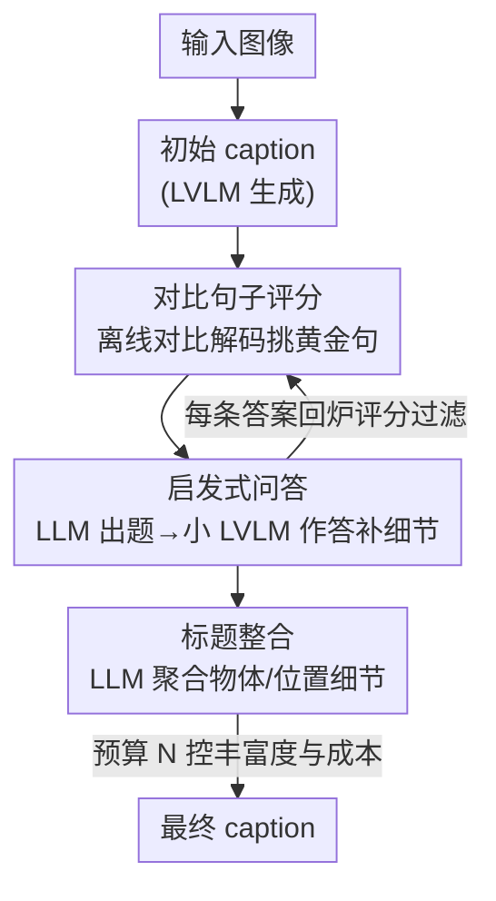

# ScaleCap: Scalable Image Captioning via Dual-Modality Debiasing

**会议**: ICLR 2026  
**OpenReview**: [https://openreview.net/forum?id=3tUSHgohi5](https://openreview.net/forum?id=3tUSHgohi5)  
**代码**: https://github.com/Cooperx521/ScaleCap  
**领域**: 多模态VLM  
**关键词**: 图像描述, 去偏, 对比解码, 幻觉抑制, 推理时扩展

## 一句话总结
ScaleCap 用"启发式问答 + 对比句子评分"两个互补模块，把开源 LVLM 的描述偏差掰正——前者靠不断追问把被略写的物体细节补齐，后者靠离线对比解码把语言先验导致的幻觉句删掉，并且能随推理预算增大持续变得更细更准；用它标注 45 万张图做预训练，在 11 个基准上一致涨点。

## 研究背景与动机

**领域现状**：高质量的长描述（detailed caption）对 LVLM 预训练里的细粒度图文对齐越来越重要，从早期只有几个泛词的短 caption，发展到段落级、上下文丰富的描述。但人工标注或调用 GPT-4o 这类闭源 API 来产长描述既贵又不可规模化，于是大家转向用开源 LVLM 自己生成。

**现有痛点**：开源 LVLM 生成的 caption 质量仍然不行，根源是两类**内生偏差**。一是**多模态偏差**：多模态训练数据本身标注不均衡，导致模型对某些物体大书特书、对另一些一笔带过，描述粒度参差、覆盖不全。二是**语言偏差**：LVLM 从 LLM 继承了语言习惯，偏爱套话和高频共现搭配，于是凭空"脑补"出图里根本不存在的物体或属性，也就是视觉幻觉。

**核心矛盾**：以往的补救办法是挂外部工具（目标检测器、图像打标器、专家模块）去丰富描述或压幻觉，但 caption 的上限就被这些工具的精度和覆盖度死死卡住。真实世界物体及属性的组合是无穷的，靠手工设计、按类别定制的模块当通用方案根本不现实。

**切入角度**：作者的关键观察是——细节缺失**不是因为模型看不懂**，而是生成时信息提取不充分。当你显式追问"再详细说说这个被略写的物体"，模型就能给出精准描述（图 2 统计 100 张图，93% 的新回答都补出了物体细节）。更妙的是这种感知能力不依赖大模型：7B 的 LVLM 在合适引导下感知力和 72B 相当，差距主要在推理。

**核心 idea**：与其堆模型规模或挂工具，不如用一个**结构化、可循环**的去偏流程，让模型反复回看、追问、校准 caption——用小 LVLM 负责"看"、用强 LLM 负责"问与整合"，并用一个预算 $N$ 控制问多少、从而在质量和成本之间自由伸缩。

## 方法详解

### 整体框架
ScaleCap 是一个"生成—精炼"的可伸缩流水线，目标是把一张图变成全面、细致、忠实的长描述。给定输入图像，先让 LVLM 生成一段**初始 caption**；接着用**对比句子评分**模块把其中视觉接地强的句子挑出来，记为"黄金句（golden sentences）"，作为后续扩展的骨架与起点。围绕黄金句，**启发式问答**模块由一个强 LLM 生成一批针对物体和位置的追问指令，再交给轻量 LVLM 逐条作答，把细粒度细节源源不断地注入；每条回答同样过一遍对比句子评分做幻觉过滤。问得越多，描述就越细、越均衡。最后用强 LLM 把这些碎片化的物体细节与位置细节整合成一段结构完整的最终 caption。整个过程由预算 $N$（最多允许问多少条指令）统一调度，从而在描述丰富度和算力开销之间灵活权衡。

### 关键设计

**1. 对比句子评分：用离线对比解码识别并删掉语言先验编出来的幻觉句**

这一模块针对语言偏差导致的视觉幻觉。核心思路是：一个真正"看图说话"的 token，应当在有图条件下比无图条件下显著更可能被生成；反之若一个 token 在没图时也照样高概率冒出来，那它多半是靠语言共现先验脑补的。形式上，对初始 caption 的每个 token $c_t$，分别算两条概率序列：以图像 $I$ 为条件的 $p_t = p_\theta(y_t=c_t \mid I,[T,c_{<t}])$，和只以文本为条件的 $p'_t = p_\theta(y_t=c_t \mid [T,c_{<t}])$，二者相减得对比概率 $\Delta p_t = p_t - p'_t$。$\Delta p_t$ 越大说明该 token 越依赖视觉证据、越可信。

与以往**在线**对比解码（边解码边干预 logits、容易破坏语言流畅性）不同，ScaleCap 做的是**离线**分析——先把句子完整生成出来，再回头打分，不动生成过程本身，从而既能查幻觉又不伤连贯性。过滤粒度放在**句子级**而非 token 级：把 caption 按标点切成句子 $\{C_1,\dots,C_m\}$，对每句取其关键 token（用词性标注排除介词等虚词）上的最大对比概率，超过阈值 $\tau$ 的句子才保留为黄金句：

$$S_G = \{C_k \mid \max(\Delta p^k_1, \Delta p^k_2, \dots, \Delta p^k_{kl}) > \tau\}$$

$\tau$ 越大过滤越严。这个模块既负责筛初始 caption 给出可信骨架，也负责对后续每条问答的答案做同样的过滤，是贯穿全程的"质检员"。

**2. 启发式问答：用追问驱动小 LVLM 把被略写的物体逐条补全**

这一模块针对多模态偏差造成的粒度不均、覆盖不全。机制是把"补细节"显式拆成一连串简单提问。以黄金句集合 $S_G=\{S_1,\dots,S_q\}$ 为线索，用一个强 LLM $M_L$ 以 in-context 方式为每句 $S_k$ 生成一组**物体指令** $I^k_o = M_L(T_{ict}, S_k)$，每条形如"再详细描述一下飞机"，覆盖该句里提到的所有物体；再在物体指令前加位置前缀，得到**位置指令** $I^k_p$，形如"再详细描述一下飞机的位置"，用来捕捉物体间的空间关系和整体布局。

作答环节刻意用**轻量 LVLM**：作者引用 Prism 的结论——LVLM 跨规模的感知力相近、差距主要在推理，而这些指令都很直白、几乎不需要推理，所以让小模型 $M_V$ 来答即可低成本拿到细节 $D^k_{o,i}=M_V(I, I^k_{o,i})$。这正好把"看"（小 LVLM 擅长、便宜）和"问与整合"（强 LLM 擅长）分工开。每问一轮、答一轮，caption 就被补进更细的物体与位置信息——这就是"scalable"的来源：问得越多越细。

**3. 标题整合与可伸缩预算 N：把碎片细节聚合成结构化长描述，并用 N 在丰富度与成本间调档**

启发式问答产出的是一堆零散的物体细节 $D_o$ 和位置细节 $D_p$，直接拼起来会松散无序。整合模块借助 LLM 的总结与逻辑能力，分别用提示 $T_o$、$T_p$ 把物体级、位置级细节各自总结成 $C_o=M_L(S_G,T_o,D_o)$、$C_p=M_L(S_G,T_p,D_p)$，并把黄金句作为"骨架"一并喂给 LLM，让它在总结时始终对齐整体结构；最后再调一次 LLM 把两者融合成结构完整的最终 caption $F_c=M_L(S_G,T_{final},C_o,C_p)$。

可伸缩性由预算 $N$ 控制：$N$ 限定最多生成多少条物体/位置指令——$N$ 小则问得少、便宜但略粗，$N$ 大则把所有指令都问一遍、细节最全。实验显示随 $N$ 增大（0→2→6→10→15→20→all），Prism 框架下 MMVet 从 51.8 单调升到 58.8、MMStar 从 46.9 升到 50.3，证明这是一条"花更多推理预算换更好描述"的平滑曲线。模型选择上，默认 LVLM 用 Qwen2-VL-7B（看图够用且便宜），LLM 用 Qwen2-72B（出题简单、但要把上千 token 的细节整合需要强推理）。

## 实验关键数据

### 主实验
**预训练涨点（表 1，11 个基准平均分）**：用 ScaleCap-450k 替换其他数据集做进一步预训练，三种架构上都拿到最高平均分。

| 架构 | 预训练数据 | 11 基准平均 | InfoVQA | MMVet |
|------|-----------|------------|---------|-------|
| Qwen2.5-7B | ShareGPT4V-450k | 62.4 | 47.5 | 48.9 |
| Qwen2.5-7B | DenseFusion-450k | 63.0 | 49.4 | 52.4 |
| Qwen2.5-7B | **ScaleCap-450k** | **64.7** | **51.8** | **55.9** |
| Qwen2.5-3B | DenseFusion-450k | 58.9 | 44.5 | 39.9 |
| Qwen2.5-3B | **ScaleCap-450k** | **60.1** | **47.2** | **45.6** |
| InternLM2.5-7B | DenseFusion-450k | 59.1 | 39.1 | 47.2 |
| InternLM2.5-7B | **ScaleCap-450k** | **60.2** | **39.6** | **48.0** |

InfoVQA 相比 ShareGPT4V 涨 4.3%、相比 DenseFusion 涨 2.4%；MMVet 相比 ShareGPT4V 涨 7%、相比 DenseFusion 涨 3.5%。

**描述信息量（表 2，Prism 框架）**：固定 Qwen2-72B 当推理 LLM，只比 caption 信息量。基于 7B LVLM 的 ScaleCap 平均 58.2，反超直接用 72B 跑 Prism 的 56.0——小模型 + 正确引导超过大模型蛮力。

| 策略 | LVLM | MMVet | InfoVQA | ChartQA | 平均 |
|------|------|-------|---------|---------|------|
| Prism | Qwen2-VL-7B | 53.3 | 49.3 | 68.5 | 54.1 |
| Prism | Qwen2-VL-72B | 57.3 | 50.0 | 69.5 | 56.0 |
| **ScaleCap** | Qwen2-VL-7B | **58.8** | **53.8** | **72.9** | **58.2** |

### 消融实验

| 配置 | TextVQA | MMVet | ChartQA | Avg | 说明 |
|------|---------|-------|---------|-----|------|
| 仅物体指令 | 52.9 | 54.5 | 69.1 | 58.8 | 缺位置关系 |
| 仅位置指令 | 52.3 | 54.3 | 65.7 | 57.4 | 缺物体细节 |
| ScaleCap（全） | 53.2 | 58.8 | 72.5 | 61.5 | 物体+位置互补 |

| 整合模型规模 | MMVet | MMStar | 说明 |
|------------|-------|--------|------|
| Qwen2-7B | 43.6 | 40.3 | 小 LLM 整合不动上千 token 细节，大幅掉点 |
| Qwen2-72B | 58.8 | 49.5 | 整合环节确实需要强推理 LLM |

### 关键发现
- **物体与位置指令互补缺一不可**：单用任一种都明显低于合用（58.8/57.4 vs 61.5），位置指令对 ChartQA 这类需要空间布局理解的任务尤其重要。
- **整合环节才是 LLM 规模敏感点**：作答可以用 7B 小模型，但整合若换成 7B 会从 58.8 暴跌到 43.6——印证了"看图用小模型、整合用大模型"的分工假设。
- **可平滑伸缩**：MMVet 随指令数 0→all 从 51.8 升到 58.8，是一条单调向上的"推理预算换质量"曲线，且预训练数据量从 100K 涨到 450K 时 ScaleCap 相对 DenseFusion 的优势还在扩大。
- **换上 GPT-4o 还能更强**：把 ScaleCap 的 LVLM/LLM 都换成 GPT-4o，MMVet 达 76.1，超过 Sonnet 3.5、GPT-4V、Gemini-2.0-Pro 等闭源直答；图像重建的人评相似度排名也优于 GPT-4o 和 Qwen2-VL-72B。

## 亮点与洞察
- **"细节缺失 ≠ 看不懂"这个观察很值**：作者用一个 100 张图的小实验（93% 追问命中）把问题从"感知能力不足"重新定义成"信息提取不充分"，直接把解法从"换大模型/挂检测器"导向"会提问"，这是全文的支点。
- **离线对比解码是个聪明的工程取舍**：在线对比解码会破坏流畅性，ScaleCap 改成先生成完再回头按 $\Delta p$ 打分、句子级过滤，既保住幻觉检测能力又不伤语言连贯——这个"先写后审"的思路可迁移到任何需要事实校验的生成任务。
- **看/问分离的成本结构**：用 7B 看、72B 问与整合，既省钱又不掉质量，本质是把感知和推理解耦后各用最划算的模型，对所有"小模型干苦力、大模型做规划"的流水线都有参考价值。
- **用图像重建当 caption 质量的代理评测**：拿 FLUX 把 caption 重新画回图、再人评相似度，巧妙地把"描述覆盖度"变成可感知的视觉对比，是个轻量又直观的评估 trick。

## 局限与展望
- **推理开销随 $N$ 线性增长**：质量靠多轮问答堆出来，$N$ 大时调用次数多、延迟和成本上升，标注 45 万张图的总开销不低；论文用预算 $N$ 缓解但没有给出明确的成本-收益拐点建议。
- **依赖强 LLM 做整合**：整合环节必须 72B 级模型，7B 直接崩，意味着这条流水线并非纯"小模型"方案，资源受限场景仍要一个大 LLM。
- **阈值 $\tau$ 的设定较经验化**：黄金句过滤强弱由 $\tau$ 决定，论文未充分分析 $\tau$ 的敏感性，过严可能误删真实细节、过松则放过幻觉。
- **重建/人评样本偏小**：图像重建相似度只用 50 张图、25 名志愿者打分，结论方向可信但统计力有限。

## 相关工作与启发
- **vs 工具增强方法（DenseFusion / 挂目标检测器·打标器）**：它们靠多个专家模型拼细节，caption 上限被工具精度和类别覆盖卡死，且常漏掉物体属性；ScaleCap 不挂任何专用工具，用通用 LVLM 的追问能力覆盖任意物体，主实验上一致优于 DenseFusion。
- **vs 在线对比解码（如 VCD 等）**：在线方法边解码边对比、干预 logits，易损流畅度；ScaleCap 改成离线、句子级评分，幻觉检测与语言连贯两不误。
- **vs Prism 框架**：ScaleCap 沿用 Prism"感知/推理解耦"的评测思想，但把它从评测工具升级成生成策略——基于 7B 的 ScaleCap 在 Prism 信息量评测里反超 72B，证明引导比规模更关键。

## 评分
- 新颖性: ⭐⭐⭐⭐ 把"会提问"和"离线对比去幻觉"组合成可伸缩去偏流水线，视角新且接地气
- 实验充分度: ⭐⭐⭐⭐⭐ 三架构预训练 + Prism 信息量 + 图像重建三套互补评测，消融完整
- 写作质量: ⭐⭐⭐⭐ 动机层层递进，图 2 小实验支撑核心论点，方法表述清晰
- 价值: ⭐⭐⭐⭐⭐ 给出可规模化的高质量 caption 标注方案，ScaleCap-450k 数据集对社区直接有用

<!-- RELATED:START -->

## 相关论文

- [\[ICML 2025\] Toward Robust Hyper-Detailed Image Captioning: A Multiagent Approach and Dual Evaluation Metrics for Factuality and Coverage](../../ICML2025/multimodal_vlm/toward_robust_hyper-detailed_image_captioning_a_multiagent_approach_and_dual_eva.md)
- [\[ICCV 2025\] CaptionSmiths: Flexibly Controlling Language Pattern in Image Captioning](../../ICCV2025/multimodal_vlm/captionsmiths_flexibly_controlling_language_pattern_in_image_captioning.md)
- [\[ICLR 2026\] DualToken: Towards Unifying Visual Understanding and Generation with Dual Visual Vocabularies](dualtoken_towards_unifying_visual_understanding_and_generation_with_dual_visual_.md)
- [\[ICLR 2026\] Manzano: A Simple and Scalable Unified Multimodal Model with a Hybrid Vision Tokenizer](manzano_a_simple_and_scalable_unified_multimodal_model_with_a_hybrid_vision_toke.md)
- [\[ICLR 2026\] Vision-Zero: Scalable VLM Self-Evolution via Multi-Agent Self-Play](vision-zero_scalable_vlm_self-evolution_via_multi-agent_self-play.md)

<!-- RELATED:END -->
