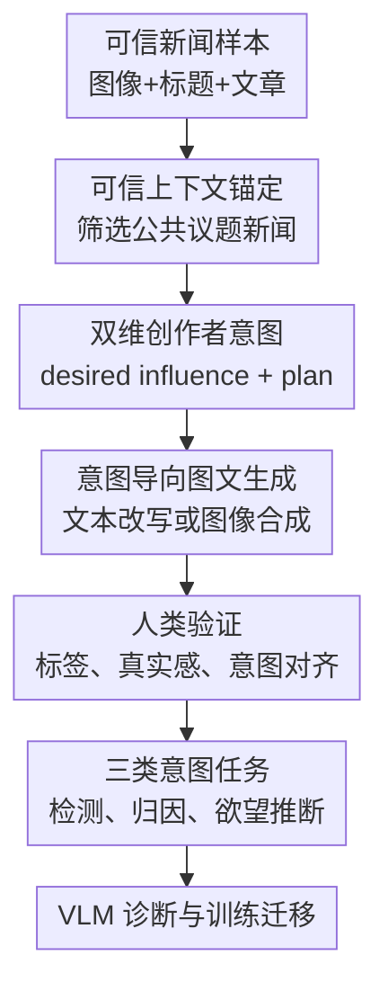

# Seeing Through Deception: Uncovering Misleading Creator Intent in Multimodal News with Vision-Language Models

**会议**: ICLR 2026  
**OpenReview**: [https://openreview.net/forum?id=02NbD16OnA](https://openreview.net/forum?id=02NbD16OnA)  
**代码**: https://github.com/jiayingwu19/DeceptionDecoded  
**领域**: 多模态VLM / 多模态虚假信息检测  
**关键词**: 多模态虚假信息检测, 创作者意图, 视觉语言模型, 新闻可信性, 合成 benchmark  

## 一句话总结
本文提出 DECEPTIONDECODED：一个以可信新闻上下文为锚、显式模拟误导性创作者意图的大规模多模态新闻 benchmark，用 12,000 个图文样本诊断 VLM 对“表面一致但意图误导”内容的脆弱性，并证明用这类数据微调能迁移提升通用多模态虚假信息检测。

## 研究背景与动机
**领域现状**：多模态虚假信息检测（MMD）过去主要盯着图文是否匹配。典型任务包括 out-of-context 检测，即把某张真实图片配到错误事件上；也包括多媒体篡改检测，即检查图片或文本里是否有局部伪造。随着 GPT-4o、Claude、Gemini、Qwen2.5-VL 等 VLM 进入事实核查流程，研究也开始让模型结合图像、标题和外部证据来判断新闻是否可信。

**现有痛点**：真实新闻里的误导不一定表现为明显的图文冲突。一个创作者可以保留图像和标题的局部语义一致性，却在标题中加入“秘密核试验导致冰山崩塌”这类没有证据支撑的叙事；也可以让图片看起来专业、让标题听起来客观，但整体暗示某种恐慌、阴谋或社会对立。现有 benchmark 常用 CLIP 相似度错配、情绪替换或单模态文本意图推断来造样本，容易把问题简化为表层不一致，无法刻画创作者主动设计叙事的过程。

**核心矛盾**：多模态误导的关键证据往往不在“图片和标题是否相似”，而在“图文共同暗示的结论是否被可信上下文支持”。如果 benchmark 没有明确的创作者意图标签，标注者只能从读者视角事后猜测意图；如果没有可信参考文章，模型又很难区分合理概括、风格化表达和无依据的误导性暗示。

**本文目标**：作者要解决三个相互关联的问题：第一，构造一个能显式标注创作者误导意图的大规模多模态新闻数据集；第二，评估当前 VLM 是否能识别误导意图、归因误导来源并推断创作者想影响的社会层面；第三，验证这种意图导向数据不仅能做诊断 benchmark，也能作为训练数据提升真实 MMD 数据集上的鲁棒性。

**切入角度**：论文从战略传播理论出发，把创作者意图拆成 desired influence 和 execution plan。前者描述创作者想影响什么社会维度，例如公共健康、政治极化或情绪操纵；后者描述创作者准备怎样修改图像或文字来达成这种影响。这样一来，误导样本不是“随机错配出来的假新闻”，而是围绕一个明确传播目标生成的图文新闻。

**核心 idea**：用“可信新闻上下文 + 显式创作者意图 + 受控图文改写”替代传统的启发式图文错配，从而把多模态虚假信息检测推进到 implication-level intent reasoning。

## 方法详解

### 整体框架
DECEPTIONDECODED 的核心不是提出一个新检测模型，而是提出一个可以系统产生和评测误导性多模态新闻的框架。输入是一条来自 VisualNews 的可信新闻样本 $N=\{I,T,A\}$，其中 $I$ 是新闻图片，$T$ 是原始 caption，$A$ 是可信参考文章；框架先筛选高质量公共议题新闻，再为创作者设定意图，最后分别改写文本或生成图像，形成带有明确误导标签、来源标签和欲望标签的 benchmark。

整个流程可以理解为从“真实可信报道”出发，沿两条分支模拟新闻创作者：可信创作者只做忠实转述，恶意创作者则根据预设 desired influence 和 execution plan 操纵图像或文字。生成后的数据再经过人工验证，并被组织成三个任务：误导意图检测、误导来源归因、创作者欲望推断。

### 关键设计
**1. 可信上下文锚定：把误导定义建立在“是否扭曲原新闻含义”上**

论文先从 VisualNews 中选择 2,000 条可信多模态新闻，每条都包含图片、caption 和对应参考文章。这个步骤看似只是数据过滤，其实决定了整个 benchmark 的判定基础：模型不是只看图文是否像真的，而是要判断图文新闻是否相对于可信新闻上下文 $A$ 引入了无依据的暗示。比如一张冰山图片和“南极冰山断裂”的 caption 本身可以匹配，但如果 caption 把断裂归因于秘密军事核试验，而参考文章只讲科学观测，那么误导就来自对事件含义的扭曲。

为了避免数据源本身带来歧义，作者用新闻专业性和公共治理需求作为筛选标准：样本要有公共利益、语气专业、表达中立、避免具体可识别个人、内容清晰。最终数据覆盖 politics、disaster、public health、environment 等十个高影响主题。这让后续“误导意图”不只是文本风格变化，而是围绕真实公共议题的传播风险。

**2. 双维创作者意图：把“想造成什么影响”和“打算怎么做”拆开标注**

论文把 creator intent 记为 $C_{int}$，由 desired influence 和 execution plan 两部分组成。Desired influence 是创作者想影响的社会维度，可从政治极化、公共健康与安全、经济误导、心理情绪操纵等八类中选择最多三类；execution plan 则是开放文本，说明创作者具体会怎样设计图像或文字。例如，同一场交通事故报道可以被设定为“引发公众恐慌”，执行计划可能是把普通货车起火写成恐怖袭击，或在图像里加入混乱、受伤人群和压倒性救援场面。

这个拆分的好处是把“意图”从一个事后猜测的抽象标签变成生成过程中的控制变量。传统数据集里，标注者往往只能判断读者是否感到误导；这里的误导来自创作者在生成前就被设定的目标，因此 benchmark 能同时支持二分类检测、误导来源归因和创作者欲望推断。换句话说，模型要学的不只是“这条新闻假不假”，还要学“哪里在误导、它想把读者推向什么解释”。

**3. 意图导向图文生成：分别模拟文本误导、视觉误导和非误导报道**

在每条可信新闻上，框架生成文本修改样本 $N_{text}=\{I,T',A\}$ 和图像修改样本 $N_{image}=\{I',T,A\}$。文本分支用 GPT-4o 在保留原图的情况下生成新的 caption；图像分支先让 GPT-4o 生成符合意图的视觉修改描述，再用 FLUX.1 [dev] 合成图片。误导样本进一步分为 subtle 和 significant 两级：subtle 只轻微改变背景、语气或框架，significant 则明显改变事件含义；非误导样本则要求忠实改写 caption 或重建图片，保持与参考文章一致。

这种设计刻意覆盖了真实 misinformation 的困难点。很多误导并不是“图片完全不相关”，而是图像、标题和事件主题都似乎吻合，但多出一个未经证实的解释或情绪框架。DECEPTIONDECODED 用同一条可信新闻生成六类细粒度变体，最终得到 12,000 个实例，既能比较文本误导和图像误导，也能比较 subtle 与 significant 的难度差异。

**4. 意图中心任务与诊断实验：把 VLM 的捷径行为暴露出来**

数据集支持三项任务：Task 1 判断样本是否包含误导性创作者意图；Task 2 判断误导源来自 image、text 还是不存在；Task 3 从预设社会影响维度中推断创作者 desired influence。前两项用准确率评估，第三项用 F1 评估。作者还设计了两种推理范式：implication-oriented 直接问图文是否传达了偏置或操纵性含义；consistency-oriented 则要求模型比较图像、caption 和参考文章之间是否存在不被支持的差异。

诊断实验进一步测试 VLM 是否依赖表面线索。作者会只给 image+caption 或 text+article，观察模型是否被图文内部一致性掩盖；也会把误导 caption 从专业新闻语气改成更明显的煽动语气，测试模型是否把“写得可信”误认为“内容可信”；还会在 prompt 前加入 trusting 或 skeptical hint，测试模型是否受无根据的真实性提示左右。这些实验共同服务于一个目标：不是只给模型排名，而是解释它们为什么在意图推理上脆弱。

### 一个完整示例
以论文中的南极冰山例子为例，可信上下文只是介绍 Halley Bay 科学基地和相关观测，原始 caption 可以是“Tabular icebergs in Antarctica”。如果可信创作者报道，它可能把 caption 忠实改写为“Flat-topped icebergs in Antarctica”，图像和文本都没有引入额外因果叙事。

恶意创作者的 desired influence 可能是制造对秘密军事活动的恐惧和怀疑，execution plan 则是把自然或科学现象解释成隐蔽核试验造成的环境破坏。于是文本分支生成“Massive icebergs breaking apart due to secret underwater nuclear tests in Antarctica”这样的 caption。它和图片在表面上仍都指向“冰山”，所以 image-text alignment 并不差；真正的问题是 caption 引入了可信文章不支持的因果解释。

一个合格检测模型需要做三步：先读出图文共同暗示“冰山断裂由秘密核试验导致”；再对照参考文章，发现该因果说法没有依据；最后判断误导来源是文本，desired influence 更接近 geopolitical / environmental distrust 或 psychological manipulation。这正是论文所谓 implication-level intent reasoning。

### 损失函数 / 训练策略
论文主体不提出新的训练损失，而是把 DECEPTIONDECODED 作为评测与训练数据。评测时，VLM 在固定 prompt 下输出 JSON 格式预测，温度设为 0，以减少采样噪声。默认设置采用 consistency-oriented prompt，即要求模型比较图像、caption 与可信参考文章的一致性。

在迁移实验中，作者用 6,000 个 DECEPTIONDECODED 样本对 LLaVA-v1.6-7B 和 Qwen2.5-VL-7B 做 full fine-tuning。训练任务是二分类：给定图像和 caption，回答该图文内容是否包含 misinformation。训练采用 answer-only supervision，prompt token 被 mask，只在最终 Yes/No 答案上计算损失；每个模型训练 1 epoch，有效 batch size 为 32，学习率为 $1\times 10^{-5}$，使用 bf16 mixed precision。这个设置的目的不是榨干模型性能，而是验证意图导向数据能否让模型学到可迁移的误导检测边界。

## 实验关键数据

### 主实验
第一组主结果来自 DECEPTIONDECODED 上 14 个 VLM 的误导意图检测和来源归因。表中列出几个代表性模型在 consistency-oriented 设置下的平均检测准确率；括号里的结论是：文本误导明显比视觉误导更容易，强模型也远未解决 intent reasoning。

| 模型 | 文本误导 Avg. Acc. | 图像误导 Avg. Acc. | 主要现象 |
|------|-------------------|-------------------|----------|
| Gemini-2.5-Pro | 85.7 | 69.2 | 整体最强之一，但图像误导仍掉到 70% 以下 |
| o4-mini | 85.0 | 63.8 | 文本端强，视觉端对 subtle manipulation 不稳 |
| Claude-3.7-Sonnet | 82.6 | 67.8 | 大模型仍难以稳定归因创作者意图 |
| GPT-4o | 83.4 | 66.3 | 对文本 significant 较强，对视觉 subtle 仍弱 |
| Qwen2.5-VL-72B | 75.5 | 53.2 | 开源大模型明显落后闭源强模型 |
| LLaVA-v1.6-7B | 33.3 | 33.3 | 基本退化为固定预测非误导 |

第二组主结果看 creator desire inference。这个任务要求模型不只判断有没有误导，还要推断创作者想影响的社会维度，因此比二分类更难。

| 模型 | 文本 M-Sub F1 | 文本 M-Sig F1 | 图像 M-Sub F1 | 图像 M-Sig F1 | 结论 |
|------|--------------|--------------|---------------|---------------|------|
| Gemini-1.5-Pro | 68.5 | 81.9 | 46.6 | 63.6 | 欲望推断最强之一，但图像端仍低 |
| Claude-3.7-Sonnet | 61.1 | 82.6 | 44.7 | 65.4 | significant 比 subtle 容易很多 |
| GPT-4o | 57.0 | 75.9 | 39.9 | 55.4 | 能识别部分意图，但社会影响标签不稳定 |
| Qwen2.5-VL-72B | 44.1 | 74.0 | 24.6 | 37.6 | 对视觉意图尤其困难 |
| GPT-4o-mini | 0.8 | 3.2 | 1.7 | 2.6 | 小模型几乎无法做欲望推断 |

### 消融实验
论文没有做传统“去掉模块 A”的模型消融，而是用输入模态、提示风格和训练迁移来分析 VLM 的脆弱性。下面汇总最能说明机制的几组实验。

| 分析设置 | 代表结果 | 说明 |
|----------|----------|------|
| Partial modality：GPT-4o 文本 M-Sig | I+T 51.6 / T+A 88.4 / Full 93.3 | 强模型能利用参考文章，完整三模态最好 |
| Partial modality：GPT-4o-mini 文本 M-Sig | I+T 10.2 / T+A 64.4 / Full 45.9 | 加入图像后反而被图文内部一致性干扰 |
| Prompt hint：GPT-4o 全误导样本 | Original 71.1 / Helpful 87.6 / Adversarial 29.3 | 无根据提示会大幅改变判断，说明模型受 prompt framing 影响 |
| Prompt hint：Qwen2.5-VL-32B 全非误导样本 | Original 95.9 / Helpful 99.6 / Adversarial 3.4 | 小模型尤其容易把 hint 当成答案方向 |
| 训练迁移：Qwen2.5-VL-7B | MMFakeBench 27.96 → 58.66 | 用意图数据微调后通用 MMD 明显提升 |
| 训练迁移：LLaVA-v1.6-7B | FakeNewsNet 43.73 → 65.22 | DECEPTIONDECODED 学到的信号能迁移到真实数据 |

### 关键发现
- Consistency-oriented 推理整体优于 implication-oriented 推理，因为多数误导样本仍然可以通过“图文新闻相对于可信文章是否引入无依据暗示”来抓到证据。
- 视觉误导比文本误导更难，尤其是 subtle image manipulation。人类验证中图像样本准确率和一致性也低于文本样本，说明视觉意图本身更含混。
- VLM 容易被表面一致性误导。对于小模型，image+caption 看起来越一致，反而越可能遮蔽 caption 或 image 相对于参考文章的关键不一致。
- 语言风格会影响真实性判断。专业、权威、新闻腔的误导 caption 更容易骗过模型，说明模型仍把 stylistic polish 当成可信线索。
- DECEPTIONDECODED 不只是 benchmark。用 6,000 个样本微调后，LLaVA 和 Qwen 在 MMFakeBench、Fakeddit、FakeNewsNet 上都有明显 Macro-F1 提升，支持“创作者意图数据能提升通用 MMD”的主张。

## 亮点与洞察
- 这篇论文最好的地方是把“创作者意图”从模糊伦理概念落到可控数据生成变量上。Desired influence 和 execution plan 的拆分让 benchmark 可以同时评测检测、归因和意图解释，而不是只做真假二分类。
- 可信参考文章 $A$ 是关键锚点。没有它，很多 subtle manipulation 会变成“各人理解不同”；有了它，误导可以被定义为图文新闻引入了参考上下文不支持的含义。
- 论文对 VLM 的失败分析比单纯排行榜更有价值。partial modality、style reframing 和 authenticity hint 三组实验共同说明：当前 VLM 不是完全不会看证据，而是经常在证据复杂时退回到最显眼、最省力的表层线索。
- 合成数据的用途被设计得比较克制。作者没有声称 synthetic benchmark 能覆盖全部真实 misinformation，而是展示其作为“意图推理训练信号”的迁移价值，这个定位更可信。
- 对其他任务也有启发。凡是需要判断“表面内容一致，但背后暗示是否被证据支持”的任务，例如广告合规、政治传播分析、多模态 fact-checking，都可以借鉴这种“上下文锚定 + 意图变量 + 受控生成”的数据构造方式。

## 局限与展望
- 最大局限是数据仍由生成模型合成。虽然作者做了人类验证，并且文本样本准确率 99.2%、图像样本准确率 89.2%，但生成样本的分布仍可能和真实恶意传播者不同，尤其缺少平台传播链、评论反馈和用户行为。
- Creator desire inference 仍是封闭标签任务。真实意图往往不是八类社会影响的简单组合，也可能混合商业利益、组织动员和身份认同叙事；未来可以探索开放式意图描述与 LLM-as-a-Judge 评估。
- 图像生成质量会改变检测难度。论文发现 GPT-image-1 生成图像有时让意图线索更清晰，但图像编辑模型如 Nano Banana 的局部改动反而更难检测。这说明未来 benchmark 需要持续跟随图像生成和编辑技术演进。
- 安全风险需要认真处理。框架本身能生成误导性新闻样本，因此作者选择不公开最终生成 prompt，并限制数据访问给验证研究者。后续如果社区复现，应继续保持这种最小披露原则。
- 评测仍主要依赖单轮静态输入。现实中的 misinformation governance 还需要结合溯源、检索、多轮澄清、用户画像和传播网络，单条图文新闻只是完整治理链条中的一个环节。

## 相关工作与启发
- **vs NewsCLIPpings / OOC 检测**: NewsCLIPpings 主要通过图文错配构造 out-of-context misinformation，核心考察图像和文本是否来自同一事件。DECEPTIONDECODED 更进一步，即使图文表面一致，也要求模型判断它们相对于可信文章是否引入误导性叙事。
- **vs DGM4 / MMFakeBench**: 这些 benchmark 关注多媒体篡改或混合来源虚假信息，适合评测模型对伪造内容的泛化能力。本文关注的是创作者传播意图，强调“为什么这个修改会误导读者”，因此更偏向语义和社会影响层面的检测。
- **vs EMU / NewsINT / MRF**: 这些工作已经开始讨论 intent 或 reader reaction，但多为单模态或读者感知视角。DECEPTIONDECODED 的区别是 creator-produced intent：意图在生成前被明确设定，并且绑定到图文新闻和可信上下文。
- **vs retrieval-augmented multimodal fact-checking**: RAGAR、DEFAME 等方法用检索证据增强事实核查。本文没有提出新的 RAG 框架，而是提供一个可以测试“有参考证据时模型是否真正用证据推理”的 benchmark，两者可以互补。

## 评分
- 新颖性: ⭐⭐⭐⭐☆ 把创作者意图显式纳入多模态 misinformation benchmark 很有辨识度，理论拆分和数据构造也比较完整。
- 实验充分度: ⭐⭐⭐⭐⭐ 评测 14 个 VLM，覆盖检测、归因、欲望推断、提示偏差、模态消融、风格重写和迁移微调，诊断维度丰富。
- 写作质量: ⭐⭐⭐⭐☆ 主线清楚，图例直观；少数表格编号和跨 appendix 细节略多，读者需要来回对照。
- 价值: ⭐⭐⭐⭐⭐ 对多模态 fact-checking、VLM 安全评测和 misinformation governance 都有直接价值，尤其适合作为意图推理能力的诊断数据源。

<!-- RELATED:START -->

## 相关论文

- [\[ICML 2026\] Are VLMs Seeing or Just Saying? Uncovering the Illusion of Visual Re-examination](../../ICML2026/multimodal_vlm/are_vlms_seeing_or_just_saying_uncovering_the_illusion_of_visual_re-examination.md)
- [\[ACL 2026\] When Seeing Overrides Knowing: Disentangling Knowledge Conflicts in Vision-Language Models](../../ACL2026/multimodal_vlm/when_seeing_overrides_knowing_disentangling_knowledge_conflicts_in_vision-langua.md)
- [\[AAAI 2026\] Seeing Justice Clearly: Handwritten Legal Document Translation with OCR and Vision-Language Models](../../AAAI2026/multimodal_vlm/seeing_justice_clearly_handwritten_legal_document_translation_with_ocr_and_visio.md)
- [\[ICLR 2026\] Post-hoc Probabilistic Vision-Language Models](post-hoc_probabilistic_vision-language_models.md)
- [\[CVPR 2026\] Seeing Through Touch: Tactile-Driven Visual Localization of Material Regions](../../CVPR2026/multimodal_vlm/seeing_through_touch_tactile_localization.md)

<!-- RELATED:END -->
