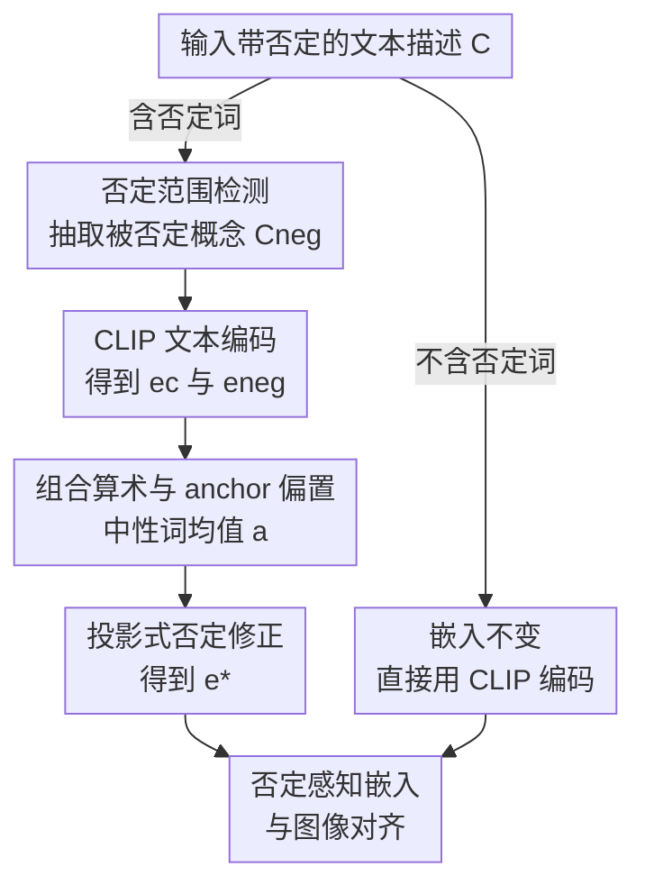

# Seeing What's Not There: Negation Understanding Needs More Than Training

**会议**: ICLR 2026  
**OpenReview**: [https://openreview.net/forum?id=Dd86hsSam5](https://openreview.net/forum?id=Dd86hsSam5)  
**代码**: 无  
**领域**: 多模态VLM  
**关键词**: 否定理解, CLIP, 训练无关, 嵌入修正, 组合性

## 一句话总结
针对 CLIP 类视觉语言模型读不懂"否定"的顽疾，本文提出一个完全免训练的零样本方法：用规则抽出句子里被否定的概念，再在文本嵌入空间里用投影减去这部分语义并补回一个 anchor 偏置，使得原始 CLIP 在 NegBench MCQ 上从 25.5% 直接拉到 67.0%，反超那些专门在否定数据集上微调过的模型。

## 研究背景与动机

**领域现状**：CLIP 这类联合嵌入式 VLM 通过对比学习把图文对齐到同一空间，已经撑起了文生图、跨模态检索、图像描述、指代分割等一大批下游任务。

**现有痛点**：这些模型几乎读不懂否定。给扩散模型输入"a photo of a car with tires"和"a photo of a car without tires"，生成结果几乎一样、都带轮胎。模型倾向于直接忽略"no/not/without"这类否定词，被称为"肯定偏置"（Affirmation Bias）。而否定在很多实际场景里至关重要——比如自动驾驶里"找一个没有车的停车位"，模型必须分清"存在"和"不存在"。

**核心矛盾**：这个缺陷的根源在训练数据与训练范式两端。一方面网络规模图文对里否定描述严重不足（Laion-400M 中带否定的描述不到 1%），且即便有也往往和图像对不上否定语境；另一方面对比学习鼓励模型把文本当成"词袋"，天然丢掉了组合性。于是社区主流做法是**数据驱动**——造带 hard-negative 的新数据集再微调。但本文指出，单纯堆数据微调有个隐藏代价：模型会**灾难性遗忘**基础知识，在 ImageNet、Oxford Pets 等通用零样本分类上明显掉点、类间混淆加剧。

**本文目标**：在不牺牲通用能力、不做任何训练的前提下，让 CLIP 正确处理否定。

**切入角度**：作者提出一个尖锐的问题——"真的需要在 hard-negative 数据集上微调才能教会模型否定吗？"他们观察到 CLIP 文本嵌入近似满足组合算术（"King−Man+Woman≈Queen"那种线性规律），而否定在嵌入空间里表现为一个**方向性偏移**。既然如此，否定理解就可以在嵌入空间里直接"算"出来，而非"训"出来。

**核心 idea**：对带否定的文本嵌入做一次**事后（post-hoc）修正**——把被否定概念的语义从原嵌入里投影减掉，再补回一个中性 anchor 偏置，得到"否定感知"的嵌入，整个过程零样本、免训练。

## 方法详解

### 整体框架

方法本身是一个轻量的推理时旁路：给定一条文本描述，先判断里面有没有否定词；没有就原封不动用 CLIP 编码，有就进入修正分支——用规则抽出"被否定的那部分概念"$C_{neg}$，分别编码原句和否定概念得到 $e_c$ 与 $e_{neg}$，再用一个投影式公式把 $e_{neg}$ 在 $e_c$ 上的分量减掉、补回 anchor 偏置 $a$，输出修正后的嵌入 $e^*$ 去和图像对齐。整条链路不碰模型权重，只改文本侧的嵌入向量。

### 关键设计

**1. 组合算术规律与 anchor 偏置：让"减语义"在嵌入空间里成立**

这是整套方法的地基。作者先验证 CLIP 文本嵌入近似满足加法组合：取"Cat"和"Flower"的嵌入 $e_c$、$e_f$，与合成句"Cat and Flower"的嵌入 $e_{cf}$ 对比，发现 $e_c+e_f$ 与 $e_{cf}$ 的余弦相似度高达 0.86，说明语义信息可以直接相加。但反向做减法时出了问题：直觉上 $e_{cf}-e_f$ 应该约等于 $e_c$，实测却相差很远（相似度只有 −0.33）。作者推断文本嵌入里带有一种**非信息性的公共偏置**，把嵌入推到空间中"正确的区域"，而减法会把这个公共偏置一起减掉，导致结果跑偏。解法是减完之后再把偏置补回来——用一个 anchor 嵌入 $a$。$a$ 不依赖具体数据集，直接取若干中性词（"neutral"、"balanced"等）CLIP 嵌入的均值即可，既廉价又通用。补回后 $e_{cf}-e_f+a$ 与目标 $e_c$ 的相似度回升到 0.83。这条规律就把"否定 = 在嵌入里减掉被否定语义"从一个想法变成了可执行的操作。

**2. 基于规则的否定范围检测：精确圈出"被否定的是哪段"**

要减掉语义，先得知道句子里到底哪部分被否定了。作者设计了一个基于规则的否定范围（negation scope）检测算法，维护一个覆盖面较广的否定词表：显式否定词（never/no/nothing/nowhere/none/not）、缺失指示词（absence/empty/devoid/lacks/absent）和缩写形式（n't/haven't/can't 等）。检测时顺序扫描文本，遇到否定词就根据其类型确定作用范围：**前向否定词**（pre-negator，如"empty"、"devoid"后接介词"of"）从否定词开始往后、直到标点或连词等子句边界为止；**后向否定词**（post-negator，如"absent"、"nowhere"前接系动词 is/are）则向前回溯到子句边界。范围内的词序列即被否定概念 $C_{neg}$。若整句没有任何否定词，则跳过修正、嵌入保持不变。这一步是纯 NLP 规则、不需要任何学习，但作者也坦承它是全系统最脆的一环——遇到长距离依赖、隐式否定（如"few people"）或多重否定时会失效。

**3. 投影式否定修正公式：只减"原嵌入里真有的那部分"否定语义**

有了 $e_c$（原句嵌入）、$e_{neg}$（被否定概念嵌入）和 anchor $a$，最朴素的写法是 $e^* = e_c - e_{neg} + a$（公式 1）。它确实有效，但作者认为不够好：CLIP 未必完全忽略否定、可能只是没删干净；而 NegCLIP 这类微调过的模型又可能已经删掉了一部分否定语义；况且 CLIP 嵌入语义稠密、$e_{neg}$ 里包含大量相关概念，不该无脑整个减掉。因此正确做法是**先估计 $e_{neg}$ 中究竟有多少已经存在于 $e_c$ 里，只减这部分**。这正是向量投影：

$$e^* = e_c - \lambda \left( \frac{\langle e_c, e_{neg}\rangle}{\langle e_{neg}, e_{neg}\rangle} e_{neg} - a \right)$$

其中 $\frac{\langle e_c, e_{neg}\rangle}{\langle e_{neg}, e_{neg}\rangle} e_{neg}$ 是 $e_c$ 在 $e_{neg}$ 方向上的投影，代表两者的公共语义、也即需要被剔除的"方向性偏移"；$\lambda$ 是一个控制修正力度的超参，用 5% 的 COCO-MCQ 划分来调。$\lambda$ 的取值很有解释性：原始 CLIP 因为几乎没分开否定，需要大幅修正（最优 $\lambda\approx1.9$）；而 NegCLIP* 已经微调过、否定簇本就分离，只需微调（最优 $\lambda\approx0.3$）。

### 一个例子：A photo of a cat but not flower

以"A photo of a cat but not flower"为例走一遍：① 规则检测发现否定词"not"，且为前向作用，向后圈到子句边界，抽出 $C_{neg}=$"flower"；② CLIP 分别编码整句得 $e_c$、编码"flower"得 $e_{neg}$；③ 取"neutral/balanced"等中性词均值得到 anchor $a$；④ 代入公式 2，把 $e_c$ 在 $e_{neg}$ 上的投影按 $\lambda$ 减掉、补回 $a$，得到 $e^*$；⑤ 用 $e^*$ 与图像对齐——此时模型不再把这句话和"a cat and flower"混为一谈，生成/检索结果里不会再出现 flower。

## 实验关键数据

### 主实验

主基准是 NegBench（基于 COCO/VOC2007/MSR-VTT，含 79k 样本、18 类任务变体），两大任务为 MCQ-Neg（从相近描述里选对的）和 Retrieval-Neg（按含正负描述的提示检索图像），统一用 ViT-B/32 骨干。

| 模型 | COCO-MCQ | VOC2007-MCQ | MSRvtt-MCQ | COCO R-Neg@5 | MSRvtt R-Neg@5 |
|------|----------|-------------|------------|--------------|----------------|
| CLIP（基线） | 24.7 | 24.3 | 27.5 | 57.3 | 44.5 |
| Ours + CLIP | **72.5** (↑47.8) | **78.6** (↑54.3) | 50.0 (↑22.5) | 63.2 (↑5.9) | 49.0 (↑5.5) |
| NegCLIP*（微调） | 56.2 | 59.7 | 46.2 | 67.0 | 51.5 |
| Ours + NegCLIP | 69.5 (↑13.3) | 75.1 (↑15.4) | **54.1** (↑7.9) | **67.9** (↑0.9) | **52.2** (↑0.7) |

最亮眼的一点：免训练修正后的原始 CLIP（72.5%）反超了在 CC12M-NegFull 上专门微调的 CLIP*/NegCLIP*。由于方法只改带否定词的描述嵌入，正向检索 R@5 与基线完全一致、不损通用能力。摘要中给出的总览数字为 NegBench MCQ 从 25.5%→67.0%、检索从 50.9%→56.1%。

### 跨骨干与跨数据集泛化

| 骨干 | COCO-MCQ | +Ours |
|------|----------|-------|
| SigLIP | 28.9 | 61.15 (↑32.25) |
| SigLIP2 | 27.2 | 66.3 (↑39.1) |
| AlignCLIP | 32.7 | 60.1 (↑27.4) |
| TripletCLIP | 33.8 | 61.8 (↑28.0) |

在 SigLIP/SigLIP2/AlignCLIP/TripletCLIP 上一致提升，说明方法不挑架构和训练范式。跨数据集上：VALSE-Existence 上 CLIP 71.0%→79.5%；人工标注的 Flickr30K 子集上 R@5 67.4%→70.4%、R@1 34.0%→41.3%，证明对真实人工描述同样有效。

### 分析与消融

- **图文对齐分数**（COCO NegBench-MCQ，表 5）：CLIP 对否定描述的对齐分仅 0.16，本文修正后升到 0.64；连肯定描述也从 0.45 升到 0.65（因为减少了对否定句的误判混淆）。
- **CIFAR10 干扰项测试**（表 6）：用"This is not a photo of {class}"作干扰，原始 CLIP 仍把否定描述当成 89.8% 命中（几乎完全没推开），Ours+CLIP 降到 10.2%、接近随机，说明真正把否定语义推离了图像。
- **修正公式消融**（图 7）：投影式公式 2 优于朴素的公式 1，去掉 anchor 项 $a$ 会掉点；$\lambda$ 最优值 CLIP 为 1.9、NegCLIP* 为 0.3，与"基线需大修、微调模型只需微调"的直觉一致。
- **嵌入空间可视化**（图 6）：修正后肯定/否定样本沿一条清晰的"否定轴"分开，且保持原有的类别结构；连双重否定、混合描述（"a cat and not a flower"）也被组织成语义可解释的簇。

## 局限性

作者明确指出两点局限。其一是**否定抽取的句法脆弱性**——规则法在长距离依赖、隐式否定（如量词"few people"）、多重否定或复杂连词造成的范围歧义上会失效；但强调这是抽取步骤的瓶颈，而非核心向量算术的缺陷，未来可接一个轻量序列标注模型（如微调 DistilBERT）来增强范围检测、同时保留零样本主干。其二是**现有基准过于简单**——NegBench/VALSE/CC-Neg 主要测单物体的显式否定，本文方法之所以如此奏效，恰说明这些基准本质只在考"显式标记概念的解耦"；要真正检验 VLM 的逻辑推理，未来基准需纳入双重否定、隐式否定等复杂逻辑结构。

## 个人评价

这篇工作的价值不在于刷了多高的分，而在于它用一个极简、可解释的免训练方法，正面挑战了"否定理解必须靠堆数据微调"的主流假设，并漂亮地证伪——一次嵌入投影修正就反超了大规模微调，还顺带避开了灾难性遗忘。把否定从"训练问题"重新框定为"嵌入空间的几何/算术问题"是很有启发性的视角，公式 2 用投影只减"真有的那部分"也比朴素相减更讲道理。短板同样明显：整套方法的上限被那个规则式否定抽取卡住，一旦句法复杂就退化；评测也停留在相对简单的显式否定基准上。作者在结论里给出的方向——把这种组合性约束作为正则项融进对比学习训练——或许才是把"算"和"训"结合起来的更长远路径。

<!-- RELATED:START -->

## 相关论文

- [\[CVPR 2025\] Vision-Language Models Do Not Understand Negation](../../CVPR2025/multimodal_vlm/vision-language_models_do_not_understand_negation.md)
- [\[CVPR 2026\] More than the Sum: Panorama-Language Models for Adverse Omni-Scenes](../../CVPR2026/multimodal_vlm/more_than_the_sum_panorama-language_models_for_adverse_omni-scenes.md)
- [\[ACL 2025\] Exploring How Generative MLLMs Perceive More Than CLIP with the Same Vision Encoder](../../ACL2025/multimodal_vlm/exploring_how_generative_mllms_perceive_more.md)
- [\[ICLR 2026\] RL Makes MLLMs See Better Than SFT](rl_makes_mllms_see_better_than_sft.md)
- [\[ACL 2026\] "I See What You Did There": Can Large Vision-Language Models Understand Multimodal Puns?](../../ACL2026/multimodal_vlm/i_see_what_you_did_there_can_large_vision-language_models_understand_multimodal_.md)

<!-- RELATED:END -->
