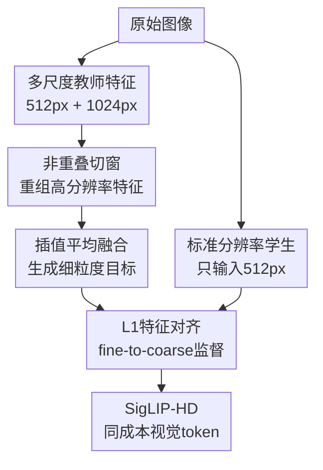

# SigLIP-HD by Fine-to-Coarse Supervision

**会议**: ICLR2026  
**OpenReview**: [https://openreview.net/forum?id=XeLrfKEOZS](https://openreview.net/forum?id=XeLrfKEOZS)  
**论文**: [OpenReview](https://openreview.net/forum?id=XeLrfKEOZS)  
**代码**: https://github.com/LiheYoung/SigLIP-HD  
**领域**: 多模态VLM  
**关键词**: 高分辨率视觉表征, SigLIP 2, 多模态大模型, OCR感知, 特征蒸馏  

## 一句话总结
SigLIP-HD 用冻结 SigLIP 2 在多尺度图像上产生的细粒度教师特征，监督同架构学生模型只看 $512^2$ 图像也学到更清晰的视觉 token，从而在不增加推理成本的前提下提升 MLLM 的 OCR、图表和细节感知能力。

## 研究背景与动机
**领域现状**：多模态大模型通常把图像先交给一个视觉编码器，再把视觉 token 接入 LLM。视觉 token 的质量直接决定模型能否读清文字、理解图表、识别小物体和处理高密度页面。因此，近年的 MLLM 一直在沿着三条路线增强视觉表征：重新预训练更强的视觉编码器，组合多个已有编码器，或者直接把输入图像分辨率拉高。

**现有痛点**：第一条路线代价极高，需要海量数据和 GPU 小时；第二条路线看似能汇合 CLIP、DINO 等模型的优势，但不同 encoder 的 token 空间并不好融合，实际收益经常有限；第三条路线最直接，也最符合 OCR 与文档理解的经验，但会带来多次切块前向、更多视觉 token、resampler 或 pixel unshuffle 等后处理模块，系统复杂度和 LLM 负担都会上升。

**核心矛盾**：高分辨率输入确实能提供更细的局部信息，可是它把“看得更清楚”绑定到了“推理时更贵”。作者反过来问了一个更节制的问题：在把图像扩大到 native resolution 之前，现有中等分辨率视觉编码器的感知潜力是否已经被完全释放？如果人类在 $512$ 像素左右的缩略图上仍能理解很多文字和内容，那么模型是否也能在同样预算下学到更细的表征？

**本文目标**：论文希望得到一个可直接替换原 SigLIP 2 checkpoint 的视觉编码器。它在推理时仍然只输入 $512^2$ 图像，仍然输出相同数量和维度的视觉 token，不增加任何 projection、upsampler 或额外切块流程，但 token 本身要更接近高分辨率多尺度输入带来的细粒度表示。

**切入角度**：作者观察到，高分辨率多尺度前向可以生成更好的视觉特征，但这种做法昂贵且不适合作为常规推理路径。于是他们把它从“推理方案”改造成“训练监督信号”：用冻结的原始 SigLIP 2 在 $512^2$ 与 $1024^2$ 图像上产生教师特征，再让一个结构完全相同的学生编码器只看 $512^2$ 图像去拟合这些更细的特征。

**核心 idea**：把多尺度高分辨率视觉特征蒸馏回标准分辨率编码器，用 fine-to-coarse supervision 让低成本视觉 token 尽量拥有高分辨率 token 的细节感知能力。

## 方法详解

### 整体框架
SigLIP-HD 的训练框架很简单：教师分支冻结原始 SigLIP 2，对同一张图像构造 $512^2$ 基础尺度和 $1024^2$ 高分辨率尺度，融合成细粒度目标特征；学生分支初始化为同一个 SigLIP 2，只输入 $512^2$ 图像，并在 patch/token 级别对齐教师目标。训练完成后只保留学生分支，因此推理接口、token 数量、模型结构和原 SigLIP 2 一致。

这套方法的关键不是新建一个复杂模块，而是把昂贵的高分辨率多尺度感知变成离线训练时的“老师”。教师在训练阶段可以多看几次、多处理几个尺度；学生在部署阶段仍然只做一次标准分辨率前向。这样既保留了高分辨率细节对表征的帮助，又避免把额外计算永久塞进 MLLM 推理链路。

### 关键设计
**1. 多尺度教师特征：用高分辨率细节补足标准分辨率 token 的监督信号**

论文首先回答“学生到底该学什么”。作者用 SigLIP 2-So400m/16-512px 做先导实验，比较单尺度与多尺度输入。基础尺度 $512^2$ 提供全局上下文，高分辨率 $1024^2$ 通过切块前向保留更多局部细节；如果只看高分辨率局部块，模型会丢掉全局图像关系，如果盲目继续加到 $1536^2$、$2048^2$，收益又会饱和甚至下降。因此最终教师默认使用两个尺度 $512^2+1024^2$，这是在细节收益和计算负担之间最干净的一档。

高分辨率图像并不是整图直接塞进预训练位置编码，而是按 $512^2$ 窗口做非重叠切分，再把窗口特征重组成更大的特征图。设基础尺度特征为 $F^b \in \mathbb{R}^{C \times H \times W}$，高分辨率重组特征为 $F^h \in \mathbb{R}^{C \times 2H \times 2W}$。这种教师特征保留了基础视图的全局内容，也把高分辨率视图里的文字边缘、图表局部和小目标线索带进监督目标。

**2. 插值平均融合：让教师目标保持和学生输出同形状同语义空间**

得到 $F^b$ 和 $F^h$ 后，作者没有用更复杂的 concat、pixel unshuffle 或投影头，而是先把 $F^h$ 双线性插值到 $H \times W$，再和 $F^b$ 直接平均，得到教师目标 $F^t$：

$$
F^t = \frac{1}{2}\left(F^b + \operatorname{Interp}(F^h)\right)
$$

这个选择看起来朴素，但它解决了一个很实际的问题：学生输出本来就是 $C \times H \times W$，如果教师目标也保持同样形状和通道维度，训练就不需要额外 projection head，也不会改变视觉 token 接入 LLM 的接口。实验里“interpolate + average”比“interpolate + concat”和“pixel unshuffle + concat”更好，说明对这篇论文的问题而言，保留同维度的集成特征比制造更宽的特征再让后续模块适配更可靠。

**3. 标准分辨率学生：只让同架构模型学习更强 token，而不是改推理系统**

学生分支初始化自同一个 SigLIP 2-So400m/16-512px，但它是可训练的，只输入 $512^2$ 图像并输出 $32^2$ 个视觉 token。也就是说，学生没有看到 $1024^2$ 图像本身，却被要求用低分辨率输入产生接近教师多尺度融合后的特征 $F^t$。论文把这种训练称为 fine-to-coarse supervision：从更细粒度的高分辨率表示监督更粗的标准分辨率表示。

这一点是 SigLIP-HD 的部署价值所在。很多高分辨率 MLLM 方法需要在推理阶段保留切块、拼接、压缩和更多 token；SigLIP-HD 则把成本前移到训练阶段。用户在已有 MLLM 中只需要把视觉 encoder checkpoint 从 SigLIP 2 换成 SigLIP-HD，图像预处理、token 数量、LLM 侧投影器和视觉指令微调流程都可以基本不变。

**4. 严格 L1 对齐：用最直接的 patch-level 特征回归压住细节偏差**

学生特征记为 $F^s$，训练目标就是让它在 patch/token 级别接近教师目标 $F^t$。作者比较了 cosine similarity、cosine similarity + smooth L1 和纯 L1，最终采用最简单也最严格的 L1 损失：

$$
\mathcal{L}_{\text{align}} = \left\|F^s - F^t\right\|_1
$$

在这篇论文的设定里，教师和学生来自同一个 SigLIP 2 语义空间，二者形状也完全一致，因此不需要用复杂的跨模型对齐损失去处理空间不一致问题。L1 的优势在于直接约束每个位置、每个通道的数值偏差，对 OCR 和图表这类依赖细粒度 patch 表征的任务更贴近目标；实验中它虽然只比其他 loss 略好，但配合无额外模块的设计，形成了很强的工程简洁性。

### 一个完整示例
假设训练集中有一张包含商品广告牌的小图，原始 SigLIP 2 在 $512^2$ 输入下能判断“这是广告牌”，但对品牌字母、标语拼写和局部字体细节不够稳定。教师分支会先用冻结 SigLIP 2 处理 $512^2$ 全图，得到全局布局和语义上下文；再把 $1024^2$ 图像切成若干个 $512^2$ 非重叠窗口，分别抽取局部特征，并重组成 $2H \times 2W$ 的高分辨率特征图。

随后，高分辨率特征被插值回 $H \times W$，与基础尺度特征平均，形成一个既知道整张广告牌位置、又更敏感于字母细节的教师目标。学生只看 $512^2$ 图像，输出自己的 $32^2$ token，并通过 L1 损失追近这个教师目标。训练很多这样的样本后，学生在推理时仍然只看 $512^2$ 图像，却更可能把 “HOKA” 读成正确拼写，而不是误读成 “HOOKA”。

### 损失函数 / 训练策略
训练数据来自 Cambrian-1 收集的 4.5M raw images，覆盖自然图像、场景文本、文档等多种场景。优化器使用 AdamW，初始学习率 $5 \times 10^{-5}$，weight decay 为 $0.04$，总 batch size 为 $512$，训练 $90K$ iterations，cosine 学习率调度并使用 $4K$ iterations warm-up。训练沿用 SigLIP 2 的图像预处理流程，只是在生成高分辨率教师图像时把尺寸从 $512$ 改为 $1024$。作者报告训练耗时约为 $32$ 张 A100 上 $34$ 小时，使用 BFloat16。

下游评估采用 LLaVA 系列两阶段流程，把 SigLIP-HD 作为视觉编码器接入 MLLM。主要设置中输入图像仍 resize 到 $512^2$，视觉编码器输出 $32^2$ 个 token；作者还测试了视觉 encoder 冻结/解冻、LLaVA-1.5/LLaVA-NeXT 数据、AnyRes 原生分辨率策略，以及不同 LLM 后端，来确认收益不是某个单一训练配置的偶然现象。

## 实验关键数据

### 主实验
论文最核心的对比是 SigLIP-HD 与原始 SigLIP 2-So400m/16-512px，在相同视觉 token 数和相同推理预算下接入 MLLM。下表摘取几个代表性设置，能看出收益主要集中在 OCR、图表和高分辨率细节相关任务，同时平均分也稳定上升。

| 设置 | 视觉编码器 | DocVQA | ChartQA | TextVQA | HRBench | Avg |
|------|------------|--------|---------|---------|---------|-----|
| LLaVA-1.5 SFT, freeze encoder | SigLIP 2 | 32.2 | 19.3 | 61.0 | 41.3 | 55.8 |
| LLaVA-1.5 SFT, freeze encoder | SigLIP-HD | 34.7 | 20.2 | 63.1 | 46.2 | 57.4 |
| LLaVA-NeXT SFT, unfreeze encoder | SigLIP 2 | 56.0 | 61.6 | 65.8 | 43.5 | 62.8 |
| LLaVA-NeXT SFT, unfreeze encoder | SigLIP-HD | 59.6 | 65.2 | 65.7 | 48.3 | 64.4 |

在 AnyRes 原生分辨率策略下，SigLIP-HD 也不是只能替代低成本路径，而是可以和高分辨率推理并存。使用 LLaVA-NeXT 数据并解冻视觉编码器时，SigLIP-HD 仍然优于 SigLIP 2。

| 推理策略 | 视觉编码器 | DocVQA | ChartQA | TextVQA | InfoVQA | AI2D | Avg |
|----------|------------|--------|---------|---------|---------|------|-----|
| AnyRes | SigLIP 2 | 67.6 | 63.9 | 66.9 | 27.2 | 65.8 | 64.8 |
| AnyRes | SigLIP-HD | 69.7 | 67.4 | 68.4 | 27.7 | 69.3 | 66.3 |

论文还在不同 LLM 上验证泛化。以 LLaVA-NeXT 数据、冻结视觉 encoder 为例，SigLIP-HD 在 Llama-3.2-3B 上把 ChartQA 从 $45.2$ 提到 $49.8$，DocVQA 从 $47.3$ 提到 $49.9$；在 Qwen2.5-7B 上也能把 DocVQA 从 $62.5$ 提到 $64.2$。这说明提升不是绑定 Vicuna-1.5 后端的偶然结果。

### 消融实验
| 配置 | 关键指标 | 说明 |
|------|----------|------|
| Cosine similarity loss | Avg 54.3 | 特征方向对齐有用，但对逐 patch 数值细节约束不如 L1 |
| Cosine sim + smooth L1 | Avg 54.2 | 组合损失没有带来额外收益，反而略低 |
| L1 loss | Avg 54.6 | 最终采用，简单且平均结果最好 |
| 1 scale teacher: $1024^2$ | Avg 50.7 | 只有高分辨率局部视图，缺少基础尺度全局信息，效果明显差 |
| 2 scales teacher: $512^2+1024^2$ | Avg 54.6 | 最佳配置，细节与全局兼顾 |
| 3 scales teacher: $512^2+1024^2+1536^2$ | Avg 54.0 | 更多尺度没有继续提升，还增加训练教师成本 |
| Base:high fusion weight 1:1 | Avg 57.4 | 默认平均融合最好 |
| Base:high fusion weight 1:2 | Avg 55.9 | 偏向高分辨率反而下降，说明全局基础视图不可替代 |
| Base:high fusion weight 2:1 | Avg 56.5 | 偏向基础视图也不如均衡平均 |

### 关键发现
- 高分辨率信息确实有价值，但最好的教师不是单独的高分辨率特征，而是基础尺度全局信息与 $2\times$ 高分辨率局部信息的融合。只用 $1024^2$ 监督会明显损失平均性能，说明“更细”不能替代“看全”。
- 非重叠 sliding window 是生成高分辨率教师特征的最佳实践。位置编码插值整图前向会损伤空间关系，半重叠窗口也可能因为 token 分布不一致或位置冲突而下降。
- OCR 与文档图表任务最受益，例如 LLaVA-NeXT 解冻设置下 DocVQA 和 ChartQA 都有 $+3.6$，HRBench 有 $+4.8$。这与论文目标一致：不是全面重写 MLLM 能力边界，而是让标准分辨率 token 更细、更稳。
- SigLIP-HD 在 AnyRes 中仍然提升，说明它不是 native-resolution 路线的替代品，而是一个更好的视觉 encoder 基座；当系统已经使用高分辨率切块时，更强的基础 encoder 仍然能带来增益。
- 在 OpenAI-CLIP-L/14-336px 上，作者也训练了 CLIP-HD。公平地给原 CLIP 多尺度输入后，CLIP-HD 仍把 DocVQA 从 $31.1$ 提到 $33.2$、平均分从 $54.3$ 提到 $55.1$，说明 fine-to-coarse supervision 不完全依赖 SigLIP 2。

## 亮点与洞察
- **把高分辨率从推理成本变成训练监督**：这篇论文最巧的地方是没有继续往 MLLM 推理链路里加切块和 token 压缩，而是把高分辨率多尺度路径作为离线教师。这样一来，部署时只替换 checkpoint，却能继承一部分高分辨率感知收益。
- **教师特征设计比损失函数更关键**：论文的大量先导实验说明，什么尺度、怎么切窗、怎么融合，决定了学生能不能学到有用目标。L1、cosine 等损失差距不大，但错误的尺度配置会造成明显下降。
- **全局视图不能被局部细节取代**：直觉上 OCR 任务似乎应该更偏向高分辨率，但实验中提高 high-res 权重反而变差。这提醒后续高分辨率 VLM 设计，不应只追求局部清晰度，还要维护全图语义和布局一致性。
- **工程价值非常强**：很多视觉 encoder 改进会引入新模块、新 token 数或新对齐协议，导致迁移成本高。SigLIP-HD 保持原架构、原输入输出、原 token 数，在实际 MLLM 系统中更容易被试用。
- **可迁移到其他视觉基座**：CLIP-HD 实验证明，只要同一个视觉 encoder 在多尺度输入下能产生更好的教师特征，就可以尝试把这种能力蒸馏回标准分辨率学生。这个思路可扩展到文档 VLM、遥感 VLM、医学图像 VLM 等对细节敏感但部署预算有限的场景。

## 局限与展望
- 这套方法不能恢复下采样时完全消失的信息。如果文字或小目标在 $512^2$ 输入里已经不可辨，学生模型不可能凭空生成真实细节；原生高分辨率或局部 zoom-in 在极端细节任务上仍然必要。
- 训练阶段仍然需要多尺度教师前向，成本被转移到了 post-training 阶段。虽然 4.5M raw images、32 A100 训练 34 小时相对重新预训练很轻，但对小团队仍不是零成本。
- 教师来自同一个 SigLIP 2，自蒸馏的上限受原模型多尺度表征质量限制。若原 encoder 在某些细节类型上本来就不可靠，SigLIP-HD 可能只是强化已有偏差。
- 实验主要围绕 MLLM benchmark，尤其是 OCR、图表、VQA。对于密集预测、定位、开放词汇检测等更直接依赖空间几何的任务，fine-to-coarse token 是否同样有效还需要额外验证。
- 论文选择了非常简洁的平均融合。未来可以探索更稳健但不破坏部署简洁性的教师构造，例如按图像内容自适应选择尺度权重、对文档/自然图像采用不同教师策略，或结合局部难例挖掘来提升最容易误读的区域。

## 相关工作与启发
- **vs 高分辨率 MLLM / AnyRes 路线**: AnyRes、LLaVA-NeXT、Qwen2.5-VL 等方法通过保留 native resolution 或切块输入来让模型看到更多细节，优势是信息不被提前压缩，代价是更多前向和 token。SigLIP-HD 不否认这条路线，而是提供一个低成本视觉基座：即使仍用 AnyRes，更强的 encoder 也能继续提升。
- **vs 多编码器融合方法**: Cambrian-1、Eagle 等工作尝试组合不同视觉 encoder，让 CLIP 的图文对齐能力与 vision-only 模型的细节能力互补。SigLIP-HD 则不引入外部 encoder，而是在同一模型内部用多尺度自监督增强表征，避免跨模型特征空间对齐问题。
- **vs AM-RADIO / 多教师蒸馏**: AM-RADIO 类方法把多个视觉基础模型聚合到统一表征中，核心难点是跨模型知识融合。SigLIP-HD 的教师和学生共享模型来源，重点不在“多模型谁教谁”，而在“同一模型的高分辨率多尺度特征如何监督标准分辨率特征”。
- **vs CLIPSelf / 自蒸馏视觉表征**: CLIPSelf 也利用模型自身信号改进特征，但更偏向 open-vocabulary dense prediction 和区域级监督。SigLIP-HD 面向 MLLM 视觉 token，采用 patch-level fine-grained feature alignment，目标是提升文档、图表、OCR 等多模态理解场景。
- **启发**: 对资源受限的 MLLM 系统，未必每次都要把推理分辨率继续往上堆。先问“能不能把高成本路径蒸馏成低成本 encoder”可能更实际，尤其适合那些不能承担更多视觉 token、但又需要细节感知的部署场景。

## 评分
- 新颖性: ⭐⭐⭐⭐☆ 不是全新的蒸馏范式，但把多尺度高分辨率特征蒸馏回标准分辨率 MLLM encoder，问题切入很精准。
- 实验充分度: ⭐⭐⭐⭐⭐ 覆盖主模型、AnyRes、不同 LLM、损失、尺度、融合权重和 CLIP 迁移，证据链比较完整。
- 写作质量: ⭐⭐⭐⭐☆ 论文逻辑清晰，先导实验支撑方法选择，不过部分现象如重叠窗口变差的原因仍偏假设。
- 价值: ⭐⭐⭐⭐⭐ 部署友好，替换 checkpoint 即可获得同成本视觉 token 提升，对 OCR 和文档图表类 MLLM 很有实际价值。

<!-- RELATED:START -->

## 相关论文

- [\[CVPR 2026\] Boosting Document Parsing Efficiency and Performance with Coarse-to-Fine Visual Processing](../../CVPR2026/multimodal_vlm/boosting_document_parsing_efficiency_and_performance_with_coarse-to-fine_visual_.md)
- [\[ICLR 2026\] DataProphet: Demystifying Supervision Data Generalization in Multimodal LLMs](demystifying_supervision_data_generalization_in_multimodal_lms.md)
- [\[ACL 2025\] CART: A Generative Cross-Modal Retrieval Framework with Coarse-To-Fine Semantic Modeling](../../ACL2025/multimodal_vlm/cart_a_generative_cross-modal_retrieval_framework_with_coarse-to-fine_semantic_m.md)
- [\[ICLR 2026\] MergeTune: Continued Fine-Tuning of Vision-Language Models](mergetune_continued_fine-tuning_of_vision-language_models.md)
- [\[CVPR 2026\] Learning complete and explainable visual representations from itemized text supervision](../../CVPR2026/multimodal_vlm/learning_complete_and_explainable_visual_representations_from_itemized_text_supe.md)

<!-- RELATED:END -->
