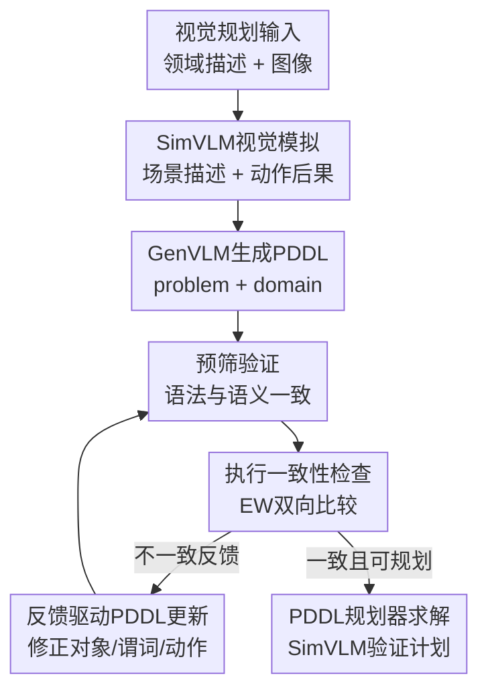

# Simulation to Rules: A Dual-VLM Framework for Formal Visual Planning

**会议**: ICLR 2026  
**OpenReview**: [https://openreview.net/forum?id=7tlLpQpGlx](https://openreview.net/forum?id=7tlLpQpGlx)  
**论文**: [Project Page](https://sites.google.com/view/vlmfp)  
**代码**: 待发布  
**领域**: 多模态VLM / 视觉规划  
**关键词**: 双VLM, 视觉规划, PDDL, 动作模拟, 符号规划  

## 一句话总结
VLMFP 用一个擅长视觉空间理解和动作模拟的 SimVLM 去监督一个擅长 PDDL 生成的 GenVLM，把视觉规划任务从图像自动转成可由形式化规划器求解的 problem/domain PDDL，并在网格世界与 3D 任务上显著优于直接 VLM 规划和无反馈的 PDDL 生成基线。

## 研究背景与动机
**领域现状**：长时序规划任务常见于机器人装配、多机器人协作、导航和游戏环境。纯 LLM 或 VLM 可以读自然语言和图像，也能直接给出动作序列，但在多步约束、空间关系和动作前后状态变化上很容易失稳。另一类方法把任务交给 PDDL 规划器：只要 domain file 正确描述动作规则，problem file 正确描述当前实例，规划器就能稳定搜索长视野解。

**现有痛点**：PDDL 的强项也是它的门槛。problem PDDL 要把某张图里的对象、位置、初始状态和目标写准；domain PDDL 则要把一类任务的通用规则写准，例如 FrozenLake 里不能踩冰洞，Package 里只能打开面朝方向上的包裹，Overcooked 里还要处理多角色和食材状态。已有 VLM+PDDL 工作多半只让 VLM 从图像生成 problem file，并假设 domain file 已由专家提供；一旦没有人工规则文件，规划器就无从工作。

**核心矛盾**：图像到 PDDL 同时需要两种能力：视觉空间理解要细到对象位置、相邻关系和遮挡，形式化规则生成又要懂谓词、动作前提、动作效果和 PDDL 语法。单个大 VLM 往往两边都不够可靠：它可能看错位置，也可能漏掉动作前提；而没有真实环境交互时，生成的规则是否符合视觉世界也缺少可用的外部 oracle。

**本文目标**：作者要解决的是 OpenReview 论文标题里说的 "Simulation to Rules"：从视觉观察和自然语言规则出发，不依赖人工 domain PDDL、不访问真实环境，自动生成 problem PDDL 和 domain PDDL，再用形式化 planner 求解。更具体地说，系统需要先把图像解释成结构化场景，再生成候选 PDDL，随后发现 PDDL 执行结果和视觉世界模拟之间的差异，并把这些差异反馈给生成模型修正规则。

**切入角度**：作者没有让一个模型同时承担所有职责，而是把能力拆给两个 VLM。小型但微调过的 SimVLM 负责视觉场景描述、动作后果模拟和目标是否达成判断；大型 GenVLM 负责 PDDL problem/domain 生成与修正。这个分工的关键观察是：视觉世界的短动作模拟可以当作一种“无环境交互的替代反馈”，用来检查符号世界的动作规则是否真实。

**核心 idea**：用 SimVLM 产生的视觉动作模拟结果，迭代校准 GenVLM 生成的 PDDL problem/domain，使形式化规划器看到的符号环境逐步逼近图像中的真实环境。

## 方法详解

### 整体框架
VLMFP 的输入是一段领域描述 $n_d$ 和一张问题设置图像 $i_p$，输出是可执行的 PDDL problem file、domain file，以及由 PDDL planner 找到并经 SimVLM 检查的动作计划。整体流程先让 SimVLM 从图像中写出场景描述 $n_p$，再让 GenVLM 根据 $n_d, i_p, n_p$ 生成候选 PDDL；随后系统用 PDDL validator 做语法/语义预筛，用随机动作序列比较 SimVLM 模拟与 PDDL 执行的一致性，最后把不一致反馈给 GenVLM 修正文件。

论文中的形式化写法也对应这个流程。第一步由 SimVLM $V_S$ 生成场景描述：$n_p = V_S(n_d, i_p)$；第二步由 GenVLM $V_G$ 生成初始 domain/problem 文件：$f_d^{(0)}, f_p^{(0)} = V_G(n_d, i_p, n_p)$。若检查阶段产生反馈 $s$，则 GenVLM 用上一轮文件和反馈继续更新：$f_d^{(t)}, f_p^{(t)} = V_G(n_d, i_p, n_p; s, f_d^{(t-1)}, f_p^{(t-1)})$。

### 关键设计
**1. SimVLM视觉模拟：把图像世界变成可检查的动作 oracle**

这篇论文最核心的第一步不是直接规划，而是训练一个能“看图后模拟动作”的 VLM。SimVLM 基于 Qwen2-VL-7B 微调，输入领域描述、图像和动作序列，输出三类信息：图像里的初始状态描述、每个动作的逐步执行理由与成功/失败结果、最终是否达成目标。这样一来，SimVLM 不只是把图像转文字，而是在局部动作层面提供一个可查询的参考世界模型。

这个设计针对的是 VLM 视觉规划里最难被发现的错误：模型说出的计划看似合理，但某一步其实撞墙、踩冰洞、没拿到对象，或者没有满足依赖关系。作者用 43 万条动作序列模拟数据覆盖 6 个网格世界、3 到 8 的地图大小、多种障碍概率和 5 到 6 种视觉外观，让 SimVLM 学会把对象位置和动作规则绑定起来。后续 GenVLM 生成的 PDDL 是否可信，并不只看语法，而是看它在随机动作上是否和 SimVLM 的视觉模拟结果一致。

**2. GenVLM生成PDDL：用大模型知识补齐形式化规则和实例描述**

GenVLM 使用 GPT-4o，负责生成两个文件：problem PDDL 描述当前实例中的对象、初始状态和目标；domain PDDL 描述同一类任务可复用的谓词和动作规则。作者强调 domain file 的难度更高，因为它必须概括整类环境，而不是只复述当前图像。例如 FrozenLake 的 problem file 可以列出冰洞坐标，但 domain file 必须写出移动动作需要满足的前提：目标相邻、当前 agent 位置正确、动作不能违反冰洞/边界等规则。

SimVLM 的场景描述在这里起到“视觉补偿”的作用。GenVLM 直接从图像生成 PDDL 容易漏行、漏对象或误解空间关系；把 SimVLM 输出的结构化自然语言场景描述作为中间层，可以把视觉识别问题变成更接近符号生成的问题。同时，GenVLM 的 PDDL 知识又补上了 SimVLM 不擅长的部分：谓词声明、类型系统、动作参数、precondition/effect 写法，以及 problem/domain 两个文件之间的兼容性。

**3. 执行一致性检查：用 EW 分数发现符号世界和视觉世界不一致的地方**

只做 PDDL validator 还不够，因为一个 PDDL 文件可以语法正确，却把规则写错。论文的关键检查是把随机动作序列分别放进两个世界里跑：一边由 SimVLM 判断动作在图像世界中是否可执行，另一边由生成的 PDDL domain/problem 判断动作在符号世界中是否可执行。如果 SimVLM 认为从冰洞上移动会失败，而 PDDL 还允许该动作，就说明 domain precondition 少了约束。

作者采用 Exploration Walk (EW) 分数衡量双向一致性。一方面从 SimVLM 可执行的长度为 $T$ 的动作序列分布 $P_{sim,T}$ 中采样，看 PDDL 环境是否也可执行；另一方面从 PDDL 环境可执行的序列分布 $P_{f_d,f_p,T}$ 中采样，看 SimVLM 是否同意。论文给出的整体分数是两个方向平均可执行率的调和式聚合：

$$
mEW(\hat d, \hat p)=2\left(\left(\frac{1}{T_{max}}\sum_{T=1}^{T_{max}}\mathbb{E}_{q\sim P_{sim,T}}[E_{f_d,f_p}(q)]\right)^{-1}+\left(\frac{1}{T_{max}}\sum_{T=1}^{T_{max}}\mathbb{E}_{q\sim P_{f_d,f_p,T}}[E_{sim}(q)]\right)^{-1}\right)^{-1}
$$

这个分数的好处是不会只检查“PDDL 是否过松”或“PDDL 是否过严”其中一边。若 PDDL 漏掉冰洞约束，它会允许视觉世界失败的动作；若 PDDL 少列相邻关系，它又会拒绝视觉世界可行的动作。两种错误都会产生可解释的不一致反馈，供下一轮更新使用。

**4. 反馈驱动PDDL更新：把失败动作转成可定位的规则修补**

当 EW 检查发现不一致时，系统不是简单要求 GenVLM “再试一次”，而是把错误动作、SimVLM 的理由、PDDL 的执行结果和当前 PDDL 文件一起交给 GenVLM。更新 prompt 要求 GenVLM 系统性检查谓词、动作、对象、类型、初始状态和目标，判断是 problem file 漏了对象/关系，还是 domain file 漏了动作前提/效果，再进行定点修改。

FrozenLake 示例最直观：初始 domain PDDL 允许 agent 从 `pos-1-1` 向右移动到 `pos-1-2`，但 SimVLM 根据图像判断 `pos-1-2` 是冰洞，动作应失败。反馈进入 GenVLM 后，模型推断 `move-right` 的 precondition 不完整，于是在目标位置加入类似 `(not (ice-hole ?to))` 的约束。这个过程把“视觉模拟中的失败原因”翻译成“符号规则里的缺失谓词或前提”，也是题目中从 simulation 到 rules 的具体含义。

### 一个完整示例
以论文图 2 的 FrozenLake 为例，输入是一段规则描述和一张 4x4 地图。SimVLM 先识别出 agent 在 `pos-1-1`，目标在 `pos-4-4`，若干冰洞分布在 `pos-1-2`、`pos-1-4` 等位置，并把目标描述成“agent 到达 `pos-4-4`”。GenVLM 据此生成 problem PDDL，把所有位置、冰洞和上下左右相邻关系写进 `:objects` 与 `:init`；同时生成 domain PDDL，定义 `at`、`ice-hole`、移动方向谓词和四个移动动作。

接着系统抽样两条动作序列。对于 `move down, move right`，SimVLM 判断第一步可以从 `pos-1-1` 到 `pos-2-1`，第二步也在规则允许范围内，PDDL 环境若给出相同可执行结果，则这条序列一致。对于 `move right`，SimVLM 判断 agent 会从 `pos-1-1` 进入 `pos-1-2` 的冰洞而失败，但生成的 PDDL 却允许执行，EW 分数因此下降。GenVLM 收到反馈后把移动动作的前提改成“目标格不是冰洞”，下一轮随机探索若都一致，planner 再搜索一条到达 `pos-4-4` 的动作计划，并由 SimVLM 验证目标确实达成。

### 损失函数 / 训练策略
SimVLM 的训练是监督微调而不是强化学习。作者用 6 个网格世界领域构造 43 万条数据，每条数据包含图像、领域描述、动作序列以及固定格式输出；微调 Qwen2-VL-7B 时训练 3 个 epoch，学习率 $1\times10^{-5}$，batch size 为 2，使用 10% 数据做验证并选择验证损失最低的模型。评价时使用严格的字符串匹配来检查 Task Description、Execution Reason、Execution Result 和 Goal Reach 四类输出。

GenVLM 不训练，而是通过 prompt 和外部工具闭环工作。系统最多进行 5 轮 PDDL 重新生成预筛，更新循环最多 4 轮；当 EW 分数达到 1.0 且 planner 找到的 plan 被 SimVLM 判断为有效时停止。若未完全收敛，系统仍返回当前 PDDL 文件，因为有时 problem file 出错但 domain file 已具备跨实例复用价值。

## 实验关键数据

### 主实验
论文先评估 SimVLM 本身，再评估 VLMFP 端到端规划。SimVLM 在 6 个网格世界上测试 seen appearance 与 unseen appearance，每个领域每种设置 1000 个随机样本；VLMFP 使用 15 个输入实例生成可复用 domain，再对 100 个新问题实例测试，报告 1500 次试验的平均成功率。

| 模块 / 设置 | Seen appearance 平均 | Unseen appearance 平均 | 说明 |
|--------|------|------|------|
| SimVLM Task Description | 95.5% | 82.6% | 图像场景描述严格字符串匹配 |
| SimVLM Execution Reason | 85.7% | 88.1% | 逐步动作理由匹配 |
| SimVLM Execution Result | 85.5% | 87.8% | 每步动作成功/失败判断 |
| SimVLM Goal Reach | 82.4% | 85.6% | 最终是否达成目标 |
| SimVLM overall average | 87.3% | 86.0% | 六个网格世界平均 |

| 方法 | Seen 平均成功率 | Unseen 平均成功率 | 相对最强 GPT-4o 基线提升 |
|------|---------|------|------|
| Direct GPT-4o | 1.3% | 1.7% | VLM 直接规划几乎不可用 |
| Direct GPT-5 | 11.8% | 10.0% | 更强模型仍难做长视野视觉规划 |
| CoT GPT-4o | 1.7% | 2.0% | Chain-of-thought 不能解决符号一致性 |
| CoT GPT-5 | 12.7% | 12.0% | 推理提示有帮助但仍低 |
| CodePDDL GPT-4o | 30.7% | 32.3% | 有 SimVLM 场景描述但无更新闭环 |
| VLMFP GPT-4o | 70.0% | 54.1% | 相比 CodePDDL 分别提升 39.3 和 21.8 个百分点 |

网格世界的领域差异也很明显。FrozenLake 和 Maze 规则简单，CodePDDL 已能达到较高成功率，但 VLMFP 仍更好；Sokoban、Package、Printer 和 Overcooked 涉及对象状态、朝向、多对象交互或多 agent，普通 PDDL 生成很容易漏掉动作约束，VLMFP 的反馈更新优势更明显。例如 Sokoban seen setting 中 CodePDDL 为 0.0%，VLMFP 达到 55.8%；Printer seen setting 中 CodePDDL 为 7.2%，VLMFP 达到 58.7%。

### 消融实验
论文对 VLMFP 的三个关键组件做移除实验：无预筛、无反馈、无更新。这里的成功率是在 6 个网格世界 seen appearance 上的平均或分领域结果。

| 配置 | FrozenLake | Maze | Sokoban | Package | Printer | Overcooked | 平均 |
|------|---------|------|------|------|------|------|------|
| No Prescreening | 94.3 | 62.5 | 23.9 | 56.9 | 37.3 | 10.3 | 47.5 |
| No Feedback | 95.5 | 84.9 | 38.0 | 58.9 | 53.4 | 35.9 | 61.1 |
| No Update | 88.1 | 87.5 | 0.0 | 0.0 | 7.2 | 1.1 | 30.7 |
| VLMFP | 95.2 | 88.7 | 55.8 | 75.2 | 58.7 | 46.2 | 70.0 |

### 关键发现
- 更新步骤是最大贡献项。No Update 基本退化成 CodePDDL，在 Sokoban、Package、Overcooked 等复杂领域接近失败，说明仅生成 PDDL 不足以获得可靠 domain rules。
- 预筛和反馈也不是装饰。No Prescreening 平均从 70.0% 降到 47.5%，说明语法/语义不一致会污染后续执行比较；No Feedback 降到 61.1%，说明只知道分数不够，模型需要具体失败动作和原因来修正规则。
- SimVLM 的场景描述在 unseen appearance 上下降较多，但动作执行结果和目标判断并没有同步大幅下降。作者解释为：有些对象识别错误不一定被采样动作触及，因此局部动作模拟仍然可靠。
- 在 3D 任务上，VLMFP 也能工作。Assembly 的 VLMFP 成功率为 92.4% / 85.9%（seen/unseen），MultiRob 为 80.3% / 73.6%，说明方法不是只能用于 2D 网格图像。
- 对未知游戏规则，SimVLM 在相近规则变体上表现较好，但遇到全新的 freezing mechanic 时会出现“能解释规则但不会在执行中应用”的失败，暴露了训练分布外动力学的限制。

## 亮点与洞察
- 最大亮点是把视觉动作模拟当成 PDDL domain 生成的反馈源。很多视觉规划论文只讨论“看图生成计划”，这篇则进一步把计划空间形式化，让 VLM 的短程模拟去修补符号规则。
- 双 VLM 分工很合理：小模型微调成视觉世界模拟器，大模型保留通用推理和 PDDL 知识。这个结构比“一个大模型全包”更容易分析错误，也更容易替换组件。
- EW 双向一致性是一个实用检查。只从 PDDL 可执行序列出发会漏掉过严规则，只从 SimVLM 可执行序列出发会漏掉过松规则；双向采样能同时发现“该能做却不能做”和“不该能做却能做”。
- 论文把 domain PDDL 的可复用性讲清楚了。problem file 只服务当前图像，domain file 一旦被修正，就能迁移到同一领域的新实例，实验协议也正是用一个输入实例去测试 100 个新实例。
- 对机器人/具身智能的启发很直接：真实环境交互昂贵或危险时，可以先用受训练的视觉模拟器给符号规则生成器提供软反馈，再把候选计划交给更严格的执行器或 verifier。

## 局限与展望
- SimVLM 仍然是经验 oracle，而不是真实环境。若 SimVLM 看错对象、误解未见规则或在长动作序列中累积错误，PDDL 更新会被带偏；论文的 failure analysis 也显示 Sokoban 和 Overcooked 的 unseen appearance 更容易出现感知错误。
- domain 生成仍依赖大型闭源 GenVLM 和 prompt 工程。GPT-4o 的 PDDL 能力、函数式修改接口和多轮反思 prompt 都是系统成功的一部分，换成更弱模型时稳定性未必相同。
- EW 检查基于随机 action sequence，不能穷尽整个状态空间。复杂 domain 中可能存在没有被采样到的动作组合或边界条件，导致生成 domain 在测试实例上仍失败。
- 3D 实验展示了可扩展性，但仍是合成或受控任务，并非真实机器人闭环执行。真实场景中的连续控制误差、物理接触、传感器噪声和安全约束还需要额外模块处理。
- 未来可以把 SimVLM 从领域微调模型升级成更通用的视觉世界模型，结合形式化 verifier、类型检查器、counterexample-guided synthesis 或主动采样，让 PDDL 规则修补覆盖更多状态空间。

## 相关工作与启发
- **vs 直接 VLM 规划 / CoT 规划**: 直接让 GPT-4o 或 GPT-5 从图像输出动作序列，在这篇实验里平均成功率很低。本文的区别是把长视野搜索交给 PDDL planner，让 VLM 负责它更适合的翻译、模拟和反馈生成。
- **vs LLM+P / Formal-LLM 类文本到 PDDL 方法**: 这类方法多从自然语言描述生成 planning goal 或 PDDL，并常依赖已有 domain、人工修正或文本输入。VLMFP 面向视觉输入，同时尝试自动生成 problem 和 domain 两个文件。
- **vs Vision-Language Interpreter / VLM+PDDL problem generation**: 这些工作通常把 VLM 用作图像到 problem file 的解释器，domain file 由专家给出。本文最关键的增量是让 domain file 也由模型生成，并通过 SimVLM 执行一致性修正。
- **vs environment-interaction PDDL translation**: Mahdavi 等工作利用真实或模拟环境交互来发现生成 PDDL 的错误。VLMFP 没有环境访问，而是用 SimVLM 的视觉动作模拟替代环境反馈，适合无法频繁试错的视觉规划场景。
- **对后续研究的启发**: 可以把“模型生成规则 + 世界模型找反例 + 形式系统验证”看成一个通用范式。它不只适用于 PDDL，也可能迁移到任务图生成、机器人技能约束、游戏规则归纳和具身 agent 的安全策略合成。

## 评分
- 新颖性: ⭐⭐⭐⭐⭐ 双 VLM + SimVLM 反馈修正 domain PDDL 的设定很鲜明，尤其强调无人工 domain、无环境访问。
- 实验充分度: ⭐⭐⭐⭐☆ 6 个网格世界、外观泛化、规则泛化、组件消融和 3D 任务都覆盖到了，但真实机器人验证还不足。
- 写作质量: ⭐⭐⭐⭐☆ 主线清晰，图 2 示例很有帮助；部分 prompt 和实现细节放在附录，读方法时需要前后跳转。
- 价值: ⭐⭐⭐⭐⭐ 对视觉规划、具身智能和符号-神经结合都很有参考价值，尤其适合需要把视觉场景转成可验证计划的任务。

<!-- RELATED:START -->

## 相关论文

- [\[CVPR 2026\] SIMPACT: Simulation-Enabled Action Planning using Vision-Language Models](../../CVPR2026/multimodal_vlm/simpact_simulation-enabled_action_planning_using_vision-language_models.md)
- [\[ICLR 2026\] DualToken: Towards Unifying Visual Understanding and Generation with Dual Visual Vocabularies](dualtoken_towards_unifying_visual_understanding_and_generation_with_dual_visual_.md)
- [\[ICLR 2026\] Fed-Duet: Dual Expert-Orchestrated Framework for Continual Federated Vision-Language Learning](fed-duet_dual_expert-orchestrated_framework_for_continual_federated_vision-langu.md)
- [\[ICLR 2026\] K-Sort Eval: Efficient Preference Evaluation for Visual Generation via Corrected VLM-as-a-Judge](k-sort_eval_efficient_preference_evaluation_for_visual_generation_via_corrected_.md)
- [\[ICLR 2026\] ScaleCap: Scalable Image Captioning via Dual-Modality Debiasing](scalecap_scalable_image_captioning_via_dual-modality_debiasing.md)

<!-- RELATED:END -->
