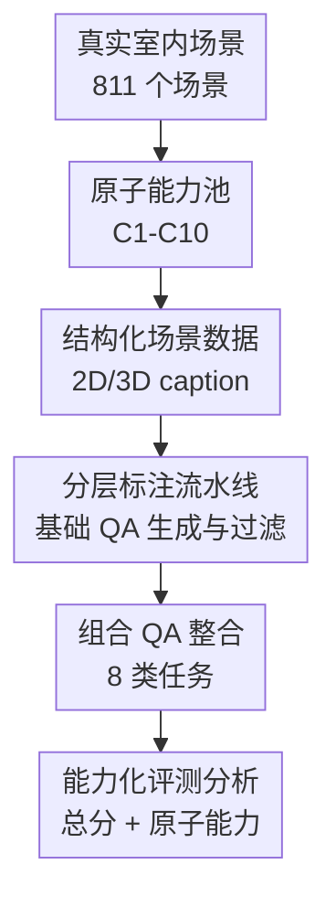

# SpaCE-10: A Comprehensive Benchmark for Multimodal Large Language Models in Compositional Spatial Intelligence

**会议**: ICLR 2026  
**OpenReview**: [https://openreview.net/forum?id=Df7UjwEgIx](https://openreview.net/forum?id=Df7UjwEgIx)  
**代码**: https://github.com/VisionXLab/SpaCE-10  
**领域**: 多模态VLM  
**关键词**: 组合空间智能, 多模态大模型评测, 空间推理, 3D场景理解, 多视角融合  

## 一句话总结
SpaCE-10 构建了一个面向 MLLM 的组合空间智能基准：先把真实室内场景中的空间能力拆成 10 个原子能力，再组合成 8 类 QA 任务，并用 811 个真实场景、5k+ 高质量问答系统揭示当前模型在多视角、计数、反向推理和具身视角理解上的明显短板。

## 研究背景与动机
**领域现状**：多模态大语言模型已经在图文问答、图像理解、视频理解等任务上进展很快，很多模型也开始被期待用于机器人、导航、室内助手这类真实空间任务。真实任务并不是单纯看见一个物体就结束，例如“去床头柜附近拿手表”同时需要识别物体、定位床头柜、理解“附近”、在多个视角中找目标、判断路径并执行行动。

**现有痛点**：已有空间智能基准大多只覆盖少量场景或单一能力。有些 3D QA 数据集关注点云问答，但问题往往更像普通场景问答；有些新近 VLM 空间基准包含更复杂的问题，却没有显式说明一道题到底考察哪些空间能力。因此，模型分数低时很难知道是不会识别物体、不会多视角融合、不会计数，还是不会把多个能力组合起来。

**核心矛盾**：真实空间任务要求模型把多个基础能力临场组合起来，但评测体系往往把空间智能当成一个黑盒总分。只看总准确率会遮住能力结构：两个模型总分接近，可能一个擅长大小比较、另一个擅长计数；一个模型在单选题不错，也可能在多选或反向问题里完全崩掉。

**本文目标**：作者希望把 MLLM 的空间智能评测从“问一些空间题”推进到“按能力组织的问题体系”。具体来说，SpaCE-10 要回答三个问题：哪些原子空间能力对真实任务关键；这些能力如何组合成可评测的 QA 类型；当前 MLLM 在原子能力和组合能力上的瓶颈分别是什么。

**切入角度**：论文从真实室内扫描场景出发，而不是只用合成几何或单张图片。这样做的好处是，模型需要面对真实房间里的遮挡、视角变化、物体功能、局部关系和全局路径，而这些正是未来具身智能和空间助手无法绕开的因素。

**核心 idea**：用“10 个原子空间能力 + 8 类组合 QA + 分层半自动标注流水线”构建一个可诊断的空间智能 benchmark，让评测不仅给出总分，还能指出模型到底卡在哪些能力组合上。

## 方法详解
### 整体框架
SpaCE-10 不是提出一个新模型，而是提出一个空间智能评测基准。它先从 4 个真实 3D 室内场景数据集中收集多视角快照和视频帧，再把场景转成结构化描述，基于这些描述生成基础 QA，最后通过能力整合把单一问题升级为组合空间问题，并用人工过滤保证答案可靠。

整体上，论文的构建逻辑是“真实场景采集 → 结构化场景表示 → 基础 QA 生成 → 组合能力整合 → 大规模模型评测”。这个流程和关键设计是一一对应的：原子能力池定义了评测语言，分层标注流水线保证数据质量，组合 QA 策略把能力之间的相互作用显式放进题目，能力化分析则把实验结果拆回到具体能力上。

### 关键设计
**1. 原子能力池：把空间智能拆成可诊断的 10 个部件**

SpaCE-10 的第一个关键点是先定义能力，而不是先堆题目。作者把空间智能拆成 C1-C10：物体识别、空间定位、空间关系、大小比较、计数、功能知识、多视角融合、正向理解、反向推理、情境观察。这些能力覆盖了从“看见什么”到“站在某个位置想象关系”的完整链条。

这种拆法的价值在于，它给每道题都附上了能力标签。例如实体计数需要 C1、C2、C5、C7、C8；功能推理则进一步需要 C3、C6、C9、C10。这样模型做错一道功能题时，错误不再只是一个总分扣分，而可以被解释为多视角融合、反向推理、功能知识或情境观察的组合失败。论文后面的能力矩阵分析正是建立在这个映射上。

**2. 分层标注流水线：先构造结构化场景，再生成可控 QA**

直接让 MLLM 从图像生成复杂空间题很容易失控：题目可能提到不存在的物体，选项可能不唯一，空间关系也可能和真实场景不一致。SpaCE-10 因此采用分层流水线。第一阶段由 3 位人工专家从 4 到 6 个方向采集 3D 点云快照，总计投入 38 小时以上；第二阶段从视频中用 CLIP encoder 和 k-means 选出 10 个关键帧，再由 GPT-4o 生成 2D caption，并用 GPT-4o inspector 删除错误和冗余信息。

随后，人工采集的 3D 快照会和 2D 关键帧一起用于生成 3D caption，inspector 再次检查，最后用规则抽取器得到结构化场景数据。这个设计的核心不是“用 GPT 生成数据”这么简单，而是把生成过程放在结构化数据和人工过滤之间：模型负责扩大候选 QA 的覆盖面，人类负责把错误选项、无效答案、缺失数据、场景中不存在的物体过滤掉。最终人工过滤又投入 112 小时以上，留下 8k+ 经过筛选的 QA，并整合成 5k+ 最终问答。

**3. 组合 QA 整合：用选项重组逼模型真正跨视角和反向推理**

SpaCE-10 最有意思的地方是，它不是只把基础题原样放进数据集，而是把基础 QA 重新组合成更接近真实任务的题。对于大小比较、物体-物体关系、物体-场景关系，基础题通常只围绕同一对物体或单一视角。论文把同场景、同类型的多个基础题选项重组到一个问题中，使每个选项指向不同物体或不同位置。这样模型不能只盯着局部截图，而必须搜索整间房间并融合多个视角，对应 C7 多视角融合。

对于 Entity Presence，作者把简单的“某物是否存在”反转成“哪个选项不包含任何场景中存在的物体”。这一步把直接识别变成反向推理：模型不仅要找存在的东西，还要判断一组物体是否全部不存在。对于 Functional Reasoning，题目进一步要求模型判断某个中心物体附近是否存在能完成某功能的物体，同时确认缺少另外两类功能物体。这就把空间邻接、功能知识、多视角融合、反向推理和情境观察压到一道题里，能明显拉开模型能力差距。

**4. 能力化评测：总准确率之外再看原子能力矩阵**

论文没有停留在排行榜，而是把 QA 类型映射回 C1-C10，构造模型在原子能力上的平均表现。其基本思想是：若某个 QA 类型涉及某个能力，就把该任务准确率纳入该能力分数；由于这个矩阵是不按任务样本数加权的，它比总准确率更像“能力剖面”。

这个设计揭示了一个重要现象：相似总分不代表相似能力。例如 GLM-4.5V、LLaVA-OneVision-72B、InternVL3.5-241B 的总分接近，但能力平均值和具体短板不同。论文还发现 C4 大小比较普遍较强，而 C5 计数普遍最弱；即使 InternVL3.5-241B 总体最强，C5 也只有 37.5%，远低于人类的 89.9%。这说明空间智能的瓶颈并不会被模型规模自然抹平，训练数据、架构和后训练策略都可能更关键。

### 一个完整示例
以论文中的 Functional Reasoning 为例，基础题可能是：“床附近哪个物体的功能描述正确？”选项只需要判断“柜子能储物”“拖把能清洁地面”这类物体功能，以及它们是否在床附近。这个基础版本已经包含物体识别、空间定位、空间关系、功能知识，但仍比较局部。

SpaCE-10 的组合版本会把问题改成“以下哪个描述是正确的？”每个选项都换成不同中心物体，例如“床附近有一个能储物的物体，但缺少能清洁地面和通风的两个物体”“柜子附近有一个能检查外貌的物体，但缺少能通风和休息的两个物体”。这时模型必须先在多个视角中找到中心物体，再判断其邻接物体，再把每个邻接物体映射到功能，最后还要做“有一个存在、另外两个不存在”的反向判断。

这个例子体现了 SpaCE-10 的核心评测思想：真实空间任务的难点不是某个单点能力，而是多个看似基础的能力在同一道问题里互相依赖。只要其中一个环节断掉，最终答案就会错。

## 实验关键数据
### 主实验
SpaCE-10 在近 50 个闭源与开源 MLLM 上做评测，包含 GPT-5、GPT-4o、Claude-3.7-Sonnet、Gemini-2.0-Flash-Thinking、InternVL 系列、Qwen2.5-VL 系列、LLaVA-OneVision、GLM-4.5V，以及 3D MLLM LEO 和 GPT4Scene。评测主要用 LMMs-Eval，以 8 帧图像作为输入；LEO 由于原本需要问题相关物体点云，作者改为从整场景点云随机采样 1024 点以保持比较一致。

| 模型/类别 | Overall | 代表强项 | 主要观察 |
|--------|------|--------|--------|
| Human | 91.2 | 各类任务均显著领先 | 人类在复杂数值和推理题上也非满分，但远高于所有 MLLM |
| InternVL3.5-241B-A28B | 55.0 | EP 64.2, SA 68.2, OO 63.5 | 最强开源模型，总分第一，但离人类仍差 36.2 个百分点 |
| GPT-5 | 53.4 | SA 71.0, FR 66.8, OO 60.7 | 最强闭源模型之一，感知类和功能推理较好，空间规划仍弱 |
| LLaVA-OneVision-72B | 52.8 | FR 67.3, SA 67.9, OO 64.5 | 大规模开源 2D MLLM 接近闭源模型表现 |
| GPT-4o-2024-11-20 | 49.0 | EQ 58.3, OO 58.3, OS 56.2 | 计数相对较强，但 SP 只有 23.7 |
| GPT4Scene-7B | 34.5 | 3D 场景输入相关能力 | 明显强于 LEO，但仍落后主流 2D MLLM |
| LEO-7B | 11.1 | 无明显优势 | 整场景点云输入下表现很弱，说明现有 3D MLLM 不擅长全局场景问答 |

这个表最直接的结论是：当前最强 MLLM 在组合空间智能上还远没有达到人类水平。更值得注意的是，2D MLLM 在 SpaCE-10 上明显强于现有 3D MLLM，论文认为这可能是因为许多 3D MLLM 更偏对象中心设计，难以直接处理整场景点云，也可能牺牲了通用多模态对话和推理能力。

### 消融实验
论文的“消融”更像是能力整合实验：同一类问题在基础版本和组合版本之间比较，观察加入多视角融合、反向推理、情境观察后模型性能如何变化。作者选取 InternVL2.5-1B、InternVL2.5-8B、Qwen2.5-VL-3B、Qwen2.5-VL-7B 四个模型，比较 5 类任务的基础 QA 与组合 QA。

| 任务 | 基础能力 | 额外整合能力 | 基础平均 | 组合平均 | 下降 |
|------|----------|--------------|----------|----------|------|
| SA | C1,C2,C4,C8 | +C7 | 57.3 | 38.2 | -19.1 |
| OO | C1,C2,C3,C8,C9,C10 | +C7 | 54.0 | 46.4 | -7.6 |
| OS | C1,C2,C3,C9,C10 | +C7 | 51.0 | 30.0 | -21.0 |
| EP | C1,C2,C8 | +C7,C9 | 67.8 | 26.8 | -41.0 |
| FR | C1,C2,C3,C6,C8 | +C7,C9,C10 | 83.0 | 42.8 | -42.9 |

这组结果很好地说明了 benchmark 的区分度。只加入 C7 多视角融合时，SA 和 OS 下降已经超过 19 个百分点；当 EP 加入 C7 和 C9 后，平均准确率从 67.8 掉到 26.8；FR 加入 C7、C9、C10 后从 83.0 掉到 42.8。换句话说，当前模型并不是完全不会基础空间题，而是在多能力组合时迅速失稳。

| 模型 | Single-choice Overall | Multiple-choice Overall | Multiple/Single |
|------|-----------------------|-------------------------|-----------------|
| InternVL2.5-1B | 32.3 | 3.0 | 0.09 |
| InternVL2.5-8B | 45.0 | 10.6 | 0.24 |
| InternVL2.5-38B | 49.2 | 32.2 | 0.65 |
| InternVL2.5-78B | 51.6 | 28.5 | 0.55 |
| Qwen2.5-VL-3B | 38.6 | 17.9 | 0.46 |
| Qwen2.5-VL-72B | 40.6 | 15.0 | 0.37 |
| LLaVA-OneVision-72B | 57.3 | 30.9 | 0.54 |

多选实验进一步暴露了格式脆弱性。小模型在单选上可以达到 30%-45%，但多选往往接近崩溃，InternVL2.5-1B 的多选只有 3.0。大模型更稳一些，但也没有真正解决多答案组合判断。这说明模型可能学会了单选题的作答模式，却没有掌握足够稳健的空间证据整合。

### 关键发现
- 当前 MLLM 与人类差距巨大：最佳模型 55.0，对比人类 91.2，说明组合空间智能仍是明显短板。
- 2D MLLM 在该基准上强于 3D MLLM：这不是说 3D 输入无用，而是说明现有 3D MLLM 的整场景推理和通用对话能力仍不足。
- 组合能力比单项能力难得多：EP 与 FR 在加入多视角、反向推理和情境观察后分别下降 41.0 和 42.9 个百分点。
- 计数是最稳定的瓶颈：C5 在几乎所有模型上都弱，InternVL3.5-241B 的 C5 只有 37.5，而人类为 89.9。
- 总准确率不能替代能力分析：模型的总分相近时，能力剖面可能完全不同，未来评测需要同时看任务完成率和能力覆盖。

## 亮点与洞察
- SpaCE-10 的亮点在于“能力先行”的 benchmark 设计。很多数据集先收集题目再归纳类型，而这里先定义 C1-C10，再把 QA 类型映射到能力组合，使评测结果可以被诊断而不是只用于排名。
- 组合 QA 的设计很聪明，尤其是把多个基础选项重组到同一道题中。这个操作成本不高，却能把局部识别题变成全场景、多视角、反向判断题，逼模型真正利用空间结构。
- 论文对 2D 与 3D MLLM 的比较很有启发。现阶段“输入是 3D”并不自动意味着“空间智能更强”，如果模型架构和训练目标仍偏对象中心，它可能反而不如强大的 2D 多模态模型。
- 能力矩阵比排行榜更有研究价值。它告诉我们下一步不该只追求总分提升，而要针对 C5 计数、C3 空间关系、C10 情境观察这些具体短板设计训练数据和后训练任务。
- 这套思想可以迁移到机器人评测和 embodied agent 训练中。与其只看导航成功率，不如把失败拆成目标识别、视角转换、路径规划、反向约束和功能常识等能力维度。

## 局限与展望
- SpaCE-10 虽然覆盖 811 个真实室内场景，但主要仍是室内扫描场景，尚未覆盖户外、动态交互、真实机器人执行误差等更复杂环境。
- 评测形式以 QA 为主，模型只需回答选项，不需要真的执行导航、抓取或规划动作。因此它更像空间理解和推理的中间评测，而不是完整具身任务评测。
- 结构化描述和部分 QA 生成依赖 GPT-4o，再通过人工过滤控制质量。这种流程能提高效率，但仍可能留下由生成模型偏好带来的题型分布或语言风格偏差。
- 能力分数由 QA 类型映射和平均得到，并不是严格隔离单一能力的因果测量。一道题涉及多个能力时，错误到底由哪个能力导致仍需要更细粒度的干预实验。
- 后续可以把 SpaCE-10 扩展成训练闭环：根据模型在 C5、C7、C9、C10 的错误自动生成针对性数据，再检验能力提升是否能迁移到真实具身任务。

## 相关工作与启发
- **vs ScanQA / SQA3D**: 这些数据集主要推动 3D 场景问答和 situated QA，强调点云或特定视角下的问答；SpaCE-10 的区别是显式定义原子能力池，并把多个能力组合到 QA 类型中，更适合诊断 MLLM 的组合空间智能。
- **vs VSI / MMSI-Bench / OmniSpatial**: 这些较新的空间理解基准更接近 MLLM 评测，也包含多图或多视角空间推理；SpaCE-10 的优势在于覆盖 2D 与 3D 输入、多答案设置，以及能力映射矩阵，使实验分析不止停留在题型准确率。
- **vs Sparkle**: Sparkle 关注基础空间能力及其组合对泛化的影响，SpaCE-10 借鉴了能力拆解思路，但把方向、位置、大小、计数、功能、视角、反向推理等扩展到真实室内场景和 MLLM benchmark 中。
- **vs 3D-LLM / GPT4Scene / LEO**: 这些方法试图把 3D 世界接入大模型；SpaCE-10 则提供了一个压力测试环境，显示现有 3D MLLM 在整场景组合推理上仍明显不足。

## 评分
- 新颖性: ⭐⭐⭐⭐☆ 能力池 + 组合 QA + 能力矩阵的 benchmark 设计很清晰，创新主要在评测组织方式而非新模型。
- 实验充分度: ⭐⭐⭐⭐⭐ 覆盖近 50 个模型、单选/多选、2D/3D、基础/组合和原子能力分析，实验面很完整。
- 写作质量: ⭐⭐⭐⭐☆ 主线清楚，表格和附录信息丰富；少量表述和编号有些不一致，但不影响理解核心贡献。
- 价值: ⭐⭐⭐⭐⭐ 对 MLLM 空间智能、具身智能评测和能力导向训练都有直接参考价值，尤其适合用来定位模型的空间推理瓶颈。

<!-- RELATED:START -->

## 相关论文

- [\[CVPR 2026\] SpatialScore: Towards Comprehensive Evaluation for Spatial Intelligence](../../CVPR2026/multimodal_vlm/spatialscore_towards_comprehensive_evaluation_for_spatial_intelligence.md)
- [\[ICLR 2026\] MMSI-Bench: A Benchmark for Multi-Image Spatial Intelligence](mmsi-bench_a_benchmark_for_multi-image_spatial_intelligence.md)
- [\[ICLR 2026\] MME-Emotion: A Holistic Evaluation Benchmark for Emotional Intelligence in Multimodal Large Language Models](mme-emotion_a_holistic_evaluation_benchmark_for_emotional_intelligence_in_multim.md)
- [\[CVPR 2026\] Scaling Spatial Intelligence with Multimodal Foundation Models](../../CVPR2026/multimodal_vlm/scaling_spatial_intelligence_with_multimodal_foundation_models.md)
- [\[CVPR 2026\] Is your VLM Sky-Ready? A Comprehensive Spatial Intelligence Benchmark for UAV Navigation](../../CVPR2026/multimodal_vlm/is_your_vlm_sky-ready_a_comprehensive_spatial_intelligence_benchmark_for_uav_nav.md)

<!-- RELATED:END -->
